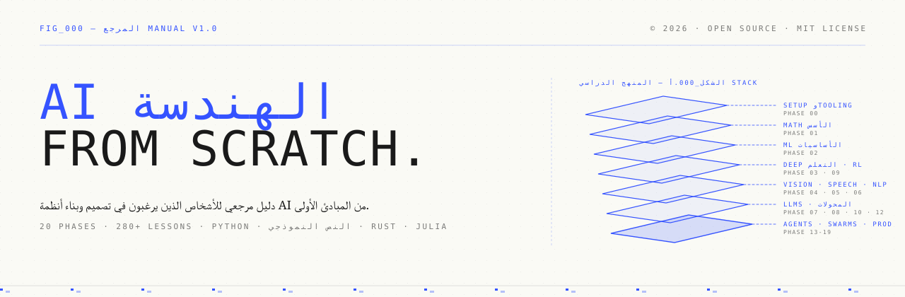
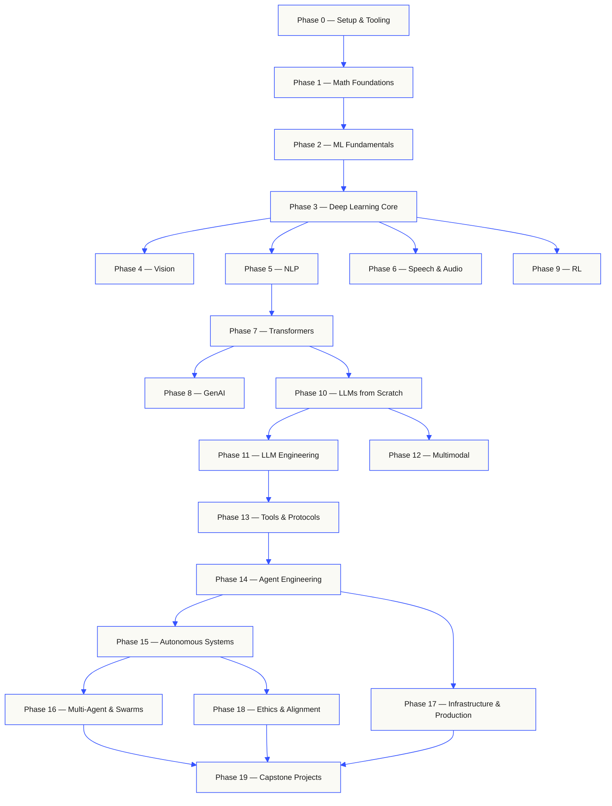
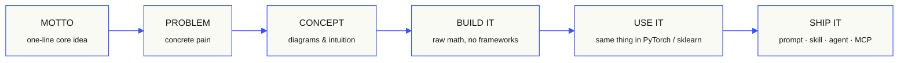
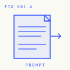
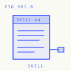
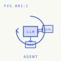
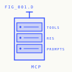

<p align="center">
  
</p>

<p align="center">
  <a href="LICENSE"></a>
  <a href="ROADMAP.md"></a>
  <a href="#contents"></a>
  <a href="https://github.com/youssefupone-cpu/ai-engineering-from-scratch-ar/stargazers"></a>
  <a href="https://aiengineeringfromscratch.com"></a>
</p>

```
░░░▒▒▒░░░▒▒▒░░░▒▒▒░░░▒▒▒░░░▒▒▒░░░▒▒▒░░░▒▒▒░░░▒▒▒░░░▒▒▒░░░▒▒▒░░░▒▒▒░░░▒▒▒░░░▒▒▒░░░▒▒▒░░░▒▒▒
```

> **84% من الطلاب يستخدمون بالفعل أدوات AI. 18% فقط يشعرون بالاستعداد لاستخدامها
> مهنيًا. ** هذا المنهج يسد هذه الفجوة.
>
> 435 درسًا. 20 مرحلة. ~ 320 ساعة. بايثون، TypeScript، Rust، جوليا. كل درس السفن
> قطعة أثرية قابلة لإعادة الاستخدام: موجه، مهارة، وكيل، خادم MCP. مجاني، مفتوح المصدر، MIT.
>
> أنت لا تتعلم فقط AI. أنت تبنيه. نهاية إلى نهاية. باليد.

## How this works

يتم تدريس معظم مواد AI في أجزاء متفرقة. ورقة هنا، وظيفة ضبط دقيقة هناك، أ
عرض وكيل مبهرج في مكان آخر. نادرا ما تصطف القطع. يمكنك شحن chatbot ولكن لا يمكنك ذلك
شرح منحنى الخسارة. يمكنك ربط وظيفة بالوكيل ولكن لا يمكنك تحديد ما يفعله الاهتمام
داخل النموذج الذي يطلق عليه.

هذا المنهج هو العمود الفقري. 20 مرحلة، 435 درسًا، أربع لغات: بايثون، TypeScript،
Rust، جوليا. الجبر الخطي في أحد الطرفين، والأسراب المستقلة في الطرف الآخر. كل خوارزمية
يتم بناؤه من الرياضيات الخام أولاً. دعامة خلفية. رمز مميز. انتباه. حلقة الوكيل. بحلول الوقت
يظهر PyTorch، فأنت تعرف بالفعل ما يفعله تحت الغطاء.

يقوم كل درس بتنفيذ نفس الحلقة: اقرأ المشكلة، واستنتج العمليات الحسابية، واكتب الكود، ثم قم بالتشغيل
الاختبار، والحفاظ على قطعة أثرية. لا توجد مقاطع فيديو مدتها خمس دقائق، ولا يتم نشر النسخ واللصق، ولا يتم الإمساك باليد.
مجاني ومفتوح المصدر ومصمم للتشغيل على الكمبيوتر المحمول الخاص بك.

```
░░░▒▒▒░░░▒▒▒░░░▒▒▒░░░▒▒▒░░░▒▒▒░░░▒▒▒░░░▒▒▒░░░▒▒▒░░░▒▒▒░░░▒▒▒░░░▒▒▒░░░▒▒▒░░░▒▒▒░░░▒▒▒░░░▒▒▒
```

## The shape of the curriculum

عشرون مرحلة مكدسة فوق بعضها البعض. الرياضيات هي الكلمة. الوكلاء والإنتاج هم السقف.
قم بالتخطي للأمام إذا كنت تعرف الطبقات السفلية بالفعل، ولكن لا تتخطى ثم تتساءل عن سبب حدوث شيء ما
الجزء العلوي ينكسر.



```
░░░▒▒▒░░░▒▒▒░░░▒▒▒░░░▒▒▒░░░▒▒▒░░░▒▒▒░░░▒▒▒░░░▒▒▒░░░▒▒▒░░░▒▒▒░░░▒▒▒░░░▒▒▒░░░▒▒▒░░░▒▒▒░░░▒▒▒
```

## The shape of a lesson

يوجد كل درس في مجلد خاص به، بنفس البنية عبر المنهج بأكمله:

```
phases/<NN>-<phase-name>/<NN>-<lesson-name>/
├── code/      runnable implementations (Python, TypeScript, Rust, Julia)
├── docs/
│   └── en.md  lesson narrative
└── outputs/   prompts, skills, agents, or MCP servers this lesson produces
```

كل درس يتبع ستة نبضات. إن تقسيم *Build It/Use It* هو العمود الفقري — حيث تقوم بتنفيذ
الخوارزمية من الصفر أولاً، ثم قم بتشغيل نفس الشيء من خلال مكتبة الإنتاج. أنت
افهم ما يفعله إطار العمل لأنك كتبت النسخة الأصغر بنفسك.



## Getting started

ثلاث طرق للداخل. اختر واحدة.

**الخيار أ — القراءة.** افتح أي درس مكتمل في
[aiengineeringfromscratch.com](https://aiengineeringfromscratch.com) أو افتح مرحلة من
[المحتويات](#contents). لا إعداد، لا استنساخ.

**الخيار ب — الاستنساخ والتشغيل.**

```bash
git clone https://github.com/youssefupone-cpu/ai-engineering-from-scratch-ar.git
cd ai-engineering-from-scratch-ar
python phases/01-math-foundations/01-linear-algebra-intuition/code/vectors.py
```

**الخيار ج — ابحث عن مستواك *(موصى به)*.** انتقل إلى الأمام بذكاء. داخل Claude أو Cursor أو Codex أو OpenClaw أو Hermes أو أي وكيل لديه مهارات المنهج المثبتة:

```bash
/find-your-level
```

عشرة أسئلة. قم بتعيين معرفتك إلى مرحلة البداية، وقم ببناء مسار شخصي خلال ساعة
التقديرات. بعد كل مرحلة:

```bash
/check-understanding 3        # quiz yourself on phase 3
ls phases/03-deep-learning-core/05-loss-functions/outputs/
# ├── prompt-loss-function-selector.md
# └── prompt-loss-debugger.md
```

### Prerequisites

- يمكنك كتابة التعليمات البرمجية (أي لغة؛ بايثون يساعد).
- أنت تريد أن تفهم كيفية عمل AI **في الواقع**، وليس مجرد الاتصال بـ APIs.

### Built-in agent skills (Claude, Cursor, Codex, OpenClaw, Hermes)

| مهارة | ماذا يفعل |
|---|---|
| [`/find-your-level`](.claude/skills/find-your-level/SKILL.md) | اختبار تحديد المستوى من عشرة أسئلة. قم بتعيين معرفتك إلى مرحلة البداية وإنتاج مسار مخصص مع تقديرات الساعات. |
| [`/check-understanding <phase>`](.claude/skills/check-understanding/SKILL.md) | اختبار لكل مرحلة، ثمانية أسئلة، مع تعليقات ودروس محددة للمراجعة. |

```
░░░▒▒▒░░░▒▒▒░░░▒▒▒░░░▒▒▒░░░▒▒▒░░░▒▒▒░░░▒▒▒░░░▒▒▒░░░▒▒▒░░░▒▒▒░░░▒▒▒░░░▒▒▒░░░▒▒▒░░░▒▒▒░░░▒▒▒
```

## Every lesson ships something

أما المناهج الأخرى فتنتهي بـ *"مبروك تعلمت X."* وكل درس هنا ينتهي بـ a
**أداة قابلة لإعادة الاستخدام** يمكنك تثبيتها أو لصقها في سير عملك اليومي.

<table>
<tr>
<th align="left" width="25%"><br/><sub>FIG_001 · A</sub><br/><b>PROMPTS</b></th>
<th align="left" width="25%"><br/><sub>FIG_001 · B</sub><br/><b>SKILLS</b></th>
<th align="left" width="25%"><br/><sub>FIG_001 · C</sub><br/><b>AGENTS</b></th>
<th align="left" width="25%"><br/><sub>FIG_001 · D</sub><br/><b>MCP SERVERS</b></th>
</tr>
<tr>
<td valign="top">Paste into any AI assistant for expert-level help on a narrow task.</td>
<td valign="top">Drop into Claude, Cursor, Codex, OpenClaw, Hermes, or any agent that reads <code>SKILL.md</code>.</td>
<td valign="top">Deploy as autonomous workers — you wrote the loop yourself in Phase 14.</td>
<td valign="top">Plug into any MCP-compatible client. Built end-to-end in Phase 13.</td>
</tr>
</table>

> قم بتثبيت المجموعة باستخدام `python3 scripts/install_skills.py`. أدوات حقيقية، وليس الواجبات المنزلية.
> في نهاية المنهج، يكون لديك محفظة مكونة من 435 قطعة أثرية قمت بإنشائها بالفعل
> افهم لأنك بنيتهم.

### FIG_002 · A worked sample

المرحلة 14، الدرس 1: حلقة الوكيل. ~120 سطرًا من لغة بايثون النقية، بدون تبعيات.

<table>
<tr>
<td valign="top" width="50%">

**`code/agent_loop.py`** <sub><i>قم بإنشائه</i></sub>

```python
def run(query, tools):
    history = [user(query)]
    for step in range(MAX_STEPS):
        msg = llm(history)
        if msg.tool_calls:
            for call in msg.tool_calls:
                result = tools[call.name](**call.args)
                history.append(tool_result(call.id, result))
            continue
        return msg.content
    raise StepLimitExceeded
```

</td>
<td valign="top" width="50%">

**`outputs/skill-agent-loop.md`** <sub><i>اشحنه</i></sub>

```markdown
---
name: agent-loop
description: ReAct-style loop for any tool list
phase: 14
lesson: 01
---

Implement a minimal agent loop that...
```

**`outputs/prompt-debug-agent.md`**

```markdown
You are an agent debugger. Given the trace
of an agent run, identify the step where
the agent went wrong and explain why...
```

</td>
</tr>
</table>

```
░░░▒▒▒░░░▒▒▒░░░▒▒▒░░░▒▒▒░░░▒▒▒░░░▒▒▒░░░▒▒▒░░░▒▒▒░░░▒▒▒░░░▒▒▒░░░▒▒▒░░░▒▒▒░░░▒▒▒░░░▒▒▒░░░▒▒▒
```

<a id="contents"></a>

## Contents

عشرين مرحلة. انقر فوق أي مرحلة لتوسيع قائمة الدروس الخاصة بها.

<a id="phase-0"></a>
### Phase 0: Setup & Tooling `12 lessons`
> Get your environment ready for everything that follows.

| # | الدرس | اكتب | لانج |
|:---:|--------|:----:|------|
| 01 | [Dev Environment](phases/00-setup-and-tooling/01-dev-environment/) | بناء | بايثون، TypeScript، Rust |
| 02 | [Git & Collaboration](phases/00-setup-and-tooling/02-__TERM_2__-and-collaboration/) | تعلم | — |
| 03 | [__TERM_3__ Setup & Cloud](phases/00-setup-and-tooling/03-gpu-setup-and-cloud/) | بناء | بايثون |
| 04 | [__TERM_4__ & Keys](phases/00-setup-and-tooling/04-apis-and-keys/) | بناء | بايثون، TypeScript |
| 05 | [__TERM_6__ Notebooks](phases/00-setup-and-tooling/05-jupyter-notebooks/) | بناء | بايثون |
| 06 | [Python Environments](phases/00-setup-and-tooling/06-python-environments/) | بناء | بايثون |
| 07 | [Docker for __TERM_8__](phases/00-setup-and-tooling/07-__TERM_7__-for-ai/) | بناء | بايثون |
| 08 | [Editor Setup](phases/00-setup-and-tooling/08-editor-setup/) | بناء | — |
| 09 | [Data Management](phases/00-setup-and-tooling/09-data-management/) | بناء | بايثون |
| 10 | [Terminal & Shell](phases/00-setup-and-tooling/10-terminal-and-shell/) | تعلم | — |
| 11 | [Linux for __TERM_9__](phases/00-setup-and-tooling/11-linux-for-ai/) | تعلم | — |
| 12 | [Debugging & Profiling](phases/00-setup-and-tooling/12-debugging-and-profiling/) | بناء | بايثون |

<details id="phase-1">
<summary><b>Phase 1 — Math Foundations</b> &nbsp;<code>22 lessons</code>&nbsp; <em>The intuition behind every AI algorithm, through code.</em></summary>
<br/>

| # | الدرس | اكتب | لانج |
|:---:|--------|:----:|------|
| 01 | [Linear Algebra Intuition](phases/01-math-foundations/01-linear-algebra-intuition/) | تعلم | بايثون، جوليا |
| 02 | [Vectors, Matrices & Operations](phases/01-math-foundations/02-vectors-matrices-operations/) | بناء | بايثون، جوليا |
| 03 | [Matrix Transformations & Eigenvalues](phases/01-math-foundations/03-matrix-transformations/) | بناء | بايثون، جوليا |
| 04 | [Calculus for __TERM_0__: Derivatives & Gradients](phases/01-math-foundations/04-calculus-for-ml/) | تعلم | بايثون |
| 05 | [Chain Rule & Automatic Differentiation](phases/01-math-foundations/05-chain-rule-and-autodiff/) | بناء | بايثون |
| 06 | [Probability & Distributions](phases/01-math-foundations/06-probability-and-distributions/) | تعلم | بايثون |
| 07 | [Bayes' Theorem & Statistical Thinking](phases/01-math-foundations/07-bayes-theorem/) | بناء | بايثون |
| 08 | [Optimization: Gradient Descent Family](phases/01-math-foundations/08-optimization/) | بناء | بايثون |
| 09 | [Information Theory: Entropy, __TERM_1__ Divergence](phases/01-math-foundations/09-information-theory/) | تعلم | بايثون |
| 10 | [Dimensionality Reduction: __TERM_2__, t-__TERM_3__, __TERM_4__](phases/01-math-foundations/10-dimensionality-reduction/) | بناء | بايثون |
| 11 | [Singular Value Decomposition](phases/01-math-foundations/11-singular-value-decomposition/) | بناء | بايثون، جوليا |
| 12 | [Tensor Operations](phases/01-math-foundations/12-tensor-operations/) | بناء | بايثون |
| 13 | [Numerical Stability](phases/01-math-foundations/13-numerical-stability/) | بناء | بايثون |
| 14 | [Norms & Distances](phases/01-math-foundations/14-norms-and-distances/) | بناء | بايثون |
| 15 | [Statistics for __TERM_5__](phases/01-math-foundations/15-statistics-for-ml/) | بناء | بايثون |
| 16 | [Sampling Methods](phases/01-math-foundations/16-sampling-methods/) | بناء | بايثون |
| 17 | [Linear Systems](phases/01-math-foundations/17-linear-systems/) | بناء | بايثون |
| 18 | [Convex Optimization](phases/01-math-foundations/18-convex-optimization/) | بناء | بايثون |
| 19 | [Complex Numbers for __TERM_6__](phases/01-math-foundations/19-complex-numbers/) | تعلم | بايثون |
| 20 | [The Fourier Transform](phases/01-math-foundations/20-fourier-transform/) | بناء | بايثون |
| 21 | [Graph Theory for __TERM_7__](phases/01-math-foundations/21-graph-theory/) | بناء | بايثون |
| 22 | [Stochastic Processes](phases/01-math-foundations/22-stochastic-processes/) | تعلم | بايثون |

</details>

<details id="phase-2">
<summary><b>Phase 2 — ML Fundamentals</b> &nbsp;<code>18 lessons</code>&nbsp; <em>Classical ML — still the backbone of most production AI.</em></summary>
<br/>

| # | الدرس | اكتب | لانج |
|:---:|--------|:----:|------|
| 01 | [What Is Machine Learning](phases/02-ml-fundamentals/01-what-is-machine-learning/) | تعلم | بايثون |
| 02 | [Linear Regression from Scratch](phases/02-ml-fundamentals/02-linear-regression/) | بناء | بايثون |
| 03 | [Logistic Regression & Classification](phases/02-ml-fundamentals/03-logistic-regression/) | بناء | بايثون |
| 04 | [Decision Trees & Random Forests](phases/02-ml-fundamentals/04-decision-trees/) | بناء | بايثون |
| 05 | [Support Vector Machines](phases/02-ml-fundamentals/05-support-vector-machines/) | بناء | بايثون |
| 06 | [__TERM_1__ & Distance Metrics](phases/02-ml-fundamentals/06-knn-and-distances/) | بناء | بايثون |
| 07 | [Unsupervised Learning: K-Means, __TERM_2__](phases/02-ml-fundamentals/07-unsupervised-learning/) | بناء | بايثون |
| 08 | [Feature Engineering & Selection](phases/02-ml-fundamentals/08-feature-engineering/) | بناء | بايثون |
| 09 | [Model Evaluation: Metrics, Cross-Validation](phases/02-ml-fundamentals/09-model-evaluation/) | بناء | بايثون |
| 10 | [Bias, Variance & the Learning Curve](phases/02-ml-fundamentals/10-bias-variance/) | تعلم | بايثون |
| 11 | [Ensemble Methods: Boosting, Bagging, Stacking](phases/02-ml-fundamentals/11-ensemble-methods/) | بناء | بايثون |
| 12 | [Hyperparameter Tuning](phases/02-ml-fundamentals/12-hyperparameter-tuning/) | بناء | بايثون |
| 13 | [__TERM_3__ Pipelines & Experiment Tracking](phases/02-ml-fundamentals/13-ml-__TERM_0__elines/) | بناء | بايثون |
| 14 | [Naive Bayes](phases/02-ml-fundamentals/14-naive-bayes/) | بناء | بايثون |
| 15 | [Time Series Fundamentals](phases/02-ml-fundamentals/15-time-series/) | بناء | بايثون |
| 16 | [Anomaly Detection](phases/02-ml-fundamentals/16-anomaly-detection/) | بناء | بايثون |
| 17 | [Handling Imbalanced Data](phases/02-ml-fundamentals/17-imbalanced-data/) | بناء | بايثون |
| 18 | [Feature Selection](phases/02-ml-fundamentals/18-feature-selection/) | بناء | بايثون |

</details>

<details id="phase-3">
<summary><b>Phase 3 — Deep Learning Core</b> &nbsp;<code>13 lessons</code>&nbsp; <em>Neural networks from first principles. No frameworks until you build one.</em></summary>
<br/>

| # | الدرس | اكتب | لانج |
|:---:|--------|:----:|------|
| 01 | [The Perceptron: Where It All Started](phases/03-deep-learning-core/01-the-perceptron/) | بناء | بايثون |
| 02 | [Multi-Layer Networks & Forward Pass](phases/03-deep-learning-core/02-multi-layer-networks/) | بناء | بايثون |
| 03 | [Backpropagation from Scratch](phases/03-deep-learning-core/03-backpropagation/) | بناء | بايثون |
| 04 | [Activation Functions: ReLU, Sigmoid, __TERM_1__ & Why](phases/03-deep-learning-core/04-activation-functions/) | بناء | بايثون |
| 05 | [Loss Functions: __TERM_2__, Cross-Entropy, Contrastive](phases/03-deep-learning-core/05-loss-functions/) | بناء | بايثون |
| 06 | [Optimizers: __TERM_3__, Momentum, Adam, AdamW](phases/03-deep-learning-core/06-optimizers/) | بناء | بايثون |
| 07 | [Regularization: Dropout, Weight Decay, BatchNorm](phases/03-deep-learning-core/07-regularization/) | بناء | بايثون |
| 08 | [Weight Initialization & Training Stability](phases/03-deep-learning-core/08-weight-initialization/) | بناء | بايثون |
| 09 | [Learning Rate Schedules & Warmup](phases/03-deep-learning-core/09-learning-rate-schedules/) | بناء | بايثون |
| 10 | [Build Your Own Mini Framework](phases/03-deep-learning-core/10-mini-framework/) | بناء | بايثون |
| 11 | [Introduction to __TERM_0__](phases/03-deep-learning-core/11-intro-to-pytorch/) | بناء | بايثون |
| 12 | [Introduction to __TERM_4__](phases/03-deep-learning-core/12-intro-to-jax/) | بناء | بايثون |
| 13 | [Debugging Neural Networks](phases/03-deep-learning-core/13-debugging-neural-networks/) | بناء | بايثون |

</details>

<details id="phase-4">
<summary><b>Phase 4 — Computer Vision</b> &nbsp;<code>28 lessons</code>&nbsp; <em>From pixels to understanding — image, video, 3D, VLMs, and world models.</em></summary>
<br/>

| # | الدرس | اكتب | لانج |
|:---:|--------|:----:|------|
| 01 | [Image Fundamentals: Pixels, Channels, Color Spaces](phases/04-computer-vision/01-image-fundamentals/) | تعلم | بايثون |
| 02 | [Convolutions from Scratch](phases/04-computer-vision/02-convolutions-from-scratch/) | بناء | بايثون |
| 03 | [CNNs: LeNet to ResNet](phases/04-computer-vision/03-cnns-lenet-to-resnet/) | بناء | بايثون |
| 04 | [Image Classification](phases/04-computer-vision/04-image-classification/) | بناء | بايثون |
| 05 | [Transfer Learning & Fine-Tuning](phases/04-computer-vision/05-transfer-learning/) | بناء | بايثون |
| 06 | [Object Detection — __TERM_4__ from Scratch](phases/04-computer-vision/06-object-detection-yolo/) | بناء | بايثون |
| 07 | [Semantic Segmentation — U-Net](phases/04-computer-vision/07-semantic-segmentation-unet/) | بناء | بايثون |
| 08 | [Instance Segmentation — Mask R-__TERM_5__](phases/04-computer-vision/08-instance-segmentation-mask-rcnn/) | بناء | بايثون |
| 09 | [Image Generation — GANs](phases/04-computer-vision/09-image-generation-gans/) | بناء | بايثون |
| 10 | [Image Generation — Diffusion Models](phases/04-computer-vision/10-image-generation-diffusion/) | بناء | بايثون |
| 11 | [Stable Diffusion — Architecture & Fine-Tuning](phases/04-computer-vision/11-stable-diffusion/) | بناء | بايثون |
| 12 | [Video Understanding — Temporal Modeling](phases/04-computer-vision/12-video-understanding/) | بناء | بايثون |
| 13 | [3D Vision: Point Clouds, NeRFs](phases/04-computer-vision/13-3d-vision-nerf/) | بناء | بايثون |
| 14 | [Vision Transformers (ViT)](phases/04-computer-vision/14-vision-transformers/) | بناء | بايثون |
| 15 | [Real-Time Vision: Edge Deployment](phases/04-computer-vision/15-real-time-edge/) | بناء | بايثون، Rust |
| 16 | [Build a Complete Vision Pipeline](phases/04-computer-vision/16-vision-__TERM_1__eline-capstone/) | بناء | بايثون |
| 17 | [Self-Supervised Vision — SimCLR, __TERM_6__, __TERM_7__](phases/04-computer-vision/17-self-supervised-vision/) | بناء | بايثون |
| 18 | [Open-Vocabulary Vision — __TERM_2__](phases/04-computer-vision/18-open-vocab-clip/) | بناء | بايثون |
| 19 | [__TERM_8__ & Document Understanding](phases/04-computer-vision/19-ocr-document-understanding/) | بناء | بايثون |
| 20 | [Image Retrieval & Metric Learning](phases/04-computer-vision/20-image-retrieval-metric/) | بناء | بايثون |
| 21 | [Keypoint Detection & Pose Estimation](phases/04-computer-vision/21-keypoint-pose/) | بناء | بايثون |
| 22 | [3D Gaussian Splatting from Scratch](phases/04-computer-vision/22-3d-gaussian-splatting/) | بناء | بايثون |
| 23 | [Diffusion Transformers & Rectified Flow](phases/04-computer-vision/23-diffusion-transformers-rectified-flow/) | بناء | بايثون |
| 24 | [__TERM_9__ 3 & Open-Vocabulary Segmentation](phases/04-computer-vision/24-sam3-open-vocab-segmentation/) | بناء | بايثون |
| 25 | [Vision-Language Models (ViT-__TERM_10__-__TERM_3__)](phases/04-computer-vision/25-vision-language-models/) | بناء | بايثون |
| 26 | [Monocular Depth & Geometry Estimation](phases/04-computer-vision/26-monocular-depth/) | بناء | بايثون |
| 27 | [Multi-Object Tracking & Video Memory](phases/04-computer-vision/27-multi-object-tracking/) | بناء | بايثون |
| 28 | [World Models & Video Diffusion](phases/04-computer-vision/28-world-models-video-diffusion/) | بناء | بايثون |

</details>

<details id="phase-5">
<summary><b>Phase 5 — NLP: Foundations to Advanced</b> &nbsp;<code>29 lessons</code>&nbsp; <em>Language is the interface to intelligence.</em></summary>
<br/>

| # | الدرس | اكتب | لانج |
|:---:|--------|:----:|------|
| 01 | [Text Processing: Tokenization, Stemming, Lemmatization](phases/05-nlp-foundations-to-advanced/01-text-processing/) | بناء | بايثون |
| 02 | [Bag of Words, __TERM_0__ & Text Representation](phases/05-nlp-foundations-to-advanced/02-bag-of-words-tfidf/) | بناء | بايثون |
| 03 | [Word Embeddings: Word2Vec from Scratch](phases/05-nlp-foundations-to-advanced/03-word-embeddings-word2vec/) | بناء | بايثون |
| 04 | [GloVe, FastText & Subword Embeddings](phases/05-nlp-foundations-to-advanced/04-glove-fasttext-subword/) | بناء | بايثون |
| 05 | [Sentiment Analysis](phases/05-nlp-foundations-to-advanced/05-sentiment-analysis/) | بناء | بايثون |
| 06 | [Named Entity Recognition (__TERM_6__)](phases/05-nlp-foundations-to-advanced/06-named-entity-recognition/) | بناء | بايثون |
| 07 | [__TERM_7__ Tagging & Syntactic Parsing](phases/05-nlp-foundations-to-advanced/07-pos-tagging-parsing/) | بناء | بايثون |
| 08 | [Text Classification — CNNs & RNNs for Text](phases/05-nlp-foundations-to-advanced/08-cnns-rnns-for-text/) | بناء | بايثون |
| 09 | [Sequence-to-Sequence Models](phases/05-nlp-foundations-to-advanced/09-sequence-to-sequence/) | بناء | بايثون |
| 10 | [Attention Mechanism — The Breakthrough](phases/05-nlp-foundations-to-advanced/10-attention-mechanism/) | بناء | بايثون |
| 11 | [Machine Translation](phases/05-nlp-foundations-to-advanced/11-machine-translation/) | بناء | بايثون |
| 12 | [Text Summarization](phases/05-nlp-foundations-to-advanced/12-text-summarization/) | بناء | بايثون |
| 13 | [Question Answering Systems](phases/05-nlp-foundations-to-advanced/13-question-answering/) | بناء | بايثون |
| 14 | [Information Retrieval & Search](phases/05-nlp-foundations-to-advanced/14-information-retrieval-search/) | بناء | بايثون |
| 15 | [Topic Modeling: __TERM_8__, BERTopic](phases/05-nlp-foundations-to-advanced/15-topic-modeling/) | بناء | بايثون |
| 16 | [Text Generation](phases/05-nlp-foundations-to-advanced/16-text-generation-pre-transformer/) | بناء | بايثون |
| 17 | [Chatbots: Rule-Based to Neural](phases/05-nlp-foundations-to-advanced/17-chatbots-rule-to-neural/) | بناء | بايثون |
| 18 | [Multilingual __TERM_9__](phases/05-nlp-foundations-to-advanced/18-multilingual-nlp/) | بناء | بايثون |
| 19 | [Subword Tokenization: __TERM_1__, __TERM_2__, Unigram, SentencePiece](phases/05-nlp-foundations-to-advanced/19-subword-tokenization/) | تعلم | بايثون |
| 20 | [Structured Outputs & Constrained Decoding](phases/05-nlp-foundations-to-advanced/20-structured-outputs-constrained-decoding/) | بناء | بايثون |
| 21 | [__TERM_10__ & Textual Entailment](phases/05-nlp-foundations-to-advanced/21-nli-textual-entailment/) | تعلم | بايثون |
| 22 | [Embedding Models Deep Dive](phases/05-nlp-foundations-to-advanced/22-embedding-models-deep-dive/) | تعلم | بايثون |
| 23 | [Chunking Strategies for __TERM_3__](phases/05-nlp-foundations-to-advanced/23-chunking-strategies-rag/) | بناء | بايثون |
| 24 | [Coreference Resolution](phases/05-nlp-foundations-to-advanced/24-coreference-resolution/) | تعلم | بايثون |
| 25 | [Entity Linking & Disambiguation](phases/05-nlp-foundations-to-advanced/25-entity-linking/) | بناء | بايثون |
| 26 | [Relation Extraction & Knowledge Graph Construction](phases/05-nlp-foundations-to-advanced/26-relation-extraction-kg/) | بناء | بايثون |
| 27 | [__TERM_4__ Evaluation: __TERM_5__AS, DeepEval, G-Eval](phases/05-nlp-foundations-to-advanced/27-llm-evaluation-frameworks/) | بناء | بايثون |
| 28 | [Long-Context Evaluation: __TERM_11__, __TERM_12__, LongBench, __TERM_13__](phases/05-nlp-foundations-to-advanced/28-long-context-evaluation/) | تعلم | بايثون |
| 29 | [Dialogue State Tracking](phases/05-nlp-foundations-to-advanced/29-dialogue-state-tracking/) | بناء | بايثون |

</details>

<details id="phase-6">
<summary><b>Phase 6 — Speech & Audio</b> &nbsp;<code>17 lessons</code>&nbsp; <em>Hear, understand, speak.</em></summary>
<br/>

| # | الدرس | اكتب | لانج |
|:---:|--------|:----:|------|
| 01 | [Audio Fundamentals: Waveforms, Sampling, __TERM_2__](phases/06-speech-and-audio/01-audio-fundamentals) | تعلم | بايثون |
| 02 | [Spectrograms, Mel Scale & Audio Features](phases/06-speech-and-audio/02-spectrograms-mel-features) | بناء | بايثون |
| 03 | [Audio Classification](phases/06-speech-and-audio/03-audio-classification) | بناء | بايثون |
| 04 | [Speech Recognition (__TERM_3__)](phases/06-speech-and-audio/04-speech-recognition-asr) | بناء | بايثون |
| 05 | [Whisper: Architecture & Fine-Tuning](phases/06-speech-and-audio/05-whisper-architecture-finetuning) | بناء | بايثون |
| 06 | [Speaker Recognition & Verification](phases/06-speech-and-audio/06-speaker-recognition-verification) | بناء | بايثون |
| 07 | [Text-to-Speech (__TERM_4__)](phases/06-speech-and-audio/07-text-to-speech) | بناء | بايثون |
| 08 | [Voice Cloning & Voice Conversion](phases/06-speech-and-audio/08-voice-cloning-conversion) | بناء | بايثون |
| 09 | [Music Generation](phases/06-speech-and-audio/09-music-generation) | بناء | بايثون |
| 10 | [Audio-Language Models](phases/06-speech-and-audio/10-audio-language-models) | بناء | بايثون |
| 11 | [Real-Time Audio Processing](phases/06-speech-and-audio/11-real-time-audio-processing) | بناء | بايثون، Rust |
| 12 | [Build a Voice Assistant Pipeline](phases/06-speech-and-audio/12-voice-assistant-__TERM_1__eline) | بناء | بايثون |
| 13 | [Neural Audio Codecs — EnCodec, __TERM_5__, Mimi, __TERM_6__](phases/06-speech-and-audio/13-neural-audio-codecs) | تعلم | بايثون |
| 14 | [Voice Activity Detection & Turn-Taking](phases/06-speech-and-audio/14-voice-activity-detection-turn-taking) | بناء | بايثون |
| 15 | [Streaming Speech-to-Speech — Moshi, Hibiki](phases/06-speech-and-audio/15-streaming-speech-to-speech-moshi-hibiki) | تعلم | بايثون |
| 16 | [Voice Anti-Spoofing & Audio Watermarking](phases/06-speech-and-audio/16-anti-spoofing-audio-watermarking) | بناء | بايثون |
| 17 | [Audio Evaluation — __TERM_7__, __TERM_8__, __TERM_9__, Leaderboards](phases/06-speech-and-audio/17-audio-evaluation-metrics) | تعلم | بايثون |

</details>

<details id="phase-7">
<summary><b>Phase 7 — Transformers Deep Dive</b> &nbsp;<code>14 lessons</code>&nbsp; <em>The architecture that changed everything.</em></summary>
<br/>

| # | الدرس | اكتب | لانج |
|:---:|--------|:----:|------|
| 01 | [Why Transformers: The Problems with RNNs](phases/07-transformers-deep-dive/01-why-transformers/) | تعلم | بايثون |
| 02 | [Self-Attention from Scratch](phases/07-transformers-deep-dive/02-self-attention-from-scratch/) | بناء | بايثون |
| 03 | [Multi-Head Attention](phases/07-transformers-deep-dive/03-multi-head-attention/) | بناء | بايثون |
| 04 | [Positional Encoding: Sinusoidal, RoPE, ALiBi](phases/07-transformers-deep-dive/04-positional-encoding/) | بناء | بايثون |
| 05 | [The Full Transformer: Encoder + Decoder](phases/07-transformers-deep-dive/05-full-transformer/) | بناء | بايثون |
| 06 | [__TERM_0__ — Masked Language Modeling](phases/07-transformers-deep-dive/06-bert-masked-language-modeling/) | بناء | بايثون |
| 07 | [__TERM_1__ — Causal Language Modeling](phases/07-transformers-deep-dive/07-gpt-causal-language-modeling/) | بناء | بايثون |
| 08 | [__TERM_2__, __TERM_3__ — Encoder-Decoder Models](phases/07-transformers-deep-dive/08-t5-bart-encoder-decoder/) | تعلم | بايثون |
| 09 | [Vision Transformers (ViT)](phases/07-transformers-deep-dive/09-vision-transformers/) | بناء | بايثون |
| 10 | [Audio Transformers — Whisper Architecture](phases/07-transformers-deep-dive/10-audio-transformers-whisper/) | تعلم | بايثون |
| 11 | [Mixture of Experts (MoE)](phases/07-transformers-deep-dive/11-mixture-of-experts/) | بناء | بايثون |
| 12 | [__TERM_4__ Cache, Flash Attention & Inference Optimization](phases/07-transformers-deep-dive/12-kv-cache-flash-attention/) | بناء | بايثون |
| 13 | [Scaling Laws](phases/07-transformers-deep-dive/13-scaling-laws/) | تعلم | بايثون |
| 14 | [Build a Transformer from Scratch](phases/07-transformers-deep-dive/14-build-a-transformer-capstone/) | بناء | بايثون |

</details>

<details id="phase-8">
<summary><b>Phase 8 — Generative AI</b> &nbsp;<code>14 lessons</code>&nbsp; <em>Create images, video, audio, 3D, and more.</em></summary>
<br/>

| # | الدرس | اكتب | لانج |
|:---:|--------|:----:|------|
| 01 | [Generative Models: Taxonomy & History](phases/08-generative-ai/01-generative-models-taxonomy-history/) | تعلم | بايثون |
| 02 | [Autoencoders & __TERM_2__](phases/08-generative-ai/02-autoencoders-vae/) | بناء | بايثون |
| 03 | [GANs: Generator vs Discriminator](phases/08-generative-ai/03-gans-generator-discriminator/) | بناء | بايثون |
| 04 | [Conditional GANs & Pix2Pix](phases/08-generative-ai/04-conditional-gans-pix2pix/) | بناء | بايثون |
| 05 | [StyleGAN](phases/08-generative-ai/05-stylegan/) | بناء | بايثون |
| 06 | [Diffusion Models — __TERM_3__ from Scratch](phases/08-generative-ai/06-diffusion-ddpm-from-scratch/) | بناء | بايثون |
| 07 | [Latent Diffusion & Stable Diffusion](phases/08-generative-ai/07-latent-diffusion-stable-diffusion/) | بناء | بايثون |
| 08 | [ControlNet, __TERM_0__ & Conditioning](phases/08-generative-ai/08-controlnet-lora-conditioning/) | بناء | بايثون |
| 09 | [Inpainting, Outpainting & Editing](phases/08-generative-ai/09-inpainting-outpainting-editing/) | بناء | بايثون |
| 10 | [Video Generation](phases/08-generative-ai/10-video-generation/) | بناء | بايثون |
| 11 | [Audio Generation](phases/08-generative-ai/11-audio-generation/) | بناء | بايثون |
| 12 | [3D Generation](phases/08-generative-ai/12-3d-generation/) | بناء | بايثون |
| 13 | [Flow Matching & Rectified Flows](phases/08-generative-ai/13-flow-matching-rectified-flows/) | بناء | بايثون |
| 14 | [Evaluation: __TERM_4__, __TERM_1__ Score](phases/08-generative-ai/14-evaluation-fid-clip-score/) | بناء | بايثون |

</details>

<details id="phase-9">
<summary><b>Phase 9 — Reinforcement Learning</b> &nbsp;<code>12 lessons</code>&nbsp; <em>The foundation of RLHF and game-playing AI.</em></summary>
<br/>

| # | الدرس | اكتب | لانج |
|:---:|--------|:----:|------|
| 01 | [MDPs, States, Actions & Rewards](phases/09-reinforcement-learning/01-mdps-states-actions-rewards/) | تعلم | بايثون |
| 02 | [Dynamic Programming](phases/09-reinforcement-learning/02-dynamic-programming/) | بناء | بايثون |
| 03 | [Monte Carlo Methods](phases/09-reinforcement-learning/03-monte-carlo-methods/) | بناء | بايثون |
| 04 | [Q-Learning, __TERM_1__](phases/09-reinforcement-learning/04-q-learning-sarsa/) | بناء | بايثون |
| 05 | [Deep Q-Networks (__TERM_2__)](phases/09-reinforcement-learning/05-dqn/) | بناء | بايثون |
| 06 | [Policy Gradients — REINFORCE](phases/09-reinforcement-learning/06-policy-gradients-reinforce/) | بناء | بايثون |
| 07 | [Actor-Critic — __TERM_3__, __TERM_4__](phases/09-reinforcement-learning/07-actor-critic-a2c-a3c/) | بناء | بايثون |
| 08 | [__TERM_5__](phases/09-reinforcement-learning/08-ppo/) | بناء | بايثون |
| 09 | [Reward Modeling & __TERM_0__](phases/09-reinforcement-learning/09-reward-modeling-rlhf/) | بناء | بايثون |
| 10 | [Multi-Agent __TERM_6__](phases/09-reinforcement-learning/10-multi-agent-rl/) | بناء | بايثون |
| 11 | [Sim-to-Real Transfer](phases/09-reinforcement-learning/11-sim-to-real-transfer/) | بناء | بايثون |
| 12 | [__TERM_7__ for Games](phases/09-reinforcement-learning/12-rl-for-games/) | بناء | بايثون |

</details>

<details id="phase-10">
<summary><b>Phase 10 — LLMs from Scratch</b> &nbsp;<code>22 lessons</code>&nbsp; <em>Build, train, and understand large language models.</em></summary>
<br/>

| # | الدرس | اكتب | لانج |
|:---:|--------|:----:|------|
| 01 | [Tokenizers: __TERM_0__, __TERM_1__, SentencePiece](phases/10-llms-from-scratch/01-tokenizers/) | بناء | بايثون |
| 02 | [Building a Tokenizer from Scratch](phases/10-llms-from-scratch/02-building-a-tokenizer/) | بناء | بايثون |
| 03 | [Data Pipelines for Pre-Training](phases/10-llms-from-scratch/03-data-__TERM_2__elines/) | بناء | بايثون |
| 04 | [Pre-Training a Mini __TERM_9__ (124M)](phases/10-llms-from-scratch/04-pre-training-mini-gpt/) | بناء | بايثون |
| 05 | [Distributed Training, __TERM_10__, DeepSpeed](phases/10-llms-from-scratch/05-scaling-distributed/) | بناء | بايثون |
| 06 | [Instruction Tuning — __TERM_3__](phases/10-llms-from-scratch/06-instruction-tuning-sft/) | بناء | بايثون |
| 07 | [__TERM_4__ — Reward Model + __TERM_11__](phases/10-llms-from-scratch/07-rlhf/) | بناء | بايثون |
| 08 | [__TERM_12__ — Direct Preference Optimization](phases/10-llms-from-scratch/08-dpo/) | بناء | بايثون |
| 09 | [Constitutional __TERM_13__ & Self-Improvement](phases/10-llms-from-scratch/09-constitutional-ai-self-improvement/) | بناء | بايثون |
| 10 | [Evaluation — Benchmarks, Evals](phases/10-llms-from-scratch/10-evaluation/) | بناء | بايثون |
| 11 | [Quantization: __TERM_14__, __TERM_15__, __TERM_16__, __TERM_17__](phases/10-llms-from-scratch/11-quantization/) | بناء | بايثون، Rust |
| 12 | [Inference Optimization](phases/10-llms-from-scratch/12-inference-optimization/) | بناء | بايثون |
| 13 | [Building a Complete __TERM_6__ Pipeline](phases/10-llms-from-scratch/13-building-complete-llm-__TERM_7__eline/) | بناء | بايثون |
| 14 | [Open Models: Architecture Walkthroughs](phases/10-llms-from-scratch/14-open-models-architecture-walkthroughs/) | تعلم | بايثون |
| 15 | [Speculative Decoding and __TERM_18__-3](phases/10-llms-from-scratch/15-speculative-decoding-eagle3/) | بناء | بايثون |
| 16 | [Differential Attention (__TERM_19__)](phases/10-llms-from-scratch/16-differential-attention-v2/) | بناء | بايثون |
| 17 | [Native Sparse Attention (DeepSeek __TERM_20__)](phases/10-llms-from-scratch/17-native-sparse-attention/) | بناء | بايثون |
| 18 | [Multi-Token Prediction (__TERM_21__)](phases/10-llms-from-scratch/18-multi-token-prediction/) | بناء | بايثون |
| 19 | [DualPipe Parallelism](phases/10-llms-from-scratch/19-dual__TERM_8__e-parallelism/) | تعلم | بايثون |
| 20 | [DeepSeek-__TERM_22__ Architecture Walkthrough](phases/10-llms-from-scratch/20-deepseek-v3-walkthrough/) | تعلم | بايثون |
| 21 | [Jamba — Hybrid __TERM_23__-Transformer](phases/10-llms-from-scratch/21-jamba-hybrid-ssm-transformer/) | تعلم | بايثون |
| 22 | [Async and Hogwild! Inference](phases/10-llms-from-scratch/22-async-hogwild-inference/) | بناء | بايثون |

</details>

<details id="phase-11">
<summary><b>Phase 11 — LLM Engineering</b> &nbsp;<code>17 lessons</code>&nbsp; <em>Put LLMs to work in production.</em></summary>
<br/>

| # | الدرس | اكتب | لانج |
|:---:|--------|:----:|------|
| 01 | [Prompt Engineering: Techniques & Patterns](phases/11-llm-engineering/01-prompt-engineering/) | بناء | بايثون |
| 02 | [Few-Shot, CoT, Tree-of-Thought](phases/11-llm-engineering/02-few-shot-cot/) | بناء | بايثون |
| 03 | [Structured Outputs](phases/11-llm-engineering/03-structured-outputs/) | بناء | بايثون، TypeScript |
| 04 | [Embeddings & Vector Representations](phases/11-llm-engineering/04-embeddings/) | بناء | بايثون |
| 05 | [Context Engineering](phases/11-llm-engineering/05-context-engineering/) | بناء | بايثون، TypeScript |
| 06 | [__TERM_2__: Retrieval-Augmented Generation](phases/11-llm-engineering/06-rag/) | بناء | بايثون، TypeScript |
| 07 | [Advanced __TERM_4__: Chunking, Reranking](phases/11-llm-engineering/07-advanced-rag/) | بناء | بايثون |
| 08 | [Fine-Tuning with __TERM_5__ & Q__TERM_6__](phases/11-llm-engineering/08-fine-tuning-lora/) | بناء | بايثون |
| 09 | [Function Calling & Tool Use](phases/11-llm-engineering/09-function-calling/) | بناء | بايثون |
| 10 | [Evaluation & Testing](phases/11-llm-engineering/10-evaluation/) | بناء | بايثون |
| 11 | [Caching, Rate Limiting & Cost](phases/11-llm-engineering/11-caching-cost/) | بناء | بايثون |
| 12 | [Guardrails & Safety](phases/11-llm-engineering/12-guardrails/) | بناء | بايثون |
| 13 | [Building a Production __TERM_7__ App](phases/11-llm-engineering/13-production-app/) | بناء | بايثون |
| 14 | [Model Context Protocol (__TERM_8__)](phases/11-llm-engineering/14-model-context-protocol/) | بناء | بايثون |
| 15 | [Prompt Caching & Context Caching](phases/11-llm-engineering/15-prompt-caching/) | بناء | بايثون |
| 16 | [LangGraph: State Machines for Agents](phases/11-llm-engineering/16-langgraph-state-machines/) | بناء | بايثون |
| 17 | [Agent Framework Tradeoffs](phases/11-llm-engineering/17-agent-framework-tradeoffs/) | تعلم | بايثون |

</details>

<details id="phase-12">
<summary><b>Phase 12 — Multimodal AI</b> &nbsp;<code>25 lessons</code>&nbsp; <em>See, hear, read, and reason across modalities — from ViT patches to computer-use agents.</em></summary>
<br/>

| # | الدرس | اكتب | لانج |
|:---:|--------|:----:|------|
| 01 | [Vision Transformers and the Patch-Token Primitive](phases/12-multimodal-ai/01-vision-transformer-patch-tokens/) | تعلم | بايثون |
| 02 | [__TERM_0__ and Contrastive Vision-Language Pretraining](phases/12-multimodal-ai/02-clip-contrastive-pretraining/) | بناء | بايثون |
| 03 | [__TERM_3__-2 Q-Former as Modality Bridge](phases/12-multimodal-ai/03-blip2-qformer-bridge/) | بناء | بايثون |
| 04 | [Flamingo and Gated Cross-Attention](phases/12-multimodal-ai/04-flamingo-gated-cross-attention/) | تعلم | بايثون |
| 05 | [LLaVA and Visual Instruction Tuning](phases/12-multimodal-ai/05-llava-visual-instruction-tuning/) | بناء | بايثون |
| 06 | [Any-Resolution Vision — Patch-n'-Pack and NaFlex](phases/12-multimodal-ai/06-any-resolution-patch-n-pack/) | بناء | بايثون |
| 07 | [Open-Weight __TERM_4__ Recipes: What Actually Matters](phases/12-multimodal-ai/07-open-weight-vlm-recipes/) | تعلم | بايثون |
| 08 | [LLaVA-OneVision: Single, Multi, Video](phases/12-multimodal-ai/08-llava-onevision-single-multi-video/) | بناء | بايثون |
| 09 | [Qwen-__TERM_5__ Family and Dynamic-__TERM_6__ Video](phases/12-multimodal-ai/09-qwen-vl-family-dynamic-fps/) | تعلم | بايثون |
| 10 | [InternVL3 Native Multimodal Pretraining](phases/12-multimodal-ai/10-internvl3-native-multimodal/) | تعلم | بايثون |
| 11 | [Chameleon Early-Fusion Token-Only](phases/12-multimodal-ai/11-chameleon-early-fusion-tokens/) | بناء | بايثون |
| 12 | [Emu3 Next-Token Prediction for Generation](phases/12-multimodal-ai/12-emu3-next-token-for-generation/) | تعلم | بايثون |
| 13 | [Transfusion Autoregressive + Diffusion](phases/12-multimodal-ai/13-transfusion-autoregressive-diffusion/) | بناء | بايثون |
| 14 | [Show-o Discrete-Diffusion Unified](phases/12-multimodal-ai/14-show-o-discrete-diffusion-unified/) | تعلم | بايثون |
| 15 | [Janus-Pro Decoupled Encoders](phases/12-multimodal-ai/15-janus-pro-decoupled-encoders/) | بناء | بايثون |
| 16 | [__TERM_7__ Any-to-Any Streaming](phases/12-multimodal-ai/16-mio-any-to-any-streaming/) | تعلم | بايثون |
| 17 | [Video-Language Temporal Grounding](phases/12-multimodal-ai/17-video-language-temporal-grounding/) | بناء | بايثون |
| 18 | [Long-Video at Million-Token Context](phases/12-multimodal-ai/18-long-video-million-token/) | بناء | بايثون |
| 19 | [Audio-Language Models: Whisper to __TERM_8__](phases/12-multimodal-ai/19-audio-language-whisper-to-af3/) | بناء | بايثون |
| 20 | [Omni Models: Thinker-Talker Streaming](phases/12-multimodal-ai/20-omni-models-thinker-talker/) | بناء | بايثون |
| 21 | [Embodied VLAs: __TERM_9__-2, OpenVLA, π0, __TERM_10__](phases/12-multimodal-ai/21-embodied-vlas-openvla-pi0-groot/) | تعلم | بايثون |
| 22 | [Document and Diagram Understanding](phases/12-multimodal-ai/22-document-diagram-understanding/) | بناء | بايثون |
| 23 | [ColPali Vision-Native Document __TERM_1__](phases/12-multimodal-ai/23-colpali-vision-native-rag/) | بناء | بايثون |
| 24 | [Multimodal __TERM_2__ and Cross-Modal Retrieval](phases/12-multimodal-ai/24-multimodal-rag-cross-modal/) | بناء | بايثون |
| 25 | [Multimodal Agents and Computer-Use (Capstone)](phases/12-multimodal-ai/25-multimodal-agents-computer-use/) | بناء | بايثون |

</details>

<details id="phase-13">
<summary><b>Phase 13 — Tools & Protocols</b> &nbsp;<code>23 lessons</code>&nbsp; <em>The interfaces between AI and the real world.</em></summary>
<br/>

| # | الدرس | اكتب | لانج |
|:---:|--------|:----:|------|
| 01 | [The Tool Interface](phases/13-tools-and-protocols/01-the-tool-interface/) | تعلم | بايثون |
| 02 | [Function Calling Deep Dive](phases/13-tools-and-protocols/02-function-calling-deep-dive/) | بناء | بايثون |
| 03 | [Parallel and Streaming Tool Calls](phases/13-tools-and-protocols/03-parallel-and-streaming-tool-calls/) | بناء | بايثون |
| 04 | [Structured Output](phases/13-tools-and-protocols/04-structured-output/) | بناء | بايثون |
| 05 | [Tool Schema Design](phases/13-tools-and-protocols/05-tool-schema-design/) | تعلم | بايثون |
| 06 | [__TERM_0__ Fundamentals](phases/13-tools-and-protocols/06-mcp-fundamentals/) | تعلم | بايثون |
| 07 | [Building an __TERM_1__ Server](phases/13-tools-and-protocols/07-building-an-mcp-server/) | بناء | بايثون |
| 08 | [Building an __TERM_2__ Client](phases/13-tools-and-protocols/08-building-an-mcp-client/) | بناء | بايثون |
| 09 | [__TERM_3__ Transports](phases/13-tools-and-protocols/09-mcp-transports/) | تعلم | بايثون |
| 10 | [__TERM_4__ Resources and Prompts](phases/13-tools-and-protocols/10-mcp-resources-and-prompts/) | بناء | بايثون |
| 11 | [__TERM_5__ Sampling](phases/13-tools-and-protocols/11-mcp-sampling/) | بناء | بايثون |
| 12 | [__TERM_6__ Roots and Elicitation](phases/13-tools-and-protocols/12-mcp-roots-and-elicitation/) | بناء | بايثون |
| 13 | [__TERM_7__ Async Tasks](phases/13-tools-and-protocols/13-mcp-async-tasks/) | بناء | بايثون |
| 14 | [__TERM_8__ Apps](phases/13-tools-and-protocols/14-mcp-apps/) | بناء | بايثون |
| 15 | [__TERM_9__ Security I — Tool Poisoning](phases/13-tools-and-protocols/15-mcp-security-tool-poisoning/) | تعلم | بايثون |
| 16 | [__TERM_10__ Security __TERM_14__ — OAuth 2.1](phases/13-tools-and-protocols/16-mcp-security-oauth-2-1/) | بناء | بايثون |
| 17 | [__TERM_11__ Gateways and Registries](phases/13-tools-and-protocols/17-mcp-gateways-and-registries/) | تعلم | بايثون |
| 18 | [__TERM_12__ Auth in Production — __TERM_15__ + __TERM_16__ on iii](phases/13-tools-and-protocols/18-mcp-auth-production/) | بناء | بايثون |
| 19 | [__TERM_17__ Protocol](phases/13-tools-and-protocols/19-a2a-protocol/) | بناء | بايثون |
| 20 | [OpenTelemetry GenAI](phases/13-tools-and-protocols/20-opentelemetry-genai/) | بناء | بايثون |
| 21 | [__TERM_13__ Routing Layer](phases/13-tools-and-protocols/21-llm-routing-layer/) | تعلم | بايثون |
| 22 | [Skills and Agent SDKs](phases/13-tools-and-protocols/22-skills-and-agent-sdks/) | تعلم | بايثون |
| 23 | [Capstone — Tool Ecosystem](phases/13-tools-and-protocols/23-capstone-tool-ecosystem/) | بناء | بايثون |

</details>

<details id="phase-14">
<summary><b>Phase 14 — Agent Engineering</b> &nbsp;<code>42 lessons</code>&nbsp; <em>Build agents from first principles — loop, memory, planning, frameworks, benchmarks, production, workbench.</em></summary>
<br/>

| # | الدرس | اكتب | لانج |
|:---:|--------|:----:|------|
| 01 | [The Agent Loop](phases/14-agent-engineering/01-the-agent-loop/) | بناء | بايثون |
| 02 | [ReWOO and Plan-and-Execute](phases/14-agent-engineering/02-rewoo-plan-and-execute/) | بناء | بايثون |
| 03 | [Reflexion and Verbal Reinforcement Learning](phases/14-agent-engineering/03-reflexion-verbal-rl/) | بناء | بايثون |
| 04 | [Tree of Thoughts and __TERM_4__](phases/14-agent-engineering/04-tree-of-thoughts-lats/) | بناء | بايثون |
| 05 | [Self-Refine and __TERM_5__](phases/14-agent-engineering/05-self-refine-and-critic/) | بناء | بايثون |
| 06 | [Tool Use and Function Calling](phases/14-agent-engineering/06-tool-use-and-function-calling/) | بناء | بايثون |
| 07 | [Memory — Virtual Context and MemGPT](phases/14-agent-engineering/07-memory-virtual-context-memgpt/) | بناء | بايثون |
| 08 | [Memory Blocks and Sleep-Time Compute](phases/14-agent-engineering/08-memory-blocks-sleep-time-compute/) | بناء | بايثون |
| 09 | [Hybrid Memory — Mem0 Vector + Graph + __TERM_6__](phases/14-agent-engineering/09-hybrid-memory-mem0/) | بناء | بايثون |
| 10 | [Skill Libraries and Lifelong Learning — Voyager](phases/14-agent-engineering/10-skill-libraries-voyager/) | بناء | بايثون |
| 11 | [Planning with __TERM_7__ and Evolutionary Search](phases/14-agent-engineering/11-planning-htn-and-evolutionary/) | بناء | بايثون |
| 12 | [Anthropic's Workflow Patterns](phases/14-agent-engineering/12-anthropic-workflow-patterns/) | بناء | بايثون |
| 13 | [LangGraph — Stateful Graphs and Durable Execution](phases/14-agent-engineering/13-langgraph-stateful-graphs/) | بناء | بايثون |
| 14 | [AutoGen v0.4 — Actor Model](phases/14-agent-engineering/14-autogen-actor-model/) | بناء | بايثون |
| 15 | [CrewAI — Role-Based Crews and Flows](phases/14-agent-engineering/15-crewai-role-based-crews/) | بناء | بايثون |
| 16 | [__TERM_0__ Agents __TERM_8__ — Handoffs, Guardrails, Tracing](phases/14-agent-engineering/16-openai-agents-sdk/) | بناء | بايثون |
| 17 | [Claude Agent __TERM_9__ — Subagents and Session Store](phases/14-agent-engineering/17-claude-agent-sdk/) | بناء | بايثون |
| 18 | [Agno and Mastra — Production Runtimes](phases/14-agent-engineering/18-agno-and-mastra-runtimes/) | تعلم | بايثون، TypeScript |
| 19 | [Benchmarks — __TERM_10__-bench, __TERM_11__, AgentBench](phases/14-agent-engineering/19-benchmarks-swebench-gaia/) | تعلم | بايثون |
| 20 | [Benchmarks — WebArena and OSWorld](phases/14-agent-engineering/20-benchmarks-webarena-osworld/) | تعلم | بايثون |
| 21 | [Computer Use — Claude, __TERM_2__ __TERM_12__, Gemini](phases/14-agent-engineering/21-computer-use-agents/) | بناء | بايثون |
| 22 | [Voice Agents — Pipecat and LiveKit](phases/14-agent-engineering/22-voice-agents-__TERM_3__ecat-livekit/) | بناء | بايثون |
| 23 | [OpenTelemetry GenAI Semantic Conventions](phases/14-agent-engineering/23-otel-genai-conventions/) | بناء | بايثون |
| 24 | [Agent Observability — Langfuse, Phoenix, Opik](phases/14-agent-engineering/24-agent-observability-platforms/) | تعلم | بايثون |
| 25 | [Multi-Agent Debate and Collaboration](phases/14-agent-engineering/25-multi-agent-debate/) | بناء | بايثون |
| 26 | [Failure Modes — Why Agents Break](phases/14-agent-engineering/26-failure-modes-agentic/) | بناء | بايثون |
| 27 | [Prompt Injection and the __TERM_13__ Defense](phases/14-agent-engineering/27-prompt-injection-defense/) | بناء | بايثون |
| 28 | [Orchestration Patterns — Supervisor, Swarm, Hierarchical](phases/14-agent-engineering/28-orchestration-patterns/) | بناء | بايثون |
| 29 | [Production Runtimes — Queue, Event, Cron](phases/14-agent-engineering/29-production-runtimes/) | تعلم | بايثون |
| 30 | [Eval-Driven Agent Development](phases/14-agent-engineering/30-eval-driven-agent-development/) | بناء | بايثون |
| 31 | [Agent Workbench: Why Capable Models Still Fail](phases/14-agent-engineering/31-agent-workbench-why-models-fail/) | تعلم | بايثون |
| 32 | [The Minimal Agent Workbench](phases/14-agent-engineering/32-minimal-agent-workbench/) | بناء | بايثون |
| 33 | [Agent Instructions as Executable Constraints](phases/14-agent-engineering/33-instructions-as-executable-constraints/) | بناء | بايثون |
| 34 | [Repo Memory and Durable State](phases/14-agent-engineering/34-repo-memory-and-state/) | بناء | بايثون |
| 35 | [Initialization Scripts for Agents](phases/14-agent-engineering/35-initialization-scripts/) | بناء | بايثون |
| 36 | [Scope Contracts and Task Boundaries](phases/14-agent-engineering/36-scope-contracts/) | بناء | بايثون |
| 37 | [Runtime Feedback Loops](phases/14-agent-engineering/37-runtime-feedback-loops/) | بناء | بايثون |
| 38 | [Verification Gates](phases/14-agent-engineering/38-verification-gates/) | بناء | بايثون |
| 39 | [Reviewer Agent: Separate Builder from Marker](phases/14-agent-engineering/39-reviewer-agent/) | بناء | بايثون |
| 40 | [Multi-Session Handoff](phases/14-agent-engineering/40-multi-session-handoff/) | بناء | بايثون |
| 41 | [The Workbench on a Real Repo](phases/14-agent-engineering/41-workbench-for-real-repos/) | بناء | بايثون |
| 42 | [Capstone: Ship a Reusable Agent Workbench Pack](phases/14-agent-engineering/42-agent-workbench-capstone/) | بناء | بايثون |

يقوم كل درس من دروس طاولة العمل للمرحلة 14 (31-42) بإرسال `mission.md` لإحاطة الوكيل قبل فتح مستندات الدرس الكاملة.

</details>

<details id="phase-15">
<summary><b>Phase 15 — Autonomous Systems</b> &nbsp;<code>22 lessons</code>&nbsp; <em>Long-horizon agents, self-improvement, and the 2026 safety stack.</em></summary>
<br/>

| # | الدرس | اكتب | لانج |
|:---:|--------|:----:|------|
| 01 | [From Chatbots to Long-Horizon Agents (__TERM_1__)](phases/15-autonomous-systems/01-long-horizon-agents/) | تعلم | بايثون |
| 02 | [STaR, V-STaR, Quiet-STaR: Self-Taught Reasoning](phases/15-autonomous-systems/02-star-family-reasoning/) | تعلم | بايثون |
| 03 | [AlphaEvolve: Evolutionary Coding Agents](phases/15-autonomous-systems/03-alphaevolve-evolutionary-coding/) | تعلم | بايثون |
| 04 | [Darwin Gödel Machine: Self-Modifying Agents](phases/15-autonomous-systems/04-darwin-godel-machine/) | تعلم | بايثون |
| 05 | [__TERM_2__ Scientist v2: Workshop-Level Research](phases/15-autonomous-systems/05-ai-scientist-v2/) | تعلم | بايثون |
| 06 | [Automated Alignment Research (Anthropic __TERM_3__)](phases/15-autonomous-systems/06-automated-alignment-research/) | تعلم | بايثون |
| 07 | [Recursive Self-Improvement: Capability vs Alignment](phases/15-autonomous-systems/07-recursive-self-improvement/) | تعلم | بايثون |
| 08 | [Bounded Self-Improvement Designs](phases/15-autonomous-systems/08-bounded-self-improvement/) | تعلم | بايثون |
| 09 | [Autonomous Coding Agent Landscape (__TERM_4__-bench, CodeAct)](phases/15-autonomous-systems/09-coding-agent-landscape/) | تعلم | بايثون |
| 10 | [Claude Code Permission Modes and Auto Mode](phases/15-autonomous-systems/10-claude-code-permission-modes/) | تعلم | بايثون |
| 11 | [Browser Agents and Indirect Prompt Injection](phases/15-autonomous-systems/11-browser-agents/) | تعلم | بايثون |
| 12 | [Durable Execution for Long-Running Agents](phases/15-autonomous-systems/12-durable-execution/) | تعلم | بايثون |
| 13 | [Action Budgets, Iteration Caps, Cost Governors](phases/15-autonomous-systems/13-cost-governors/) | تعلم | بايثون |
| 14 | [Kill Switches, Circuit Breakers, Canary Tokens](phases/15-autonomous-systems/14-kill-switches-canaries/) | تعلم | بايثون |
| 15 | [__TERM_5__: Propose-Then-Commit](phases/15-autonomous-systems/15-propose-then-commit/) | تعلم | بايثون |
| 16 | [Checkpoints and Rollback](phases/15-autonomous-systems/16-checkpoints-rollback/) | تعلم | بايثون |
| 17 | [Constitutional __TERM_6__ and Rule Overrides](phases/15-autonomous-systems/17-constitutional-ai/) | تعلم | بايثون |
| 18 | [Llama Guard and Input/Output Classification](phases/15-autonomous-systems/18-llama-guard/) | تعلم | بايثون |
| 19 | [Anthropic Responsible Scaling Policy v3.0](phases/15-autonomous-systems/19-anthropic-rsp/) | تعلم | بايثون |
| 20 | [__TERM_0__ Preparedness Framework and DeepMind __TERM_7__](phases/15-autonomous-systems/20-openai-preparedness-deepmind-fsf/) | تعلم | بايثون |
| 21 | [__TERM_8__ Time Horizons and External Evaluation](phases/15-autonomous-systems/21-metr-external-evaluation/) | تعلم | بايثون |
| 22 | [__TERM_9__, __TERM_10__, and Societal-Scale Risk](phases/15-autonomous-systems/22-cais-caisi-societal-risk/) | تعلم | بايثون |

</details>

<details id="phase-16">
<summary><b>Phase 16 — Multi-Agent & Swarms</b> &nbsp;<code>25 lessons</code>&nbsp; <em>Coordination, emergence, and collective intelligence.</em></summary>
<br/>

| # | الدرس | اكتب | لانج |
|:---:|--------|:----:|------|
| 01 | [Why Multi-Agent](phases/16-multi-agent-and-swarms/01-why-multi-agent/) | تعلم | TypeScript |
| 02 | [__TERM_2__-__TERM_3__ Heritage and Speech Acts](phases/16-multi-agent-and-swarms/02-fipa-acl-heritage/) | تعلم | بايثون |
| 03 | [Communication Protocols](phases/16-multi-agent-and-swarms/03-communication-protocols/) | بناء | __المصطلح_1__ |
| 04 | [The Multi-Agent Primitive Model](phases/16-multi-agent-and-swarms/04-primitive-model/) | تعلم | بايثون |
| 05 | [Supervisor / Orchestrator-Worker Pattern](phases/16-multi-agent-and-swarms/05-supervisor-orchestrator-pattern/) | بناء | بايثون |
| 06 | [Hierarchical Architecture and Decomposition Drift](phases/16-multi-agent-and-swarms/06-hierarchical-architecture/) | تعلم | بايثون |
| 07 | [Society of Mind and Multi-Agent Debate](phases/16-multi-agent-and-swarms/07-society-of-mind-debate/) | بناء | بايثون |
| 08 | [Role Specialization — Planner / Critic / Executor / Verifier](phases/16-multi-agent-and-swarms/08-role-specialization/) | بناء | بايثون |
| 09 | [Parallel Swarm and Networked Architectures](phases/16-multi-agent-and-swarms/09-parallel-swarm-networks/) | بناء | بايثون |
| 10 | [Group Chat and Speaker Selection](phases/16-multi-agent-and-swarms/10-group-chat-speaker-selection/) | بناء | بايثون |
| 11 | [Handoffs and Routines (Stateless Orchestration)](phases/16-multi-agent-and-swarms/11-handoffs-and-routines/) | بناء | بايثون |
| 12 | [__TERM_4__ — The Agent-to-Agent Protocol](phases/16-multi-agent-and-swarms/12-a2a-protocol/) | بناء | بايثون |
| 13 | [Shared Memory and Blackboard Patterns](phases/16-multi-agent-and-swarms/13-shared-memory-blackboard/) | بناء | بايثون |
| 14 | [Consensus and Byzantine Fault Tolerance](phases/16-multi-agent-and-swarms/14-consensus-and-bft/) | بناء | بايثون |
| 15 | [Voting, Self-Consistency, and Debate Topology](phases/16-multi-agent-and-swarms/15-voting-debate-topology/) | بناء | بايثون |
| 16 | [Negotiation and Bargaining](phases/16-multi-agent-and-swarms/16-negotiation-bargaining/) | بناء | بايثون |
| 17 | [Generative Agents and Emergent Simulation](phases/16-multi-agent-and-swarms/17-generative-agents-simulation/) | بناء | بايثون |
| 18 | [Theory of Mind and Emergent Coordination](phases/16-multi-agent-and-swarms/18-theory-of-mind-coordination/) | بناء | بايثون |
| 19 | [Swarm Optimization (__TERM_5__, __TERM_6__)](phases/16-multi-agent-and-swarms/19-swarm-optimization-pso-aco/) | بناء | بايثون |
| 20 | [__TERM_7__ — __TERM_8__, __TERM_9__, __TERM_10__](phases/16-multi-agent-and-swarms/20-marl-maddpg-qmix-mappo/) | تعلم | بايثون |
| 21 | [Agent Economies, Token Incentives, Reputation](phases/16-multi-agent-and-swarms/21-agent-economies/) | تعلم | بايثون |
| 22 | [Production Scaling — Queues, Checkpoints, Durability](phases/16-multi-agent-and-swarms/22-production-scaling-queues-checkpoints/) | بناء | بايثون |
| 23 | [Failure Modes — __TERM_11__, Groupthink, Monoculture](phases/16-multi-agent-and-swarms/23-failure-modes-mast-groupthink/) | تعلم | بايثون |
| 24 | [Evaluation and Coordination Benchmarks](phases/16-multi-agent-and-swarms/24-evaluation-coordination-benchmarks/) | تعلم | بايثون |
| 25 | [Case Studies and 2026 State of the Art](phases/16-multi-agent-and-swarms/25-case-studies-2026-sota/) | تعلم | بايثون |

</details>

<details id="phase-17">
<summary><b>Phase 17 — Infrastructure & Production</b> &nbsp;<code>28 lessons</code>&nbsp; <em>Ship AI to the real world.</em></summary>
<br/>

| # | الدرس | اكتب | لانج |
|:---:|--------|:----:|------|
| 01 | الأنظمة الأساسية LLM المُدارة — Bedrock، وAzure OpenAI، وVertex AI | تعلم | بايثون |
| 02 | اقتصاديات منصة الاستدلال — الألعاب النارية، معًا، باستن، مشروط | تعلم | بايثون |
| 03 | GPU القياس التلقائي على Kubernetes — كاربنتر، KAI المجدول | تعلم | بايثون |
| 04 | vLLM الأجزاء الداخلية للخدمة - الاهتمام بالصفحة، التجميع المستمر، التعبئة المسبقة المقطعة | تعلم | بايثون |
| 05 | EAGLE-3 فك التشفير التأملي في الإنتاج | تعلم | بايثون |
| 06 | SGLang وRadixAttention لأحمال العمل ذات البادئات الثقيلة | تعلم | بايثون |
| 07 | TensorRT-LLM على بلاكويل مع FP8 وNVFP4 | تعلم | بايثون |
| 08 | مقاييس الاستدلال — TTFT، TPOT، ITL، Goodput، P99 | تعلم | بايثون |
| 09 | تكميم الإنتاج — AWQ, GPTQ, GGUF, FP8, NVFP4 | تعلم | بايثون |
| 10 | التخفيف من حدة البداية الباردة بدون خادم LLMs | تعلم | بايثون |
| 11 | متعدد المناطق LLM العرض وKV منطقة ذاكرة التخزين المؤقت | تعلم | بايثون |
| 12 | استنتاج الحافة — ANE، السداسي، WebGPU، ​​Jetson | تعلم | بايثون |
| 13 | LLM اختيار مكدس إمكانية الملاحظة | تعلم | بايثون |
| 14 | التخزين المؤقت الفوري واقتصاديات التخزين المؤقت الدلالي | تعلم | بايثون |
| 15 | الدفعة APIs — خصم 50% وفقًا لمعايير الصناعة | تعلم | بايثون |
| 16 | نموذج التوجيه باعتباره بدائيًا لخفض التكلفة | تعلم | بايثون |
| 17 | التعبئة المسبقة/فك التشفير المفصلة — NVIDIA دينامو وLLM-d | تعلم | بايثون |
| 18 | vLLM حزمة الإنتاج باستخدام LMCache KV التفريغ | تعلم | بايثون |
| 19 | AI البوابات — LiteLLM، بورتكي، كونج، بيفروست | تعلم | بايثون |
| 20 | الظل والكناري والنشر التدريجي | تعلم | بايثون |
| 21 | اختبار A/B LLM الميزات — GrowthBook وStatsig | تعلم | بايثون |
| 22 | اختبار التحميل LLM APIs — k6, LLMPerf, GenAI-Perf | بناء | بايثون |
| 23 | SRE لـ AI — الاستجابة لحوادث الوكلاء المتعددين | تعلم | بايثون |
| 24 | هندسة الفوضى للإنتاج LLM | تعلم | بايثون |
| 25 | الأمان - الأسرار، PII التنظيف، سجلات التدقيق | تعلم | بايثون |
| 26 | الامتثال - SOC 2، HIPAA، GDPR، EU AI القانون، ISO 42001 | تعلم | بايثون |
| 27 | FinOps for LLMs — اقتصاديات الوحدة وإسناد المستأجرين المتعددين | تعلم | بايثون |
| 28 | تحديد العرض المستضاف ذاتيًا — llama.cpp, Ollama, TGI, vLLM, SGLang | تعلم | بايثون |

</details>

<details id="phase-18">
<summary><b>Phase 18 — Ethics, Safety & Alignment</b> &nbsp;<code>30 lessons</code>&nbsp; <em>Build AI that helps humanity. Not optional.</em></summary>
<br/>

| # | الدرس | اكتب | لانج |
|:---:|--------|:----:|------|
| 01 | [Instruction-Following as Alignment Signal](phases/18-ethics-safety-alignment/01-instruction-following-alignment-signal/) | تعلم | بايثون |
| 02 | [Reward Hacking & Goodhart's Law](phases/18-ethics-safety-alignment/02-reward-hacking-goodhart/) | تعلم | بايثون |
| 03 | [Direct Preference Optimization Family](phases/18-ethics-safety-alignment/03-direct-preference-optimization-family/) | تعلم | بايثون |
| 04 | [Sycophancy as __TERM_0__ Amplification](phases/18-ethics-safety-alignment/04-sycophancy-rlhf-amplification/) | تعلم | بايثون |
| 05 | [Constitutional __TERM_3__ & __TERM_4__](phases/18-ethics-safety-alignment/05-constitutional-ai-rlaif/) | تعلم | بايثون |
| 06 | [Mesa-Optimization & Deceptive Alignment](phases/18-ethics-safety-alignment/06-mesa-optimization-deceptive-alignment/) | تعلم | بايثون |
| 07 | [Sleeper Agents — Persistent Deception](phases/18-ethics-safety-alignment/07-sleeper-agents-persistent-deception/) | تعلم | بايثون |
| 08 | [In-Context Scheming in Frontier Models](phases/18-ethics-safety-alignment/08-in-context-scheming-frontier-models/) | تعلم | بايثون |
| 09 | [Alignment Faking](phases/18-ethics-safety-alignment/09-alignment-faking/) | تعلم | بايثون |
| 10 | [__TERM_5__ Control — Safety Despite Subversion](phases/18-ethics-safety-alignment/10-ai-control-subversion/) | تعلم | بايثون |
| 11 | [Scalable Oversight & Weak-to-Strong](phases/18-ethics-safety-alignment/11-scalable-oversight-weak-to-strong/) | تعلم | بايثون |
| 12 | [Red-Teaming: __TERM_6__ & Automated Attacks](phases/18-ethics-safety-alignment/12-red-teaming-pair-automated-attacks/) | بناء | بايثون |
| 13 | [Many-Shot Jailbreaking](phases/18-ethics-safety-alignment/13-many-shot-jailbreaking/) | تعلم | بايثون |
| 14 | [__TERM_7__ Art & Visual Jailbreaks](phases/18-ethics-safety-alignment/14-ascii-art-visual-jailbreaks/) | بناء | بايثون |
| 15 | [Indirect Prompt Injection](phases/18-ethics-safety-alignment/15-indirect-prompt-injection/) | بناء | بايثون |
| 16 | [Red-Team Tooling: Garak, Llama Guard, PyRIT](phases/18-ethics-safety-alignment/16-red-team-tooling-garak-llamaguard-pyrit/) | بناء | بايثون |
| 17 | [__TERM_8__ & Dual-Use Capability Evaluation](phases/18-ethics-safety-alignment/17-wmdp-dual-use-evaluation/) | تعلم | بايثون |
| 18 | [Frontier Safety Frameworks — __TERM_9__, __TERM_10__, __TERM_11__](phases/18-ethics-safety-alignment/18-frontier-safety-frameworks-rsp-pf-fsf/) | تعلم | — |
| 19 | [Model Welfare Research](phases/18-ethics-safety-alignment/19-model-welfare-research/) | تعلم | بايثون |
| 20 | [Bias & Representational Harm](phases/18-ethics-safety-alignment/20-bias-representational-harm/) | بناء | بايثون |
| 21 | [Fairness Criteria: Group, Individual, Counterfactual](phases/18-ethics-safety-alignment/21-fairness-criteria-group-individual-counterfactual/) | تعلم | بايثون |
| 22 | [Differential Privacy for __TERM_1__](phases/18-ethics-safety-alignment/22-differential-privacy-for-llms/) | بناء | بايثون |
| 23 | [Watermarking: SynthID, Stable Signature, __TERM_12__](phases/18-ethics-safety-alignment/23-watermarking-synthid-stable-signature-c2pa/) | بناء | بايثون |
| 24 | [Regulatory Frameworks: __TERM_13__, __TERM_14__, __TERM_15__, Korea](phases/18-ethics-safety-alignment/24-regulatory-frameworks-eu-us-uk-korea/) | تعلم | — |
| 25 | [EchoLeak & CVEs for __TERM_16__](phases/18-ethics-safety-alignment/25-echoleak-cves-for-ai/) | تعلم | بايثون |
| 26 | [Model, System & Dataset Cards](phases/18-ethics-safety-alignment/26-model-system-dataset-cards/) | بناء | بايثون |
| 27 | [Data Provenance & Training-Data Governance](phases/18-ethics-safety-alignment/27-data-provenance-training-governance/) | تعلم | بايثون |
| 28 | [Alignment Research Ecosystem: __TERM_17__, Redwood, Apollo, __TERM_18__](phases/18-ethics-safety-alignment/28-alignment-research-ecosystem/) | تعلم | — |
| 29 | [Moderation Systems: __TERM_2__, Perspective, Llama Guard](phases/18-ethics-safety-alignment/29-moderation-systems-openai-perspective-llamaguard/) | بناء | بايثون |
| 30 | [Dual-Use Risk: Cyber, Bio, Chem, Nuclear](phases/18-ethics-safety-alignment/30-dual-use-risk-cyber-bio-chem-nuclear/) | تعلم | — |

</details>

<details id="phase-19">
<summary><b>Phase 19 — Capstone Projects</b> &nbsp;<code>17 projects</code>&nbsp; <em>2026 end-to-end shippable products, 20-40 hours each.</em></summary>
<br/>

| # | مشروع | يجمع | لانج |
|:---:|---------|----------|------|
| 01 | [Terminal-Native Coding Agent](phases/19-capstone-projects/01-terminal-native-coding-agent/) | P0 P5 P7 P10 P11 P13 P14 P15 P17 P18 | TypeScript، بايثون |
| 02 | [__TERM_1__ over Codebase (Cross-Repo Semantic Search)](phases/19-capstone-projects/02-rag-over-codebase/) | P5 P7 P11 P13 P17 | بايثون، TypeScript |
| 03 | [Real-Time Voice Assistant (__TERM_37__ → __TERM_3__ → __TERM_38__)](phases/19-capstone-projects/03-realtime-voice-assistant/) | P6 P7 P11 P13 P14 P17 | بايثون، TypeScript |
| 04 | [Multimodal Document __TERM_45__ (Vision-First)](phases/19-capstone-projects/04-multimodal-document-qa/) | P4 P5 P7 P11 P12 P17 | بايثون، TypeScript |
| 05 | [Autonomous Research Agent (__TERM_52__-Scientist Class)](phases/19-capstone-projects/05-autonomous-research-agent/) | P0 P2 P3 P7 P10 P14 P15 P16 P18 | بايثون |
| 06 | [DevOps Troubleshooting Agent for Kubernetes](phases/19-capstone-projects/06-devops-troubleshooting-agent/) | P11 P13 P14 P15 P17 P18 | بايثون، TypeScript |
| 07 | [End-to-End Fine-Tuning Pipeline](phases/19-capstone-projects/07-end-to-end-fine-tuning-__TERM_7__eline/) | P2 P3 P7 P10 P11 P17 P18 | بايثون |
| 08 | [Production __TERM_8__ Chatbot (Regulated Vertical)](phases/19-capstone-projects/08-production-rag-chatbot/) | P5 P7 P11 P12 P17 P18 | بايثون، TypeScript |
| 09 | [Code Migration Agent (Repo-Level Upgrade)](phases/19-capstone-projects/09-code-migration-agent/) | P5 P7 P11 P13 P14 P15 P17 | بايثون، TypeScript |
| 10 | [Multi-Agent Software Engineering Team](phases/19-capstone-projects/10-multi-agent-software-team/) | P11 P13 P14 P15 P16 P17 | بايثون، TypeScript |
| 11 | [__TERM_12__ Observability & Eval Dashboard](phases/19-capstone-projects/11-llm-observability-dashboard/) | P11 P13 P17 P18 | TypeScript، بايثون |
| 12 | [Video Understanding Pipeline (Scene → __TERM_98__)](phases/19-capstone-projects/12-video-understanding-__TERM_14__eline/) | P4 P6 P7 P11 P12 P17 | بايثون، TypeScript |
| 13 | [__TERM_16__ Server with Registry and Governance](phases/19-capstone-projects/13-mcp-server-with-registry/) | P11 P13 P14 P17 P18 | بايثون، TypeScript |
| 14 | [Speculative-Decoding Inference Server](phases/19-capstone-projects/14-speculative-decoding-server/) | P3 P7 P10 P17 | بايثون |
| 15 | [Constitutional Safety Harness + Red-Team Range](phases/19-capstone-projects/15-constitutional-safety-harness/) | P10 P11 P13 P14 P18 | بايثون |
| 16 | [__TERM_18__ Issue-to-__TERM_119__ Autonomous Agent](phases/19-capstone-projects/16-__TERM_19__hub-issue-to-pr-agent/) | P11 P13 P14 P15 P17 | بايثون، TypeScript |
| 17 | [Personal __TERM_125__ Tutor (Adaptive, Multimodal)](phases/19-capstone-projects/17-personal-ai-tutor/) | P5 P6 P11 P12 P14 P17 P18 | بايثون، TypeScript |

</details>

```
░░░▒▒▒░░░▒▒▒░░░▒▒▒░░░▒▒▒░░░▒▒▒░░░▒▒▒░░░▒▒▒░░░▒▒▒░░░▒▒▒░░░▒▒▒░░░▒▒▒░░░▒▒▒░░░▒▒▒░░░▒▒▒░░░▒▒▒
```

## The toolkit

ينتج كل درس قطعة أثرية قابلة لإعادة الاستخدام. في النهاية لديك:

```
outputs/
├── prompts/      prompt templates for every AI task
└── skills/       SKILL.md files for AI coding agents
```

قم بتثبيتها باستخدام `npx skills add`. قم بتوصيلها إلى Claude، Cursor، Codex،
OpenClaw أو Hermes أو أي وكيل يقرأ الدليل SKILL.md / AGENTS.md.
أدوات حقيقية، وليس الواجبات المنزلية.

### Install every course skill into your agent

يشحن الريبو 378 مهارة و99 مطالبة تحت `phases/**/outputs/`.

**موصى به: التثبيت عبر [skills.sh](https://skills.sh).** لا يوجد استنساخ ولا Python،
يكتشف دليل مهارات وكيلك تلقائيًا:

```bash
npx skills add youssefupone-cpu/ai-engineering-from-scratch-ar                       # every skill
npx skills add youssefupone-cpu/ai-engineering-from-scratch-ar --skill agent-loop    # one skill
npx skills add youssefupone-cpu/ai-engineering-from-scratch-ar --phase 14            # one phase
```

`skills` يكتب إلى أي دليل يختاره وكيلك: `.claude/skills/`،
`.cursor/skills/`، `.codex/skills/`، مجلد مهارات OpenClaw، حزمة Hermes
المسار، أو أي أداة تعرف SKILL.md. أمر واحد، كل وكيل.

**متقدم: تخطيط غير متصل / مخصص عبر `scripts/install_skills.py`.** يتطلب
استنساخ الريبو. يكون مفيدًا عندما تحتاج إلى مرشحات العلامات أو عمليات التشغيل الجافة أو غير الافتراضية
التخطيط:

```bash
python3 scripts/install_skills.py <target>                                 # every skill, default --layout skills (nested)
python3 scripts/install_skills.py <target> --layout skills                 # same as above, explicit
python3 scripts/install_skills.py <target> --type all                      # skills + prompts + agents
python3 scripts/install_skills.py <target> --phase 14                      # one phase only
python3 scripts/install_skills.py <target> --tag rag                       # filter by tag
python3 scripts/install_skills.py <target> --layout flat                   # flat files
python3 scripts/install_skills.py <target> --dry-run                       # preview without writing
python3 scripts/install_skills.py <target> --force                         # overwrite existing files
```

`<target>` هو دليل المهارات الخاص بوكيلك (أمثلة:
__الكود_1__, __الكود_2__, __الكود_3__,
`.skills/`، أو أي مسار يقرأه وكيلك).

بشكل افتراضي، يرفض البرنامج النصي الكتابة فوق وجهة موجودة ويخرج
بالرمز 1 بعد إدراج كل مسار تصادم. استخدم `--dry-run` للمعاينة
الاصطدامات أو `--force` للكتابة فوق. كل تشغيل غير جاف يكتب أ
`manifest.json` في الهدف مع المخزون الكامل المجمع حسب النوع و
المرحلة. اختر التخطيط الذي يقرأه وكيلك:

| `--layout` | المسار مكتوب |
|---|---|
| `skills` | `<target>/<name>/SKILL.md` (nested convention, supported by Claude / Cursor / Codex / OpenClaw / Hermes) |
| `by-phase` | `<target>/phase-NN/<name>.md` |
| `flat` | `<target>/<name>.md` |

### Drop the agent workbench into your own repo

تشحن المرحلة 14 النهائية حزمة Agent Workbench القابلة لإعادة الاستخدام (AGENTS.md، المخططات،
الحرف الأول / التحقق / البرامج النصية للتسليم). سقالة في أي الريبو مع:

```bash
python3 scripts/scaffold_workbench.py path/to/your-repo            # full pack + seeds
python3 scripts/scaffold_workbench.py path/to/your-repo --minimal  # skip docs/
python3 scripts/scaffold_workbench.py path/to/your-repo --dry-run  # preview only
python3 scripts/scaffold_workbench.py path/to/your-repo --force    # overwrite
```

يمكنك توصيل أسطح طاولة العمل السبعة، بداية `task_board.json`،
و`agent_state.json` جديد في `schema_version: 1`. ومن هناك: قم بتحرير
المهمة، تحرير `AGENTS.md`، تشغيل `scripts/init_agent.py`، تسليم العقد إلى
وكيلك. مصدر الحزمة يعيش في
`phases/14-agent-engineering/42-agent-workbench-capstone/outputs/agent-workbench-pack/`.

### Browse the entire course as JSON

`scripts/build_catalog.py` يمشي في كل مرحلة، كل درس، كل قطعة أثرية
القرص ويكتب `catalog.json` في جذر الريبو. ملف واحد، كل الحقيقة بالطبع.

```bash
python3 scripts/build_catalog.py               # writes <repo>/catalog.json
python3 scripts/build_catalog.py --stdout      # to stdout, do not touch repo
python3 scripts/build_catalog.py --out path/to/file.json
```

الكتالوج مشتق من نظام الملفات، وليس مشتقًا من README، لذا تتطابق الأعداد دائمًا
ما هو موجود فعلا على القرص. استخدمه لبناء الموقع، أو الأدوات النهائية، أو
تحقق من عدم انحراف أعداد README. تم توثيق المخطط في الجزء العلوي من
البرنامج النصي.

الإجراء GitHub (`.__TERM_1__hub/workflows/curriculum.yml`) يعيد بناء `catalog.json`
في كل PR ويفشل الإنشاء إذا كان الملف الملتزم قديمًا. بعد التحرير
أي درس، قم بتشغيل `python3 scripts/build_catalog.py` وتنفيذ النتيجة، أو
CI سيرفض PR. يتم تشغيل سير العمل نفسه `audit_lessons.py` في
وضع التحذير فقط (بحيث لا يؤدي الانجراف الحالي إلى منع المساهمين).

### Smoke-check every lesson's Python code

`scripts/lesson_run.py` بايت - يجمع كل ملف `.py` ضمن كل درس
`code/` الدليل. الوضع الافتراضي هو التحقق من بناء الجملة فقط - لا يوجد تنفيذ، لا يوجد API
المفاتيح، لا حاجة إلى عمليات ML ثقيلة. يمسك المساهمين الانحدارات
تقديمه في أغلب الأحيان (مسافة بادئة سيئة، سلاسل f مكسورة، تعديلات طائشة).

```bash
python3 scripts/lesson_run.py                  # syntax-check the whole curriculum
python3 scripts/lesson_run.py --phase 14       # one phase only
python3 scripts/lesson_run.py --json           # JSON report on stdout
python3 scripts/lesson_run.py --strict         # exit 1 if any lesson fails
python3 scripts/lesson_run.py --execute        # actually run, 10s timeout per lesson
```

يقوم `--execute` بتشغيل `code/main.py` لكل درس (أو ملف `.py` الأول) باستخدام
مهلة 10 ثانية. يتم تخطي الدروس التي يبدأ ملف إدخالها بتعليق `# requires: pkg1,
pkg2` يدرج عناصر غير stdlib للسبب `needs <deps>`.
تم تمكين البرنامج النصي ولم يتم ربطه بـ CI.

Stdlib فقط، بايثون 3.10+. اضبط `LINK_CHECK_SKIP=domain1,domain2` للتجاوز
قائمة التخطي الافتراضية (`twitter.com`، `x.com`، `linkedin.com`،
`instagram.com`، `medium.com` — النطاقات التي تحظر بشكل صارم الآلي
HEAD/GET).

## Where to start

| الخلفية | ابدأ عند | الوقت المقدر |
|---|---|---|
| جديد في البرمجة و AI | المرحلة 0 – الإعداد | ~306 ساعة |
| تعرف على بايثون، الجديد في ML | المرحلة 1 - أسس الرياضيات | ~270 ساعة |
| تعرف على ML الجديد في التعلم العميق | المرحلة 3 - جوهر التعلم العميق | ~200 ساعة |
| تعرف على التعلم العميق، وأريد LLMs والوكلاء | المرحلة 10 — LLMs من الصفر | ~100 ساعة |
| مهندس كبير، أريد فقط مهندس وكيل | المرحلة 14 – هندسة الوكيل | ~60 ساعة |

```
░░░▒▒▒░░░▒▒▒░░░▒▒▒░░░▒▒▒░░░▒▒▒░░░▒▒▒░░░▒▒▒░░░▒▒▒░░░▒▒▒░░░▒▒▒░░░▒▒▒░░░▒▒▒░░░▒▒▒░░░▒▒▒░░░▒▒▒
```

## Why this matters now

<table>
<tr>
<th align="left" width="50%"><sub>FIG_003 · A</sub><br/><b>THE INDUSTRY SIGNAL</b></th>
<th align="left" width="50%"><sub>FIG_003 · B</sub><br/><b>FOUNDATIONAL PAPERS COVERED</b></th>
</tr>
<tr>
<td valign="top">

> *"أهم لغة برمجة جديدة هي اللغة الإنجليزية."*<br/>
> — **أندريج كارباثي** ([تغريدة](https://x.com/karpathy/status/1617979122625712128))

> *"هندسة البرمجيات تُعاد تشكيلها أمام أعيننا."*<br/>
> — **بوريس تشيرني**، مبتكر كلود كود

> *"ستستمر النماذج في التحسن. والمهارة المركبة هي **معرفة ما يجب بناءه**."*<br/>
> — إجماع الصناعة، 2026

</td>
<td valign="top">

- *الانتباه هو كل ما تحتاجه* — فاسواني وآخرون، 2017 → [Phase 7](#phase-7)
- *نماذج اللغة هي عدد قليل من المتعلمين* (GPT-3) → [Phase 10](#phase-10)
- *النماذج الاحتمالية للانتشار لتقليل الضوضاء* → [Phase 8](#phase-8)
- *إرشادGPT / RLHF* → [Phase 10](#phase-10)
- *التحسين المباشر للتفضيلات* → [Phase 10](#phase-10)
- *تحفيز سلسلة الأفكار* → [Phase 11](#phase-11)
- *الرد: الاستدلال + التصرف في LLMs* → [Phase 14](#phase-14)
- *بروتوكول السياق النموذجي* — إنساني → [Phase 13](#phase-13)

</td>
</tr>
</table>

```
░░░▒▒▒░░░▒▒▒░░░▒▒▒░░░▒▒▒░░░▒▒▒░░░▒▒▒░░░▒▒▒░░░▒▒▒░░░▒▒▒░░░▒▒▒░░░▒▒▒░░░▒▒▒░░░▒▒▒░░░▒▒▒░░░▒▒▒
```

## Contributing

| الهدف | إقرأ |
|---|---|
| ساهم بدرس أو أصلح | [CONTRIBUTING.md](CONTRIBUTING.md) |
| شوكة لفريقك أو مدرستك | [FORKING.md](FORKING.md) |
| قالب الدرس | [LESSON_TEMPLATE.md](LESSON_TEMPLATE.md) |
| تتبع التقدم | [ROADMAP.md](ROADMAP.md) |
| معجم | [glossary/terms.md](glossary/terms.md) |
| قواعد السلوك | [CODE_OF_CONDUCT.md](CODE_OF_CONDUCT.md) |

قبل إرسال الدرس، قم بإجراء الفحص الثابت:

```bash
python3 scripts/audit_lessons.py           # full curriculum
python3 scripts/audit_lessons.py --phase 14  # single phase
python3 scripts/audit_lessons.py --json    # CI-friendly output
```

رمز الخروج ليس صفرًا عند فشل أي قاعدة. القواعد (L001–L010) تتحقق من صحة الدليل
الشكل، `docs/en.md` الحضور + H1، `code/` عدم الفراغ، `quiz.json` المخطط
(يرفض مفاتيح `q/choices/answer` القديمة التي تسببت في المشكلة رقم 102)، و
الروابط النسبية داخل مستندات الدرس.

```
░░░▒▒▒░░░▒▒▒░░░▒▒▒░░░▒▒▒░░░▒▒▒░░░▒▒▒░░░▒▒▒░░░▒▒▒░░░▒▒▒░░░▒▒▒░░░▒▒▒░░░▒▒▒░░░▒▒▒░░░▒▒▒░░░▒▒▒
```

## Sponsor the work

مجاني، MIT-مرخص، 435 درسًا. يتم الحفاظ على المنهج على الرعاية وحدها. نقد فقط.

** الوصول (تم التحقق منه بتاريخ 14/05/2026):** 55,593 زائرًا شهريًا · 90,709 مشاهدة للصفحة · 7.5 ألف نجمة ·
Twitter/X هي قناة الاكتساب رقم 1.

**الجهات الراعية الحالية:** [CodeRabbit](https://coderabbit.link/rohit-ghumare) · [iii](https://iii.dev?utm_source=ai-engineering-from-scratch&utm_medium=readme&utm_campaign=sponsor)

| الطبقة | $/شهر | ما تحصل عليه |
|------|------|---|
| باكر | 25 دولارًا | الاسم في BACKERS.md |
| برونزية | 250 دولارًا | صف النص فقط في README كتلة الراعي + تغريدة يوم الإطلاق |
| فضة | 750 دولارًا | شعار صغير في README + مُدرج كموفر واحد مدعوم في دروس API |
| الذهب | 2000 دولار | شعار متوسط ​​في README + صفحة الراعي + ربع سنوي X / الميزة المشتركة لـ LinkedIn |
| البلاتين | 5000 دولار | شعار البطل في الجزء المرئي من الصفحة + درس تكامل مخصص، شريك واحد كحد أقصى |

بطاقة الأسعار الكاملة والقواعد الصارمة ونقاط التسعير وبيانات الوصول: [SPONSORS.md](SPONSORS.md).
قم بالتسجيل عبر [GitHub الجهات الراعية](https://github.com/sponsors/rohitg00).

```
░░░▒▒▒░░░▒▒▒░░░▒▒▒░░░▒▒▒░░░▒▒▒░░░▒▒▒░░░▒▒▒░░░▒▒▒░░░▒▒▒░░░▒▒▒░░░▒▒▒░░░▒▒▒░░░▒▒▒░░░▒▒▒░░░▒▒▒
```

## Star history

<a href="https://star-history.com/#youssefupone-cpu/ai-engineering-from-scratch-ar&Date">
  <picture>
    <source media="(prefers-color-scheme: dark)" srcset="https://api.star-history.com/svg?repos=youssefupone-cpu/ai-engineering-from-scratch-ar&type=Date&theme=dark">
    
  </picture>
</a>

إذا كان هذا الدليل يساعدك، قم بتمييز الريبو بنجمة. إنه يبقي المشروع على قيد الحياة.

## License

MIT. استخدمه كما تريد - اقسمه، علمه، بيعه، اشحنه. تقدير الإسناد،
غير مطلوب.

تتم إدارته بواسطة [روهيت غوماري](https://github.com/rohitg00) والمجتمع.

<sub>
  <a href="https://x.com/ghumare64">@ghumare64</a> &nbsp;·&nbsp;
  <a href="https://aiengineeringfromscratch.com">aiengineeringfromscratch.com</a> &nbsp;·&nbsp;
  <a href="https://github.com/youssefupone-cpu/ai-engineering-from-scratch-ar/issues/new/choose">Report / Suggest</a>
</sub>
