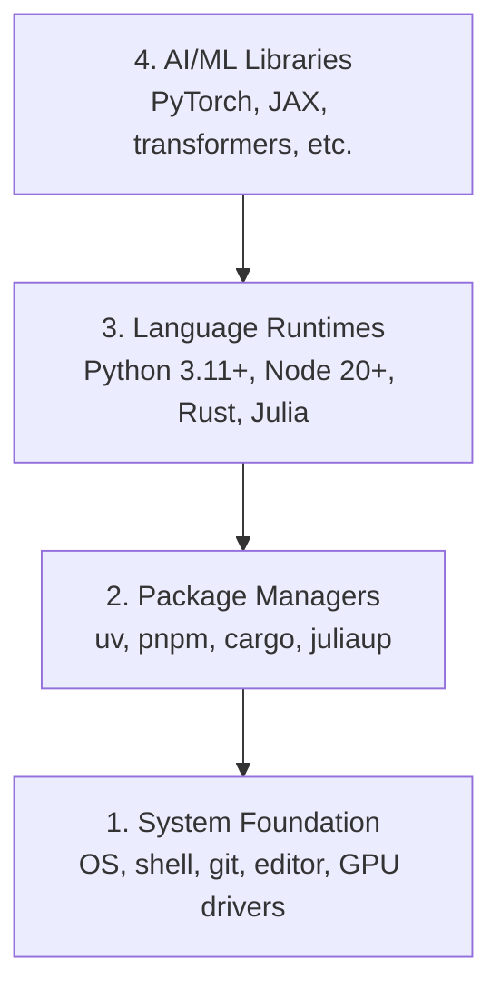

# بيئة التطوير

> أدواتك تشكل تفكيرك. قم بإعدادهم مرة واحدة، قم بإعدادهم بشكل صحيح.

**النوع:** بناء
**اللغات:** بايثون، Node.js، روست
**الشروط:** لا يوجد
**الوقت:** ~45 دقيقة

## أهداف التعلم

- إعداد سلاسل أدوات Python 3.11+ وNode.js 20+ وRust من البداية
- تكوين البيئات الافتراضية ومديري الحزم للبنيات القابلة للتكرار
- التحقق من وصول GPU باستخدام CUDA/MPS وتشغيل عملية اختبار الموتر
- فهم المكدس المكون من أربع طبقات: النظام، والحزم، وأوقات التشغيل، ومكتبات الذكاء الاصطناعي

## المشكلة

أنت على وشك تعلم هندسة الذكاء الاصطناعي عبر أكثر من 200 درس باستخدام Python وTypeScript وRust وJulia. إذا كانت بيئتك معطلة، فإن كل درس يصبح معركة ضد الأدوات بدلاً من التعلم.

يتخطّى معظم الأشخاص إعداد البيئة. ثم يقضون ساعات في تصحيح أخطاء الاستيراد، وتعارضات الإصدارات، وبرامج تشغيل CUDA المفقودة. سنقوم بذلك مرة واحدة، بشكل صحيح.

##المفهوم

تتكون البيئة الهندسية للذكاء الاصطناعي من أربع طبقات:



نقوم بالتثبيت من الأسفل إلى الأعلى. كل طبقة تعتمد على الطبقة التي تحتها.

## بنائها

### الخطوة 1: تأسيس النظام

تحقق من نظامك وقم بتثبيت الأساسيات.

```bash
# macOS
xcode-select --install
brew install git curl wget

# Ubuntu/Debian
sudo apt update && sudo apt install -y build-essential git curl wget

# Windows (use WSL2)
wsl --install -d Ubuntu-24.04
```

### الخطوة 2: بايثون مع الأشعة فوق البنفسجية

نحن نستخدم `uv` — وهو أسرع بمقدار 10 إلى 100 مرة من النقطة ويتعامل مع البيئات الافتراضية تلقائيًا.

```bash
curl -LsSf https://astral.sh/uv/install.sh | sh

uv python install 3.12

uv venv
source .venv/bin/activate  # or .venv\Scripts\activate on Windows

uv pip install numpy matplotlib jupyter
```

يؤكد:

```python
import sys
print(f"Python {sys.version}")

import numpy as np
print(f"NumPy {np.__version__}")
a = np.array([1, 2, 3])
print(f"Vector: {a}, dot product with itself: {np.dot(a, a)}")
```

### الخطوة 3: Node.js مع pnpm

لدروس TypeScript (الوكلاء، خوادم MCP، تطبيقات الويب).

```bash
curl -fsSL https://fnm.vercel.app/install | bash
fnm install 22
fnm use 22

npm install -g pnpm

node -e "console.log('Node', process.version)"
```

### الخطوة 4: الصدأ

للدروس الحرجة للأداء (الاستدلال والأنظمة).

```bash
curl --proto '=https' --tlsv1.2 -sSf https://sh.rustup.rs | sh

rustc --version
cargo --version
```

### الخطوة 5: جوليا (اختياري)

لدروس الرياضيات الثقيلة حيث تتألق جوليا.

```bash
curl -fsSL https://install.julialang.org | sh

julia -e 'println("Julia ", VERSION)'
```

### الخطوة 6: إعداد وحدة معالجة الرسومات (إذا كان لديك واحدة)

```bash
# NVIDIA
nvidia-smi

# Install PyTorch with CUDA
uv pip install torch torchvision torchaudio --index-url https://download.pytorch.org/whl/cu124
```

```python
import torch
print(f"CUDA available: {torch.cuda.is_available()}")
if torch.cuda.is_available():
    print(f"GPU: {torch.cuda.get_device_name(0)}")
```

لا GPU؟ لا مشكلة. تعمل معظم الدروس على وحدة المعالجة المركزية (CPU). بالنسبة للدروس التدريبية المكثفة، استخدم Google Colab أو وحدات معالجة الرسومات السحابية.

### الخطوة 7: التحقق من كل شيء

قم بتشغيل البرنامج النصي للتحقق:

```bash
python phases/00-setup-and-tooling/01-dev-environment/code/verify.py
```

## استخدمه

بيئتك جاهزة الآن لكل درس في هذه الدورة. إليك ما ستستخدمه حيث:

| اللغة | تستخدم في | مدير الحزم |
|----------|--------|-----------------|
| بايثون | المراحل من 1 إلى 12 (تعلم اللغة، التعلم التعلم، البرمجة اللغوية العصبية، الرؤية، الصوت، ماجستير إدارة الأعمال) | الأشعة فوق البنفسجية |
| تايب سكريبت | المراحل 13-17 (الأدوات، الوكلاء، الأسراب، الأشعة تحت الحمراء) | بنم |
| الصدأ | المراحل 12، 15-17 (أنظمة الأداء الحرجة) | بضائع |
| جوليا | المرحلة الأولى (أسس الرياضيات) | باكج |

## اشحنها

يُنتج هذا الدرس برنامجًا نصيًا للتحقق يمكن لأي شخص تشغيله للتحقق من الإعداد الخاص به.

راجع `outputs/prompt-env-check.md` للحصول على مطالبة تساعد مساعدي الذكاء الاصطناعي في تشخيص مشكلات البيئة.

## تمارين

1. قم بتشغيل البرنامج النصي للتحقق وإصلاح أي فشل
2. أنشئ بيئة بايثون افتراضية لهذه الدورة وقم بتثبيت PyTorch
3. اكتب "hello World" بجميع اللغات الأربع وقم بتشغيل كل واحدة منها