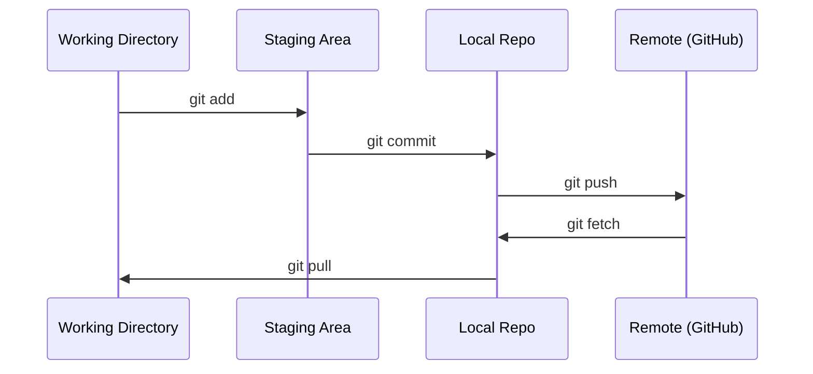

# البوابة والتعاون

> التحكم في الإصدار ليس اختياريًا. يتم تتبع كل تجربة وكل نموذج وكل درس تقوم بإنشائه هنا.

**النوع:** تعلم
**اللغات:** --
**المتطلبات الأساسية:** المرحلة 0، الدرس 01
**الوقت:** ~30 دقيقة

## أهداف التعلم

- تكوين هوية git واستخدام سير العمل اليومي للإضافة والالتزام والدفع
- إنشاء ودمج الفروع للتجارب المعزولة دون كسر الرئيسي
- اكتب `.gitignore` الذي يستثني نقاط التحقق النموذجية والملفات الثنائية الكبيرة
- انتقل إلى سجل الالتزام باستخدام `git log` لفهم تطور المشروع

## المشكلة

أنت على وشك كتابة مئات من ملفات التعليمات البرمجية عبر 20 مرحلة. بدون التحكم في الإصدار، ستفقد العمل، وستكسر أشياء لا يمكنك التراجع عنها، ولن يكون لديك طريقة للتعاون مع الآخرين.

جيت هي الأداة. GitHub هو المكان الذي تعيش فيه التعليمات البرمجية. يغطي هذا الدرس ما تحتاجه لهذه الدورة وليس أكثر.

##المفهوم



ثلاثة أشياء يجب تذكرها:
1. احفظ كثيرًا (`git commit`)
2. اضغط إلى جهاز التحكم عن بعد (`git push`)
3. فرع التجارب (`git checkout -b experiment`)

## بنائها

### الخطوة 1: تكوين git

```bash
git config --global user.name "Your Name"
git config --global user.email "you@example.com"
```

### الخطوة الثانية: سير العمل اليومي

```bash
git status
git add file.py
git commit -m "Add perceptron implementation"
git push origin main
```

### الخطوة 3: تفرع التجارب

```bash
git checkout -b experiment/new-optimizer

# ... make changes, commit ...

git checkout main
git merge experiment/new-optimizer
```

### الخطوة 4: العمل مع هذه الدورة التدريبية

```bash
git clone https://github.com/rohitg00/ai-engineering-from-scratch.git
cd ai-engineering-from-scratch

git checkout -b my-progress
# work through lessons, commit your code
git push origin my-progress
```

## استخدمه

في هذه الدورة، تحتاج بالضبط إلى هذه الأوامر:

| الأمر | متى |
|---------|------|
| `git clone` | الحصول على الريبو الدورة |
| `git add` + `git commit` | احفظ عملك |
| __الكود_3__ | قم بعمل نسخة احتياطية منه على جيثب |
| __الكود_4__ | جرب شيئًا ما دون كسر المفتاح الرئيسي |
| __الكود_5__ | شاهد ماذا فعلت |

هذا كل شيء. لا تحتاج إلى إعادة الأساس أو الاختيار أو الوحدات الفرعية لهذه الدورة.

## تمارين

1. انسخ هذا الريبو، وأنشئ فرعًا يسمى `my-progress`، ثم أنشئ ملفًا، ثم التزم به، ثم ادفعه
2. قم بإنشاء `.gitignore` الذي يستثني ملفات نقاط التفتيش النموذجية (`.pt`، `.pth`، `.safetensors`)
3. انظر إلى سجل الالتزام لهذا الريبو باستخدام `git log --oneline` واقرأ كيف تمت إضافة الدروس

## المصطلحات الرئيسية

| مصطلح | ماذا يقول الناس | ماذا يعني في الواقع |
|------|----------------|----------------------|
| الالتزام | "الادخار" | لقطة لمشروعك بأكمله في وقت ما |
| فرع | "نسخة" | مؤشر للالتزام الذي يتحرك للأمام أثناء العمل |
| دمج | "رمز الجمع" | أخذ التغييرات من فرع وتطبيقها على فرع آخر |
| عن بعد | "السحابة" | نسخة من الريبو الخاص بك مستضافة في مكان آخر (GitHub، GitLab) |