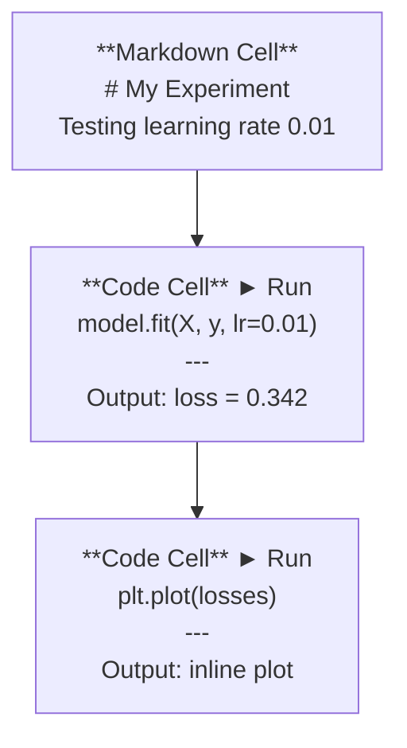
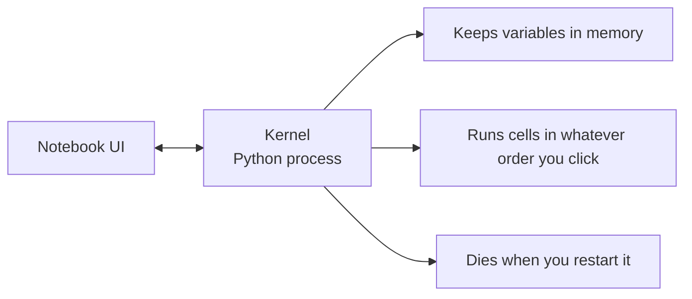

# دفاتر جوبيتر

> تعد أجهزة الكمبيوتر المحمولة بمثابة منصة مختبرية لهندسة الذكاء الاصطناعي. أنت تصنع نموذجًا أوليًا هنا، ثم تنقل ما ينجح إلى الإنتاج.

**النوع:** بناء
** اللغات: ** بايثون
**المتطلبات الأساسية:** المرحلة 0، الدرس 01
**الوقت:** ~30 دقيقة

## أهداف التعلم

- تثبيت وتشغيل JupyterLab أو Jupyter Notebook أو VS Code بامتداد Jupyter
- استخدم الأوامر السحرية (`%timeit`، `%%time`، `%matplotlib inline`) لقياس الأداء والتصور المضمّن
- التمييز بين وقت استخدام دفاتر الملاحظات والبرامج النصية وتطبيق سير العمل "الاستكشاف في دفاتر الملاحظات والشحن في البرامج النصية"
- تحديد وتجنب مصائد أجهزة الكمبيوتر المحمولة الشائعة: التنفيذ خارج الترتيب، والحالة المخفية، وتسريبات الذاكرة

## المشكلة

تستخدم كل ورقة بحثية وتعليمية ومسابقة Kaggle الخاصة بالذكاء الاصطناعي دفاتر ملاحظات Jupyter. فهي تتيح لك تشغيل التعليمات البرمجية على أجزاء، ورؤية المخرجات المضمنة، ومزج التعليمات البرمجية مع التفسيرات، والتكرار بسرعة. إذا حاولت تعلم الذكاء الاصطناعي بدون دفاتر ملاحظات، فأنت تقوم بواجب الرياضيات المنزلي بدون ورقة مسودة.

لكن دفاتر الملاحظات بها مصائد حقيقية. يستخدمها الناس في كل شيء، بما في ذلك الأشياء التي يكرهون القيام بها. إن معرفة متى تستخدم دفتر ملاحظات ومتى تستخدم برنامجًا نصيًا سيوفر عليك تصحيح أخطاء الكوابيس لاحقًا.

##المفهوم

دفتر الملاحظات هو قائمة من الخلايا. كل خلية إما رمز أو نص.



النواة هي عملية بايثون تعمل في الخلفية. عندما تقوم بتشغيل خلية، فإنها ترسل الكود إلى النواة، التي تقوم بتنفيذها وترسل النتيجة مرة أخرى. تشترك جميع الخلايا في نفس النواة، لذلك تستمر المتغيرات بين الخلايا.



هذا الجزء "أيًا كان الطلب الذي تنقر عليه" هو القوة العظمى وبندقية القدم.

## بنائها

### الخطوة 1: اختر الواجهة الخاصة بك

ثلاثة خيارات، شكل واحد:

| الواجهة | تثبيت | الأفضل لـ |
|-----------|--------|----------|
| جوبيتر لاب | `pip install jupyterlab` ثم `jupyter lab` | تجربة IDE كاملة، علامات تبويب متعددة، متصفح الملفات، المحطة الطرفية |
| دفتر جوبيتر | `pip install notebook` ثم `jupyter notebook` | بسيط، وخفيف الوزن، ودفتر ملاحظات واحد في كل مرة |
| كود VS | قم بتثبيت ملحق "Jupyter" | بالفعل في المحرر الخاص بك، تكامل git، تصحيح الأخطاء |

يقوم الثلاثة بقراءة وكتابة نفس الملف `.ipynb`. اختر ما تريد. JupyterLab هو الأكثر شيوعًا في أعمال الذكاء الاصطناعي.

```bash
pip install jupyterlab
jupyter lab
```

### الخطوة الثانية: اختصارات لوحة المفاتيح المهمة

أنت تعمل في وضعين. اضغط على `Escape` لوضع الأوامر (الشريط الأزرق على اليسار)، `Enter` لوضع التحرير (الشريط الأخضر).

**وضع الأوامر (الأكثر استخدامًا):**

| مفتاح | العمل |
|-----|--------|
| `Shift+Enter` | تشغيل الخلية، الانتقال إلى التالي |
| __الكود_1__ | أدخل الخلية أعلاه |
| __الكود_2__ | أدخل الخلية أدناه |
| __الكود_3__ | حذف الخلية |
| __الكود_4__ | تحويل إلى تخفيض السعر |
| __الكود_5__ | تحويل إلى كود |
| __الكود_6__ | التراجع عن عملية الخلية |
| __الكود_7__ | إظهار كافة الاختصارات |

**وضع التحرير:**

| مفتاح | العمل |
|-----|--------|
| `Tab` | الإكمال التلقائي |
| __الكود_1__ | إظهار توقيع الوظيفة |
| __الكود_2__ | تبديل التعليق |

`Shift+Enter` هو الذي ستستخدمه ألف مرة في اليوم. تعلم ذلك أولا.

### الخطوة 3: أنواع الخلايا

**خلايا التعليمات البرمجية** تعمل على تشغيل لغة Python وإظهار المخرجات:

```python
import numpy as np
data = np.random.randn(1000)
data.mean(), data.std()
```

الإخراج: `(0.0032, 0.9987)`

**خلايا تخفيض السعر** تعرض نصًا منسقًا. استخدمها لتوثيق ما تفعله ولماذا. يدعم الرؤوس والخط العريض والمائل ورياضيات LaTeX (`$E = mc^2$`) والجداول والصور.

### الخطوة 4: الأوامر السحرية

هذه ليست بايثون. إنها أوامر خاصة بـ Jupyter تبدأ بـ `%` (سحر السطر) أو `%%` (سحر الخلية).

**توقيت الرمز الخاص بك:**

```python
%timeit np.random.randn(10000)
```

الإخراج: `45.2 us +/- 1.3 us per loop`

```python
%%time
model.fit(X_train, y_train, epochs=10)
```

الإخراج: `Wall time: 2.34 s`

يقوم `%timeit` بتشغيل الكود عدة مرات وبمتوسطات. `%%time` يقوم بتشغيله مرة واحدة. استخدم `%timeit` للمعايير الدقيقة، `%%time` لعمليات التدريب.

** تمكين المؤامرات المضمنة: **

```python
%matplotlib inline
```

يتم الآن عرض كل `plt.plot()` أو `plt.show()` مباشرة في دفتر الملاحظات.

**تثبيت الحزم دون مغادرة الكمبيوتر الدفتري:**

```python
!pip install scikit-learn
```

تعمل البادئة `!` على تشغيل أي أمر Shell.

**التحقق من متغيرات البيئة:**

```python
%env CUDA_VISIBLE_DEVICES
```

### الخطوة 5: عرض المخرجات الغنية في السطر

تعرض دفاتر الملاحظات التعبير الأخير في الخلية تلقائيًا. ولكن يمكنك التحكم فيه:

```python
import pandas as pd

df = pd.DataFrame({
    "model": ["Linear", "Random Forest", "Neural Net"],
    "accuracy": [0.72, 0.89, 0.94],
    "training_time": [0.1, 2.3, 45.6]
})
df
```

يؤدي هذا إلى عرض جدول HTML منسق، وليس تفريغ نص. الشيء نفسه مع المؤامرات:

```python
import matplotlib.pyplot as plt

plt.figure(figsize=(8, 4))
plt.plot([1, 2, 3, 4], [1, 4, 2, 3])
plt.title("Inline Plot")
plt.show()
```

تظهر المؤامرة مباشرة أسفل الخلية. ولهذا السبب تهيمن أجهزة الكمبيوتر المحمولة على أعمال الذكاء الاصطناعي. ترى البيانات والمؤامرة والرمز معًا.

للصور:

```python
from IPython.display import Image, display
display(Image(filename="architecture.png"))
```

### الخطوة 6: جوجل كولاب

Colab عبارة عن دفتر ملاحظات Jupyter مجاني في السحابة. فهو يوفر لك وحدة معالجة الرسومات والمكتبات المثبتة مسبقًا وتكامل Google Drive. لا يلزم الإعداد.

1. انتقل إلى [colab.research.google.com](https://colab.research.google.com)
2. قم بتحميل أي ملف `.ipynb` من هذه الدورة
3. وقت التشغيل > تغيير نوع وقت التشغيل > T4 GPU (مجاني)

اختلافات كولاب عن Jupyter المحلي:
- عدم استمرار الملفات بين الجلسات (حفظها في Drive أو تنزيلها)
- مثبتة مسبقًا: numpy، pandas، matplotlib، torch، Tensorflow، sklearn
- `from google.colab import files` لتحميل/تنزيل الملفات
- `from google.colab import drive; drive.mount('/content/drive')` للتخزين المستمر
- تنتهي مهلة الجلسات بعد 90 دقيقة من عدم النشاط (الطبقة المجانية)

## استخدمه

### دفاتر الملاحظات مقابل البرامج النصية: متى يتم استخدام أي منها

| استخدم دفاتر الملاحظات لـ | استخدم البرامج النصية لـ |
|-------------------|-----------------|
| استكشاف مجموعة بيانات | خطوط التدريب |
| نموذج أولي | المرافق القابلة لإعادة الاستخدام |
| تصور النتائج | أي شيء يحتوي على `if __name__` |
| شرح عملك | الكود الذي يعمل وفق جدول زمني |
| تجارب سريعة | كود الإنتاج |
| تمارين الدورة | الحزم والمكتبات |

القاعدة: **استكشف في دفاتر الملاحظات، واشحن في البرامج النصية**.

سير العمل المشترك في الذكاء الاصطناعي:
1. استكشف البيانات في دفتر الملاحظات
2. قم بإنشاء نموذج أولي للنموذج الخاص بك في دفتر الملاحظات
3. بمجرد أن يعمل، انقل الكود إلى ملفات `.py`
4. قم باستيراد ملفات `.py` مرة أخرى إلى دفتر الملاحظات لإجراء المزيد من التجارب

### الفخاخ الشائعة

**التنفيذ خارج الترتيب.** يمكنك تشغيل الخلية 5، ثم الخلية 2، ثم الخلية 7. يعمل دفتر الملاحظات على جهازك ولكنه يتعطل عندما يقوم شخص ما بتشغيله من الأعلى إلى الأسفل. إصلاح: Kernel> إعادة التشغيل وتشغيل الكل قبل المشاركة.

**الحالة المخفية.** تقوم بحذف خلية ولكن المتغير الذي أنشأته لا يزال في الذاكرة. يبدو دفتر الملاحظات نظيفًا ولكنه يعتمد على خلية شبحية. إصلاح: إعادة تشغيل النواة بانتظام.

**تسرب الذاكرة.** تحميل مجموعة بيانات بسعة 4 جيجابايت، وتدريب نموذج، وتحميل مجموعة بيانات أخرى. لا شيء يتحرر. أصلح: `del variable_name` و `gc.collect()`، أو أعد تشغيل النواة.

## اشحنها

ينتج هذا الدرس:
- `outputs/prompt-notebook-helper.md` لتصحيح مشكلات دفتر الملاحظات

## تمارين

1. افتح JupyterLab، وقم بإنشاء دفتر ملاحظات، واستخدم `%timeit` لمقارنة فهم القائمة مقابل numpy لإنشاء مصفوفة مكونة من 100000 رقم عشوائي
2. قم بإنشاء دفتر ملاحظات يحتوي على كل من خلايا تخفيض السعر وخلايا التعليمات البرمجية التي تقوم بتحميل ملف CSV وعرض إطار بيانات ورسم مخطط. ثم قم بتشغيل Kernel > Restart & Run All للتحقق من أنه يعمل من الأعلى إلى الأسفل
3. خذ الكود من `code/notebook_tips.py`، والصقه في دفتر ملاحظات Colab، وقم بتشغيله باستخدام وحدة معالجة الرسومات المجانية

## المصطلحات الرئيسية

| مصطلح | ماذا يقول الناس | ماذا يعني في الواقع |
|------|----------------|----------------------|
| النواة | "الشيء الذي يقوم بتشغيل الكود الخاص بي" | عملية بايثون منفصلة تنفذ الخلايا وتحتفظ بالمتغيرات في الذاكرة |
| الخلية | "كتلة التعليمات البرمجية" | وحدة قابلة للتشغيل بشكل مستقل في دفتر الملاحظات، إما رمز أو تخفيض السعر |
| الأمر السحري | "حيل جوبيتر" | الأوامر الخاصة المسبوقة بـ `%` أو `%%` التي تتحكم في بيئة الكمبيوتر المحمول |
| __الكود_2__ | "ملف دفتر الملاحظات" | ملف JSON يحتوي على الخلايا والمخرجات والبيانات الوصفية. لتقف على IPython Notebook |

## مزيد من القراءة

- [JupyterLab Docs](https://jupyterlab.readthedocs.io/) لمجموعة الميزات الكاملة
- [Google Colab FAQ](https://research.google.com/colaboratory/faq.html) للحدود والميزات الخاصة بـ Colab
- [28 Jupyter Notebook Tips](https://www.dataquest.io/blog/jupyter-notebook-tips-tricks-shortcuts/) لاختصارات المستخدم المتميز