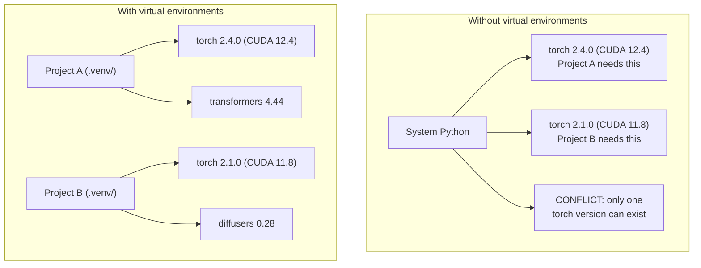

# بيئات بايثون

> جحيم التبعية حقيقي. البيئات الافتراضية هي العلاج.

**النوع:** بناء
** اللغات: ** بايثون
**المتطلبات الأساسية:** المرحلة 0، الدرس 01
**الوقت:** ~30 دقيقة

## أهداف التعلم

- إنشاء بيئات افتراضية معزولة باستخدام `uv`، `venv`، أو `conda`
- اكتب `pyproject.toml` بمجموعات تبعية اختيارية وقم بإنشاء ملفات قفل لإمكانية التكرار
- تشخيص الأخطاء الشائعة وإصلاحها: عمليات التثبيت العالمية، وخلط النقاط/الكوندا، وعدم تطابق إصدار CUDA
- تنفيذ استراتيجية بيئة لكل مرحلة للمشاريع ذات التبعيات المتعارضة

## المشكلة

قمت بتثبيت PyTorch 2.4 لمشروع الضبط الدقيق. في الأسبوع المقبل، سيحتاج مشروع مختلف إلى PyTorch 2.1 لأن بناء CUDA الخاص به مثبت. تقوم بالترقية عالميًا، وينقطع المشروع الأول. قمت بالتخفيض، والثانية ينكسر.

هذا هو جحيم التبعية. يحدث هذا باستمرار في عمل الذكاء الاصطناعي/التعلم الآلي للأسباب التالية:

- يقوم كل من PyTorch وJAX وTensorFlow بشحن روابط CUDA الخاصة بهم
- تقوم المكتبات النموذجية بتثبيت إصدارات إطار عمل محددة
- يقوم `pip install` بالكتابة على كل ما كان موجودًا من قبل
- لا تعمل إصدارات CUDA 11.8 مع برامج تشغيل CUDA 12.x (والعكس صحيح)

الحل: يحصل كل مشروع على بيئته المعزولة مع حزمه الخاصة.

##المفهوم



## بنائها

### الخيار 1: uv venv (مستحسن)

`uv` هو أسرع مدير حزم Python (10-100x أسرع من النقطة). يتعامل مع البيئات الافتراضية وإصدارات Python وحل التبعية في أداة واحدة.

```bash
curl -LsSf https://astral.sh/uv/install.sh | sh

uv python install 3.12

cd your-project
uv venv
source .venv/bin/activate
```

تثبيت الحزم:

```bash
uv pip install torch numpy
```

قم بإنشاء مشروع باستخدام `pyproject.toml` في خطوة واحدة:

```bash
uv init my-ai-project
cd my-ai-project
uv add torch numpy matplotlib
```

### الخيار 2: venv (مدمج)

إذا لم تتمكن من تثبيت `uv`، فإن Python تأتي مع `venv`:

```bash
python3 -m venv .venv
source .venv/bin/activate  # Linux/macOS
.venv\Scripts\activate     # Windows

pip install torch numpy
```

أبطأ من `uv`، ولكنه يعمل في كل مكان يتم فيه تثبيت Python.

### الخيار 3: كوندا (عندما تحتاج إليها)

تدير Conda التبعيات غير التابعة لـ Python مثل مجموعات أدوات CUDA ومكتبات cuDNN وC. استخدمه عندما:

- أنت بحاجة إلى إصدار محدد لمجموعة أدوات CUDA دون تثبيته على مستوى النظام
- أنت ضمن مجموعة مشتركة حيث لا يمكنك تثبيت حزم النظام
- تعليمات تثبيت المكتبة تقول "استخدام conda"

```bash
# Install miniconda (not the full Anaconda)
curl -LsSf https://repo.anaconda.com/miniconda/Miniconda3-latest-Linux-x86_64.sh -o miniconda.sh
bash miniconda.sh -b

conda create -n myproject python=3.12
conda activate myproject

conda install pytorch torchvision torchaudio pytorch-cuda=12.4 -c pytorch -c nvidia
```

قاعدة واحدة: إذا كنت تستخدم conda لبيئة ما، فاستخدم conda لجميع الحزم في تلك البيئة. يؤدي خلط `pip install` في conda env إلى حدوث تعارضات تبعية تكون مؤلمة عند تصحيح الأخطاء.

### لهذه الدورة: استراتيجية لكل مرحلة

يمكنك إنشاء بيئة واحدة للدورة بأكملها. لا. تحتاج المراحل المختلفة إلى تبعيات مختلفة (متعارضة في بعض الأحيان).

الإستراتيجية:

```
ai-engineering-from-scratch/
├── .venv/                    <-- shared lightweight env for phases 0-3
├── phases/
│   ├── 04-neural-networks/
│   │   └── .venv/            <-- PyTorch env
│   ├── 05-cnns/
│   │   └── .venv/            <-- same PyTorch env (symlink or shared)
│   ├── 08-transformers/
│   │   └── .venv/            <-- might need different transformer versions
│   └── 11-llm-apis/
│       └── .venv/            <-- API SDKs, no torch needed
```

يقوم البرنامج النصي الموجود في `code/env_setup.sh` بإنشاء البيئة الأساسية لهذه الدورة التدريبية.

## أساسيات pyproject.toml

يجب أن يكون لكل مشروع بايثون `pyproject.toml`. فهو يستبدل `setup.py`، `setup.cfg`، و`requirements.txt` في ملف واحد.

```toml
[project]
name = "ai-engineering-from-scratch"
version = "0.1.0"
requires-python = ">=3.11"
dependencies = [
    "numpy>=1.26",
    "matplotlib>=3.8",
    "jupyter>=1.0",
    "scikit-learn>=1.4",
]

[project.optional-dependencies]
torch = ["torch>=2.3", "torchvision>=0.18"]
llm = ["anthropic>=0.39", "openai>=1.50"]
```

ثم تثبيت:

```bash
uv pip install -e ".[torch]"    # base + PyTorch
uv pip install -e ".[llm]"     # base + LLM SDKs
uv pip install -e ".[torch,llm]" # everything
```

## ملفات القفل

يقوم ملف القفل بتثبيت كل التبعيات (بما في ذلك التبعيات المتعدية) بالإصدارات الدقيقة. وهذا يضمن إمكانية التكرار: أي شخص يقوم بالتثبيت من ملف القفل يحصل على نفس الحزم تمامًا.

```bash
# uv generates uv.lock automatically when using uv add
uv add numpy

# pip-tools approach
uv pip compile pyproject.toml -o requirements.lock
uv pip install -r requirements.lock
```

قم بإلزام ملف القفل الخاص بك بـ git. عندما يقوم شخص ما باستنساخ الريبو، فإنه يقوم بالتثبيت من ملف القفل ويحصل على إصدارات متطابقة.

##أخطاء شائعة

### 1. التثبيت عالميًا

```bash
pip install torch  # BAD: installs to system Python

source .venv/bin/activate
pip install torch  # GOOD: installs to virtual environment
```

تحقق من أين تذهب الطرود الخاصة بك:

```bash
which python       # should show .venv/bin/python, not /usr/bin/python
which pip           # should show .venv/bin/pip
```

### 2. خلط النقطة والكوندا

```bash
conda create -n myenv python=3.12
conda activate myenv
conda install pytorch -c pytorch
pip install some-other-package   # BAD: can break conda's dependency tracking
conda install some-other-package # GOOD: let conda manage everything
```

إذا كان يجب عليك استخدام النقطة داخل conda (بعض الحزم عبارة عن نقطة فقط)، فقم بتثبيت جميع حزم conda أولاً، ثم حزم النقطة أخيرًا.

### 3. نسيان التنشيط

```bash
python train.py           # uses system Python, missing packages
source .venv/bin/activate
python train.py           # uses project Python, packages found
```

يجب أن يُظهر موجه Shell الخاص بك اسم البيئة:

```
(.venv) $ python train.py
```

### 4. إرسال .venv إلى git

```bash
echo ".venv/" >> .gitignore
```

البيئات الافتراضية هي 200 ميجا بايت - 2 جيجا بايت. إنها محلية، وليست محمولة بين الأجهزة. قم بتنفيذ `pyproject.toml` وملف القفل بدلاً من ذلك.

### 5. عدم تطابق إصدار CUDA

```bash
nvidia-smi                # shows driver CUDA version (e.g., 12.4)
python -c "import torch; print(torch.version.cuda)"  # shows PyTorch CUDA version

# These must be compatible.
# PyTorch CUDA version must be <= driver CUDA version.
```

## استخدمه

قم بتشغيل البرنامج النصي للإعداد لإنشاء بيئة الدورة التدريبية الخاصة بك:

```bash
bash phases/00-setup-and-tooling/06-python-environments/code/env_setup.sh
```

يؤدي هذا إلى إنشاء `.venv` في جذر الريبو مع تثبيت التبعيات الأساسية والتحقق منها.

## تمارين

1. قم بتشغيل `env_setup.sh` وتحقق من نجاح جميع عمليات التحقق
2. قم بإنشاء بيئة افتراضية ثانية، وقم بتثبيت إصدار مختلف من numpy فيها، وتأكد من عزل البيئتين
3. اكتب `pyproject.toml` لمشروع يحتاج إلى كل من PyTorch وAnthropic SDK
4. قم بتثبيت الحزمة بشكل عام (بدون تنشيط venv)، ولاحظ مكانها، ثم قم بإلغاء تثبيتها

## المصطلحات الرئيسية

| مصطلح | ماذا يقول الناس | ماذا يعني في الواقع |
|------|----------------|----------------------|
| البيئة الافتراضية | "فينف" | دليل معزول يحتوي على مترجم وحزم بايثون، منفصل عن نظام بايثون |
| ملف القفل | "التبعيات المثبتة" | ملف يسرد كل حزمة وإصدارها الدقيق، مما يضمن عمليات تثبيت متطابقة عبر الأجهزة |
| pyproject.toml | "الإعداد الجديد.py" | ملف تكوين مشروع Python القياسي، يحل محل setup.py/setup.cfg/requirements.txt |
| التبعية متعدية | "تبعية تبعية" | الحزمة B تعتمد على C؛ إذا قمت بتثبيت A الذي يعتمد على B، فإن C هي تبعية متعدية لـ A |
| عدم تطابق CUDA | "وحدة معالجة الرسومات الخاصة بي لا تعمل" | تم تجميع PyTorch لإصدار CUDA مختلف عما يدعمه برنامج تشغيل GPU الخاص بك |