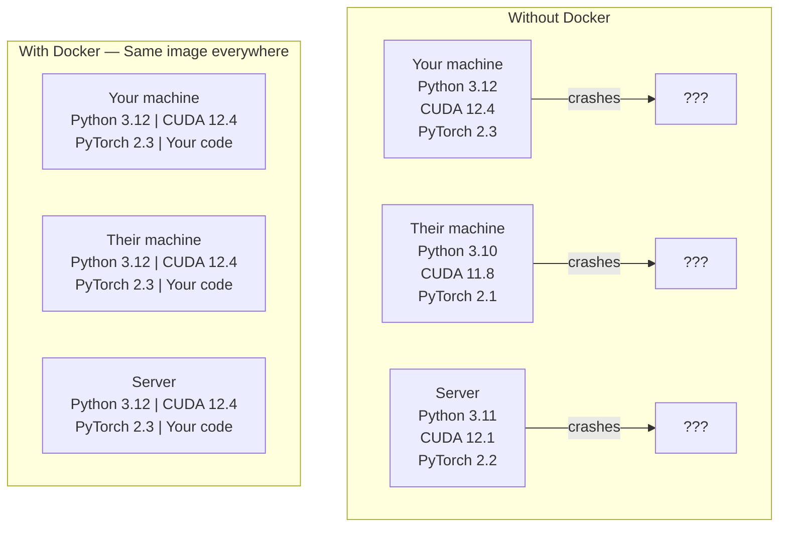

# عامل ميناء لمنظمة العفو الدولية

> الحاويات تجعل "العمل على جهازي" شيئًا من الماضي.

**النوع:** بناء
** اللغات: ** بايثون
**المتطلبات الأساسية:** المرحلة 0، الدرسان 01 و03
**الوقت:** ~60 دقيقة

## أهداف التعلم

- إنشاء صورة Docker ممكّنة بواسطة GPU باستخدام مكتبات CUDA وPyTorch وAI من ملف Dockerfile
- قم بتثبيت أدلة المضيف كوحدات تخزين لاستمرار النماذج ومجموعات البيانات والتعليمات البرمجية عبر عمليات إعادة بناء الحاوية
- قم بتكوين مجموعة أدوات حاوية NVIDIA لكشف وحدات معالجة الرسومات داخل الحاويات
- تنسيق تطبيقات الذكاء الاصطناعي متعددة الخدمات (خادم الاستدلال + قاعدة بيانات المتجهات) باستخدام Docker Compose

## المشكلة

لقد قمت بتدريب نموذج على الكمبيوتر المحمول الخاص بك باستخدام PyTorch 2.3 وCUDA 12.4 وPython 3.12. زميلك لديه PyTorch 2.1 وCUDA 11.8 وPython 3.10. يتعطل النموذج الخاص بك على أجهزتهم. يعمل ملف Dockerfile الخاص بك على كليهما.

مشاريع الذكاء الاصطناعي هي كوابيس التبعية. تتضمن الحزمة النموذجية برامج تشغيل Python وPyTorch وCUDA وcuDNN ومكتبات C على مستوى النظام والحزم المتخصصة مثل flash-attn التي تحتاج إلى إصدارات مترجم دقيقة. يقوم Docker بتجميع كل هذا في صورة واحدة يتم تشغيلها بشكل مماثل في كل مكان.

##المفهوم

يقوم Docker بتجميع التعليمات البرمجية ووقت التشغيل والمكتبات وأدوات النظام في وحدة معزولة تسمى الحاوية. فكر في الأمر كجهاز افتراضي خفيف الوزن، باستثناء أنه يشترك في نواة نظام التشغيل المضيف بدلاً من تشغيل نظامه الخاص، لذلك يبدأ تشغيله في ثوانٍ بدلاً من دقائق.



### لماذا تحتاج مشاريع الذكاء الاصطناعي إلى Docker أكثر من غيرها

1. ** برامج تشغيل GPU هشة. ** لا يعمل كود CUDA 12.4 على CUDA 11.8. يقوم Docker بعزل مجموعة أدوات CUDA داخل الحاوية أثناء مشاركة برنامج تشغيل GPU المضيف من خلال NVIDIA Container Toolkit.

2. **أوزان النماذج كبيرة.** يبلغ حجم نموذج المعلمة 7B 14 جيجابايت في fp16. لا تريد إعادة تنزيله في كل مرة تقوم فيها بإعادة البناء. تتيح لك وحدات تخزين Docker إمكانية تحميل دليل النماذج من المضيف.

3. ** تعتبر بنيات الخدمات المتعددة شائعة. ** تطبيق الذكاء الاصطناعي الحقيقي ليس مجرد برنامج نصي بلغة بايثون. إنه خادم استدلال، وقاعدة بيانات متجهة لـ RAG، وربما واجهة ويب أمامية. يقوم Docker Compose بتنسيق كل هذه الأمور بأمر واحد.

### المفردات الرئيسية

| مصطلح | ماذا يعني |
|------|--------------|
| صورة | قالب للقراءة فقط. وصفتك. بنيت من ملف Dockerfile. |
| حاوية | مثيل قيد التشغيل للصورة. مطبخك. |
| ملف الإرساء | تعليمات لبناء الصورة. طبقة بعد طبقة. |
| المجلد | التخزين المستمر الذي ينجو من إعادة تشغيل الحاوية. |
| عامل الإرساء يؤلف | أداة لتحديد تطبيقات الحاويات المتعددة في YAML. |

### أنماط الحاويات الشائعة في الذكاء الاصطناعي

```
Dev Container
  Full toolkit. Editor support. Jupyter. Debugging tools.
  Used during development and experimentation.

Training Container
  Minimal. Just the training script and dependencies.
  Runs on GPU clusters. No editor, no Jupyter.

Inference Container
  Optimized for serving. Small image. Fast cold start.
  Runs behind a load balancer in production.
```

## بنائها

### الخطوة الأولى: تثبيت Docker

```bash
# macOS
brew install --cask docker
open /Applications/Docker.app

# Ubuntu
curl -fsSL https://get.docker.com | sh
sudo usermod -aG docker $USER
# Log out and back in for group change to take effect
```

يؤكد:

```bash
docker --version
docker run hello-world
```

### الخطوة 2: تثبيت مجموعة أدوات حاوية NVIDIA (Linux مع NVIDIA GPU)

يتيح ذلك لحاويات Docker الوصول إلى وحدة معالجة الرسومات (GPU) الخاصة بك. يمكن لمستخدمي macOS وWindows (WSL2) تخطي هذا؛ يتعامل Docker Desktop مع عبور GPU بشكل مختلف على تلك الأنظمة الأساسية.

```bash
distribution=$(. /etc/os-release;echo $ID$VERSION_ID)
curl -fsSL https://nvidia.github.io/libnvidia-container/gpgkey | sudo gpg --dearmor -o /usr/share/keyrings/nvidia-container-toolkit-keyring.gpg
curl -s -L https://nvidia.github.io/libnvidia-container/$distribution/libnvidia-container.list | \
    sed 's#deb https://#deb [signed-by=/usr/share/keyrings/nvidia-container-toolkit-keyring.gpg] https://#g' | \
    sudo tee /etc/apt/sources.list.d/nvidia-container-toolkit.list

sudo apt-get update
sudo apt-get install -y nvidia-container-toolkit
sudo nvidia-ctk runtime configure --runtime=docker
sudo systemctl restart docker
```

اختبار الوصول إلى GPU داخل الحاوية:

```bash
docker run --rm --gpus all nvidia/cuda:12.4.1-base-ubuntu22.04 nvidia-smi
```

إذا رأيت معلومات وحدة معالجة الرسومات الخاصة بك، فهذا يعني أن مجموعة الأدوات تعمل.

### الخطوة 3: فهم الصور الأساسية

يؤدي اختيار الصورة الأساسية الصحيحة إلى توفير ساعات من تصحيح الأخطاء.

```
nvidia/cuda:12.4.1-devel-ubuntu22.04
  Full CUDA toolkit. Compilers included.
  Use for: building packages that need nvcc (flash-attn, bitsandbytes)
  Size: ~4 GB

nvidia/cuda:12.4.1-runtime-ubuntu22.04
  CUDA runtime only. No compilers.
  Use for: running pre-built code
  Size: ~1.5 GB

pytorch/pytorch:2.3.1-cuda12.4-cudnn9-runtime
  PyTorch pre-installed on top of CUDA.
  Use for: skipping the PyTorch install step
  Size: ~6 GB

python:3.12-slim
  No CUDA. CPU only.
  Use for: inference on CPU, lightweight tools
  Size: ~150 MB
```

### الخطوة 4: كتابة ملف Dockerfile لتطوير الذكاء الاصطناعي

إليك ملف Dockerfile في `code/Dockerfile`. المشي من خلال ذلك:

```dockerfile
FROM nvidia/cuda:12.4.1-devel-ubuntu22.04

ENV DEBIAN_FRONTEND=noninteractive
ENV PYTHONUNBUFFERED=1

RUN apt-get update && apt-get install -y --no-install-recommends \
    python3.12 \
    python3.12-venv \
    python3.12-dev \
    python3-pip \
    git \
    curl \
    build-essential \
    && rm -rf /var/lib/apt/lists/*

RUN update-alternatives --install /usr/bin/python python /usr/bin/python3.12 1

RUN python -m pip install --no-cache-dir --upgrade pip setuptools wheel

RUN python -m pip install --no-cache-dir \
    torch==2.3.1 \
    torchvision==0.18.1 \
    torchaudio==2.3.1 \
    --index-url https://download.pytorch.org/whl/cu124

RUN python -m pip install --no-cache-dir \
    numpy \
    pandas \
    scikit-learn \
    matplotlib \
    jupyter \
    transformers \
    datasets \
    accelerate \
    safetensors

WORKDIR /workspace

VOLUME ["/workspace", "/models"]

EXPOSE 8888

CMD ["python"]
```

بنائها:

```bash
docker build -t ai-dev -f phases/00-setup-and-tooling/07-docker-for-ai/code/Dockerfile .
```

يستغرق هذا بعض الوقت في المرة الأولى (تنزيل الصورة الأساسية لـ CUDA + PyTorch). تستخدم الإصدارات اللاحقة الطبقات المخزنة مؤقتًا.

تشغيله:

```bash
docker run --rm -it --gpus all \
    -v $(pwd):/workspace \
    -v ~/models:/models \
    ai-dev python -c "import torch; print(f'PyTorch {torch.__version__}, CUDA: {torch.cuda.is_available()}')"
```

قم بتشغيل Jupyter داخل الحاوية:

```bash
docker run --rm -it --gpus all \
    -v $(pwd):/workspace \
    -v ~/models:/models \
    -p 8888:8888 \
    ai-dev jupyter notebook --ip=0.0.0.0 --port=8888 --no-browser --allow-root
```

### الخطوة 5: زيادة حجم البيانات والنماذج

تعد عمليات زيادة الحجم أمرًا بالغ الأهمية لعمل الذكاء الاصطناعي. وبدونها، ستختفي تنزيلات طراز 14 جيجابايت عندما تتوقف الحاوية.

```bash
# Mount your code
-v $(pwd):/workspace

# Mount a shared models directory
-v ~/models:/models

# Mount datasets
-v ~/datasets:/data
```

داخل البرنامج النصي للتدريب، قم بالتحميل من المسار المثبت:

```python
from transformers import AutoModel

model = AutoModel.from_pretrained("/models/llama-7b")
```

يعيش النموذج على نظام الملفات المضيف الخاص بك. أعد بناء الحاوية بقدر ما تريد دون إعادة التنزيل.

### الخطوة 6: Docker Compose لتطبيقات الذكاء الاصطناعي متعددة الخدمات

يحتاج تطبيق RAG الحقيقي إلى خادم استدلال وقاعدة بيانات متجهة. يقوم Docker Compose بتشغيل كليهما باستخدام أمر واحد.

انظر `code/docker-compose.yml`:

```yaml
services:
  ai-dev:
    build:
      context: .
      dockerfile: Dockerfile
    deploy:
      resources:
        reservations:
          devices:
            - driver: nvidia
              count: all
              capabilities: [gpu]
    volumes:
      - ../../../:/workspace
      - ~/models:/models
      - ~/datasets:/data
    ports:
      - "8888:8888"
    stdin_open: true
    tty: true
    command: jupyter notebook --ip=0.0.0.0 --port=8888 --no-browser --allow-root

  qdrant:
    image: qdrant/qdrant:v1.12.5
    ports:
      - "6333:6333"
      - "6334:6334"
    volumes:
      - qdrant_data:/qdrant/storage

volumes:
  qdrant_data:
```

ابدأ كل شيء:

```bash
cd phases/00-setup-and-tooling/07-docker-for-ai/code
docker compose up -d
```

الآن يمكن لحاوية تطوير الذكاء الاصطناعي الخاصة بك الوصول إلى قاعدة بيانات المتجهات في `http://qdrant:6333` حسب اسم الخدمة. يقوم Docker Compose بإنشاء شبكة مشتركة تلقائيًا.

اختبر الاتصال من داخل حاوية AI:

```python
from qdrant_client import QdrantClient

client = QdrantClient(host="qdrant", port=6333)
print(client.get_collections())
```

أوقف كل شيء:

```bash
docker compose down
```

أضف `-v` لحذف مجلد qdrant أيضًا:

```bash
docker compose down -v
```

### الخطوة 7: أوامر Docker المفيدة لعمل الذكاء الاصطناعي

```bash
# List running containers
docker ps

# List all images and their sizes
docker images

# Remove unused images (reclaim disk space)
docker system prune -a

# Check GPU usage inside a running container
docker exec -it <container_id> nvidia-smi

# Copy a file from container to host
docker cp <container_id>:/workspace/results.csv ./results.csv

# View container logs
docker logs -f <container_id>
```

## استخدمه

لديك الآن بيئة تطوير ذكاء اصطناعي قابلة للتكرار. بالنسبة لبقية هذه الدورة:

- استخدم `docker compose up` لبدء بيئة التطوير وقاعدة بيانات المتجهات معًا
- قم بتركيب التعليمات البرمجية والنماذج والبيانات الخاصة بك كوحدات تخزين حتى لا يتم فقدان أي شيء بين عمليات إعادة البناء
- عندما يتطلب الدرس حزمة Python جديدة، أضفها إلى ملف Dockerfile وأعد البناء
- شارك ملف Dockerfile الخاص بك مع زملائك في الفريق. لقد حصلوا على نفس البيئة بالضبط.

### لا يوجد GPU؟

قم بإزالة علامة `--gpus all` وكتلة نشر NVIDIA. لا تزال الحاوية تعمل مع الدروس المعتمدة على وحدة المعالجة المركزية (CPU). يكتشف PyTorch غياب CUDA ويعود إلى وحدة المعالجة المركزية تلقائيًا.

## تمارين

1. أنشئ ملف Dockerfile وقم بتشغيل `python -c "import torch; print(torch.__version__)"` داخل الحاوية
2. ابدأ تشغيل مكدس docker-compose وتحقق من إمكانية الوصول إلى Qdrant من حاوية AI على `http://qdrant:6333/collections`
3. أضف `flask` إلى ملف Dockerfile، وأعد بناء خادم API بسيط وتشغيله على المنفذ 5000. قم بتعيين المنفذ باستخدام `-p 5000:5000`
4. قم بقياس حجم الصورة باستخدام `docker images`. حاول تبديل الصورة الأساسية من `devel` إلى `runtime` وقارن الأحجام

## المصطلحات الرئيسية

| مصطلح | ماذا يقول الناس | ماذا يعني في الواقع |
|------|----------------|----------------------|
| حاوية | "VM خفيف الوزن" | عملية معزولة تستخدم النواة المضيفة، مع نظام ملفات خاص بها وشبكة |
| طبقة الصورة | "الخطوة المخبأة" | تقوم كل تعليمات Dockerfile بإنشاء طبقة. يتم تخزين الطبقات غير المتغيرة مؤقتًا، لذا تتم عمليات إعادة البناء بسرعة. |
| مجموعة أدوات حاوية NVIDIA | "وحدة معالجة الرسومات في عامل ميناء" | خطاف وقت التشغيل الذي يعرض وحدات معالجة الرسومات المضيفة للحاويات عبر علامة `--gpus` |
| جبل الحجم | "المجلد المشترك" | دليل على المضيف تم تعيينه في الحاوية. تستمر التغييرات بعد توقف الحاوية. |
| الصورة الأساسية | "نقطة البداية" | الصورة `FROM` التي ينشئها ملف Dockerfile فوقها. يحدد ما تم تثبيته مسبقًا. |