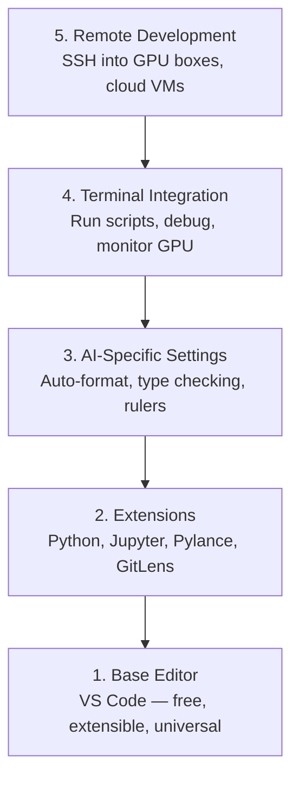

#إعداد المحرر

> المحرر الخاص بك هو مساعد الطيار الخاص بك. قم بتكوينه مرة واحدة حتى يظل بعيدًا عن طريقك ويبدأ في سحب ثقله.

**النوع:** بناء
**اللغات:** --
**المتطلبات الأساسية:** المرحلة 0، الدرس 01
**الوقت:** ~20 دقيقة

## أهداف التعلم

- تثبيت VS Code مع الامتدادات الأساسية لـ Python وJupyter وlinting وSSH البعيد
- تكوين التنسيق عند الحفظ، والتحقق من الكتابة، وتمرير إخراج دفتر الملاحظات لسير عمل الذكاء الاصطناعي
- قم بإعداد Remote SSH لتحرير وتصحيح التعليمات البرمجية على أجهزة GPU البعيدة كما لو كانت محلية
- تقييم بدائل المحرر (Cursor، Windsurf، Neovim) ومقايضاتها لعمل الذكاء الاصطناعي

## المشكلة

ستقضي آلاف الساعات داخل محررك في كتابة لغة Python، وتشغيل دفاتر الملاحظات، وتصحيح أخطاء حلقات التدريب، وإدخال SSH في صناديق GPU. يحول المحرر الذي تمت تهيئته بشكل خاطئ كل جلسة إلى احتكاك: لا يوجد إكمال تلقائي، ولا تلميحات للكتابة، ولا توجد أخطاء مضمنة، وتنسيق يدوي، وسير عمل طرفي غير منتظم.

يستغرق الإعداد الصحيح 20 دقيقة. تخطيها يكلفك 20 دقيقة كل يوم.

##المفهوم

يحتاج إعداد محرر هندسة الذكاء الاصطناعي إلى خمسة أشياء:



## بنائها

### الخطوة 1: تثبيت رمز VS

VS Code هو المحرر الموصى به. إنه مجاني، ويعمل على كل نظام تشغيل، ويتمتع بدعم Jupyter للكمبيوتر الدفتري من الدرجة الأولى، ويغطي النظام البيئي الملحق كل ما تحتاجه لعمل الذكاء الاصطناعي.

قم بتنزيله من [code.visualstudio.com](https://code.visualstudio.com/).

التحقق من المحطة:

```bash
code --version
```

إذا لم يتم العثور على `code` على نظام التشغيل macOS، فافتح VS Code، واضغط على `Cmd+Shift+P`، واكتب "Shell Command"، وحدد "تثبيت أمر 'code' في PATH".

### الخطوة الثانية: تثبيت الامتدادات الأساسية

افتح الوحدة الطرفية المتكاملة في VS Code (`Ctrl+`` ` أو `` Cmd+` ``) وقم بتثبيت الامتدادات المهمة لعمل الذكاء الاصطناعي:

```bash
code --install-extension ms-python.python
code --install-extension ms-python.vscode-pylance
code --install-extension ms-toolsai.jupyter
code --install-extension eamodio.gitlens
code --install-extension ms-vscode-remote.remote-ssh
code --install-extension ms-python.debugpy
code --install-extension ms-python.black-formatter
code --install-extension charliermarsh.ruff
```

ماذا يفعل كل واحد:

| ملحق | لماذا |
|-----------|-----|
| بايثون | دعم اللغة، كشف البيئة الافتراضية، التشغيل/التصحيح |
| بيلانس | فحص سريع للنوع، والإكمال التلقائي، ودقة الاستيراد |
| جوبيتر | قم بتشغيل دفاتر الملاحظات داخل VS Code، المستكشف المتغير |
| جيت لينس | تعرف على من قام بتغيير ماذا، إلقاء اللوم على git |
| SSH عن بعد | افتح مجلدًا على صندوق GPU بعيد كما لو كان محليًا |
| تصحيح | تصحيح الأخطاء خطوة بخطوة لـ Python |
| المنسق الأسود | التنسيق التلقائي عند الحفظ، وبنمط متسق |
| راف | فحص سريع، يلتقط الأخطاء الشائعة |

يحتوي الملف `code/.vscode/extensions.json` في هذا الدرس على قائمة التوصيات الكاملة. عند فتح مجلد المشروع، سيطالبك VS Code بتثبيتها.

### الخطوة 3: تكوين الإعدادات

انسخ الإعدادات من `code/.vscode/settings.json` في هذا الدرس، أو قم بتطبيقها يدويًا من خلال `Settings > Open Settings (JSON)`.

الإعدادات الرئيسية لعمل الذكاء الاصطناعي:

```jsonc
{
    "python.analysis.typeCheckingMode": "basic",
    "editor.formatOnSave": true,
    "editor.rulers": [88, 120],
    "notebook.output.scrolling": true,
    "files.autoSave": "afterDelay"
}
```

لماذا هذه الأهمية:

- **التحقق من النوع على الأساسي**: يلتقط أنواع الوسائط الخاطئة قبل التشغيل. يوفر وقت تصحيح الأخطاء في حالة عدم تطابق شكل الموتر ومعلمات واجهة برمجة التطبيقات الخاطئة.
- **التنسيق عند الحفظ**: لا تفكر مطلقًا في التنسيق مرة أخرى. الأسود يتولى الأمر.
- **المساطر عند 88 و120**: يلتف اللون الأسود عند 88. تظهر العلامة 120 عندما تصبح سلاسل المستندات والتعليقات طويلة جدًا.
- **تمرير مخرجات الكمبيوتر المحمول**: تطبع حلقات التدريب آلاف الأسطر. بدون التمرير، تنفجر لوحة الإخراج.
- **الحفظ التلقائي**: سوف تنسى الحفظ. سيقوم البرنامج النصي للتدريب الخاص بك بتشغيل تعليمات برمجية قديمة. الحفظ التلقائي يمنع ذلك.

### الخطوة 4: التكامل الطرفي

محطة VS Code المتكاملة هي المكان الذي تقوم فيه بتشغيل البرامج النصية للتدريب ومراقبة وحدات معالجة الرسومات وإدارة البيئات.

قم بإعداده بشكل صحيح:

```jsonc
{
    "terminal.integrated.defaultProfile.osx": "zsh",
    "terminal.integrated.defaultProfile.linux": "bash",
    "terminal.integrated.fontSize": 13,
    "terminal.integrated.scrollback": 10000
}
```

اختصارات مفيدة:

| العمل | ماك | لينكس/ويندوز |
|--------|-------|---------------|
| تبديل المحطة | `` Ctrl+` `` | `` Ctrl+` `` |
| New terminal | `Ctrl+Shift+`` ` | `Ctrl+Shift+`` ` |
| محطة سبليت | __الكود_7__ | __الكود_8__ |

تعد المحطات المقسمة مفيدة: واحدة لتشغيل البرنامج النصي الخاص بك، وواحدة لمراقبة وحدة معالجة الرسومات باستخدام `nvidia-smi -l 1` أو `watch -n 1 nvidia-smi`.

### الخطوة 5: التطوير عن بعد (SSH إلى صناديق GPU)

هذا هو الامتداد الأكثر أهمية لعمل الذكاء الاصطناعي. ستجري تدريبًا على الأجهزة البعيدة (أجهزة VM السحابية وخوادم المختبرات وLambda وVast.ai). يتيح لك Remote SSH فتح نظام الملفات البعيد، وتحرير الملفات، وتشغيل الأجهزة الطرفية، وتصحيح الأخطاء كما لو كان كل شيء محليًا.

يثبت:

1. قم بتثبيت ملحق Remote SSH (تم ذلك في الخطوة 2).
2. اضغط على `Ctrl+Shift+P` (أو `Cmd+Shift+P`)، اكتب "Remote-SSH: الاتصال بالمضيف".
3. أدخل `user@your-gpu-box-ip`.
4. يقوم VS Code بتثبيت مكون الخادم الخاص به على الجهاز البعيد تلقائيًا.

للوصول بدون كلمة مرور، قم بإعداد مفاتيح SSH:

```bash
ssh-keygen -t ed25519 -C "your-email@example.com"
ssh-copy-id user@your-gpu-box-ip
```

أضف المضيف إلى `~/.ssh/config` للراحة:

```
Host gpu-box
    HostName 203.0.113.50
    User ubuntu
    IdentityFile ~/.ssh/id_ed25519
    ForwardAgent yes
```

الآن يتصل `Remote-SSH: Connect to Host > gpu-box` على الفور.

## البدائل

### المؤشر

[cursor.com](https://cursor.com) عبارة عن شوكة VS Code مع إنشاء كود AI مدمج. يستخدم نفس النظام البيئي للامتداد وتنسيق الإعدادات. إذا كنت تستخدم المؤشر، فإن كل ما ورد في هذا الدرس يظل ساريًا. قم باستيراد نفس `settings.json` و`extensions.json`.

### ركوب الأمواج

[windsurf.com](https://windsurf.com) هو شوكة VS Code أخرى للذكاء الاصطناعي. نفس القصة: نفس الامتدادات، نفس تنسيق الإعدادات، نفس دعم Remote SSH.

### فيم/نيو

إذا كنت تستخدم Vim أو Neovim بالفعل وكنت منتجًا فيه، فابق هناك. الحد الأدنى من الإعداد لعمل AI Python:

- **pyright** أو **pylsp** لفحص النوع (عبر Mason أو التثبيت اليدوي)
- **nvim-lspconfig** لتكامل خادم اللغة
- **jupyter-vim** أو **molten-nvim** لتنفيذ يشبه دفتر الملاحظات
- **telescope.nvim** للبحث عن الملفات/الرموز
- **none-ls.nvim** باللون الأسود والطوق للتنسيق/الفحص

إذا كنت لا تستخدم Vim بالفعل، فلا تبدأ الآن. سوف يتنافس منحنى التعلم مع تعلم هندسة الذكاء الاصطناعي. استخدم رمز VS.

## استخدمه

مع هذا الإعداد، يبدو سير عملك اليومي كما يلي:

1. افتح مجلد المشروع في VS Code (أو اتصل عبر Remote SSH بمربع GPU).
2. اكتب Python في المحرر مع الإكمال التلقائي وتلميحات الكتابة والأخطاء المضمنة.
3. قم بتشغيل دفاتر ملاحظات Jupyter المضمنة مع ملحق Jupyter.
4. استخدم الوحدة الطرفية المدمجة للتدريب على البرامج النصية، `uv pip install`، ومراقبة وحدة معالجة الرسومات.
5. قم بمراجعة التغييرات مع GitLens قبل الالتزام بها.

## تمارين

1. قم بتثبيت VS Code وجميع الملحقات المدرجة في الخطوة 2
2. انسخ `settings.json` من هذا الدرس إلى تكوين VS Code الخاص بك
3. افتح ملف Python وتأكد من أن Pylance يعرض تلميحات الكتابة والتنسيقات السوداء عند الحفظ
4. إذا كان لديك حق الوصول إلى جهاز بعيد، فقم بإعداد Remote SSH وافتح مجلدًا عليه

## المصطلحات الرئيسية

| مصطلح | ماذا يقول الناس | ماذا يعني في الواقع |
|------|----------------|----------------------|
| إل إس بي | "محرك الإكمال التلقائي" | بروتوكول خادم اللغة: معيار للمحررين للحصول على معلومات النوع والإكمال والتشخيص من خادم خاص باللغة |
| بيلانس | "البرنامج المساعد بايثون" | خادم لغة Python من Microsoft يستخدم Pyright للتحقق من النوع وIntelliSense |
| SSH عن بعد | "العمل على الخادم" | ملحق VS Code الذي يقوم بتشغيل خادم خفيف الوزن على جهاز بعيد ويقوم بدفق واجهة المستخدم إلى المحرر المحلي الخاص بك |
| التنسيق عند الحفظ | "أجمل تلقائياً" | يقوم المحرر بتشغيل منسق (Black، Ruff) في كل مرة تقوم فيها بالحفظ، لذلك يكون نمط التعليمات البرمجية متسقًا دائمًا |