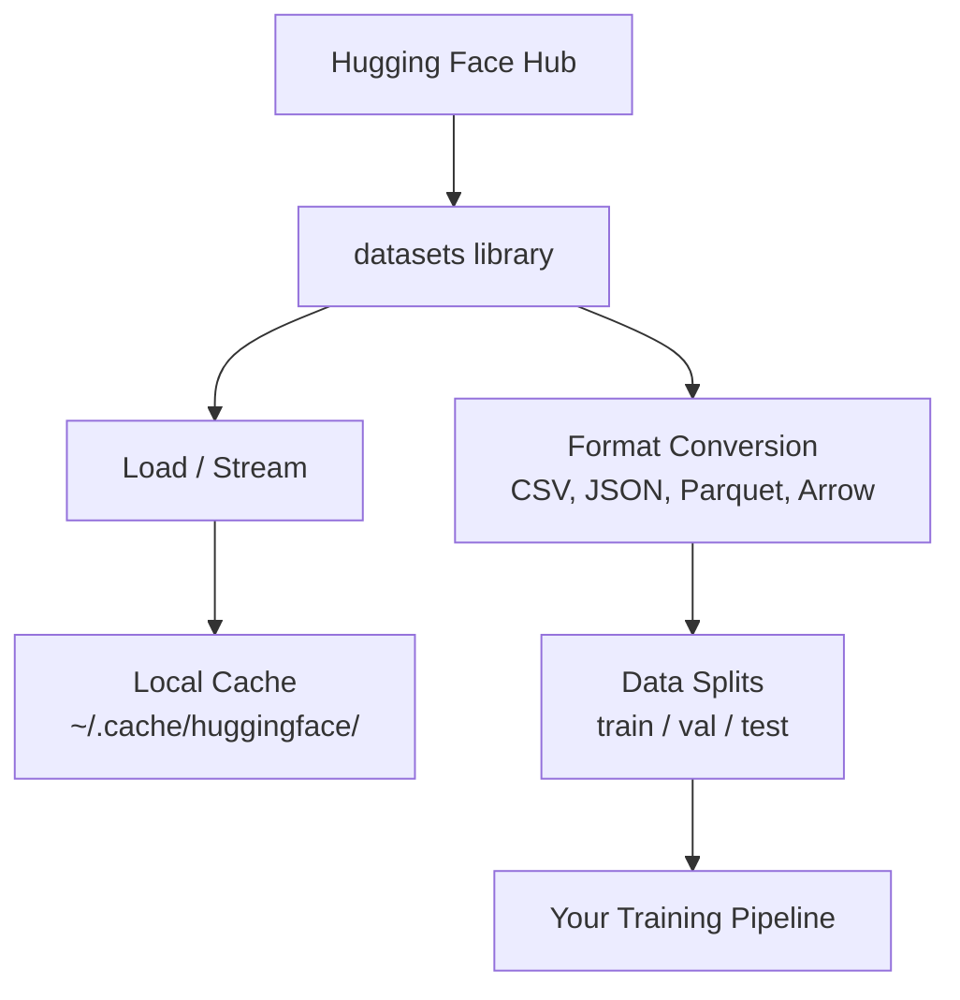

# إدارة البيانات

> البيانات هي الوقود. إن كيفية إدارتك لها تحدد مدى سرعة تقدمك.

**النوع:** بناء
** اللغة: ** بايثون
**المتطلبات الأساسية:** المرحلة 0، الدرس 01
**الوقت:** ~45 دقيقة

## أهداف التعلم

- تحميل مجموعات البيانات ودفقها وتخزينها مؤقتًا باستخدام مكتبة Hugging Face `datasets`
- التحويل بين تنسيقات CSV وJSON وParquet وArrow وشرح المفاضلات بينها
- إنشاء تقسيمات قطار/تحقق/اختبار قابلة للتكرار باستخدام بذور عشوائية ثابتة
- إدارة ملفات النماذج ومجموعة البيانات الكبيرة باستخدام `.gitignore` أو Git LFS أو DVC

## المشكلة

يبدأ كل مشروع للذكاء الاصطناعي بالبيانات. تحتاج إلى العثور على مجموعات البيانات، وتنزيلها، والتحويل بين التنسيقات، وتقسيمها للتدريب والتقييم، وإصدارها بحيث تكون التجارب قابلة للتكرار. يعد القيام بذلك يدويًا في كل مرة أمرًا بطيئًا وعرضة للخطأ. أنت بحاجة إلى سير عمل قابل للتكرار.

##المفهوم



مكتبة Hugging Face `datasets` هي الطريقة القياسية لتحميل البيانات لعمل الذكاء الاصطناعي. فهو يتعامل مع التنزيل والتخزين المؤقت وتحويل التنسيق والبث خارج الصندوق.

## بنائها

### الخطوة 1: تثبيت مكتبة مجموعات البيانات

```bash
pip install datasets huggingface_hub
```

### الخطوة الثانية: تحميل مجموعة البيانات

```python
from datasets import load_dataset

dataset = load_dataset("imdb")
print(dataset)
print(dataset["train"][0])
```

يؤدي هذا إلى تنزيل مجموعة بيانات مراجعة الأفلام IMDB. بعد التنزيل الأول، يتم تحميله من ذاكرة التخزين المؤقت في `~/.cache/huggingface/datasets/`.

### الخطوة 3: دفق مجموعات البيانات الكبيرة

بعض مجموعات البيانات كبيرة جدًا بحيث لا يمكن احتواؤها على القرص. يقوم البث بتحميلها صفًا تلو الآخر دون تنزيل المحتوى بالكامل.

```python
dataset = load_dataset("wikimedia/wikipedia", "20220301.en", split="train", streaming=True)

for i, example in enumerate(dataset):
    print(example["title"])
    if i >= 4:
        break
```

يمنحك البث `IterableDataset`. يمكنك معالجة الصفوف فور وصولها. يظل استخدام الذاكرة ثابتًا بغض النظر عن حجم مجموعة البيانات.

### الخطوة 4: تنسيقات مجموعة البيانات

تستخدم مكتبة `datasets` سهم Apache أسفل الغطاء. يمكنك التحويل إلى تنسيقات أخرى اعتمادًا على ما يحتاجه خط الأنابيب الخاص بك.

```python
dataset = load_dataset("imdb", split="train")

dataset.to_csv("imdb_train.csv")
dataset.to_json("imdb_train.json")
dataset.to_parquet("imdb_train.parquet")
```

مقارنة التنسيق:

| تنسيق | الحجم | سرعة القراءة | الأفضل لـ |
|--------|------|-----------|----------|
| CSV | كبير | بطيء | سهولة القراءة البشرية وجداول البيانات |
| جيسون | كبير | بطيء | واجهات برمجة التطبيقات، البيانات المتداخلة |
| باركيه | صغير | سريع | التحليلات والاستعلامات العمودية |
| السهم | صغير | الأسرع | المعالجة داخل الذاكرة (ما يستخدمه `datasets` داخليًا) |

بالنسبة لعمل الذكاء الاصطناعي، يعتبر الباركيه هو أفضل تنسيق للتخزين. السهم هو ما تعمل به في الذاكرة. CSV وJSON مخصصان للتبادل.

### الخطوة 5: تقسيم البيانات

يحتاج كل مشروع ML إلى ثلاثة أقسام:

- **التدريب**: يتعلم النموذج من ذلك (عادةً 80%)
- **التحقق**: يمكنك التحقق من التقدم أثناء التدريب (عادةً 10%)
- **الاختبار**: التقييم النهائي بعد الانتهاء من التدريب (عادةً 10%)

تأتي بعض مجموعات البيانات مقسمة مسبقًا. عندما لا يفعلون ذلك، قم بتقسيمهم بنفسك:

```python
dataset = load_dataset("imdb", split="train")

split = dataset.train_test_split(test_size=0.2, seed=42)
train_val = split["train"].train_test_split(test_size=0.125, seed=42)

train_ds = train_val["train"]
val_ds = train_val["test"]
test_ds = split["test"]

print(f"Train: {len(train_ds)}, Val: {len(val_ds)}, Test: {len(test_ds)}")
```

قم دائمًا بتعيين بذرة للتكاثر. نفس البذرة تنتج نفس الانقسام في كل مرة.

### الخطوة 6: تنزيل النماذج وتخزينها مؤقتًا

النماذج عبارة عن ملفات كبيرة. تتولى مكتبة `huggingface_hub` عملية التنزيل والتخزين المؤقت.

```python
from huggingface_hub import hf_hub_download, snapshot_download

model_path = hf_hub_download(
    repo_id="sentence-transformers/all-MiniLM-L6-v2",
    filename="config.json"
)
print(f"Cached at: {model_path}")

model_dir = snapshot_download("sentence-transformers/all-MiniLM-L6-v2")
print(f"Full model at: {model_dir}")
```

يتم تخزين النماذج مؤقتًا في `~/.cache/huggingface/hub/`. بمجرد التنزيل، يتم تحميلها على الفور في عمليات التشغيل اللاحقة.

### الخطوة 7: التعامل مع الملفات الكبيرة

لا ينبغي أن تدخل أوزان النماذج ومجموعات البيانات الكبيرة في البوابة. ثلاثة خيارات:

**الخيار أ: .gitignore (الأبسط)**

```
*.bin
*.safetensors
*.pt
*.onnx
data/*.parquet
data/*.csv
models/
```

**الخيار ب: Git LFS (تتبع الملفات الكبيرة في git)**

```bash
git lfs install
git lfs track "*.bin"
git lfs track "*.safetensors"
git add .gitattributes
```

يقوم Git LFS بتخزين المؤشرات في الريبو الخاص بك والملفات الفعلية على خادم منفصل. يمنحك GitHub 1 غيغابايت مجانًا.

**الخيار ج: DVC (التحكم في إصدار البيانات)**

```bash
pip install dvc
dvc init
dvc add data/training_set.parquet
git add data/training_set.parquet.dvc data/.gitignore
git commit -m "Track training data with DVC"
```

يقوم DVC بإنشاء ملفات `.dvc` صغيرة تشير إلى بياناتك. البيانات نفسها موجودة في S3 أو GCS أو أي واجهة خلفية أخرى للتخزين عن بعد.

| النهج | التعقيد | الأفضل لـ |
|----------|----------|----------|
| .gitignore | منخفض | المشاريع الشخصية، البيانات التي تم تنزيلها والتي يمكنك إعادة جلبها |
| جيت LFS | متوسطة | تشارك الفرق أوزان النماذج عبر git |
| دي في سي | عالية | تجارب قابلة للتكرار، مجموعات بيانات كبيرة، فرق |

لهذه الدورة، `.gitignore` يكفي. استخدم DVC عندما تحتاج إلى إعادة إنتاج تجارب دقيقة عبر الأجهزة.

### الخطوة 8: أنماط التخزين

**التخزين المحلي** يعمل مع مجموعات البيانات التي يقل حجمها عن 10 جيجابايت تقريبًا. تتعامل ذاكرة التخزين المؤقت HF مع هذا تلقائيًا.

**التخزين السحابي** مخصص لأي شيء أكبر أو مشترك عبر الأجهزة:

```python
import os

local_path = os.path.expanduser("~/.cache/huggingface/datasets/")

# s3_path = "s3://my-bucket/datasets/"
# gcs_path = "gs://my-bucket/datasets/"
```

يتكامل DVC مع S3 وGCS مباشرة:

```bash
dvc remote add -d myremote s3://my-bucket/dvc-store
dvc push
```

بالنسبة لهذه الدورة، التخزين المحلي كافٍ. يصبح التخزين السحابي ذا صلة عندما تقوم بضبط مثيلات GPU البعيدة.

## مجموعات البيانات المستخدمة في هذه الدورة

| مجموعة البيانات | الدروس | الحجم | ما يعلمه |
|---------|--------|------|----------------|
| موقع آي إم دي بي | الترميز والتصنيف | 84 ميجا بايت | أساسيات تصنيف النص |
| ويكي النص | النمذجة اللغوية | 181 ميجا | التنبؤ بالرمز التالي |
| فرقة | أنظمة ضمان الجودة | 35 ميجا | إجابة السؤال، يمتد |
| الزحف المشترك (مجموعة فرعية) | التضمينات | يختلف | معالجة النصوص على نطاق واسع |
| منيست | أساسيات الرؤية | 21 ميجا | أساسيات تصنيف الصور |
| كوكو (مجموعة فرعية) | الوسائط المتعددة | يختلف | أزواج الصور والنص |

لا تحتاج إلى تنزيل كل هذه الآن. يحدد كل درس ما يحتاج إليه.

## استخدمه

قم بتشغيل البرنامج النصي للأداة المساعدة للتحقق من أن كل شيء يعمل:

```bash
python code/data_utils.py
```

يؤدي ذلك إلى تنزيل مجموعة بيانات صغيرة، وتحويلها، وتقسيمها، وطباعة ملخص.

## اشحنها

ينتج هذا الدرس:
- `code/data_utils.py` - أداة تحميل وتخزين مؤقت للبيانات قابلة لإعادة الاستخدام
- `outputs/prompt-data-helper.md` - المطالبة بالعثور على مجموعة البيانات المناسبة لمهمة ما

## تمارين

1. قم بتحميل مجموعة البيانات `glue` بتكوين `mrpc` وافحص الأمثلة الخمسة الأولى
2. قم ببث مجموعة البيانات `c4` واحسب عدد الأمثلة التي يمكنك معالجتها في 10 ثوانٍ
3. قم بتحويل مجموعة بيانات إلى Parquet وقارن حجم الملف بملف CSV
4. قم بإنشاء تقسيم 70/15/15 تدريب/فال/اختبار ببذرة ثابتة وتحقق من الأحجام

## المصطلحات الرئيسية

| مصطلح | ماذا يقول الناس | ماذا يعني في الواقع |
|------|----------------|----------------------|
| تقسيم مجموعة البيانات | "بيانات التدريب" | مجموعة فرعية مسماة (تدريب/فال/اختبار) تُستخدم في مراحل مختلفة من دورة حياة تعلم الآلة |
| الجري | "تحميله بتكاسل" | معالجة صف البيانات تلو الآخر من مصدر بعيد دون تنزيل مجموعة البيانات الكاملة |
| باركيه | "ملف CSV مضغوط" | تنسيق ملف عمودي محسّن للاستعلامات التحليلية وكفاءة التخزين |
| السهم | "إطار بيانات سريع" | تنسيق عمودي في الذاكرة يُستخدم داخليًا بواسطة مكتبة مجموعات البيانات لقراءات النسخة الصفرية |
| جيت LFS | "Git للملفات الكبيرة" | ملحق يقوم بتخزين الملفات الكبيرة خارج git repo مع الاحتفاظ بالمؤشرات في التحكم في الإصدار |
| دي في سي | "بوابة للبيانات" | نظام للتحكم في إصدار مجموعات البيانات والنماذج التي تتكامل مع التخزين السحابي |
| ذاكرة التخزين المؤقت | "تم التنزيل بالفعل" | نسخة محلية من البيانات التي تم جلبها مسبقًا، ومخزنة في ~/.cache/huggingface/ بشكل افتراضي |