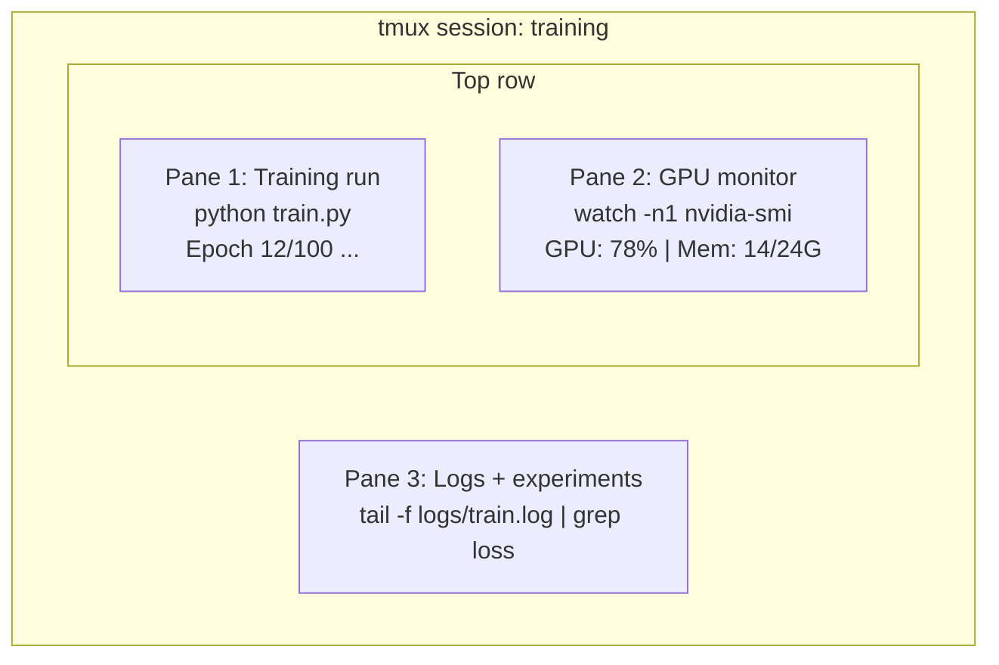

# المحطة والصدفة

> المحطة هي المكان الذي يعيش فيه مهندسو الذكاء الاصطناعي. احصل على الراحة هنا.

**النوع:** تعلم
**اللغات:** --
**المتطلبات الأساسية:** المرحلة 0، الدرس 01
**الوقت:** ~35 دقيقة

## أهداف التعلم

- استخدم الأنابيب وعمليات إعادة التوجيه و`grep` لتصفية سجلات التدريب ومعالجتها من سطر الأوامر
- إنشاء جلسات tmux مستمرة مع أجزاء متعددة للتدريب المتزامن ومراقبة وحدة معالجة الرسومات
- مراقبة موارد النظام ووحدة معالجة الرسومات باستخدام `htop` و`nvtop` و`nvidia-smi`
- نقل الملفات بين الأجهزة المحلية والبعيدة باستخدام SSH، `scp`، و`rsync`

## المشكلة

سوف تقضي وقتًا أطول في المحطة أكثر من أي محرر. عمليات التدريب، ومراقبة وحدة معالجة الرسومات، وتتبع السجل، وجلسات SSH عن بعد، وإدارة البيئة. كل سير عمل للذكاء الاصطناعي يلامس الغلاف. إذا كنت بطيئا هنا، فأنت بطيء في كل مكان.

يغطي هذا الدرس المهارات النهائية التي تهم عمل الذكاء الاصطناعي. لا يوجد تاريخ يونكس. لا داعي للتعمق في البرمجة النصية لـ Bash. فقط ما تحتاجه.

##المفهوم



ثلاثة أشياء تعمل في وقت واحد. محطة واحدة. يمكنك الانفصال والعودة إلى المنزل وإعادة الدخول إلى SSH وإعادة التوصيل. التدريب مستمر.

## بنائها

### الخطوة 1: تعرف على صدفتك

تحقق من الصدفة التي تقوم بتشغيلها:

```bash
echo $SHELL
```

تستخدم معظم الأنظمة `bash` أو `zsh`. كلاهما يعمل بشكل جيد. الأوامر الموجودة في هذه الدورة تعمل في أي منهما.

الأشياء الرئيسية التي يجب معرفتها:

```bash
# Move around
cd ~/projects/ai-engineering-from-scratch
pwd
ls -la

# History search (most useful shortcut you'll learn)
# Ctrl+R then type part of a previous command
# Press Ctrl+R again to cycle through matches

# Clear terminal
clear   # or Ctrl+L

# Cancel a running command
# Ctrl+C

# Suspend a running command (resume with fg)
# Ctrl+Z
```

### الخطوة الثانية: التوصيل وإعادة التوجيه

تربط الأنابيب الأوامر معًا. هذه هي الطريقة التي تعالج بها السجلات وتصفية المخرجات وأدوات السلسلة. سوف تستخدم هذا باستمرار.

```bash
# Count how many times "loss" appears in a log
cat train.log | grep "loss" | wc -l

# Extract just the loss values from training output
grep "loss:" train.log | awk '{print $NF}' > losses.txt

# Watch a log file update in real time, filtering for errors
tail -f train.log | grep --line-buffered "ERROR"

# Sort experiments by final accuracy
grep "final_accuracy" results/*.log | sort -t= -k2 -n -r

# Redirect stdout and stderr to separate files
python train.py > output.log 2> errors.log

# Redirect both to the same file
python train.py > train_full.log 2>&1
```

عمليات إعادة التوجيه الثلاثة التي تحتاجها:

| الرمز | ماذا يفعل |
|--------|------------|
| `>` | اكتب stdout إلى الملف (الكتابة فوق) |
| __الكود_1__ | إلحاق stdout بالملف |
| __الكود_2__ | اكتب stderr إلى الملف |
| __الكود_3__ | أرسل stderr إلى نفس مكان stdout |
| __الكود_4__ | أرسل stdout لأمر واحد كـ stdin إلى التالي |

### الخطوة 3: العمليات الخلفية

تستغرق فترات التدريب ساعات. لا ترغب في إبقاء جهازك مفتوحًا طوال الوقت.

```bash
# Run in background (output still goes to terminal)
python train.py &

# Run in background, immune to hangup (closing terminal won't kill it)
nohup python train.py > train.log 2>&1 &

# Check what's running in background
jobs
ps aux | grep train.py

# Bring a background job to foreground
fg %1

# Kill a background process
kill %1
# or find its PID and kill that
kill $(pgrep -f "train.py")
```

الفرق بين `&` و`nohup` و`screen`/`tmux`:

| الطريقة | هل ينجو من إغلاق المحطة؟ | يمكن إعادة ربط؟ |
|--------|------------------------|--------------|
| `command &` | لا | لا |
| __الكود_1__ | نعم | لا (راجع ملف السجل) |
| `screen` / `tmux` | نعم | نعم |

لأي شيء أطول من بضع دقائق، استخدم tmux.

### الخطوة 4: تموكس

يتيح لك tmux إنشاء جلسات طرفية مستمرة بأجزاء متعددة. هذه هي الأداة الوحيدة الأكثر فائدة لإدارة عمليات التدريب.

```bash
# Install
# macOS
brew install tmux
# Ubuntu
sudo apt install tmux

# Start a named session
tmux new -s training

# Split horizontally
# Ctrl+B then "

# Split vertically
# Ctrl+B then %

# Navigate between panes
# Ctrl+B then arrow keys

# Detach (session keeps running)
# Ctrl+B then d

# Reattach
tmux attach -t training

# List sessions
tmux ls

# Kill a session
tmux kill-session -t training
```

جلسة سير عمل نموذجية للذكاء الاصطناعي:

```bash
tmux new -s train

# Pane 1: start training
python train.py --epochs 100 --lr 1e-4

# Ctrl+B, " to split, then run GPU monitor
watch -n1 nvidia-smi

# Ctrl+B, % to split vertically, tail the logs
tail -f logs/experiment.log

# Now detach with Ctrl+B, d
# SSH out, go get coffee, come back
# tmux attach -t train
```

### الخطوة 5: المراقبة باستخدام htop وnvtop

```bash
# System processes (better than top)
htop

# GPU processes (if you have NVIDIA GPU)
# Install: sudo apt install nvtop (Ubuntu) or brew install nvtop (macOS)
nvtop

# Quick GPU check without nvtop
nvidia-smi

# Watch GPU usage update every second
watch -n1 nvidia-smi

# See which processes are using the GPU
nvidia-smi --query-compute-apps=pid,name,used_memory --format=csv
```

`htop` روابط المفاتيح التي ستستخدمها:
- `F6` أو `>` للفرز حسب العمود (الفرز حسب الذاكرة للعثور على تسرب الذاكرة)
- `F5` لتبديل العرض الشجري (راجع العمليات الفرعية)
- `F9` لقتل العملية
- `/` للبحث عن اسم العملية

### الخطوة 6: SSH لصناديق GPU البعيدة

عند استئجار وحدة معالجة رسومات سحابية (Lambda، وRunPod، وVast.ai)، فإنك تتصل عبر SSH.

```bash
# Basic connection
ssh user@gpu-box-ip

# With a specific key
ssh -i ~/.ssh/my_gpu_key user@gpu-box-ip

# Copy files to remote
scp model.pt user@gpu-box-ip:~/models/

# Copy files from remote
scp user@gpu-box-ip:~/results/metrics.json ./

# Sync a whole directory (faster for many files)
rsync -avz ./data/ user@gpu-box-ip:~/data/

# Port forward (access remote Jupyter/TensorBoard locally)
ssh -L 8888:localhost:8888 user@gpu-box-ip
# Now open localhost:8888 in your browser

# SSH config for convenience
# Add to ~/.ssh/config:
# Host gpu
#     HostName 192.168.1.100
#     User ubuntu
#     IdentityFile ~/.ssh/gpu_key
#
# Then just:
# ssh gpu
```

### الخطوة 7: أسماء مستعارة مفيدة لعمل الذكاء الاصطناعي

أضف هذه إلى `~/.bashrc` أو `~/.zshrc`:

```bash
source phases/00-setup-and-tooling/10-terminal-and-shell/code/shell_aliases.sh
```

أو انسخ ما تريد. الأسماء المستعارة الرئيسية:

```bash
# GPU status at a glance
alias gpu='nvidia-smi --query-gpu=index,name,utilization.gpu,memory.used,memory.total,temperature.gpu --format=csv,noheader'

# Kill all Python training processes
alias killtraining='pkill -f "python.*train"'

# Quick virtual environment activate
alias ae='source .venv/bin/activate'

# Watch training loss
alias watchloss='tail -f logs/*.log | grep --line-buffered "loss"'
```

راجع `code/shell_aliases.sh` للاطلاع على المجموعة الكاملة.

### الخطوة 8: الأنماط الطرفية الشائعة للذكاء الاصطناعي

هذه تأتي مرارا وتكرارا في الممارسة العملية:

```bash
# Run training, log everything, notify when done
python train.py 2>&1 | tee train.log; echo "DONE" | mail -s "Training complete" you@email.com

# Compare two experiment logs side by side
diff <(grep "accuracy" exp1.log) <(grep "accuracy" exp2.log)

# Find the largest model files (clean up disk space)
find . -name "*.pt" -o -name "*.safetensors" | xargs du -h | sort -rh | head -20

# Download a model from Hugging Face
wget https://huggingface.co/model/resolve/main/model.safetensors

# Untar a dataset
tar xzf dataset.tar.gz -C ./data/

# Count lines in all Python files (see how big your project is)
find . -name "*.py" | xargs wc -l | tail -1

# Check disk space (training data fills disks fast)
df -h
du -sh ./data/*

# Environment variable check before training
env | grep -i cuda
env | grep -i torch
```

## استخدمه

إليك وقت تشغيل كل أداة خلال هذه الدورة:

| أداة | عند استخدامه |
|------|----------------|
| تموكس | كل جولة تدريبية (المراحل 3+) |
| `tail -f` + `grep` | مراقبة سجلات التدريب |
| `nohup` / `&` | مهام خلفية سريعة |
| `htop` / `nvtop` | تصحيح أخطاء التدريب البطيء وأخطاء OOM |
| سش + `rsync` | العمل على وحدات معالجة الرسومات السحابية |
| الأنابيب + عمليات إعادة التوجيه | معالجة نتائج التجربة |
| الأسماء المستعارة | توفير الوقت في الأوامر المتكررة |

## تمارين

1. قم بتثبيت tmux، وأنشئ جلسة من ثلاثة أجزاء، وقم بتشغيل `htop` في جزء واحد، و`watch -n1 date` في جزء آخر، وبرنامج نصي Python في الجزء الثالث. افصل وأعد التوصيل.
2. أضف الأسماء المستعارة من `code/shell_aliases.sh` إلى تكوين Shell الخاص بك وأعد التحميل باستخدام `source ~/.zshrc` (أو `~/.bashrc`).
3. قم بإنشاء سجل تدريب مزيف باستخدام `for i in $(seq 1 100); do echo "epoch $i loss: $(echo "scale=4; 1/$i" | bc)"; sleep 0.1; done > fake_train.log` ثم استخدم `grep` و`tail` و`awk` لاستخراج قيم الخسارة فقط.
4. قم بإعداد إدخال تكوين SSH للخادم الذي يمكنك الوصول إليه (أو استخدم `localhost` للتدرب على بناء الجملة).

## المصطلحات الرئيسية

| مصطلح | ماذا يقول الناس | ماذا يعني في الواقع |
|------|----------------|----------------------|
| شل | "المحطة" | البرنامج الذي يفسر أوامرك (bash,zsh,fish) |
| تموكس | "متعدد الإرسال الطرفي" | برنامج يتيح لك تشغيل جلسات طرفية متعددة داخل نافذة واحدة، وفصل/إعادة توصيل |
| الأنابيب | "الشيء البار" | عامل التشغيل `\|` الذي يرسل مخرجات أحد الأوامر كمدخل إلى | آخر
| معرف المنتج | "معرف العملية" | رقم فريد مخصص لكل عملية قيد التشغيل، يستخدم لمراقبتها أو إيقافها |
| نوحوب | "لا يوجد تعليق" | يقوم بتشغيل أمر محصن ضد إشارة قطع الاتصال، لذا فإن إغلاق الجهاز لن يقتله |
| سش | "الاتصال بالخادم" | Secure Shell، بروتوكول مشفر لتشغيل الأوامر على جهاز بعيد |