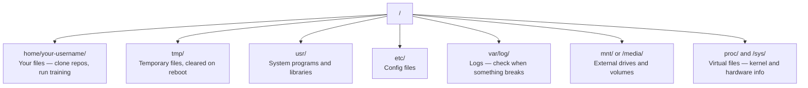

# لينكس للذكاء الاصطناعي

> تعمل معظم أنظمة الذكاء الاصطناعي على نظام التشغيل Linux. عليك أن تعرف ما يكفي حتى لا تتعثر.

**النوع:** تعلم
**اللغات:** --
**المتطلبات الأساسية:** المرحلة 0، الدرس 01
**الوقت:** ~30 دقيقة

## أهداف التعلم

- التنقل في نظام ملفات Linux وإجراء عمليات الملفات الأساسية من سطر الأوامر
- إدارة أذونات الملفات باستخدام `chmod` و`chown` لحل أخطاء "تم رفض الإذن"
- قم بتثبيت حزم النظام باستخدام `apt` وقم بإعداد صندوق GPU جديد لعمل الذكاء الاصطناعي
- تحديد الاختلافات بين نظامي التشغيل MacOS وLinux التي تؤدي عادةً إلى تعثر المطورين الذين يعملون على الأجهزة البعيدة

## المشكلة

أنت تقوم بالتطوير على نظام التشغيل macOS أو Windows. ولكن في اللحظة التي تقوم فيها بإدخال SSH في صندوق GPU السحابي، أو استئجار مثيل Lambda، أو تشغيل جهاز EC2، فإنك تصل إلى Ubuntu. المحطة هي الواجهة الوحيدة الخاصة بك. لا يوجد Finder، ولا Explorer، ولا واجهة المستخدم الرسومية. إذا لم تتمكن من التنقل في نظام الملفات، وتثبيت الحزم، وإدارة العمليات من سطر الأوامر، فستكون عالقًا في الدفع مقابل ساعات وحدة معالجة الرسومات الخاملة أثناء البحث في Google عن "كيفية فك ضغط ملف في Linux".

هذا هو دليل البقاء على قيد الحياة. إنه يغطي بالضبط ما تحتاجه للعمل على جهاز Linux عن بعد لعمل الذكاء الاصطناعي. لا شيء أكثر.

## تخطيط نظام الملفات

ينظم Linux كل شيء تحت جذر واحد `/`. لا يوجد `C:\` أو `/Volumes`. الدلائل التي ستلمسها فعليًا:



الدليل الرئيسي الخاص بك هو `~` أو `/home/your-username`. تقريبا كل ما تفعله يحدث هنا.

## الأوامر الأساسية

هذه هي الأوامر الخمسة عشر التي تغطي 95% مما ستفعله في صندوق وحدة معالجة الرسومات (GPU) البعيد.

### التحرك

```bash
pwd                         # Where am I?
ls                          # What's here?
ls -la                      # What's here, including hidden files with details?
cd /path/to/dir             # Go there
cd ~                        # Go home
cd ..                       # Go up one level
```

### الملفات والدلائل

```bash
mkdir my-project            # Create a directory
mkdir -p a/b/c              # Create nested directories in one shot

cp file.txt backup.txt      # Copy a file
cp -r src/ src-backup/      # Copy a directory (recursive)

mv old.txt new.txt          # Rename a file
mv file.txt /tmp/           # Move a file

rm file.txt                 # Delete a file (no trash, it's gone)
rm -rf my-dir/              # Delete a directory and everything inside
```

`rm -rf` دائم. ليس هناك التراجع. تحقق جيدًا من المسار قبل الضغط على زر الإدخال.

### قراءة الملفات

```bash
cat file.txt                # Print entire file
head -20 file.txt           # First 20 lines
tail -20 file.txt           # Last 20 lines
tail -f log.txt             # Follow a log file in real time (Ctrl+C to stop)
less file.txt               # Scroll through a file (q to quit)
```

### البحث

```bash
grep "error" training.log           # Find lines containing "error"
grep -r "learning_rate" .           # Search all files in current directory
grep -i "cuda" config.yaml          # Case-insensitive search

find . -name "*.py"                 # Find all Python files under current dir
find . -name "*.ckpt" -size +1G     # Find checkpoint files larger than 1GB
```

## الأذونات

كل ملف في Linux له مالك وبت إذن. سوف تواجه هذا عندما لا يتم تنفيذ البرامج النصية أو عندما لا تتمكن من الكتابة إلى الدليل.

```bash
ls -l train.py
# -rwxr-xr-- 1 user group 2048 Mar 19 10:00 train.py
#  ^^^             owner permissions: read, write, execute
#     ^^^          group permissions: read, execute
#        ^^        everyone else: read only
```

الإصلاحات المشتركة:

```bash
chmod +x train.sh           # Make a script executable
chmod 755 deploy.sh         # Owner: full, others: read+execute
chmod 644 config.yaml       # Owner: read+write, others: read only

chown user:group file.txt   # Change who owns a file (needs sudo)
```

عندما يقول شيء ما "تم رفض الإذن"، فغالبًا ما يكون ذلك مشكلة تتعلق بالأذونات. `chmod +x` أو `sudo` سيصلح معظم الحالات.

## إدارة الحزم (مناسبة)

يستخدم أوبونتو `apt`. هذه هي الطريقة التي تقوم بها بتثبيت البرامج على مستوى النظام.

```bash
sudo apt update             # Refresh the package list (always do this first)
sudo apt install -y htop    # Install a package (-y skips confirmation)
sudo apt install -y build-essential  # C compiler, make, etc. Needed by many Python packages
sudo apt install -y tmux    # Terminal multiplexer (keep sessions alive after disconnect)

apt list --installed        # What's installed?
sudo apt remove htop        # Uninstall
```

الحزم الشائعة التي ستقوم بتثبيتها على صندوق GPU جديد:

```bash
sudo apt update && sudo apt install -y \
    build-essential \
    git \
    curl \
    wget \
    tmux \
    htop \
    unzip \
    python3-venv
```

## المستخدمون و Sudo

عادةً ما يتم تسجيل دخولك كمستخدم عادي. تحتاج بعض العمليات إلى وصول الجذر (المسؤول).

```bash
whoami                      # What user am I?
sudo command                # Run a single command as root
sudo su                     # Become root (exit to go back, use sparingly)
```

في مثيلات وحدة معالجة الرسومات السحابية، عادةً ما تكون أنت المستخدم الوحيد ولديك حق الوصول إلى Sudo بالفعل. لا تقم بتشغيل كل شيء كجذر. استخدم Sudo فقط عند الحاجة.

## العمليات والنظامد

عند تعليق التدريب الخاص بك، أو عندما تحتاج إلى التحقق مما يجري:

```bash
htop                        # Interactive process viewer (q to quit)
ps aux | grep python        # Find running Python processes
kill 12345                  # Gracefully stop process with PID 12345
kill -9 12345               # Force kill (use when graceful doesn't work)
nvidia-smi                  # GPU processes and memory usage
```

يدير systemd الخدمات (شياطين الخلفية). ستستخدمه إذا قمت بتشغيل خوادم الاستدلال:

```bash
sudo systemctl start nginx          # Start a service
sudo systemctl stop nginx           # Stop it
sudo systemctl restart nginx        # Restart it
sudo systemctl status nginx         # Check if it's running
sudo systemctl enable nginx         # Start automatically on boot
```

## مساحة القرص

غالبًا ما تحتوي صناديق GPU على مساحة محدودة على القرص. النماذج ومجموعات البيانات تملأها بسرعة.

```bash
df -h                       # Disk usage for all mounted drives
df -h /home                 # Disk usage for /home specifically

du -sh *                    # Size of each item in current directory
du -sh ~/.cache             # Size of your cache (pip, huggingface models land here)
du -sh /data/checkpoints/   # Check how big your checkpoints are

# Find the biggest space hogs
du -h --max-depth=1 / 2>/dev/null | sort -hr | head -20
```

مدخرات المساحة الشائعة:

```bash
# Clear pip cache
pip cache purge

# Clear apt cache
sudo apt clean

# Remove old checkpoints you don't need
rm -rf checkpoints/epoch_01/ checkpoints/epoch_02/
```

## الشبكات

ستقوم بتنزيل النماذج ونقل الملفات والنقر على واجهات برمجة التطبيقات (APIs) من سطر الأوامر.

```bash
# Download files
wget https://example.com/model.bin                   # Download a file
curl -O https://example.com/data.tar.gz              # Same thing with curl
curl -s https://api.example.com/health | python3 -m json.tool  # Hit an API, pretty-print JSON

# Transfer files between machines
scp model.bin user@remote:/data/                     # Copy file to remote machine
scp user@remote:/data/results.csv .                  # Copy file from remote to local
scp -r user@remote:/data/checkpoints/ ./local-dir/   # Copy directory

# Sync directories (faster than scp for large transfers, resumes on failure)
rsync -avz --progress ./data/ user@remote:/data/
rsync -avz --progress user@remote:/results/ ./results/
```

استخدم `rsync` بدلاً من `scp` لأي شيء كبير. فهو ينقل فقط البايتات التي تم تغييرها ويتعامل مع الاتصالات المتقطعة.

## tmux: حافظ على الجلسات حية

عندما تدخل SSH إلى صندوق بعيد، فإن إغلاق الكمبيوتر المحمول الخاص بك يقتل تشغيلك التدريبي. tmux يمنع هذا.

```bash
tmux new -s train           # Start a new session named "train"
# ... start your training, then:
# Ctrl+B, then D            # Detach (training keeps running)

tmux ls                     # List sessions
tmux attach -t train        # Reattach to session

# Inside tmux:
# Ctrl+B, then %            # Split pane vertically
# Ctrl+B, then "            # Split pane horizontally
# Ctrl+B, then arrow keys   # Switch between panes
```

قم دائمًا بتشغيل وظائف التدريب الطويلة داخل tmux. دائماً.

## WSL2 لمستخدمي Windows

إذا كنت تستخدم نظام التشغيل Windows، فإن WSL2 يمنحك بيئة Linux حقيقية دون تشغيل مزدوج.

```bash
# In PowerShell (admin)
wsl --install -d Ubuntu-24.04

# After restart, open Ubuntu from Start menu
sudo apt update && sudo apt upgrade -y
```

يدير WSL2 نواة Linux حقيقية. كل شيء في هذا الدرس يعمل بداخله. ملفات Windows الخاصة بك موجودة في `/mnt/c/Users/YourName/` من داخل WSL.

يعمل عبور GPU مع برامج تشغيل NVIDIA المثبتة على جانب Windows. قم بتثبيت برنامج تشغيل Windows NVIDIA (وليس برنامج تشغيل Linux)، وسيكون CUDA متاحًا داخل WSL2.

## Gotchas: macOS إلى Linux

الأشياء التي ستزعجك إذا كنت قادمًا من نظام التشغيل macOS:

| ماك | لينكس | ملاحظات |
|-------|-------|-------|
| `brew install` | __الكود_1__ | أسماء حزم مختلفة في بعض الأحيان. `brew install htop` مقابل `sudo apt install htop` يعمل بنفس الطريقة، لكن `brew install readline` مقابل `sudo apt install libreadline-dev` لا يعمل. |
| __الكود_6__ | __الكود_7__ | لكن لن يكون لديك واجهة مستخدم رسومية على جهاز بعيد. استخدم `cat` أو `less`. |
| `pbcopy` / `pbpaste` | غير متوفر | التوجيه من/إلى الحافظة غير موجود عبر SSH. |
| __الكود_12__ | __الكود_13__ | يتم تعيين نظام التشغيل macOS افتراضيًا على zsh. تستخدم معظم خوادم Linux نظام bash. |
| __الكود_14__ | `/usr/bin/`, `/usr/local/bin/` | الثنائيات تعيش في أماكن مختلفة. |
| __الكود_17__ | __الكود_18__ | يحتاج macOS sed إلى سلسلة فارغة بعد `-i`. لينكس لا. |
| نظام ملفات غير حساس لحالة الأحرف | نظام ملفات حساس لحالة الأحرف | `Model.py` و `model.py` هما ملفان مختلفان على Linux. |
| نهايات الأسطر `\n` | نهايات الأسطر `\n` | نفس. لكن Windows يستخدم `\r\n`، الذي يكسر البرامج النصية bash. قم بتشغيل `dos2unix` لإصلاحه. |

## البطاقة المرجعية السريعة

```
Navigation:     pwd, ls, cd, find
Files:          cp, mv, rm, mkdir, cat, head, tail, less
Search:         grep, find
Permissions:    chmod, chown, sudo
Packages:       apt update, apt install
Processes:      htop, ps, kill, nvidia-smi
Services:       systemctl start/stop/restart/status
Disk:           df -h, du -sh
Network:        curl, wget, scp, rsync
Sessions:       tmux new/attach/detach
```

## تمارين

1. قم بإدخال SSH إلى أي جهاز Linux (أو افتح WSL2) وانتقل إلى الدليل الرئيسي الخاص بك. أنشئ مجلد مشروع، وأنشئ ثلاثة ملفات فارغة بداخله باستخدام `touch`، ثم قم بإدراجها باستخدام `ls -la`.
2. قم بتثبيت `htop` باستخدام apt، وقم بتشغيله، وحدد العملية التي تستخدم أكبر قدر من الذاكرة.
3. ابدأ جلسة tmux، وقم بتشغيل `sleep 300` بداخلها، ثم افصلها، وأدرجها في قائمة الجلسات، ثم أعد توصيلها.
4. استخدم `df -h` للتحقق من مساحة القرص المتوفرة، ثم استخدم `du -sh ~/.cache/*` للعثور على ما يشغل مساحة في ذاكرة التخزين المؤقت لديك.
5. قم بنقل ملف من جهازك المحلي إلى جهاز بعيد باستخدام `scp`، ثم قم بنفس النقل باستخدام `rsync` وقارن التجربة.