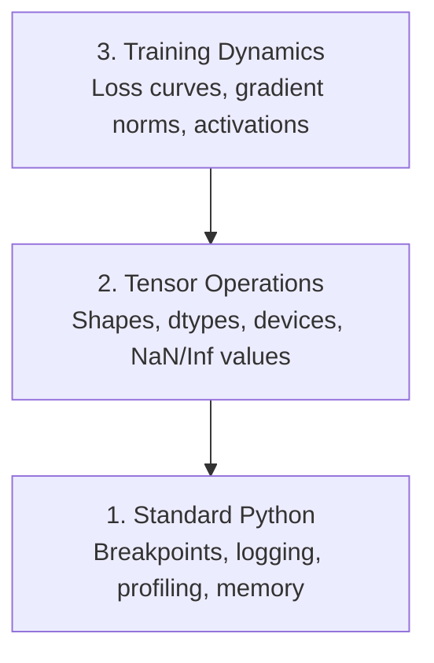

# التصحيح والتنميط

> أسوأ أخطاء الذكاء الاصطناعي لا تتعطل. إنهم يتدربون بصمت على القمامة ويبلغون عن منحنى خسارة جميل.

**النوع:** بناء
** اللغة: ** بايثون
**المتطلبات الأساسية:** الدرس 1 (بيئة التطوير)، المعرفة الأساسية بـ PyTorch
**الوقت:** ~60 دقيقة

## أهداف التعلم

- استخدم `breakpoint()` و`debug_print` الشرطي لفحص أشكال الموتر وأنواع d وقيم NaN في منتصف التدريب
- حلقات التدريب على الملف الشخصي مع `cProfile`، و`line_profiler`، و`tracemalloc` للعثور على الاختناقات
- اكتشاف أخطاء الذكاء الاصطناعي الشائعة: عدم تطابق الأشكال، وفقدان NaN، وتسرب البيانات، وموترات الجهاز الخاطئة
- قم بإعداد TensorBoard لتصور منحنيات الخسارة، والرسوم البيانية للوزن، وتوزيعات التدرج

## المشكلة

يفشل كود الذكاء الاصطناعي بشكل مختلف عن الكود العادي. يتعطل تطبيق الويب بسبب تتبع المكدس. تعمل حلقة التدريب التي تم تكوينها بشكل خاطئ لمدة 8 ساعات، وتحرق 200 دولار من وقت وحدة معالجة الرسومات، وتنتج نموذجًا يتنبأ بمتوسط ​​كل إدخال. لم يخطئ الكود أبدًا. كان الخطأ عبارة عن موتر على الجهاز الخطأ، أو `.detach()` منسي، أو تسميات تتسرب إلى الميزات.

أنت بحاجة إلى أدوات تصحيح الأخطاء التي تكتشف حالات الفشل الصامتة هذه قبل أن تضيع وقتك وتقوم بالحساب.

##المفهوم

يعمل تصحيح أخطاء الذكاء الاصطناعي على ثلاثة مستويات:



معظم الناس يقفزون مباشرة إلى المستوى 3 (يحدقون في TensorBoard). لكن 80% من أخطاء الذكاء الاصطناعي تعيش في المستويين 1 و2.

## بنائها

### الجزء الأول: تصحيح أخطاء الطباعة (نعم، إنه يعمل)

يتم رفض تصحيح أخطاء الطباعة. لا ينبغي ذلك. بالنسبة إلى كود الموتر، فإن عبارة الطباعة المستهدفة تتفوق على التنقل عبر مصحح الأخطاء لأنك تحتاج إلى رؤية الأشكال وأنواع dtypes ونطاقات القيمة كلها مرة واحدة.

```python
def debug_print(name, tensor):
    print(f"{name}: shape={tensor.shape}, dtype={tensor.dtype}, "
          f"device={tensor.device}, "
          f"min={tensor.min().item():.4f}, max={tensor.max().item():.4f}, "
          f"mean={tensor.mean().item():.4f}, "
          f"has_nan={tensor.isnan().any().item()}")
```

اتصل بهذا بعد كل عملية مشبوهة. عندما يتم العثور على الخطأ، قم بإزالة المطبوعات. بسيط.

### الجزء الثاني: مصحح أخطاء بايثون (pdb ونقطة التوقف)

تم الاستهانة بمصحح الأخطاء المدمج في عمل الذكاء الاصطناعي. أسقط `breakpoint()` في حلقة التدريب الخاصة بك وافحص الموترات بشكل تفاعلي.

```python
def training_step(model, batch, criterion, optimizer):
    inputs, labels = batch
    outputs = model(inputs)
    loss = criterion(outputs, labels)

    if loss.item() > 100 or torch.isnan(loss):
        breakpoint()

    loss.backward()
    optimizer.step()
```

عندما يوصلك مصحح الأخطاء، هناك أوامر مفيدة:

- `p outputs.shape` لفحص الأشكال
- `p loss.item()` لمعرفة قيمة الخسارة
- `p torch.isnan(outputs).sum()` لحساب NaNs
- `p model.fc1.weight.grad` للتحقق من التدرجات
- `c` للمتابعة، `q` للإنهاء

هذا هو التصحيح الشرطي. أنت تتوقف فقط عندما يبدو أن هناك خطأ ما. بالنسبة للجري التدريبي المكون من 10000 خطوة، فهذا مهم.

### الجزء الثالث: تسجيل بايثون

استبدل عبارات الطباعة بالتسجيل عندما يتجاوز تصحيح الأخطاء الفحص السريع.

```python
import logging

logging.basicConfig(
    level=logging.INFO,
    format="%(asctime)s [%(levelname)s] %(message)s",
    handlers=[
        logging.FileHandler("training.log"),
        logging.StreamHandler()
    ]
)
logger = logging.getLogger(__name__)

logger.info("Starting training: lr=%.4f, batch_size=%d", lr, batch_size)
logger.warning("Loss spike detected: %.4f at step %d", loss.item(), step)
logger.error("NaN loss at step %d, stopping", step)
```

يمنحك التسجيل الطوابع الزمنية ومستويات الخطورة وإخراج الملف. عندما يفشل تشغيل التدريب في الساعة 3 صباحًا، فأنت تريد ملف سجل، وليس مخرجات طرفية يتم تمريرها خارج الشاشة.

### الجزء الرابع: أقسام رمز التوقيت

معرفة أين يذهب الوقت هي الخطوة الأولى نحو التحسين.

```python
import time

class Timer:
    def __init__(self, name=""):
        self.name = name

    def __enter__(self):
        self.start = time.perf_counter()
        return self

    def __exit__(self, *args):
        elapsed = time.perf_counter() - self.start
        print(f"[{self.name}] {elapsed:.4f}s")

with Timer("data loading"):
    batch = next(dataloader_iter)

with Timer("forward pass"):
    outputs = model(batch)

with Timer("backward pass"):
    loss.backward()
```

النتيجة الشائعة: تحميل البيانات يستغرق 60% من وقت التدريب. الإصلاح هو `num_workers > 0` في DataLoader الخاص بك، وليس GPU أسرع.

### الجزء الخامس: cProfile وline_profiler

عندما تحتاج إلى أكثر من أجهزة ضبط الوقت اليدوية:

```bash
python -m cProfile -s cumtime train.py
```

يعرض هذا كل استدعاء دالة مرتبة حسب الوقت التراكمي. لملف التعريف سطرًا تلو الآخر:

```bash
pip install line_profiler
```

```python
@profile
def train_step(model, data, target):
    output = model(data)
    loss = F.cross_entropy(output, target)
    loss.backward()
    return loss

# Run with: kernprof -l -v train.py
```

### الجزء السادس: تحديد مواصفات الذاكرة

#### ذاكرة وحدة المعالجة المركزية مع Tracemalloc

```python
import tracemalloc

tracemalloc.start()

# your code here
model = build_model()
data = load_dataset()

snapshot = tracemalloc.take_snapshot()
top_stats = snapshot.statistics("lineno")
for stat in top_stats[:10]:
    print(stat)
```

#### ذاكرة وحدة المعالجة المركزية مع Memory_profiler

```bash
pip install memory_profiler
```

```python
from memory_profiler import profile

@profile
def load_data():
    raw = read_csv("data.csv")       # watch memory jump here
    processed = preprocess(raw)       # and here
    return processed
```

قم بتشغيل باستخدام `python -m memory_profiler your_script.py` لرؤية استخدام الذاكرة سطرًا تلو الآخر.

#### ذاكرة GPU مع PyTorch

```python
import torch

if torch.cuda.is_available():
    print(torch.cuda.memory_summary())

    print(f"Allocated: {torch.cuda.memory_allocated() / 1e9:.2f} GB")
    print(f"Cached: {torch.cuda.memory_reserved() / 1e9:.2f} GB")
```

عندما تضغط على OOM (نفاد الذاكرة):

1. تقليل حجم الدفعة (أول شيء يجب تجربته دائمًا)
2. استخدم `torch.cuda.empty_cache()` لتحرير الذاكرة المؤقتة
3. استخدم `del tensor` متبوعًا بـ `torch.cuda.empty_cache()` للوسائط الكبيرة
4. استخدم الدقة المختلطة (`torch.cuda.amp`) لتقليل استخدام الذاكرة إلى النصف
5. استخدم نقاط فحص التدرج للنماذج العميقة جدًا

### الجزء السابع: أخطاء الذكاء الاصطناعي الشائعة وكيفية اكتشافها

#### عدم تطابق الشكل

الخطأ الأكثر شيوعا. يكون للموتر شكل `[batch, features]` عندما يتوقع النموذج `[batch, channels, height, width]`.

```python
def check_shapes(model, sample_input):
    print(f"Input: {sample_input.shape}")
    hooks = []

    def make_hook(name):
        def hook(module, inp, out):
            in_shape = inp[0].shape if isinstance(inp, tuple) else inp.shape
            out_shape = out.shape if hasattr(out, "shape") else type(out)
            print(f"  {name}: {in_shape} -> {out_shape}")
        return hook

    for name, module in model.named_modules():
        hooks.append(module.register_forward_hook(make_hook(name)))

    with torch.no_grad():
        model(sample_input)

    for h in hooks:
        h.remove()
```

قم بتشغيل هذا مرة واحدة باستخدام دفعة عينة. يقوم بتعيين كل تحول الشكل في النموذج الخاص بك.

#### خسارة NaN

خسارة NaN تعني انفجار شيء ما. الأسباب الشائعة:

- معدل التعلم مرتفع جداً
- القسمة على صفر في الخسارة المخصصة
- سجل الصفر أو الرقم السلبي
- انفجار التدرجات في RNNs

```python
def detect_nan(model, loss, step):
    if torch.isnan(loss):
        print(f"NaN loss at step {step}")
        for name, param in model.named_parameters():
            if param.grad is not None:
                if torch.isnan(param.grad).any():
                    print(f"  NaN gradient in {name}")
                if torch.isinf(param.grad).any():
                    print(f"  Inf gradient in {name}")
        return True
    return False
```

#### تسرب البيانات

حصل نموذجك على دقة تبلغ 99% في مجموعة الاختبار. يبدو عظيما. انها علة.

```python
def check_data_leakage(train_set, test_set, id_column="id"):
    train_ids = set(train_set[id_column].tolist())
    test_ids = set(test_set[id_column].tolist())
    overlap = train_ids & test_ids
    if overlap:
        print(f"DATA LEAKAGE: {len(overlap)} samples in both train and test")
        return True
    return False
```

تحقق أيضًا من التسرب الزمني: استخدام البيانات المستقبلية للتنبؤ بالماضي. فرز حسب الطابع الزمني قبل التقسيم.

#### جهاز خاطئ

تسبب الموترات الموجودة على أجهزة مختلفة (وحدة المعالجة المركزية مقابل وحدة معالجة الرسومات) أخطاء في وقت التشغيل. لكن في بعض الأحيان يبقى الموتر بصمت على وحدة المعالجة المركزية بينما يكون كل شيء آخر على وحدة معالجة الرسومات، ويتم التدريب ببطء.

```python
def check_devices(model, *tensors):
    model_device = next(model.parameters()).device
    print(f"Model device: {model_device}")
    for i, t in enumerate(tensors):
        if t.device != model_device:
            print(f"  WARNING: tensor {i} on {t.device}, model on {model_device}")
```

### الجزء الثامن: أساسيات TensorBoard

يعرض لك TensorBoard ما يحدث داخل التدريب مع مرور الوقت.

```bash
pip install tensorboard
```

```python
from torch.utils.tensorboard import SummaryWriter

writer = SummaryWriter("runs/experiment_1")

for step in range(num_steps):
    loss = train_step(model, batch)

    writer.add_scalar("loss/train", loss.item(), step)
    writer.add_scalar("lr", optimizer.param_groups[0]["lr"], step)

    if step % 100 == 0:
        for name, param in model.named_parameters():
            writer.add_histogram(f"weights/{name}", param, step)
            if param.grad is not None:
                writer.add_histogram(f"grads/{name}", param.grad, step)

writer.close()
```

إطلاقه:

```bash
tensorboard --logdir=runs
```

ما الذي تبحث عنه:

- **الخسارة لا تتناقص**: معدل التعلم منخفض جدًا، أو مشكلة في بنية النموذج
- **الخسارة تتأرجح بشكل كبير**: معدل التعلم مرتفع جدًا
- **الخسارة تذهب إلى NaN**: عدم الاستقرار العددي (انظر قسم NaN أعلاه)
- **تناقص فقدان القطار، وزيادة فقدان الصمام**: التجهيز الزائد
- **الرسوم البيانية للوزن تنهار إلى الصفر**: تلاشي التدرجات
- **انفجار الرسوم البيانية المتدرجة**: تحتاج إلى قص متدرج

### الجزء التاسع: مصحح أخطاء كود VS

للتصحيح التفاعلي، قم بتكوين رمز VS باستخدام `launch.json`:

```json
{
    "version": "0.2.0",
    "configurations": [
        {
            "name": "Debug Training",
            "type": "debugpy",
            "request": "launch",
            "program": "${file}",
            "console": "integratedTerminal",
            "justMyCode": false
        }
    ]
}
```

تعيين نقاط التوقف عن طريق النقر على الحضيض. استخدم جزء المتغيرات لفحص خصائص الموتر. تتيح لك وحدة التحكم Debug إمكانية تشغيل تعبيرات Python التعسفية في منتصف التنفيذ.

مفيد للتنقل خلال مسارات المعالجة المسبقة للبيانات حيث تريد رؤية كل تحويل.

## استخدمه

إليك سير عمل تصحيح الأخطاء الذي يلتقط معظم أخطاء الذكاء الاصطناعي:

1. **قبل التدريب**: قم بتشغيل `check_shapes` مع مجموعة عينات. التحقق من مطابقة أبعاد المدخلات والمخرجات للتوقعات.
2. **الخطوات العشرة الأولى**: استخدم `debug_print` في الخسارة والمخرجات والتدرجات. تأكد من عدم وجود NaN وأن القيم تقع في نطاقات معقولة.
3. **أثناء التدريب**: فقدان السجل، ومعدل التعلم، ومعايير التدرج. استخدم TensorBoard للتصور.
4. **عندما يتعطل شيء ما**: قم بإسقاط `breakpoint()` عند نقطة الفشل. فحص الموترات بشكل تفاعلي.
5. **للحصول على الأداء**: حدد وقت تحميل البيانات مقابل التمرير للأمام مقابل التمرير للخلف. ذاكرة الملف الشخصي إذا كنت بالقرب من OOM.

## اشحنها

قم بتشغيل البرنامج النصي لمجموعة أدوات التصحيح:

```bash
python phases/00-setup-and-tooling/12-debugging-and-profiling/code/debug_tools.py
```

راجع `outputs/prompt-debug-ai-code.md` للحصول على مطالبة تساعد في تشخيص الأخطاء الخاصة بالذكاء الاصطناعي.

## تمارين

1. قم بتشغيل `debug_tools.py` واقرأ مخرجات كل قسم. قم بتعديل النموذج الوهمي لإدخال NaN (تلميح: اقسم على صفر في التمريرة الأمامية) وشاهد الكاشف يلتقطه.
2. قم بتكوين حلقة تدريب باستخدام `cProfile` وحدد الوظيفة الأبطأ.
3. استخدم `tracemalloc` للعثور على الخط في خط أنابيب تحميل البيانات الخاص بك الذي يخصص أكبر قدر من الذاكرة.
4. قم بإعداد TensorBoard لإجراء تدريب بسيط وتحديد ما إذا كان النموذج مفرط التجهيز.
5. استخدم `breakpoint()` داخل حلقة التدريب. تدرب على فحص أشكال الموتر والأجهزة وقيم التدرج من موجه مصحح الأخطاء.