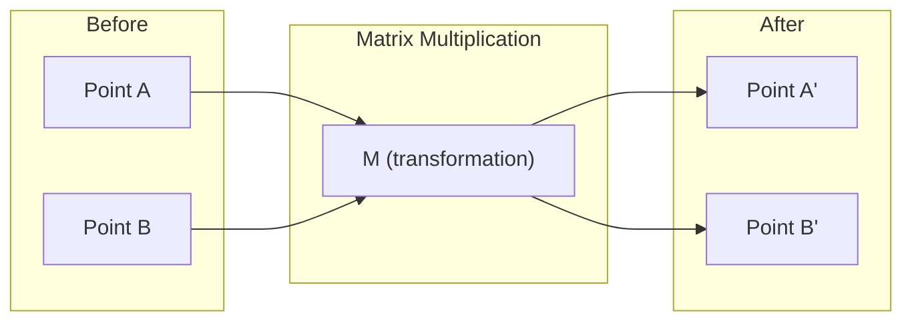
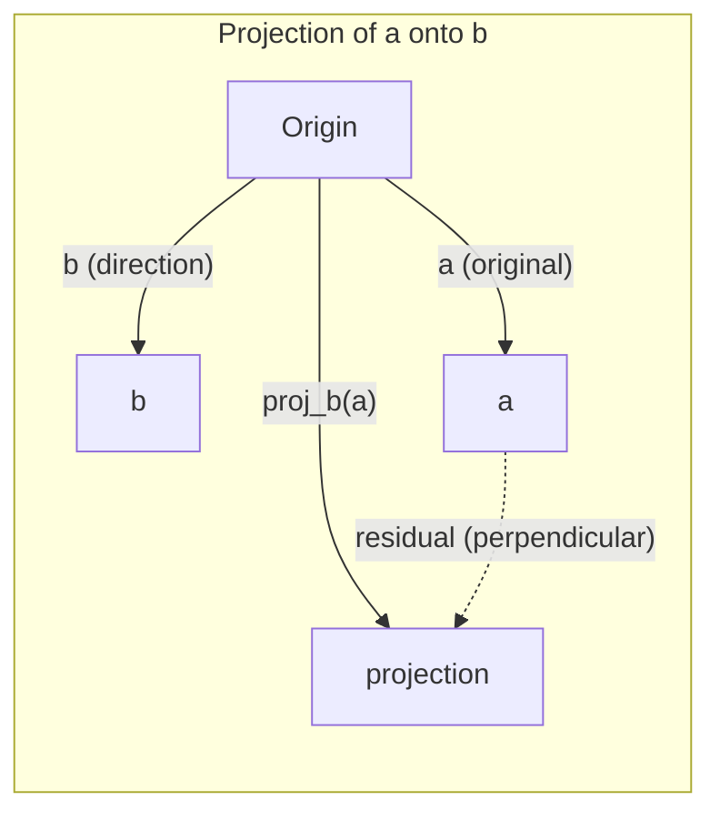

# Linear Algebra Intuition

> كل نموذج AI هو مجرد مصفوفة رياضية ترتدي قبعة فاخرة.

**النوع:** تعلم
** اللغات: ** بايثون، جوليا
**المتطلبات الأساسية:** المرحلة 0
**الوقت:** ~60 دقيقة

## Learning Objectives

- تنفيذ عمليات المتجهات والمصفوفات (الجمع، الضرب النقطي، ضرب المصفوفات) من الصفر في بايثون
- اشرح هندسيًا ما تفعله عملية الضرب النقطي والإسقاط وعملية جرام شميدت
- تحديد الاستقلال الخطي، والرتبة، وأساس مجموعة من المتجهات باستخدام تقليل الصف
- ربط مفاهيم الجبر الخطي بتطبيقات AI: التضمينات ودرجات الانتباه وLoRA

## The Problem

افتح أي ورقة ML. في الصفحة الأولى، سترى المتجهات والمصفوفات والمنتجات النقطية والتحويلات. بدون حدس الجبر الخطي، هذه مجرد رموز. باستخدامه، يمكنك رؤية ما تفعله الشبكة العصبية فعليًا - تحريك النقاط في الفضاء.

لا تحتاج إلى أن تكون عالم رياضيات. أنت بحاجة إلى معرفة ما تعنيه هذه العمليات هندسيًا، ثم قم بترميزها بنفسك.

## The Concept

### Vectors Are Points (and Directions)

المتجه هو مجرد قائمة من الأرقام. لكن هذه الأرقام تعني شيئًا ما، إنها إحداثيات في الفضاء.

**ناقل ثنائي الأبعاد [3، 2]:**

| س | ذ | نقطة |
|---|---|-------|
| 3 | 2 | يشير المتجه من الأصل (0,0) إلى (3,2) على المستوى |

المتجه له حجم sqrt(3^2 + 2^2) = sqrt(13) ويشير إلى الأعلى وإلى اليمين.

في AI، تمثل المتجهات كل شيء:
- كلمة ← متجه لـ 768 رقمًا ("معناها" في مساحة التضمين)
- صورة → متجه لملايين قيم البكسل
- مستخدم → ناقل التفضيلات

### Matrices Are Transformations

تقوم المصفوفة بتحويل متجه إلى آخر. يمكنه التدوير أو القياس أو التمدد أو العرض.



في AI المصفوفات ARE النموذج:
- أوزان الشبكة العصبية ← المصفوفات التي تحول المدخلات إلى مخرجات
- درجات الانتباه ← المصفوفات التي تقرر ما يجب التركيز عليه
- التضمينات → المصفوفات التي تربط الكلمات بالمتجهات

### The Dot Product Measures Similarity

يخبرك المنتج النقطي لمتجهين بمدى تشابههما.

```
a · b = a₁×b₁ + a₂×b₂ + ... + aₙ×bₙ

Same direction:      a · b > 0  (similar)
Perpendicular:       a · b = 0  (unrelated)
Opposite direction:  a · b < 0  (dissimilar)
```

هذه هي الطريقة التي تعمل بها محركات البحث وأنظمة التوصية وRAG حرفيًا - للعثور على المتجهات ذات المنتجات ذات النقاط العالية.

### Linear Independence

تكون المتجهات مستقلة خطيًا إذا لم يكن من الممكن كتابة أي متجه في المجموعة كمجموعة من المتجهات الأخرى. إذا كانت v1، وv2، وv3 مستقلة، فإنها تمتد إلى مساحة ثلاثية الأبعاد. إذا كان أحدهما عبارة عن مزيج من الآخرين، فإنهم يمتدون فقط على مستوى.

سبب أهمية AI: يجب أن تحتوي مصفوفة الميزات على أعمدة مستقلة خطيًا. إذا كانت هناك ميزتان مرتبطتان بشكل كامل (تعتمدان خطيًا)، فلن يتمكن النموذج من التمييز بين تأثيراتهما. يؤدي هذا إلى وجود علاقة خطية متعددة في الانحدار - تصبح مصفوفة الوزن غير مستقرة، وتؤدي التغييرات الصغيرة في المدخلات إلى تقلبات كبيرة في الإنتاج.

**مثال ملموس:**

```
v1 = [1, 0, 0]
v2 = [0, 1, 0]
v3 = [2, 1, 0]   # v3 = 2*v1 + v2
```

v1 وv2 مستقلان، ولا يمثلان مضاعفًا قياسيًا أو مزيجًا من الآخر. لكن v3 = 2*v1 + v2، لذا فإن {v1, v2, v3} هي مجموعة تابعة. تقع هذه المتجهات الثلاثة جميعها في المستوى xy. بغض النظر عن كيفية الجمع بينهما، لا يمكنك الوصول إلى [0، 0، 1]. لديك ثلاثة نواقل ولكن بعدين فقط للحرية.

في مجموعة البيانات: إذا كانت feature_3 = 2*feature_1 + feature_2، فإن إضافة feature_3 تعطي النموذج صفر معلومات جديدة. والأسوأ من ذلك أنها make هي المعادلات العادية المفردة - ولا يوجد حل فريد للأوزان.

### Basis and Rank

الأساس عبارة عن مجموعة صغيرة من المتجهات المستقلة خطيًا والتي تغطي المساحة بأكملها. عدد المتجهات الأساسية هو البعد من الفضاء.

الأساس القياسي للمساحة ثلاثية الأبعاد هو {[1,0,0], [0,1,0], [0,0,1]}. لكن أي ثلاثة نواقل مستقلة ثلاثية الأبعاد تشكل أساسًا صالحًا. اختيار الأساس هو اختيار نظام الإحداثيات.

رتبة المصفوفة = عدد الأعمدة المستقلة خطيا = عدد الصفوف المستقلة خطيا. إذا كانت الرتبة < دقيقة (الصفوف والأعمدة)، فإن المصفوفة تكون ذات رتبة ناقصة. هذا يعني:
- النظام لديه عدد لا نهائي من الحلول (أو لا شيء)
- يتم فقدان المعلومات في التحول
- لا يمكن عكس المصفوفة

| الوضع | الرتبة | ماذا يعني لـ ML |
|-----------|------|--------------------|
| الرتبة الكاملة (الرتبة = دقيقة (م، ن)) | الحد الأقصى الممكن | يوجد حل فريد من نوعه للمربعات الصغرى. النموذج مكيف بشكل جيد. |
| رتبة ناقصة (رتبة < دقيقة (م، ن)) | أقل من الحد الأقصى | الميزات زائدة عن الحاجة. عدد لا نهائي من حلول الوزن. التنظيم مطلوب. |
| المرتبة 1 | 1 | كل عمود عبارة عن نسخة متدرجة من متجه واحد. جميع البيانات تقع على الخط. |
| بالقرب من ناقص الرتبة (قيم مفردة صغيرة) | منخفض عدديا | المصفوفة سيئة التكييف. يؤدي ضجيج الإدخال الصغير إلى حدوث تغييرات كبيرة في الإخراج. استخدم SVD اقتطاع أو انحدار التلال. |

### Projection

إسقاط المتجه **a** على المتجه **b** يعطي مكون **a** في اتجاه **b**:

```
proj_b(a) = (a dot b / b dot b) * b
```

المتبقي (a - proj_b(a)) متعامد مع b. هذا التحلل المتعامد هو أساس تركيب المربعات الصغرى.

الإسقاط موجود في كل مكان في ML:
- الانحدار الخطي يقلل المسافة من الملاحظات إلى مساحة العمود - الحل IS إسقاط
- PCA يعرض البيانات في اتجاهات التباين الأقصى
- الاهتمام في المحولات يحسب إسقاطات الاستعلامات على المفاتيح



**مثال:** أ = [3، 4]، ب = [1، 0]

proj_b(a) = (3*1 + 4*0) / (1*1 + 0*0) * [1, 0] = 3 * [1, 0] = [3, 0]

يسقط الإسقاط المكون y. هذا هو تقليل الأبعاد في أبسط أشكاله - تخلص من الاتجاهات التي لا تهتم بها.

### Gram-Schmidt Process

تحويل أي مجموعة من المتجهات المستقلة إلى أساس متعامد. متعامد يعني أن كل متجه له طول 1 وكل زوج متعامد.

الخوارزمية:
1. خذ المتجه الأول وقم بتطبيعه
2. خذ المتجه الثاني، واطرح إسقاطه على المتجه الأول، وقم بتطبيعه
3. خذ المتجه الثالث، واطرح إسقاطاته على جميع المتجهات السابقة، وقم بتطبيعها
4. كرر ذلك مع النواقل المتبقية

```
Input:  v1, v2, v3, ... (linearly independent)

u1 = v1 / |v1|

w2 = v2 - (v2 dot u1) * u1
u2 = w2 / |w2|

w3 = v3 - (v3 dot u1) * u1 - (v3 dot u2) * u2
u3 = w3 / |w3|

Output: u1, u2, u3, ... (orthonormal basis)
```

هذه هي الطريقة التي يعمل بها QR التحلل داخليًا. Q هو الأساس المتعامد، R يلتقط معاملات الإسقاط. QR يستخدم التحلل في:
- حل الأنظمة الخطية (أكثر استقرارا من الحذف الغوسي)
- حساب القيم الذاتية (خوارزمية QR)
- انحدار المربعات الصغرى (الطريقة العددية القياسية)

## Build It

### Step 1: Vectors from scratch (Python)

```python
class Vector:
    def __init__(self, components):
        self.components = list(components)
        self.dim = len(self.components)

    def __add__(self, other):
        return Vector([a + b for a, b in zip(self.components, other.components)])

    def __sub__(self, other):
        return Vector([a - b for a, b in zip(self.components, other.components)])

    def dot(self, other):
        return sum(a * b for a, b in zip(self.components, other.components))

    def magnitude(self):
        return sum(x**2 for x in self.components) ** 0.5

    def normalize(self):
        mag = self.magnitude()
        return Vector([x / mag for x in self.components])

    def cosine_similarity(self, other):
        return self.dot(other) / (self.magnitude() * other.magnitude())

    def __repr__(self):
        return f"Vector({self.components})"


a = Vector([1, 2, 3])
b = Vector([4, 5, 6])

print(f"a + b = {a + b}")
print(f"a · b = {a.dot(b)}")
print(f"|a| = {a.magnitude():.4f}")
print(f"cosine similarity = {a.cosine_similarity(b):.4f}")
```

### Step 2: Matrices from scratch (Python)

```python
class Matrix:
    def __init__(self, rows):
        self.rows = [list(row) for row in rows]
        self.shape = (len(self.rows), len(self.rows[0]))

    def __matmul__(self, other):
        if isinstance(other, Vector):
            return Vector([
                sum(self.rows[i][j] * other.components[j] for j in range(self.shape[1]))
                for i in range(self.shape[0])
            ])
        rows = []
        for i in range(self.shape[0]):
            row = []
            for j in range(other.shape[1]):
                row.append(sum(
                    self.rows[i][k] * other.rows[k][j]
                    for k in range(self.shape[1])
                ))
            rows.append(row)
        return Matrix(rows)

    def transpose(self):
        return Matrix([
            [self.rows[j][i] for j in range(self.shape[0])]
            for i in range(self.shape[1])
        ])

    def __repr__(self):
        return f"Matrix({self.rows})"


rotation_90 = Matrix([[0, -1], [1, 0]])
point = Vector([3, 1])

rotated = rotation_90 @ point
print(f"Original: {point}")
print(f"Rotated 90°: {rotated}")
```

### Step 3: Why this matters for AI

```python
import random

random.seed(42)
weights = Matrix([[random.gauss(0, 0.1) for _ in range(3)] for _ in range(2)])
input_vector = Vector([1.0, 0.5, -0.3])

output = weights @ input_vector
print(f"Input (3D): {input_vector}")
print(f"Output (2D): {output}")
print("This is what a neural network layer does -- matrix multiplication.")
```

### Step 4: Julia version

```julia
a = [1.0, 2.0, 3.0]
b = [4.0, 5.0, 6.0]

println("a + b = ", a + b)
println("a · b = ", a ⋅ b)       # Julia supports unicode operators
println("|a| = ", √(a ⋅ a))
println("cosine = ", (a ⋅ b) / (√(a ⋅ a) * √(b ⋅ b)))

# Matrix-vector multiplication
W = [0.1 -0.2 0.3; 0.4 0.5 -0.1]
x = [1.0, 0.5, -0.3]
println("Wx = ", W * x)
println("This is a neural network layer.")
```

### Step 5: Linear independence and projection from scratch (Python)

```python
def is_linearly_independent(vectors):
    n = len(vectors)
    dim = len(vectors[0].components)
    mat = Matrix([v.components[:] for v in vectors])
    rows = [row[:] for row in mat.rows]
    rank = 0
    for col in range(dim):
        pivot = None
        for row in range(rank, len(rows)):
            if abs(rows[row][col]) > 1e-10:
                pivot = row
                break
        if pivot is None:
            continue
        rows[rank], rows[pivot] = rows[pivot], rows[rank]
        scale = rows[rank][col]
        rows[rank] = [x / scale for x in rows[rank]]
        for row in range(len(rows)):
            if row != rank and abs(rows[row][col]) > 1e-10:
                factor = rows[row][col]
                rows[row] = [rows[row][j] - factor * rows[rank][j] for j in range(dim)]
        rank += 1
    return rank == n


def project(a, b):
    scalar = a.dot(b) / b.dot(b)
    return Vector([scalar * x for x in b.components])


def gram_schmidt(vectors):
    orthonormal = []
    for v in vectors:
        w = v
        for u in orthonormal:
            proj = project(w, u)
            w = w - proj
        if w.magnitude() < 1e-10:
            continue
        orthonormal.append(w.normalize())
    return orthonormal


v1 = Vector([1, 0, 0])
v2 = Vector([1, 1, 0])
v3 = Vector([1, 1, 1])
basis = gram_schmidt([v1, v2, v3])
for i, u in enumerate(basis):
    print(f"u{i+1} = {u}")
    print(f"  |u{i+1}| = {u.magnitude():.6f}")

print(f"u1 · u2 = {basis[0].dot(basis[1]):.6f}")
print(f"u1 · u3 = {basis[0].dot(basis[2]):.6f}")
print(f"u2 · u3 = {basis[1].dot(basis[2]):.6f}")
```

## Use It

الآن نفس الشيء مع NumPy -- ما ستستخدمه بالفعل عمليًا:

```python
import numpy as np

a = np.array([1, 2, 3], dtype=float)
b = np.array([4, 5, 6], dtype=float)

print(f"a + b = {a + b}")
print(f"a · b = {np.dot(a, b)}")
print(f"|a| = {np.linalg.norm(a):.4f}")
print(f"cosine = {np.dot(a, b) / (np.linalg.norm(a) * np.linalg.norm(b)):.4f}")

W = np.random.randn(2, 3) * 0.1
x = np.array([1.0, 0.5, -0.3])
print(f"Wx = {W @ x}")
```

### Rank, Projection, and QR with NumPy

```python
import numpy as np

A = np.array([[1, 2], [2, 4]])
print(f"Rank: {np.linalg.matrix_rank(A)}")

a = np.array([3, 4])
b = np.array([1, 0])
proj = (np.dot(a, b) / np.dot(b, b)) * b
print(f"Projection of {a} onto {b}: {proj}")

Q, R = np.linalg.qr(np.random.randn(3, 3))
print(f"Q is orthogonal: {np.allclose(Q @ Q.T, np.eye(3))}")
print(f"R is upper triangular: {np.allclose(R, np.triu(R))}")
```

### PyTorch -- Tensors Are Vectors with Autodiff

```python
import torch

x = torch.randn(3, requires_grad=True)
y = torch.tensor([1.0, 0.0, 0.0])

similarity = torch.dot(x, y)
similarity.backward()

print(f"x = {x.data}")
print(f"y = {y.data}")
print(f"dot product = {similarity.item():.4f}")
print(f"d(dot)/dx = {x.grad}")
```

تدرج منتج النقطة بالنسبة لـ x هو y فقط. PyTorch يحسب هذا تلقائيًا. كل عملية في الشبكة العصبية مبنية من عمليات مثل هذه - ضرب المصفوفة، والمنتجات النقطية، والإسقاطات - ويتتبع التصنيف التلقائي التدرجات من خلال كل منهم.

لقد قمت للتو ببناء ما يفعله NumPy من الصفر في سطر واحد. الآن أنت تعرف ما يحدث تحت الغطاء.

## Ship It

ينتج هذا الدرس:
- `outputs/prompt-linear-algebra-tutor.md` -- مطالبة لمساعدي AI بتدريس الجبر الخطي من خلال الحدس الهندسي

## Connections

كل شيء في هذا الدرس يتصل بأجزاء محددة من الحديث AI:

| المفهوم | حيث يظهر |
|---------|------------------|
| منتج دوت | درجات الانتباه في المحولات، تشابه جيب التمام في RAG |
| ضرب المصفوفة | كل طبقة شبكة عصبية، كل تحويل خطي |
| الاستقلال الخطي | اختيار الميزة، وتجنب التعددية الخطية |
| الرتبة | تحديد ما إذا كان النظام قابلاً للحل، LoRA (تكيف منخفض الرتبة) |
| الإسقاط | الانحدار الخطي (الإسقاط على مساحة العمود)، PCA |
| غرام شميدت / QR | الحلول العددية، حساب القيمة الذاتية |
| أساس متعامد | حساب عددي مستقر، تحويلات التبييض |

LoRA يستحق الذكر بشكل خاص. يقوم بضبط نماذج اللغة الكبيرة عن طريق تحليل تحديثات الوزن إلى مصفوفات منخفضة الرتبة. بدلاً من تحديث مصفوفة وزن 4096x4096 (16M معلمات)، LoRA يقوم بتحديث مصفوفتين بحجم 4096x16 و16x4096 (131K معلمات). القيد من المرتبة 16 يعني LoRA يفترض أن تحديث الوزن يعيش في مساحة فرعية ذات 16 بُعدًا من المساحة الكاملة ذات 4096 بُعدًا. هذا هو الجبر الخطي الذي يقوم بعمل حقيقي.

## Exercises

1. قم بتنفيذ `Vector.angle_between(other)` الذي يُرجع الزاوية بالدرجات بين متجهين
2. قم بإنشاء مصفوفة قياس ثنائية الأبعاد تعمل على مضاعفة الإحداثي x ومضاعفة الإحداثي y ثلاث مرات، ثم تطبيقها على المتجه [1، 1]
3. بالنظر إلى 5 متجهات عشوائية تشبه الكلمات (البعد 50)، ابحث عن الاثنين الأكثر تشابهًا باستخدام تشابه جيب التمام
4. تحقق من أن مخرجات جرام-شميت متعامدة حقًا: تأكد من أن كل زوج له منتج نقطي 0 وكل متجه له حجم 1
5. قم بإنشاء مصفوفة 3x3 بالرتبة 2. تحقق باستخدام الطريقة `rank()`. ثم اشرح ما هو الجسم الهندسي الذي تمتد عليه الأعمدة.
6. قم بإسقاط المتجه [1، 2، 3] على [1، 1، 1]. ماذا تمثل النتيجة هندسيا؟

## Key Terms

| مصطلح | ماذا يقول الناس | ماذا يعني في الواقع |
|------|----------------|----------------------|
| ناقل | "السهم" | قائمة من الأرقام التي تمثل نقطة أو اتجاه في الفضاء ذي الأبعاد n |
| مصفوفة | "جدول الأرقام" | تحويل يقوم بتعيين المتجهات من مساحة إلى أخرى |
| منتج دوت | "الضرب والجمع" | مقياس لمدى محاذاة ناقلين - جوهر البحث عن التشابه |
| التضمين | "بعض AI السحر" | متجه يمثل معنى شيء ما (كلمة، صورة، مستخدم) |
| الاستقلال الخطي | "لا يتداخلون" | لا يمكن كتابة أي متجه في المجموعة كمجموعة من المتجهات الأخرى |
| الرتبة | "كم عدد الأبعاد" | عدد الأعمدة (أو الصفوف) المستقلة خطيًا في المصفوفة |
| الإسقاط | "الظل" | مركبة متجه في اتجاه آخر |
| الأساس | "المحاور الإحداثية" | مجموعة صغيرة من المتجهات المستقلة التي تمتد عبر المساحة |
| متعامد | "متجهات الوحدة المتعامدة" | المتجهات المتعامدة وطول كل منها 1 |
