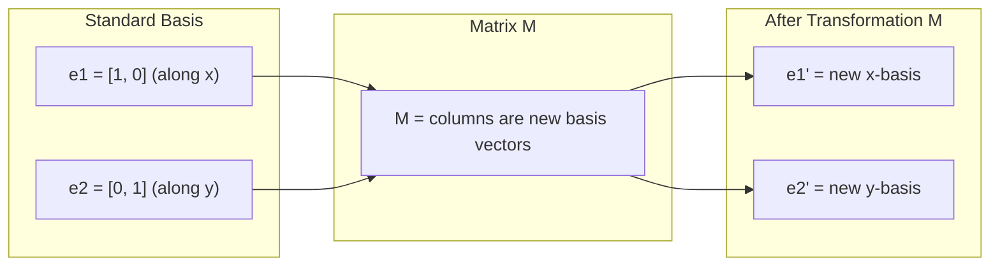
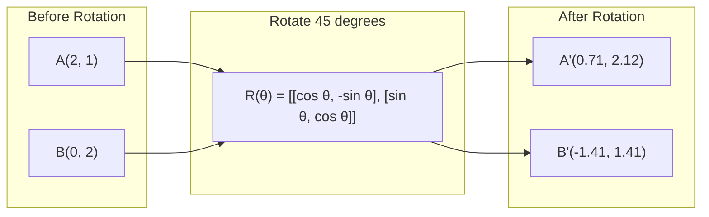
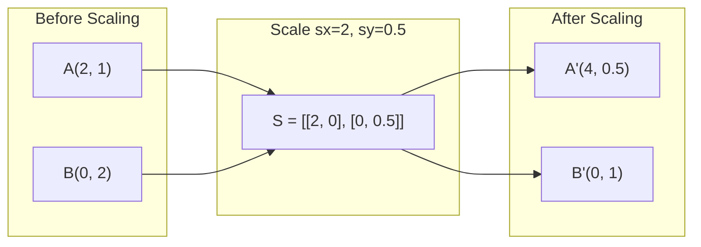
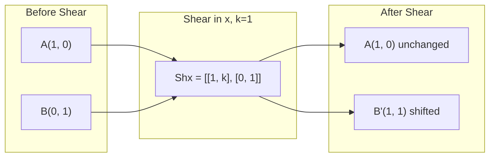
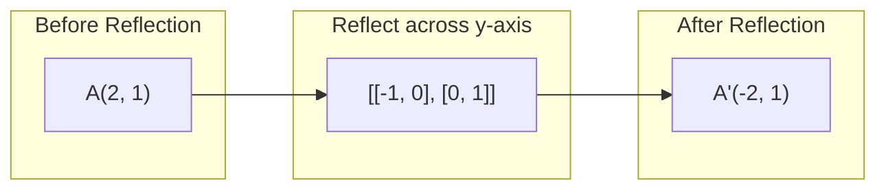
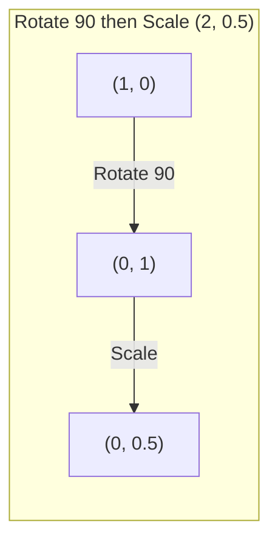
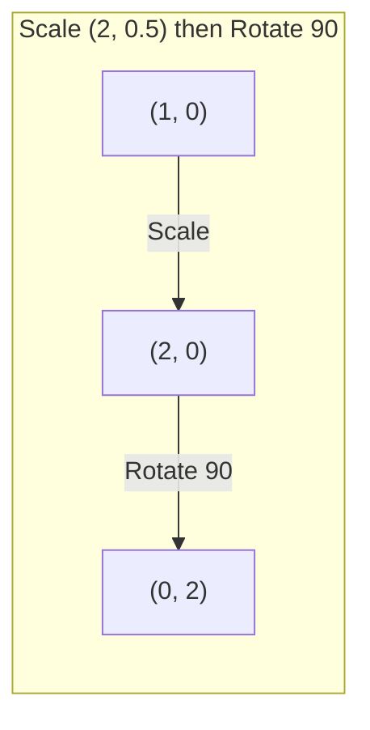

# Matrix Transformations

> المصفوفة هي آلة تعيد تشكيل الفضاء. تعرف على ما يفعله في كل نقطة، وستفهم التحول بأكمله.

**النوع:** بناء
** اللغات: ** بايثون، جوليا
**المتطلبات الأساسية:** المرحلة الأولى، الدروس 01-02 (حدس الجبر الخطي، وعمليات المتجهات والمصفوفات)
**الوقت:** ~75 دقيقة

## Learning Objectives

- إنشاء مصفوفات التدوير والقياس والقص والانعكاس وتطبيقها على نقاط ثنائية وثلاثية الأبعاد
- إنشاء تحويلات متعددة عن طريق ضرب المصفوفات والتحقق من أهمية الترتيب
- حساب القيم الذاتية والمتجهات الذاتية لمصفوفات 2x2 من المعادلة المميزة
- اشرح لماذا تحدد القيم الذاتية اتجاهات PCA واستقرار RNN وسلوك التجميع الطيفي

## The Problem

قرأت عن PCA وشاهدت "ابحث عن المتجهات الذاتية لمصفوفة التغاير." قرأت عن استقرار النموذج وشاهدت "تحقق مما إذا كانت جميع القيم الذاتية لها حجم أقل من 1." قرأت عن زيادة البيانات وشاهدت "تطبيق تدوير عشوائي". لا شيء من هذا make منطقي حتى تفهم ما تفعله المصفوفات بالمساحة هندسيًا.

المصفوفات ليست مجرد شبكات من الأرقام. إنها آلات مكانية. مصفوفة التناوب تدور النقاط. تمدهم مصفوفة القياس. مصفوفة القص تميلهم. كل تحويل تطبقه الشبكة العصبية على البيانات هو إحدى هذه العمليات أو تركيبة منها. هذا الدرس make هو تلك العمليات الملموسة.

## The Concept

### Transformations as matrices

يمكن كتابة كل تحويل خطي في ثنائي الأبعاد كمصفوفة 2x2. تخبرك المصفوفة بالضبط أين ينتهي المتجهان الأساسيان [1، 0] و [0، 1]. كل شيء آخر يتبع.



### Rotation

دوران ثنائي الأبعاد بزاوية ثيتا يحافظ على المسافات والزوايا سليمة. يتحرك كل نقطة على طول قوس دائري.



في الوضع ثلاثي الأبعاد، يمكنك التدوير حول محور. كل محور له مصفوفة دوران خاصة به:

```
Rz(theta) = | cos  -sin  0 |     Rotate around z-axis
            | sin   cos  0 |     (x-y plane spins, z stays)
            |  0     0   1 |

Rx(theta) = | 1   0     0    |   Rotate around x-axis
            | 0  cos  -sin   |   (y-z plane spins, x stays)
            | 0  sin   cos   |

Ry(theta) = |  cos  0  sin |     Rotate around y-axis
            |   0   1   0  |     (x-z plane spins, y stays)
            | -sin  0  cos |
```

### Scaling

يمتد القياس أو يضغط على طول كل محور بشكل مستقل.



### Shearing

يؤدي القص إلى إمالة أحد المحاور مع الحفاظ على الآخر ثابتًا. يحول المستطيلات إلى متوازيات أضلاع.



مصفوفات القص:
- `Shx = [[1, k], [0, 1]]` إزاحات x بواسطة k * y
- `Shy = [[1, 0], [k, 1]]` التحولات y بواسطة k * x

### Reflection

يعكس الانعكاس النقاط عبر محور أو خط.



مصفوفات الانعكاس:
- الانعكاس عبر المحور الصادي: `[[-1, 0], [0, 1]]`
- الانعكاس عبر المحور السيني: `[[1, 0], [0, -1]]`

### Composition: chaining transformations

تطبيق التحويل A ثم B هو نفس ضرب المصفوفات: `result = B @ A @ point`. النظام مهم. التدوير ثم القياس يعطي نتائج مختلفة عن القياس ثم التدوير.



مؤلفة: `S @ R = [[0, -2], [0.5, 0]]`



مؤلفة: `R @ S = [[0, -0.5], [2, 0]]`

نتائج مختلفة. ضرب المصفوفة ليس تبادلياً.

### Eigenvalues and eigenvectors

تغير معظم المتجهات اتجاهها عندما تصطدم بها مصفوفة. المتجهات الذاتية مميزة: المصفوفة تقوم فقط بقياسها، ولا تقوم بتدويرها أبدًا. عامل القياس هو القيمة الذاتية.

```
A @ v = lambda * v

v is the eigenvector (direction that survives)
lambda is the eigenvalue (how much it stretches)

Example: A = | 2  1 |
             | 1  2 |

Eigenvector [1, 1] with eigenvalue 3:
  A @ [1,1] = [3, 3] = 3 * [1, 1]     (same direction, scaled by 3)

Eigenvector [1, -1] with eigenvalue 1:
  A @ [1,-1] = [1, -1] = 1 * [1, -1]  (same direction, unchanged)
```

تقوم المصفوفة بتمديد المساحة بمقدار 3x على طول [1، 1] وتحافظ على [1، -1] دون تغيير. وكل اتجاه آخر هو مزيج من هذين الاثنين.

### Eigendecomposition

إذا كانت المصفوفة تحتوي على عدد n من المتجهات الذاتية المستقلة خطيًا، فيمكن أن تتحلل:

```
A = V @ D @ V^(-1)

V = matrix whose columns are eigenvectors
D = diagonal matrix of eigenvalues
V^(-1) = inverse of V

This says: rotate into eigenvector coordinates, scale along each axis, rotate back.
```

### Why eigenvalues matter

**PCA.** المتجهات الذاتية لمصفوفة التغاير هي المكونات الرئيسية. تخبرك القيم الذاتية بمقدار التباين الذي يلتقطه كل مكون. قم بالفرز حسب القيمة الذاتية، واحتفظ بالأعلى k، وسيكون لديك تقليل الأبعاد.

**الاستقرار.** في الشبكات المتكررة والأنظمة الديناميكية، تتسبب القيم الذاتية ذات الحجم > 1 في انفجار المخرجات. الحجم < 1 يؤدي إلى اختفائها. هذه هي مشكلة التدرج التلاشي/الانفجار المذكورة في جملة واحدة.

**الطرق الطيفية.** تستخدم الشبكات العصبية الرسومية القيم الذاتية لمصفوفة الجوار. يستخدم التجميع الطيفي القيم الذاتية للابلاسيان. تكشف المتجهات الذاتية عن بنية الرسم البياني.

### Determinant as volume scaling factor

يخبرك محدد مصفوفة التحويل بمدى قياس المساحة (ثنائية الأبعاد) أو الحجم (ثلاثي الأبعاد).

```
det = 1:   area preserved (rotation)
det = 2:   area doubled
det = 0:   space crushed to lower dimension (singular)
det = -1:  area preserved but orientation flipped (reflection)

| det(Rotation) | = 1        (always)
| det(Scale sx, sy) | = sx * sy
| det(Shear) | = 1           (area preserved)
| det(Reflection) | = -1     (orientation flipped)
```

## Build It

### Step 1: Transformation matrices from scratch (Python)

```python
import math

def rotation_2d(theta):
    c, s = math.cos(theta), math.sin(theta)
    return [[c, -s], [s, c]]

def scaling_2d(sx, sy):
    return [[sx, 0], [0, sy]]

def shearing_2d(kx, ky):
    return [[1, kx], [ky, 1]]

def reflection_x():
    return [[1, 0], [0, -1]]

def reflection_y():
    return [[-1, 0], [0, 1]]

def mat_vec_mul(matrix, vector):
    return [
        sum(matrix[i][j] * vector[j] for j in range(len(vector)))
        for i in range(len(matrix))
    ]

def mat_mul(a, b):
    rows_a, cols_b = len(a), len(b[0])
    cols_a = len(a[0])
    return [
        [sum(a[i][k] * b[k][j] for k in range(cols_a)) for j in range(cols_b)]
        for i in range(rows_a)
    ]

point = [1.0, 0.0]
angle = math.pi / 4

rotated = mat_vec_mul(rotation_2d(angle), point)
print(f"Rotate (1,0) by 45 deg: ({rotated[0]:.4f}, {rotated[1]:.4f})")

scaled = mat_vec_mul(scaling_2d(2, 3), [1.0, 1.0])
print(f"Scale (1,1) by (2,3): ({scaled[0]:.1f}, {scaled[1]:.1f})")

sheared = mat_vec_mul(shearing_2d(1, 0), [1.0, 1.0])
print(f"Shear (1,1) kx=1: ({sheared[0]:.1f}, {sheared[1]:.1f})")

reflected = mat_vec_mul(reflection_y(), [2.0, 1.0])
print(f"Reflect (2,1) across y: ({reflected[0]:.1f}, {reflected[1]:.1f})")
```

### Step 2: Composition of transformations

```python
R = rotation_2d(math.pi / 2)
S = scaling_2d(2, 0.5)

rotate_then_scale = mat_mul(S, R)
scale_then_rotate = mat_mul(R, S)

point = [1.0, 0.0]
result1 = mat_vec_mul(rotate_then_scale, point)
result2 = mat_vec_mul(scale_then_rotate, point)

print(f"Rotate 90 then scale: ({result1[0]:.2f}, {result1[1]:.2f})")
print(f"Scale then rotate 90: ({result2[0]:.2f}, {result2[1]:.2f})")
print(f"Same? {result1 == result2}")
```

### Step 3: Eigenvalues from scratch (2x2)

بالنسبة للمصفوفة 2x2 `[[a, b], [c, d]]`، تحل القيم الذاتية المعادلة المميزة: `lambda^2 - (a+d)*lambda + (ad - bc) = 0`.

```python
def eigenvalues_2x2(matrix):
    a, b = matrix[0]
    c, d = matrix[1]
    trace = a + d
    det = a * d - b * c
    discriminant = trace ** 2 - 4 * det
    if discriminant < 0:
        real = trace / 2
        imag = (-discriminant) ** 0.5 / 2
        return (complex(real, imag), complex(real, -imag))
    sqrt_disc = discriminant ** 0.5
    return ((trace + sqrt_disc) / 2, (trace - sqrt_disc) / 2)

def eigenvector_2x2(matrix, eigenvalue):
    a, b = matrix[0]
    c, d = matrix[1]
    if abs(b) > 1e-10:
        v = [b, eigenvalue - a]
    elif abs(c) > 1e-10:
        v = [eigenvalue - d, c]
    else:
        if abs(a - eigenvalue) < 1e-10:
            v = [1, 0]
        else:
            v = [0, 1]
    mag = (v[0] ** 2 + v[1] ** 2) ** 0.5
    return [v[0] / mag, v[1] / mag]

A = [[2, 1], [1, 2]]
vals = eigenvalues_2x2(A)
print(f"Matrix: {A}")
print(f"Eigenvalues: {vals[0]:.4f}, {vals[1]:.4f}")

for val in vals:
    vec = eigenvector_2x2(A, val)
    result = mat_vec_mul(A, vec)
    scaled = [val * vec[0], val * vec[1]]
    print(f"  lambda={val:.1f}, v={[round(x,4) for x in vec]}")
    print(f"    A@v = {[round(x,4) for x in result]}")
    print(f"    l*v = {[round(x,4) for x in scaled]}")
```

### Step 4: Determinant as volume scaling factor

```python
def det_2x2(matrix):
    return matrix[0][0] * matrix[1][1] - matrix[0][1] * matrix[1][0]

print(f"det(rotation 45) = {det_2x2(rotation_2d(math.pi/4)):.4f}")
print(f"det(scale 2,3)   = {det_2x2(scaling_2d(2, 3)):.1f}")
print(f"det(shear kx=1)  = {det_2x2(shearing_2d(1, 0)):.1f}")
print(f"det(reflect y)   = {det_2x2(reflection_y()):.1f}")

singular = [[1, 2], [2, 4]]
print(f"det(singular)     = {det_2x2(singular):.1f}")
print("Singular: columns are proportional, space collapses to a line.")
```

## Use It

NumPy يتعامل مع كل هذا بإجراءات محسّنة.

```python
import numpy as np

theta = np.pi / 4
R = np.array([[np.cos(theta), -np.sin(theta)],
              [np.sin(theta),  np.cos(theta)]])

point = np.array([1.0, 0.0])
print(f"Rotate (1,0) by 45 deg: {R @ point}")

S = np.diag([2.0, 3.0])
composed = S @ R
print(f"Scale(2,3) after Rotate(45): {composed @ point}")

A = np.array([[2, 1], [1, 2]], dtype=float)
eigenvalues, eigenvectors = np.linalg.eig(A)
print(f"\nEigenvalues: {eigenvalues}")
print(f"Eigenvectors (columns):\n{eigenvectors}")

for i in range(len(eigenvalues)):
    v = eigenvectors[:, i]
    lam = eigenvalues[i]
    print(f"  A @ v{i} = {A @ v}, lambda * v{i} = {lam * v}")

print(f"\ndet(R) = {np.linalg.det(R):.4f}")
print(f"det(S) = {np.linalg.det(S):.1f}")

B = np.array([[3, 1], [0, 2]], dtype=float)
vals, vecs = np.linalg.eig(B)
D = np.diag(vals)
V = vecs
reconstructed = V @ D @ np.linalg.inv(V)
print(f"\nEigendecomposition A = V @ D @ V^-1:")
print(f"Original:\n{B}")
print(f"Reconstructed:\n{reconstructed}")
```

### 3D rotations with NumPy

```python
def rotation_3d_z(theta):
    c, s = np.cos(theta), np.sin(theta)
    return np.array([[c, -s, 0], [s, c, 0], [0, 0, 1]])

def rotation_3d_x(theta):
    c, s = np.cos(theta), np.sin(theta)
    return np.array([[1, 0, 0], [0, c, -s], [0, s, c]])

point_3d = np.array([1.0, 0.0, 0.0])
rotated_z = rotation_3d_z(np.pi / 2) @ point_3d
rotated_x = rotation_3d_x(np.pi / 2) @ point_3d

print(f"\n3D point: {point_3d}")
print(f"Rotate 90 around z: {np.round(rotated_z, 4)}")
print(f"Rotate 90 around x: {np.round(rotated_x, 4)}")
```

## Ship It

يبني هذا الدرس الأساس الهندسي لـ PCA (المرحلة الثانية) وتحليل وزن الشبكة العصبية. رمز القيمة الذاتية/المتجه الذاتي المبني هنا هو نفس الخوارزمية التي تعمل على تقليل الأبعاد والتجمع الطيفي وتحليل الاستقرار في أنظمة الإنتاج ML.

## Exercises

1. قم بتطبيق التدوير والقياس والقص على مربع الوحدة (الزوايا عند [0,0]، [1,0]، [1,1]، [0,1]). طباعة الزوايا المحولة لكل منها. تأكد من أن التدوير يحافظ على المسافات بين الزوايا.

2. أوجد القيم الذاتية للمصفوفة [[4، 2]، [1، 3]] يدويًا باستخدام المعادلة المميزة. ثم تحقق باستخدام وظيفتك من البداية وبواسطة NumPy.

3. قم بإنشاء تركيبة من ثلاثة تحويلات (تدوير 30 درجة، مقياس بمقدار [1.5، 0.8]، القص بـ kx=0.3) وتطبيقها على 8 نقاط مرتبة في دائرة. طباعة قبل وبعد الإحداثيات. حساب محدد المصفوفة المكونة والتحقق من أنها تساوي حاصل ضرب المحددات الفردية.

## Key Terms

| مصطلح | ماذا يقول الناس | ماذا يعني في الواقع |
|------|----------------|----------------------|
| مصفوفة الدوران | "تدور الأشياء" | مصفوفة متعامدة تحرك النقاط على طول أقواس دائرية مع الحفاظ على المسافات والزوايا. المحدد هو 1 دائمًا. |
| مصفوفة القياس | "يجعل الأمور أكبر" | مصفوفة قطرية تمتد أو تنضغط بشكل مستقل على طول كل محور. المحدد هو نتاج عوامل الحجم. |
| مصفوفة القص | "أشياء مائلة" | مصفوفة تقوم بإزاحة إحداثي واحد بشكل متناسب مع آخر، وتحول المستطيلات إلى متوازيات أضلاع. المحدد هو 1. |
| انعكاس | "مرايا الأشياء" | مصفوفة تقلب الفضاء عبر محور أو مستوى. المحدد هو -1. |
| تكوين | "افعل شيئين" | ضرب مصفوفات التحويل لعمليات السلسلة. الترتيب مهم: B @ A يعني تطبيق A أولاً، ثم B. |
| المتجه الذاتي | "اتجاه خاص" | الاتجاه الذي تقيسه المصفوفة فقط، ولا يدور أبدًا. بصمة التحول. |
| القيمة الذاتية | "كم يمتد" | العامل العددي الذي من خلاله تقوم المصفوفة بقياس متجهها الذاتي. يمكن أن تكون سلبية (الوجه) أو معقدة (الدوران). |
| التركيب الذاتي | "تفكيك المصفوفة" | كتابة مصفوفة بالشكل V @ D @ V^(-1)، وفصلها إلى اتجاهات وأحجام القياس الأساسية. |
| المحدد | "رقم واحد من مصفوفة" | العامل الذي يتم من خلاله قياس التحويل للمساحة (2D) أو الحجم (3D). الصفر يعني أن التحول لا رجعة فيه. |
| معادلة مميزة | "من أين تأتي القيم الذاتية" | det(A - lambda * I) = 0. كثيرة الحدود التي جذورها هي القيم الذاتية. |

## Further Reading

- [3Blue1Brown: التحولات الخطية](https://www.3blue1brown.com/lessons/linear-transformations) -- الحدس البصري لكيفية إعادة تشكيل المصفوفات للمساحة
- [3Blue1Brown: المتجهات الذاتية والقيم الذاتية](https://www.3blue1brown.com/lessons/eigenvalues) -- أفضل شرح مرئي لما تعنيه المتجهات الذاتية هندسيًا
- [MIT 18.06 المحاضرة 21: القيم الذاتية والمتجهات الذاتية](https://ocw.mit.edu/courses/18-06-linear-algebra-spring-2010/) -- العلاج الكلاسيكي لجيلبرت سترانج
