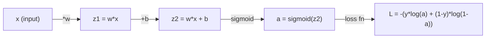
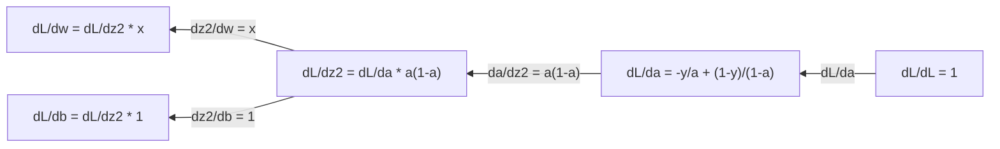
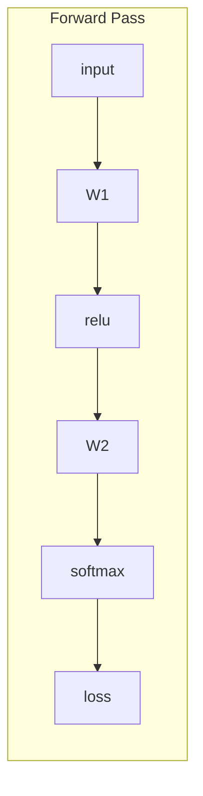
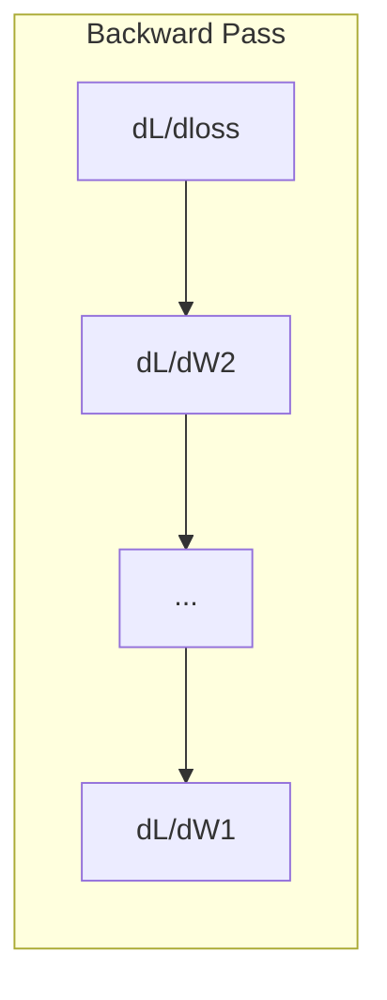

# حساب التفاضل والتكامل للتعلم الآلي
> تخبرك المشتقات بالطريق الذي يتجه نحو الأسفل. هذا هو كل ما تحتاج الشبكة العصبية إلى تعلمه.
**النوع:** تعلم
** اللغة: ** بايثون
**المتطلبات الأساسية:** المرحلة الأولى، الدروس 01-03
**الوقت:** ~60 دقيقة
## أهداف التعلم
- حساب المشتقات العددية والتحليلية للدوال ML الشائعة (x^2، السيني، الانتروبيا المتقاطعة)
- تنفيذ الانحدار المتدرج من الصفر لتقليل وظيفة الخسارة في 1D و 2D
- اشتقاق التدرج لنموذج الانحدار الخطي وتدريبه عبر تحديثات الوزن اليدوية
- شرح مصفوفة هسه وتقريبات متسلسلة تايلور وارتباطها بطرق التحسين
## المشكلة
لديك شبكة عصبية بملايين الأوزان. كل وزن هو مقبض. أنت بحاجة إلى معرفة الاتجاه الذي يجب أن تدير به كل مقبض إلى make النموذج الأقل خطأً قليلاً. حساب التفاضل والتكامل يمنحك هذا الاتجاه.
بدون حساب التفاضل والتكامل، فإن تدريب الشبكة العصبية يعني تجربة تغييرات عشوائية والأمل في الأفضل. مع المشتقات، أنت تعرف بالضبط كيف يؤثر كل وزن على الخطأ. أنت تدير كل مقبض بالطريقة الصحيحة، في كل مرة.
##المفهوم
### ما هو المشتق؟
المشتق يقيس معدل التغير. بالنسبة للدالة y = f(x)، يخبرك المشتق f'(x): إذا قمت بدفع x بمقدار صغير، فما مقدار التغيير y؟
هندسيًا، المشتق هو ميل خط المماس عند نقطة ما.
**و(س) = س^2:**
| س | و(خ) | f'(x) (المنحدر) |
|---|------|--------------|
| 0 | 0 | 0 (مسطحة، في الأسفل) |
| 1 | 1 | 2 |
| 2 | 4 | 4 (ميل خط المماس عند هذه النقطة) |
| 3 | 9 | 6 |
عند x=2، يكون الميل 4. إذا قمت بتحريك x قليلًا إلى اليمين، فإن y يزيد بحوالي 4 أضعاف هذا المقدار. عند x=0، يكون الميل 0. أنت في قاع الوعاء.
التعريف الرسمي:
```
f'(x) = lim   f(x + h) - f(x)
        h->0  -----------------
                     h
```

في الكود، يمكنك تخطي الحد واستخدام حرف h صغير جدًا. هذا هو المشتق العددي.
### المشتقات الجزئية: متغير واحد في كل مرة
الوظائف الحقيقية لها العديد من المدخلات. فقدان الشبكة العصبية يعتمد على آلاف الأوزان. المشتق الجزئي يجعل جميع المتغيرات ثابتة باستثناء متغير واحد، ثم يأخذ المشتقة بالنسبة لذلك المشتق.
```
f(x, y) = x^2 + 3xy + y^2

df/dx = 2x + 3y     (treat y as a constant)
df/dy = 3x + 2y     (treat x as a constant)
```

تجيب كل مشتقة جزئية على السؤال التالي: إذا دفعت هذا الوزن فقط، فكيف تتغير الخسارة؟
### التدرج: متجه لجميع المشتقات الجزئية
يجمع التدرج كل مشتق جزئي في متجه واحد. بالنسبة للدالة f(x, y, z)، فإن التدرج هو:
```
grad f = [ df/dx, df/dy, df/dz ]
```

نقاط التدرج في اتجاه الصعود الأكثر حدة. لتصغير دالة، انتقل في الاتجاه المعاكس.
**مخطط كفافي f(x,y) = x^2 + y^2:**
تشكل الوظيفة شكل وعاء به دوائر متحدة المركز كخطوط كفافية. الحد الأدنى هو (0، 0).
| نقطة | غراد و | -grad f (اتجاه الهبوط) |
|-------|--------|---------------------------|
| (١، ١) | [2، 2] (النقاط صعودًا، بعيدًا عن الدنيا) | [-2, -2] (نقاط للأسفل، نحو الحد الأدنى) |
| (0، 0) | [0، 0] (مسطحة، كحد أدنى) | [0، 0] |
هذا هو النسب المتدرج في الصورة. احسب التدرج، أبطله، اتخذ خطوة.
### الاتصال بالتحسين
تدريب الشبكة العصبية هو الأمثل. لديك دالة خسارة L(w1, w2, ..., wn) تقيس مدى خطأ النموذج. تريد التقليل منه.
```
Gradient descent update rule:

  w_new = w_old - learning_rate * dL/dw

For every weight:
  1. Compute the partial derivative of loss with respect to that weight
  2. Subtract a small multiple of it from the weight
  3. Repeat
```

يتحكم معدل التعلم في حجم الخطوة. كبيرة جدًا وستتجاوزها. صغير جدًا وأنت تزحف.
** منظر الخسارة (شريحة 1D):**
تشكل دالة الخسارة L(w) منحنى ذو قمم وأودية مع تغير الوزن w.
| ميزة | الوصف |
|---------|------------|
| الحد الأدنى العالمي | أدنى نقطة على المنحنى بأكمله -- الحل الأفضل |
| الحد الأدنى المحلي | وادي أدنى من جيرانه ولكنه ليس الأدنى عمومًا |
| المنحدر | يتبع الهبوط المتدرج المنحدر نزولاً من أي نقطة بداية |
يتبع الهبوط المتدرج المنحدر إلى أسفل. يمكن أن تتعثر في الحدود الدنيا المحلية، ولكن في المساحات ذات الأبعاد العالية (ملايين الأوزان) نادرًا ما تكون هذه مشكلة عملية.
### المشتقات الرقمية مقابل المشتقات التحليلية
هناك طريقتان لحساب المشتق.
التحليلية: تطبيق قواعد حساب التفاضل والتكامل باليد. بالنسبة إلى f(x) = x^2، المشتق هو f'(x) = 2x. بالضبط. سريع.
عددي: تقريبي باستخدام التعريف. احسب f(x+h) وf(x-h) لـ h صغيرة، ثم استخدم الفرق.
```
Numerical (central difference):

f'(x) ~= f(x + h) - f(x - h)
          -----------------------
                  2h

h = 0.0001 works well in practice
```

المشتقات الرقمية أبطأ ولكنها تعمل لأي وظيفة. المشتقات التحليلية سريعة ولكنها تتطلب منك استخلاص الصيغة. تستخدم أطر الشبكات العصبية نهجًا ثالثًا: التمايز التلقائي، الذي يحسب المشتقات الدقيقة ميكانيكيًا. سترون ذلك في المرحلة الثالثة.
### المشتقات اليدوية لوظائف بسيطة
هذه هي المشتقات التي ستراها مرارًا وتكرارًا في ML.
```
Function        Derivative       Used in
--------        ----------       -------
f(x) = x^2     f'(x) = 2x      Loss functions (MSE)
f(x) = wx + b  f'(w) = x        Linear layer (gradient w.r.t. weight)
                f'(b) = 1        Linear layer (gradient w.r.t. bias)
                f'(x) = w        Linear layer (gradient w.r.t. input)
f(x) = e^x     f'(x) = e^x     Softmax, attention
f(x) = ln(x)   f'(x) = 1/x     Cross-entropy loss
f(x) = 1/(1+e^-x)  f'(x) = f(x)(1-f(x))   Sigmoid activation
```

من أجل f(x) = x^2:
```
f(x) = x^2    f'(x) = 2x

  x    f(x)   f'(x)   meaning
  -2    4      -4      slope tilts left (decreasing)
  -1    1      -2      slope tilts left (decreasing)
   0    0       0      flat (minimum!)
   1    1       2      slope tilts right (increasing)
   2    4       4      slope tilts right (increasing)
```

بالنسبة لـ f(w) = wx + b مع x=3، b=1:
```
f(w) = 3w + 1    f'(w) = 3

The derivative with respect to w is just x.
If x is big, a small change in w causes a big change in output.
```

### قاعدة السلسلة
عندما تتكون الدوال، تخبرك قاعدة السلسلة بكيفية التمييز.
```
If y = f(g(x)), then dy/dx = f'(g(x)) * g'(x)

Example: y = (3x + 1)^2
  outer: f(u) = u^2       f'(u) = 2u
  inner: g(x) = 3x + 1    g'(x) = 3
  dy/dx = 2(3x + 1) * 3 = 6(3x + 1)
```

الشبكات العصبية عبارة عن سلاسل من الوظائف: الإدخال -> الخطي -> التنشيط -> الخطي -> التنشيط -> الخسارة. Backpropagation هي قاعدة السلسلة المطبقة بشكل متكرر من الإخراج إلى الإدخال. هذه هي الخوارزمية بأكملها.
### مصفوفة هسه
يخبرك التدرج بالمنحدر. يخبرك الهسي بالانحناء.
الهسي هي مصفوفة المشتقات الجزئية من الدرجة الثانية. بالنسبة للدالة f(x1, x2, ..., xn)، فإن الإدخال (i, j) من الهسي هو:
```
H[i][j] = d^2f / (dx_i * dx_j)
```

بالنسبة لدالة ذات متغيرين f(x, y):
```
H = | d^2f/dx^2    d^2f/dxdy |
    | d^2f/dydx    d^2f/dy^2 |
```

**ما يخبرك به الهسي عند نقطة حرجة (حيث التدرج = 0):**
| خاصية هسه | معنى | سطح المثال |
|-----------------|---------|-----------------|
| إيجابية محددة (جميع القيم الذاتية > 0) | الحد الأدنى المحلي | وعاء يشير للأعلى |
| سالب محدد (جميع القيم الذاتية <0) | الحد الأقصى المحلي | وعاء يشير للأسفل |
| غير محددة (قيم ذاتية مختلطة) | نقطة السرج | شكل سرج الحصان |
**مثال:** f(x, y) = x^2 - y^2 (دالة السرج)
```
df/dx = 2x       df/dy = -2y
d^2f/dx^2 = 2    d^2f/dy^2 = -2    d^2f/dxdy = 0

H = | 2   0 |
    | 0  -2 |

Eigenvalues: 2 and -2 (one positive, one negative)
--> Saddle point at (0, 0)
```

قارن مع f(x, y) = x^2 + y^2 (وعاء):
```
H = | 2  0 |
    | 0  2 |

Eigenvalues: 2 and 2 (both positive)
--> Local minimum at (0, 0)
```

** سبب أهمية الهسي في ML:**
تستخدم طريقة نيوتن الهسي لاتخاذ خطوات تحسين أفضل من النسب المتدرج. بدلاً من اتباع المنحدر فقط، فإنه يفسر الانحناء:
```
Newton's update:    w_new = w_old - H^(-1) * gradient
Gradient descent:   w_new = w_old - lr * gradient
```

تتقارب طريقة نيوتن بشكل أسرع لأن طريقة هيسن "تعيد قياس" التدرج - فالاتجاهات شديدة الانحدار تحصل على خطوات أصغر، والاتجاهات المسطحة تحصل على خطوات أكبر.
المشكلة: بالنسبة للشبكة العصبية ذات المعلمات N، فإن قيمة Hessian هي N x N. سيحتاج النموذج الذي يحتوي على مليون معلمة إلى مصفوفة مكونة من 1 تريليون إدخال. ولهذا السبب نستخدم التقريبات.
| الطريقة | ماذا يستخدم | التكلفة | التقارب |
|--------|------------|------|-------------|
| نزول متدرج | المشتقات الأولى فقط | O(N) لكل خطوة | بطيء (خطي) |
| طريقة نيوتن | هسه كامل | O(N^3) لكل خطوة | سريع (تربيعي) |
| L-BFGS | هسه تقريبي من تاريخ التدرج | O(N) لكل خطوة | متوسطة (خطية) |
| آدم | معدلات التكيف لكل معلمة (قطري هسي تقريبًا) | O(N) لكل خطوة | متوسطة |
| التدرج الطبيعي | مصفوفة معلومات فيشر (إحصائية هسه) | O(N^2) لكل خطوة | سريع |
من الناحية العملية، آدم هو المحسن الافتراضي للتعلم العميق. إنه يقارب معلومات الدرجة الثانية بتكلفة رخيصة عن طريق تتبع متوسط ​​التشغيل وتباين التدرجات لكل معلمة.
### تقريب متسلسلة تايلور
يمكن تقريب أي دالة سلسة محليًا بواسطة كثيرة الحدود:
```
f(x + h) = f(x) + f'(x)*h + (1/2)*f''(x)*h^2 + (1/6)*f'''(x)*h^3 + ...
```

كلما زاد عدد المصطلحات التي قمت بتضمينها، كان التقريب أفضل - ولكن فقط بالقرب من النقطة x.
** سبب أهمية سلسلة تايلور لـ ML:**
- **تايلور من الدرجة الأولى = نزول متدرج.** عندما تستخدم f(x + h) ~ f(x) + f'(x)*h، فإنك تقوم بإجراء تقريب خطي. يعمل النسب المتدرج على تصغير هذا النموذج الخطي لاختيار h = -lr * f'(x).
- **تايلور من الدرجة الثانية = طريقة نيوتن.** باستخدام f(x + h) ~ f(x) + f'(x)*h + (1/2)*f''(x)*h^2، تحصل على نموذج تربيعي. يؤدي تصغيرها إلى الحصول على h = -f'(x)/f''(x) -- خطوة نيوتن.
- **تصميم دالة الخسارة.** MSE والإنتروبيا المتقاطعة سلسان، مما يعني أن توسعات تايلور الخاصة بهما تعمل بشكل جيد. هذا ليس حادثا. خسائر سلسة make يمكن التنبؤ بها.
```
Approximation order    What it captures    Optimization method
-------------------    -----------------   -------------------
0th order (constant)   Just the value      Random search
1st order (linear)     Slope               Gradient descent
2nd order (quadratic)  Curvature           Newton's method
Higher orders          Finer structure     Rarely used in ML
```

الفكرة الرئيسية: كل عمليات التحسين القائمة على التدرج تدور في الواقع حول تقريب دالة الخسارة محليًا والانتقال إلى الحد الأدنى من هذا التقريب.
### التكاملات في ML
تخبرك المشتقات بمعدلات التغيير. التكاملات تحسب التراكمات - المساحة تحت المنحنى.
في ML، نادرًا ما تحسب التكاملات يدويًا، ولكن المفهوم موجود في كل مكان:
**الاحتمالية.** بالنسبة للمتغير العشوائي المستمر ذو الكثافة p(x):```
P(a < X < b) = integral from a to b of p(x) dx
```
المساحة الواقعة تحت منحنى الكثافة الاحتمالية بين a وb هي احتمال الهبوط في هذا النطاق.
**القيمة المتوقعة.** متوسط ​​النتيجة مرجحة بالاحتمالية:```
E[f(X)] = integral of f(x) * p(x) dx
```
الخسارة المتوقعة على توزيع البيانات جزء لا يتجزأ. التدريب يقلل من التقريب التجريبي لهذا.
**KL التباعد.** يقيس مدى اختلاف التوزيعين:```
KL(p || q) = integral of p(x) * log(p(x) / q(x)) dx
```
تستخدم في VAEs، وتقطير المعرفة، والاستدلال البايزي.
**ثوابت التطبيع.** في الاستدلال البايزي:```
p(w | data) = p(data | w) * p(w) / integral of p(data | w) * p(w) dw
```
المقام هو جزء لا يتجزأ من جميع قيم المعلمات الممكنة. غالبًا ما يكون الأمر مستعصيًا على الحل، ولهذا السبب نستخدم تقديرات تقريبية مثل MCMC والاستدلال المتغير.
| مفهوم متكامل | حيث يظهر في ML |
|-|--------------------------------------|
| المساحة تحت المنحنى | الاحتمال من دوال الكثافة |
| القيمة المتوقعة | وظائف الخسارة وتقليل المخاطر |
| KL الاختلاف | VAEs، تحسين السياسة، التقطير |
| التطبيع | الخلفيات البايزية، مقام softmax |
| احتمال هامشي | مقارنة النماذج، الحد الأدنى للأدلة (ELBO) |
### قاعدة السلسلة متعددة المتغيرات في الرسم البياني الحسابي
لا تنطبق قاعدة السلسلة فقط على الوظائف العددية في الخط. في الشبكة العصبية، تنتشر المتغيرات وتندمج. إليك كيفية تدفق المشتقات من خلال تمريرة أمامية بسيطة:


يحسب التمرير الخلفي التدرجات من اليمين إلى اليسار:


يتضاعف كل سهم بالمشتق المحلي. التدرج لأي معلمة هو نتاج جميع المشتقات المحلية على طول المسار من الخسارة إلى تلك المعلمة. عندما تتفرع المسارات وتندمج، فإنك تقوم بجمع المساهمات (قاعدة السلسلة متعددة المتغيرات).
هذا كله هو الانتشار العكسي: قاعدة السلسلة المطبقة بشكل منهجي من خلال الرسم البياني الحسابي، من المخرجات إلى المدخلات.
### المصفوفة اليعقوبية
عندما تقوم دالة بتعيين متجه إلى متجه (مثل طبقة الشبكة العصبية)، فإن مشتقها يكون مصفوفة. يحتوي اليعقوبي على كل مشتق جزئي لكل مخرجات فيما يتعلق بكل مدخلات.
بالنسبة إلى f: R^n -> R^m، فإن Jacobian J عبارة عن مصفوفة m x n:
| | ×1 | ×2 | ... | س ن |
|---|---|---|---|---|
| f1 | df1/dx1 | df1/dx2 | ... | df1/dxn |
| f2 | df2/dx1 | df2/dx2 | ... | df2/dxn |
| ... | ... | ... | ... | ... |
| اف ام | دفم/dx1 | دفم/dx2 | ... | دي اف ام/دي اكس ان |
لن تقوم بحساب اليعاقبة يدويًا للشبكات العصبية. PyTorch يتعامل معها. لكن معرفة وجودها يساعدك على فهم الأشكال في الانتشار العكسي: إذا قامت طبقة بتعيين R^n إلى R^m، فإن Jacobian الخاص بها هو m x n. يتدفق التدرج للخلف من خلال تبديل هذه المصفوفة.
### سبب أهمية هذا بالنسبة للشبكات العصبية
كل وزن في الشبكة العصبية يحصل على تدرج. يخبرك التدرج بكيفية ضبط هذا الوزن لتقليل الخسارة.




كل تحديث للوزن:
- __الكود_0__
- __الكود_1__
التمريرة الأمامية تحسب التنبؤ والخسارة. يحسب التمرير الخلفي تدرج الخسارة فيما يتعلق بكل وزن. ثم يأخذ كل وزن خطوة صغيرة إلى أسفل. كرر لملايين الخطوات. هذا هو التعلم العميق.
## بنائها
### الخطوة 1: المشتقة العددية من الصفر
```python
def numerical_derivative(f, x, h=1e-7):
    return (f(x + h) - f(x - h)) / (2 * h)

def f(x):
    return x ** 2

for x in [-2, -1, 0, 1, 2]:
    numerical = numerical_derivative(f, x)
    analytical = 2 * x
    print(f"x={x:2d}  f'(x) numerical={numerical:.6f}  analytical={analytical:.1f}")
```

يطابق المشتق الرقمي المشتق التحليلي مع العديد من المنازل العشرية.
### الخطوة الثانية: المشتقات الجزئية والتدرجات
```python
def numerical_gradient(f, point, h=1e-7):
    gradient = []
    for i in range(len(point)):
        point_plus = list(point)
        point_minus = list(point)
        point_plus[i] += h
        point_minus[i] -= h
        partial = (f(point_plus) - f(point_minus)) / (2 * h)
        gradient.append(partial)
    return gradient

def f_multi(point):
    x, y = point
    return x**2 + 3*x*y + y**2

grad = numerical_gradient(f_multi, [1.0, 2.0])
print(f"Numerical gradient at (1,2): {[f'{g:.4f}' for g in grad]}")
print(f"Analytical gradient at (1,2): [2*1+3*2, 3*1+2*2] = [{2*1+3*2}, {3*1+2*2}]")
```

### الخطوة 3: النسب المتدرج للعثور على الحد الأدنى لـ f(x) = x^2
```python
x = 5.0
lr = 0.1
for step in range(20):
    grad = 2 * x
    x = x - lr * grad
    print(f"step {step:2d}  x={x:8.4f}  f(x)={x**2:10.6f}")
```

بدءًا من x=5، تقترب كل خطوة من x=0 (الحد الأدنى).
### الخطوة 4: نزول التدرج في دالة ثنائية الأبعاد
```python
def f_2d(point):
    x, y = point
    return x**2 + y**2

point = [4.0, 3.0]
lr = 0.1
for step in range(30):
    grad = numerical_gradient(f_2d, point)
    point = [p - lr * g for p, g in zip(point, grad)]
    loss = f_2d(point)
    if step % 5 == 0 or step == 29:
        print(f"step {step:2d}  point=({point[0]:7.4f}, {point[1]:7.4f})  f={loss:.6f}")
```

### الخطوة الخامسة: مقارنة المشتقات العددية والتحليلية
```python
import math

test_functions = [
    ("x^2",      lambda x: x**2,          lambda x: 2*x),
    ("x^3",      lambda x: x**3,          lambda x: 3*x**2),
    ("sin(x)",   lambda x: math.sin(x),   lambda x: math.cos(x)),
    ("e^x",      lambda x: math.exp(x),   lambda x: math.exp(x)),
    ("1/x",      lambda x: 1/x,           lambda x: -1/x**2),
]

x = 2.0
print(f"{'Function':<12} {'Numerical':>12} {'Analytical':>12} {'Error':>12}")
print("-" * 50)
for name, f, df in test_functions:
    num = numerical_derivative(f, x)
    ana = df(x)
    err = abs(num - ana)
    print(f"{name:<12} {num:12.6f} {ana:12.6f} {err:12.2e}")
```

### الخطوة 6: حساب الهسي عدديا
```python
def hessian_2d(f, x, y, h=1e-5):
    fxx = (f(x + h, y) - 2 * f(x, y) + f(x - h, y)) / (h ** 2)
    fyy = (f(x, y + h) - 2 * f(x, y) + f(x, y - h)) / (h ** 2)
    fxy = (f(x + h, y + h) - f(x + h, y - h) - f(x - h, y + h) + f(x - h, y - h)) / (4 * h ** 2)
    return [[fxx, fxy], [fxy, fyy]]

def saddle(x, y):
    return x ** 2 - y ** 2

def bowl(x, y):
    return x ** 2 + y ** 2

H_saddle = hessian_2d(saddle, 0.0, 0.0)
H_bowl = hessian_2d(bowl, 0.0, 0.0)
print(f"Saddle Hessian: {H_saddle}")  # [[2, 0], [0, -2]] -- mixed signs
print(f"Bowl Hessian:   {H_bowl}")    # [[2, 0], [0, 2]]  -- both positive
```

الدالة الخيشانية للسرج لها قيم ذاتية 2 و -2 (علامات مختلطة تؤكد نقطة السرج). يحتوي الوعاء على القيم الذاتية 2 و 2 (كلاهما إيجابي، مما يؤكد الحد الأدنى).
### الخطوة 7: تقريب تايلور أثناء العمل
```python
import math

def taylor_approx(f, f_prime, f_double_prime, x0, h, order=2):
    result = f(x0)
    if order >= 1:
        result += f_prime(x0) * h
    if order >= 2:
        result += 0.5 * f_double_prime(x0) * h ** 2
    return result

x0 = 0.0
for h in [0.1, 0.5, 1.0, 2.0]:
    true_val = math.sin(h)
    t1 = taylor_approx(math.sin, math.cos, lambda x: -math.sin(x), x0, h, order=1)
    t2 = taylor_approx(math.sin, math.cos, lambda x: -math.sin(x), x0, h, order=2)
    print(f"h={h:.1f}  sin(h)={true_val:.4f}  order1={t1:.4f}  order2={t2:.4f}")
```

بالقرب من x0=0، sin(x) ~ x (تايلور من الدرجة الأولى). التقريب ممتاز بالنسبة لـ h الصغيرة ولكنه ينهار بالنسبة لـ h الكبيرة. وهذا هو السبب في أن النسب المتدرج يعمل بشكل أفضل مع معدلات التعلم الصغيرة - حيث تفترض كل خطوة أن التقريب الخطي دقيق.
### الخطوة 8: سبب أهمية ذلك بالنسبة للشبكة العصبية
```python
import random

random.seed(42)

w = random.gauss(0, 1)
b = random.gauss(0, 1)
lr = 0.01

xs = [1.0, 2.0, 3.0, 4.0, 5.0]
ys = [3.0, 5.0, 7.0, 9.0, 11.0]

for epoch in range(200):
    total_loss = 0
    dw = 0
    db = 0
    for x, y in zip(xs, ys):
        pred = w * x + b
        error = pred - y
        total_loss += error ** 2
        dw += 2 * error * x
        db += 2 * error
    dw /= len(xs)
    db /= len(xs)
    total_loss /= len(xs)
    w -= lr * dw
    b -= lr * db
    if epoch % 40 == 0 or epoch == 199:
        print(f"epoch {epoch:3d}  w={w:.4f}  b={b:.4f}  loss={total_loss:.6f}")

print(f"\nLearned: y = {w:.2f}x + {b:.2f}")
print(f"Actual:  y = 2x + 1")
```

تتبع كل حلقة تدريب قائمة على التدرج هذا النمط: التنبؤ، وحساب الخسارة، وحساب التدرجات، وتحديث الأوزان.
## استخدمه
باستخدام NumPy، تكون العمليات نفسها أسرع وأكثر إيجازًا:
```python
import numpy as np

x = np.array([1, 2, 3, 4, 5], dtype=float)
y = np.array([3, 5, 7, 9, 11], dtype=float)

w, b = np.random.randn(), np.random.randn()
lr = 0.01

for epoch in range(200):
    pred = w * x + b
    error = pred - y
    loss = np.mean(error ** 2)
    dw = np.mean(2 * error * x)
    db = np.mean(2 * error)
    w -= lr * dw
    b -= lr * db

print(f"Learned: y = {w:.2f}x + {b:.2f}")
```

لقد قمت للتو ببناء أصل متدرج من الصفر. PyTorch يقوم بأتمتة حساب التدرج، ولكن حلقة التحديث متطابقة.
## تمارين
1. قم بتنفيذ `numerical_second_derivative(f, x)` باستخدام `numerical_derivative` الذي تم استدعاؤه مرتين. تحقق من أن المشتقة الثانية لـ x^3 عند x=2 هي 12.
2. استخدم النسب المتدرج للعثور على الحد الأدنى لـ f(x, y) = (x - 3)^2 + (y + 1)^2. ابدأ من (0، 0). يجب أن تتقارب الإجابة مع (3، -1).
3. أضف زخمًا إلى حلقة نزول التدرج: حافظ على ناقل السرعة الذي يتراكم التدرجات السابقة. قارن سرعة التقارب مع وبدون الزخم على f(x) = x^4 - 3x^2.
## المصطلحات الرئيسية
| مصطلح | ماذا يقول الناس | ماذا يعني في الواقع |
|------|----------------|----------------------|
| مشتق | "المنحدر" | معدل تغير الدالة عند نقطة ما. يخبرك بمدى تغير الإخراج لكل وحدة تغير في الإدخال. |
| مشتق جزئي | "مشتق لمتغير واحد" | المشتق بالنسبة لمتغير واحد بينما تظل جميع المتغيرات الأخرى ثابتة. |
| التدرج | "اتجاه الصعود الأكثر انحدارًا" | ناقل لجميع المشتقات الجزئية. يشير في الاتجاه الذي يزيد الوظيفة بشكل أسرع. |
| نزول متدرج | "اذهب إلى أسفل" | اطرح التدرج (مرات معدل التعلم) من المعلمات لتقليل الخسارة. جوهر التدريب على الشبكات العصبية. |
| معدل التعلم | "حجم الخطوة" | عددي يتحكم في حجم كل خطوة نزول متدرجة. كبير جدًا: متباعد. صغير جدًا: يتقارب ببطء. |
| قاعدة السلسلة | "ضرب المشتقات" | قاعدة التمييز بين الوظائف المركبة: df/dx = df/dg * dg/dx. الأساس الرياضي للانتشار العكسي. |
| اليعقوبي | "مصفوفة المشتقات" | عندما تقوم دالة بتعيين المتجهات إلى المتجهات، فإن اليعقوبي هو مصفوفة جميع المشتقات الجزئية للمخرجات فيما يتعلق بالمدخلات. |
| مشتق عددي | "اختلافات محدودة" | تقريب مشتق عن طريق تقييم الدالة عند نقطتين متجاورتين وحساب الميل بينهما. |
| الانتشار العكسي | "التمييز التلقائي في الوضع العكسي" | حساب التدرجات طبقة تلو الأخرى من الإخراج إلى الإدخال باستخدام قاعدة السلسلة. كيف تتعلم الشبكات العصبية. |
| هسه | "مصفوفة المشتقات الثانية" | مصفوفة جميع المشتقات الجزئية من الدرجة الثانية. يصف انحناء الوظيفة. إيجابية محددة هسه عند نقطة حرجة يعني الحد الأدنى المحلي. |
| سلسلة تايلور | "تقريب كثير الحدود" | تقريب دالة بالقرب من نقطة باستخدام مشتقاتها: f(x+h) ~ f(x) + f'(x)h + (1/2)f''(x)h^2 +... الأساس لفهم سبب عمل النسب المتدرج وطريقة نيوتن. |
| متكامل | "المساحة تحت المنحنى" | تراكم كمية على مدى. في ML، تحدد التكاملات الاحتمالات والقيم المتوقعة والتباعد KL. |
## مزيد من القراءة
- [3Blue1Brown: Essence of Calculus](https://www.3blue1brown.com/topics/calculus) - الحدس البصري للمشتقات والتكاملات وقاعدة السلسلة
- [Stanford CS231n: Backpropagation](https://cs231n.github.io/optimization-2/) - كيفية تدفق التدرجات عبر طبقات الشبكة العصبية