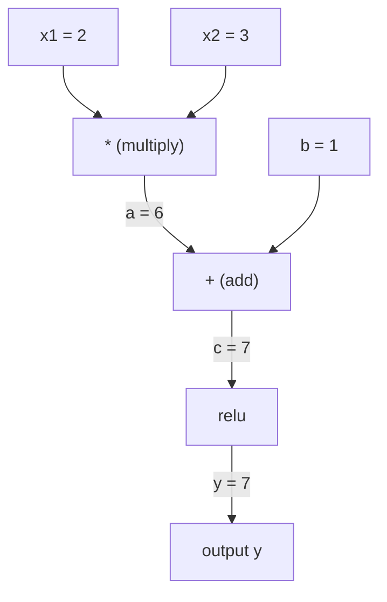
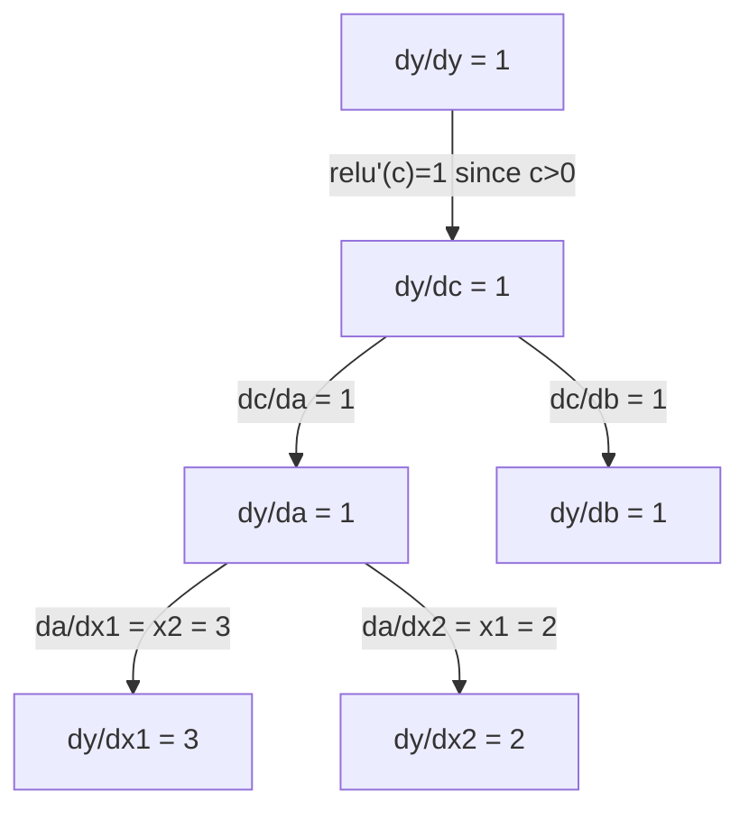

# قاعدة السلسلة والتمايز التلقائي

> قاعدة السلسلة هي المحرك وراء كل شبكة عصبية تتعلم.

**النوع:** بناء
** اللغة: ** بايثون
**المتطلبات الأساسية:** المرحلة الأولى، الدرس 04 (المشتقات والتدرجات اللونية)
**الوقت:** ~90 دقيقة

## أهداف التعلم

- إنشاء محرك autograd بسيط (فئة القيمة) يسجل العمليات ويحسب التدرجات عبر الوضع التلقائي العكسي
- تنفيذ التمريرات الأمامية والخلفية من خلال الرسم البياني الحسابي باستخدام الفرز الطوبولوجي
- إنشاء وتدريب إدراك متعدد الطبقات على XOR باستخدام محرك autograd من الصفر فقط
- التحقق من صحة التمييز التلقائي باستخدام فحص التدرج مقابل الاختلافات العددية المحدودة

## المشكلة

يمكنك حساب مشتقات الوظائف البسيطة. لكن الشبكة العصبية ليست وظيفة بسيطة. وهي عبارة عن مئات من الوظائف التي يتم تجميعها معًا: ضرب المصفوفة، إضافة التحيز، تطبيق التنشيط، ضرب المصفوفة مرة أخرى، softmax، فقدان الإنتروبيا المتقاطعة. الإخراج هو وظيفة وظيفة وظيفة.

لتدريب الشبكة، تحتاج إلى تدرج الخسارة فيما يتعلق بكل وزن. إن القيام بذلك يدويًا أمر مستحيل بالنسبة لملايين المعلمات. إن القيام بذلك رقميًا (اختلافات محدودة) بطيء جدًا.

قاعدة السلسلة تمنحك الرياضيات. يمنحك التمايز التلقائي الخوارزمية. تتيح لك معًا حساب التدرجات الدقيقة من خلال تركيبات عشوائية من الوظائف في الوقت المناسب بما يتناسب مع تمريرة أمامية واحدة.

هذه هي الطريقة التي تعمل بها PyTorch وTensorFlow وJAX. سوف تقوم ببناء نسخة مصغرة من الصفر.

##المفهوم

### قاعدة السلسلة

إذا كان `y = f(g(x))`، فإن مشتقة `y` بالنسبة إلى `x` هي:

```
dy/dx = dy/dg * dg/dx = f'(g(x)) * g'(x)
```

اضرب المشتقات على طول السلسلة. يساهم كل رابط بمشتقه المحلي.

مثال: `y = sin(x^2)`

```
g(x) = x^2       g'(x) = 2x
f(g) = sin(g)     f'(g) = cos(g)

dy/dx = cos(x^2) * 2x
```

للحصول على تركيبات أعمق، تمتد السلسلة:

```
y = f(g(h(x)))

dy/dx = f'(g(h(x))) * g'(h(x)) * h'(x)
```

كل طبقة في الشبكة العصبية هي حلقة واحدة في هذه السلسلة.

### الرسوم البيانية الحسابية

الرسم البياني الحسابي يجعل قاعدة السلسلة مرئية. كل عملية تصبح عقدة. تتدفق البيانات إلى الأمام من خلال الرسم البياني. التدرجات تتدفق إلى الوراء.

**التمرير الأمامي (القيم الحسابية):**



**تمرير للخلف (حساب التدرجات):**



يطبق التمرير للخلف قاعدة السلسلة في كل عقدة، مما يؤدي إلى نشر التدرجات من المخرجات إلى المدخلات.

### الوضع الأمامي مقابل الوضع العكسي

هناك طريقتان لتطبيق قاعدة السلسلة من خلال الرسم البياني.

**الوضع الأمامي** يبدأ عند المدخلات ويدفع المشتقات للأمام. فهو يحسب `dx/dx = 1` وينتشر خلال كل عملية. جيد عندما يكون لديك مدخلات قليلة ومخرجات كثيرة.

```
Forward mode: seed dx/dx = 1, propagate forward

  x = 2       (dx/dx = 1)
  a = x^2     (da/dx = 2x = 4)
  y = sin(a)  (dy/dx = cos(a) * da/dx = cos(4) * 4 = -2.615)
```

**الوضع العكسي** يبدأ عند المخرجات ويسحب التدرجات للخلف. فهو يحسب `dy/dy = 1` وينتشر خلال كل عملية في الاتجاه المعاكس. جيد عندما يكون لديك مدخلات كثيرة ومخرجات قليلة.

```
Reverse mode: seed dy/dy = 1, propagate backward

  y = sin(a)  (dy/dy = 1)
  a = x^2     (dy/da = cos(a) = cos(4) = -0.654)
  x = 2       (dy/dx = dy/da * da/dx = -0.654 * 4 = -2.615)
```

تحتوي الشبكات العصبية على ملايين المدخلات (الأوزان) ومخرج واحد (الخسارة). يحسب الوضع العكسي جميع التدرجات في مسار واحد للخلف. هذا هو السبب في أن الانتشار العكسي يستخدم الوضع العكسي.

| الوضع | بذرة | الاتجاه | الأفضل عندما |
|------|------|-----------|-----------|
| إلى الأمام | `dx_i/dx_i = 1` | الإدخال إلى الإخراج | مدخلات قليلة، مخرجات كثيرة |
| عكس | __الكود_1__ | الإخراج إلى الإدخال | المدخلات كثيرة والمخرجات قليلة (الشبكات العصبية) |

### أرقام مزدوجة لوضع الأمام

يمكن تنفيذ الوضع الأمامي بأناقة باستخدام أرقام مزدوجة. الرقم المزدوج له النموذج `a + b*epsilon` حيث `epsilon^2 = 0`.

```
Dual number: (value, derivative)

(2, 1) means: value is 2, derivative w.r.t. x is 1

Arithmetic rules:
  (a, a') + (b, b') = (a+b, a'+b')
  (a, a') * (b, b') = (a*b, a'*b + a*b')
  sin(a, a')         = (sin(a), cos(a)*a')
```

قم بزرع متغير الإدخال بالمشتق 1. وينتشر المشتق تلقائيًا خلال كل عملية.

### بناء محرك Autograd

يحتاج محرك autograd إلى ثلاثة أشياء:

1. **التفاف القيمة.** لف كل رقم في كائن يخزن قيمته وتدرجه.
2. **تسجيل الرسم البياني.** تسجل كل عملية مدخلاتها ووظيفة التدرج المحلي.
3. **تمرير إلى الخلف.** قم بفرز الرسم البياني طوبولوجيًا، ثم قم بتحريكه في الاتجاه المعاكس، مع تطبيق قاعدة السلسلة على كل عقدة.

هذا هو بالضبط ما يفعله `autograd` الخاص بـ PyTorch. تقوم الفئة `torch.Tensor` بتغليف القيم، وتسجيل العمليات عند `requires_grad=True`، وحساب التدرجات عند استدعاء `.backward()`.

### كيف يعمل PyTorch Autograd تحت الغطاء

عندما تكتب كود PyTorch:

```python
x = torch.tensor(2.0, requires_grad=True)
y = x ** 2 + 3 * x + 1
y.backward()
print(x.grad)  # 7.0 = 2*x + 3 = 2*2 + 3
```

PyTorch داخليًا:

1. قم بإنشاء عقدة `Tensor` لـ `x` باستخدام `requires_grad=True`
2. كل عملية (`**`، `*`، `+`) تنشئ عقدة جديدة وتسجل الوظيفة الخلفية
3. يقوم `y.backward()` بتشغيل التمييز التلقائي في الوضع العكسي من خلال الرسم البياني المسجل
4. يحسب `grad_fn` الخاص بكل عقدة التدرجات المحلية ويمررها إلى العقد الرئيسية
5. تتراكم التدرجات في سمات `.grad` عبر الإضافة (وليس الاستبدال)

الرسم البياني ديناميكي (تحديد حسب التشغيل). يتم إنشاء رسم بياني جديد على كل تمريرة للأمام. ولهذا السبب يدعم PyTorch التحكم في التدفق (إذا كان/إلا، الحلقات) داخل النماذج.

## بنائها

### الخطوة 1: فئة القيمة

```python
class Value:
    def __init__(self, data, children=(), op=''):
        self.data = data
        self.grad = 0.0
        self._backward = lambda: None
        self._prev = set(children)
        self._op = op

    def __repr__(self):
        return f"Value(data={self.data:.4f}, grad={self.grad:.4f})"
```

يقوم كل `Value` بتخزين بياناته الرقمية، وتدرجه (صفر في البداية)، ووظيفة عكسية، ومؤشرات إلى العقد الفرعية التي أنتجتها.

### الخطوة 2: العمليات الحسابية مع تتبع التدرج

```python
    def __add__(self, other):
        other = other if isinstance(other, Value) else Value(other)
        out = Value(self.data + other.data, (self, other), '+')
        def _backward():
            self.grad += out.grad
            other.grad += out.grad
        out._backward = _backward
        return out

    def __mul__(self, other):
        other = other if isinstance(other, Value) else Value(other)
        out = Value(self.data * other.data, (self, other), '*')
        def _backward():
            self.grad += other.data * out.grad
            other.grad += self.data * out.grad
        out._backward = _backward
        return out

    def relu(self):
        out = Value(max(0, self.data), (self,), 'relu')
        def _backward():
            self.grad += (1.0 if out.data > 0 else 0.0) * out.grad
        out._backward = _backward
        return out
```

تنشئ كل عملية إغلاقًا يعرف كيفية حساب التدرجات المحلية والضرب في التدرج الأساسي (`out.grad`). يعالج `+=` الحالة التي يتم فيها استخدام القيمة في عمليات متعددة.

### الخطوة 3: التمريرة الخلفية

```python
    def backward(self):
        topo = []
        visited = set()
        def build_topo(v):
            if v not in visited:
                visited.add(v)
                for child in v._prev:
                    build_topo(child)
                topo.append(v)
        build_topo(self)

        self.grad = 1.0
        for v in reversed(topo):
            v._backward()
```

يضمن الفرز الطوبولوجي حساب تدرج كل عقدة بشكل كامل قبل أن ينتشر إلى أبنائها. تدرج البذرة هو 1.0 (dy/dy = 1).

### الخطوة 4: المزيد من العمليات لمحرك كامل

تتعامل فئة القيمة الأساسية مع الجمع والضرب والريلو. يحتاج محرك autograd الحقيقي إلى المزيد. فيما يلي العمليات التي تحتاجها لبناء الشبكات العصبية:

```python
    def __neg__(self):
        return self * -1

    def __sub__(self, other):
        return self + (-other)

    def __radd__(self, other):
        return self + other

    def __rmul__(self, other):
        return self * other

    def __rsub__(self, other):
        return other + (-self)

    def __pow__(self, n):
        out = Value(self.data ** n, (self,), f'**{n}')
        def _backward():
            self.grad += n * (self.data ** (n - 1)) * out.grad
        out._backward = _backward
        return out

    def __truediv__(self, other):
        return self * (other ** -1) if isinstance(other, Value) else self * (Value(other) ** -1)

    def exp(self):
        import math
        e = math.exp(self.data)
        out = Value(e, (self,), 'exp')
        def _backward():
            self.grad += e * out.grad
        out._backward = _backward
        return out

    def log(self):
        import math
        out = Value(math.log(self.data), (self,), 'log')
        def _backward():
            self.grad += (1.0 / self.data) * out.grad
        out._backward = _backward
        return out

    def tanh(self):
        import math
        t = math.tanh(self.data)
        out = Value(t, (self,), 'tanh')
        def _backward():
            self.grad += (1 - t ** 2) * out.grad
        out._backward = _backward
        return out
```

** لماذا كل عملية مهمة: **

| عملية | القاعدة المتخلفة | تستخدم في |
|-----------|--------------|---------|
| `__sub__` | يعيد استخدام إضافة + سلبي | حساب الخسارة (ما قبل - الهدف) |
| __الكود_1__ | ن * س^(ن-1) | تفعيلات كثيرة الحدود، MSE (خطأ ^ 2) |
| __الكود_2__ | إعادة استخدام mul + pow(-1) | التطبيع، وقياس معدل التعلم |
| __الكود_3__ | exp(x) * المنبع | Softmax، احتمالية السجل |
| __الكود_4__ | (1/x) * المنبع | الخسارة عبر الإنتروبيا، احتمالات السجل |
| __الكود_5__ | (1 - تنه^2) * المنبع | وظيفة التنشيط الكلاسيكية |

الجزء الذكي: `__sub__` و`__truediv__` يتم تعريفهما من حيث العمليات الحالية. يحصلون على التدرجات الصحيحة مجانًا لأن قاعدة السلسلة تتكون من خلال عمليات الإضافة/مول/الأسرى الأساسية.

### الخطوة 5: Mini MLP من الصفر

مع فئة القيمة الكاملة، يمكنك بناء شبكة عصبية. لا بايتورش. لا يوجد NumPy. القيم فقط وقاعدة السلسلة.

```python
import random

class Neuron:
    def __init__(self, n_inputs):
        self.w = [Value(random.uniform(-1, 1)) for _ in range(n_inputs)]
        self.b = Value(0.0)

    def __call__(self, x):
        act = sum((wi * xi for wi, xi in zip(self.w, x)), self.b)
        return act.tanh()

    def parameters(self):
        return self.w + [self.b]

class Layer:
    def __init__(self, n_inputs, n_outputs):
        self.neurons = [Neuron(n_inputs) for _ in range(n_outputs)]

    def __call__(self, x):
        return [n(x) for n in self.neurons]

    def parameters(self):
        return [p for n in self.neurons for p in n.parameters()]

class MLP:
    def __init__(self, sizes):
        self.layers = [Layer(sizes[i], sizes[i+1]) for i in range(len(sizes)-1)]

    def __call__(self, x):
        for layer in self.layers:
            x = layer(x)
        return x[0] if len(x) == 1 else x

    def parameters(self):
        return [p for layer in self.layers for p in layer.parameters()]
```

`Neuron` يحسب `tanh(w1*x1 + w2*x2 + ... + b)`. `Layer` هي قائمة الخلايا العصبية. يقوم `MLP` بتكديس الطبقات. كل وزن هو `Value`، لذا فإن استدعاء `loss.backward()` ينشر التدرجات اللونية لكل معلمة.

**التدريب على XOR:**

```python
random.seed(42)
model = MLP([2, 4, 1])  # 2 inputs, 4 hidden neurons, 1 output

xs = [[0, 0], [0, 1], [1, 0], [1, 1]]
ys = [-1, 1, 1, -1]  # XOR pattern (using -1/1 for tanh)

for step in range(100):
    preds = [model(x) for x in xs]
    loss = sum((p - y) ** 2 for p, y in zip(preds, ys))

    for p in model.parameters():
        p.grad = 0.0
    loss.backward()

    lr = 0.05
    for p in model.parameters():
        p.data -= lr * p.grad

    if step % 20 == 0:
        print(f"step {step:3d}  loss = {loss.data:.4f}")

print("\nPredictions after training:")
for x, y in zip(xs, ys):
    print(f"  input={x}  target={y:2d}  pred={model(x).data:6.3f}")
```

هذا هو ميكروغراد. حلقة تدريب كاملة للشبكة العصبية بلغة بايثون الخالصة مع التمايز التلقائي. كل إطار عمل تجاري للتعلم العميق يفعل الشيء نفسه على نطاق واسع.

### الخطوة 6: التحقق من التدرج

كيف تعرف أن autodiff الخاص بك صحيح؟ قارنها بالمشتقات العددية. هذا هو التحقق من التدرج.

```python
def gradient_check(build_expr, x_val, h=1e-7):
    x = Value(x_val)
    y = build_expr(x)
    y.backward()
    autodiff_grad = x.grad

    y_plus = build_expr(Value(x_val + h)).data
    y_minus = build_expr(Value(x_val - h)).data
    numerical_grad = (y_plus - y_minus) / (2 * h)

    diff = abs(autodiff_grad - numerical_grad)
    return autodiff_grad, numerical_grad, diff
```

اختبره على تعبير معقد:

```python
def expr(x):
    return (x ** 3 + x * 2 + 1).tanh()

ad, num, diff = gradient_check(expr, 0.5)
print(f"Autodiff:  {ad:.8f}")
print(f"Numerical: {num:.8f}")
print(f"Difference: {diff:.2e}")
# Difference should be < 1e-5
```

يعد التحقق من التدرج أمرًا ضروريًا عند تنفيذ عمليات جديدة. إذا كان تمريرك الخلفي يحتوي على خطأ، فسيكتشفه الفحص الرقمي. يقوم كل تطبيق جاد للتعلم العميق بإجراء فحوصات متدرجة أثناء التطوير.

**متى يتم استخدام التحقق من التدرج:**

| الوضع | هل تحقق التدرج؟ |
|-----------|-------------------|
| إضافة عملية جديدة إلى autograd الخاص بك | نعم دائما |
| تصحيح أخطاء حلقة التدريب التي لن تتقارب | نعم، تحقق من التدرجات أولاً |
| التدريب على الإنتاج | لا، بطيء جدًا (تمرير أمامي مرتين لكل معلمة) |
| اختبارات الوحدة لرمز autograd | نعم، أتمته |

### الخطوة 7: التحقق من الحساب اليدوي

```python
x1 = Value(2.0)
x2 = Value(3.0)
a = x1 * x2          # a = 6.0
b = a + Value(1.0)    # b = 7.0
y = b.relu()          # y = 7.0

y.backward()

print(f"y = {y.data}")          # 7.0
print(f"dy/dx1 = {x1.grad}")   # 3.0 (= x2)
print(f"dy/dx2 = {x2.grad}")   # 2.0 (= x1)
```

الفحص اليدوي: `y = relu(x1*x2 + 1)`. منذ `x1*x2 + 1 = 7 > 0`، relu هي الهوية.
__الكود_2__. __الكود_3__. المحرك متطابق.

## استخدمه

### التحقق ضد PyTorch

```python
import torch

x1 = torch.tensor(2.0, requires_grad=True)
x2 = torch.tensor(3.0, requires_grad=True)
a = x1 * x2
b = a + 1.0
y = torch.relu(b)
y.backward()

print(f"PyTorch dy/dx1 = {x1.grad.item()}")  # 3.0
print(f"PyTorch dy/dx2 = {x2.grad.item()}")  # 2.0
```

نفس التدرجات. يحسب محركك نفس النتيجة مثل PyTorch لأن الرياضيات هي نفسها: الوضع العكسي التلقائي عبر قاعدة السلسلة.

### تعبير أكثر تعقيدًا

```python
a = Value(2.0)
b = Value(-3.0)
c = Value(10.0)
f = (a * b + c).relu()  # relu(2*(-3) + 10) = relu(4) = 4

f.backward()
print(f"df/da = {a.grad}")  # -3.0 (= b)
print(f"df/db = {b.grad}")  #  2.0 (= a)
print(f"df/dc = {c.grad}")  #  1.0
```

## اشحنها

ينتج هذا الدرس:
- `outputs/skill-autodiff.md` -- مهارة في بناء وتصحيح أنظمة autograd
- `code/autodiff.py` -- الحد الأدنى من محرك autograd الذي يمكنك تمديده

تعتبر فئة القيمة المبنية هنا الأساس لحلقة تدريب الشبكة العصبية في المرحلة الثالثة.

## تمارين

1. أضف `__pow__` إلى فئة القيمة حتى تتمكن من حساب `x ** n`. تحقق من أن `d/dx(x^3)` في `x=2` يساوي `12.0`.

2. أضف `tanh` كوظيفة تفعيل. تحقق من أن `tanh'(0) = 1` و`tanh'(2) = 0.0707` (تقريبًا).

3. أنشئ رسمًا بيانيًا حسابيًا لخلية عصبية واحدة: `y = relu(w1*x1 + w2*x2 + b)`. احسب جميع التدرجات الخمسة وتحقق من PyTorch.

4. تنفيذ التمييز التلقائي في الوضع الأمامي باستخدام الأرقام المزدوجة. قم بإنشاء فئة `Dual` وتأكد من أنها تعطي نفس المشتقات مثل محرك الوضع العكسي الخاص بك.

## المصطلحات الرئيسية

| مصطلح | ماذا يقول الناس | ماذا يعني في الواقع |
|------|----------------|----------------------|
| قاعدة السلسلة | "ضرب المشتقات" | مشتق الدوال المركبة يساوي حاصل ضرب المشتقة المحلية لكل دالة، مقيمًا عند النقطة الصحيحة |
| الرسم البياني الحسابي | "مخطط الشبكة" | رسم بياني حلقي موجه حيث تكون العقد عبارة عن عمليات وتحمل الحواف قيمًا (للأمام) أو تدرجات (للخلف) |
| الوضع إلى الأمام | "دفع المشتقات إلى الأمام" | Autodiff الذي ينشر المشتقات من المدخلات إلى المخرجات. تمريرة واحدة لكل متغير الإدخال. |
| الوضع العكسي | "الانتشار العكسي" | Autodiff الذي ينشر التدرجات من المخرجات إلى المدخلات. تمريرة واحدة لكل متغير الإخراج. |
| أوتوغراد | "التدرجات التلقائية" | نظام يسجل العمليات على القيم ويبني رسمًا بيانيًا ويحسب التدرجات الدقيقة عبر قاعدة السلسلة |
| أرقام مزدوجة | "القيمة زائد المشتقة" | أرقام على شكل a + b*epsilon (epsilon^2 = 0) تحمل معلومات مشتقة من خلال الحساب |
| الفرز الطوبولوجي | "ترتيب التبعية" | ترتيب عقد الرسم البياني بحيث تأتي كل عقدة بعد كل تبعياتها. مطلوب لنشر التدرج الصحيح. |
| تراكم التدرج | "أضف ولا تستبدل" | عندما يتم تغذية قيمة ما في عمليات متعددة، يكون تدرجها هو مجموع كل مساهمات التدرج الواردة |
| رسم بياني ديناميكي | "التعريف حسب التشغيل" | رسم بياني حسابي يُعاد بناؤه عند كل تمريرة أمامية، مما يسمح بتحكم Python في التدفق داخل النماذج (أسلوب PyTorch) |
| فحص التدرج | "التحقق العددي" | مقارنة التدرجات التلقائية مع التدرجات العددية ذات الفروق المحدودة للتحقق من صحتها. ضروري لتصحيح الأخطاء. |
| ملب | "الإدراك متعدد الطبقات" | شبكة عصبية تحتوي على طبقة أو أكثر من الطبقات المخفية من الخلايا العصبية. تحسب كل خلية عصبية المجموع المرجح بالإضافة إلى التحيز، ثم تطبق وظيفة التنشيط. |
| العصبية | "المجموع المرجح + التنشيط" | الوحدة الأساسية: الإخراج = التنشيط (w1*x1 + w2*x2 + ... + b). تعتبر الأوزان والتحيز معلمات قابلة للتعلم. |

## مزيد من القراءة

- [3Blue1Brown: Backpropagation calculus](https://www.youtube.com/watch?v=tIeHLnjs5U8) -- شرح مرئي لقاعدة السلسلة في الشبكات العصبية
- [PyTorch Autograd mechanics](https://pytorch.org/docs/stable/notes/autograd.html) -- كيف يعمل النظام الحقيقي
- [Baydin et al., Automatic Differentiation in Machine Learning: a Survey](https://arxiv.org/abs/1502.05767) -- مرجع شامل