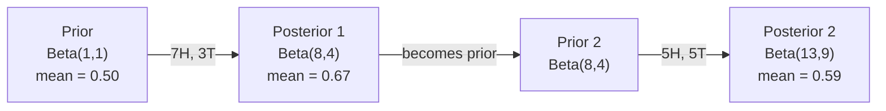

# نظرية بايز
> الاحتمال يتعلق بما تتوقعه. نظرية بايز تدور حول ما تتعلمه.
**النوع:** بناء
** اللغة: ** بايثون
**المتطلبات الأساسية:** المرحلة الأولى، الدرس 06 (أساسيات الاحتمالية)
**الوقت:** ~75 دقيقة
## أهداف التعلم
- تطبيق نظرية بايز لحساب الاحتمالات الخلفية من السوابق والاحتمالات والأدلة
- أنشئ مصنف نص Naive Bayes من البداية باستخدام تجانس لابلاس وحساب مساحة السجل
- قارن بين تقدير MLE وMAP واشرح كيف يتوافق MAP مع تسوية L2
- تنفيذ التحديث Bayesian المتسلسل باستخدام الأقدمية المترافقة Beta-Binomial لاختبار A/B
## المشكلة
الفحص الطبي دقيق بنسبة 99%. اختبارك إيجابي. ما هي احتمالات إصابتك بالمرض بالفعل؟
معظم الناس يقولون 99٪. الجواب الحقيقي يعتمد على مدى ندرة المرض. إذا أصيب به شخص واحد من كل 10000 شخص، فإن النتيجة الإيجابية تمنحك فرصة بنسبة 1٪ فقط للإصابة بالمرض. أما الـ 99% الأخرى من النتائج الإيجابية فهي إنذارات كاذبة من أشخاص أصحاء.
هذا ليس سؤال خدعة. إنها نظرية بايز. كل مرشح للبريد العشوائي، وكل تشخيص طبي، وكل نموذج للتعلم الآلي يقيس عدم اليقين يستخدم هذا المنطق الدقيق. عليك أن تبدأ مع الاعتقاد. ترى الأدلة. قمت بالتحديث.
إذا قمت بإنشاء أنظمة ML دون فهم ذلك، فسوف تسيء تفسير مخرجات النموذج، وتضع حدودًا سيئة، وترسل توقعات مفرطة الثقة.
##المفهوم
### من الاحتمال المشترك إلى بايز
لقد تعلمت بالفعل من الدرس 06 أن الاحتمال الشرطي هو:
```
P(A|B) = P(A and B) / P(B)
```

وبشكل متناظر:
```
P(B|A) = P(A and B) / P(A)
```

كلا التعبيرين يشتركان في نفس البسط: P(A وB). اجعلها متساوية وأعد ترتيبها:
```
P(A and B) = P(A|B) * P(B) = P(B|A) * P(A)

Therefore:

P(A|B) = P(B|A) * P(A) / P(B)
```

هذه هي نظرية بايز. أربع كميات، معادلة واحدة.
### الأجزاء الأربعة
| الجزء | الاسم | ماذا يعني |
|------|------|---------------|
| ف(أ\|ب) | خلفي | اعتقادك المحدث حول (أ) بعد رؤية الدليل (ب)|
| ف(ب\|أ) | احتمال | ما مدى احتمالية وجود الدليل B إذا كان A صحيحًا |
| ف(أ) | قبل | اعتقادك حول أ قبل رؤية أي دليل |
| ف(ب) | الأدلة | الاحتمال الإجمالي لرؤية B تحت كل الاحتمالات |
يعمل مصطلح الدليل P (B) بمثابة مُطبيع. يمكنك توسيعه باستخدام قانون الاحتمال الكلي:
```
P(B) = P(B|A) * P(A) + P(B|not A) * P(not A)
```

### مثال على الاختبار الطبي
يصيب المرض 1 من كل 10000 شخص. الاختبار دقيق بنسبة 99% (يكتشف 99% من المرضى، ويعطي نتائج إيجابية كاذبة في 1% من الحالات).
```
P(sick)          = 0.0001     (prior: disease is rare)
P(positive|sick) = 0.99       (likelihood: test catches it)
P(positive|healthy) = 0.01    (false positive rate)

P(positive) = P(positive|sick) * P(sick) + P(positive|healthy) * P(healthy)
            = 0.99 * 0.0001 + 0.01 * 0.9999
            = 0.000099 + 0.009999
            = 0.010098

P(sick|positive) = P(positive|sick) * P(sick) / P(positive)
                 = 0.99 * 0.0001 / 0.010098
                 = 0.0098
                 = 0.98%
```

أقل من 1%. السابق يهيمن. عندما تكون الحالة نادرة، فحتى الاختبارات الدقيقة تنتج في الغالب نتائج إيجابية كاذبة. ولهذا السبب يطلب الأطباء اختبارات التأكيد.
### مثال لتصفية البريد العشوائي
تصلك رسالة بريد إلكتروني تحتوي على كلمة "اليانصيب". هل هو البريد العشوائي؟
```
P(spam)                = 0.3      (30% of email is spam)
P("lottery"|spam)      = 0.05     (5% of spam emails contain "lottery")
P("lottery"|not spam)  = 0.001    (0.1% of legitimate emails contain "lottery")

P("lottery") = 0.05 * 0.3 + 0.001 * 0.7
             = 0.015 + 0.0007
             = 0.0157

P(spam|"lottery") = 0.05 * 0.3 / 0.0157
                  = 0.955
                  = 95.5%
```

كلمة واحدة تغير الاحتمال من 30% إلى 95.5%. يقوم مرشح البريد العشوائي الحقيقي بتطبيق Bayes على مئات الكلمات في وقت واحد.
### ساذج بايز: افتراض الاستقلال
يقوم Naive Bayes بتوسيع هذا ليشمل ميزات متعددة من خلال افتراض أن جميع الميزات مستقلة بشروط نظرًا للفئة:
```
P(class | feature_1, feature_2, ..., feature_n)
  = P(class) * P(feature_1|class) * P(feature_2|class) * ... * P(feature_n|class)
    / P(feature_1, feature_2, ..., feature_n)
```

الجزء "الساذج" هو افتراض الاستقلال. في النص، تكرارات الكلمات ليست مستقلة ("New" و"York" مرتبطان). لكن الافتراض يعمل بشكل جيد بشكل مدهش في الممارسة العملية لأن المصنف يحتاج فقط إلى ترتيب الفئات، وليس إنتاج احتمالات معايرة.
نظرًا لأن المقام هو نفسه لجميع الفئات، يمكنك تخطيه ومقارنة البسط فقط:
```
score(class) = P(class) * product of P(feature_i | class)
```

اختر الفصل الحاصل على أعلى الدرجات.
### تقدير الاحتمالية القصوى (MLE)
كيف تحصل على P(feature|class) من بيانات التدريب؟ عدد.
```
P("free"|spam) = (number of spam emails containing "free") / (total spam emails)
```

هذا هو MLE: اختر قيم المعلمات التي make هي البيانات التي تمت ملاحظتها على الأرجح. أنت تقوم بتعظيم دالة الاحتمالية، والتي تقلل إلى التكرار النسبي بالنسبة للأعداد المنفصلة.
المشكلة: إذا لم تظهر الكلمة مطلقًا في البريد العشوائي أثناء التدريب، فإن MLE يعطيها احتمالًا صفرًا. كلمة واحدة غير مرئية تقتل المنتج بأكمله. أصلح هذا باستخدام تجانس لابلاس:
```
P(word|class) = (count(word, class) + 1) / (total_words_in_class + vocabulary_size)
```

إن إضافة 1 إلى كل عدد يضمن ألا يكون الاحتمال صفرًا على الإطلاق.
### الحد الأقصى اللاحق (MAP)
MLE يسأل: ما هي المعلمات التي تزيد من P(data|parameters)؟
MAP يسأل: ما هي المعلمات التي تزيد من P(parameters|data) إلى الحد الأقصى؟
بواسطة نظرية بايز:
```
P(parameters|data) proportional to P(data|parameters) * P(parameters)
```

يضيف MAP سابقة على المعلمات نفسها. إذا كنت تعتقد أن المعلمات يجب أن تكون صغيرة، فيمكنك تشفير ذلك كسابقة تعاقب القيم الكبيرة. وهذا مطابق للتسوية L2 في ML. عقوبة "التلال" في انحدار التلال هي حرفيًا سابقة غاوسية على الأوزان.
| تقدير | يحسن | ML يعادل |
|------------|-----------|---------------|
| __المصطلح_1__ | P(بيانات\|معلمات) | تدريب غير منتظم |
| __المصطلح_2__ | P(data\|params) * P(params) | L2 / L1 التسوية |
### بايزي مقابل المتكرر: الفرق العملي
يعامل التكراريون المعلمات على أنها مجهولة ثابتة. ويسألون: "لو كررت هذه التجربة عدة مرات ماذا سيحدث؟"
يعامل البايزيون المعلمات كتوزيعات. ويتساءلون: "في ضوء ما لاحظته، ما هو اعتقادي بشأن المعلمات؟"
بالنسبة لبناء أنظمة ML، الفرق العملي:
| الجانب | متكرر | بايزي |
|--------|------------|----------|
| الإخراج | تقدير النقطة | التوزيع على القيم |
| عدم اليقين | فترات الثقة (حول الإجراء) | فترات زمنية موثوقة (حول المعلمة) |
| بيانات صغيرة | يمكن أن يفرط | الأعمال السابقة بمثابة تنظيم |
| الحساب | عادة أسرع | غالبا ما يتطلب أخذ العينات (MCMC) |
معظم الإنتاج ML متكرر (SGD، تقديرات النقاط). تتألق الأساليب الافتراضية عندما تحتاج إلى عدم يقين معايرة (القرارات الطبية، وأنظمة السلامة الحرجة) أو عندما تكون البيانات نادرة (التعلم ببضع جرعات، والبداية الباردة).
### سبب أهمية التفكير البايزي في ML
العلاقة أعمق من التشبيه:
**الأسبقية هي التنظيم.** السابقة الغوسية على الأوزان هي L2 التنظيم. لابلاس قبل هو L1. في كل مرة تقوم فيها بإضافة مصطلح تنظيم، فإنك تقوم بإصدار بيان بايزي حول قيم المعلمات التي تتوقعها.
**النتائج الخلفية هي حالة من عدم اليقين.** لا يخبرك احتمال واحد متوقع بأي شيء عن مدى ثقة النموذج في هذا التقدير. تمنحك الطرق الافتراضية توزيعًا: "أعتقد أن P (البريد العشوائي) يتراوح بين 0.8 و0.95."
** تحديثات بايز هي التعلم عبر الإنترنت. ** يصبح الجزء الخلفي من اليوم هو السابق للغد. عندما يرى نموذجك بيانات جديدة، فإنه يقوم بتحديث معتقداته بشكل تدريجي بدلاً من إعادة التدريب من الصفر.
**مقارنة النماذج بايزي.** يستخدم معيار المعلومات بايزي (BIC) والاحتمالية الهامشية وعوامل بايز كلها المنطق بايزي للاختيار بين النماذج دون الإفراط في التجهيز.
## بنائها
### الخطوة 1: دالة نظرية بايز
```python
def bayes(prior, likelihood, false_positive_rate):
    evidence = likelihood * prior + false_positive_rate * (1 - prior)
    posterior = likelihood * prior / evidence
    return posterior

result = bayes(prior=0.0001, likelihood=0.99, false_positive_rate=0.01)
print(f"P(sick|positive) = {result:.4f}")
```

### الخطوة 2: مصنف Naive Bayes
```python
import math
from collections import defaultdict

class NaiveBayes:
    def __init__(self, smoothing=1.0):
        self.smoothing = smoothing
        self.class_counts = defaultdict(int)
        self.word_counts = defaultdict(lambda: defaultdict(int))
        self.class_word_totals = defaultdict(int)
        self.vocab = set()

    def train(self, documents, labels):
        for doc, label in zip(documents, labels):
            self.class_counts[label] += 1
            words = doc.lower().split()
            for word in words:
                self.word_counts[label][word] += 1
                self.class_word_totals[label] += 1
                self.vocab.add(word)

    def predict(self, document):
        words = document.lower().split()
        total_docs = sum(self.class_counts.values())
        vocab_size = len(self.vocab)
        best_class = None
        best_score = float("-inf")
        for cls in self.class_counts:
            score = math.log(self.class_counts[cls] / total_docs)
            for word in words:
                count = self.word_counts[cls].get(word, 0)
                total = self.class_word_totals[cls]
                score += math.log((count + self.smoothing) / (total + self.smoothing * vocab_size))
            if score > best_score:
                best_score = score
                best_class = cls
        return best_class
```

احتمالات السجل تمنع التدفق السفلي. يؤدي ضرب العديد من الاحتمالات الصغيرة إلى إنتاج أرقام صغيرة جدًا بالنسبة للنقطة العائمة. إن جمع احتمالات السجل مستقر عدديًا ومكافئ رياضيًا.
### الخطوة 3: التدريب على البيانات غير المرغوب فيها
```python
train_docs = [
    "win free money now",
    "free lottery ticket winner",
    "claim your prize today free",
    "urgent offer free cash",
    "congratulations you won free",
    "meeting tomorrow at noon",
    "project update attached",
    "can we schedule a call",
    "quarterly report review",
    "lunch on thursday sounds good",
    "team standup notes attached",
    "please review the pull request",
]

train_labels = [
    "spam", "spam", "spam", "spam", "spam",
    "ham", "ham", "ham", "ham", "ham", "ham", "ham",
]

classifier = NaiveBayes()
classifier.train(train_docs, train_labels)

test_messages = [
    "free money waiting for you",
    "meeting rescheduled to friday",
    "you won a free prize",
    "please review the attached report",
]

for msg in test_messages:
    print(f"  '{msg}' -> {classifier.predict(msg)}")
```

### الخطوة 4: فحص الاحتمالات المستفادة
```python
def show_top_words(classifier, cls, n=5):
    vocab_size = len(classifier.vocab)
    total = classifier.class_word_totals[cls]
    probs = {}
    for word in classifier.vocab:
        count = classifier.word_counts[cls].get(word, 0)
        probs[word] = (count + classifier.smoothing) / (total + classifier.smoothing * vocab_size)
    sorted_words = sorted(probs.items(), key=lambda x: x[1], reverse=True)
    for word, prob in sorted_words[:n]:
        print(f"    {word}: {prob:.4f}")

print("\nTop spam words:")
show_top_words(classifier, "spam")
print("\nTop ham words:")
show_top_words(classifier, "ham")
```

## استخدمه
تطبيقات Bayes الساذجة الجاهزة للإنتاج لسفن Scikit-Learn:
```python
from sklearn.feature_extraction.text import CountVectorizer
from sklearn.naive_bayes import MultinomialNB
from sklearn.metrics import classification_report

vectorizer = CountVectorizer()
X_train = vectorizer.fit_transform(train_docs)
clf = MultinomialNB()
clf.fit(X_train, train_labels)

X_test = vectorizer.transform(test_messages)
predictions = clf.predict(X_test)
for msg, pred in zip(test_messages, predictions):
    print(f"  '{msg}' -> {pred}")
```

نفس الخوارزمية. يتعامل CountVectorizer مع الترميز وبناء المفردات. يعالج MultinomialNB التجانس واحتمالات التسجيل داخليًا. نسختك من الصفر تفعل نفس الشيء في 40 سطرًا.
## اشحنها
توضح فئة NaiveBayes المبنية هنا خط pipeline الكامل: الرمز المميز، وتقدير الاحتمالية باستخدام تجانس لابلاس، والتنبؤ بمساحة السجل. يتم تشغيل الكود الموجود في `code/bayes.py` من طرف إلى طرف دون أي تبعيات تتجاوز مكتبة Python القياسية.
### الأسبقية المترافقة
عندما ينتمي التوزيعان السابق والخلفي إلى نفس عائلة التوزيعات، يُطلق على التوزيع السابق اسم "المترافق". هذا التحديث البايزي makes نظيف جبريًا - تحصل على شكل خلفي مغلق بدون تكامل رقمي.
| احتمال | المترافق السابق | خلفي | مثال |
|-----------|----------------|-----------|---------|
| برنولي | بيتا (أ، ب) | بيتا (أ + النجاحات، ب + الفشل) | تقدير انحياز الوجه للعملة |
| عادي (التباين المعروف) | عادي (mu_0، sigma_0) | عادي (المتوسط ​​​​المرجح، التباين الأصغر) | معايرة المستشعر |
| بواسون | جاما(أ، ب) | جاما(أ + مجموع الأعداد، ب + ن) | نمذجة معدلات الوصول |
| متعدد الحدود | ديريشليت(ألفا) | ديريشليت (ألفا + الأعداد) | نمذجة الموضوع، النماذج اللغوية |
سبب أهمية ذلك: بدون وجود سوابق مترافقة، تحتاج إلى أخذ عينات مونت كارلو أو الاستدلال المتغير لتقريب الجزء الخلفي. مع الأسبقية المترافقة، يمكنك فقط تحديث رقمين.
توزيع بيتا هو المترافق الأكثر شيوعًا في الممارسة العملية. تمثل Beta(a, b) اعتقادك حول معلمة الاحتمال. المتوسط ​​هو أ/(أ+ب). كلما كان a+b أكبر، كان التوزيع أكثر تركيزًا (ثقة).
حالات خاصة من النسخة التجريبية السابقة:
- بيتا (1، 1) = منتظم. ليس لديك رأي حول المعلمة.
- بيتا(10، 10) = بلغ ذروته عند 0.5. أنت تعتقد بشدة أن المعلمة قريبة من 0.5.
- Beta(1, 10) = منحرف نحو 0. أنت تعتقد أن المعلمة صغيرة.
قاعدة التحديث بسيطة جدًا:
```
Prior:     Beta(a, b)
Data:      s successes, f failures
Posterior: Beta(a + s, b + f)
```

لا تكاملات. لا أخذ العينات. مجرد إضافة.
### تحديث بايزي متسلسل
الاستدلال البايزي متسلسل بشكل طبيعي. مؤخرة اليوم تصبح سابقة للغد. هذه هي الطريقة التي تتعلم بها الأنظمة الحقيقية بشكل تدريجي دون إعادة معالجة جميع البيانات التاريخية.
مثال ملموس: تقدير ما إذا كانت العملة عادلة.
**اليوم الأول: لا توجد بيانات حتى الآن.**
ابدأ بـ Beta(1, 1) - وهو موحد سابق. ليس لديك رأي.
- المتوسط السابق: 0.5
- السابقة مسطحة عبر [0، 1]
**اليوم الثاني: مراقبة 7 رؤوس و3 ذيول.**
الخلفي = بيتا(1 + 7، 1 + 3) = بيتا (8، 4)
- الوسط الخلفي: 8/12 = 0.667
- تشير الأدلة إلى أن العملة منحازة نحو الصورة
**اليوم الثالث: شاهد 5 رؤوس أخرى و5 ذيول أخرى.**
استخدم الجزء الخلفي من الأمس كسابق اليوم.
الخلفي = بيتا (8 + 5، 4 + 5) = بيتا (13، 9)
- الوسط الخلفي: 13/22 = 0.591
- البيانات الجديدة المتوازنة أعادت التقدير نحو 0.5


ترتيب الملاحظات لا يهم. تم تحديث Beta(1,1) بجميع الرؤوس الـ 12 والـ 8 في وقت واحد مما يعطي Beta(13, 9) - نفس النتيجة. التحديث المتسلسل والتحديث الدفعي متكافئان رياضيا. لكن التحديث التسلسلي يتيح لك اتخاذ قرارات make في كل خطوة دون تخزين البيانات الأولية.
هذا هو أساس التعلم عبر الإنترنت في أنظمة الإنتاج ML. تستخدم عينات طومسون لقطاع الطرق وأنظمة التوصية التزايدية وأجهزة الكشف عن الشذوذ المتدفق جميعها هذا النمط.
### الاتصال باختبار A/B
اختبار A/B هو استدلال بايزي مقنع.
الإعداد: أنت تختبر لونين للزر. البديل أ (الأزرق) والبديل ب (الأخضر). تريد أن تعرف أي واحد يحصل على المزيد من النقرات.
اختبار بايزي أ/ب:
1. **مسبق.** ابدأ بالإصدار التجريبي (1، 1) لكلا الخيارين. لا يوجد تفضيل مسبق.
2. **البيانات.** البديل أ: 50 نقرة من أصل 1000 مشاهدة. البديل ب: 65 نقرة من أصل 1000 مشاهدة.
3. **الخلفيات.**
   - أ: بيتا(1 + 50، 1 + 950) = بيتا (51، 951). يعني = 0.051
   - ب: بيتا(1 + 65، 1 + 935) = بيتا (66، 936). يعني = 0.066
4. **القرار.** حساب P(B > A) - احتمال أن يكون معدل التحويل الحقيقي لـ B أعلى من A.
إن حساب P(B > A) تحليليًا أمر صعب. لكن مونت كارلو make الأمر تافه:
```
1. Draw 100,000 samples from Beta(51, 951)  -> samples_A
2. Draw 100,000 samples from Beta(66, 936)  -> samples_B
3. P(B > A) = fraction of samples where B > A
```

إذا كان P(B > A) > 0.95، فستشحن المتغير B. وإذا كان يتراوح بين 0.05 و0.95، فستستمر في جمع البيانات. إذا كانت قيمة P(B > A) < 0.05، فستقوم بشحن المتغير A.
المزايا مقارنة باختبار A/B المتكرر:
- تحصل على عبارة احتمالية مباشرة: "هناك احتمال بنسبة 97% أن يكون B أفضل"
- لا يوجد ارتباك في القيمة p. لا يوجد تحوط "فشل في رفض فرضية العدم".
- يمكنك التحقق من النتائج في أي وقت دون تضخيم المعدلات الإيجابية الكاذبة (لا توجد "مشكلة في النظر")
- يمكنك دمج المعرفة السابقة (على سبيل المثال، تشير الاختبارات السابقة إلى أن معدلات التحويل عادة ما تكون 3-8%)
| الجانب | المتكرر أ/ب | بايزي أ/ب |
|--------|----------------|-------------|
| الإخراج | القيمة p | ف(ب > أ) |
| التفسير | "ما مدى مفاجأة هذه البيانات إذا كانت A=B؟" | "ما مدى احتمالية أن يكون B أفضل من A؟" |
| التوقف المبكر | يضخم الإيجابيات الكاذبة | آمن في أي وقت (نظرًا لنموذج مسبق تم اختياره جيدًا ومحدد بشكل صحيح) |
| المعرفة السابقة | غير مستخدم | تم ترميزه كنسخة تجريبية سابقة |
| قاعدة القرار | ف <0.05 | P(B > A) > العتبة |
## تمارين
1. **اختبارات متعددة.** جاءت نتيجة اختبار المريض إيجابية مرتين في اختبارات مستقلة (كلاهما دقيق بنسبة 99%، ومعدل انتشار المرض 1 من كل 10000). ما هو P(sick) بعد كلا الاختبارين؟ استخدم الجزء الخلفي من الاختبار الأول كالسابق للاختبار الثاني.
2. **تأثير التجانس.** قم بتشغيل مصنف البريد العشوائي بقيم التجانس 0.01 و0.1 و1.0 و10.0. كيف تتغير احتمالات الكلمة العليا؟ ماذا يحدث مع التنعيم = 0 والكلمة التي تظهر فقط في لحم الخنزير؟
3. **إضافة ميزات.** قم بتوسيع فئة NaiveBayes لاستخدام طول الرسالة (قصيرة/طويلة) أيضًا كميزة إلى جانب عدد الكلمات. قم بتقدير P(short|spam) وP(short|ham) من بيانات التدريب وقم بإضافتها إلى درجة التنبؤ.
4. **MAP يدويًا.** بالنظر إلى البيانات التي تمت ملاحظتها (7 صور في 10 نقرات للعملات المعدنية)، قم بحساب تقدير MAP للتحيز باستخدام Beta(2,2) السابقة. قارنه بتقدير MLE (7/10).
## المصطلحات الرئيسية
| مصطلح | ماذا يقول الناس | ماذا يعني في الواقع |
|------|----------------|----------------------|
| قبل | "تخميني الأولي" | P(الفرضية) قبل ملاحظة الأدلة. في ML: مصطلح التنظيم. |
| احتمال | "مدى ملاءمة البيانات" | P(دليل\|فرضية). ما مدى احتمالية أن تكون البيانات المرصودة تحت فرضية محددة. |
| خلفي | "اعتقادي المحدث" | P(الفرضية\|الدليل). السابق مضروبًا في الاحتمال، ثم يتم تطبيعه. |
| الأدلة | "ثابت التطبيع" | P(البيانات) في جميع الفرضيات. يضمن المبالغ الخلفية إلى 1. |
| ساذج بايز | "مصنف النص البسيط" | مصنف يفترض أن الميزات مستقلة عن الفئة. يعمل بشكل جيد على الرغم من الافتراض الخاطئ. |
| تجانس لابلاس | "التجانس الإضافي" | إضافة عدد صغير إلى كل ميزة لمنع احتمالات الصفر من البيانات غير المرئية. |
| __المصطلح_1__ | "مجرد استخدام الترددات" | اختر المعلمات التي تعمل على تكبير P(data\|parameters). لا سابقة. يمكن الإفراط في البيانات الصغيرة. |
| __المصطلح_2__ | "MLE مع سابقة" | اختر المعلمات التي تعمل على تكبير P(data\|parameters) * P(parameters). أي ما يعادل MLE المنتظم. |
| احتمالية السجل | "العمل في مساحة السجل" | استخدام السجل (P) بدلاً من P لتجنب التدفق السفلي للفاصلة العائمة عند ضرب العديد من الأرقام الصغيرة. |
| إيجابية كاذبة | "إنذار خاطئ" | الاختبار يقول إيجابي، ولكن الحالة الحقيقية سلبية. يقود مغالطة المعدل الأساسي. |
## مزيد من القراءة
- [3Blue1Brown: Bayes' theorem](https://www.youtube.com/watch?v=HZGCoVF3YvM) - شرح مرئي مع مثال الفحص الطبي
- [Stanford CS229: Generative Learning Algorithms](https://cs229.stanford.edu/notes2022fall/cs229-notes2.pdf) - ساذجة بايز وارتباطها بالنماذج التمييزية
- [Think Bayes](https://greenteapress.com/wp/think-bayes/) - كتاب مجاني إحصائيات بايزي مع كود بايثون
- [scikit-learn Naive Bayes](https://scikit-learn.org/stable/modules/naive_bayes.html) - تطبيقات الإنتاج ومتى يتم استخدام كل متغير