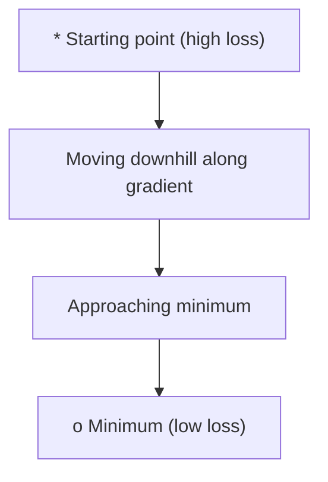
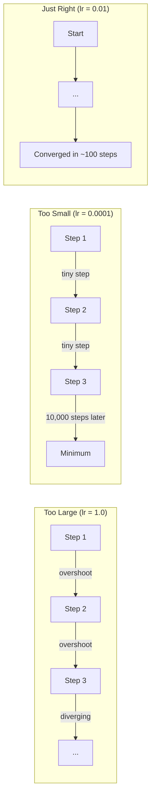
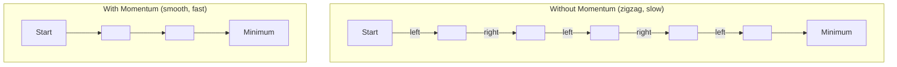
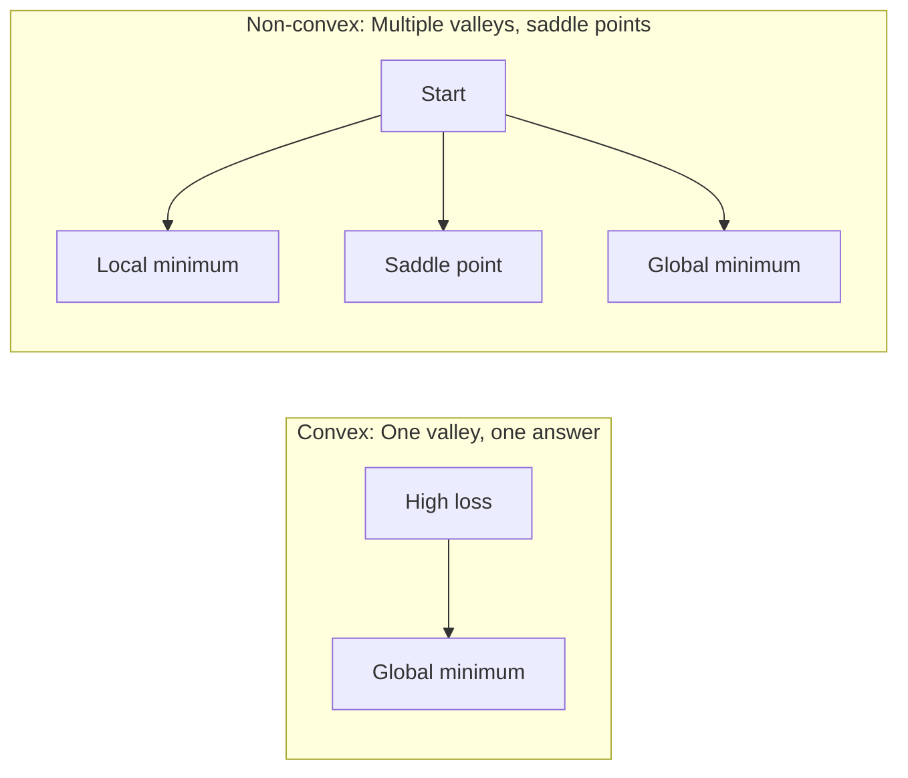
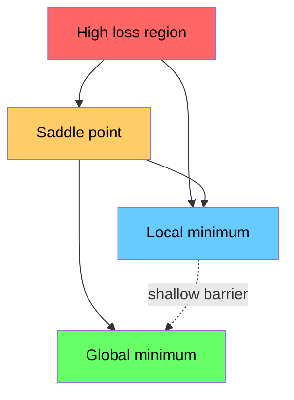

# تحسين

> تدريب الشبكة العصبية ليس أكثر من العثور على قاع الوادي.

**النوع:** بناء
** اللغة: ** بايثون
**المتطلبات الأساسية:** المرحلة الأولى، الدروس 04-05 (المشتقات، التدرجات)
**الوقت:** ~75 دقيقة

## أهداف التعلم

- تنفيذ نزول التدرج الفانيليا، SGD مع الزخم، وآدم من الصفر
- قارن تقارب المحسن في دالة روزنبروك واشرح لماذا يتكيف آدم مع معدلات التعلم لكل وزن
- التمييز بين المناظر الطبيعية المحدبة وغير المحدبة وشرح دور نقاط السرج في الأبعاد العالية
- تكوين جداول معدل التعلم (تسوس الخطوة، وجيب التمام الصلب، والاحماء) لاستقرار التدريب

## المشكلة

لديك وظيفة الخسارة. يخبرك بمدى خطأ نموذجك. لديك التدرجات. يقولون لك الاتجاه الذي يجعل الخسارة أسوأ. أنت الآن بحاجة إلى استراتيجية للمشي على المنحدرات.

النهج الساذج بسيط: التحرك عكس التدرج. قم بقياس الخطوة برقم يسمى معدل التعلم. يكرر. هذا هو النسب التدرج، ويعمل. لكن "الأعمال" لها محاذير. معدل التعلم كبير جدًا وستتجاوز الوادي تمامًا، وتقفز بين الجدران. صغيرة جدًا وستزحف نحو الإجابة عبر آلاف الخطوات غير الضرورية. اضرب نقطة السرج وستتوقف عن الحركة رغم أنك لم تجد الحد الأدنى.

كل محسن في التعلم العميق هو إجابة لنفس السؤال: كيف يمكنك الوصول إلى قاع الوادي بشكل أسرع وأكثر موثوقية؟

##المفهوم

### ماذا يعني التحسين

التحسين هو العثور على قيم الإدخال التي تقلل (أو تزيد) الوظيفة. في التعلم الآلي، الوظيفة هي الخسارة. المدخلات هي أوزان النموذج. التدريب هو الأمثل.

```
minimize L(w) where:
  L = loss function
  w = model weights (could be millions of parameters)
```

### النسب المتدرج (الفانيليا)

أبسط محسن. احسب تدرج الخسارة بالنسبة لكل وزن. حرك كل وزن في الاتجاه المعاكس لانحداره. مقياس الخطوة بمعدل التعلم.

```
w = w - lr * gradient
```

هذه هي الخوارزمية بأكملها. سطر واحد.



### معدل التعلم: المعلمة الفائقة الأكثر أهمية

يتحكم معدل التعلم في حجم الخطوة. إنه يحدد كل شيء يتعلق بالتقارب.



لا توجد صيغة لمعدل التعلم الصحيح. يمكنك العثور عليه عن طريق التجربة. نقاط البداية المشتركة: 0.001 لآدم، 0.01 للدولار السنغافوري مع الزخم.

### SGD مقابل الدفعة مقابل الدفعة الصغيرة

يحسب نزول التدرج الفانيليا التدرج على مجموعة البيانات بأكملها قبل اتخاذ خطوة واحدة. وهذا ما يسمى النسب التدرج الدفعي. إنها مستقرة ولكنها بطيئة.

يحسب النسب التدرج العشوائي (SGD) التدرج على عينة عشوائية واحدة ويخطوات على الفور. أنها صاخبة ولكنها سريعة.

يقسم النسب المتدرج للدفعة الصغيرة الفرق. حساب التدرج على دفعة صغيرة (32، 64، 128، 256 عينة)، ثم الخطوة. وهذا ما يستخدمه الجميع بالفعل.

| البديل | حجم الدفعة | جودة التدرج | السرعة لكل خطوة | الضوضاء |
|---------|----------|-----------------|---------------|-------|
| دفعة جي دي | مجموعة البيانات الكاملة | بالضبط | بطيء | لا شيء |
| دولار سنغافوري | 1 عينة | صاخبة جداً | سريع | عالية |
| دفعة صغيرة | 32-256 | تقدير جيد | متوازن | معتدل |

الضجيج في SGD والدفعة الصغيرة ليس خطأ. يساعد على الهروب من الحدود الدنيا المحلية الضحلة ونقاط السرج.

### الزخم: الكرة تتدحرج إلى أسفل

ينظر نزول التدرج الفانيليا فقط إلى التدرج الحالي. وإذا كانت الخطوط المتعرجة متدرجة (شائعة في الأودية الضيقة)، فإن التقدم بطيء. يعمل الزخم على إصلاح ذلك من خلال تجميع التدرجات السابقة في مصطلح السرعة.

```
v = beta * v + gradient
w = w - lr * v
```

التشبيه: كرة تتدحرج إلى أسفل. لا يتوقف ويعيد تشغيله عند كل عثرة. إنه يبني السرعة في اتجاهات متسقة ويخفف التذبذبات.



يتحكم `beta` (عادةً 0.9) في مقدار السجل المطلوب الاحتفاظ به. الإصدار التجريبي الأعلى يعني المزيد من الزخم، ومسارات أكثر سلاسة، ولكن الاستجابة أبطأ لتغيرات الاتجاه.

### آدم: معدلات التعلم التكيفية

الأوزان المختلفة تحتاج إلى معدلات تعلم مختلفة. يجب أن يتخذ الوزن الذي نادرًا ما يحصل على تدرجات كبيرة خطوات أكبر عندما يحدث ذلك في النهاية. الوزن الذي يحصل على تدرجات كبيرة باستمرار يجب أن يتخذ خطوات أصغر.

آدم (تقدير اللحظة التكيفية) يتتبع شيئين لكل وزن:

1. اللحظة الأولى (م): متوسط التدرجات الجارية (مثل الزخم)
2. اللحظة الثانية (v): متوسط تشغيل التدرجات المربعة (حجم التدرج)

```
m = beta1 * m + (1 - beta1) * gradient
v = beta2 * v + (1 - beta2) * gradient^2

m_hat = m / (1 - beta1^t)    bias correction
v_hat = v / (1 - beta2^t)    bias correction

w = w - lr * m_hat / (sqrt(v_hat) + epsilon)
```

القسمة على `sqrt(v_hat)` هي الفكرة الأساسية. يتم تقسيم الأوزان ذات التدرجات الكبيرة على عدد كبير (خطوة فعالة صغيرة). يتم تقسيم الأوزان ذات التدرجات الصغيرة على عدد صغير (الخطوة الفعالة الكبيرة). كل وزن يحصل على معدل التعلم التكيفي الخاص به.

المعلمات الفائقة الافتراضية: `lr=0.001, beta1=0.9, beta2=0.999, epsilon=1e-8`. تعمل هذه الإعدادات الافتراضية بشكل جيد مع معظم المشكلات.

### جداول معدل التعلم

معدل التعلم الثابت هو حل وسط. في وقت مبكر من التدريب، تريد خطوات كبيرة لتحقيق تقدم سريع. في وقت متأخر من التدريب، تحتاج إلى خطوات صغيرة لضبطها بالقرب من الحد الأدنى.

الجداول الزمنية المشتركة:

| الجدول الزمني | صيغة | حالة الاستخدام |
|----------|--------|----------|
| خطوة الاضمحلال | lr = lr * عامل كل N Epochs | تحكم يدوي بسيط |
| الاضمحلال الأسي | lr = lr_0 * الاضمحلال^t | تخفيض سلس |
| جيب التمام الصلب | lr = lr_min + 0.5 * (lr_max - lr_min) * (1 + cos(pi * t / T)) | المحولات الحديثة للتدريب |
| الاحماء + الاضمحلال | المنحدر الخطي، ثم الاضمحلال | نماذج كبيرة، تمنع عدم الاستقرار المبكر |

### محدبة مقابل غير محدبة

الدالة المحدبة لها حد أدنى واحد. يجده النسب المتدرج دائمًا. المعادلة التربيعية مثل `f(x) = x^2` محدبة.

وظائف فقدان الشبكة العصبية غير محدبة. لديهم العديد من الحدود الدنيا المحلية ونقاط السرج والمناطق المسطحة.



من الناحية العملية، نادرًا ما يمثل الحد الأدنى المحلي في الشبكات العصبية عالية الأبعاد مشكلة. معظم القيم الدنيا المحلية لها قيم خسارة قريبة من الحد الأدنى العالمي. نقاط السرج (مسطحة في بعض الاتجاهات، منحنية في اتجاهات أخرى) هي العائق الحقيقي. يساعد الزخم والضوضاء الصادرة عن الدفعات الصغيرة على الهروب منها.

### تصور المناظر الطبيعية المفقودة

الخسارة هي وظيفة جميع الأوزان. بالنسبة للنموذج الذي يحتوي على مليون وزن، فإن مشهد الخسارة يعيش في مساحة ذات 1,000,001 بعد. نحن نتصور ذلك من خلال اختيار اتجاهين عشوائيين في مساحة الوزن وتخطيط الخسارة على طول تلك الاتجاهات، مما ينتج عنه سطح ثنائي الأبعاد.



الحد الأدنى الحاد يعمم بشكل سيء. تعميم الحدود الدنيا المسطحة بشكل جيد. وهذا هو أحد الأسباب التي تجعل SGD مع الزخم يتفوق في كثير من الأحيان على آدم في دقة الاختبار النهائية: ضجيجه يمنع الاستقرار في الحد الأدنى الحاد.

## بنائها

### الخطوة 1: تحديد وظيفة الاختبار

تعد وظيفة Rosenbrock بمثابة معيار تحسين كلاسيكي. الحد الأدنى لها هو (1، 1) داخل وادٍ منحني ضيق يسهل العثور عليه ولكن يصعب متابعته.

```
f(x, y) = (1 - x)^2 + 100 * (y - x^2)^2
```

```python
def rosenbrock(params):
    x, y = params
    return (1 - x) ** 2 + 100 * (y - x ** 2) ** 2

def rosenbrock_gradient(params):
    x, y = params
    df_dx = -2 * (1 - x) + 200 * (y - x ** 2) * (-2 * x)
    df_dy = 200 * (y - x ** 2)
    return [df_dx, df_dy]
```

### الخطوة الثانية: نزول الفانيليا بشكل متدرج

```python
class GradientDescent:
    def __init__(self, lr=0.001):
        self.lr = lr

    def step(self, params, grads):
        return [p - self.lr * g for p, g in zip(params, grads)]
```

### الخطوة 3: الدولار السنغافوري مع الزخم

```python
class SGDMomentum:
    def __init__(self, lr=0.001, momentum=0.9):
        self.lr = lr
        self.momentum = momentum
        self.velocity = None

    def step(self, params, grads):
        if self.velocity is None:
            self.velocity = [0.0] * len(params)
        self.velocity = [
            self.momentum * v + g
            for v, g in zip(self.velocity, grads)
        ]
        return [p - self.lr * v for p, v in zip(params, self.velocity)]
```

### الخطوة 4: آدم

```python
class Adam:
    def __init__(self, lr=0.001, beta1=0.9, beta2=0.999, epsilon=1e-8):
        self.lr = lr
        self.beta1 = beta1
        self.beta2 = beta2
        self.epsilon = epsilon
        self.m = None
        self.v = None
        self.t = 0

    def step(self, params, grads):
        if self.m is None:
            self.m = [0.0] * len(params)
            self.v = [0.0] * len(params)

        self.t += 1

        self.m = [
            self.beta1 * m + (1 - self.beta1) * g
            for m, g in zip(self.m, grads)
        ]
        self.v = [
            self.beta2 * v + (1 - self.beta2) * g ** 2
            for v, g in zip(self.v, grads)
        ]

        m_hat = [m / (1 - self.beta1 ** self.t) for m in self.m]
        v_hat = [v / (1 - self.beta2 ** self.t) for v in self.v]

        return [
            p - self.lr * mh / (vh ** 0.5 + self.epsilon)
            for p, mh, vh in zip(params, m_hat, v_hat)
        ]
```

### الخطوة 5: التشغيل والمقارنة

```python
def optimize(optimizer, func, grad_func, start, steps=5000):
    params = list(start)
    history = [params[:]]
    for _ in range(steps):
        grads = grad_func(params)
        params = optimizer.step(params, grads)
        history.append(params[:])
    return history

start = [-1.0, 1.0]

gd_history = optimize(GradientDescent(lr=0.0005), rosenbrock, rosenbrock_gradient, start)
sgd_history = optimize(SGDMomentum(lr=0.0001, momentum=0.9), rosenbrock, rosenbrock_gradient, start)
adam_history = optimize(Adam(lr=0.01), rosenbrock, rosenbrock_gradient, start)

for name, history in [("GD", gd_history), ("SGD+M", sgd_history), ("Adam", adam_history)]:
    final = history[-1]
    loss = rosenbrock(final)
    print(f"{name:6s} -> x={final[0]:.6f}, y={final[1]:.6f}, loss={loss:.8f}")
```

الناتج المتوقع: آدم يتقارب بشكل أسرع. يتبع الدولار السنغافوري ذو الزخم مسارًا أكثر سلاسة. تحرز Vanilla GD تقدمًا بطيئًا على طول الوادي الضيق.

## استخدمه

في الممارسة العملية، استخدم أدوات تحسين PyTorch أو JAX. إنهم يتعاملون مع مجموعات المعلمات، وتسوس الوزن، وقص التدرج، وتسريع GPU.

```python
import torch

model = torch.nn.Linear(784, 10)

sgd = torch.optim.SGD(model.parameters(), lr=0.01, momentum=0.9)
adam = torch.optim.Adam(model.parameters(), lr=0.001)
adamw = torch.optim.AdamW(model.parameters(), lr=0.001, weight_decay=0.01)

scheduler = torch.optim.lr_scheduler.CosineAnnealingLR(adam, T_max=100)
```

القواعد الأساسية:

- ابدأ بآدم (lr=0.001). يعمل على معظم المشاكل دون ضبط.
- قم بالتبديل إلى SGD مع الزخم (lr=0.01، الزخم=0.9) عندما تحتاج إلى أفضل دقة نهائية ويمكنك تحمل المزيد من الضبط.
- استخدم AdamW (آدم مع انحلال الوزن المنفصل) للمحولات.
- استخدم دائمًا جدول معدل التعلم للتدريب الذي يمتد لفترة أطول من عدة فترات.
- إذا كان التدريب غير مستقر، خفض معدل التعلم. إذا كان التدريب بطيئًا جدًا، قم بزيادته.

## اشحنها

ينتج عن هذا الدرس مطالبة باختيار المُحسِّن المناسب. انظر `outputs/prompt-optimizer-guide.md`.

تظهر فئات المُحسِّن التي تم إنشاؤها هنا مرة أخرى في المرحلة الثالثة عندما نقوم بتدريب شبكة عصبية من الصفر.

## تمارين

1. ** مسح معدل التعلم. ** قم بتشغيل نزول التدرج الفانيليا في دالة روزنبروك بمعدلات التعلم [0.0001، 0.0005، 0.001، 0.005، 0.01]. ارسم أو اطبع الخسارة النهائية بعد 5000 خطوة لكل منها. أوجد أكبر معدل تعلم لا يزال متقاربًا.

2. **مقارنة الزخم.** قم بتشغيل SGD بقيم الزخم [0.0، 0.5، 0.9، 0.99] على دالة Rosenbrock. تتبع الخسارة في كل خطوة. ما هي قيمة الزخم التي تتقارب بشكل أسرع؟ أي تجاوز؟

3. **هروب نقطة السرج.** حدد الوظيفة `f(x, y) = x^2 - y^2` (نقطة السرج عند الأصل). ابدأ عند (0.01، 0.01). قارن كيف يتصرف الفانيليا GD وSGD مع الزخم وآدم. الذي يهرب من نقطة السرج؟

4. **تنفيذ تضاؤل ​​معدل التعلم.** أضف جدول تضاؤل ​​أسي إلى فئة GradientDescent: `lr = lr_0 * 0.999^step`. قارن التقارب مع وبدون الاضمحلال في دالة روزنبروك.

## المصطلحات الرئيسية

| مصطلح | ماذا يقول الناس | ماذا يعني في الواقع |
|------|----------------|----------------------|
| نزول متدرج | "اذهب إلى أسفل" | قم بتحديث الأوزان عن طريق طرح التدرج الذي تم قياسه حسب معدل التعلم. المحسن الأساسي. |
| معدل التعلم | "حجم الخطوة" | عددي يتحكم في مدى نقل كل تحديث للأوزان. الحجم الكبير جدًا يسبب الاختلاف. حساب النفايات الصغيرة جدًا. |
| الزخم | "استمر في التدحرج" | تجميع التدرجات الماضية في ناقل السرعة. يخفف التذبذبات ويسرع الحركة من خلال اتجاهات متسقة. |
| دولار سنغافوري | "أخذ العينات العشوائية" | نزول التدرج العشوائي. حساب التدرج على مجموعة فرعية عشوائية بدلا من مجموعة البيانات الكاملة. تعني دائمًا تقريبًا دفعة صغيرة من SGD في الممارسة العملية. |
| دفعة صغيرة | "قطعة من البيانات" | مجموعة فرعية صغيرة من بيانات التدريب (32-256 عينة) تستخدم لتقدير التدرج. يوازن بين السرعة ودقة التدرج. |
| آدم | "المحسن الافتراضي" | تقدير اللحظة التكيفية. يتتبع متوسطات تشغيل التدرجات والتدرجات المربعة لكل وزن لإعطاء كل وزن معدل التعلم الخاص به. |
| تصحيح التحيز | "إصلاح البداية الباردة" | تمت تهيئة لحظات آدم الأولى والثانية إلى الصفر. يتم قسمة تصحيح الانحياز على (1 - بيتا^t) للتعويض أثناء الخطوات المبكرة. |
| جدول معدل التعلم | "تغيير lr بمرور الوقت" | وظيفة تقوم بضبط معدل التعلم أثناء التدريب. خطوات كبيرة في وقت مبكر، وخطوات صغيرة في وقت متأخر. |
| وظيفة محدبة | "وادي واحد" | دالة يكون فيها أي حد أدنى محلي هو الحد الأدنى العالمي. يجده النسب المتدرج دائمًا. خسائر الشبكة العصبية ليست محدبة. |
| نقطة السرج | "مسطحة ولكن ليس الحد الأدنى" | نقطة يكون فيها الانحدار صفراً ولكنه أدنى في بعض الاتجاهات وأعلى في اتجاهات أخرى. شائع في الأبعاد العالية. |
| مشهد الخسارة | "التضاريس" | دالة الخسارة المرسومة على مساحة الوزن. تصور عن طريق التقطيع على طول اتجاهين عشوائيين. |
| التقارب | "الوصول إلى هناك" | لقد وصل المُحسِّن إلى نقطة حيث لا تؤدي الخطوات الإضافية إلى تقليل الخسارة بشكل مفيد. |

## مزيد من القراءة

- [Sebastian Ruder: An overview of gradient descent optimization algorithms](https://ruder.io/optimizing-gradient-descent/) - استطلاع شامل لجميع أدوات تحسين الأداء الرئيسية
- [Why Momentum Really Works (Distill)](https://distill.pub/2017/momentum/) - تصور تفاعلي لديناميكيات الزخم
- [Adam: A Method for Stochastic Optimization (Kingma & Ba, 2014)](https://arxiv.org/abs/1412.6980) - ورقة آدم الأصلية مقروءة وقصيرة
- [Visualizing the Loss Landscape of Neural Nets (Li et al., 2018)](https://arxiv.org/abs/1712.09913) - الورقة التي أظهرت الحد الأدنى الحاد مقابل الحد الأدنى المسطح