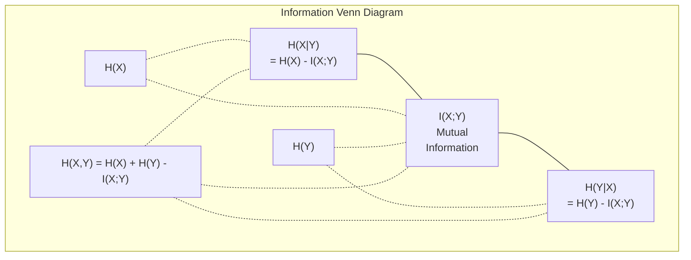

#نظرية المعلومات

> نظرية المعلومات تقيس المفاجأة. وظائف الخسارة مبنية عليها.

**النوع:** تعلم
** اللغة: ** بايثون
**المتطلبات الأساسية:** المرحلة الأولى، الدرس 06 (الاحتمالات)
**الوقت:** ~60 دقيقة

## أهداف التعلم

- حساب الإنتروبيا والإنتروبيا المتقاطعة وتباعد KL من الصفر وشرح العلاقة بينهما
- استنتج لماذا يكون تقليل فقدان الإنتروبيا المتقاطعة مكافئًا لتعظيم احتمالية السجل
- حساب المعلومات المتبادلة بين الميزات والهدف لتصنيف أهمية الميزة
- اشرح الحيرة باعتبارها حجم المفردات الفعال الذي يختاره نموذج اللغة من بينها

## المشكلة

يمكنك استدعاء `CrossEntropyLoss()` في كل نموذج تصنيف تقوم بتدريبه. ترى "الحيرة" في كل ورقة نموذجية للغة. قرأت عن اختلاف KL في VAEs، والتقطير، وRLHF. هذه ليست مفاهيم منفصلة. إنهم جميعًا نفس الفكرة ويرتدون قبعات مختلفة.

تمنحك نظرية المعلومات اللغة اللازمة للتفكير في عدم اليقين والضغط والتنبؤ. اخترعها كلود شانون عام 1948 لحل مشاكل الاتصال. اتضح أن تدريب الشبكة العصبية يمثل مشكلة اتصال: يحاول النموذج إرسال التسمية الصحيحة من خلال قناة صاخبة من الأوزان المستفادة.

يبني هذا الدرس كل صيغة من الصفر حتى تتمكن من معرفة مصدرها وسبب نجاحها.

##المفهوم

### محتوى المعلومات (مفاجأة)

عندما يحدث شيء غير محتمل، فإنه يحمل المزيد من المعلومات. رؤوس هبوط العملة؟ ليس من المستغرب. فوز اليانصيب؟ من المستغرب جدا.

محتوى المعلومات لحدث ذو احتمالية p هو:

```
I(x) = -log(p(x))
```

يمنحك استخدام قاعدة السجل 2 بتات. استخدام السجل الطبيعي يمنحك ناتس. نفس الفكرة، وحدات مختلفة.

```
Event              Probability    Surprise (bits)
Fair coin heads    0.5            1.0
Rolling a 6        0.167          2.58
1-in-1000 event    0.001          9.97
Certain event      1.0            0.0
```

أحداث معينة تحمل صفرًا من المعلومات. كنت تعلم بالفعل أنها ستحدث.

### الانتروبيا (متوسطة المفاجأة)

الإنتروبيا هي المفاجأة المتوقعة عبر جميع النتائج المحتملة للتوزيع.

```
H(P) = -sum( p(x) * log(p(x)) )  for all x
```

تحتوي العملة العادلة على أقصى قدر من الإنتروبيا لمتغير ثنائي: 1 بت. العملة المتحيزة (99٪ صورة) لها إنتروبيا منخفضة: 0.08 بت. أنت تعرف بالفعل ما سيحدث، لذا فإن كل قلب لا يخبرك بأي شيء تقريبًا.

```
Fair coin:    H = -(0.5 * log2(0.5) + 0.5 * log2(0.5)) = 1.0 bit
Biased coin:  H = -(0.99 * log2(0.99) + 0.01 * log2(0.01)) = 0.08 bits
```

يقيس الإنتروبيا عدم اليقين غير القابل للاختزال في التوزيع. لا يمكنك الضغط تحته.

### الانتروبيا المتقاطعة (دالة الخسارة التي تستخدمها كل يوم)

يقيس الإنتروبيا المتقاطعة متوسط ​​المفاجأة عند استخدام التوزيع Q لتشفير الأحداث التي تأتي بالفعل من التوزيع P.

```
H(P, Q) = -sum( p(x) * log(q(x)) )  for all x
```

P هو التوزيع الحقيقي (التسميات). س هي تنبؤات النموذج الخاص بك. إذا كانت Q تطابق P تمامًا، فإن الإنتروبيا المتقاطعة تساوي الإنتروبيا. أي عدم تطابق يجعلها أكبر.

في التصنيف، P هو متجه واحد ساخن (الفئة الحقيقية لديها احتمال 1، كل شيء آخر 0). هذا يبسط الإنتروبيا المتقاطعة إلى:

```
H(P, Q) = -log(q(true_class))
```

هذه هي صيغة الخسارة الشاملة للإنتروبيا للتصنيف. تعظيم الاحتمالية المتوقعة للفئة الصحيحة.

### تباعد KL (المسافة بين التوزيعات)

يقيس تباعد KL مقدار المفاجأة الإضافية التي تحصل عليها من استخدام Q بدلاً من P.

```
D_KL(P || Q) = sum( p(x) * log(p(x) / q(x)) )  for all x
             = H(P, Q) - H(P)
```

الإنتروبيا المتقاطعة هي الإنتروبيا بالإضافة إلى تباعد KL. نظرًا لأن إنتروبيا التوزيع الحقيقي ثابتة أثناء التدريب، فإن تقليل الإنتروبيا المتقاطعة هو نفس تقليل انحراف KL. أنت تدفع توزيع النموذج الخاص بك نحو التوزيع الحقيقي.

تباعد KL غير متماثل: D_KL(P || Q) != D_KL(Q || P). إنه ليس مقياسًا حقيقيًا للمسافة.

### معلومات متبادلة

تقيس المعلومات المتبادلة مدى معرفة متغير واحد عن متغير آخر.

```
I(X; Y) = H(X) - H(X|Y)
        = H(X) + H(Y) - H(X, Y)
```

إذا كان X وY مستقلين، تكون المعلومات المتبادلة صفرًا. معرفة أحدهما لا تخبرك شيئًا عن الآخر. إذا كانت مرتبطة بشكل كامل، فإن المعلومات المتبادلة تساوي إنتروبيا أي من المتغيرين.

في اختيار الميزة، تعني المعلومات المتبادلة العالية بين الميزة والهدف أن الميزة مفيدة. المعلومات المتبادلة المنخفضة تعني أنها ضوضاء.

### الإنتروبيا المشروطة

يقيس H(Y|X) مقدار عدم اليقين المتبقي بشأن Y بعد ملاحظة X.

```
H(Y|X) = H(X,Y) - H(X)
```

اثنين من التطرف:
- إذا كانت X تحدد Y تمامًا، فإن H(Y|X) = 0. معرفة X تزيل كل عدم اليقين بشأن Y. مثال: X = درجة الحرارة بالدرجة المئوية، Y = درجة الحرارة بالفهرنهايت.
- إذا لم يخبرك X بأي شيء عن Y، فإن H(Y|X) = H(Y). معرفة X لا تقلل من عدم يقينك على الإطلاق. مثال: X = قلب العملة، Y = طقس الغد.

الإنتروبيا المشروطة دائمًا غير سلبية ولا تتجاوز أبدًا H(Y):

```
0 <= H(Y|X) <= H(Y)
```

في التعلم الآلي، تظهر الإنتروبيا المشروطة في أشجار القرار. عند كل تقسيم، تختار الخوارزمية الميزة X التي تقلل من H(Y|X) - الميزة التي تزيل معظم حالات عدم اليقين بشأن التسمية Y.

### الإنتروبيا المشتركة

H(X,Y) هي إنتروبيا التوزيع المشترك لـ X وY معًا.

```
H(X,Y) = -sum sum p(x,y) * log(p(x,y))   for all x, y
```

الخاصية الرئيسية:

```
H(X,Y) <= H(X) + H(Y)
```

تتحقق المساواة عندما يكون X و Y مستقلين. إذا تبادلوا المعلومات، فإن الإنتروبيا المشتركة أقل من مجموع الإنتروبيا الفردية. الإنتروبيا "المفقودة" هي بالضبط المعلومات المتبادلة.



العلاقات:
- H(X,Y) = H(X) + H(Y|X) = H(Y) + H(X|Y)
- I(X;Y) = H(X) - H(X|Y) = H(Y) - H(Y|X)
- ح(X,Y) = ح(X) + ح(Y) - أنا(X;Y)

### المعلومات المتبادلة (الغوص العميق)

تحدد المعلومات المتبادلة I(X;Y) مدى معرفة أحد المتغيرات مما يقلل من عدم اليقين بشأن الآخر.

```
I(X;Y) = H(X) - H(X|Y)
       = H(Y) - H(Y|X)
       = H(X) + H(Y) - H(X,Y)
       = sum sum p(x,y) * log(p(x,y) / (p(x) * p(y)))
```

الخصائص:
- I(X;Y) >= 0 دائمًا. لن تفقد المعلومات أبدًا من خلال ملاحظة شيء ما.
- I(X;Y) = 0 إذا وفقط إذا كان X وY مستقلين.
- أنا(X;Y) = أنا(Y;X). إنه متماثل، على عكس تباعد KL.
- أنا(X;X) = ح(X). يقوم المتغير بمشاركة جميع معلوماته مع نفسه.

**معلومات متبادلة لاختيار الميزة.** في تعلم الآلة، تريد ميزات تحتوي على معلومات حول الهدف. تمنحك المعلومات المتبادلة طريقة مبدئية لتصنيف الميزات:

1. لكل ميزة X_i، قم بحساب I(X_i; Y) حيث Y هو المتغير المستهدف.
2. تصنيف الميزات حسب درجة MI.
3. حافظ على أهم ميزات k.

يعمل هذا مع أي علاقة بين الميزة والهدف - خطية أو غير خطية أو رتيبة أو لا. الارتباط يمسك فقط العلاقات الخطية. MI يمسك بكل شيء.

| الطريقة | يكتشف | التكلفة الحسابية | يعالج القاطع؟ |
|--------|---------|----------------------------------|-----|
| ارتباط بيرسون | العلاقات الخطية | يا(ن) | لا |
| ارتباط سبيرمان | علاقات رتيبة | يا(ن سجل ن) | لا |
| معلومات متبادلة | أي تبعية إحصائية | O(n log n) مع binning | نعم |

### تجانس الملصقات والانتروبيا المتقاطعة

يستخدم التصنيف القياسي الأهداف الصعبة: [0، 0، 1، 0]. تحصل الفئة الحقيقية على الاحتمال 1، وكل شيء آخر يحصل على 0. ويستبدل تجانس الملصقات هذه الأهداف السهلة:

```
soft_target = (1 - epsilon) * hard_target + epsilon / num_classes
```

مع إبسيلون = 0.1 و 4 فئات:
- الهدف الصعب: [0، 0، 1، 0]
- الهدف السهل: [0.025، 0.025، 0.925، 0.025]

من منظور نظرية المعلومات، يؤدي تجانس الملصقات إلى زيادة إنتروبيا التوزيع المستهدف. الأهداف الصعبة والساخنة لها إنتروبيا 0 - ليس هناك شك. الأهداف الناعمة لها إنتروبيا إيجابية.

لماذا يساعد هذا:
- يمنع النموذج من توجيه اللوغاريتمات إلى القيم المتطرفة (ستكون هناك حاجة إلى اللوغاريتمات اللانهائية لتتوافق تمامًا مع هدف واحد ساخن في ظل الإنتروبيا المتقاطعة)
- يعمل بمثابة تنظيم: لا يمكن أن يكون النموذج واثقًا بنسبة 100%
- تحسين المعايرة: تعكس الاحتمالات المتوقعة عدم اليقين الحقيقي بشكل أفضل
- تقليص الفجوة بين التدريب وسلوك الاستدلال

تصبح خسارة الإنتروبيا المتقاطعة مع تجانس التسمية:

```
L = (1 - epsilon) * CE(hard_target, prediction) + epsilon * H_uniform(prediction)
```

أما المصطلح الثاني فيعاقب التوقعات البعيدة عن التجانس ـ التنظيم المباشر للثقة.

### لماذا يعد الانتروبيا المتقاطعة خسارة التصنيف

ثلاث وجهات نظر، نفس النتيجة.

**عرض نظرية المعلومات.** يقيس الإنتروبيا المتقاطعة عدد البتات التي تهدرها باستخدام توزيع النموذج الخاص بك بدلاً من التوزيع الحقيقي. إن تصغيره يجعل النموذج الخاص بك هو التشفير الأكثر كفاءة للواقع.

**عرض الحد الأقصى للاحتمالات.** بالنسبة لعينات التدريب N ذات الفصول الحقيقية y_i:

```
Likelihood     = product( q(y_i) )
Log-likelihood = sum( log(q(y_i)) )
Negative log-likelihood = -sum( log(q(y_i)) )
```

السطر الأخير هو خسارة الإنتروبيا المتقاطعة. تقليل الانتروبيا المتقاطعة = زيادة احتمالية بيانات التدريب ضمن النموذج الخاص بك.

**عرض التدرج.** إن تدرج الإنتروبيا المتقاطعة فيما يتعلق بالسجلات هو ببساطة (متوقع - صحيح). نظيفة ومستقرة وسريعة للحساب. وهذا هو السبب في أنه يتماشى بشكل مثالي مع سوفت ماكس.

### البتات مقابل ناتس

والفرق الوحيد هو قاعدة السجل.

```
log base 2   -> bits      (information theory tradition)
log base e   -> nats      (machine learning convention)
log base 10  -> hartleys  (rarely used)
```

1 نات = 1/ln(2) بت = 1.4427 بت. يستخدم PyTorch وTensorFlow السجل الطبيعي (nats) بشكل افتراضي.

### الحيرة

الحيرة هي الأسية للإنتروبيا المتقاطعة. فهو يخبرك بالعدد الفعال للخيارات ذات الاحتمال المتساوي التي يكون النموذج غير مؤكد بينها.

```
Perplexity = 2^H(P,Q)   (if using bits)
Perplexity = e^H(P,Q)   (if using nats)
```

نموذج اللغة ذو درجة الحيرة 50 يكون، في المتوسط، مرتبكًا كما لو كان عليه الاختيار بشكل موحد من بين 50 علامة تالية محتملة. أقل هو أفضل.

حقق GPT-2 درجة حيرة تصل إلى 30 وفقًا للمعايير المشتركة. النماذج الحديثة مكونة من أرقام فردية للمجالات الممثلة جيدًا.

## بنائها

### الخطوة 1: محتوى المعلومات والانتروبيا

```python
import math

def information_content(p, base=2):
    if p <= 0 or p > 1:
        return float('inf') if p <= 0 else 0.0
    return -math.log(p) / math.log(base)

def entropy(probs, base=2):
    return sum(
        p * information_content(p, base)
        for p in probs if p > 0
    )

fair_coin = [0.5, 0.5]
biased_coin = [0.99, 0.01]
fair_die = [1/6] * 6

print(f"Fair coin entropy:   {entropy(fair_coin):.4f} bits")
print(f"Biased coin entropy: {entropy(biased_coin):.4f} bits")
print(f"Fair die entropy:    {entropy(fair_die):.4f} bits")
```

### الخطوة الثانية: الانتروبيا المتقاطعة وتباعد KL

```python
def cross_entropy(p, q, base=2):
    total = 0.0
    for pi, qi in zip(p, q):
        if pi > 0:
            if qi <= 0:
                return float('inf')
            total += pi * (-math.log(qi) / math.log(base))
    return total

def kl_divergence(p, q, base=2):
    return cross_entropy(p, q, base) - entropy(p, base)

true_dist = [0.7, 0.2, 0.1]
good_model = [0.6, 0.25, 0.15]
bad_model = [0.1, 0.1, 0.8]

print(f"Entropy of true dist:     {entropy(true_dist):.4f} bits")
print(f"CE (good model):          {cross_entropy(true_dist, good_model):.4f} bits")
print(f"CE (bad model):           {cross_entropy(true_dist, bad_model):.4f} bits")
print(f"KL divergence (good):     {kl_divergence(true_dist, good_model):.4f} bits")
print(f"KL divergence (bad):      {kl_divergence(true_dist, bad_model):.4f} bits")
```

### الخطوة 3: الإنتروبيا المتقاطعة كخسارة تصنيف

```python
def softmax(logits):
    max_logit = max(logits)
    exps = [math.exp(z - max_logit) for z in logits]
    total = sum(exps)
    return [e / total for e in exps]

def cross_entropy_loss(true_class, logits):
    probs = softmax(logits)
    return -math.log(probs[true_class])

logits = [2.0, 1.0, 0.1]
true_class = 0

probs = softmax(logits)
loss = cross_entropy_loss(true_class, logits)

print(f"Logits:      {logits}")
print(f"Softmax:     {[f'{p:.4f}' for p in probs]}")
print(f"True class:  {true_class}")
print(f"Loss:        {loss:.4f} nats")
print(f"Perplexity:  {math.exp(loss):.2f}")
```

### الخطوة 4: الإنتروبيا المتقاطعة تساوي احتمال السجل السلبي

```python
import random

random.seed(42)

n_samples = 1000
n_classes = 3
true_labels = [random.randint(0, n_classes - 1) for _ in range(n_samples)]
model_logits = [[random.gauss(0, 1) for _ in range(n_classes)] for _ in range(n_samples)]

ce_loss = sum(
    cross_entropy_loss(label, logits)
    for label, logits in zip(true_labels, model_logits)
) / n_samples

nll = -sum(
    math.log(softmax(logits)[label])
    for label, logits in zip(true_labels, model_logits)
) / n_samples

print(f"Cross-entropy loss:      {ce_loss:.6f}")
print(f"Negative log-likelihood: {nll:.6f}")
print(f"Difference:              {abs(ce_loss - nll):.2e}")
```

### الخطوة 5: المعلومات المتبادلة

```python
def mutual_information(joint_probs, base=2):
    rows = len(joint_probs)
    cols = len(joint_probs[0])

    margin_x = [sum(joint_probs[i][j] for j in range(cols)) for i in range(rows)]
    margin_y = [sum(joint_probs[i][j] for i in range(rows)) for j in range(cols)]

    mi = 0.0
    for i in range(rows):
        for j in range(cols):
            pxy = joint_probs[i][j]
            if pxy > 0:
                mi += pxy * math.log(pxy / (margin_x[i] * margin_y[j])) / math.log(base)
    return mi

independent = [[0.25, 0.25], [0.25, 0.25]]
dependent = [[0.45, 0.05], [0.05, 0.45]]

print(f"MI (independent): {mutual_information(independent):.4f} bits")
print(f"MI (dependent):   {mutual_information(dependent):.4f} bits")
```

## استخدمه

نفس المفاهيم باستخدام NumPy، بالطريقة التي ستستخدمها بها عمليًا:

```python
import numpy as np

def np_entropy(p):
    p = np.asarray(p, dtype=float)
    mask = p > 0
    result = np.zeros_like(p)
    result[mask] = p[mask] * np.log(p[mask])
    return -result.sum()

def np_cross_entropy(p, q):
    p, q = np.asarray(p, dtype=float), np.asarray(q, dtype=float)
    mask = p > 0
    return -(p[mask] * np.log(q[mask])).sum()

def np_kl_divergence(p, q):
    return np_cross_entropy(p, q) - np_entropy(p)

true = np.array([0.7, 0.2, 0.1])
pred = np.array([0.6, 0.25, 0.15])
print(f"Entropy:    {np_entropy(true):.4f} nats")
print(f"Cross-ent:  {np_cross_entropy(true, pred):.4f} nats")
print(f"KL div:     {np_kl_divergence(true, pred):.4f} nats")
```

لقد أنشأت من الصفر ما يفعله `torch.nn.CrossEntropyLoss()` داخليًا. الآن أنت تعرف سبب انخفاض الخسارة أثناء التدريب: التوزيع المتوقع لنموذجك يقترب من التوزيع الحقيقي، والذي يتم قياسه بعدد المعلومات الضائعة.

## تمارين

1. حساب إنتروبيا الأبجدية الإنجليزية بافتراض التوزيع الموحد (26 حرفًا). ثم قم بتقديرها باستخدام ترددات الحروف الفعلية. أيهما أعلى ولماذا؟

2. يقوم النموذج بإخراج السجلات [5.0، 2.0، 0.5] لعينة ذات فئة حقيقية 1. احسب خسارة الإنتروبيا المتقاطعة يدويًا، ثم تحقق باستخدام الدالة `cross_entropy_loss`. ما هي السجلات التي من شأنها أن تعطي خسارة صفر؟

3. أظهر أن تباعد KL غير متماثل. اختر توزيعين P وQ واحسب D_KL(P || Q) وD_KL(Q || P). اشرح لماذا يختلفون.

4. قم ببناء دالة تحسب الحيرة لسلسلة من التنبؤات الرمزية. بالنظر إلى قائمة أزواج (true_token_index، المتوقعة_logits)، قم بإرجاع ارتباك التسلسل.

## المصطلحات الرئيسية

| مصطلح | ماذا يقول الناس | ماذا يعني في الواقع |
|------|----------------|----------------------|
| محتوى المعلومات | "مفاجأة" | عدد البتات (أو nats) اللازمة لترميز حدث ما: -log(p) |
| الانتروبيا | "العشوائية" | متوسط ​​المفاجأة في جميع نتائج التوزيع. يقيس عدم اليقين غير القابل للاختزال. |
| عبر الانتروبيا | "وظيفة الخسارة" | متوسط ​​المفاجأة عند استخدام توزيع النموذج Q لتشفير الأحداث من التوزيع الحقيقي P. |
| تباعد كوالالمبور | "المسافة بين التوزيعات" | يتم إهدار البتات الإضافية باستخدام Q بدلاً من P. وتساوي الإنتروبيا المتقاطعة ناقص الإنتروبيا. غير متماثل. |
| معلومات متبادلة | "ما مدى ارتباط X و Y" | تقليل عدم اليقين بشأن X من معرفة Y. الصفر يعني الاستقلال. |
| سوفت ماكس | "تحويل السجلات إلى احتمالات" | الأس والتطبيع. يعين أي متجه ذو قيمة حقيقية لتوزيع احتمالي صالح. |
| الحيرة | "كم هو مرتبك النموذج" | الأسي عبر الانتروبيا. حجم المفردات الفعال الذي يختار النموذج منه في كل خطوة. |
| بت | "وحدة شانون" | المعلومات المقاسة باستخدام قاعدة السجل 2. البت الواحد يحل الوجه العادل لعملة واحدة. |
| ناتس | "وحدة تعلم الآلة" | المعلومات المقاسة بالسجل الطبيعي. يتم استخدامه بواسطة PyTorch وTensorFlow بشكل افتراضي. |
| احتمالية السجل السلبي | "خسارة NLL" | مطابق لخسارة الإنتروبيا المتقاطعة للملصقات الساخنة الواحدة. يؤدي تقليلها إلى زيادة احتمالية التنبؤات الصحيحة. |

## مزيد من القراءة

- [Shannon 1948: A Mathematical Theory of Communication](https://people.math.harvard.edu/~ctm/home/text/others/shannon/entropy/entropy.pdf) - الورقة الأصلية، لا تزال قابلة للقراءة
- [Visual Information Theory (Chris Olah)](https://colah.github.io/posts/2015-09-Visual-Information/) - أفضل شرح مرئي للإنتروبيا وتباعد KL
- [PyTorch CrossEntropyLoss docs](https://pytorch.org/docs/stable/generated/torch.nn.CrossEntropyLoss.html) - كيف ينفذ إطار العمل ما قمت بإنشائه للتو