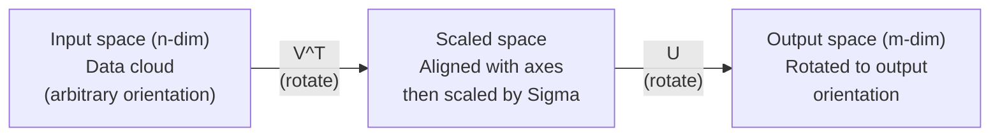
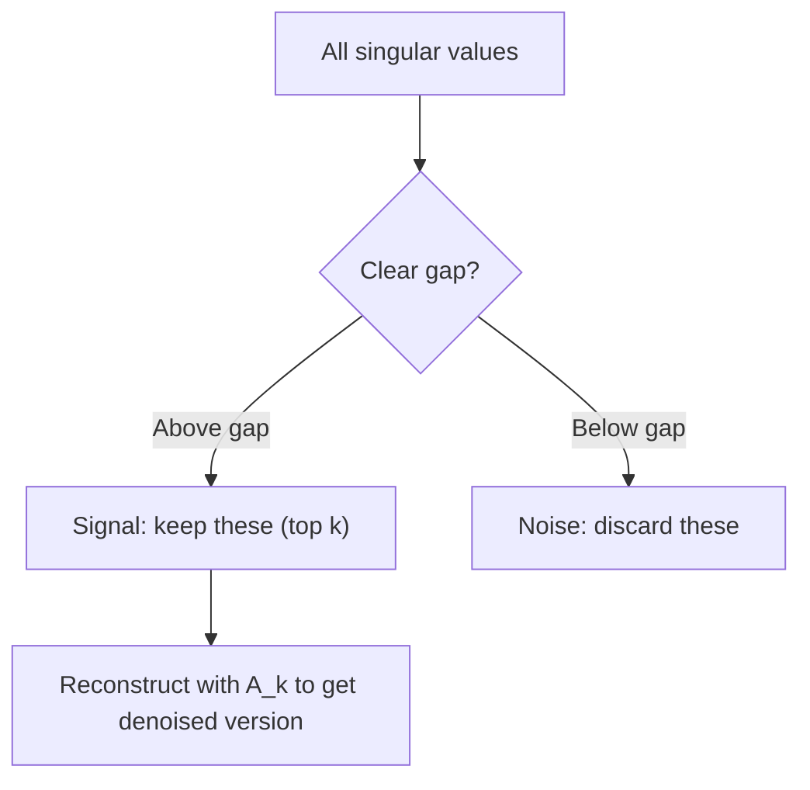

# Singular Value Decomposition

> SVD هو سكين الجيش السويسري للجبر الخطي. كل مصفوفة لديها واحدة. كل عالم بيانات يحتاج إلى واحد.

**النوع:** بناء
** اللغات: ** بايثون، جوليا
**المتطلبات:** المرحلة الأولى، الدروس 01 (حدس الجبر الخطي)، 02 (عمليات المتجهات والمصفوفات)، 03 (تحويلات المصفوفات)
**الوقت:** ~120 دقيقة

## Learning Objectives

- تنفيذ SVD عبر تكرار الطاقة وشرح المعنى الهندسي لـ U وSigma وV^T
- تطبيق SVD مقطوعًا لضغط الصورة وقياس نسبة الضغط مقابل خطأ إعادة البناء
- حساب معكوس مور-بنروز الزائف عبر SVD لحل أنظمة المربعات الصغرى المحددة بشكل مفرط
- ربط SVD بـ PCA وأنظمة التوصية (العوامل الكامنة) والتحليل الدلالي الكامن في NLP

## The Problem

لديك مصفوفة 1000x2000. ربما هو تقييمات الفيلم المستخدم. ربما يكون جدول تكراري لمصطلح الوثيقة. ربما تكون قيم البكسل للصورة. تحتاج إلى ضغطها، أو تقليل الضوضاء فيها، أو العثور على بنية مخفية فيها، أو حل نظام المربعات الصغرى بها. يعمل التركيب الذاتي فقط على المصفوفات المربعة. وحتى في هذه الحالة، يتطلب الأمر أن تحتوي المصفوفة على مجموعة كاملة من المتجهات الذاتية المستقلة خطيًا.

SVD يعمل على أي مصفوفة. أي شكل. أي رتبة. لا توجد شروط. إنه يحلل المصفوفة إلى ثلاثة عوامل تكشف عن هندسة ما تفعله المصفوفة بالفضاء. إنه التحليل الأكثر عمومية والأكثر فائدة في جميع الجبر الخطي.

## The Concept

### What SVD does geometrically

تقوم كل مصفوفة، بغض النظر عن شكلها، بتنفيذ ثلاث عمليات متتالية: التدوير، والقياس، والتدوير. SVD makeهل هذا التحلل صريح.

```
A = U * Sigma * V^T

      m x n     m x m    m x n    n x n
     (any)    (rotate)  (scale)  (rotate)
```

بالنظر إلى أي مصفوفة A، يقوم SVD بتحليلها إلى:
- يقوم V^T بتدوير المتجهات في مساحة الإدخال (الأبعاد n)
- مقاييس سيجما على طول كل محور (تمتد أو تضغط)
- يقوم U بتدوير النتيجة في مساحة الإخراج (الأبعاد m)



فكر في الأمر بهذه الطريقة. قمت بتسليم SVD مصفوفة. يخبرك: "تأخذ هذه المصفوفة كرة من المدخلات، وتقوم بتدويرها أولاً بواسطة V^T، ثم تمدها إلى شكل إهليلجي بواسطة Sigma، ثم تقوم بتدوير الشكل الإهليلجي بواسطة U." القيم المفردة هي أطوال محاور الشكل الإهليلجي.

### The full decomposition

بالنسبة للمصفوفة A ذات الشكل m x n:

```
A = U * Sigma * V^T

where:
  U     is m x m, orthogonal (U^T U = I)
  Sigma is m x n, diagonal (singular values on the diagonal)
  V     is n x n, orthogonal (V^T V = I)

The singular values sigma_1 >= sigma_2 >= ... >= sigma_r > 0
where r = rank(A)
```

تسمى أعمدة U بالمتجهات المفردة اليسرى. تسمى أعمدة V بالمتجهات المفردة اليمنى. تسمى الإدخالات القطرية لـ Sigma بالقيم المفردة. وهي دائمًا غير سلبية ويتم فرزها بشكل تقليدي بترتيب تنازلي.

### Left singular vectors, singular values, right singular vectors

كل مكون من SVD له معنى هندسي مميز.

** المتجهات المفردة اليمنى (أعمدة V): ** تشكل أساسًا متعامدًا لمساحة الإدخال (R ^ n). إنها الاتجاهات في مساحة الإدخال التي تقوم المصفوفة بتعيينها للاتجاهات المتعامدة في مساحة الإخراج. فكر فيها على أنها نظام الإحداثيات الطبيعي للمجال.

**القيم المفردة (قطري سيجما):** هذه هي عوامل القياس. تخبرك القيمة المفردة i بمدى تمدد المصفوفة للمتجهات على طول المتجه المفرد الأيمن. القيمة المفردة صفر تعني أن المصفوفة تسحق هذا الاتجاه بالكامل.

** المتجهات المفردة اليسرى (أعمدة U): ** تشكل أساسًا متعامدًا لمساحة الإخراج (R^m). المتجه المفرد الأيسر i-th هو الاتجاه في مساحة الإخراج حيث يهبط المتجه المفرد الأيمن i-th (بعد القياس).

العلاقة بينهما:

```
A * v_i = sigma_i * u_i

The matrix A takes the i-th right singular vector v_i,
scales it by sigma_i, and maps it to the i-th left singular vector u_i.
```

يمنحك هذا صورة إحداثية تلو الأخرى لما تفعله أي مصفوفة.

### Outer product form

يمكن كتابة SVD كمجموع لمصفوفات الرتبة 1:

```
A = sigma_1 * u_1 * v_1^T + sigma_2 * u_2 * v_2^T + ... + sigma_r * u_r * v_r^T

Each term sigma_i * u_i * v_i^T is a rank-1 matrix (an outer product).
The full matrix is the sum of r such matrices, where r is the rank.
```

هذا النموذج هو أساس التقريب منخفض الرتبة. يضيف كل مصطلح طبقة واحدة من البنية. المصطلح الأول يجسد النمط الأكثر أهمية. والثاني يلتقط التالي الأكثر أهمية. وهكذا. يمنحك اقتطاع هذا المبلغ أفضل تقدير تقريبي ممكن في أي رتبة معينة.

```
Rank-1 approx:    A_1 = sigma_1 * u_1 * v_1^T
                  (captures the dominant pattern)

Rank-2 approx:    A_2 = sigma_1 * u_1 * v_1^T + sigma_2 * u_2 * v_2^T
                  (captures the two most important patterns)

Rank-k approx:    A_k = sum of top k terms
                  (optimal by the Eckart-Young theorem)
```

### Relationship to eigendecomposition

SVD والتحلل الذاتي مرتبطان بعمق. القيم المفردة والمتجهات لـ A تأتي مباشرة من القيم الذاتية والمتجهات الذاتية لـ A^T A وA A^T.

```
A^T A = V * Sigma^T * U^T * U * Sigma * V^T
      = V * Sigma^T * Sigma * V^T
      = V * D * V^T

where D = Sigma^T * Sigma is a diagonal matrix with sigma_i^2 on the diagonal.

So:
- The right singular vectors (V) are eigenvectors of A^T A
- The singular values squared (sigma_i^2) are eigenvalues of A^T A

Similarly:
A A^T = U * Sigma * V^T * V * Sigma^T * U^T
      = U * Sigma * Sigma^T * U^T

So:
- The left singular vectors (U) are eigenvectors of A A^T
- The eigenvalues of A A^T are also sigma_i^2
```

يخبرك هذا الاتصال بثلاثة أشياء:
1. القيم المفردة تكون دائمًا حقيقية وغير سالبة (وهي جذور تربيعية للقيم الذاتية لمصفوفة موجبة شبه محددة).
2. يمكنك حساب SVD عبر التحليل الذاتي لـ A^T A، ولكن هذا يؤدي إلى تربيع رقم الشرط ويفقد الدقة العددية. خوارزميات SVD مخصصة تتجنب ذلك.
3. عندما يكون A مربعًا ومتماثلًا إيجابيًا شبه محدد، SVD والتحلل الذاتي هما نفس الشيء.

### Truncated SVD: low-rank approximation

تنص نظرية إيكارت-يونغ-ميرسكي على أن أفضل تقريب للرتبة k لـ A (في كل من Frobenius والقاعدة الطيفية) يتم الحصول عليه عن طريق الاحتفاظ فقط بالقيم المفردة العليا وناقلاتها المقابلة:

```
A_k = U_k * Sigma_k * V_k^T

where:
  U_k     is m x k  (first k columns of U)
  Sigma_k is k x k  (top-left k x k block of Sigma)
  V_k     is n x k  (first k columns of V)

Approximation error = sigma_{k+1}  (in spectral norm)
                    = sqrt(sigma_{k+1}^2 + ... + sigma_r^2)  (in Frobenius norm)
```

وهذا ليس مجرد تقريب "جيد". من المؤكد أنه أفضل تقريب ممكن للرتبة k. لا توجد مصفوفة أخرى من الرتبة k أقرب إلى A.

| مكون | الحجم النسبي | أبقى في المرتبة 3 تقريبا؟ |
|-----------|-------------------|-----------------------|
| سيجما_1 | الأكبر | نعم |
| سيجما_2 | كبير | نعم |
| سيجما_3 | متوسطة كبيرة | نعم |
| سيجما_4 | متوسطة | لا (خطأ) |
| سيجما_5 | متوسطة صغيرة | لا (خطأ) |
| سيجما_6 | صغير | لا (خطأ) |
| سيجما_7 | صغير جدًا | لا (خطأ) |
| سيجما_8 | صغير | لا (خطأ) |

احتفظ بالأعلى 3: A_3 يلتقط أكبر ثلاث قيم فردية. خطأ = القيم المتبقية (sigma_4 إلى sigma_8).

إذا كانت القيم المفردة تتحلل بسرعة، فإن k صغير يلتقط معظم المصفوفة. إذا كانت تتحلل ببطء، فلن يكون للمصفوفة بنية منخفضة الرتبة.

### Image compression with SVD

الصورة ذات التدرج الرمادي هي مصفوفة لشدة البكسل. تحتوي الصورة مقاس 800 × 600 على 480.000 قيمة. SVD يتيح لك تقريبه بعدد أقل بكثير.

```
Original image: 800 x 600 = 480,000 values

SVD with rank k:
  U_k:      800 x k values
  Sigma_k:  k values
  V_k:      600 x k values
  Total:    k * (800 + 600 + 1) = k * 1401 values

  k=10:   14,010 values   (2.9% of original)
  k=50:   70,050 values  (14.6% of original)
  k=100: 140,100 values  (29.2% of original)

  The compression ratio improves as k gets smaller,
  but visual quality degrades.
```

الفكرة الرئيسية: الصور الطبيعية لها قيم مفردة تتحلل بسرعة. تلتقط القيم الفردية القليلة الأولى البنية العريضة (الأشكال والتدرجات). تلتقط الأحدث التفاصيل الدقيقة والضوضاء. يؤدي الاقتطاع في المرتبة 50 غالبًا إلى إنتاج صورة تبدو مطابقة تقريبًا للصورة الأصلية مع استخدام مساحة تخزين أقل بنسبة 85%.

### SVD for recommendation systems

جائزة Netflix جعلت هذا مشهورًا. لديك مصفوفة تصنيفات أفلام المستخدم حيث تكون معظم الإدخالات مفقودة.

```
             Movie1  Movie2  Movie3  Movie4  Movie5
  User1      [  5      ?       3       ?       1  ]
  User2      [  ?      4       ?       2       ?  ]
  User3      [  3      ?       5       ?       ?  ]
  User4      [  ?      ?       ?       4       3  ]

  ? = unknown rating
```

الفكرة: مصفوفة التصنيفات هذه ذات رتبة منخفضة. ليس لدى المستخدمين أذواق مستقلة تمامًا. هناك عدد قليل من العوامل الكامنة (الحركة مقابل الدراما، القديم مقابل الجديد، الدماغي مقابل الحشوي) التي تفسر معظم التفضيلات.

SVD في مصفوفة التقييمات (المملوءة) تتحلل إلى:
- U: ملفات تعريف المستخدمين في مساحة العامل الكامن
- سيجما: أهمية كل عامل كامن
- V^T: ملفات تعريف الفيلم في مساحة العامل الكامن

التقييم المتوقع للمستخدم للفيلم هو المنتج النقطي لملف تعريف المستخدم الخاص به مع ملف تعريف الفيلم (مرجح بقيم فردية). يقوم التقريب ذو الرتبة المنخفضة بملء الإدخالات المفقودة.

من الناحية العملية، يمكنك استخدام متغيرات مثل Simon Funk التزايدي SVD أو ALS (المربعات الصغرى البديلة) التي تتعامل مع البيانات المفقودة مباشرة. لكن الفكرة الأساسية هي نفسها: تحليل العامل الكامن عبر SVD.

### SVD in NLP: Latent Semantic Analysis

التحليل الدلالي الكامن (LSA)، والذي يُسمى أيضًا الفهرسة الدلالية الكامنة (LSI)، ينطبق SVD على مصفوفة مستند المصطلح.

```
             Doc1   Doc2   Doc3   Doc4
  "cat"      [  3      0      1      0  ]
  "dog"      [  2      0      0      1  ]
  "fish"     [  0      4      1      0  ]
  "pet"      [  1      1      1      1  ]
  "ocean"    [  0      3      0      0  ]

After SVD with rank k=2:

  Each document becomes a point in 2D "concept space."
  Each term becomes a point in the same 2D space.
  Documents about similar topics cluster together.
  Terms with similar meanings cluster together.

  "cat" and "dog" end up near each other (land pets).
  "fish" and "ocean" end up near each other (water concepts).
  Doc1 and Doc3 cluster if they share similar topics.
```

كانت LSA واحدة من أولى الطرق الناجحة لالتقاط التشابه الدلالي من النص الخام. إنه يعمل لأن المصطلحات المترادفة تميل إلى الظهور في المستندات المتشابهة، لذلك يقوم SVD بتجميعها في نفس الأبعاد الكامنة. يمكن اعتبار تضمينات الكلمات الحديثة (Word2Vec، GloVe) من نسل هذه الفكرة.

### SVD for noise reduction

تحتوي البيانات الصاخبة على إشارة مركزة في القيم المفردة العليا وتنتشر الضوضاء عبر جميع القيم المفردة. اقتطاع يزيل أرضية الضوضاء.

** القيم المفردة للإشارة النظيفة: **

| مكون | الحجم | اكتب |
|-----------|-----------|------|
| سيجما_1 | كبير جدًا | إشارة |
| سيجما_2 | كبير | إشارة |
| سيجما_3 | متوسطة | إشارة |
| سيجما_4 | بالقرب من الصفر | لا يذكر |
| سيجما_5 | بالقرب من الصفر | لا يذكر |

**القيم المفردة للإشارة المزعجة (يضاف الضجيج إلى الكل):**

| مكون | الحجم | اكتب |
|-----------|-----------|------|
| سيجما_1 | كبير جدًا | إشارة |
| سيجما_2 | كبير | إشارة |
| سيجما_3 | متوسطة | إشارة |
| سيجما_4 | صغير | الضوضاء |
| سيجما_5 | صغير | الضوضاء |
| سيجما_6 | صغير | الضوضاء |
| سيجما_7 | صغير | الضوضاء |



ويستخدم هذا في معالجة الإشارات والقياس العلمي وتنظيف البيانات. في أي وقت يكون لديك مصفوفة تالفة بسبب الضوضاء المضافة، فإن SVD المقطوعة هي طريقة مبدئية لفصل الإشارة عن الضوضاء.

### Pseudoinverse via SVD

يعمم معكوس مور-بنروز الزائف A+ انعكاس المصفوفة على المصفوفات غير المربعة والمفردة. SVD makes حسابها تافهة.

```
If A = U * Sigma * V^T, then:

A+ = V * Sigma+ * U^T

where Sigma+ is formed by:
  1. Transpose Sigma (swap rows and columns)
  2. Replace each non-zero diagonal entry sigma_i with 1/sigma_i
  3. Leave zeros as zeros

For A (m x n):      A+ is (n x m)
For Sigma (m x n):  Sigma+ is (n x m)
```

العكس الزائف يحل مسائل المربعات الصغرى. إذا لم يكن لدى Ax = b حل دقيق (نظام محدد بشكل زائد)، فإن x = A+ b هو حل المربعات الصغرى (تصغير ||Ax - b||).

```
Overdetermined system (more equations than unknowns):

  [1  1]         [3]
  [2  1] x   =   [5]       No exact solution exists.
  [3  1]         [6]

  x_ls = A+ b = V * Sigma+ * U^T * b

  This gives the x that minimizes the sum of squared residuals.
  Same result as the normal equations (A^T A)^(-1) A^T b,
  but numerically more stable.
```

### Numerical stability advantages

يؤدي حساب التحلل الذاتي لـ A^T A إلى تربيع القيم المفردة (القيم الذاتية لـ A^T A هي sigma_i^2). يؤدي هذا إلى تربيع رقم الشرط، مما يؤدي إلى تضخيم الأخطاء الرقمية.

```
Example:
  A has singular values [1000, 1, 0.001]
  Condition number of A: 1000 / 0.001 = 10^6

  A^T A has eigenvalues [10^6, 1, 10^{-6}]
  Condition number of A^T A: 10^6 / 10^{-6} = 10^{12}

  Computing SVD directly: works with condition number 10^6
  Computing via A^T A:     works with condition number 10^{12}
                           (6 extra digits of precision lost)
```

تعمل خوارزميات SVD الحديثة (تحديد قطر Golub-Kahan) مباشرة على A، ولا تشكل A^T A أبدًا. ولهذا السبب يجب عليك دائمًا تفضيل `np.linalg.svd(A)` على `np.linalg.eig(A.T @ A)`.

### Connection to PCA

PCA IS SVD على البيانات المركزية. هذا ليس تشبيه. وهو حرفيا نفس الحساب.

```
Given data matrix X (n_samples x n_features), centered (mean subtracted):

Covariance matrix: C = (1/(n-1)) * X^T X

PCA finds eigenvectors of C. But:

  X = U * Sigma * V^T    (SVD of X)

  X^T X = V * Sigma^2 * V^T

  C = (1/(n-1)) * V * Sigma^2 * V^T

So the principal components are exactly the right singular vectors V.
The explained variance for each component is sigma_i^2 / (n-1).

In sklearn, PCA is implemented using SVD, not eigendecomposition.
It is faster and more numerically stable.
```

هذا يعني أن كل ما تعلمته حول تقليل الأبعاد في الدرس 10 هو SVD تحت الغطاء. PCA هو التطبيق الأكثر شيوعًا لـ SVD في التعلم الآلي.

## Build It

### Step 1: SVD from scratch using power iteration

الفكرة: للعثور على أكبر قيمة مفردة ومتجهاتها، استخدم تكرار الطاقة على A^T A (أو A A^T). ثم أفرغ المصفوفة وكرر ذلك للقيمة المفردة التالية.

```python
import numpy as np

def power_iteration(M, num_iters=100):
    n = M.shape[1]
    v = np.random.randn(n)
    v = v / np.linalg.norm(v)

    for _ in range(num_iters):
        Mv = M @ v
        v = Mv / np.linalg.norm(Mv)

    eigenvalue = v @ M @ v
    return eigenvalue, v

def svd_from_scratch(A, k=None):
    m, n = A.shape
    if k is None:
        k = min(m, n)

    sigmas = []
    us = []
    vs = []

    A_residual = A.copy().astype(float)

    for _ in range(k):
        AtA = A_residual.T @ A_residual
        eigenvalue, v = power_iteration(AtA, num_iters=200)

        if eigenvalue < 1e-10:
            break

        sigma = np.sqrt(eigenvalue)
        u = A_residual @ v / sigma

        sigmas.append(sigma)
        us.append(u)
        vs.append(v)

        A_residual = A_residual - sigma * np.outer(u, v)

    U = np.column_stack(us) if us else np.empty((m, 0))
    S = np.array(sigmas)
    V = np.column_stack(vs) if vs else np.empty((n, 0))

    return U, S, V
```

### Step 2: Test and compare with NumPy

```python
np.random.seed(42)
A = np.random.randn(5, 4)

U_ours, S_ours, V_ours = svd_from_scratch(A)
U_np, S_np, Vt_np = np.linalg.svd(A, full_matrices=False)

print("Our singular values:", np.round(S_ours, 4))
print("NumPy singular values:", np.round(S_np, 4))

A_reconstructed = U_ours @ np.diag(S_ours) @ V_ours.T
print(f"Reconstruction error: {np.linalg.norm(A - A_reconstructed):.8f}")
```

### Step 3: Image compression demo

```python
def compress_image_svd(image_matrix, k):
    U, S, Vt = np.linalg.svd(image_matrix, full_matrices=False)
    compressed = U[:, :k] @ np.diag(S[:k]) @ Vt[:k, :]
    return compressed

image = np.random.seed(42)
rows, cols = 200, 300
image = np.random.randn(rows, cols)

for k in [1, 5, 10, 20, 50]:
    compressed = compress_image_svd(image, k)
    error = np.linalg.norm(image - compressed) / np.linalg.norm(image)
    original_size = rows * cols
    compressed_size = k * (rows + cols + 1)
    ratio = compressed_size / original_size
    print(f"k={k:>3d}  error={error:.4f}  storage={ratio:.1%}")
```

### Step 4: Noise reduction

```python
np.random.seed(42)
clean = np.outer(np.sin(np.linspace(0, 4*np.pi, 100)),
                 np.cos(np.linspace(0, 2*np.pi, 80)))
noise = 0.3 * np.random.randn(100, 80)
noisy = clean + noise

U, S, Vt = np.linalg.svd(noisy, full_matrices=False)
denoised = U[:, :5] @ np.diag(S[:5]) @ Vt[:5, :]

print(f"Noisy error:    {np.linalg.norm(noisy - clean):.4f}")
print(f"Denoised error: {np.linalg.norm(denoised - clean):.4f}")
print(f"Improvement:    {(1 - np.linalg.norm(denoised - clean) / np.linalg.norm(noisy - clean)):.1%}")
```

### Step 5: Pseudoinverse

```python
A = np.array([[1, 1], [2, 1], [3, 1]], dtype=float)
b = np.array([3, 5, 6], dtype=float)

U, S, Vt = np.linalg.svd(A, full_matrices=False)
S_inv = np.diag(1.0 / S)
A_pinv = Vt.T @ S_inv @ U.T

x_svd = A_pinv @ b
x_lstsq = np.linalg.lstsq(A, b, rcond=None)[0]
x_pinv = np.linalg.pinv(A) @ b

print(f"SVD pseudoinverse solution:  {x_svd}")
print(f"np.linalg.lstsq solution:   {x_lstsq}")
print(f"np.linalg.pinv solution:    {x_pinv}")
```

## Use It

عروض العمل الكاملة موجودة في `code/svd.py`. قم بتشغيله لترى SVD مطبقًا على ضغط الصور وأنظمة التوصية والتحليل الدلالي الكامن وتقليل الضوضاء.

```bash
python svd.py
```

يوضح إصدار Julia في `code/svd.jl` نفس المفاهيم باستخدام دالة `svd()` الأصلية وحزمة `LinearAlgebra` الخاصة بـ Julia.

```bash
julia svd.jl
```

## Ship It

ينتج هذا الدرس:
- `outputs/skill-svd.md` - مهارة معرفة متى وكيف يتم تطبيق SVD في المشاريع الحقيقية

## Exercises

1. تنفيذ SVD كاملاً من الصفر دون استخدام تكرار الطاقة. بدلاً من ذلك، احسب التركيب الذاتي لـ A^T A للحصول على V والقيم المفردة، ثم احسب U = A V Sigma^{-1}. قارن الدقة العددية مع إصدار تكرار الطاقة الخاص بك ومع NumPy.

2. قم بتحميل صورة ذات تدرج رمادي حقيقي (أو قم بتحويلها إلى تدرج رمادي). قم بضغطها في الرتب 1، 5، 10، 25، 50، 100. لكل رتبة، احسب نسبة الضغط والخطأ النسبي. ابحث عن الترتيب الذي تصبح فيه الصورة مقبولة بصريًا.

3. قم ببناء نظام توصيات صغير. قم بإنشاء مصفوفة تصنيفات أفلام المستخدم مقاس 10 × 8 مع بعض الإدخالات المعروفة. املأ الإدخالات المفقودة بوسائل الصف. احسب SVD وأعد بناء التقريب من المرتبة 3. استخدم المصفوفة المعاد بناؤها للتنبؤ بالتقييمات المفقودة. التحقق من أن التوقعات معقولة.

4. قم بإنشاء مصفوفة مصطلحات مستندية مقاس 100 × 50 تحتوي على 3 موضوعات تركيبية. كل موضوع له 5 مصطلحات مرتبطة به. أضف الضوضاء. قم بتطبيق SVD وتحقق من أن القيم الفردية الثلاثة الأولى أكبر بكثير من الباقي. قم بعرض المستندات في المساحة الكامنة ثلاثية الأبعاد وتحقق من المستندات من نفس مجموعة المواضيع معًا.

5. قم بإنشاء مصفوفة نظيفة منخفضة الرتبة (المرتبة 3، الحجم 50 × 40) وأضف ضوضاء غاوسية على مستويات مختلفة (سيجما = 0.1، 0.5، 1.0، 2.0). لكل مستوى من مستويات الضوضاء، ابحث عن رتبة الاقتطاع الأمثل عن طريق مسح k من 1 إلى 40 وقياس خطأ إعادة البناء مقابل المصفوفة النظيفة. ارسم كيف يتغير k الأمثل مع مستوى الضوضاء.

## Key Terms

| مصطلح | ماذا يقول الناس | ماذا يعني في الواقع |
|------|----------------|----------------------|
| SVD | "تحليل أي مصفوفة" | قم بتحليل A إلى U Sigma V^T حيث يكون U وV متعامدين ويكون Sigma قطريًا مع إدخالات غير سالبة. يعمل مع أي مصفوفة من أي شكل. |
| القيمة المفردة | "ما مدى أهمية هذا المكون" | الإدخال القطري الأول لـ Sigma. يقيس مدى تمدد المصفوفة على طول الاتجاه الرئيسي i. دائمًا غير سلبي، ومرتبة بترتيب تنازلي. |
| ناقل المفرد الأيسر | "اتجاه الإخراج" | عمود من U. الاتجاه في مساحة الإخراج الذي يعينه المتجه المفرد الأيمن i (بعد القياس بواسطة sigma_i). |
| المتجه المفرد الأيمن | "اتجاه الإدخال" | عمود من V. الاتجاه في مساحة الإدخال الذي تعينه المصفوفة إلى المتجه المفرد الأيسر i (بعد القياس بواسطة sigma_i). |
| مبتورة SVD | "تقريب الرتبة المنخفضة" | احتفظ فقط بالقيم المفردة العليا ومتجهاتها. تنتج أفضل تقريب رتبة k للمصفوفة الأصلية (نظرية إيكارت-يونغ). |
| الرتبة | "الأبعاد الحقيقية" | عدد القيم المفردة غير الصفرية. يخبرك بعدد الاتجاهات المستقلة التي تستخدمها المصفوفة بالفعل. |
| معكوس زائف | "معكوس معمم" | V سيجما+ U^T. يعكس القيم المفردة غير الصفرية، ويترك الأصفار كأصفار. يحل مسائل المربعات الصغرى للمصفوفات غير المربعة أو المفردة. |
| رقم الحالة | "مدى حساسية الأخطاء" | سيجما_ماكس / سيجما_مين. رقم الحالة الكبير يعني أن التغييرات الصغيرة في المدخلات تؤدي إلى تغييرات كبيرة في المخرجات. SVD يكشف ذلك مباشرة. |
| العامل الكامن | "المتغير المخفي" | بُعد في المساحة ذات الرتبة المنخفضة اكتشفه SVD. في التوصيات، قد يتوافق العامل الكامن مع تفضيل النوع. في NLP، قد يتوافق مع موضوع ما. |
| قاعدة فروبينيوس | "إجمالي حجم المصفوفة" | الجذر التربيعي لمجموع الإدخالات التربيعية. يساوي الجذر التربيعي لمجموع القيم المفردة التربيعية. تستخدم لقياس خطأ التقريب. |
| نظرية إيكارت يونغ | "SVD يعطي أفضل ضغط" | بالنسبة لأي رتبة مستهدفة k، فإن SVD المبتورة تقلل من خطأ التقريب على جميع مصفوفات الرتبة k الممكنة. |
| تكرار الطاقة | "ابحث عن أكبر ناقل ذاتي" | قم بضرب ناقل عشوائي بالمصفوفة بشكل متكرر ثم قم بالتطبيع. يتقارب مع المتجه الذاتي ذو القيمة الذاتية الأكبر. اللبنة الأساسية للعديد من خوارزميات SVD. |

## Further Reading

- [جيلبرت سترانج: الجبر الخطي وتطبيقاته، الفصل السابع](https://math.mit.edu/~gs/linearalgebra/) - معالجة شاملة لـ SVD مع التطبيقات
- [3Blue1Brown: ولكن ما هو SVD؟](https://www.youtube.com/watch?v=vSczTbgc8Rc) - الحدس الهندسي لـ SVD
- [نوصي بتحليل القيمة المفردة](https://www.ams.org/publicoutreach/feature-column/fcarc-svd) - نظرة عامة يمكن الوصول إليها من الجمعية الرياضية الأمريكية
- [جائزة Netflix وعامل الماتريكس](https://sifter.org/~simon/journal/20061211.html) - منشور المدونة الأصلي لـ Simon Funk على SVD للتوصيات
- [التحليل الدلالي الكامن](https://en.wikipedia.org/wiki/Latent_semantic_analysis) - تطبيق NLP الأصلي لـ SVD
- [الجبر الخطي العددي لتريفيثين وباو](https://people.maths.ox.ac.uk/trefethen/text.html) - المعيار الذهبي لفهم خوارزميات SVD وخصائصها العددية
