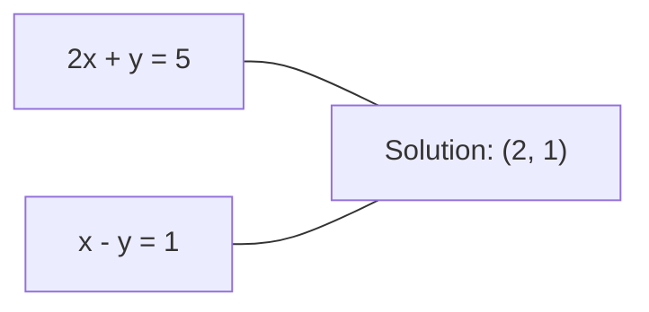
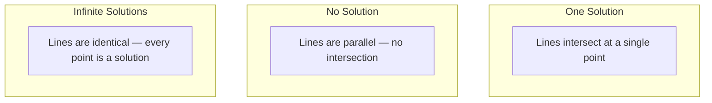

# Linear Systems

> حل Ax = b هي أقدم مشكلة في الرياضيات والتي لا تزال تدير شبكتك العصبية.

**النوع:** بناء
** اللغة: ** بايثون
**المتطلبات:** المرحلة الأولى، الدروس 01 (حدس الجبر الخطي)، 02 (المتجهات والمصفوفات)، 03 (تحويلات المصفوفات)
**الوقت:** ~120 دقيقة

## Learning Objectives

- حل الفأس = ب باستخدام الحذف الغاوسي مع التمحور الجزئي والاستبدال الخلفي
- مصفوفات العوامل مع LU، QR، وتحلل تشوليسكي وشرح متى يكون كل منها مناسبًا
- اشتقاق المعادلات العادية للمربعات الصغرى وربطها بالانحدار الخطي والانحداري
- تشخيص الأنظمة السيئة التكييف باستخدام رقم الحالة وتطبيق الضبط لتثبيتها

## The Problem

في كل مرة تقوم فيها بتدريب الانحدار الخطي، فإنك تحل نظامًا خطيًا. في كل مرة تقوم فيها بحساب تناسب المربعات الصغرى، فإنك تحل نظامًا خطيًا. في كل مرة تقوم فيها طبقة الشبكة العصبية بحساب `y = Wx + b`، فإنها تقوم بتقييم جانب واحد من النظام الخطي. عند إضافة التنظيم، يمكنك تعديل النظام. عند استخدام العمليات الغوسية، فإنك تقوم بتحليل المصفوفة. عندما تقوم بعكس مصفوفة التغاير لمسافة ماهالانوبي، فإنك تحل نظامًا خطيًا.

تظهر المعادلة Ax = b في كل مكان. A عبارة عن مصفوفة للمعاملات المعروفة. ب هو ناقل النواتج المعروفة. x هو متجه المجهول الذي تريد العثور عليه. في الانحدار الخطي، A هي مصفوفة البيانات، وb هو المتجه المستهدف، وx هو متجه الوزن. يتم تقليل النموذج بأكمله إلى: العثور على x بحيث يكون Ax أقرب إلى b قدر الإمكان.

يبني هذا الدرس كل الطرق الرئيسية لحل هذه المعادلة من الصفر. سوف تفهم لماذا تكون بعض الطرق سريعة والبعض الآخر مستقرًا، ولماذا يعمل بعضها فقط مع الأنظمة المربعة والبعض الآخر يتعامل مع الأنظمة المفرطة في التحديد، ولماذا يحدد الرقم الشرطي للمصفوفة ما إذا كانت إجابتك تعني أي شيء على الإطلاق.

## The Concept

### What Ax = b means geometrically

نظام المعادلات الخطية له تفسير هندسي. تحدد كل معادلة مستوى مفرطًا. الحل هو النقطة (أو مجموعة النقاط) التي تتقاطع فيها جميع المستويات الفائقة.

```
2x + y = 5          Two lines in 2D.
x - y  = 1          They intersect at x=2, y=1.
```



ثلاثة أشياء يمكن أن تحدث:



في شكل المصفوفة، "حل واحد" يعني أن A قابل للعكس. "لا يوجد حل" يعني أن النظام غير متناسق. "الحلول اللانهائية" تعني أن A بها مساحة فارغة. تقع معظم مشكلات ML ضمن فئة "لا يوجد حل دقيق" لأن لديك معادلات (نقاط بيانات) أكثر من المجهول (المعلمات). هذا هو المكان الذي تأتي فيه المربعات الصغرى.

### Column picture vs row picture

هناك طريقتان لقراءة Ax = b.

**صورة الصف.** يحدد كل صف من A معادلة واحدة. كل معادلة هي طائرة مفرطة. الحل هو حيث تتقاطع جميعها.

**صورة العمود.** كل عمود من A عبارة عن متجه. يصبح السؤال: ما هي المجموعة الخطية من أعمدة A التي تنتج b؟

```
A = | 2  1 |    b = | 5 |
    | 1 -1 |        | 1 |

Row picture: solve 2x + y = 5 and x - y = 1 simultaneously.

Column picture: find x1, x2 such that:
  x1 * [2, 1] + x2 * [1, -1] = [5, 1]
  2 * [2, 1] + 1 * [1, -1] = [4+1, 2-1] = [5, 1]   check.
```

صورة العمود أكثر جوهرية. إذا كان b يقع في مساحة العمود A، فإن النظام لديه الحل. إذا لم يكن b كذلك، فابحث عن أقرب نقطة في مساحة العمود. أقرب نقطة هي حل المربعات الصغرى.

### Gaussian elimination

يحول الحذف الغوسي Ax = b إلى نظام مثلثي علوي Ux = c والذي يمكنك حله عن طريق الاستبدال الخلفي. إنها الطريقة الأكثر مباشرة.

الخوارزمية:

```
1. For each column k (the pivot column):
   a. Find the largest entry in column k at or below row k (partial pivoting).
   b. Swap that row with row k.
   c. For each row i below k:
      - Compute multiplier m = A[i][k] / A[k][k]
      - Subtract m times row k from row i.
2. Back substitute: solve from the last equation upward.
```

Example:

```
Original:
| 2  1  1 | 8 |       R2 = R2 - (2)R1     | 2  1   1 |  8 |
| 4  3  3 |20 |  -->  R3 = R3 - (1)R1 --> | 0  1   1 |  4 |
| 2  3  1 |12 |                            | 0  2   0 |  4 |

                       R3 = R3 - (2)R2     | 2  1   1 |  8 |
                                       --> | 0  1   1 |  4 |
                                           | 0  0  -2 | -4 |

Back substitute:
  -2 * x3 = -4    -->  x3 = 2
  x2 + 2  = 4     -->  x2 = 2
  2*x1 + 2 + 2 = 8 --> x1 = 2
```

تكاليف الإزالة الغوسية عمليات O(n^3). بالنسبة لنظام 1000 × 1000، فهذا يعني حوالي مليار عملية فاصلة عائمة. سريع، ولكن يمكنك القيام بعمل أفضل إذا كنت بحاجة إلى حل أنظمة متعددة بنفس A.

### Partial pivoting: why it matters

بدون التمحور، يمكن أن يفشل الحذف الغاوسي أو ينتج عنه بيانات غير صحيحة. إذا كان العنصر المحوري صفرًا، يتم القسمة على صفر. إذا كانت صغيرة، فإنك تقوم بتضخيم أخطاء التقريب.

```
Bad pivot:                       With partial pivoting:
| 0.001  1 | 1.001 |            Swap rows first:
| 1      1 | 2     |            | 1      1 | 2     |
                                 | 0.001  1 | 1.001 |
m = 1/0.001 = 1000              m = 0.001/1 = 0.001
R2 = R2 - 1000*R1               R2 = R2 - 0.001*R1
| 0.001  1     | 1.001   |      | 1      1     | 2     |
| 0     -999   | -999.0  |      | 0      0.999 | 0.999 |

x2 = 1.000 (correct)            x2 = 1.000 (correct)
x1 = (1.001 - 1)/0.001          x1 = (2 - 1)/1 = 1.000 (correct)
   = 0.001/0.001 = 1.000        Stable because the multiplier is small.
```

في حساب الفاصلة العائمة بدقة محدودة، يمكن أن تفقد النسخة غير المحورية أرقامًا كبيرة. يؤدي التدوير الجزئي دائمًا إلى تحديد أكبر محور متاح لتقليل تضخيم الأخطاء.

### LU decomposition

LU عوامل التحلل A إلى مصفوفة مثلثية سفلية L ومصفوفة مثلثية عليا U: A = LU. تقوم المصفوفة L بتخزين المضاعفات من الحذف الغوسي. مصفوفة U هي نتيجة الإزالة.

```
A = L @ U

| 2  1  1 |   | 1  0  0 |   | 2  1   1 |
| 4  3  3 | = | 2  1  0 | @ | 0  1   1 |
| 2  3  1 |   | 1  2  1 |   | 0  0  -2 |
```

لماذا عامل بدلا من مجرد القضاء؟ لأنه بمجرد حصولك على L وU، فإن حل Ax = b لأي تكلفة b جديدة فقط O(n^2):

```
Ax = b
LUx = b
Let y = Ux:
  Ly = b    (forward substitution, O(n^2))
  Ux = y    (back substitution, O(n^2))
```

يتم دفع تكلفة O(n^3) مرة واحدة أثناء التخصيم. كل حل لاحق هو O(n^2). إذا كنت بحاجة إلى حل 1000 نظام باستخدام نفس المتجهات A لكن بمتجهات b مختلفة، فإن LU يوفر عامل 1000/3 في إجمالي العمل.

مع التمحور الجزئي، تحصل على PA = LU حيث P هي مصفوفة التقليب التي تسجل مبادلات الصف.

### QR decomposition

QR عوامل التحلل A إلى مصفوفة متعامدة Q ومصفوفة مثلثية علوية R: A = QR.

المصفوفة المتعامدة لها الخاصية Q^T Q = I. أعمدتها هي متجهات متعامدة. الضرب في Q يحافظ على الأطوال والزوايا.

```
A = Q @ R

Q has orthonormal columns: Q^T Q = I
R is upper triangular

To solve Ax = b:
  QRx = b
  Rx = Q^T b    (just multiply by Q^T, no inversion needed)
  Back substitute to get x.
```

QR أكثر استقرارًا عدديًا من LU لحل مسائل المربعات الصغرى. تقوم عملية جرام-شميت ببناء Q عمودًا بعمود:

```
Given columns a1, a2, ... of A:

q1 = a1 / ||a1||

q2 = a2 - (a2 . q1) * q1        (subtract projection onto q1)
q2 = q2 / ||q2||                (normalize)

q3 = a3 - (a3 . q1) * q1 - (a3 . q2) * q2
q3 = q3 / ||q3||

R[i][j] = qi . aj    for i <= j
```

تقوم كل خطوة بإزالة المكون على طول جميع متجهات q السابقة، مما يترك فقط الاتجاه المتعامد الجديد.

### Cholesky decomposition

عندما يكون A متماثلًا (A = A^T) ومحددًا موجبًا (جميع القيم الذاتية موجبة)، يمكنك تحليله على أنه A = L L^T حيث يكون L مثلثيًا سفليًا. هذا هو تحلل تشوليسكي.

```
A = L @ L^T

| 4  2 |   | 2  0 |   | 2  1 |
| 2  5 | = | 1  2 | @ | 0  2 |

L[i][i] = sqrt(A[i][i] - sum(L[i][k]^2 for k < i))
L[i][j] = (A[i][j] - sum(L[i][k]*L[j][k] for k < j)) / L[j][j]    for i > j
```

Cholesky أسرع بمرتين من LU ويتطلب نصف مساحة التخزين. إنه يعمل فقط مع المصفوفات الإيجابية المتماثلة والمحددة، ولكن تلك تظهر باستمرار:

- مصفوفات التغاير تكون متماثلة موجبة شبه محددة (موجبة محددة مع انتظام).
- مصفوفة النواة في العمليات الغوسية تكون متماثلة إيجابية محددة.
- إن هسي الدالة المحدبة عند الحد الأدنى تكون متماثلة إيجابية محددة.
- A^T A دائمًا موجب متماثل وشبه محدد.

في العمليات الغوسية، تقوم بتحليل مصفوفة النواة K مع Cholesky، ثم تقوم بحل K alpha = y للحصول على المتوسط ​​التنبؤي. يمنحك عامل Cholesky أيضًا محدد السجل للاحتمال الهامشي: log det(K) = 2 * sum(log(diag(L))).

### Least squares: when Ax = b has no exact solution

إذا كانت A هي m x n مع m > n (معادلات أكثر من المجهول)، فسيتم تحديد النظام بشكل زائد. لا يوجد حل دقيق. بدلاً من ذلك، يمكنك تقليل الخطأ التربيعي:

```
minimize ||Ax - b||^2

This is the sum of squared residuals:
  sum((A[i,:] @ x - b[i])^2 for i in range(m))
```

يفي المصغر بالمعادلات العادية:

```
A^T A x = A^T b
```

الاشتقاق:توسيع ||Ax - b||^2 = (Ax - b)^T (Ax - b) = x^T A^T A x - 2 x^T A^T b + b^T b. خذ التدرج بالنسبة لـ x، واضبطه على الصفر: 2 A^T A x - 2 A^T b = 0.

```
Original system (overdetermined, 4 equations, 2 unknowns):
| 1  1 |         | 3 |
| 1  2 | x     = | 5 |       No exact x satisfies all 4 equations.
| 1  3 |         | 6 |
| 1  4 |         | 8 |

Normal equations:
A^T A = | 4  10 |    A^T b = | 22 |
        | 10 30 |            | 63 |

Solve: x = [1.5, 1.7]

This is linear regression. x[0] is the intercept, x[1] is the slope.
```

### Normal equations = linear regression

الاتصال دقيق. في الانحدار الخطي، تحتوي مصفوفة البيانات X على صف واحد لكل عينة وعمود واحد لكل ميزة. يحتوي المتجه المستهدف y على إدخال واحد لكل عينة. ناقل الوزن ث يرضي:

```
X^T X w = X^T y
w = (X^T X)^(-1) X^T y
```

هذا هو الحل المغلق للانحدار الخطي. كل استدعاء لـ `sklearn.linear_model.LinearRegression.fit()` يحسب هذا (أو ما يعادله عبر QR أو SVD).

أضف مصطلح التنظيم lambda * I إلى المصفوفة وستحصل على انحدار التلال:

```
(X^T X + lambda * I) w = X^T y
w = (X^T X + lambda * I)^(-1) X^T y
```

التنظيم make يجعل المصفوفة مكيفة بشكل أفضل (أسهل في عكسها بدقة) ويمنع التجهيز الزائد عن طريق تقليص الأوزان نحو الصفر. المصفوفة X^T X + lambda * I تكون دائمًا موجبة متماثلة ومحددة عندما تكون lambda > 0، لذلك يمكنك استخدام Cholesky لحلها.

### Pseudoinverse (Moore-Penrose)

يعمم المعكوس الزائف A+ انعكاس المصفوفة على المصفوفات غير المربعة والمفردة. لأي مصفوفة A:

```
x = A+ b

where A+ = V Sigma+ U^T    (computed via SVD)
```

يتم تشكيل سيجما + عن طريق أخذ مقلوب كل قيمة مفردة غير صفرية ونقل النتيجة. إذا كان A = U سيجما V^T، فإن A+ = V سيجما+ U^T.

```
A = U Sigma V^T        (SVD)

Sigma = | 5  0 |       Sigma+ = | 1/5  0  0 |
        | 0  2 |                | 0  1/2  0 |
        | 0  0 |

A+ = V Sigma+ U^T
```

المعكوس الكاذب يعطي حل المربعات الصغرى ذو القاعدة الدنيا. إذا كان النظام لديه:
- حل واحد: A+b يعطيه.
- لا يوجد حل: A+ b يعطي حل المربعات الصغرى.
- الحلول اللانهائية: A+ b يعطي الحل الأصغر ||x||.

يستخدم كل من NumPy `np.linalg.lstsq` و `np.linalg.pinv` SVD داخليًا.

### Condition number

يقيس رقم الشرط مدى حساسية الحل للتغييرات الصغيرة في الإدخال. بالنسبة للمصفوفة A، رقم الشرط هو:

```
kappa(A) = ||A|| * ||A^(-1)|| = sigma_max / sigma_min
```

حيث sigma_max وsigma_min هما أكبر وأصغر القيم المفردة.

```
Well-conditioned (kappa ~ 1):        Ill-conditioned (kappa ~ 10^15):
Small change in b -->                Small change in b -->
small change in x                    huge change in x

| 2  0 |   kappa = 2/1 = 2          | 1   1          |   kappa ~ 10^15
| 0  1 |   safe to solve            | 1   1+10^(-15) |   solution is garbage
```

القواعد الأساسية:
- كابا < 100: حل آمن ودقيق.
- kappa ~ 10^k: تخسر حوالي k digits من الدقة من حساب الفاصلة العائمة.
- kappa ~ 10^16 (لـ float64): الحل لا معنى له. المصفوفة مفردة بشكل فعال.

في ML، يحدث التكييف السيئ عندما تكون الميزات على خط واحد تقريبًا. يؤدي التسوية (إضافة lambda * I) إلى تحسين رقم الحالة من sigma_max / sigma_min إلى (sigma_max + lambda) / (sigma_min + lambda).

### Iterative methods: conjugate gradient

بالنسبة للأنظمة المتفرقة الكبيرة جدًا (ملايين العناصر المجهولة)، تكون الطرق المباشرة مثل LU أو Cholesky باهظة الثمن. الأساليب التكرارية تقريبية للحل من خلال تحسين التخمين على العديد من التكرارات.

التدرج المترافق (CG) يحل Ax = b عندما يكون A إيجابيًا متماثلًا محددًا. يجد الحل الدقيق في التكرارات n على الأكثر (في الحساب الدقيق)، ولكنه عادةً ما يتقارب بشكل أسرع بكثير إذا تم تجميع القيم الذاتية لـ A.

```
Algorithm sketch:
  x0 = initial guess (often zero)
  r0 = b - A x0           (residual)
  p0 = r0                 (search direction)

  For k = 0, 1, 2, ...:
    alpha = (rk . rk) / (pk . A pk)
    x_{k+1} = xk + alpha * pk
    r_{k+1} = rk - alpha * A pk
    beta = (r_{k+1} . r_{k+1}) / (rk . rk)
    p_{k+1} = r_{k+1} + beta * pk
    if ||r_{k+1}|| < tolerance: stop
```

CG يستخدم في:
- التحسين على نطاق واسع (طريقة نيوتن-CG)
- حل PDE التقديرات
- طرق النواة حيث تكون مصفوفة النواة كبيرة جدًا بحيث لا يمكن تحليلها
- الشروط المسبقة للحلول التكرارية الأخرى

ويعتمد معدل التقارب على رقم الحالة. تتقارب الأنظمة المشروطة الأفضل بشكل أسرع، وهذا سبب آخر يساعد التنظيم.

### The full picture: which method when

| الطريقة | المتطلبات | التكلفة | حالة الاستخدام |
|--------|------------|------|----------|
| القضاء الغوسي | مربع، غير مفرد A | يا (ن ^ 3) | حل النظام المربع لمرة واحدة |
| LU التحلل | مربع، غير مفرد A | عامل O(n^3) + O(n^2) حل | حلول متعددة بنفس A |
| QR التحلل | أي أ (م >= ن) | يا (مليون ^ 2) | المربعات الصغرى، مستقرة عدديا |
| تشوليسكي | متماثل إيجابي محدد A | يا(ن^3/3) | مصفوفات التغاير، العمليات الغوسية، انحدار التلال |
| المعادلات العادية | مفرط التحديد (م > ن) | يا(من^2 + ن^3) | الانحدار الخطي (صغير ن) |
| SVD / معكوس زائف | أي أ | يا (مليون ^ 2) | أنظمة ذات قصور في الرتبة، حلول ذات معايير دنيا |
| التدرج المترافق | متماثل إيجابي واضح، متفرق A | يا (ن * ك * ننز) | الأنظمة المتفرقة الكبيرة، k = التكرارات |

### Connection to ML

تظهر كل طريقة في هذا الدرس في الإنتاج ML:

**الانحدار الخطي.** الحل المغلق يحل المعادلات العادية X^T X w = X^T y. يتم ذلك عبر Cholesky (إذا كان n صغيرًا) أو QR (إذا كان الاستقرار العددي مهمًا) أو SVD (إذا كانت المصفوفة ناقصة الترتيب).

**انحدار ريدج.** يضيف lambda * I إلى X^T X. النظام المنتظم (X^T X + lambda * I) w = X^T y قابل للحل دائمًا عبر Cholesky لأن X^T X + lambda * I هو إيجابي متماثل محدد لـ lambda > 0.

**العمليات الغوسية.** يتطلب الوسط التنبؤي حل K alpha = y حيث K هي مصفوفة النواة. إن تحليل Cholesky لـ K هو النهج القياسي. يستخدم الاحتمال الهامشي للسجل log det(K) = 2 sum(log(diag(L))).

**تهيئة الشبكة العصبية.** تستخدم التهيئة المتعامدة التحلل QR لإنشاء مصفوفات الوزن التي تكون أعمدتها متعامدة. وهذا يمنع انهيار الإشارة في الشبكات العميقة.

**الشروط المسبقة.** تستخدم أدوات التحسين واسعة النطاق Cholesky غير المكتمل أو LU غير المكتمل كشروط مسبقة لحلول التدرج المترافق.

**هندسة المعالم.** يخبرك رقم الشرط X^T X إذا كانت المعالم الخاصة بك على خط واحد. إذا كان kappa كبيرًا، قم بإسقاط الميزات أو إضافة التنظيم.

## Build It

### Step 1: Gaussian elimination with partial pivoting

```python
import numpy as np

def gaussian_elimination(A, b):
    n = len(b)
    Ab = np.hstack([A.astype(float), b.reshape(-1, 1).astype(float)])

    for k in range(n):
        max_row = k + np.argmax(np.abs(Ab[k:, k]))
        Ab[[k, max_row]] = Ab[[max_row, k]]

        if abs(Ab[k, k]) < 1e-12:
            raise ValueError(f"Matrix is singular or nearly singular at pivot {k}")

        for i in range(k + 1, n):
            m = Ab[i, k] / Ab[k, k]
            Ab[i, k:] -= m * Ab[k, k:]

    x = np.zeros(n)
    for i in range(n - 1, -1, -1):
        x[i] = (Ab[i, -1] - Ab[i, i+1:n] @ x[i+1:n]) / Ab[i, i]

    return x
```

### Step 2: LU decomposition

```python
def lu_decompose(A):
    n = A.shape[0]
    L = np.eye(n)
    U = A.astype(float).copy()
    P = np.eye(n)

    for k in range(n):
        max_row = k + np.argmax(np.abs(U[k:, k]))
        if max_row != k:
            U[[k, max_row]] = U[[max_row, k]]
            P[[k, max_row]] = P[[max_row, k]]
            if k > 0:
                L[[k, max_row], :k] = L[[max_row, k], :k]

        for i in range(k + 1, n):
            L[i, k] = U[i, k] / U[k, k]
            U[i, k:] -= L[i, k] * U[k, k:]

    return P, L, U

def lu_solve(P, L, U, b):
    n = len(b)
    Pb = P @ b.astype(float)

    y = np.zeros(n)
    for i in range(n):
        y[i] = Pb[i] - L[i, :i] @ y[:i]

    x = np.zeros(n)
    for i in range(n - 1, -1, -1):
        x[i] = (y[i] - U[i, i+1:] @ x[i+1:]) / U[i, i]

    return x
```

### Step 3: Cholesky decomposition

```python
def cholesky(A):
    n = A.shape[0]
    L = np.zeros_like(A, dtype=float)

    for i in range(n):
        for j in range(i + 1):
            s = A[i, j] - L[i, :j] @ L[j, :j]
            if i == j:
                if s <= 0:
                    raise ValueError("Matrix is not positive definite")
                L[i, j] = np.sqrt(s)
            else:
                L[i, j] = s / L[j, j]

    return L
```

### Step 4: Least squares via normal equations

```python
def least_squares_normal(A, b):
    AtA = A.T @ A
    Atb = A.T @ b
    return gaussian_elimination(AtA, Atb)

def ridge_regression(A, b, lam):
    n = A.shape[1]
    AtA = A.T @ A + lam * np.eye(n)
    Atb = A.T @ b
    L = cholesky(AtA)
    y = np.zeros(n)
    for i in range(n):
        y[i] = (Atb[i] - L[i, :i] @ y[:i]) / L[i, i]
    x = np.zeros(n)
    for i in range(n - 1, -1, -1):
        x[i] = (y[i] - L.T[i, i+1:] @ x[i+1:]) / L.T[i, i]
    return x
```

### Step 5: Condition number

```python
def condition_number(A):
    U, S, Vt = np.linalg.svd(A)
    return S[0] / S[-1]
```

## Use It

تجميع القطع معًا للانحدار الخطي وانحدار التلال على البيانات الحقيقية:

```python
np.random.seed(42)
X_raw = np.random.randn(100, 3)
w_true = np.array([2.0, -1.0, 0.5])
y = X_raw @ w_true + np.random.randn(100) * 0.1

X = np.column_stack([np.ones(100), X_raw])

w_ols = least_squares_normal(X, y)
print(f"OLS weights (ours):    {w_ols}")

w_np = np.linalg.lstsq(X, y, rcond=None)[0]
print(f"OLS weights (numpy):   {w_np}")
print(f"Max difference: {np.max(np.abs(w_ols - w_np)):.2e}")

w_ridge = ridge_regression(X, y, lam=1.0)
print(f"Ridge weights (ours):  {w_ridge}")

from sklearn.linear_model import Ridge
ridge_sk = Ridge(alpha=1.0, fit_intercept=False)
ridge_sk.fit(X, y)
print(f"Ridge weights (sklearn): {ridge_sk.coef_}")
```

## Ship It

ينتج هذا الدرس:
- `code/linear_systems.py` يحتوي على تطبيقات من الصفر للتخلص من Gaussian، وتحلل LU، وتحلل Cholesky، والمربعات الصغرى، وانحدار التلال
- عرض عملي أن المعادلات العادية والانحدار الخطي لـ sklearn تنتج نفس الأوزان

## Exercises

1. قم بحل النظام `[[1,2,3],[4,5,6],[7,8,10]] x = [6, 15, 27]` باستخدام الحذف الغاوسي، وحلال LU، و`np.linalg.solve`. تحقق من أن الثلاثة جميعًا يقدمون نفس الإجابة ضمن نطاق التسامح مع الفاصلة العائمة.

2. قم بإنشاء مصفوفة عشوائية 50x5 X والهدف y = X @ w_true + الضوضاء. قم بحل المعادلة w باستخدام المعادلات العادية، QR (عبر `np.linalg.qr`)، SVD (عبر `np.linalg.svd`)، و `np.linalg.lstsq`. قارن بين الحلول الأربعة. قم بقياس رقم الشرط X^T X واشرح كيفية تأثيره على الطريقة التي تثق بها.

3. قم بإنشاء مصفوفة مفردة تقريبًا عن طريق جعل عمودين متطابقين تقريبًا (على سبيل المثال، العمود 2 = العمود 1 + 1e-10 * الضوضاء). احسب رقم حالتها حل Ax = b مع وبدون تنظيم (أضف 0.01 * I). قارن بين الحلول والبقايا. اشرح لماذا يساعد التنظيم.

4. تنفيذ خوارزمية التدرج المترافق لمصفوفة محددة إيجابية متماثلة عشوائية 100x100. احسب عدد التكرارات اللازمة للتقارب مع التسامح 1e-8. قارن مع الحد الأقصى النظري للتكرارات n.

5. قم بقياس حل Cholesky الخاص بك مقابل حل LU الخاص بك مقابل `np.linalg.solve` على مصفوفات محددة إيجابية متماثلة ذات حجم 10، 50، 200، 500. ارسم النتائج. تحقق من أن Cholesky أسرع مرتين تقريبًا من LU.

## Key Terms

| مصطلح | ماذا يقول الناس | ماذا يعني في الواقع |
|------|----------------|----------------------|
| النظام الخطي | "حل من أجل x" | مجموعة من المعادلات الخطية الفأس = ب. العثور على x يعني العثور على المدخلات التي تنتج الإخراج b ضمن التحويل A. |
| القضاء الغوسي | "تقليل الصف" | قم بشكل منهجي بتصفية الإدخالات الموجودة أسفل القطر باستخدام عمليات الصف، مما ينتج عنه نظام مثلثي علوي قابل للحل عن طريق الاستبدال الخلفي. يا (ن ^ 3). |
| التمحور الجزئي | "تبديل الصفوف لتحقيق الاستقرار" | قبل الحذف في العمود k، قم بتبديل الصف الذي يحتوي على أكبر قيمة مطلقة في هذا العمود إلى الموضع المحوري. يمنع القسمة على أعداد صغيرة. |
| LU التحلل | "تحليل إلى مثلثات" | اكتب A = LU حيث L هو المثلث السفلي (يخزن المضاعفات) وU هو المثلث العلوي (المصفوفة المحذوفة). يستهلك تكلفة O(n^3) على حلول متعددة. |
| QR التحلل | "التحليل المتعامد" | اكتب A = QR حيث Q بها أعمدة متعامدة وR مثلث علوي. أكثر استقرارًا من LU للمربعات الصغرى. |
| التحلل الكوليسكي | "الجذر التربيعي للمصفوفة" | للحصول على موجب متماثل محدد A، اكتب A = LL^T. نصف تكلفة LU. يستخدم لمصفوفات التغاير ومصفوفات النواة وانحدار التلال. |
| المربعات الصغرى | "الأفضل عندما يكون الدقة مستحيلة" | قلل مجموع المربعات المتبقية ||Ax - b||^2 عندما يكون النظام محددًا بشكل زائد (معادلات أكثر من المجهول). |
| المعادلات العادية | "اختصار حساب التفاضل والتكامل" | أ^تي أ س = أ^تي ب. تعيين تدرج ||Ax - b||^2 إلى الصفر. هذا IS الحل المغلق للانحدار الخطي. |
| معكوس زائف | "العكس للمصفوفات غير المربعة" | A+ = V Sigma+ U^T عبر SVD. يعطي حل المربعات الصغرى الأدنى لأي مصفوفة، مربعة أو مستطيلة، مفردة أم لا. |
| رقم الحالة | "ما أوثق هذا الجواب" | كابا = sigma_max / sigma_min. يقيس الحساسية لاضطرابات الإدخال. تفقد حوالي log10(kappa) digits من الدقة. |
| ريدج الانحدار | "المربعات الصغرى المنتظمة" | حل (X^T X + لامدا I) ث = X^T y. تؤدي إضافة lambda I إلى تحسين التكييف وتقليص الأوزان نحو الصفر. يمنع الإفراط في التجهيز. |
| التدرج المترافق | "الفأس التكراري = ب للمصفوفات الكبيرة" | حلا تكراريا لأنظمة محددة إيجابية متماثلة. يتقارب في خطوات n على الأكثر. عملي للأنظمة الكبيرة المتفرقة حيث يكون التخصيم مكلفًا للغاية. |
| نظام مفرط التحديد | "بيانات أكثر من المعلمات" | m > n في نظام m-by-n. لا يوجد حل دقيق. المربعات الصغرى تجد أفضل تقريب. هذه هي كل مشكلة الانحدار. |
| تبديل خلفي | "الحل من الأسفل إلى الأعلى" | في حالة وجود نظام مثلث علوي، قم بحل المعادلة الأخيرة أولًا، ثم عوض للخلف. يا (ن ^ 2). |
| استبدال للأمام | "الحل من الأعلى إلى الأسفل" | في حالة وجود نظام مثلثي أدنى، حل المعادلة الأولى أولًا، ثم عوض للأمام. يا (ن ^ 2). يستخدم في الخطوة L من LU يحل. |

## Further Reading

- [MIT 18.06: Linear Algebra](https://ocw.mit.edu/courses/18-06-linear-algebra-spring-2010/) (Gilbert Strang) -- الدورة النهائية حول الأنظمة الخطية وعوامل المصفوفات
- [Numerical Linear Algebra](https://people.maths.ox.ac.uk/trefethen/text.html) (Trefethen & Bau)-- المرجع القياسي لفهم الاستقرار العددي والتكييف وسبب فشل الخوارزميات
- [Matrix Computations](https://www.cs.cornell.edu/cv/GolubVanLoan4/golubandvanloan.htm) (Golub & Van Loan)-- المرجع الموسوعي لكل خوارزمية مصفوفية
- [3Blue1Brown: المصفوفات العكسية](https://www.3blue1brown.com/lessons/inverse-matrices) -- الحدس البصري لما يعنيه حل Ax = b هندسيًا
