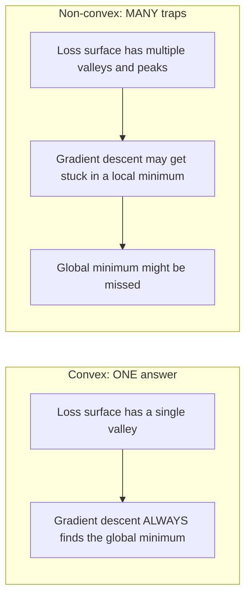
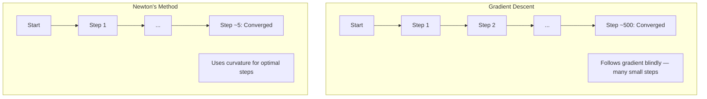
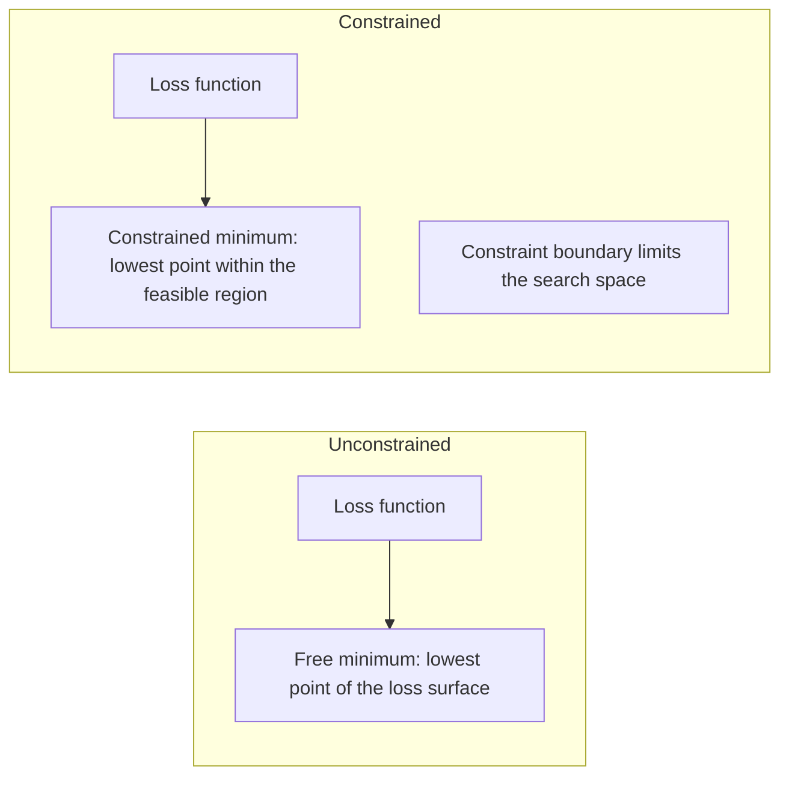
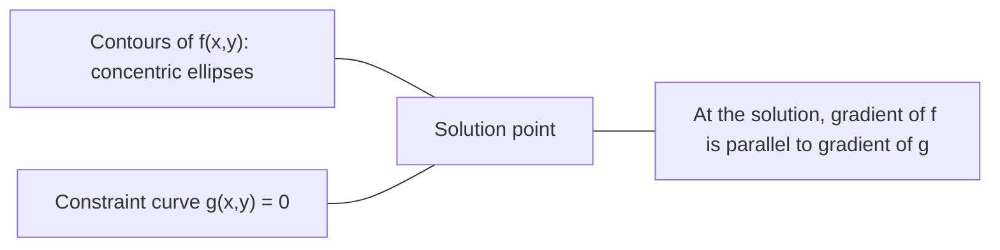

# محدب الأمثل
> المشاكل المحدبة لها واد واحد. الشبكات العصبية لديها الملايين. معرفة الفرق مهم.
**النوع:** بناء
** اللغة: ** بايثون
**المتطلبات الأساسية:** المرحلة الأولى، الدروس 04 (حساب التفاضل والتكامل لـ ML)، 08 (التحسين)
**الوقت:** ~90 دقيقة
## أهداف التعلم
- اختبار ما إذا كانت الدالة محدبة باستخدام التعريف والمشتقة الثانية ومعايير هسي
- تطبيق طريقة نيوتن ومقارنة تقاربها التربيعي مع نزول التدرج
- حل مشاكل التحسين المقيدة باستخدام مضاعفات لاغرانج وتفسير شروط KKT
- اشرح لماذا تكون مناظر فقدان الشبكة العصبية غير محدبة، ومع ذلك لا يزال SGD يجد حلولاً جيدة
## المشكلة
لقد علمك الدرس 08 النسب المتدرج والزخم وآدم. يمشي هؤلاء المحسنون على أي سطح. لكنها لا تأتي مع أي ضمانات. قد يهبط الهبوط المتدرج على منظر طبيعي غير محدب في حد أدنى محلي سيئ، أو يعلق عند نقطة سرج، أو يتأرجح إلى الأبد. لقد استخدمته على أي حال لأن الشبكات العصبية غير محدبة ولا يوجد بديل.
لكن العديد من المشاكل في التعلم الآلي محدبة. الانحدار الخطي، الانحدار اللوجستي، SVMs، LASSO، انحدار التلال. بالنسبة لهؤلاء، يوجد شيء أقوى: التحسين مع ضمانات رياضية. المشكلة المحدبة لها وادي واحد بالضبط. أي خوارزمية تتجه نحو الأسفل ستصل إلى الحد الأدنى العالمي. لا حاجة لإعادة التشغيل. لا توجد جداول معدل التعلم. لا صلاة.
فهم التحدب يفعل ثلاثة أشياء. أولاً، يخبرك عندما تكون مشكلتك سهلة (محدبة) مقابل صعبة (غير محدبة). ثانيًا، يمنحك أدوات أسرع مثل طريقة نيوتن للمسائل المحدبة. ثالثًا، يشرح المفاهيم التي تظهر خلال ML: التنظيم كقيد، والازدواجية في SVMs، ولماذا يعمل التعلم العميق على الرغم من انتهاك كل خاصية لطيفة توفرها لك.
##المفهوم
### مجموعات محدبة
تكون المجموعة S محدبة إذا كان المقطع المستقيم بينهما يقع بالكامل في S لأي نقطتين في S.
| مجموعات محدبة | غير محدب |
|---|---|
| **المستطيل**: يمكن توصيل أي نقطتين بداخله بقطعة مستقيمة تبقى بداخله | **شكل النجمة/الهلال**: يمكن أن يمر الخط بين نقطتين داخليتين خارج المجموعة |
| **المثلث**: نفس الخاصية تنطبق على جميع النقاط الداخلية | **الدائري/الحلقة**: الثقب يعني أن بعض أجزاء الخط تترك المجموعة |
| يبقى الجزء الخطي بين أي نقطتين ضمن المجموعة | الجزء الخطي الموجود بين بعض أزواج النقاط يخرج من المجموعة |
اختبار رسمي: لأي نقاط x وy في S وأي t في [0, 1]، فإن النقطة tx + (1-t)y موجودة أيضًا في S.
أمثلة على المجموعات المحدبة:
- خط، مستوى، كل R^n
- كرة (دائرة، كرة، كرة زائدة)
- مسافة نصفية: {x : a^T x <= b}
- تقاطع أي عدد من المجموعات المحدبة
أمثلة على المجموعات غير المحدبة:
- دونات (الحلقة)
- اتحاد دائرتين منفصلتين
- أي مجموعة بها "انبعاج" أو "ثقب"
### وظائف محدبة
تكون الدالة f محدبة إذا كان مجالها عبارة عن مجموعة محدبة ولأي نقطتين x، y في مجالها وأي t في [0، 1]:
```
f(tx + (1-t)y) <= t*f(x) + (1-t)*f(y)
```

هندسيًا: القطعة المستقيمة بين أي نقطتين على الرسم البياني تقع أعلى الرسم البياني أو عليه.
| عقار | وظيفة محدبة | وظيفة غير محدبة |
|---|---|---|
| **اختبار القطعة الخطية** | يقع الخط الفاصل بين أي نقطتين على الرسم البياني **أعلى أو على** المنحنى | الخط الفاصل بين بعض النقاط على الرسم البياني ينخفض ​​**تحت** المنحنى |
| **الشكل** | وعاء واحد/وادي منحني للأعلى | قمم ووديان متعددة ذات انحناءات مختلطة |
| **الحد الأدنى المحلي** | كل حد أدنى محلي هو الحد الأدنى العالمي | قد توجد حدود دنيا محلية متعددة على ارتفاعات مختلفة |
وظائف محدبة مشتركة:
- و(س) = س^2 (القطع المكافئ)
- و(س) = |س| (القيمة المطلقة)
- f(x) = e^x (أسي)
- f(x) = max(0, x) (ReLU، على الرغم من أنه خطي متعدد التعريف)
- f(x) = -log(x) لـ x > 0 (سجل سلبي)
- أي دالة خطية f(x) = a^T x + b (محدبة ومقعرة)
### اختبار التحدب
ثلاثة اختبارات عملية، من الأسهل إلى الأكثر صرامة.
**الاختبار 1: اختبار المشتقة الثانية (1D).** إذا كانت f''(x) >= 0 لجميع x، فإن f محدبة.
- f(x) = x^2: f''(x) = 2 >= 0. محدب.
- f(x) = x^3: f''(x) = 6x. سالب لـ x <0. غير محدب.
- f(x) = e^x: f''(x) = e^x > 0. محدب.
**الاختبار 2: اختبار هسه (متعدد المتغيرات).** إذا كانت المصفوفة الهسنية H(x) موجبة شبه محددة لجميع x، فإن f محدبة. الهسي هي مصفوفة المشتقات الجزئية الثانية.
**الاختبار 3: اختبار التعريف.** تحقق من المتباينة f(tx + (1-t)y) <= t*f(x) + (1-t)*f(y) مباشرة. مفيد للوظائف التي يصعب حساب المشتقات فيها.
### لماذا يهم التحدب
النظرية المركزية للتحسين المحدب:
**بالنسبة للدالة المحدبة، فإن كل قيمة صغرى محلية هي قيمة صغرى عالمية.**
وهذا يعني أن النسب المتدرج لا يمكن أن يُحاصر. أي طريق منحدر يؤدي إلى نفس الإجابة. الخوارزمية مضمونة لتتقارب مع الحل الأمثل.


العواقب:
- لا حاجة لإعادة تشغيل عشوائية
- لا حاجة لجداول معدل التعلم المتطورة
- براهين التقارب ممكنة (يعتمد المعدل على خصائص الوظيفة)
- الحل فريد (حتى المناطق المسطحة)
### المحدب مقابل غير المحدب في ML
| مشكلة | محدب؟ | لماذا |
|---------|--------|-----|
| الانحدار الخطي (MSE) | نعم | الخسارة تربيعية في الأوزان |
| الانحدار اللوجستي | نعم | خسارة السجل محدبة في الأوزان |
| SVM (فقد المفصلة) | نعم | الحد الأقصى للوظائف الخطية |
| LASSO (L1 الانحدار) | نعم | مجموع الدوال المحدبة هو محدب |
| انحدار ريدج (L2) | نعم | تربيعي + تربيعي = محدب |
| الشبكة العصبية (أي خسارة) | لا | تؤدي التنشيطات غير الخطية إلى إنشاء منظر طبيعي غير محدب |
| ك-يعني التجميع | لا | خطوة الاحالة المنفصلة |
| تحليل المصفوفة | لا | منتج مجهول |
النماذج الخطية ذات الخسائر المحدبة تكون محدبة. في اللحظة التي تضيف فيها طبقات مخفية مع عمليات التنشيط غير الخطية، ينكسر التحدب.
### مصفوفة هسه
Hessian H للدالة f: R^n -> R هي مصفوفة n x n للمشتقات الجزئية الثانية.
```
H[i][j] = d^2 f / (dx_i dx_j)
```

بالنسبة لـ f(x, y) = x^2 + 3xy + y^2:
```
df/dx = 2x + 3y       d^2f/dx^2 = 2      d^2f/dxdy = 3
df/dy = 3x + 2y       d^2f/dydx = 3      d^2f/dy^2 = 2

H = [ 2  3 ]
    [ 3  2 ]
```

يخبرك الهسي عن الانحناء:
- القيم الذاتية كلها موجبة: تنحني الدالة لأعلى في كل اتجاه (محدبة عند تلك النقطة)
- القيم الذاتية كلها سلبية: منحنيات للأسفل في كل اتجاه (مقعر، حد أقصى محلي)
- العلامات المختلطة: نقطة السرج (تنحنى لأعلى في بعض الاتجاهات، ولأسفل في اتجاهات أخرى)
- القيمة الذاتية صفر: مسطحة في هذا الاتجاه (منحطة)
بالنسبة للتحدب، يجب أن يكون خط هيسيان موجبًا شبه محدد (جميع القيم الذاتية >= 0) في كل مكان، وليس فقط عند نقطة واحدة.
### طريقة نيوتن
يستخدم النسب المتدرج معلومات الدرجة الأولى (التدرج). تستخدم طريقة نيوتن معلومات من الدرجة الثانية (الهسي). إنه يناسب التقريب التربيعي عند النقطة الحالية ويقفز مباشرة إلى الحد الأدنى لتلك المعادلة التربيعية.
```
Update rule:
  x_new = x - H^(-1) * gradient

Compare to gradient descent:
  x_new = x - lr * gradient
```

تستبدل طريقة نيوتن معدل التعلم العددي بمعدل هسي المعكوس. يؤدي هذا تلقائيًا إلى ضبط حجم الخطوة واتجاهها بناءً على الانحناء المحلي.


المزايا:
- التقارب التربيعي بالقرب من الحد الأدنى (مربعات الخطأ في كل خطوة)
- لا يوجد معدل تعلم لضبط
- مقياس ثابت (يعمل بغض النظر عن كيفية تحديد المشكلة)
العيوب:
- حساب تكلفة هسي O(n^2) الذاكرة وO(n^3) للعكس
- بالنسبة للشبكة العصبية التي تحتوي على مليون وزن، أي 10^12 إدخالاً و10^18 عملية
- غير عملي للتعلم العميق
### التحسين المقيد
التحسين غير المقيد: تقليل f(x) على كل x.
التحسين المقيد: تقليل f(x) مع مراعاة القيود.
المشاكل الحقيقية لها قيود. تريد تقليل التكلفة ولكن ميزانيتك محدودة. تريد تقليل الخطأ ولكن تعقيد النموذج الخاص بك محدود.


### مضاعفات لاغرانج
تقوم طريقة مضاعفات لاغرانج بتحويل المشكلة المقيدة إلى مشكلة غير مقيدة.
المشكلة: تصغير f(x) إلى g(x) = 0.
الحل: أدخل متغيرًا جديدًا (مضاعف لاغرانج لامدا) وحل المشكلة غير المقيدة:
```
L(x, lambda) = f(x) + lambda * g(x)
```

في الحل، التدرج L هو صفر:
```
dL/dx = df/dx + lambda * dg/dx = 0
dL/dlambda = g(x) = 0
```

الحدس الهندسي: عند الحد الأدنى المقيد، يجب أن يكون تدرج f موازيًا لانحدار القيد g. إذا لم تكن متوازية، فيمكنك التحرك على طول سطح القيد وتقليل f بشكل أكبر.


مثال: تصغير f(x,y) = x^2 + y^2 مع مراعاة x + y = 1.
```
L = x^2 + y^2 + lambda(x + y - 1)

dL/dx = 2x + lambda = 0  =>  x = -lambda/2
dL/dy = 2y + lambda = 0  =>  y = -lambda/2
dL/dlambda = x + y - 1 = 0

From first two: x = y
Substituting: 2x = 1, so x = y = 0.5, lambda = -1
```

أقرب نقطة على الخط x + y = 1 إلى الأصل هي (0.5، 0.5).
### KKT الشروط
تعمل شروط كاروش-كون-تاكر على توسيع نطاق مضاعفات لاغرانج لتشمل قيود عدم المساواة.
المشكلة: تصغير f(x) إلى g_i(x) <= 0 لـ i = 1, ..., m.
شروط KKT (الضرورية لتحقيق الأمثلية):
```
1. Stationarity:    df/dx + sum(lambda_i * dg_i/dx) = 0
2. Primal feasibility:  g_i(x) <= 0  for all i
3. Dual feasibility:    lambda_i >= 0  for all i
4. Complementary slackness:  lambda_i * g_i(x) = 0  for all i
```

التراخي التكميلي هو الفكرة الرئيسية: إما أن يكون القيد نشطًا (g_i = 0، والحل يقع على الحدود) أو أن يكون المضاعف صفرًا (لا يهم القيد). القيد الذي لا يؤثر على الحل له لامدا = 0.
تعتبر شروط KKT أساسية بالنسبة إلى SVMs. متجهات الدعم هي نقاط البيانات التي يكون فيها القيد نشطًا (lambda > 0). جميع نقاط البيانات الأخرى لها لامدا = 0 ولا تؤثر على حدود القرار.
### التنظيم باعتباره تحسينًا مقيدًا
لا يعد التنظيم L1 وL2 حيلًا تعسفية. فهي مشاكل التحسين مقيدة مقنعة.
**L2 التسوية (ريدج):**
```
minimize  Loss(w)  subject to  ||w||^2 <= t

Equivalent unconstrained form:
minimize  Loss(w) + lambda * ||w||^2
```

يحدد القيد ||w||^2 <= t الكرة (دائرة ثنائية الأبعاد، وكرة ثلاثية الأبعاد). الحل هو أن تلمس خطوط الخسارة هذه الكرة أولاً.
**L1 التسوية (LASSO):**
```
minimize  Loss(w)  subject to  ||w||_1 <= t

Equivalent unconstrained form:
minimize  Loss(w) + lambda * ||w||_1
```

يحدد القيد ||w||_1 <= t المعين (مربع تم تدويره في ثنائي الأبعاد).
| عقار | L2 القيد (الدائرة) | L1 القيد (الماس) |
|---|---|---|
| **شكل القيد** | الدائرة (الكرة في الخفتات العليا) | الماس (مربع مستدير في 2D) |
| **حيث يلامس محيط الخسارة** | حدود ناعمة — أي نقطة على الدائرة | الزاوية — محاذية لمحور |
| **سلوك الحل** | الأوزان صغيرة ولكنها غير صفرية | بعض الأوزان هي بالضبط صفر (متفرق) |
| **النتيجة** | انكماش الوزن | اختيار الميزة |
وهذا ما يفسر سبب قيام L1 بإنتاج نماذج متفرقة (اختيار الميزات) بينما يقوم L2 بتقليص الأوزان فقط. الماس له زوايا محاذية للمحاور. من المرجح أن تلمس خطوط الخسارة الزاوية، مما يؤدي إلى ضبط وزن واحد أو أكثر على الصفر تمامًا.
### الازدواجية
كل مشكلة تحسين مقيدة (الأولية) لها مشكلة مصاحبة (الثنائية). بالنسبة للمسائل المحدبة، فإن الأولية والمزدوجة لهما نفس القيمة المثلى. هذه ازدواجية قوية.
وظيفة لاغرانج المزدوجة:
```
Primal: minimize f(x) subject to g(x) <= 0
Lagrangian: L(x, lambda) = f(x) + lambda * g(x)
Dual function: d(lambda) = min_x L(x, lambda)
Dual problem: maximize d(lambda) subject to lambda >= 0
```

لماذا أهمية الازدواجية:
- في بعض الأحيان يكون حل المشكلة المزدوجة أسهل من حل المشكلة الأساسية
- يتم حل SVMs في شكلها المزدوج، حيث تعتمد المشكلة على المنتجات النقطية بين نقاط البيانات (تمكين خدعة النواة)
- يوفر الثنائي حدًا أدنى على المستوى الأمثل الأولي، وهو مفيد للتحقق من جودة الحل
بالنسبة لـ SVMs على وجه التحديد:
```
Primal: find w, b that maximize the margin 2/||w|| subject to
        y_i(w^T x_i + b) >= 1 for all i

Dual:   maximize sum(alpha_i) - 0.5 * sum_ij(alpha_i * alpha_j * y_i * y_j * x_i^T x_j)
        subject to alpha_i >= 0 and sum(alpha_i * y_i) = 0

The dual only involves dot products x_i^T x_j.
Replace x_i^T x_j with K(x_i, x_j) to get the kernel trick.
```

### لماذا يعمل التعلم العميق بالرغم من عدم التحدب
وظائف فقدان الشبكة العصبية غير محدبة إلى حد كبير. وبكل المقاييس الكلاسيكية، فإن تحسينها يجب أن يفشل. ومع ذلك فإن النسب التدرجي العشوائي يجد حلولاً جيدة بشكل موثوق. عدة عوامل تفسر هذا.
**معظم الحدود الدنيا المحلية جيدة بما فيه الكفاية.** في المساحات ذات الأبعاد العالية، تكون النقاط الحرجة العشوائية (حيث يكون التدرج صفرًا) هي في الغالب نقاط سرج، وليست نقاط صغرى محلية. تميل الحدود الدنيا المحلية القليلة الموجودة إلى أن تكون قيم الخسارة قريبة من الحد الأدنى العالمي. إن الوقوع في فخ الحد الأدنى المحلي الرهيب أمر مستبعد للغاية عندما يكون لمساحة المعلمة ملايين الأبعاد.
**نقاط السرج، وليس الحدود الدنيا المحلية، هي العائق الحقيقي. ** في دالة ذات معلمات n، تحتوي نقطة السرج على مزيج من اتجاهات الانحناء الموجبة والسالبة. بالنسبة لنقطة حرجة عشوائية في أبعاد عالية، فإن احتمال أن تكون جميع القيم الذاتية n موجبة (الحد الأدنى المحلي) هو تقريبًا 2^(-n). جميع النقاط الحرجة تقريبًا هي نقاط سرج. تساعد ضجيج SGD على الهروب منهم.
**تعمل المعلمات الزائدة على تسهيل المشهد.** تتمتع الشبكات التي تحتوي على معلمات أكثر من أمثلة التدريب بأسطح فقدان أكثر سلاسة وأكثر اتصالاً. تحتوي الشبكات الأوسع على عدد أقل من الحد الأدنى المحلي السيئ. وهذا أمر غير بديهي ولكنه متسق من الناحية التجريبية.
**هيكل مشهد الخسارة:**
| عقار | مساحة منخفضة الأبعاد | مساحة عالية الأبعاد |
|---|---|---|
| **المناظر الطبيعية** | العديد من القمم والوديان المعزولة | الوديان المتصلة بسلاسة |
| **الحد الأدنى** | العديد من الحدود الدنيا المحلية المعزولة | عدد قليل من الحدود الدنيا المحلية السيئة؛ معظمها شبه الأمثل |
| **الملاحة** | من الصعب العثور على الحد الأدنى العالمي | مسارات كثيرة تؤدي إلى حلول جيدة |
| **النقاط الحرجة** | مزيج من النقاط الدنيا والسرج المحلية | نقاط السرج بأغلبية ساحقة، وليس الحد الأدنى المحلي |
**تعمل الضوضاء العشوائية بمثابة تنظيم ضمني.** تضيف الدفعة الصغيرة SGD ضوضاء تمنع الاستقرار في الحد الأدنى الحاد. فرط الحد الأدنى الحاد؛ تعميم الحد الأدنى المسطح. تحيز الضوضاء التحسين نحو المناطق المسطحة من مشهد الخسارة.
### أساليب الدرجة الثانية في الممارسة العملية
تعتبر طريقة Pure Newton غير عملية بالنسبة للنماذج الكبيرة. عدة تقديرات تقريبية make معلومات من الدرجة الثانية قابلة للاستخدام.
**L-BFGS (الذاكرة المحدودة BFGS):** تقريب معكوس Hessian باستخدام اختلافات التدرج الأخير m. يتطلب ذاكرة O(mn) بدلاً من O(n^2). يعمل بشكل جيد مع المشكلات التي يصل عددها إلى 10000 معلمة تقريبًا. يُستخدم في ML الكلاسيكي (الانحدار اللوجستي، CRFs) ولكن ليس في التعلم العميق.
**التدرج الطبيعي:** يستخدم مصفوفة معلومات فيشر (هيسي المتوقعة لاحتمالية السجل) بدلاً من هسي القياسية. وهذا يفسر هندسة التوزيعات الاحتمالية. K-FAC (الانحناء التقريبي المعامل كرونيكر) يقارب مصفوفة فيشر كمنتج كرونيكر، مما يجعلها عملية للشبكات العصبية.
**التحسين الخالي من هسه:** يستخدم التدرج المترافق لحل Hx = g دون تشكيل H على الإطلاق. ويتطلب فقط منتجات متجهة هسه، والتي يمكن حسابها في وقت O(n) عبر التمايز التلقائي.
**التقريبات القطرية:** لحظة آدم الثانية هي تقريب قطري لقطر هسه. يقوم AdaHessian بتوسيع هذا باستخدام عناصر قطرية فعلية من Hessian عبر مقدر Hutchinson.
| الطريقة | الذاكرة | تكلفة الخطوة الواحدة | متى تستخدم |
|--------|--------|-------------|-------------|
| نزول متدرج | يا(ن) | يا(ن) | خط الأساس، نماذج كبيرة |
| طريقة نيوتن | يا(ن^2) | يا (ن ^ 3) | مسائل محدبة صغيرة |
| L-BFGS | يا(من) | يا(من) | مسائل محدبة متوسطة |
| آدم | يا(ن) | يا(ن) | التعلم العميق الافتراضي |
| ك-FAC | يا(ن) | O(n) لكل طبقة | البحوث والتدريب على دفعات كبيرة |
## بنائها
### الخطوة 1: فحص التحدب
بناء دالة تختبر التحدب تجريبيا عن طريق أخذ العينات والتحقق من التعريف.
```python
import random
import math

def check_convexity(f, dim, bounds=(-5, 5), samples=1000):
    violations = 0
    for _ in range(samples):
        x = [random.uniform(*bounds) for _ in range(dim)]
        y = [random.uniform(*bounds) for _ in range(dim)]
        t = random.uniform(0, 1)
        mid = [t * xi + (1 - t) * yi for xi, yi in zip(x, y)]
        lhs = f(mid)
        rhs = t * f(x) + (1 - t) * f(y)
        if lhs > rhs + 1e-10:
            violations += 1
    return violations == 0, violations
```

### الخطوة الثانية: طريقة نيوتن للثنائي الأبعاد
تنفيذ طريقة نيوتن باستخدام هسي صريحة. قارن سرعة التقارب مع نزول التدرج.
```python
def newtons_method(f, grad_f, hessian_f, x0, steps=50, tol=1e-12):
    x = list(x0)
    history = [x[:]]
    for _ in range(steps):
        g = grad_f(x)
        H = hessian_f(x)
        det = H[0][0] * H[1][1] - H[0][1] * H[1][0]
        if abs(det) < 1e-15:
            break
        H_inv = [
            [H[1][1] / det, -H[0][1] / det],
            [-H[1][0] / det, H[0][0] / det],
        ]
        dx = [
            H_inv[0][0] * g[0] + H_inv[0][1] * g[1],
            H_inv[1][0] * g[0] + H_inv[1][1] * g[1],
        ]
        x = [x[0] - dx[0], x[1] - dx[1]]
        history.append(x[:])
        if sum(gi ** 2 for gi in g) < tol:
            break
    return history
```

### الخطوة 3: حل مضاعف لاغرانج
حل التحسين المقيد باستخدام النسب المتدرج على لاغرانج.
```python
def lagrange_solve(f_grad, g_val, g_grad, x0, lr=0.01,
                   lr_lambda=0.01, steps=5000):
    x = list(x0)
    lam = 0.0
    history = []
    for _ in range(steps):
        fg = f_grad(x)
        gv = g_val(x)
        gg = g_grad(x)
        x = [
            xi - lr * (fgi + lam * ggi)
            for xi, fgi, ggi in zip(x, fg, gg)
        ]
        lam = lam + lr_lambda * gv
        history.append((x[:], lam, gv))
    return history
```

### الخطوة 4: قارن بين الدرجة الأولى والدرجة الثانية
قم بتشغيل النسب المتدرج وطريقة نيوتن على نفس الدالة التربيعية. عد خطوات التقارب.
```python
def quadratic(x):
    return 5 * x[0] ** 2 + x[1] ** 2

def quadratic_grad(x):
    return [10 * x[0], 2 * x[1]]

def quadratic_hessian(x):
    return [[10, 0], [0, 2]]
```

سوف تتقارب طريقة نيوتن في خطوة واحدة (وهذا ينطبق تمامًا على المعادلات التربيعية). سوف يستغرق الهبوط المتدرج مئات الخطوات لأن القيم الذاتية لنهر هسن تختلف بعامل 5، مما يخلق واديًا ممدودًا.
## استخدمه
ينطبق تحليل التحدب مباشرة عند اختيار نماذج ومحلولات ML.
بالنسبة للمشكلات المحدبة (الانحدار اللوجستي، SVMs، LASSO):
- استخدم أدوات الحل المخصصة (liblinear، CVXPY، scipy.optimize.minimize باستخدام الطريقة='L-BFGS-B')
- توقع حلاً عالميًا فريدًا
- أساليب الدرجة الثانية عملية وسريعة
للمشكلات غير المحدبة (الشبكات العصبية):
- استخدم أساليب الدرجة الأولى (SGD، آدم)
- تقبل أن الحل يعتمد على التهيئة والعشوائية
- استخدام جداول المعلمات الزائدة والضوضاء ومعدل التعلم كتنظيم ضمني
- لا تضيعوا الوقت في البحث عن الحد الأدنى العالمي. الحد الأدنى المحلي الجيد يكفي.
```python
from scipy.optimize import minimize

result = minimize(
    fun=lambda w: sum((y - X @ w) ** 2) + 0.1 * sum(w ** 2),
    x0=np.zeros(d),
    method='L-BFGS-B',
    jac=lambda w: -2 * X.T @ (y - X @ w) + 0.2 * w,
)
```

بالنسبة إلى SVMs، تتيح لك الصيغة المزدوجة استخدام خدعة kernel:
```python
from sklearn.svm import SVC

svm = SVC(kernel='rbf', C=1.0)
svm.fit(X_train, y_train)
print(f"Support vectors: {svm.n_support_}")
```

## تمارين
1. **معرض التحدب.** اختبر هذه الوظائف لتحديد التحدب باستخدام المدقق: f(x) = x^4, f(x) = sin(x), f(x,y) = x^2 + y^2, f(x,y) = x*y, f(x) = max(x, 0). اشرح سبب معنى كل نتيجة make.
2. **نيوتن مقابل سباق النسب المتدرج.** قم بتشغيل كلتا الطريقتين على f(x,y) = 50*x^2 + y^2 من نقطة البداية (10، 10). كم عدد الخطوات التي تحتاجها كل خطوة للوصول إلى الخسارة <1e-10؟ ماذا يحدث لنزول التدرج عندما يزيد رقم الشرط (نسبة القيمة الذاتية الأكبر إلى الأصغر في قيمة هسه الذاتية)؟
3. **هندسة لاغرانج المضاعفة.** صغر f(x,y) = (x-3)^2 + (y-3)^2 مع مراعاة x + 2y = 4. تحقق من الحل عن طريق التحقق من أن تدرج f موازي لتدرج g في الحل.
4. **قيد التنظيم.** قم بتنفيذ التحسين المقيد L1: تصغير (x-3)^2 + (y-2)^2 خاضعًا لـ |x| + |ص| <= 1. أظهر أن الحل له إحداثي واحد يساوي الصفر (تناثر من قيد الماس).
5. **تحليل القيمة الذاتية الهيسي.** حساب الهسي لدالة روزنبروك عند (1,1) وعند (-1,1). حساب القيم الذاتية في كلا النقطتين. ماذا تخبرك القيم الذاتية عن الانحناء عند الحد الأدنى مقابل الانحناء البعيد عنه؟
## المصطلحات الرئيسية
| مصطلح | ماذا يعني |
|------|--------------|
| مجموعة محدبة | مجموعة حيث يبقى الجزء الخطي بين أي نقطتين في المجموعة داخل المجموعة |
| وظيفة محدبة | دالة يقع فيها الخط بين أي نقطتين على الرسم البياني الخاص بها أعلى الرسم البياني أو عليه. بالمثل، هسه هو إيجابي شبه محدد في كل مكان |
| الحد الأدنى المحلي | نقطة أقل من جميع النقاط القريبة. بالنسبة للدوال المحدبة، كل حد أدنى محلي هو الحد الأدنى العالمي |
| الحد الأدنى العالمي | أدنى نقطة للدالة في مجالها بالكامل |
| مصفوفة هسه | مصفوفة جميع المشتقات الجزئية الثانية. يشفر معلومات الانحناء |
| إيجابية شبه محددة | مصفوفة جميع قيمها الذاتية غير سالبة. التماثلي متعدد الأبعاد لـ "المشتق الثاني >= 0" |
| رقم الحالة | نسبة القيمة الذاتية الأكبر إلى الأصغر للقيمة الذاتية للهسي. رقم الحالة المرتفع يعني أودية متطاولة ونزول متدرج بطيء |
| طريقة نيوتن | مُحسِّن من الدرجة الثانية يستخدم معكوس Hessian لتحديد اتجاه الخطوة وحجمها. التقارب التربيعي قرب الحد الأدنى |
| مضاعف لاغرانج | متغير تم تقديمه لتحويل مشكلة التحسين المقيدة إلى مشكلة غير مقيدة |
| KKT الشروط | الشروط اللازمة لتحقيق المثالية مع قيود عدم المساواة. تعميم مضاعفات لاغرانج |
| التراخي التكميلي | في الحل، إما أن يكون القيد نشطًا أو أن يكون مضاعفه صفرًا. أبدا كلاهما غير صفر |
| الازدواجية | كل مشكلة مقيدة لها مشكلة مزدوجة مصاحبة. بالنسبة للمسائل المحدبة، كلاهما لهما نفس القيمة المثلى |
| ازدواجية قوية | القيم المثلى الأولية والثنائية متساوية. يحمل مشاكل محدبة مرضية لحالة سلاتر |
| L-BFGS | طريقة تقريبية من الدرجة الثانية تخزن آخر اختلافات التدرج m بدلاً من Hessian الكامل |
| نقطة السرج | نقطة يكون فيها الانحدار صفراً ولكنه أدنى في بعض الاتجاهات وأقصى في اتجاهات أخرى |
| المبالغة | استخدام معلمات أكثر من أمثلة التدريب. يعمل على تسهيل مشهد الخسارة وتقليل الحدود الدنيا المحلية السيئة |
## مزيد من القراءة
- [Boyd & Vandenberghe: Convex Optimization](https://web.stanford.edu/~boyd/cvxbook/) - الكتاب المدرسي القياسي، متاح مجانًا عبر الإنترنت
- [Bottou, Curtis, Nocedal: Optimization Methods for Large-Scale Machine Learning (2018)](https://arxiv.org/abs/1606.04838) - يربط بين نظرية التحسين المحدب وممارسة التعلم العميق
- [Choromanska et al.: The Loss Surfaces of Multilayer Networks (2015)](https://arxiv.org/abs/1412.0233) - لماذا لا تكون مناظر الشبكات العصبية غير المحدبة سيئة كما تبدو
- [Nocedal & Wright: Numerical Optimization](https://link.springer.com/book/10.1007/978-0-387-40065-5) - مرجع شامل لطريقة نيوتن، L-BFGS، والتحسين المقيد