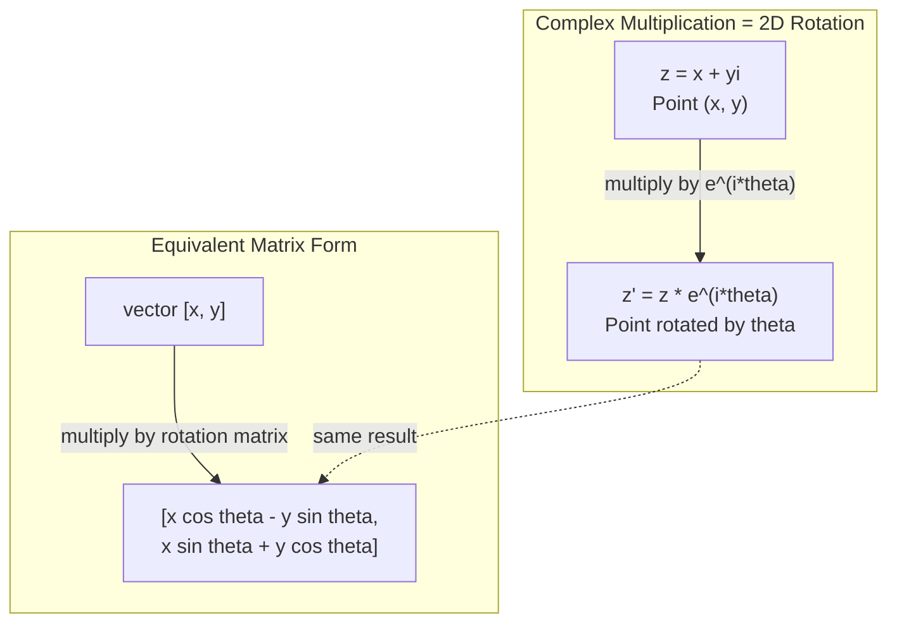
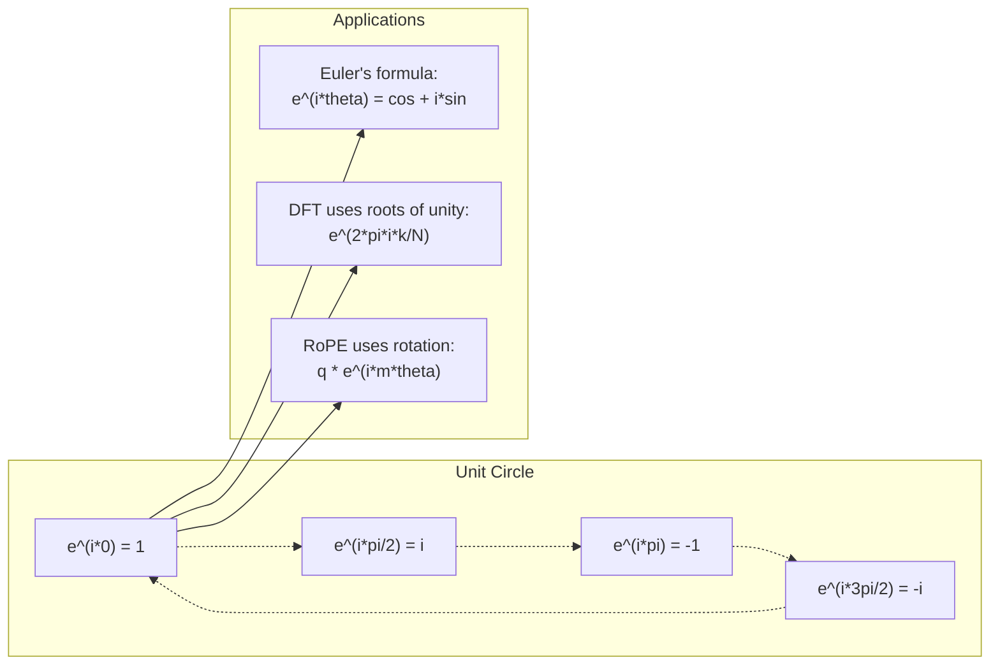

# Complex Numbers for AI

> الجذر التربيعي لـ -1 ليس وهميًا. إنه مفتاح الدوران والترددات ونصف معالجة الإشارات.

**النوع:** تعلم
** اللغة: ** بايثون
**المتطلبات الأساسية:** المرحلة الأولى، الدروس 01-04 (الجبر الخطي وحساب التفاضل والتكامل)
**الوقت:** ~60 دقيقة

## Learning Objectives

- إجراء العمليات الحسابية المعقدة (الجمع والضرب والقسمة والصرف) في كل من الشكل المستطيل والقطبي
- تطبيق صيغة أويلر للتحويل بين الأسس المعقدة والدوال المثلثية
- تنفيذ تحويل فورييه المتقطع باستخدام جذور الوحدة المعقدة
- اشرح كيف تكمن الدورات المعقدة في RoPE والترميزات الموضعية الجيبية في المحولات

## The Problem

تفتح ورقة حول تحويلات فورييه ويوجد `i` في كل مكان. تنظر إلى الترميزات الموضعية للمحولات وترى `sin` و `cos` بترددات مختلفة - الأجزاء الحقيقية والخيالية من الأسيات المعقدة. تقرأ عن الحوسبة الكمومية وتجد كل شيء يتم التعبير عنه في مساحات متجهة معقدة.

تبدو الأعداد المركبة مجردة. يبدو نظام الأرقام المبني على الجذر التربيعي لـ -1 وكأنه خدعة رياضية. لكنها ليست خدعة. إنها اللغة الطبيعية للدوران والتذبذبات. في كل مرة يدور فيها شيء ما، أو يهتز، أو يتأرجح، فإن الأعداد المركبة هي الأداة الصحيحة.

بدون فهم الأعداد المركبة، لا يمكنك فهم تحويل فورييه المتقطع. لا يمكنك أن تفهم FFT. لا يمكنك فهم كيفية عمل RoPE (تضمين الموضع الدوار) في نماذج اللغة الحديثة. لا يمكنك فهم سبب استخدام الترميزات الموضعية الجيبية في ورقة Transformer الأصلية للترددات التي تستخدمها.

يبني هذا الدرس عمليات حسابية معقدة من الصفر، ويربطها بالهندسة، ويوضح لك بالضبط مكان ظهور الأعداد المركبة في التعلم الآلي.

## The Concept

### What is a complex number?

يتكون العدد المركب من جزأين: جزء حقيقي وجزء وهمي.

```
z = a + bi

where:
  a is the real part
  b is the imaginary part
  i is the imaginary unit, defined by i^2 = -1
```

هذا كل شيء. يمكنك تمديد خط الأعداد إلى مستوى. الأعداد الحقيقية تقع على محور واحد. الأرقام الخيالية تجلس على الآخر. كل عدد مركب هو نقطة في هذا المستوى.

### Complex arithmetic

**الجمع.** اجمع الأجزاء الحقيقية معًا، وأضف الأجزاء التخيلية معًا.

```
(a + bi) + (c + di) = (a + c) + (b + d)i

Example: (3 + 2i) + (1 + 4i) = 4 + 6i
```

**الضرب.** استخدم قانون التوزيع وتذكر أن i^2 = -1.

```
(a + bi)(c + di) = ac + adi + bci + bdi^2
                 = ac + adi + bci - bd
                 = (ac - bd) + (ad + bc)i

Example: (3 + 2i)(1 + 4i) = 3 + 12i + 2i + 8i^2
                            = 3 + 14i - 8
                            = -5 + 14i
```

**مرافق.** اقلب إشارة الجزء التخيلي.

```
conjugate of (a + bi) = a - bi
```

حاصل ضرب العدد المركب ومرافقه يكون دائمًا حقيقيًا:

```
(a + bi)(a - bi) = a^2 + b^2
```

**القسمة.** اضرب البسط والمقام في مرافق المقام.

```
(a + bi) / (c + di) = (a + bi)(c - di) / (c^2 + d^2)
```

يؤدي هذا إلى حذف الجزء التخيلي من المقام، مما يمنحك رقمًا مركبًا نظيفًا.

### The complex plane

يقوم المستوى المركب بتعيين كل رقم مركب إلى نقطة ثنائية الأبعاد. المحور الأفقي هو المحور الحقيقي، والمحور الرأسي هو المحور التخيلي.

```
z = 3 + 2i  corresponds to the point (3, 2)
z = -1 + 0i corresponds to the point (-1, 0) on the real axis
z = 0 + 4i  corresponds to the point (0, 4) on the imaginary axis
```

الرقم المركب هو في نفس الوقت نقطة ومتجه من نقطة الأصل. هذا التفسير المزدوج هو ما هي الأعداد المركبة make المفيدة للهندسة.

### Polar form

يمكن وصف أي نقطة في المستوى من خلال بعدها عن نقطة الأصل وزاويتها عن المحور الحقيقي الموجب.

```
z = r * (cos(theta) + i*sin(theta))

where:
  r = |z| = sqrt(a^2 + b^2)     (magnitude, or modulus)
  theta = atan2(b, a)             (phase, or argument)
```

الشكل المستطيل (a + bi) جيد للإضافة. الشكل القطبي (r، theta) مفيد للضرب.

**الضرب على الصورة القطبية.** اضرب المقادير وأضف الزوايا.

```
z1 = r1 * e^(i*theta1)
z2 = r2 * e^(i*theta2)

z1 * z2 = (r1 * r2) * e^(i*(theta1 + theta2))
```

هذا هو السبب في أن الأعداد المركبة مثالية للدوران. الضرب في عدد مركب حجمه 1 هو دوران خالص.

### Euler's formula

الجسر بين الأسيات المعقدة وعلم المثلثات:

```
e^(i*theta) = cos(theta) + i*sin(theta)
```

هذه هي الصيغة الأكثر أهمية في هذا الدرس. عندما ثيتا = بي:

```
e^(i*pi) = cos(pi) + i*sin(pi) = -1 + 0i = -1

Therefore: e^(i*pi) + 1 = 0
```

خمسة ثوابت أساسية (e,i,pi,1,0) مرتبطة في معادلة واحدة.

### Why Euler's formula matters for ML

تقول صيغة أويلر أن `e^(i*theta)` يتتبع دائرة الوحدة مع تغير ثيتا. عند ثيتا = 0، أنت عند (1، 0). عند ثيتا = باي/2، أنت عند (0، 1). عند ثيتا = باي، أنت عند (-1، 0). عند ثيتا = 3*pi/2، أنت عند (0، -1). الدوران الكامل هو ثيتا = 2*pi.

وهذا يعني الأسيات المعقدة ARE التناوب. والدوران موجود في كل مكان في معالجة الإشارات و ML.

### Connection to 2D rotations

ضرب العدد المركب (x + yi) في e^(i*theta) يؤدي إلى تدوير النقطة (x, y) بزاوية ثيتا حول الأصل.

```
Rotation via complex multiplication:
  (x + yi) * (cos(theta) + i*sin(theta))
  = (x*cos(theta) - y*sin(theta)) + (x*sin(theta) + y*cos(theta))i

Rotation via matrix multiplication:
  [cos(theta)  -sin(theta)] [x]   [x*cos(theta) - y*sin(theta)]
  [sin(theta)   cos(theta)] [y] = [x*sin(theta) + y*cos(theta)]
```

أنها تنتج نتائج مماثلة. الضرب المعقد IS دوران ثنائي الأبعاد. مصفوفة التدوير هي مجرد عملية ضرب معقدة مكتوبة بترميز المصفوفة.



### Phasors and rotating signals

الأسي المعقد e^(i*omega*t) هو نقطة تدور حول دائرة الوحدة عند التردد الزاوي أوميغا. كلما زاد t، ترسم النقطة الدائرة.

الجزء الحقيقي من هذه النقطة الدوارة هو cos(omega*t). الجزء التخيلي هو الخطيئة (أوميغا * ر). الإشارة الجيبية هي ظل عدد مركب دوار.

```
e^(i*omega*t) = cos(omega*t) + i*sin(omega*t)

Real part:      cos(omega*t)    -- a cosine wave
Imaginary part: sin(omega*t)    -- a sine wave
```

هذا هو التمثيل المرحلي. بدلاً من تتبع موجة جيبية متذبذبة، يمكنك تتبع سهم يدور بسلاسة. تصبح تحولات الطور إزاحات زاوية. التغييرات في السعة تصبح تغييرات في الحجم. إضافة الإشارات تصبح إضافة ناقلات.

### Roots of unity

الجذور N للوحدة هي نقاط N متباعدة بالتساوي على دائرة الوحدة:

```
w_k = e^(2*pi*i*k/N)    for k = 0, 1, 2, ..., N-1
```

بالنسبة لـ N = 4، الجذور هي: 1، i، -1، -i (نقاط البوصلة الأربع).
بالنسبة إلى N = 8، تحصل على نقاط البوصلة الأربع بالإضافة إلى الأقطار الأربعة.

جذور الوحدة هي أساس تحويل فورييه المنفصل. يقوم DFT بتحليل الإشارة إلى مكونات عند هذه الترددات N المتساوية المسافات.

### Connection to the DFT

تحويل فورييه المنفصل للإشارة x[0]، x[1]،...، x[N-1] هو:

```
X[k] = sum_{n=0}^{N-1} x[n] * e^(-2*pi*i*k*n/N)
```

يقيس كل X[k] مدى ارتباط الإشارة بالجذر k للوحدة - وهو شكل جيبي معقد عند التردد k. يقوم DFT بتقسيم الإشارة إلى أطوار دوارة N ويخبرك بسعة ومرحلة كل واحدة.

### Why i is not imaginary

كلمة "خيالي" هي حادثة تاريخية. لقد استخدمها ديكارت باستخفاف. لكنني لست أكثر خيالًا مما كانت عليه الأرقام السالبة عندما رفضها الناس لأول مرة. الأرقام السالبة تجيب على "ما الذي تطرحه من 3 للحصول على 5؟" تجيب الوحدة التخيلية "ما الذي تربيعه للحصول على -1؟"

والأكثر فائدة: i هو عامل دوران بزاوية 90 درجة. اضرب عددًا حقيقيًا في i مرة واحدة، وستدور 90 درجة نحو المحور التخيلي. اضرب في i مرة أخرى (i^2)، وستدور 90 درجة أخرى - والآن تشير إلى الاتجاه الحقيقي السلبي. ولهذا السبب i^2 = -1. انها ليست غامضة. إنه نصف دورة مبني من ربعين.

وهذا هو سبب وجود الأعداد المركبة في كل مكان في الهندسة. أي شيء يدور - الموجات الكهرومغناطيسية، والحالات الكمومية، وتذبذبات الإشارة، والتشفير الموضعي - يوصف بشكل طبيعي بالأرقام المعقدة.

### Complex exponentials vs trigonometric functions

قبل صيغة أويلر، كتب المهندسون الإشارات على النحو التالي: A*cos(omega*t + phi) - السعة A، التردد omega، المرحلة phi. هذا يعمل ولكن makes حسابية مؤلمة. تتطلب إضافة جيبي التمام بمراحل مختلفة هويات مثلثية.

مع الأسيات المعقدة، نفس الإشارة هي A*e^(i*(omega*t + phi)). إن إضافة إشارتين هو مجرد إضافة رقمين مركبين. الضرب (التعديل) هو مجرد ضرب المقادير وإضافة الزوايا. تحولات الطور تصبح إضافات زاوية. تتحول تحولات التردد إلى مضاعفات حسب المراحل.

تحول مجال معالجة الإشارات بأكمله إلى التدوين الأسي المعقد لأن الرياضيات أصبحت أكثر نظافة. "الإشارة الحقيقية" هي دائمًا الجزء الحقيقي من التمثيل المعقد. يتم تنفيذ الجزء التخيلي كمسك الدفاتر، مما يجعل جميع عمليات الجبر تعمل بشكل طبيعي.

### Connection to transformers

**التشفيرات الموضعية الجيبية** (ورقة المحولات الأصلية):

```
PE(pos, 2i) = sin(pos / 10000^(2i/d))
PE(pos, 2i+1) = cos(pos / 10000^(2i/d))
```

أزواج الخطيئة وجيب التمام هي الأجزاء الحقيقية والخيالية من الأسيات المعقدة عند ترددات مختلفة. يوفر كل تردد "دقة" مختلفة لموضع التشفير. تتغير الترددات المنخفضة ببطء (الوضع الخشن). الترددات العالية تتغير بسرعة (وضع جيد). معًا يمنحون كل موضع بصمة تردد فريدة.

**RoPE (تضمين الموضع الدوار)** يأخذ هذا الأمر إلى أبعد من ذلك. يقوم بشكل صريح بضرب الاستعلام والمتجهات الرئيسية بواسطة مصفوفات التدوير المعقدة. يصبح الموضع النسبي بين رمزين مميزين زاوية دوران. يتم حساب الانتباه باستخدام هذه المتجهات المدورة، مما يجعل النموذج حساسًا للموضع النسبي من خلال الضرب المعقد.

| عملية | الصيغة الجبرية | المعنى الهندسي |
|-----------|-------------|------------------|
| اضافة | (أ+ج) + (ب+د)ط | إضافة المتجهات في المستوى |
| الضرب | (ac-bd) + (ad+bc)i | تدوير وقياس |
| مترافق | أ - ثنائية | تعكس على المحور الحقيقي |
| الحجم | الجذر التربيعي (أ ^ 2 + ب ^ 2) | المسافة من الأصل |
| المرحلة | أتان2(ب، أ) | الزاوية من المحور الحقيقي الموجب |
| شعبة | اضرب بالمرافق | عكس التدوير وإعادة القياس |
| القوة | ص ^ ن * ه ^ (أنا * ن * ثيتا) | قم بتدوير n مرات، وقياس بواسطة r^n |



## Build It

### Step 1: Complex class

بناء فئة الأعداد المركبة التي تدعم الحساب والحجم والطور والتحويل بين الأشكال المستطيلة والقطبية.

```python
import math

class Complex:
    def __init__(self, real, imag=0.0):
        self.real = real
        self.imag = imag

    def __add__(self, other):
        return Complex(self.real + other.real, self.imag + other.imag)

    def __mul__(self, other):
        r = self.real * other.real - self.imag * other.imag
        i = self.real * other.imag + self.imag * other.real
        return Complex(r, i)

    def __truediv__(self, other):
        denom = other.real ** 2 + other.imag ** 2
        r = (self.real * other.real + self.imag * other.imag) / denom
        i = (self.imag * other.real - self.real * other.imag) / denom
        return Complex(r, i)

    def magnitude(self):
        return math.sqrt(self.real ** 2 + self.imag ** 2)

    def phase(self):
        return math.atan2(self.imag, self.real)

    def conjugate(self):
        return Complex(self.real, -self.imag)
```

### Step 2: Polar conversion and Euler's formula

```python
def to_polar(z):
    return z.magnitude(), z.phase()

def from_polar(r, theta):
    return Complex(r * math.cos(theta), r * math.sin(theta))

def euler(theta):
    return Complex(math.cos(theta), math.sin(theta))
```

التحقق: يجب أن يكون `euler(theta).magnitude()` دائمًا 1.0. `euler(0)` يجب أن يعطي (1، 0). `euler(pi)` يجب أن يعطي (-1، 0).

### Step 3: Rotation

إن تدوير نقطة (x، y) بزاوية ثيتا هو عملية ضرب معقدة:

```python
point = Complex(3, 4)
rotated = point * euler(math.pi / 4)
```

الحجم يبقى كما هو. الزاوية فقط تتغير.

### Step 4: DFT from complex arithmetic

```python
def dft(signal):
    N = len(signal)
    result = []
    for k in range(N):
        total = Complex(0, 0)
        for n in range(N):
            angle = -2 * math.pi * k * n / N
            total = total + Complex(signal[n], 0) * euler(angle)
        result.append(total)
    return result
```

هذا هو O(N^2) DFT. كل مخرج X[k] هو مجموع عينات الإشارة مضروباً في جذور الوحدة.

### Step 5: Inverse DFT

معكوس DFT يعيد بناء الإشارة الأصلية من طيفه. التغييرات الوحيدة من الأمام DFT: اقلب العلامة الموجودة في الأس واقسم على N.

```python
def idft(spectrum):
    N = len(spectrum)
    result = []
    for n in range(N):
        total = Complex(0, 0)
        for k in range(N):
            angle = 2 * math.pi * k * n / N
            total = total + spectrum[k] * euler(angle)
        result.append(Complex(total.real / N, total.imag / N))
    return result
```

وهذا يمنحك إعادة بناء مثالية. قم بتطبيق DFT، ثم IDFT، وستستعيد الإشارة الأصلية إلى دقة الآلة. لا يتم فقدان أية معلومات.

### Step 6: Roots of unity

```python
def roots_of_unity(N):
    return [euler(2 * math.pi * k / N) for k in range(N)]
```

التحقق من خاصيتين:
- كل جذر له مقدار 1 بالضبط.
- مجموع كل الجذور N هو صفر (يتم إلغاؤها بالتناظر).

هذه الخصائص هي ما make DFT قابل للعكس. تشكل جذور الوحدة أساسًا متعامدًا لمجال التردد.

## Use It

لدى Python دعم مدمج للأرقام المركبة. الحرفي `j` يمثل الوحدة التخيلية.

```python
z = 3 + 2j
w = 1 + 4j

print(z + w)
print(z * w)
print(abs(z))

import cmath
print(cmath.phase(z))
print(cmath.exp(1j * cmath.pi))
```

بالنسبة للمصفوفات، يعالج numpy الأعداد المركبة محليًا:

```python
import numpy as np

z = np.array([1+2j, 3+4j, 5+6j])
print(np.abs(z))
print(np.angle(z))
print(np.conj(z))
print(np.real(z))
print(np.imag(z))

signal = np.sin(2 * np.pi * 5 * np.linspace(0, 1, 128))
spectrum = np.fft.fft(signal)
freqs = np.fft.fftfreq(128, d=1/128)
```

## Ship It

قم بتشغيل `code/complex_numbers.py` لإنشاء `outputs/skill-complex-arithmetic.md`.

## Exercises

1. **عمليات حسابية معقدة يدويًا**. قم ​​بحساب (2 + 3i) * (4 - i) والتحقق باستخدام الكود. ثم احسب (5 + 2i) / (1 - 3i). ارسم كلتا النتيجتين على المستوى المركب وتحقق من أن الضرب قد تم تدويره وقياس الرقم الأول.

2. **تسلسل الدوران.** ابدأ بالنقطة (1، 0). اضرب بـ e^(i*pi/6) اثنتي عشرة مرة. تأكد من العودة إلى (1، 0) بعد 12 عملية ضرب. اطبع الإحداثيات في كل خطوة وتأكد من أنها تتبع خطًا منتظمًا مكونًا من 12 خطًا.

3. **DFT لإشارة معروفة.** قم بإنشاء إشارة هي مجموع sin(2*pi*3*t) و0.5*sin(2*pi*7*t) التي تم أخذ عينات منها عند 32 نقطة. قم بتشغيل DFT. تحقق من أن طيف الحجم له قمم عند الترددات 3 و7، حيث تكون الذروة عند 7 نصف ارتفاع الذروة عند 3.

4. **تصور جذور الوحدة.** احسب الجذور الثامنة للعدد واحد. التحقق من أن مجموعهما يساوي الصفر. تحقق من أن ضرب أي جذر في الجذر البدائي e^(2*pi*i/8) يعطي الجذر التالي.

5. ** معادلة مصفوفة الدوران. ** بالنسبة إلى 10 زوايا عشوائية و10 نقاط عشوائية، تأكد من أن الضرب المعقد يعطي نفس نتيجة ضرب المصفوفة والمتجه مع مصفوفة الدوران 2x2. اطبع أقصى فرق رقمي.

## Key Terms

| مصطلح | ماذا يعني |
|------|--------------|
| رقم مركب | رقم a + bi حيث a هو الجزء الحقيقي، وb هو الجزء التخيلي، وi^2 = -1 |
| وحدة خيالية | الرقم i، المحدد بـ i^2 = -1. ليست خيالية بالمعنى الفلسفي -- فهي عامل دوران |
| طائرة معقدة | المستوى ثنائي الأبعاد حيث يكون المحور x حقيقيًا والمحور y وهميًا. وتسمى أيضًا طائرة أرجاند |
| الحجم (المعامل) | المسافة من نقطة الأصل: sqrt(a^2 + b^2). مكتوب كـ \|z\| |
| المرحلة (الحجّة) | الزاوية من المحور الحقيقي الموجب: atan2(b,a). مكتوب كـ arg(z) |
| مترافق | الصورة المعكوسة عبر المحور الحقيقي: مرافق a + bi هو a - bi |
| الشكل القطبي | التعبير عن z كـ r * e^(i*theta) بدلاً من a + bi. يجعل الضرب سهلا |
| صيغة أويلر | e^(i*theta) = cos(theta) + i*sin(theta). يربط الأسيات بعلم المثلثات |
| فاسور | رقم مركب دوار e^(i*omega*t) يمثل إشارة جيبية |
| جذور الوحدة | الأعداد المركبة N e^(2*pi*i*k/N) لـ k = 0 إلى N-1. N نقاط متباعدة بشكل متساو على دائرة الوحدة |
| DFT | تحويل فورييه المنفصل. يتحلل الإشارة إلى مكونات جيبية معقدة باستخدام جذور الوحدة |
| حبل | الروتاري موقف التضمين. يستخدم الضرب المعقد لتشفير الموضع النسبي في انتباه المحول |

## Further Reading

- [Visual Introduction to Euler's Formula](https://betterexplained.com/articles/intuitive-understanding-of-eulers-formula/) - builds geometric intuition without heavy notation
- [Su et al.: RoFormer (2021)](https://arxiv.org/abs/2104.09864) - الورقة التي تقدم تضمين الموضع الدوار باستخدام الدورات المعقدة
- [Vaswani et al.: Attention Is All You Need (2017)](https://arxiv.org/abs/1706.03762) - the original Transformer paper with sinusoidal positional encodings
- [3Blue1Brown: Euler's formula with introductory group theory](https://www.youtube.com/watch?v=mvmuCPvRoWQ) - visual explanation of why e^(i*pi) = -1
- [نيدهام: التحليل المركب البصري](https://global.oup.com/academic/product/visual-complex-analysis-9780198534464) - أفضل معالجة بصرية للأعداد المركبة، مليئة بالبصيرة الهندسية
- [سترانغ: مقدمة في الجبر الخطي، الفصل. 10](https://math.mit.edu/~gs/linearalgebra/) - الأعداد المركبة في سياق الجبر الخطي والقيم الذاتية
