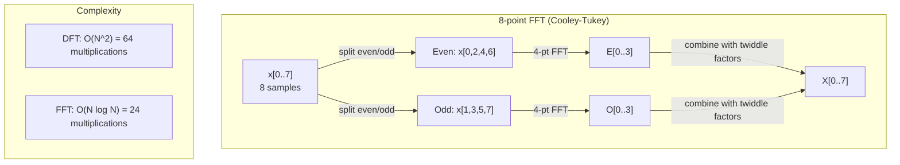
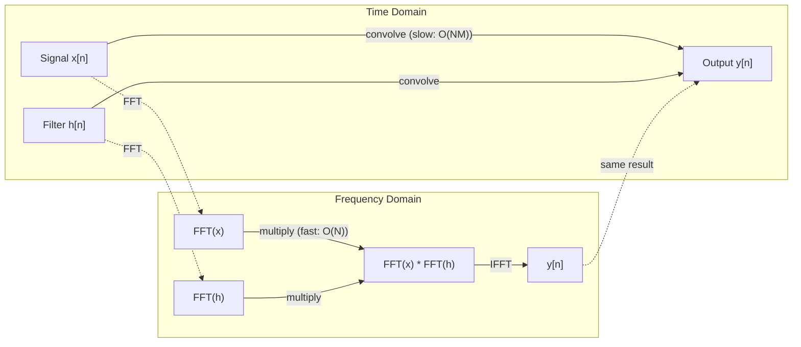

# The Fourier Transform

> كل إشارة هي مجموع الموجات الجيبية. يخبرك تحويل فورييه بأي منها.

**النوع:** بناء
** اللغة: ** بايثون
**المتطلبات:** المرحلة الأولى، الدروس 01-04، 19 (الأعداد المركبة)
**الوقت:** ~90 دقيقة

## Learning Objectives

- تنفيذ DFT من الصفر والتحقق منه مقابل O(N log N) Cooley-Tukey FFT
- تفسير معاملات التردد: استخراج السعة والطور وطيف الطاقة من الإشارة
- تطبيق نظرية الإلتواء لإجراء الإلتواء عبر الضرب FFT
- قم بتوصيل تحليل تردد فورييه بالتشفير الموضعي للمحولات وطبقات الالتواء CNN

## The Problem

التسجيل الصوتي عبارة عن سلسلة من قياسات الضغط بمرور الوقت. سعر السهم هو سلسلة من القيم على مدى أيام. الصورة عبارة عن شبكة من شدة البكسل عبر الفضاء. كل هذه بيانات في المجال الزمني (أو المجال الفضائي). ترى القيم تتغير على بعض الفهرس.

لكن العديد من الأنماط غير مرئية في المجال الزمني. هل هذه الإشارة الصوتية نغمة نقية أم وتر؟ هل سعر السهم هذا له دورة أسبوعية؟ هل تحتوي هذه الصورة على نسيج متكرر؟ هذه الأسئلة تتعلق بمحتوى التردد، والمجال الزمني يخفيه.

يقوم تحويل فورييه بتحويل البيانات من المجال الزمني إلى مجال التردد. يأخذ إشارة ويتحللها إلى موجات جيبية ذات ترددات مختلفة. كل موجة جيبية لها سعة (مدى قوتها) ومرحلة (حيث تبدأ). يخبرك تحويل فورييه بكليهما.

هذا مهم بالنسبة لـ ML لأن تفكير مجال التردد يظهر في كل مكان. تقوم الشبكات العصبية التلافيفية بإجراء عملية الالتفاف، وهو الضرب في مجال التردد. تستخدم الترميزات الموضعية للمحولات تحليل التردد لتمثيل الموضع. تعمل النماذج الصوتية (التعرف على الكلام، وتوليد الموسيقى) على مخططات طيفية - تمثيلات ترددية للصوت. تبحث نماذج السلاسل الزمنية عن أنماط دورية. يمنحك فهم تحويل فورييه المفردات اللازمة للعمل مع كل هذه الأشياء.

## The Concept

### The DFT definition

بالنظر إلى عينات N x[0]، x[1]،...، x[N-1]، فإن تحويل فورييه المنفصل ينتج معاملات تردد N X[0]، X[1]،...، X[N-1]:

```
X[k] = sum_{n=0}^{N-1} x[n] * e^(-2*pi*i*k*n/N)

for k = 0, 1, ..., N-1
```

كل X[k] هو عدد مركب. حجمها |X[k]| يخبرك بسعة التردد k. تخبرك زاوية الطور (X[k]) بإزاحة الطور لهذا التردد.

الفكرة الأساسية: `e^(-2*pi*i*k*n/N)` هي مرحلة دوارة عند التردد k. يحسب DFT العلاقة بين الإشارة وكل تردد من الترددات ذات المسافات المتساوية. إذا كانت الإشارة تحتوي على طاقة عند التردد k، فإن الارتباط يكون كبيرًا. إذا لم يكن الأمر كذلك، فهو قريب من الصفر.

### What each coefficient means

**X[0]: المكون DC.** هذا هو مجموع جميع العينات -- بما يتناسب مع المتوسط. وهو يمثل الإزاحة الثابتة (التردد الصفري) للإشارة.

```
X[0] = sum_{n=0}^{N-1} x[n] * e^0 = sum of all samples
```

**X[k] لـ 1 <= k <= N/2: ترددات موجبة. ** يمثل X[k] دورات تردد k لكل N عينة. ارتفاع k يعني تردد أعلى (تذبذب أسرع).

**X[N/2]: تردد Nyquist.** أعلى تردد يمكنك تمثيله باستخدام عينات N. وفوق هذا، تحصل على أسماء مستعارة - ترددات عالية تتنكر في شكل ترددات منخفضة.

**X[k] لـ N/2 < k < N: الترددات السلبية. ** بالنسبة للإشارات ذات القيمة الحقيقية، X[N-k] = conj(X[k]). الترددات السلبية هي صور مرآة للترددات الإيجابية. ولهذا السبب فإن المعلومات المفيدة موجودة في معاملات N/2 + 1 الأولى.

### Inverse DFT

يقوم المعكوس DFT بإعادة بناء الإشارة الأصلية من معاملات ترددها:

```
x[n] = (1/N) * sum_{k=0}^{N-1} X[k] * e^(2*pi*i*k*n/N)

for n = 0, 1, ..., N-1
```

الاختلافات الوحيدة عن الأمام DFT: الإشارة الموجودة في الأس موجبة (وليست سالبة)، ويوجد عامل تسوية 1/N.

معكوس DFT هو إعادة بناء مثالية. لا يتم فقدان أية معلومات. يمكنك الانتقال من المجال الزمني إلى المجال الترددي والعودة دون أي خطأ. DFT هو تغيير الأساس - فهو يعيد التعبير عن نفس المعلومات في نظام إحداثيات مختلف.

### The FFT: making it fast

DFT كما هو محدد أعلاه هو O(N^2): لكل من معاملات الإخراج N، يمكنك جمع أكثر من N من عينات الإدخال. بالنسبة لـ N = 1 مليون، فهذا يعني 10^12 عملية.

يحسب تحويل فورييه السريع (FFT) نفس النتيجة في O(N log N). بالنسبة لـ N = 1 مليون، فهذا يعني حوالي 20 مليون عملية بدلاً من تريليون. هذا هو ما هو تحليل التردد make العملي.

تعمل خوارزمية Cooley-Tukey (الأكثر شيوعًا FFT) عن طريق فرق تسد:

1. قم بتقسيم الإشارة إلى عينات ذات فهرسة زوجية وعينات ذات فهرسة فردية.
2. احسب DFT لكل نصف بشكل متكرر.
3. قم بدمج اثنين من DFTs بنصف الحجم باستخدام "عوامل التدوير" e^(-2*pi*i*k/N).

```
X[k] = E[k] + e^(-2*pi*i*k/N) * O[k]          for k = 0, ..., N/2 - 1
X[k + N/2] = E[k] - e^(-2*pi*i*k/N) * O[k]    for k = 0, ..., N/2 - 1

where E = DFT of even-indexed samples
      O = DFT of odd-indexed samples
```

التماثل يعني أن كل مستوى من مستويات العودية يعمل O(N)، وهناك مستويات log2(N). المجموع: O(N log N).



يتطلب FFT أن يكون طول الإشارة قوة 2. في الممارسة العملية، تكون الإشارات مبطنة بالقوة التالية 2.

### Spectral analysis

**طيف القدرة** هو |X[k]|^2 -- الحجم التربيعي لكل معامل تردد. ويبين مقدار الطاقة الموجودة في كل تردد.

**طيف الطور** هو الزاوية (X[k]) - إزاحة الطور لكل تردد. بالنسبة لمعظم مهام التحليل، فإنك تهتم بطيف الطاقة وتتجاهل المرحلة.

```
Power at frequency k:  P[k] = |X[k]|^2 = X[k].real^2 + X[k].imag^2
Phase at frequency k:  phi[k] = atan2(X[k].imag, X[k].real)
```

### Frequency resolution

تعتمد دقة تردد DFT على عدد العينات N ومعدل أخذ العينات fs.

```
Frequency of bin k:      f_k = k * fs / N
Frequency resolution:    delta_f = fs / N
Maximum frequency:       f_max = fs / 2  (Nyquist)
```

لحل ترددين قريبين من بعضهما، تحتاج إلى المزيد من العينات. لالتقاط الترددات العالية، تحتاج إلى معدل أخذ عينات أعلى.

### The convolution theorem

تعد هذه إحدى أهم النتائج في معالجة الإشارات وترتبط بشكل مباشر بشبكات CNN.

**الالتفاف في المجال الزمني يساوي الضرب النقطي في مجال التردد.**

```
x * h = IFFT(FFT(x) . FFT(h))

where * is convolution and . is element-wise multiplication
```

لماذا يهم هذا:

- الالتواء المباشر لإشارتين بطول N وM يأخذ عمليات O(N*M).
- الالتواء القائم على FFT يأخذ O(N log N): تحويل كلاهما، الضرب، التحويل مرة أخرى.
- بالنسبة للحبوب الكبيرة، يكون الالتواء FFT أسرع بشكل كبير.
- وهذا بالضبط ما يحدث في الطبقات التلافيفية ذات الحقول المستقبلة الكبيرة.

ملاحظة: يحسب DFT الالتواء الدائري (تلتف الإشارة حولها). بالنسبة للالتواء الخطي (بدون التفاف)، قم بوضع كلتا الإشارتين على لوحة صفرية بطول N + M - 1 قبل الحوسبة.



### Windowing

يفترض DFT أن الإشارة دورية - فهو يتعامل مع العينات N كفترة واحدة من إشارة متكررة بلا حدود. إذا لم تبدأ الإشارة وتنتهي عند نفس القيمة، فإن هذا يخلق انقطاعًا عند الحدود، والذي يظهر كمحتوى زائف عالي التردد. وهذا ما يسمى التسرب الطيفي.

تعمل النوافذ على تقليل التسرب عن طريق تقليص الإشارة إلى الصفر عند كلا الطرفين قبل حساب DFT.

النوافذ المشتركة:

| نافذة | الشكل | عرض الفص الرئيسي | مستوى الفص الجانبي | حالة الاستخدام |
|--------|-------|----------------|-----------------|----------|
| مستطيلة | شقة (بدون نافذة) | أضيق | الأعلى (-13 ديسيبل) | عندما تكون الإشارة دورية تمامًا في عينات N |
| هان | جيب التمام المرفوع | معتدل | منخفض (-31 ديسيبل) | التحليل الطيفي للأغراض العامة |
| هامينج | جيب التمام المعدل | معتدل | أقل (-42 ديسيبل) | معالجة الصوت وتحليل الكلام |
| بلاكمان | جيب التمام الثلاثي | واسعة | منخفض جدًا (-58 ديسيبل) | عندما يكون قمع الفص الجانبي أمرًا بالغ الأهمية |

```
Hann window:    w[n] = 0.5 * (1 - cos(2*pi*n / (N-1)))
Hamming window: w[n] = 0.54 - 0.46 * cos(2*pi*n / (N-1))
```

قم بتطبيق النافذة عن طريق ضربها حسب العنصر بالإشارة قبل DFT: `X = DFT(x * w)`.

### DFT properties

| عقار | المجال الزمني | مجال التردد |
|----------|------------|-----------------|
| الخطية | أ*س + ب*ص | أ*س + ب*ص |
| التحول الزمني | س[ن - ك] | X[f] * e^(-2*pi*i*f*k/N) |
| تحول التردد | x[n] * e^(2*pi*i*f0*n/N) | X[f - f0] |
| الإلتواء | س * ح | X * H (نقطيًا) |
| الضرب | س * ح (نقطية) | X * H (التفاف دائري، مقاس 1/N) |
| نظرية بارسيفال | مجموع \|x[n]\|^2 | (1/N) * مجموع \|X[ك]\|^2 |
| التماثل المترافق (المدخلات الحقيقية) | س[ن] حقيقي | X[k] = conj(X[N-k]) |

تقول نظرية بارسيفال أن إجمالي الطاقة هو نفسه في كلا المجالين. يتم حفظ الطاقة من خلال التحويل.

### Connection to positional encodings

يستخدم المحول الأصلي الترميزات الموضعية الجيبية:

```
PE(pos, 2i)   = sin(pos / 10000^(2i/d_model))
PE(pos, 2i+1) = cos(pos / 10000^(2i/d_model))
```

يتأرجح كل زوج من الأبعاد (2i، 2i+1) بتردد مختلف. الترددات متباعدة هندسيًا من الأعلى (البعد 0،1) إلى المنخفض (الأبعاد الأخيرة). وهذا يعطي كل موضع نمطًا فريدًا عبر جميع نطاقات التردد - على غرار الطريقة التي تحدد بها معاملات فورييه الإشارة بشكل فريد.

الخصائص الرئيسية التي يوفرها هذا:

- **التفرد:** لا يوجد موقعان لهما نفس التشفير.
- **القيم الحدودية:** sin وcos موجودان دائمًا في [-1, 1].
- **الموضع النسبي:** يمكن التعبير عن تشفير الموضع p+k كدالة خطية للتشفير عند الموضع p. يمكن للنموذج أن يتعلم كيفية الحضور إلى المواقف النسبية.

### Connection to CNNs

تطبق طبقة الالتواء مرشحًا مكتسبًا (نواة) على الإدخال عن طريق تحريكه عبر الإشارة أو الصورة. رياضيا، هذه هي عملية الالتواء.

ومن خلال نظرية الالتواء، فإن هذا يعادل:
1. FFT الإدخال
2. FFT النواة
3. اضرب في مجال التردد
4. IFFT النتيجة

تستخدم التطبيقات القياسية CNN الإلتواء المباشر (أسرع للنواة الصغيرة 3x3). ولكن بالنسبة للنوى الكبيرة أو الالتواء الشامل، تكون الأساليب المستندة إلى FFT أسرع بشكل ملحوظ. تستبدل بعض البنيات (مثل FNet) الانتباه بالكامل بـ FFT، وتحقق الدقة التنافسية باستخدام O(N log N) بدلاً من تعقيد O(N^2).

### Spectrograms and the Short-Time Fourier Transform

يمنحك رمز FFT المنفرد محتوى التردد للإشارة بأكملها، لكنه لا يخبرك شيئًا عن وقت حدوث تلك الترددات. يمكن أن يكون للتغريدة (الإشارة التي يزداد ترددها بمرور الوقت) والوتر (جميع الترددات الموجودة في وقت واحد) نفس طيف الحجم.

يحل تحويل فورييه قصير الأمد (STFT) هذه المشكلة عن طريق حساب التحويلات المالية السريعة (FFTs) على النوافذ المتداخلة للإشارة. والنتيجة هي مخطط طيفي: تمثيل ثنائي الأبعاد للزمن على أحد المحاور والتردد على المحور الآخر. تُظهر الكثافة عند كل نقطة الطاقة عند هذا التردد في ذلك الوقت.

```
STFT procedure:
1. Choose a window size (e.g., 1024 samples)
2. Choose a hop size (e.g., 256 samples -- 75% overlap)
3. For each window position:
   a. Extract the windowed segment
   b. Apply a Hann/Hamming window
   c. Compute FFT
   d. Store the magnitude spectrum as one column of the spectrogram
```

تمثل الطيفية تمثيل الإدخال القياسي لنماذج الصوت ML. تعمل نماذج التعرف على الكلام (Whisper، DeepSpeech) على مخططات طيفية mel - وهي مخططات طيفية ذات ترددات تم تعيينها على مقياس mel، والتي تتوافق بشكل أفضل مع إدراك الإنسان لطبقة الصوت.

### Aliasing

إذا كانت الإشارة تحتوي على ترددات أعلى من fs/2 (تردد نيكويست)، فإن أخذ العينات بمعدل fs سيؤدي إلى إنشاء نسخ مستعارة. تبدو إشارة 90 هرتز التي تم أخذ عينات منها عند 100 هرتز مماثلة لإشارة 10 هرتز. ولا توجد طريقة لتمييزها عن العينات وحدها.

```
Example:
  True signal: 90 Hz sine wave
  Sampling rate: 100 Hz
  Apparent frequency: 100 - 90 = 10 Hz

  The samples from the 90 Hz signal at 100 Hz sampling rate
  are identical to the samples from a 10 Hz signal.
  No amount of math can recover the original 90 Hz.
```

هذا هو السبب في أن المحولات التناظرية إلى digital تشتمل على مرشحات مضادة للتعرجات تزيل الترددات الأعلى من Nyquist قبل أخذ العينات. في ML، يظهر الاسم المستعار عند اختزال خرائط الميزات دون تصفية مناسبة للتمرير المنخفض - تعالج بعض البنيات هذا الأمر من خلال طبقات التجميع المضادة للاسم المستعار.

### Zero-padding does not increase resolution

هناك مفهوم خاطئ شائع: عدم حشو الإشارة قبل FFT يؤدي إلى تحسين دقة التردد. لا. تتداخل الحشوة الصفرية بين صناديق التردد الموجودة، مما يمنحك طيفًا أكثر سلاسة. لكنها لا تستطيع الكشف عن تفاصيل التردد التي لم تكن موجودة في العينات الأصلية.

تعتمد دقة التردد الحقيقية فقط على وقت المراقبة T = N / fs. لحل ترددين مفصولين بـ delta_f، تحتاج على الأقل إلى T = 1 / delta_f ثانية من البيانات. لا يغير أي قدر من الحشو الصفري هذا الحد الأساسي.

## Build It

### Step 1: DFT from scratch

يتبع O(N^2) DFT مباشرة من التعريف.

```python
import math

class Complex:
    ...

def dft(x):
    N = len(x)
    result = []
    for k in range(N):
        total = Complex(0, 0)
        for n in range(N):
            angle = -2 * math.pi * k * n / N
            w = Complex(math.cos(angle), math.sin(angle))
            xn = x[n] if isinstance(x[n], Complex) else Complex(x[n])
            total = total + xn * w
        result.append(total)
    return result
```

### Step 2: Inverse DFT

نفس البنية، الأس الإيجابي، مقسومًا على N.

```python
def idft(X):
    N = len(X)
    result = []
    for n in range(N):
        total = Complex(0, 0)
        for k in range(N):
            angle = 2 * math.pi * k * n / N
            w = Complex(math.cos(angle), math.sin(angle))
            total = total + X[k] * w
        result.append(Complex(total.real / N, total.imag / N))
    return result
```

### Step 3: FFT (Cooley-Tukey)

يتطلب التكرار FFT طول قوة 2. انقسمت إلى زوجية وفردية، متكررة، تتحد مع عوامل التلاعب.

```python
def fft(x):
    N = len(x)
    if N <= 1:
        return [x[0] if isinstance(x[0], Complex) else Complex(x[0])]
    if N % 2 != 0:
        return dft(x)

    even = fft([x[i] for i in range(0, N, 2)])
    odd = fft([x[i] for i in range(1, N, 2)])

    result = [Complex(0)] * N
    for k in range(N // 2):
        angle = -2 * math.pi * k / N
        twiddle = Complex(math.cos(angle), math.sin(angle))
        t = twiddle * odd[k]
        result[k] = even[k] + t
        result[k + N // 2] = even[k] - t
    return result
```

### Step 4: Spectral analysis helpers

```python
def power_spectrum(X):
    return [xk.real ** 2 + xk.imag ** 2 for xk in X]

def convolve_fft(x, h):
    N = len(x) + len(h) - 1
    padded_N = 1
    while padded_N < N:
        padded_N *= 2

    x_padded = x + [0.0] * (padded_N - len(x))
    h_padded = h + [0.0] * (padded_N - len(h))

    X = fft(x_padded)
    H = fft(h_padded)

    Y = [xk * hk for xk, hk in zip(X, H)]

    y = idft(Y)
    return [y[n].real for n in range(N)]
```

## Use It

للعمل الحقيقي، استخدم numpy's FFT المدعوم بمكتبات C المحسنة للغاية.

```python
import numpy as np

signal = np.sin(2 * np.pi * 5 * np.arange(256) / 256)
spectrum = np.fft.fft(signal)
freqs = np.fft.fftfreq(256, d=1/256)

power = np.abs(spectrum) ** 2

positive_freqs = freqs[:len(freqs)//2]
positive_power = power[:len(power)//2]
```

للنافذة والتحليل الطيفي الأكثر تقدمًا:

```python
from scipy.signal import windows, stft

window = windows.hann(256)
windowed = signal * window
spectrum = np.fft.fft(windowed)
```

للالتواء:

```python
from scipy.signal import fftconvolve

result = fftconvolve(signal, kernel, mode='full')
```

بالنسبة للمخططات الطيفية:

```python
from scipy.signal import stft

frequencies, times, Zxx = stft(signal, fs=sample_rate, nperseg=256)
spectrogram = np.abs(Zxx) ** 2
```

المصفوفة الطيفية لها شكل (n_frequeency، n_time_frames). كل عمود هو طيف الطاقة في نافذة زمنية واحدة. هذا هو ما تستهلكه نماذج الصوت ML كمدخلات.

## Ship It

قم بتشغيل `code/fourier.py` لإنشاء `outputs/prompt-spectral-analyzer.md`.

## Exercises

1. **تحديد النغمة النقية.** أنشئ إشارة بموجة جيبية واحدة بتردد غير معروف (بين 1 و50 هرتز)، تم أخذ عينة منها عند 128 هرتز لمدة ثانية واحدة. استخدم DFT لتحديد التردد. التحقق من تطابق الإجابة. أضف الآن ضوضاء غاوسية مع انحراف معياري 0.5 وكرر. كيف تؤثر الضوضاء على الطيف؟

2. **FFT مقابل DFT التحقق.** قم بإنشاء إشارة عشوائية بطول 64. احسب كلاً من DFT (O(N^2)) وFFT. تحقق من تطابق كافة المعاملات ضمن 1e-10. يعمل الوقت على إشارات بطول 256 و512 و1024 و2048. ارسم نسبة DFT من الوقت إلى FFT من الوقت.

3. **إثبات نظرية الالتواء بالمثال.** أنشئ إشارة x = [1, 2, 3, 4, 0, 0, 0, 0] ومرشح h = [1, 1, 1, 0, 0, 0, 0, 0]. حساب الالتفاف الدائري مباشرة (حلقة متداخلة). ثم احسبها عبر FFT (تحويل، ضرب، تحويل عكسي). التحقق من تطابق النتائج. الآن قم بإجراء الإلتواء الخطي عن طريق الحشو الصفري بشكل مناسب.

4. **تأثيرات النوافذ.** قم بإنشاء إشارة عبارة عن مجموع موجتين جيبيتين عند 10 هرتز و12 هرتز (قريبة جدًا). عينة عند 128 هرتز لمدة ثانية واحدة. حساب طيف الطاقة بدون نافذة، ونافذة هان، ونافذة هامينج. أي نافذة make هي الأسهل للتمييز بين القمتين؟ لماذا؟

5. **تحليل الترميز الموضعي.** أنشئ الترميزات الموضعية الجيبية لـ d_model = 128 وmax_pos = 512. لكل زوج من المواضع (p1، p2)، احسب حاصل الضرب النقطي لترميزاتها. أظهر أن حاصل الضرب النقطي يعتمد فقط على |p1 - p2|، وليس على المواضع المطلقة. ماذا يحدث للمنتج النقطي مع زيادة المسافة؟

## Key Terms

| مصطلح | ماذا يعني |
|------|--------------|
| DFT (تحويل فورييه المنفصل) | يحول عينات المجال الزمني N إلى معاملات مجال التردد N. كل معامل هو الارتباط مع الجيوب الأنفية المعقدة عند هذا التردد |
| FFT (تحويل فورييه السريع) | خوارزمية O(N log N) لحساب DFT. تقوم خوارزمية Cooley-Tukey بتقسيم المؤشرات الزوجية/الفردية بشكل متكرر |
| معكوس DFT | يعيد بناء إشارة المجال الزمني من معاملات التردد. نفس الصيغة DFT مع علامة الأس المعكوسة وقياس 1/N |
| بن التردد | يمثل كل مؤشر k في الإخراج DFT التردد k*fs/N Hz. "bin" هي فتحة التردد المنفصلة |
| DC المكون | X[0]، معامل التردد الصفري. متناسب مع الإشارة يعني |
| تردد نيكويست | fs/2، الحد الأقصى للتردد الذي يمكن تمثيله بمعدل أخذ العينات fs. الترددات فوق هذا الاسم المستعار |
| طيف القدرة | \|X[k]\|^2، الحجم التربيعي لكل معامل تردد. يظهر توزيع الطاقة عبر الترددات |
| طيف الطور | angle(X[k])، وهي تخالف الطور لكل مكون تردد. غالبا ما يتم تجاهلها في التحليل |
| التسرب الطيفي | محتوى التردد الزائف الناتج عن التعامل مع الإشارة غير الدورية على أنها دورية. تم التصغير بواسطة النوافذ |
| وظيفة النافذة | تم تطبيق وظيفة التناقص التدريجي (Hann، Hamming، Blackman) قبل DFT لتقليل التسرب الطيفي |
| عامل التلاعب | الأسي المعقد e^(-2*pi*i*k/N) المستخدم لدمج DFTs الفرعية في حساب الفراشة FFT |
| نظرية الالتواء | الالتواء في المجال الزمني يساوي الضرب النقطي في مجال التردد. أساسية لمعالجة الإشارات وشبكات CNN |
| الإلتواء الدائري | الالتواء حيث تلتف الإشارة. هذا ما يحسبه DFT بشكل طبيعي |
| الالتواء الخطي | الإلتواء القياسي بدون التفاف. تم تحقيقه عن طريق الحشو صفر قبل DFT |
| نظرية بارسيفال | يتم الحفاظ على الطاقة الكلية من خلال تحويل فورييه. مجموع \|x[n]\|^2 = (1/N) مجموع \|X[k]\|^2 |
| التعرج | عندما تظهر الترددات الأعلى من نيكويست كترددات أقل بسبب عدم كفاية معدل أخذ العينات |

## Further Reading

- [Cooley & Tukey: An Algorithm for the Machine Calculation of Complex Fourier Series (1965)](https://www.ams.org/journals/mcom/1965-19-090/S0025-5718-1965-0178586-1/) - the original FFT paper that changed computing
- [3Blue1Brown: But what is the Fourier Transform?](https://www.youtube.com/watch?v=spUNpyF58BY) - the best visual introduction to Fourier transforms
- [Lee-Thorp et al.: FNet: Mixing Tokens with Fourier Transforms (2021)](https://arxiv.org/abs/2105.03824) - يستبدل الاهتمام الذاتي بـ FFT في المحولات
- [Smith: The Scientist and Engineer's Guide to DiDigitalal Signal Processing](http://www.dspguide.com/) - free online textbook covering FFT, windowing, and spectral analysis in depth
- [Vaswani et al.: Attention Is All You Need (2017)](https://arxiv.org/abs/1706.03762) - الترميزات الموضعية الجيبية المستمدة من تحليل تردد فورييه
- [رادفورد وآخرون: Whisper (2022)](https://arxiv.org/abs/2212.04356) - التعرف على الكلام باستخدام مخططات ميل الطيفية كتمثيل للمدخلات
