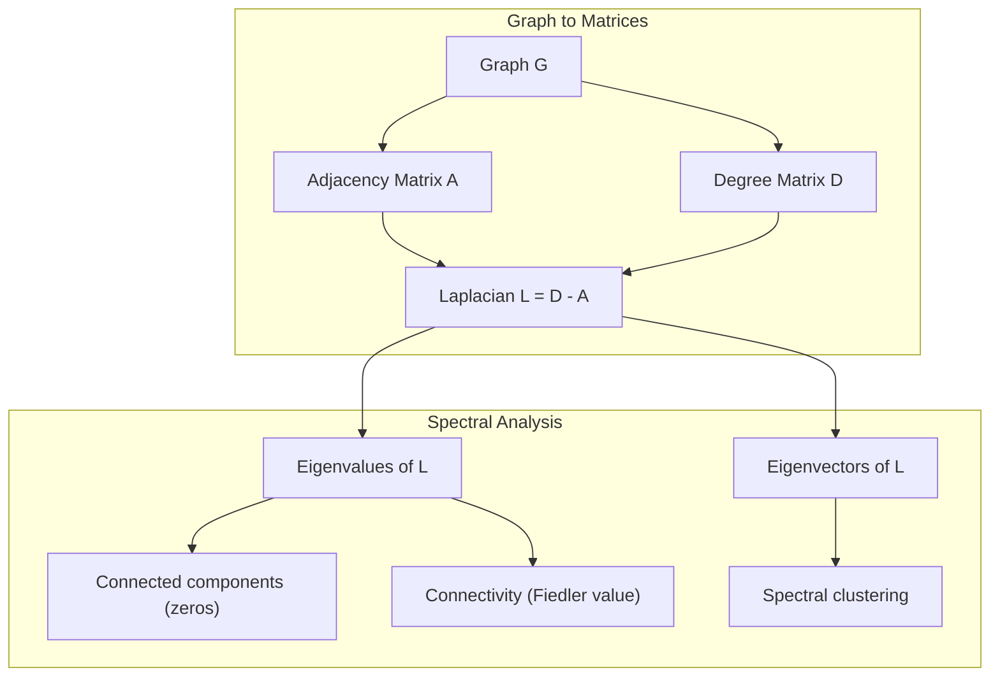
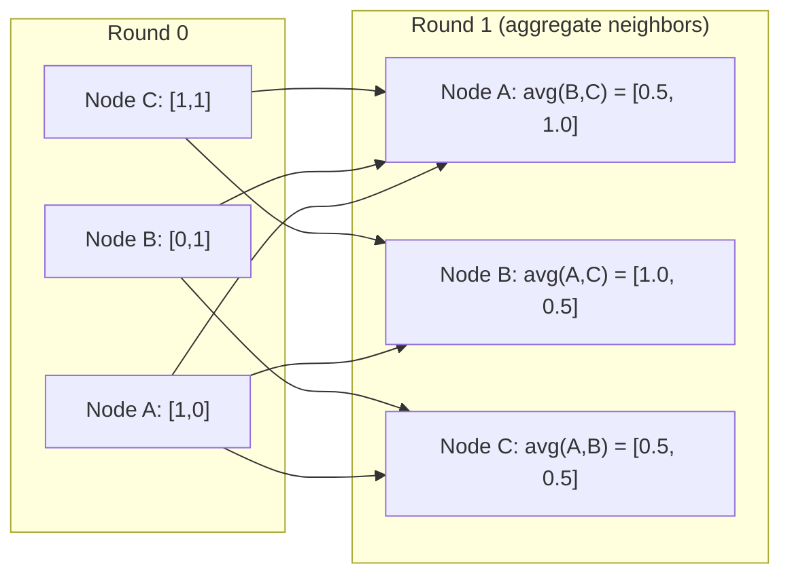

# نظرية الرسم البياني للتعلم الآلي

> الرسوم البيانية هي بنية بيانات العلاقات. إذا كانت بياناتك تحتوي على اتصالات، فأنت بحاجة إلى نظرية الرسم البياني.

**النوع:** بناء
** اللغة: ** بايثون
**المتطلبات:** المرحلة الأولى، الدروس 01-03 (الجبر الخطي، المصفوفات)
**الوقت:** ~90 دقيقة

## أهداف التعلم

- إنشاء فئة رسم بياني مع تمثيلات المصفوفة/القائمة المجاورة وتنفيذ عمليات اجتياز BFS وDFS
- حساب الرسم البياني Laplacian واستخدام قيمه الذاتية للكشف عن المكونات المتصلة والعقد العنقودية
- تنفيذ جولة واحدة من تمرير الرسائل على نمط GNN كضرب مصفوفة مجاورة طبيعية
- تطبيق التجميع الطيفي لتقسيم الرسم البياني باستخدام متجه فيدلر

## المشكلة

الشبكات الاجتماعية، والجزيئات، وقواعد المعرفة، وشبكات الاستشهاد، وخرائط الطريق - كلها رسوم بيانية. يتعامل تعلم الآلة التقليدي مع البيانات كجداول مسطحة. كل صف مستقل. كل ميزة عبارة عن عمود. ولكن عندما تكون بنية الاتصالات مهمة، تفشل الجداول.

النظر في شبكة اجتماعية. تريد التنبؤ بالمنتج الذي سيشتريه المستخدم. تاريخ الشراء مهم. لكن تاريخ شراء أصدقائهم أكثر أهمية. الاتصالات تحمل إشارة.

أو فكر في الجزيء. تريد التنبؤ بما إذا كان يرتبط بالبروتين. الذرات مهمة، ولكن ما يهم حقًا هو كيفية ارتباط الذرات ببعضها البعض. الهيكل هو البيانات.

تعد شبكات الرسم البياني العصبية (GNNs) المنطقة الأسرع نموًا في التعلم العميق. إنها تدعم اكتشاف الأدوية، والتوصية الاجتماعية، واكتشاف الاحتيال، والتفكير البياني للمعرفة. تعتمد كل GNN على نفس الأساس: نظرية الرسم البياني الأساسية.

تحتاج إلى أربعة أشياء:
1. طريقة لتمثيل الرسوم البيانية كمصفوفات (حتى تتمكن من ضربها)
2. خوارزميات الاجتياز لاستكشاف بنية الرسم البياني
3. اللابلاتسي - المصفوفة الأكثر أهمية في نظرية الرسم البياني الطيفي
4. تمرير الرسائل - العملية التي تجعل شبكات GNN تعمل

##المفهوم

### الرسوم البيانية: العقد والحواف

يتكون الرسم البياني G = (V, E) من رؤوس (عقد) V وحواف E. وتربط كل حافة عقدتين.

**موجه مقابل غير موجه.** في الرسم البياني غير الموجه، تعني الحافة (u, v) أن u تتصل بـ v وv تتصل بـ u. في الرسم البياني الموجه (digraph)، تعني الحافة (u، v) أن u تشير إلى v، ولكن ليس بالضرورة العكس.

**المرجح مقابل غير الموزون.** في الرسم البياني غير الموزون، إما أن تكون الحواف موجودة أو لا تكون موجودة. في الرسم البياني الموزون، يكون لكل حافة وزن رقمي - مسافة، وتكلفة، وقوة.

| نوع الرسم البياني | مثال |
|-----------|--------|
| غير موجه وغير مرجح | شبكة الصداقة فيس بوك |
| موجه غير مرجح | شبكة متابعة تويتر |
| غير موجه، مرجح | خريطة الطريق (المسافات) |
| موجه، مرجح | روابط صفحات الويب (درجات تصنيف الصفحات) |

### مصفوفة الجوار

مصفوفة المجاورة A هي التمثيل الأساسي. بالنسبة للرسم البياني مع العقد n:

```
A[i][j] = 1    if there is an edge from node i to node j
A[i][j] = 0    otherwise
```

بالنسبة للرسوم البيانية غير الموجهة، يكون A متماثلًا: A[i][j] = A[j][i]. بالنسبة للرسوم البيانية المرجحة، A[i][j] = وزن الحافة (i, j).

**مثال-مثلث:**

```
Nodes: 0, 1, 2
Edges: (0,1), (1,2), (0,2)

A = [[0, 1, 1],
     [1, 0, 1],
     [1, 1, 0]]
```

مصفوفة الجوار هي المدخلات لكل GNN. عمليات المصفوفة على A تتوافق مع العمليات على الرسم البياني.

### درجة

درجة العقدة هي عدد الحواف المتصلة بها. بالنسبة للرسوم البيانية الموجهة، لديك درجة داخلية (حواف قادمة) ودرجة خارجية (حواف تخرج).

مصفوفة الدرجة D قطرية:

```
D[i][i] = degree of node i
D[i][j] = 0    for i != j
```

بالنسبة لمثال المثلث: D = diag(2, 2, 2) لأن كل عقدة تتصل بعقدتين أخريين.

تخبرك الدرجة عن أهمية العقدة. درجة عالية = عقدة المحور. يكشف توزيع درجات الشبكة عن بنيتها. تتبع الشبكات الاجتماعية قوانين القوة (عدد قليل من المحاور، والعديد من العقد الورقية). الرسوم البيانية العشوائية لها درجات توزيع بواسون.

### BFS وDFS

اثنين من خوارزميات اجتياز الرسم البياني الأساسية. أنت بحاجة إلى كليهما.

**بحث واسع النطاق أولاً (BFS):** استكشف جميع الجيران أولاً، ثم جيران الجيران. يستخدم قائمة الانتظار (FIFO).

```
BFS from node 0:
  Visit 0
  Queue: [1, 2]        (neighbors of 0)
  Visit 1
  Queue: [2, 3]        (add neighbors of 1)
  Visit 2
  Queue: [3]           (neighbors of 2 already visited)
  Visit 3
  Queue: []            (done)
```

يجد BFS أقصر المسارات في الرسوم البيانية غير الموزونة. المسافة من البداية إلى أي عقدة تساوي مستوى BFS الذي تم اكتشاف تلك العقدة فيه لأول مرة. ولهذا السبب يتم استخدام BFS لمسافات عدد القفزات في الشبكات الاجتماعية.

**البحث في العمق أولاً (DFS):** تعمق قدر الإمكان قبل التراجع. يستخدم المكدس (LIFO) أو العودية.

```
DFS from node 0:
  Visit 0
  Stack: [1, 2]        (neighbors of 0)
  Visit 2               (pop from stack)
  Stack: [1, 3]         (add neighbors of 2)
  Visit 3               (pop from stack)
  Stack: [1]
  Visit 1               (pop from stack)
  Stack: []             (done)
```

DFS مفيد لـ:
- البحث عن المكونات المتصلة (تشغيل DFS من العقد التي لم تتم زيارتها)
- كشف الدورة (الحواف الخلفية في شجرة DFS)
- الفرز الطوبولوجي (عكس ترتيب إنهاء DFS)

| الخوارزمية | بنية البيانات | يجد | حالة الاستخدام |
|-----------|---------------|-------|----------|
| بي إف إس | قائمة الانتظار | أقصر الطرق | مسافة الشبكة الاجتماعية، اجتياز الرسم البياني للمعرفة |
| دي إف إس | كومة | مكونات دورات | الاتصال، الفرز الطوبولوجي |

### الرسم البياني لابلاسيان

L = D - A. المصفوفة الأكثر أهمية في نظرية الرسم البياني الطيفي.

بالنسبة للمثلث:

```
D = [[2, 0, 0],    A = [[0, 1, 1],    L = [[2, -1, -1],
     [0, 2, 0],         [1, 0, 1],         [-1, 2, -1],
     [0, 0, 2]]         [1, 1, 0]]         [-1, -1,  2]]
```

يتمتع اللابلاسيون بخصائص رائعة:

1. **L موجبة شبه محددة.** جميع القيم الذاتية >= 0.

2. ** عدد القيم الذاتية الصفرية يساوي عدد المكونات المتصلة. ** يحتوي الرسم البياني المتصل على قيمة ذاتية صفرية واحدة بالضبط. الرسم البياني الذي يحتوي على 3 مكونات منفصلة له ثلاث قيم ذاتية صفرية.

3. ** أصغر قيمة ذاتية غير صفرية (قيمة فيدلر) تقيس الاتصال. ** قيمة فيدلر الكبيرة تعني أن الرسم البياني متصل بشكل جيد. تعني قيمة فيدلر الصغيرة أن الرسم البياني به نقطة ضعف - عنق الزجاجة.

4. ** يكشف المتجه الذاتي لقيمة فيدلر (متجه فيدلر) عن أفضل تقسيم. ** تذهب العقد ذات القيم الموجبة إلى مجموعة واحدة، والعقد ذات القيم السالبة تذهب إلى المجموعة الأخرى. هذا هو التجمع الطيفي.



### الخصائص الطيفية

تكشف القيم الذاتية لمصفوفة الجوار و Laplacian عن الخصائص الهيكلية دون أي اجتياز.

**التجميع الطيفي** يعمل على النحو التالي:
1. حساب لابلاس L
2. ابحث عن أصغر المتجهات الذاتية k لـ L (تخطي الأول، وهو كل الآحاد للرسوم البيانية المتصلة)
3. استخدم تلك المتجهات الذاتية كإحداثيات جديدة لكل عقدة
4. قم بتشغيل k-means على تلك الإحداثيات

لماذا يعمل هذا؟ تقوم المتجهات الذاتية لـ L بتشفير الوظائف "الأكثر سلاسة" على الرسم البياني. تحصل العقد المتصلة جيدًا على قيم متجهات ذاتية مماثلة. تحصل العقد المفصولة عن عنق الزجاجة على قيم مختلفة. تقوم المتجهات الذاتية بفصل المجموعات بشكل طبيعي.

**اتصال المشي العشوائي.** يرتبط Laplacian الطبيعي بالمشي العشوائي على الرسم البياني. التوزيع الثابت للمشي العشوائي يتناسب مع درجة العقدة. يعتمد وقت الخلط (مدى سرعة تقارب المشي) على الفجوة الطيفية.

### تمرير الرسالة

العملية الأساسية للشبكات العصبية الرسم البياني. تقوم كل عقدة بجمع الرسائل من جيرانها، وتجميعها، وتحديث حالتها الخاصة.

```
h_v^(k+1) = UPDATE(h_v^(k), AGGREGATE({h_u^(k) : u in neighbors(v)}))
```

في أبسط صورة، AGGREGATE = المتوسط، وUPDATE = التحويل الخطي + التنشيط:

```
h_v^(k+1) = sigma(W * mean({h_u^(k) : u in neighbors(v)}))
```

هذا هو ضرب المصفوفة المقنعة. إذا كانت H هي مصفوفة جميع ميزات العقدة وA هي مصفوفة الجوار:

```
H^(k+1) = sigma(A_norm * H^(k) * W)
```

حيث A_norm هي مصفوفة الجوار الطبيعية (يبلغ مجموع كل صف 1).

تتيح جولة واحدة من تمرير الرسائل لكل عقدة "رؤية" جيرانها المباشرين. جولتان تسمح لها برؤية جيران الجيران. توفر جولات K معلومات لكل عقدة من حي K-hop الخاص بها.



### المفاهيم وتطبيقات تعلم الآلة

| المفهوم | تطبيق تعلم الآلة |
|---------|--------------|
| مصفوفة الجوار | تمثيل إدخال GNN |
| الرسم البياني لابلاسيان | التجمعات الطيفية، كشف المجتمع |
| بفس/دفس | اجتياز الرسم البياني المعرفي، وإيجاد المسار |
| توزيع الدرجات العلمية | أهمية العقدة، هندسة المميزات |
| تمرير الرسالة | طبقات GNN (GCN، GAT، GraphSAGE) |
| القيم الذاتية لـ L | كشف المجتمع، تقسيم الرسم البياني |
| التجميع الطيفي | تجميع العقدة غير الخاضعة للرقابة |
| تصنيف الصفحات | أهمية العقدة، البحث على شبكة الإنترنت |

## بنائها

### الخطوة 1: رسم بياني للصف من البداية

```python
class Graph:
    def __init__(self, n_nodes, directed=False):
        self.n = n_nodes
        self.directed = directed
        self.adj = {i: {} for i in range(n_nodes)}

    def add_edge(self, u, v, weight=1.0):
        self.adj[u][v] = weight
        if not self.directed:
            self.adj[v][u] = weight

    def neighbors(self, node):
        return list(self.adj[node].keys())

    def degree(self, node):
        return len(self.adj[node])

    def adjacency_matrix(self):
        import numpy as np
        A = np.zeros((self.n, self.n))
        for u in range(self.n):
            for v, w in self.adj[u].items():
                A[u][v] = w
        return A

    def degree_matrix(self):
        import numpy as np
        D = np.zeros((self.n, self.n))
        for i in range(self.n):
            D[i][i] = self.degree(i)
        return D

    def laplacian(self):
        return self.degree_matrix() - self.adjacency_matrix()
```

تقوم قائمة الجوار (`self.adj`) بتخزين الجيران بكفاءة. يستخدم تحويل المصفوفة المجاورة numpy لأن جميع العمليات الطيفية تحتاج إليه.

### الخطوة 2: BFS وDFS

```python
from collections import deque

def bfs(graph, start):
    visited = set()
    order = []
    distances = {}
    queue = deque([(start, 0)])
    visited.add(start)
    while queue:
        node, dist = queue.popleft()
        order.append(node)
        distances[node] = dist
        for neighbor in graph.neighbors(node):
            if neighbor not in visited:
                visited.add(neighbor)
                queue.append((neighbor, dist + 1))
    return order, distances


def dfs(graph, start):
    visited = set()
    order = []
    stack = [start]
    while stack:
        node = stack.pop()
        if node in visited:
            continue
        visited.add(node)
        order.append(node)
        for neighbor in reversed(graph.neighbors(node)):
            if neighbor not in visited:
                stack.append(neighbor)
    return order
```

يستخدم BFS deque (قائمة انتظار مزدوجة النهاية) لـ O(1) popleft. يستخدم DFS قائمة كمكدس. كلاهما يزوران كل عقدة مرة واحدة بالضبط - وقت O(V + E).

### الخطوة 3: المكونات المتصلة والقيم الذاتية اللابلاسية

```python
def connected_components(graph):
    visited = set()
    components = []
    for node in range(graph.n):
        if node not in visited:
            order, _ = bfs(graph, node)
            visited.update(order)
            components.append(order)
    return components


def laplacian_eigenvalues(graph):
    import numpy as np
    L = graph.laplacian()
    eigenvalues = np.linalg.eigvalsh(L)
    return eigenvalues
```

`eigvalsh` مخصص للمصفوفات المتماثلة - يكون Laplacian متماثلًا دائمًا للرسوم البيانية غير الموجهة. تقوم بإرجاع القيم الذاتية بترتيب تصاعدي. قم بعد الأصفار للعثور على عدد المكونات المتصلة.

### الخطوة 4: التجميع الطيفي

```python
def spectral_clustering(graph, k=2):
    import numpy as np
    L = graph.laplacian()
    eigenvalues, eigenvectors = np.linalg.eigh(L)
    features = eigenvectors[:, 1:k+1]

    labels = np.zeros(graph.n, dtype=int)
    for i in range(graph.n):
        if features[i, 0] >= 0:
            labels[i] = 0
        else:
            labels[i] = 1
    return labels
```

بالنسبة لـ k=2، فإن إشارة متجه Fiedler تقسم الرسم البياني إلى مجموعتين. بالنسبة لـ k>2، يمكنك تشغيل k-means على المتجهات الذاتية k الأولى (باستثناء المتجهات الذاتية التافهة الكل).

### الخطوة 5: تمرير الرسالة

```python
def message_passing(graph, features, weight_matrix):
    import numpy as np
    A = graph.adjacency_matrix()
    row_sums = A.sum(axis=1, keepdims=True)
    row_sums[row_sums == 0] = 1
    A_norm = A / row_sums
    aggregated = A_norm @ features
    output = aggregated @ weight_matrix
    return output
```

هذه جولة واحدة من تمرير رسائل GNN. الميزات الجديدة لكل عقدة هي المتوسط ​​المرجح لميزات جيرانها، والتي يتم تحويلها بواسطة مصفوفة الوزن. كومة جولات متعددة لنشر المعلومات بشكل أكبر.

## استخدمه

مع Networkx وnumpy، نفس العمليات تكون أحادية:

```python
import networkx as nx
import numpy as np

G = nx.karate_club_graph()

A = nx.adjacency_matrix(G).toarray()
L = nx.laplacian_matrix(G).toarray()

eigenvalues = np.linalg.eigvalsh(L.astype(float))
print(f"Smallest eigenvalues: {eigenvalues[:5]}")
print(f"Connected components: {nx.number_connected_components(G)}")

communities = nx.community.greedy_modularity_communities(G)
print(f"Communities found: {len(communities)}")

pr = nx.pagerank(G)
top_nodes = sorted(pr.items(), key=lambda x: x[1], reverse=True)[:5]
print(f"Top 5 PageRank nodes: {top_nodes}")
```

يتعامل Networkx مع الرسوم البيانية من أي حجم باستخدام واجهات C الخلفية المحسنة. استخدامه في الإنتاج. استخدم تطبيقك من البداية لفهم ما يفعله.

### التحليل الطيفي numpy

```python
import numpy as np

A = np.array([
    [0, 1, 1, 0, 0],
    [1, 0, 1, 0, 0],
    [1, 1, 0, 1, 0],
    [0, 0, 1, 0, 1],
    [0, 0, 0, 1, 0]
])

D = np.diag(A.sum(axis=1))
L = D - A

eigenvalues, eigenvectors = np.linalg.eigh(L)
print(f"Eigenvalues: {np.round(eigenvalues, 4)}")
print(f"Fiedler value: {eigenvalues[1]:.4f}")
print(f"Fiedler vector: {np.round(eigenvectors[:, 1], 4)}")

fiedler = eigenvectors[:, 1]
group_a = np.where(fiedler >= 0)[0]
group_b = np.where(fiedler < 0)[0]
print(f"Cluster A: {group_a}")
print(f"Cluster B: {group_b}")
```

يقوم ناقل فيدلر بالرفع الثقيل. الإدخالات الإيجابية في مجموعة واحدة، والسلبية في الآخر. ليست هناك حاجة إلى تحسين تكراري - فقط تحليل ذاتي واحد.

## اشحنها

ينتج هذا الدرس:
- `outputs/skill-graph-analysis.md` -- مرجع مهارة لتحليل البيانات المنظمة بالرسوم البيانية

## اتصالات

| المفهوم | حيث يظهر |
|---------|------------------|
| مصفوفة الجوار | إدخال GCN، GAT، GraphSAGE |
| لابلاس | التجميع الطيفي، مرشحات الشاب نت |
| بي إف إس | اجتياز الرسم البياني المعرفي، استعلامات المسار الأقصر |
| تمرير الرسالة | كل طبقة GNN، تمر الرسائل العصبية |
| الفجوة الطيفية | اتصال الرسم البياني، خلط الوقت للمشي العشوائي |
| توزيع الدرجات العلمية | شبكات قانون القوى، هندسة ميزات العقدة |
| المكونات المتصلة | المعالجة المسبقة، التعامل مع الرسوم البيانية المنفصلة |
| تصنيف الصفحات | ترتيب أهمية العقدة، وتهيئة الاهتمام |

تستحق شبكات GNN إشارة خاصة. تستخدم عملية تلافي الرسم البياني في GCN (Kipf & Welling, 2017) مصفوفة الجوار مع الحلقات الذاتية المضافة، A_hat = A + I:

```text
H^(l+1) = sigma(D_hat^(-1/2) * A_hat * D_hat^(-1/2) * H^(l) * W^(l))
```

حيث A_hat = A + I (المجاورة بالإضافة إلى الحلقات الذاتية) وD_hat هي مصفوفة درجات A_hat. تضمن الحلقات الذاتية أن كل عقدة تتضمن ميزاتها الخاصة أثناء التجميع. هذا هو بالضبط تمرير الرسالة بالتطبيع المتماثل. D_hat^(-1/2) * A_hat * D_hat^(-1/2) هي مصفوفة الجوار الطبيعية. يظهر Laplacian لأن هذا التطبيع مرتبط بـ L_sym = I - D^(-1/2) * A * D^(-1/2). إن فهم اللابلاتسي يعني فهم سبب عمل شبكات GCN.

## تمارين

1. **تنفيذ نظام ترتيب الصفحات من الصفر.** البدء بنتائج موحدة. في كل خطوة: Score(v) = (1-d)/n + d * sum(score(u)/out_degree(u)) لكل ما يشير إلى v. استخدم d=0.85. تشغيل حتى التقارب (التغيير <1e-6). اختبار على رسم بياني صغير على شبكة الإنترنت.

2. **ابحث عن المجتمعات التي تستخدم التجميع الطيفي.** أنشئ رسمًا بيانيًا يتضمن مجموعتين منفصلتين بوضوح (على سبيل المثال، مجموعتان متصلتان بحافة واحدة). قم بتشغيل التجميع الطيفي وتحقق من العثور على الانقسام الصحيح. ماذا يحدث عند إضافة المزيد من الحواف المتقاطعة؟

3. **تنفيذ خوارزمية ديكسترا** لأقصر المسارات في الرسوم البيانية المرجحة. قارن النتائج بـ BFS على نفس الرسم البياني بأوزان موحدة.

4. ** أنشئ شبكة تمرير رسائل مكونة من طبقتين. ** قم بتطبيق تمرير الرسائل مرتين بمصفوفات ذات وزن مختلف. أظهر أنه بعد جولتين، تحتوي كل عقدة على معلومات من الحي المكون من قفزتين.

5. **تحليل الرسم البياني في العالم الحقيقي.** استخدم الرسم البياني لنادي الكاراتيه (34 عقدة، 78 حافة). حساب توزيع الدرجات، والقيم الذاتية اللابلاسية، والتجمعات الطيفية. قارن نتيجة التجميع الطيفي بتقسيم الحقيقة الأرضية المعروفة.

## المصطلحات الرئيسية

| مصطلح | ماذا يقول الناس | ماذا يعني في الواقع |
|------|----------------|----------------------|
| رسم بياني | "العقد والحواف" | بنية رياضية G=(V,E) تشفر العلاقات الزوجية |
| مصفوفة الجوار | "جدول الاتصال" | مصفوفة n x n حيث A[i][j] = 1 إذا كانت العقدتين i وj متصلتين |
| الدرجة العلمية | "مدى اتصال العقدة" | عدد الحواف الملامسة للعقدة |
| لابلاس | "د ناقص أ" | L = D - A، المصفوفة التي تكشف قيمها الذاتية عن بنية الرسم البياني |
| قيمة فيدلر | "الاتصال الجبري" | أصغر قيمة ذاتية غير صفرية لـ L، تقيس مدى جودة اتصال الرسم البياني |
| بي إف إس | "البحث على مستوى تلو الآخر" | العبور الذي يزور جميع الجيران قبل التعمق، يجد أقصر الطرق |
| دي إف إس | "تعمق أولاً" | الاجتياز الذي يتبع مسارًا واحدًا حتى نهايته قبل التراجع |
| تمرير الرسالة | "العقد تتحدث مع الجيران" | تقوم كل عقدة بتجميع المعلومات من جيرانها، وهم جوهر شبكات GNN |
| التجميع الطيفي | "الكتلة بواسطة المتجهات الذاتية" | تقسيم الرسم البياني باستخدام المتجهات الذاتية لـ Laplacian |
| مكون متصل | "قطعة منفصلة" | رسم بياني فرعي أقصى حيث يمكن لكل عقدة الوصول إلى كل عقدة أخرى |

## مزيد من القراءة

- **Kipf & Welling (2017)** - "التصنيف شبه الخاضع للإشراف مع الشبكات التلافيفية للرسم البياني." الورقة التي أطلقت شبكات GNN الحديثة. يوضح أن تلافيف الرسم البياني الطيفي يتم تبسيطه لتمرير الرسائل.
- ** سبيلمان (2012) ** - ملاحظات محاضرة "نظرية الرسم البياني الطيفي". المقدمة النهائية للابلاسيين، والفجوات الطيفية، وتقسيم الرسم البياني.
- **هاميلتون (2020)** -- "تعلم تمثيل الرسم البياني." كتاب يغطي شبكات GNN من الأساسيات إلى التطبيقات.
- ** برونشتاين وآخرون. (2021)** -- "التعلم الهندسي العميق: الشبكات والمجموعات والرسوم البيانية والجيوديسيا وأجهزة القياس." ورقة الإطار الموحد.
- ** فيليكوفيتش وآخرون. (2018)** -- "شبكات الانتباه البيانية." يمتد تمرير الرسالة مع آليات الانتباه.