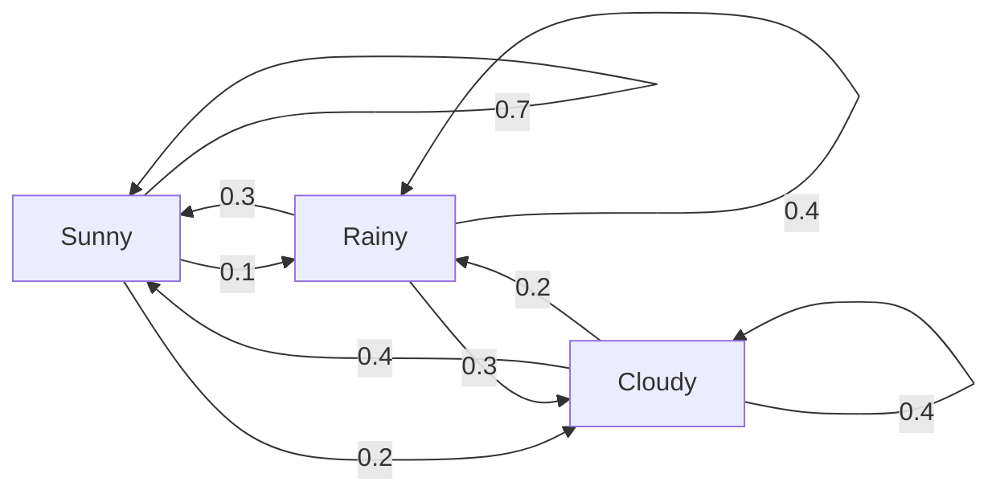
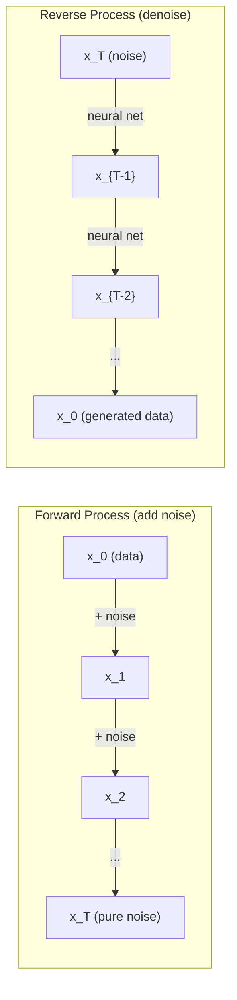

# Stochastic Processes

> العشوائية مع البنية. الرياضيات وراء المشي العشوائي، وسلاسل ماركوف، ونماذج الانتشار.

**النوع:** تعلم
** اللغة: ** بايثون
**المتطلبات:** المرحلة الأولى، الدروس 06-07 (الاحتمالات، بايز)
**الوقت:** ~75 دقيقة

## Learning Objectives

- محاكاة مسارات عشوائية 1D و2D والتحقق من مقياس الإزاحة sqrt(n).
- بناء محاكي سلسلة ماركوف وحساب توزيعها الثابت عبر التحلل الذاتي
- تنفيذ ديناميكيات Metropolis-Hastings MCMC وLangevin لأخذ العينات من التوزيعات المستهدفة
- ربط عملية الانتشار الأمامي بالحركة البراونية وشرح كيفية قيام العملية العكسية بتوليد البيانات

## The Problem

تتضمن العديد من أنظمة AI العشوائية التي تتطور بمرور الوقت. ليست عشوائية ثابتة - عشوائية منظمة ومتسلسلة حيث تعتمد كل خطوة على ما جاء قبلها.

تقوم نماذج اللغة بإنشاء الرموز المميزة واحدًا تلو الآخر. يعتمد كل رمز على السياق السابق. يقوم النموذج بإخراج توزيع احتمالي، وأخذ عينات منه، ثم المضي قدمًا. هذه عملية عشوائية.

تضيف نماذج الانتشار الضوضاء إلى الصورة خطوة بخطوة حتى تصبح ثابتة تمامًا. ثم يقومون بعكس العملية، مع تقليل الضوضاء خطوة بخطوة حتى تظهر صورة جديدة. العملية الأمامية هي سلسلة ماركوف. العملية العكسية عبارة عن سلسلة ماركوف مستفادة تعمل للخلف.

يقوم وكلاء التعلم المعزز باتخاذ إجراءات في بيئة ما. يؤدي كل إجراء إلى حالة جديدة مع بعض الاحتمال. يتبع الوكيل سياسة عشوائية في عالم عشوائي. الأمر برمته هو عملية قرار ماركوف.

MCMC أخذ العينات - العمود الفقري للاستدلال البايزي - يبني سلسلة ماركوف التي يكون توزيعها الثابت هو الجزء الخلفي الذي تريد أخذ عينة منه.

كل هذه الأفكار مبنية على أربع أفكار أساسية:
1. مناحي عشوائية – أبسط عملية عشوائية
2. سلاسل ماركوف – عشوائية منظمة مع مصفوفة انتقالية
3. ديناميكيات لانجفين - نزول متدرج مع ضوضاء
4. متروبوليس-هاستينغز - أخذ العينات من أي توزيع

## The Concept

### Random Walks

ابدأ من الموضع 0. في كل خطوة، اقلب عملة معدنية عادلة. الرؤوس: تحرك لليمين (+1). الذيول: تحرك لليسار (-1).

بعد عدد n من الخطوات، يصبح موضعك هو مجموع n من قيم +/-1 العشوائية. الموضع المتوقع هو 0 (المشي غير متحيز). لكن المسافة المتوقعة من الأصل تنمو كـ sqrt(n).

هذا غير بديهي. المشي عادل - لا يوجد انحراف في أي اتجاه. ولكن مع مرور الوقت، فإنه يتجول أبعد وأبعد من حيث بدأ. الانحراف المعياري بعد خطوات n هو sqrt(n).

```
Step 0:  Position = 0
Step 1:  Position = +1 or -1
Step 2:  Position = +2, 0, or -2
...
Step 100: Expected distance from origin ~ 10 (sqrt(100))
Step 10000: Expected distance from origin ~ 100 (sqrt(10000))
```

**في الوضع ثنائي الأبعاد**، يتحرك السير لأعلى أو لأسفل أو لليسار أو لليمين باحتمالات متساوية. ينطبق نفس مقياس sqrt(n) على المسافة من الأصل. يتتبع المسار نمطًا يشبه النمط الكسيري.

**لماذا sqrt(n)؟** كل خطوة هي +1 أو -1 باحتمال متساو. بعد n خطوات، الموضع S_n = X_1 + X_2 +... + X_n حيث يكون كل X_i هو +/-1. تباين كل خطوة هو 1، والخطوات مستقلة، لذلك Var(S_n) = n. الانحراف المعياري = sqrt(n). بواسطة نظرية الحد المركزي، S_n / sqrt(n) يتقارب مع التوزيع الطبيعي القياسي.

يظهر مقياس sqrt(n) هذا في كل مكان في ML. SGD مقاييس الضوضاء مثل 1/sqrt(batch_size). مقياس أبعاد التضمين هو sqrt (d). الجذر التربيعي هو توقيع الإضافات العشوائية المستقلة.

**الارتباط بالحركة البراونية.** قم بالمشي بشكل عشوائي بحجم خطوة 1/sqrt(n) وn من الخطوات لكل وحدة زمنية. عندما تصل n إلى ما لا نهاية، تتقارب الحركة مع الحركة البراونية B(t) - وهي عملية زمنية مستمرة حيث يتم توزيع B(t) بشكل طبيعي بمتوسط ​​0 وتباين t.

الحركة البراونية هي الأساس الرياضي للانتشار. فهو يجسد الاهتزاز العشوائي للجزيئات في السائل، وتقلبات أسعار الأسهم، والأهم من ذلك، عملية الضوضاء في نماذج الانتشار.

**خراب المقامر.** متحرك عشوائي يبدأ من الموضع k، مع وجود حواجز امتصاص عند 0 وN. ما هو احتمال الوصول إلى N قبل 0؟ للمشي العادل: P(الوصول إلى N) = k/N. هذا بسيط وأنيق بشكل مدهش. إنه يتصل بنظرية مارتينجال - المشي العشوائي العادل هو مارتينجال (القيمة المستقبلية المتوقعة = القيمة الحالية).

### Markov Chains

سلسلة ماركوف هي نظام ينتقل بين الحالات وفقًا لاحتمالات ثابتة. الخاصية الرئيسية: الحالة التالية تعتمد فقط على الحالة الحالية، وليس على التاريخ.

```
P(X_{t+1} = j | X_t = i, X_{t-1} = ...) = P(X_{t+1} = j | X_t = i)
```

هذه هي خاصية ماركوف. هذا يعني أنه يمكنك وصف الديناميكيات بأكملها باستخدام مصفوفة انتقالية P:

```
P[i][j] = probability of going from state i to state j
```

كل صف من مجموعات P يساوي 1 (يجب عليك الذهاب إلى مكان ما).

**مثال -- الطقس:**

```
States: Sunny (0), Rainy (1), Cloudy (2)

P = [[0.7, 0.1, 0.2],    (if sunny: 70% sunny, 10% rainy, 20% cloudy)
     [0.3, 0.4, 0.3],    (if rainy: 30% sunny, 40% rainy, 30% cloudy)
     [0.4, 0.2, 0.4]]    (if cloudy: 40% sunny, 20% rainy, 40% cloudy)
```

ابدأ في أي ولاية. بعد العديد من التحولات، يتقارب توزيع الحالات مع التوزيع الثابت pi، حيث pi * P = pi. هذا هو المتجه الذاتي الأيسر لـ P ذو القيمة الذاتية 1.

بالنسبة لسلسلة الطقس، قد يكون التوزيع الثابت [0.53، 0.18، 0.29] - على المدى الطويل، يكون الجو مشمسًا بنسبة 53% من الوقت بغض النظر عن حالة البداية.



**حساب التوزيع الثابت.** هناك طريقتان:

1. ** طريقة الطاقة **: اضرب أي توزيع أولي بـ P بشكل متكرر. وبعد تكرارات كافية، تتقارب.
2. **طريقة القيمة الذاتية**: ابحث عن المتجهات الذاتية اليسرى لـ P ذات القيمة الذاتية 1. هذا هو المتجهات الذاتية لـ P^T ذات القيمة الذاتية 1.

يتطلب كلا النهجين أن تستوفي السلسلة شروط التقارب.

**شروط التقارب.** تتقارب سلسلة ماركوف إلى توزيع ثابت فريد إذا كانت:
- **غير قابل للاختزال**: يمكن الوصول إلى كل ولاية من أي ولاية أخرى
- **غير دورية**: السلسلة لا تدور بفترة محددة

معظم السلاسل التي تواجهها في ML تستوفي كلا الشرطين.

**حالات الامتصاص.** الحالة تكون استيعابية إذا دخلتها ولم تغادرها أبدًا (P[i][i] = 1). يستوعب نموذج ماركوف العمليات النموذجية بحالات طرفية - لعبة تنتهي، عميل يتخبط، تسلسل رمزي يصل إلى رمز نهاية النص.

**مدة الخلط.** كم عدد الخطوات حتى تصبح السلسلة "قريبة" من التوزيع الثابت؟ رسميًا، عدد الخطوات حتى تنخفض مسافة الاختلاف الإجمالية من الثبات إلى ما دون حد ما. خلط سريع = خطوات قليلة مطلوبة. تتحكم الفجوة الطيفية لـ P (1 ناقص ثاني أكبر قيمة ذاتية) في وقت الخلط. فجوة أكبر = خلط أسرع.

### Connection to Language Models

إن إنشاء الرمز المميز في نموذج اللغة هو تقريبًا عملية ماركوف. في ضوء السياق الحالي، يقوم النموذج بإخراج التوزيع على الرمز المميز التالي. درجة الحرارة تتحكم في الحدة:

```
P(token_i) = exp(logit_i / temperature) / sum(exp(logit_j / temperature))
```

- درجة الحرارة = 1.0: التوزيع القياسي
- درجة الحرارة < 1.0: أكثر حدة (أكثر حتمية)
- درجة الحرارة > 1.0: مسطحة (أكثر عشوائية)
- درجة الحرارة -> 0: الأرجماكس (الجشع)

يتم اقتطاع عينات Top-k إلى الرموز المميزة ذات الاحتمالية الأعلى. يتم اقتطاع أخذ عينات Top-p (النواة) إلى أصغر مجموعة من الرموز المميزة التي يتجاوز احتمالها التراكمي p. كلاهما يعدل احتمالات انتقال ماركوف.

### Brownian Motion

الحد الزمني المستمر للمشي العشوائي. يحتوي الموضع B(t) على ثلاث خصائص:
1. ب(0) = 0
2. B(t) - B(s) يتم توزيعها عادة بمتوسط 0 والتباين t - s (ل t > s)
3. الزيادات على فترات غير متداخلة مستقلة

الحركة البراونية مستمرة ولكن لا يمكن تمييزها في أي مكان، فهي تهتز عند كل مقياس. المسار له البعد الكسري 2 في المستوى.

في المحاكاة المنفصلة، ​​يمكنك تقريب الحركة البراونية عن طريق:

```
B(t + dt) = B(t) + sqrt(dt) * z,    where z ~ N(0, 1)
```

يعد تحجيم sqrt(dt) مهمًا. إنها تأتي من نظرية الحد المركزي المطبقة على المسيرات العشوائية.

### Langevin Dynamics

يجد النسب المتدرج الحد الأدنى من الوظيفة. تجد ديناميكيات لانجفين التوزيع الاحتمالي متناسبًا مع exp(-U(x)/T)، حيث U هي دالة طاقة وT هي درجة الحرارة.

```
x_{t+1} = x_t - dt * gradient(U(x_t)) + sqrt(2 * T * dt) * z_t
```

تؤثر قوتان على الجسيم:
1. **قوة التدرج** (-dt * التدرج(U)): تدفع نحو الطاقة المنخفضة (مثل نزول التدرج)
2. **القوة العشوائية** (sqrt(2*T*dt) * z): تدفع في اتجاهات عشوائية (استكشاف)

عند درجة الحرارة T = 0، يكون هذا نزولًا متدرجًا خالصًا. في درجات الحرارة المرتفعة، يكون المشي عشوائيًا تقريبًا. عند درجة الحرارة المناسبة، يستكشف الجسيم مشهد الطاقة ويقضي وقتًا أطول في المناطق منخفضة الطاقة.

**الاتصال بنماذج الانتشار.** العملية الأمامية لنموذج الانتشار هي:

```
x_t = sqrt(alpha_t) * x_{t-1} + sqrt(1 - alpha_t) * noise
```

هذه سلسلة ماركوف تمزج البيانات بالضوضاء تدريجيًا. بعد خطوات كافية، يصبح x_T ضوضاء غاوسية خالصة.

العملية العكسية - الانتقال من الضجيج إلى البيانات - هي أيضًا سلسلة ماركوف، لكن احتمالات انتقالها يتم تعلمها بواسطة شبكة عصبية. تتعلم الشبكة التنبؤ بالضوضاء التي تمت إضافتها في كل خطوة، ثم تقوم بطرحها.



### MCMC: Markov Chain Monte Carlo

في بعض الأحيان تحتاج إلى أخذ عينة من التوزيع p(x) الذي يمكنك تقييمه (حتى ثابت) ولكن لا يمكنك أخذ عينة منه مباشرة. تعتبر الخلفيات البايزية هي المثال الكلاسيكي - أنت تعرف الاحتمالية مضروبة في السابقة، ولكن ثابت التطبيع غير قابل للحل.

تقوم **Metropolis-Hastings** ببناء سلسلة ماركوف التي يكون توزيعها الثابت هو p(x):

1. ابدأ من موضع ما x
2. اقتراح موضع جديد x' من توزيع الاقتراح Q(x'|x)
3. حساب نسبة القبول: a = p(x') * Q(x|x') / (p(x) * Q(x'|x))
4. اقبل x' مع احتمال min(1, a). خلاف ذلك البقاء في x.
5. كرر.

إذا كانت Q متماثلة (على سبيل المثال، Q(x'|x) = Q(x|x') = N(x, sigma^2))، يتم تبسيط النسبة إلى a = p(x') / p(x). ما عليك سوى نسبة الاحتمالات - يلغي ثابت التطبيع.

ويضمن أن تتقارب السلسلة إلى p(x) في ظل ظروف معتدلة. لكن التقارب يمكن أن يكون بطيئا إذا كان الاقتراح صغيرا جدا (السير العشوائي) أو كبيرا جدا (الرفض العالي). ضبط الاقتراح هو فن MCMC.

**لماذا يعمل.** تضمن نسبة القبول توازنًا تفصيليًا: احتمالية الوجود عند x والانتقال إلى x' تساوي احتمالية الوجود عند x' والانتقال إلى x. يشير التوازن التفصيلي إلى أن p(x) هو التوزيع الثابت للسلسلة. لذا، بعد خطوات كافية، تأتي العينات من p(x).

**اعتبارات عملية:**
- **الاحتراق**: تجاهل العينات N الأولى. تحتاج السلسلة إلى وقت للوصول إلى التوزيع الثابت من نقطة البداية.
- **الترقق**: احتفظ بكل عينة من النوع k لتقليل الارتباط الذاتي.
- **سلاسل متعددة**: قم بتشغيل عدة سلاسل من نقاط بداية مختلفة. إذا تقاربا في نفس التوزيع، فلديك دليل على التقارب.
- **معدل القبول**: بالنسبة للمقترحات الغوسية ذات الأبعاد d، يبلغ معدل القبول الأمثل حوالي 23% (Roberts & Rosenthal, 2001). عالية جدًا تعني أن السلسلة بالكاد تتحرك. منخفض جدًا يعني أنه يرفض كل شيء.

### Stochastic Processes in AI

| عملية | AI التطبيق |
|---------|--------------|
| المشي العشوائي | الاستكشاف في RL، تضمينات Node2Vec |
| سلسلة ماركوف | توليد النص، MCMC أخذ العينات |
| الحركة البراونية | نماذج الانتشار (عملية للأمام) |
| ديناميات لانجفين | النماذج التوليدية المبنية على النتيجة، SGLD |
| عملية اتخاذ القرار ماركوف | تعزيز التعلم |
| متروبوليس هاستينغز | الاستدلال البايزي، أخذ العينات الخلفية |

## Build It

### Step 1: Random walk simulator

```python
import numpy as np

def random_walk_1d(n_steps, seed=None):
    rng = np.random.RandomState(seed)
    steps = rng.choice([-1, 1], size=n_steps)
    positions = np.concatenate([[0], np.cumsum(steps)])
    return positions


def random_walk_2d(n_steps, seed=None):
    rng = np.random.RandomState(seed)
    directions = rng.choice(4, size=n_steps)
    dx = np.zeros(n_steps)
    dy = np.zeros(n_steps)
    dx[directions == 0] = 1   # right
    dx[directions == 1] = -1  # left
    dy[directions == 2] = 1   # up
    dy[directions == 3] = -1  # down
    x = np.concatenate([[0], np.cumsum(dx)])
    y = np.concatenate([[0], np.cumsum(dy)])
    return x, y
```

يقوم المسار 1D بتخزين المبالغ التراكمية. كل خطوة هي +1 أو -1. بعد عدد الخطوات n، يكون الموضع هو المجموع. ينمو التباين خطيًا مع n، وبالتالي فإن الانحراف المعياري ينمو كـ sqrt(n).

### Step 2: Markov chain

```python
class MarkovChain:
    def __init__(self, transition_matrix, state_names=None):
        self.P = np.array(transition_matrix, dtype=float)
        self.n_states = len(self.P)
        self.state_names = state_names or [str(i) for i in range(self.n_states)]

    def step(self, current_state, rng=None):
        if rng is None:
            rng = np.random.RandomState()
        probs = self.P[current_state]
        return rng.choice(self.n_states, p=probs)

    def simulate(self, start_state, n_steps, seed=None):
        rng = np.random.RandomState(seed)
        states = [start_state]
        current = start_state
        for _ in range(n_steps):
            current = self.step(current, rng)
            states.append(current)
        return states

    def stationary_distribution(self):
        eigenvalues, eigenvectors = np.linalg.eig(self.P.T)
        idx = np.argmin(np.abs(eigenvalues - 1.0))
        stationary = np.real(eigenvectors[:, idx])
        stationary = stationary / stationary.sum()
        return np.abs(stationary)
```

التوزيع الثابت هو المتجهات الذاتية اليسرى لـ P مع القيمة الذاتية 1. نجده عن طريق حساب المتجهات الذاتية لـ P ^ T (تحويل المتجهات الذاتية اليسرى إلى المتجهات الذاتية اليمنى).

### Step 3: Langevin dynamics

```python
def langevin_dynamics(grad_U, x0, dt, temperature, n_steps, seed=None):
    rng = np.random.RandomState(seed)
    x = np.array(x0, dtype=float)
    trajectory = [x.copy()]
    for _ in range(n_steps):
        noise = rng.randn(*x.shape)
        x = x - dt * grad_U(x) + np.sqrt(2 * temperature * dt) * noise
        trajectory.append(x.copy())
    return np.array(trajectory)
```

يدفع التدرج x نحو الطاقة المنخفضة. الضجيج يمنعها من التعلق. في حالة التوازن، يتناسب توزيع العينات مع exp(-U(x)/درجة الحرارة).

### Step 4: Metropolis-Hastings

```python
def metropolis_hastings(target_log_prob, proposal_std, x0, n_samples, seed=None):
    rng = np.random.RandomState(seed)
    x = np.array(x0, dtype=float)
    samples = [x.copy()]
    accepted = 0
    for _ in range(n_samples - 1):
        x_proposed = x + rng.randn(*x.shape) * proposal_std
        log_ratio = target_log_prob(x_proposed) - target_log_prob(x)
        if np.log(rng.rand()) < log_ratio:
            x = x_proposed
            accepted += 1
        samples.append(x.copy())
    acceptance_rate = accepted / (n_samples - 1)
    return np.array(samples), acceptance_rate
```

تقترح الخوارزمية نقطة جديدة، وتتحقق مما إذا كانت لديها احتمالية أعلى (أو تقبل باحتمال متناسب مع النسبة)، ثم تكرر. يجب أن تكون نسبة القبول حوالي 23-50% للخلط الجيد.

## Use It

ومن الناحية العملية، يمكنك استخدام المكتبات القائمة لهذه الخوارزميات. لكن فهم الآليات مهم لتصحيح الأخطاء وضبطها.

```python
import numpy as np

rng = np.random.RandomState(42)
walk = np.cumsum(rng.choice([-1, 1], size=10000))
print(f"Final position: {walk[-1]}")
print(f"Expected distance: {np.sqrt(10000):.1f}")
print(f"Actual distance: {abs(walk[-1])}")
```

### numpy for transition matrices

```python
import numpy as np

P = np.array([[0.7, 0.1, 0.2],
              [0.3, 0.4, 0.3],
              [0.4, 0.2, 0.4]])

distribution = np.array([1.0, 0.0, 0.0])
for _ in range(100):
    distribution = distribution @ P

print(f"Stationary distribution: {np.round(distribution, 4)}")
```

اضرب التوزيع الأولي بـ P بشكل متكرر. وبعد تكرارات كافية، فإنها تتقارب مع التوزيع الثابت بغض النظر عن المكان الذي بدأت منه. هذه هي طريقة القوة للعثور على المتجه الذاتي الأيسر السائد.

### Connections to real frameworks

- **PyTorch الانتشار:** ينفذ `DDPMScheduler` في Hugging Face `diffusers` سلاسل ماركوف الأمامية والخلفية
- **NumPyro / PyMC:** استخدم MCMC (NUTS أخذ العينات، الذي يحسن متروبوليس-هاستينغز) للاستدلال البايزي
- ** صالة للألعاب الرياضية (RL):** تحدد وظيفة خطوة البيئة عملية اتخاذ قرار ماركوف

### Verifying Markov chain convergence

```python
import numpy as np

P = np.array([[0.9, 0.1], [0.3, 0.7]])

eigenvalues = np.linalg.eigvals(P)
spectral_gap = 1 - sorted(np.abs(eigenvalues))[-2]
print(f"Eigenvalues: {eigenvalues}")
print(f"Spectral gap: {spectral_gap:.4f}")
print(f"Approximate mixing time: {1/spectral_gap:.1f} steps")
```

تخبرك الفجوة الطيفية بمدى سرعة نسيان السلسلة لحالتها الأولية. الفجوة البالغة 0.2 تعني ما يقرب من 5 خطوات للخلط. فجوة 0.01 تعني 100 خطوة تقريبًا. تحقق دائمًا من ذلك قبل إجراء عمليات محاكاة طويلة - وهي عملية حسابية لمخلفات السلسلة التي يتم خلطها ببطء.

## Ship It

ينتج هذا الدرس:
- `outputs/prompt-stochastic-process-advisor.md` -- مطالبة تساعد في تحديد إطار العملية العشوائية الذي ينطبق على مشكلة معينة

## Connections

| المفهوم | حيث يظهر |
|---------|------------------|
| المشي العشوائي | تضمينات الرسم البياني Node2Vec، والاستكشاف في RL |
| سلسلة ماركوف | توليد الرمز المميز في LLMs، MCMC أخذ العينات |
| الحركة البراونية | عملية الانتشار إلى الأمام في النماذج المستندة إلى DDPM وSDE |
| ديناميات لانجفين | النماذج التوليدية القائمة على النقاط، ديناميكيات لانجفين التدرج العشوائي (SGLD) |
| توزيع القرطاسية | MCMC هدف التقارب، تصنيف الصفحات |
| متروبوليس هاستينغز | أخذ العينات الخلفية البايزية، محاكاة التلدين |
| درجة الحرارة | LLM أخذ العينات، استكشاف بولتزمان في RL، محاكاة التلدين |
| وقت الخلط | سرعة التقارب MCMC، تحليل الفجوة الطيفية |
| حالة الاستيعاب | رمز نهاية التسلسل، الحالات الطرفية في RL |
| الرصيد التفصيلي | ضمان صحة عينات MCMC |

نماذج الانتشار تستحق اهتماما خاصا. DDPM (Ho et al., 2020) يحدد سلسلة ماركوف الأمامية:

```
q(x_t | x_{t-1}) = N(x_t; sqrt(1-beta_t) * x_{t-1}, beta_t * I)
```

حيث beta_t هو جدول الضوضاء. بعد خطوات T، تكون x_T تقريبًا N(0, I). يتم تحديد العملية العكسية بواسطة شبكة عصبية تتنبأ بالضوضاء:

```
p_theta(x_{t-1} | x_t) = N(x_{t-1}; mu_theta(x_t, t), sigma_t^2 * I)
```

كل خطوة من خطوات التوليد هي خطوة في سلسلة ماركوف المستفادة. إن فهم سلاسل ماركوف يعني فهم كيف ولماذا تقوم نماذج الانتشار بتوليد البيانات.

SGLD (ديناميكيات Langevin التدرج العشوائي) يجمع بين نزول التدرج الصغير مع ضوضاء Langevin. بدلاً من حساب التدرج الكامل، يمكنك استخدام تقدير عشوائي وإضافة ضوضاء معايرة. مع انخفاض معدل التعلم، تنتقل SGLD من التحسين إلى أخذ العينات - تحصل على عينات خلفية بايزي تقريبية مجانًا. هذه إحدى أبسط الطرق للحصول على تقديرات عدم اليقين من الشبكة العصبية.

الفكرة الرئيسية عبر كل هذه الروابط: العمليات العشوائية ليست مجرد أدوات نظرية. وهي الآليات الحسابية داخل أنظمة AI الحديثة. عندما تقوم بضبط درجة حرارة LLM، فإنك تقوم بضبط سلسلة ماركوف. عندما تقوم بتدريب نموذج الانتشار، فإنك تتعلم عكس عملية تشبه الحركة البراونية. عند تشغيل الاستدلال البايزي، فإنك تقوم ببناء سلسلة تتقارب مع الجزء الخلفي.

## Exercises

1. ** محاكاة 1000 مشية عشوائية لـ 10000 خطوة. ** رسم توزيع المواضع النهائية. تحقق من أنه غاوسي تقريبًا بمتوسط ​​0 والانحراف المعياري sqrt(10000) = 100.

2. ** أنشئ مولد نص باستخدام سلسلة ماركوف. ** تدرب على مجموعة صغيرة: لكل كلمة، قم بحساب التحولات إلى الكلمة التالية. بناء مصفوفة الانتقال. توليد جمل جديدة عن طريق أخذ العينات من السلسلة.

3. **تنفيذ محاكاة التلدين** باستخدام متروبوليس-هاستينغز. ابدأ بدرجة حرارة عالية (اقبل كل شيء تقريبًا) ثم برد تدريجيًا (اقبل التحسينات فقط). استخدمه للعثور على الحد الأدنى للدالة التي تحتوي على العديد من الحدود الدنيا المحلية.

4. ** قارن ديناميكيات لانجفين في درجات حرارة مختلفة. ** عينة من جهد البئر المزدوج U(x) = (x^2 - 1)^2. عند درجة حرارة منخفضة، تتجمع العينات في بئر واحدة. وفي درجات الحرارة المرتفعة، تنتشر في كليهما. أوجد درجة الحرارة الحرجة التي تختلط فيها السلسلة بين الآبار.

5. **تنفيذ عملية الانتشار الأمامي.** ابدأ بإشارة أحادية الأبعاد (على سبيل المثال، موجة جيبية). أضف الضوضاء تدريجيًا على مدى 100 خطوة باستخدام جدول الضوضاء الخطي. أظهر كيف تتحلل الإشارة إلى ضوضاء نقية. ثم قم بتنفيذ مزيل الضوضاء البسيط الذي يعكس العملية (حتى لو كان ساذجًا يزيل الضوضاء المقدرة فقط).

## Key Terms

| مصطلح | ماذا يقول الناس | ماذا يعني في الواقع |
|------|----------------|----------------------|
| المشي العشوائي | "حركة قلب العملة" | عملية يتغير فيها الموضع بزيادات عشوائية في كل خطوة |
| عقار ماركوف | "بلا ذكرى" | المستقبل يعتمد فقط على الوضع الحاضر، وليس على التاريخ |
| مصفوفة الانتقال | "جدول الاحتمالية" | P[i][j] = احتمال الانتقال من الحالة i إلى الحالة j |
| توزيع القرطاسية | "المتوسط ​​على المدى الطويل" | التوزيع pi حيث pi*P = pi -- توازن السلسلة |
| الحركة البراونية | "الهزهزة العشوائية" | الحد الزمني المستمر للمشي العشوائي، B(t) ~ N(0, t) |
| ديناميات لانجفين | "النسب المتدرج مع الضوضاء" | تحديث القاعدة التي تجمع بين التدرج الحتمي والاضطراب العشوائي |
| MCMC | "المشي نحو الهدف" | بناء سلسلة ماركوف توزيعها الثابت هو الذي تريده |
| متروبوليس هاستينغز | "اقتراح وقبول/رفض" | MCMC خوارزمية تستخدم نسب القبول لضمان التقارب |
| درجة الحرارة | "مقبض العشوائية" | المعلمة التي تتحكم في المفاضلة بين الاستكشاف والاستغلال |
| عملية الانتشار | "الضوضاء في الداخل، الضوضاء في الخارج" | للأمام: أضف الضوضاء تدريجيًا. العكس: إزالته تدريجياً. يولد البيانات. |

## Further Reading

- **Ho, Jain, Abeel (2020)** -- "النماذج الاحتمالية للانتشار." الورقة DDPM التي أطلقت ثورة نموذج الانتشار. اشتقاق واضح لسلاسل ماركوف الأمامية والخلفية.
- **Song & Ermon (2019)** -- "النمذجة التوليدية من خلال تقدير تدرجات توزيع البيانات." النهج القائم على النتيجة باستخدام ديناميات لانجفين لأخذ العينات.
- **روبرتس وروزنثال (2004)** -- "سلاسل ماركوف لمساحة الحالة العامة وخوارزميات MCMC." النظرية وراء متى ولماذا يعمل MCMC.
- **نوريس (1997)** -- "سلاسل ماركوف". الكتاب المدرسي القياسي. يغطي التقارب والتوزيعات الثابتة وأوقات الضرب.
- **Welling & Teh (2011)** - "التعلم البايزي عبر ديناميكيات لانجفين للتدرج العشوائي." يجمع بين SGD وديناميكيات Langevin لاستدلال بايزي قابل للتطوير.
