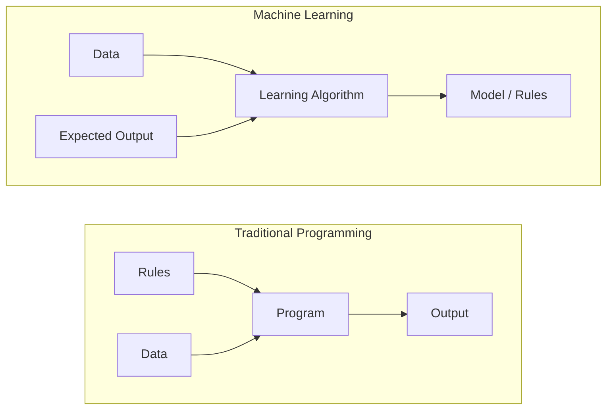
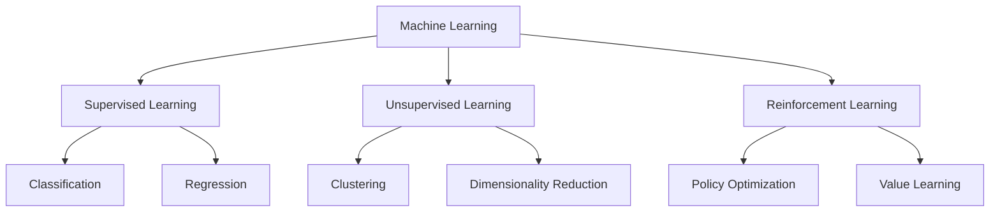
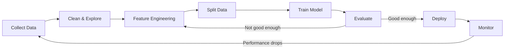
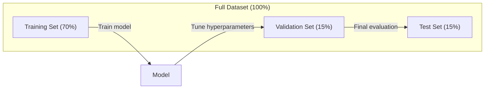
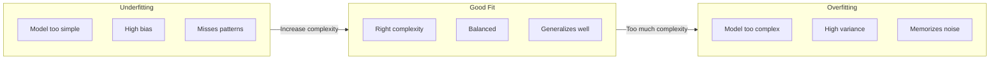
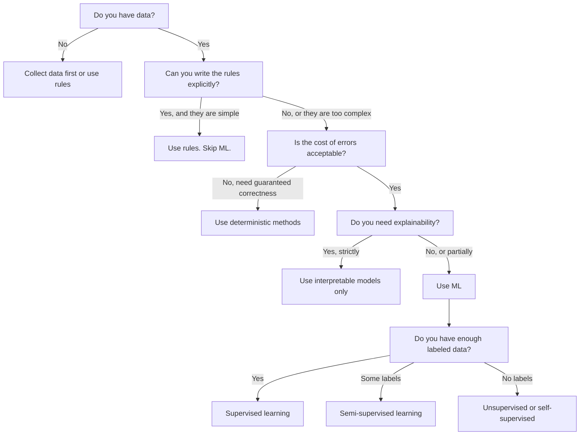

# ما هو التعلم الآلي
> يقوم التعلم الآلي بتعليم أجهزة الكمبيوتر كيفية العثور على أنماط في البيانات بدلاً من كتابة القواعد يدويًا.
**النوع:** تعلم
** اللغات: ** بايثون
**المتطلبات الأساسية:** المرحلة الأولى (أساسيات الرياضيات)
**الوقت:** ~45 دقيقة
## أهداف التعلم
- شرح الفرق بين التعلم الخاضع للإشراف وغير الخاضع للإشراف والتعليم المعزز وتحديد النوع الذي ينطبق على مشكلة معينة
- تنفيذ أقرب مصنف النقطه الوسطى من الصفر وتقييمه مقابل خط أساس عشوائي
- التمييز بين مهام التصنيف والانحدار واختيار دالة الخسارة المناسبة لكل منهما
- تقييم ما إذا كانت مشكلة عمل معينة مناسبة لـ ML أو يمكن حلها بشكل أفضل باستخدام القواعد الحتمية
## المشكلة
تريد إنشاء عامل تصفية للبريد العشوائي. النهج التقليدي: الجلوس وكتابة مئات القواعد. "إذا كانت رسالة البريد الإلكتروني تحتوي على 'FREE MONEY'، ضع علامة عليها كرسالة غير مرغوب فيها. وإذا كانت تحتوي على أكثر من 3 علامات تعجب، فضع علامة عليها كرسالة غير مرغوب فيها." تقضي أسابيع في كتابة القواعد. ثم يقوم مرسلي البريد العشوائي بتغيير صياغتهم. كسر القواعد الخاصة بك. تكتب المزيد من القواعد. الدورة لا تنتهي أبدا.
التعلم الآلي يقلب هذا. بدلاً من كتابة القواعد، فإنك تعطي الكمبيوتر الآلاف من رسائل البريد الإلكتروني المصنفة ("بريد عشوائي" أو "ليست بريدًا عشوائيًا") وتسمح له باكتشاف القواعد بنفسه. يعثر الكمبيوتر على أنماط لم تكن لتفكر فيها أبدًا. عندما يغير مرسلي البريد العشوائي تكتيكاتهم، فإنك تعيد التدريب على البيانات الجديدة بدلاً من إعادة كتابة التعليمات البرمجية.
هذا التحول من "قواعد البرمجة" إلى "التعلم من البيانات" هو جوهر التعلم الآلي. يعمل كل محرك توصية، ومساعد صوتي، وسيارة ذاتية القيادة، ونموذج لغة بهذه الطريقة.
##المفهوم
### التعلم من البيانات، وليس القواعد
تعمل البرمجة التقليدية والتعلم الآلي على حل المشكلات في اتجاهين متعاكسين.


البرمجة التقليدية: أنت تكتب القواعد. يطبقها البرنامج على البيانات لإنتاج المخرجات.
التعلم الآلي: تقوم بتوفير البيانات والمخرجات المتوقعة. تكتشف الخوارزمية القواعد.
"النموذج" الذي يخرج من التدريب IS القواعد، مشفرة كأرقام (الأوزان، المعلمات). إنه يعمم من الأمثلة التي شاهدها على تنبؤات make بشأن البيانات التي لم يراها من قبل.
### الأنواع الثلاثة للتعلم الآلي


**التعلم الخاضع للإشراف**: لديك أزواج من المدخلات والمخرجات. يتعلم النموذج كيفية ربط المدخلات بالمخرجات.
- "إليك 10000 صورة مصنفة على أنها قطة أو كلب. تعلم كيفية التمييز بينها."
- "إليك ميزات المنزل وأسعاره. تعلم كيفية التنبؤ بالسعر."
**التعلم غير الخاضع للإشراف**: لديك مدخلات فقط. لا تسميات. يجد النموذج البنية من تلقاء نفسه.
- "إليك سجلات شراء 10000 عميل. ابحث عن التجمعات الطبيعية."
- "هنا 1000 نقطة بيانات ذات أبعاد. اختصرها إلى بعدين مع الحفاظ على البنية."
**التعلم المعزز**: يتخذ الوكيل إجراءات في بيئة ويتلقى مكافآت أو عقوبات. يتعلم استراتيجية (سياسة) لتعظيم المكافأة الإجمالية.
- "العب هذه اللعبة. +1 للفوز، -1 للخسارة. اكتشف استراتيجية."
- "التحكم في ذراع الروبوت هذه. +1 لالتقاط الجسم، -0.01 لكل ثانية ضائعة."
معظم ما ستبنيه عمليًا يستخدم التعلم الخاضع للإشراف. يعد التعلم غير الخاضع للرقابة أمرًا شائعًا في المعالجة المسبقة والاستكشاف. لعبة تعزيز التعلم AI، والروبوتات، وRLHF لنماذج اللغة.
### ما وراء الثلاثة الكبار
الفئات الثلاث المذكورة أعلاه واضحة، ولكن العالم الحقيقي ML غالبًا ما يطمس الخطوط.
**يستخدم التعلم شبه الخاضع للإشراف** مجموعة صغيرة من البيانات المصنفة ومجموعة كبيرة من البيانات غير المصنفة. قد يكون لديك 100 صورة طبية مصنفة و100000 صورة غير مصنفة. تشمل التقنيات ما يلي:
- **نشر الملصقات:** أنشئ رسمًا بيانيًا يربط بين نقاط البيانات المتشابهة. تنتشر التسميات من nodes المسماة إلى الدول المجاورة غير المسماة من خلال الرسم البياني.
- **التسميات الزائفة:** قم بتدريب نموذج على البيانات المصنفة، واستخدمه للتنبؤ بتسميات البيانات غير المسماة، ثم أعد التدريب على كل شيء. يقوم النموذج بتمهيد مجموعة التدريب الخاصة به.
- **تنظيم الاتساق:** يجب أن يعطي النموذج نفس التنبؤ للمدخل ونسخة مضطربة قليلاً من ذلك الإدخال. وهذا يعمل حتى بدون تسميات.
**التعلم تحت الإشراف الذاتي** ينشئ الإشراف من البيانات نفسها. لا حاجة إلى تسميات بشرية على الإطلاق. يقوم النموذج بإنشاء مهمة التنبؤ الخاصة به من بنية البيانات.
- **نمذجة اللغة المقنعة (BERT):** إخفاء 15% من الكلمات في الجملة، وتدريب النموذج على التنبؤ بالكلمات المفقودة. "التسميات" تأتي من النص الأصلي.
- **التعلم التقابلي (SimCLR):** التقط صورة وأنشئ نسختين معززتين. تدريب النموذج على التعرف على أنها جاءت من نفس الصورة مع تمييزها عن الإصدارات المعززة من الصور الأخرى.
- **التنبؤ بالرمز التالي (GPT):** توقع الكلمة التالية في ضوء جميع الكلمات السابقة. يصبح كل مستند نصي مثالاً للتدريب.
هذه ليست فئات منفصلة عن الثلاثة الكبار. إنها استراتيجيات تجمع بين الأفكار الخاضعة للإشراف وغير الخاضعة للإشراف. يتم الإشراف على التعلم الخاضع للإشراف الذاتي تقنيًا (يتنبأ النموذج بشيء ما)، ولكن يتم إنشاء التسميات تلقائيًا، وليس بواسطة البشر.
### التصنيف مقابل الانحدار
هاتان هما مهمتا التعلم الرئيسيتان الخاضعتان للإشراف.
| الجانب | تصنيف | الانحدار |
|--------|--------------|------------|
| الإخراج | فئات منفصلة | أرقام مستمرة |
| مثال | "هل هذا البريد الإلكتروني غير المرغوب فيه؟" | "كم سيكون سعر المنزل؟" |
| مساحة الإخراج | {قطة، كلب، طير} | أي عدد حقيقي |
| دالة الخسارة | عبر الانتروبيا والدقة | متوسط ​​الخطأ التربيعي، MAE |
| قرار | الحدود بين الطبقات | منحنى يناسب البيانات |
يجيب التصنيف "أي فئة؟" يجيب الانحدار "كم؟"
يمكن تأطير بعض المشاكل في كلتا الحالتين. التنبؤ بما إذا كان السهم يرتفع أو ينخفض ​​هو تصنيف. التنبؤ بالسعر الدقيق هو الانحدار.
### سير العمل ML
يتبع كل مشروع للتعلم الآلي نفس pipeline، بغض النظر عن الخوارزمية.


**جمع البيانات**: جمع البيانات الأولية. دائمًا ما يكون المزيد من البيانات أفضل، لكن الجودة أهم من الكمية.
**التنظيف والاستكشاف**: التعامل مع القيم المفقودة وإزالة التكرارات وتصور التوزيعات وتحديد الحالات الشاذة. غالبًا ما تستغرق هذه الخطوة 60-80% من إجمالي وقت المشروع.
**هندسة الميزات**: تحويل البيانات الأولية إلى ميزات يمكن للنموذج استخدامها. تحويل التواريخ إلى يوم من أيام الأسبوع. تطبيع الأعمدة الرقمية. ترميز المتغيرات الفئوية. الميزات الجيدة مهمة أكثر من الخوارزميات الفاخرة.
**تقسيم البيانات**: قسّمها إلى مجموعات التدريب والتحقق والاختبار. يتدرب النموذج على بيانات التدريب، وتقوم بضبط المعلمات الفائقة على بيانات التحقق من الصحة، وتقوم بالإبلاغ عن الأداء النهائي على بيانات الاختبار.
**نموذج القطار**: قم بإدخال بيانات التدريب في خوارزمية. تقوم الخوارزمية بضبط المعلمات الداخلية لتقليل دالة الخسارة.
**التقييم**: قياس الأداء في بيانات التحقق/الاختبار. إذا كان الأداء غير مقبول، فارجع وجرب ميزات أو خوارزميات أو معلمات تشعبية مختلفة.
**النشر**: ضع النموذج في مرحلة الإنتاج حيث يتم وضع توقعات make على البيانات الجديدة.
**المراقبة**: تتبع الأداء بمرور الوقت. تتغير توزيعات البيانات (انجراف البيانات)، وتتدهور النماذج. عندما ينخفض ​​الأداء، أعد التدريب.
### تقسيمات التدريب والتحقق والاختبار
هذا هو المفهوم الأكثر أهمية الذي يخطئ فيه المبتدئون. يجب عليك تقييم النموذج الخاص بك بناءً على البيانات التي لم يسبق له رؤيتها أثناء التدريب. وإلا فإنك تقيس الحفظ وليس التعلم.


| سبليت | الغرض | عندما تستخدم | الحجم النموذجي |
|-------|---------|---------|-------------|
| التدريب | النموذج يتعلم من هذه البيانات | أثناء التدريب | 60-80% |
| التحقق من الصحة | ضبط المعلمات الفائقة، ومقارنة النماذج | بعد كل جولة تدريبية | 10-20% |
| اختبار | تقدير الأداء النهائي غير المتحيز | مرة واحدة، في النهاية | 10-20% |
مجموعة الاختبار مقدسة. نظرت إليه مرة واحدة بالضبط. إذا واصلت تعديل النموذج الخاص بك بناءً على أداء الاختبار، فأنت تتدرب بشكل فعال على مجموعة الاختبار والأرقام المبلغ عنها لا معنى لها.
بالنسبة لمجموعات البيانات الصغيرة، استخدم التحقق المتبادل k-fold: قم بتقسيم البيانات إلى أجزاء k، والتدريب على أجزاء k-1، والتحقق من صحة الجزء المتبقي، والتدوير، ومتوسط ​​النتائج.
### التجهيز الزائد مقابل التجهيز غير المناسب


**نقص التجهيز**: النموذج بسيط للغاية بحيث لا يمكنه التقاط الأنماط الموجودة في البيانات. خط مستقيم يحاول أن يناسب العلاقة المنحنية. خطأ التدريب مرتفع. خطأ الاختبار مرتفع.
**التركيب الزائد**: النموذج معقد جدًا ويحفظ بيانات التدريب، بما في ذلك الضوضاء. منحنى متذبذب يمر عبر كل نقطة تدريب ولكنه يفشل في الحصول على بيانات جديدة. خطأ التدريب منخفض. خطأ الاختبار مرتفع.
**ملاءمة جيدة**: يلتقط النموذج أنماطًا حقيقية دون حفظ الضوضاء. خطأ التدريب وخطأ الاختبار كلاهما منخفضان إلى حد معقول.
علامات التجهيز الزائد:
- دقة التدريب أعلى بكثير من دقة التحقق
- أداء النموذج جيد على بيانات التدريب ولكنه ضعيف على البيانات الجديدة
- إضافة المزيد من بيانات التدريب يؤدي إلى تحسين الأداء (النموذج كان يحفظ وليس يتعلم)
إصلاحات التجهيز الزائد:
- احصل على المزيد من بيانات التدريب
- تقليل تعقيد النموذج (معلمات أقل، بنية أبسط)
- التسوية (إضافة عقوبة للأوزان الكبيرة)
- التسرب (صفر الخلايا العصبية بشكل عشوائي أثناء التدريب)
- التوقف المبكر (إيقاف التدريب عندما يبدأ خطأ التحقق من الصحة في الزيادة)
إصلاحات لنقص التجهيز:
- استخدم نموذجًا أكثر تعقيدًا
- إضافة المزيد من الميزات
- تقليل الانتظام
- تدريب لفترة أطول
### مقايضة التحيز والتباين
هذا هو الإطار الرياضي وراء التجهيز الزائد والنقص في التجهيز.
**التحيز**: خطأ من الافتراضات الخاطئة في النموذج. النموذج الخطي له انحياز عالي عندما تكون العلاقة الحقيقية غير خطية. التحيز العالي يؤدي إلى نقص التجهيز.
**التباين**: خطأ من الحساسية للتقلبات الصغيرة في بيانات التدريب. النموذج ذو التباين العالي يعطي تنبؤات مختلفة جدًا عند تدريبه على مجموعات فرعية مختلفة من البيانات. التباين العالي يؤدي إلى الإفراط في التجهيز.
| تعقيد النموذج | التحيز | التباين | النتيجة |
|-----------------|------|---------|--------|
| منخفض جدًا (نموذج خطي للبيانات المنحنية) | عالية | منخفض | غير مناسب |
| مجرد حق | متوسطة | متوسطة | تعميم جيد |
| عالية جدًا (درجة 20 متعددة الحدود لمدة 10 نقاط) | منخفض | عالية | التجهيز الزائد |
إجمالي الخطأ = الانحياز ^ 2 + التباين + الضوضاء غير القابلة للاختزال
لا يمكنك تقليل الضوضاء غير القابلة للاختزال (إنها عشوائية في البيانات نفسها). تريد العثور على النقطة المثالية حيث يتم تقليل التحيز ^ 2 + التباين.
### لا توجد نظرية غداء مجاني
لا توجد خوارزمية واحدة تعمل بشكل أفضل لكل مشكلة. الخوارزمية التي تؤدي أداءً جيدًا في فئة واحدة من المشكلات سيكون أداؤها سيئًا في فئة أخرى. ولهذا السبب يقوم علماء البيانات بتجربة خوارزميات متعددة ومقارنة النتائج.
ومن الناحية العملية، يعتمد الاختيار على:
- كم البيانات لديك
- كم عدد الميزات هناك
- هل العلاقة خطية أم غير خطية
- ما إذا كنت بحاجة إلى التفسير
- مقدار الحساب الذي يمكنك تحمله
### متى NOT لاستخدام التعلم الآلي
ML أداة قوية ولكنها ليست الأداة الصحيحة دائمًا. قبل البحث عن نموذج، اسأل ما إذا كنت بحاجة إليه بالفعل.
**لا تستخدم ML عندما:**
- **القواعد بسيطة ومحددة جيدًا.** حساب الضرائب، وخوارزميات الفرز، وتحويلات الوحدات. إذا كان بإمكانك كتابة المنطق في عدد قليل من عبارات if، فإن النموذج يضيف تعقيدًا دون أي فائدة.
- **ليس لديك أية بيانات أو أن البيانات قليلة جدًا.** ML يحتاج إلى أمثلة للتعلم منها. مع 10 نقاط بيانات، لا يمكنك تدريب أي شيء ذي معنى. جمع البيانات أولا.
- **تكلفة الخطأ كارثية وتحتاج إلى صحة مضمونة.** حساب الجرعات الطبية، التحكم في المفاعل النووي، التحقق من التشفير. نماذج ML احتمالية. وسوف يكونون مخطئين في بعض الأحيان. إذا كانت عبارة "خطأ في بعض الأحيان" غير مقبولة، فاستخدم الأساليب الحتمية.
- **يحل جدول البحث أو الاستدلال المشكلة.** إذا كان الحد البسيط أو الجدول يغطي 99% من الحالات، فإن إضافة ML يؤدي إلى زيادة تكلفة الصيانة دون إجراء تحسينات ذات معنى.
- **لا يمكنك شرح القرار، وقابلية التفسير مطلوبة.** تتطلب الصناعات الخاضعة للتنظيم (الإقراض، والتأمين، والعدالة الجنائية) في بعض الأحيان أن يكون كل قرار قابلاً للتفسير بشكل كامل. بعض نماذج ML قابلة للتفسير (الانحدار الخطي، وأشجار القرار الصغيرة). معظمهم ليسوا كذلك.
- **تتغير المشكلة بشكل أسرع مما يمكنك إعادة تدريبه.** إذا كانت القواعد تتغير يوميًا وتستغرق إعادة التدريب أسبوعًا، فسيكون النموذج دائمًا قديمًا.
استخدم هذا المخطط الانسيابي للقرار:


## بنائها
الكود الموجود في `code/ml_intro.py` يطبق أقرب مصنف للنقطه الوسطى من الصفر، وهو أبسط خوارزمية ML ممكنة. فهو يوضح الفكرة الأساسية: التعلم من البيانات، ثم التنبؤ بالبيانات الجديدة.
### الخطوة 1: أقرب مصنف النقطه الوسطى من الصفر
يحسب أقرب مصنف للنقطه الوسطى المركز (المتوسط) لكل فئة في بيانات التدريب. للتنبؤ، فإنه يعين كل نقطة جديدة للفئة التي يكون مركزها الأقرب.
```python
class NearestCentroid:
    def fit(self, X, y):
        self.classes = np.unique(y)
        self.centroids = np.array([
            X[y == c].mean(axis=0) for c in self.classes
        ])

    def predict(self, X):
        distances = np.array([
            np.sqrt(((X - c) ** 2).sum(axis=1))
            for c in self.centroids
        ])
        return self.classes[distances.argmin(axis=0)]
```

هذه هي الخوارزمية بأكملها. يحسب Fit وسيلتين. التنبؤ بحساب المسافات. لا يوجد نزول متدرج، ولا تكرار، ولا معلمات مفرطة.
### الخطوة الثانية: التدريب على البيانات الاصطناعية
نقوم بإنشاء مجموعة بيانات تصنيف ثنائية الأبعاد تحتوي على فئتين تتداخلان قليلاً. يرسم مصنف النقطه الوسطى حدود قرار خطية بين مراكز الفصل.
```python
rng = np.random.RandomState(42)
X_class0 = rng.randn(100, 2) + np.array([1.0, 1.0])
X_class1 = rng.randn(100, 2) + np.array([-1.0, -1.0])
X = np.vstack([X_class0, X_class1])
y = np.array([0] * 100 + [1] * 100)
```

### الخطوة 3: المقارنة مع خط الأساس
يجب مقارنة كل نموذج ML بخط أساس تافه. هنا، يتنبأ خط الأساس بفئة عشوائية. إذا كان نموذج ML الخاص بك لا يتفوق على التخمين العشوائي، فهذا يعني أن هناك خطأ ما.
```python
baseline_preds = rng.choice([0, 1], size=len(y_test))
baseline_acc = np.mean(baseline_preds == y_test)
```

يجب أن يحصل مصنف النقطه الوسطى على دقة تزيد عن 90% في مجموعة البيانات النظيفة هذه. خط الأساس العشوائي يحصل على حوالي 50٪.
### لماذا هذا مهم
أقرب مصنف للنقطه الوسطى بسيط للغاية. لا يحتوي على معلمات مفرطة ولا تكرار ولا نزول متدرج. ومع ذلك فهو يجسد النمط الأساسي ML:
1. **تعلم** تمثيلًا من بيانات التدريب (النقط الوسطى)
2. **التنبؤ** بالبيانات الجديدة باستخدام هذا التمثيل (أقرب مسافة)
3. **التقييم** مقابل خط الأساس (التخمين العشوائي)
تتبع كل خوارزمية ML، بدءًا من الانحدار اللوجستي وحتى المحولات، نفس النمط المكون من ثلاث خطوات. يصبح التمثيل أكثر تعقيدًا، لكن سير العمل يظل كما هو.
### الخطوة 4: ما لا يستطيع مصنف النقطه الوسطى فعله
يفترض أقرب مصنف للنقطه الوسطى أن كل فئة تشكل نقطة واحدة. يرسم حدود القرار الخطية. يفشل عندما:
- تحتوي الفئات على مجموعات متعددة (على سبيل المثال، يمكن كتابة digit "1" بعدة طرق مختلفة)
- حدود القرار غير خطية (على سبيل المثال، فئة واحدة تلتف حول أخرى)
- للمعالم مقاييس مختلفة تمامًا (تهيمن الميزة الأكبر حجمًا على المسافة)
تحفز هذه القيود كل خوارزمية أخرى ستتعلمها. يتعامل أقرب جيران K مع مجموعات متعددة. تتعامل أشجار القرار مع الحدود غير الخطية. يعمل تغيير حجم الميزة على إصلاح مشكلة القياس. يعتمد كل درس على قيود الدرس السابق.
## استخدمه
يوفر sklearn `NearestCentroid` ومولدات البيانات الاصطناعية:
```python
from sklearn.neighbors import NearestCentroid
from sklearn.datasets import make_classification
from sklearn.model_selection import train_test_split

X, y = make_classification(
    n_samples=500, n_features=2, n_redundant=0,
    n_clusters_per_class=1, random_state=42
)
X_train, X_test, y_train, y_test = train_test_split(X, y, test_size=0.3)

clf = NearestCentroid()
clf.fit(X_train, y_train)
print(f"Accuracy: {clf.score(X_test, y_test):.3f}")
```

## اشحنها
ينتج عن هذا الدرس `outputs/prompt-ml-problem-framer.md` -- مطالبة تحول مشاكل العمل الغامضة إلى مهام ML ملموسة. أعطها وصفًا للمشكلة ("نريد تقليل معدل التباطؤ" أو "التنبؤ بالطلب للربع القادم") ويحدد نوع التعلم، ويحدد هدف التنبؤ، ويسرد ميزات المرشح، ويختار مقياس النجاح، ويحدد خط الأساس، ويضع علامة على المخاطر مثل تسرب البيانات أو اختلال التوازن في الفصل. استخدمه في بداية أي مشروع ML لتجنب بناء الشيء الخطأ.
## المصطلحات الرئيسية
| مصطلح | ماذا يقول الناس | ماذا يعني في الواقع |
|------|----------------|----------------------|
| نموذج | "__المصطلح_2__" | دالة رياضية ذات معلمات قابلة للتعلم تقوم بتعيين المدخلات إلى المخرجات |
| التدريب | "تعليم __المصطلح_3__" | تشغيل خوارزمية تحسين لضبط معلمات النموذج بحيث تتطابق التوقعات مع المخرجات المعروفة |
| ميزة | "عمود الإدخال" | خاصية قابلة للقياس للبيانات التي يستخدمها النموذج للتنبؤات make |
| التسمية | "الجواب" | الإخراج المعروف لمثال تدريبي، يستخدم لحساب إشارة الخطأ |
| المعلمة المفرطة | "الإعداد الذي يمكنك تعديله" | معلمة يتم ضبطها قبل التدريب وتتحكم في عملية التعلم (معدل التعلم، عدد الطبقات) |
| دالة الخسارة | "ما مدى خطأ النموذج" | دالة تقيس الفجوة بين المخرجات المتوقعة والفعلية، والتي يحاول التدريب تقليلها |
| التجهيز الزائد | "فلقد حفظ الاختبار" | لقد تعلم النموذج الضوضاء الخاصة بالتدريب بدلاً من الأنماط العامة، لذلك يفشل في التعامل مع البيانات الجديدة |
| غير مناسب | "ولم يتعلم شيئًا" | النموذج بسيط جدًا بحيث لا يمكنه التقاط الأنماط الحقيقية في البيانات |
| التعميم | "إنه يعمل على البيانات الجديدة" | قدرة النموذج على make تنبؤات دقيقة للبيانات التي لم يتم التدريب عليها |
| التحقق المتبادل | "اختبار على قطع مختلفة" | تقسيم البيانات بشكل متكرر إلى طيات تدريب/اختبار ومتوسط ​​النتائج، مما يوفر تقديرًا أكثر قوة للأداء |
| تسوية | "الحفاظ على الأوزان صغيرة" | إضافة مصطلح جزائي إلى دالة الخسارة مما لا يشجع النماذج المعقدة للغاية |
| انجراف البيانات | "العالم تغير" | يتغير التوزيع الإحصائي للبيانات الواردة بمرور الوقت، مما يؤدي إلى تدهور أداء النموذج |
## تمارين
1. خذ أي مجموعة بيانات (على سبيل المثال، Iris، Titanic). قم بتقسيمها 70/15/15 إلى تدريب/تحقق/اختبار. اشرح لماذا لا ينبغي عليك ضبط المعلمات الفائقة في مجموعة الاختبار.
2. قم بإدراج ثلاث مشاكل في العالم الحقيقي. وحدد لكل واحد هل هو تصنيف أم تراجع أم تجميع وهل هو خاضع للإشراف أم غير خاضع للرقابة.
3. يحصل النموذج على دقة تبلغ 99% في بيانات التدريب و60% في بيانات الاختبار. قم بتشخيص المشكلة وقم بإدراج ثلاثة أشياء ستحاول إصلاحها.
## مزيد من القراءة
- [An Introduction to Statistical Learning](https://www.statlearning.com/) - كتاب مدرسي مجاني يغطي جميع أساليب ML الكلاسيكية مع أمثلة عملية
- [Google's Machine Learning Crash Course](https://developers.google.com/machine-learning/crash-course) - مقدمة مرئية موجزة لمفاهيم ML
- [Scikit-learn User Guide](https://scikit-learn.org/stable/user_guide.html) - المرجع العملي لتطبيق ML في لغة بايثون