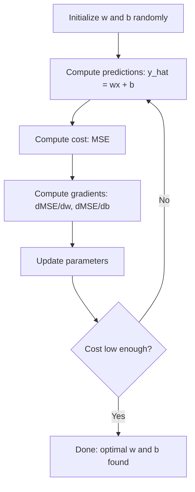

# Linear Regression

> يرسم الانحدار الخطي أفضل خط مستقيم عبر بياناتك. إنه "مرحبا بالعالم" للتعلم الآلي.

**النوع:** بناء
** اللغات: ** بايثون
**المتطلبات الأساسية:** المرحلة الأولى (الجبر الخطي، حساب التفاضل والتكامل، التحسين)، المرحلة الثانية، الدرس الأول
**الوقت:** ~90 دقيقة

## Learning Objectives

- اشتقاق قواعد تحديث نزول التدرج لمتوسط الخطأ التربيعي وتنفيذ الانحدار الخطي من الصفر
- مقارنة النسب المتدرج والمعادلة العادية من حيث التعقيد الحسابي ومتى يتم استخدام كل منهما
- بناء نموذج الانحدار الخطي المتعدد مع توحيد الميزات وتفسير الأوزان المستفادة
- اشرح كيف يمنع انحدار ريدج (L2 التنظيم) الإفراط في التجهيز عن طريق معاقبة الأوزان الكبيرة

## The Problem

لديك بيانات: أحجام المنازل وأسعار بيعها. تريد التنبؤ بسعر المنزل الجديد بالنظر إلى حجمه. يمكنك أن تنظر إليها على قطعة أرض متناثرة، لكنك بحاجة إلى صيغة. أنت بحاجة إلى خط يناسب البيانات بشكل أفضل حتى تتمكن من توصيل أي حجم والحصول على توقع للسعر.

الانحدار الخطي يمنحك هذا الخط. والأهم من ذلك أنه يقدم حلقة التدريب ML بأكملها: تحديد النموذج وتحديد دالة التكلفة وتحسين المعلمات. تتبع كل خوارزمية ML نفس النمط. أتقنها هنا بأبسط حالة، وسوف تتعرف عليها في كل مكان.

هذا ليس فقط للمشاكل البسيطة. يُستخدم الانحدار الخطي في أنظمة الإنتاج للتنبؤ بالطلب، وتحليل اختبار A/B، والنمذجة المالية، وكخط أساس لكل مهمة انحدار.

## The Concept

### The Model

يفترض الانحدار الخطي وجود علاقة خطية بين المدخلات (x) والمخرجات (y):

```
y = wx + b
```

- `w` (الوزن/الميل): مقدار تغير y عندما تزيد x بمقدار 1
- `b` (التحيز/الاعتراض): قيمة y عندما يكون x = 0

بالنسبة للمدخلات (الميزات) المتعددة، يمتد هذا إلى:

```
y = w1*x1 + w2*x2 + ... + wn*xn + b
```

أو في شكل متجه: `y = w^T * x + b`

الهدف: العثور على قيم w وb التي make y المتوقعة أقرب ما يمكن إلى y الفعلي في جميع الأمثلة التدريبية.

### The Cost Function (Mean Squared Error)

كيف يمكنك قياس "أقرب ما يمكن"؟ أنت بحاجة إلى رقم واحد يوضح مدى خطأ توقعاتك. الخيار الأكثر شيوعًا هو متوسط ​​الخطأ التربيعي (MSE):

```
MSE = (1/n) * sum((y_predicted - y_actual)^2)
```

لماذا التربيعية؟ سببين. أولاً، يعاقب الأخطاء الكبيرة أكثر من الأخطاء الصغيرة (الخطأ 10 أسوأ 100 مرة من الخطأ 1، وليس 10 مرات). ثانيًا، الدالة التربيعية سلسة وقابلة للتمييز في كل مكان، وهو أمر سهل التحسين.

دالة التكلفة تخلق سطحًا. بالنسبة لوزن واحد w وتحيز b، يبدو السطح MSE مثل وعاء (قطع مكافئ محدب). الجزء السفلي من الوعاء هو المكان الذي يتم فيه تصغير MSE. التدريب يعني العثور على هذا القاع.

### Gradient Descent

يجد الهبوط المتدرج الجزء السفلي من الوعاء عن طريق اتخاذ خطوات إلى أسفل.



تخبرك التدرجات بأمرين: الاتجاه الذي يجب تحريكه لكل معلمة، ومقدار التحرك.

لـ MSE مع y_hat = wx + b:

```
dMSE/dw = (2/n) * sum((y_hat - y) * x)
dMSE/db = (2/n) * sum(y_hat - y)
```

قاعدة التحديث:

```
w = w - learning_rate * dMSE/dw
b = b - learning_rate * dMSE/db
```

يتحكم معدل التعلم في حجم الخطوة. كبير جدًا: أنت تتجاوز الحد الأدنى وتتباعد. صغير جدًا: التدريب يستغرق وقتًا طويلاً. قيم البداية النموذجية: 0.01 أو 0.001 أو 0.0001.

### The Normal Equation (Closed-Form Solution)

بالنسبة للانحدار الخطي على وجه التحديد، هناك صيغة مباشرة تعطي الأوزان المثالية دون أي تكرار:

```
w = (X^T * X)^(-1) * X^T * y
```

هذا يعكس مصفوفة لحلها لـ w في خطوة واحدة. إنه يعمل بشكل مثالي لمجموعات البيانات الصغيرة. بالنسبة لمجموعات البيانات الكبيرة (ملايين الصفوف أو آلاف المعالم)، يُفضل النسب المتدرج لأن انعكاس المصفوفة هو O(n^3) في عدد المعالم.

### Multiple Linear Regression

وبميزات متعددة يصبح النموذج:

```
y = w1*x1 + w2*x2 + ... + wn*xn + b
```

كل شيء يعمل بنفس الطريقة: MSE هي دالة التكلفة، ويقوم النسب المتدرج بتحديث جميع الأوزان في وقت واحد. والفرق الوحيد هو أنك تقوم بتركيب طائرة مفرطة بدلاً من الخط.

تغيير حجم الميزة مهم هنا. إذا كانت إحدى الميزات تتراوح من 0 إلى 1 وتتراوح ميزة أخرى من 0 إلى 1,000,000، فسوف يواجه الهبوط التدرج صعوبة لأن سطح التكلفة يصبح ممدودًا. توحيد الميزات (طرح المتوسط، والقسمة على الانحراف المعياري) قبل التدريب.

### Polynomial Regression

ماذا لو لم تكن العلاقة خطية؟ لا يزال بإمكانك استخدام الانحدار الخطي عن طريق إنشاء ميزات متعددة الحدود:

```
y = w1*x + w2*x^2 + w3*x^3 + b
```

لا يزال هذا انحدارًا "خطيًا" لأن النموذج خطي في الأوزان (w1، w2، w3). أنت تستخدم فقط الميزات غير الخطية لـ x.

يمكن أن تتناسب كثيرات الحدود ذات الدرجة الأعلى مع منحنيات أكثر تعقيدًا ولكنها تخاطر بالتركيب الزائد. سوف تمر كثيرة الحدود من الدرجة 10 عبر كل نقطة في مجموعة بيانات مكونة من 10 نقاط، ولكنها تتنبأ بشكل سيء بالبيانات الجديدة.

### R-Squared Score

MSE يخبرك بمدى خطأك، لكن الرقم يعتمد على مقياس y. يعطي R-squared (R^2) مقياسًا مستقلاً عن المقياس:

```
R^2 = 1 - (sum of squared residuals) / (sum of squared deviations from mean)
    = 1 - SS_res / SS_tot
```

- R^2 = 1.0: تنبؤات مثالية
- R^2 = 0.0: النموذج ليس أفضل من التنبؤ بالمتوسط في كل مرة
- R^2 <0.0: النموذج أسوأ من التنبؤ بالمتوسط

### Regularization Preview (Ridge Regression)

عندما يكون لديك العديد من الميزات، يمكن للنموذج أن يفرط في التجهيز عن طريق تعيين أوزان كبيرة. يضيف انحدار ريدج (L2 التنظيم) عقوبة:

```
Cost = MSE + lambda * sum(w_i^2)
```

مصطلح العقوبة لا يشجع على الأوزان الكبيرة. تتحكم المعلمة الفائقة lambda في المقايضة: تعني lambda الأعلى أوزانًا أصغر ومزيدًا من التنظيم. سيتم تناول هذا بالتفصيل في درس لاحق. في الوقت الحالي، اعرف أنه موجود ولماذا يساعد.

## Build It

### Step 1: Generate sample data

```python
import random
import math

random.seed(42)

TRUE_W = 3.0
TRUE_B = 7.0
N_SAMPLES = 100

X = [random.uniform(0, 10) for _ in range(N_SAMPLES)]
y = [TRUE_W * x + TRUE_B + random.gauss(0, 2.0) for x in X]

print(f"Generated {N_SAMPLES} samples")
print(f"True relationship: y = {TRUE_W}x + {TRUE_B} (+ noise)")
print(f"First 5 points: {[(round(X[i], 2), round(y[i], 2)) for i in range(5)]}")
```

### Step 2: Linear regression from scratch with gradient descent

```python
class LinearRegression:
    def __init__(self, learning_rate=0.01):
        self.w = 0.0
        self.b = 0.0
        self.lr = learning_rate
        self.cost_history = []

    def predict(self, X):
        return [self.w * x + self.b for x in X]

    def compute_cost(self, X, y):
        predictions = self.predict(X)
        n = len(y)
        cost = sum((pred - actual) ** 2 for pred, actual in zip(predictions, y)) / n
        return cost

    def compute_gradients(self, X, y):
        predictions = self.predict(X)
        n = len(y)
        dw = (2 / n) * sum((pred - actual) * x for pred, actual, x in zip(predictions, y, X))
        db = (2 / n) * sum(pred - actual for pred, actual in zip(predictions, y))
        return dw, db

    def fit(self, X, y, epochs=1000, print_every=200):
        for epoch in range(epochs):
            dw, db = self.compute_gradients(X, y)
            self.w -= self.lr * dw
            self.b -= self.lr * db
            cost = self.compute_cost(X, y)
            self.cost_history.append(cost)
            if epoch % print_every == 0:
                print(f"  Epoch {epoch:4d} | Cost: {cost:.4f} | w: {self.w:.4f} | b: {self.b:.4f}")
        return self

    def r_squared(self, X, y):
        predictions = self.predict(X)
        y_mean = sum(y) / len(y)
        ss_res = sum((actual - pred) ** 2 for actual, pred in zip(y, predictions))
        ss_tot = sum((actual - y_mean) ** 2 for actual in y)
        return 1 - (ss_res / ss_tot)


print("=== Training Linear Regression (Gradient Descent) ===")
model = LinearRegression(learning_rate=0.005)
model.fit(X, y, epochs=1000, print_every=200)
print(f"\nLearned: y = {model.w:.4f}x + {model.b:.4f}")
print(f"True:    y = {TRUE_W}x + {TRUE_B}")
print(f"R-squared: {model.r_squared(X, y):.4f}")
```

### Step 3: Normal equation (closed-form solution)

```python
class LinearRegressionNormal:
    def __init__(self):
        self.w = 0.0
        self.b = 0.0

    def fit(self, X, y):
        n = len(X)
        x_mean = sum(X) / n
        y_mean = sum(y) / n
        numerator = sum((X[i] - x_mean) * (y[i] - y_mean) for i in range(n))
        denominator = sum((X[i] - x_mean) ** 2 for i in range(n))
        self.w = numerator / denominator
        self.b = y_mean - self.w * x_mean
        return self

    def predict(self, X):
        return [self.w * x + self.b for x in X]

    def r_squared(self, X, y):
        predictions = self.predict(X)
        y_mean = sum(y) / len(y)
        ss_res = sum((actual - pred) ** 2 for actual, pred in zip(y, predictions))
        ss_tot = sum((actual - y_mean) ** 2 for actual in y)
        return 1 - (ss_res / ss_tot)


print("\n=== Normal Equation (Closed-Form) ===")
model_normal = LinearRegressionNormal()
model_normal.fit(X, y)
print(f"Learned: y = {model_normal.w:.4f}x + {model_normal.b:.4f}")
print(f"R-squared: {model_normal.r_squared(X, y):.4f}")
```

### Step 4: Multiple linear regression

```python
class MultipleLinearRegression:
    def __init__(self, n_features, learning_rate=0.01):
        self.weights = [0.0] * n_features
        self.bias = 0.0
        self.lr = learning_rate
        self.cost_history = []

    def predict_single(self, x):
        return sum(w * xi for w, xi in zip(self.weights, x)) + self.bias

    def predict(self, X):
        return [self.predict_single(x) for x in X]

    def compute_cost(self, X, y):
        predictions = self.predict(X)
        n = len(y)
        return sum((pred - actual) ** 2 for pred, actual in zip(predictions, y)) / n

    def fit(self, X, y, epochs=1000, print_every=200):
        n = len(y)
        n_features = len(X[0])
        for epoch in range(epochs):
            predictions = self.predict(X)
            errors = [pred - actual for pred, actual in zip(predictions, y)]
            for j in range(n_features):
                grad = (2 / n) * sum(errors[i] * X[i][j] for i in range(n))
                self.weights[j] -= self.lr * grad
            grad_b = (2 / n) * sum(errors)
            self.bias -= self.lr * grad_b
            cost = self.compute_cost(X, y)
            self.cost_history.append(cost)
            if epoch % print_every == 0:
                print(f"  Epoch {epoch:4d} | Cost: {cost:.4f}")
        return self

    def r_squared(self, X, y):
        predictions = self.predict(X)
        y_mean = sum(y) / len(y)
        ss_res = sum((actual - pred) ** 2 for actual, pred in zip(y, predictions))
        ss_tot = sum((actual - y_mean) ** 2 for actual in y)
        return 1 - (ss_res / ss_tot)


random.seed(42)
N = 100
X_multi = []
y_multi = []
for _ in range(N):
    size = random.uniform(500, 3000)
    bedrooms = random.randint(1, 5)
    age = random.uniform(0, 50)
    price = 50 * size + 10000 * bedrooms - 1000 * age + 50000 + random.gauss(0, 20000)
    X_multi.append([size, bedrooms, age])
    y_multi.append(price)


def standardize(X):
    n_features = len(X[0])
    means = [sum(X[i][j] for i in range(len(X))) / len(X) for j in range(n_features)]
    stds = []
    for j in range(n_features):
        variance = sum((X[i][j] - means[j]) ** 2 for i in range(len(X))) / len(X)
        stds.append(variance ** 0.5)
    X_scaled = []
    for i in range(len(X)):
        row = [(X[i][j] - means[j]) / stds[j] if stds[j] > 0 else 0 for j in range(n_features)]
        X_scaled.append(row)
    return X_scaled, means, stds


y_mean_val = sum(y_multi) / len(y_multi)
y_std_val = (sum((yi - y_mean_val) ** 2 for yi in y_multi) / len(y_multi)) ** 0.5
y_scaled = [(yi - y_mean_val) / y_std_val for yi in y_multi]

X_scaled, x_means, x_stds = standardize(X_multi)

print("\n=== Multiple Linear Regression (3 features) ===")
print("Features: house size, bedrooms, age")
multi_model = MultipleLinearRegression(n_features=3, learning_rate=0.01)
multi_model.fit(X_scaled, y_scaled, epochs=1000, print_every=200)

print(f"\nWeights (standardized): {[round(w, 4) for w in multi_model.weights]}")
print(f"Bias (standardized): {multi_model.bias:.4f}")
print(f"R-squared: {multi_model.r_squared(X_scaled, y_scaled):.4f}")
```

### Step 5: Polynomial regression

```python
class PolynomialRegression:
    def __init__(self, degree, learning_rate=0.01):
        self.degree = degree
        self.weights = [0.0] * degree
        self.bias = 0.0
        self.lr = learning_rate

    def make_features(self, X):
        return [[x ** (d + 1) for d in range(self.degree)] for x in X]

    def predict(self, X):
        features = self.make_features(X)
        return [sum(w * f for w, f in zip(self.weights, row)) + self.bias for row in features]

    def fit(self, X, y, epochs=1000, print_every=200):
        features = self.make_features(X)
        n = len(y)
        for epoch in range(epochs):
            predictions = [sum(w * f for w, f in zip(self.weights, row)) + self.bias for row in features]
            errors = [pred - actual for pred, actual in zip(predictions, y)]
            for j in range(self.degree):
                grad = (2 / n) * sum(errors[i] * features[i][j] for i in range(n))
                self.weights[j] -= self.lr * grad
            grad_b = (2 / n) * sum(errors)
            self.bias -= self.lr * grad_b
            if epoch % print_every == 0:
                cost = sum(e ** 2 for e in errors) / n
                print(f"  Epoch {epoch:4d} | Cost: {cost:.6f}")
        return self

    def r_squared(self, X, y):
        predictions = self.predict(X)
        y_mean = sum(y) / len(y)
        ss_res = sum((actual - pred) ** 2 for actual, pred in zip(y, predictions))
        ss_tot = sum((actual - y_mean) ** 2 for actual in y)
        return 1 - (ss_res / ss_tot)


random.seed(42)
X_poly = [x / 10.0 for x in range(0, 50)]
y_poly = [0.5 * x ** 2 - 2 * x + 3 + random.gauss(0, 1.0) for x in X_poly]

x_max = max(abs(x) for x in X_poly)
X_poly_norm = [x / x_max for x in X_poly]
y_poly_mean = sum(y_poly) / len(y_poly)
y_poly_std = (sum((yi - y_poly_mean) ** 2 for yi in y_poly) / len(y_poly)) ** 0.5
y_poly_norm = [(yi - y_poly_mean) / y_poly_std for yi in y_poly]

print("\n=== Polynomial Regression (degree 2 vs degree 5) ===")
print("True relationship: y = 0.5x^2 - 2x + 3")

print("\nDegree 2:")
poly2 = PolynomialRegression(degree=2, learning_rate=0.1)
poly2.fit(X_poly_norm, y_poly_norm, epochs=2000, print_every=500)
print(f"  R-squared: {poly2.r_squared(X_poly_norm, y_poly_norm):.4f}")

print("\nDegree 5:")
poly5 = PolynomialRegression(degree=5, learning_rate=0.1)
poly5.fit(X_poly_norm, y_poly_norm, epochs=2000, print_every=500)
print(f"  R-squared: {poly5.r_squared(X_poly_norm, y_poly_norm):.4f}")

print("\nDegree 2 fits the true curve well. Degree 5 fits training data slightly better")
print("but risks overfitting on new data.")
```

### Step 6: Ridge regression (L2 regularization)

```python
class RidgeRegression:
    def __init__(self, n_features, learning_rate=0.01, alpha=1.0):
        self.weights = [0.0] * n_features
        self.bias = 0.0
        self.lr = learning_rate
        self.alpha = alpha

    def predict_single(self, x):
        return sum(w * xi for w, xi in zip(self.weights, x)) + self.bias

    def predict(self, X):
        return [self.predict_single(x) for x in X]

    def fit(self, X, y, epochs=1000, print_every=200):
        n = len(y)
        n_features = len(X[0])
        for epoch in range(epochs):
            predictions = self.predict(X)
            errors = [pred - actual for pred, actual in zip(predictions, y)]
            mse = sum(e ** 2 for e in errors) / n
            reg_term = self.alpha * sum(w ** 2 for w in self.weights)
            cost = mse + reg_term
            for j in range(n_features):
                grad = (2 / n) * sum(errors[i] * X[i][j] for i in range(n))
                grad += 2 * self.alpha * self.weights[j]
                self.weights[j] -= self.lr * grad
            grad_b = (2 / n) * sum(errors)
            self.bias -= self.lr * grad_b
            if epoch % print_every == 0:
                print(f"  Epoch {epoch:4d} | Cost: {cost:.4f} | L2 penalty: {reg_term:.4f}")
        return self


print("\n=== Ridge Regression (L2 Regularization) ===")
print("Same data as multiple regression, with alpha=0.1")
ridge = RidgeRegression(n_features=3, learning_rate=0.01, alpha=0.1)
ridge.fit(X_scaled, y_scaled, epochs=1000, print_every=200)
print(f"\nRidge weights: {[round(w, 4) for w in ridge.weights]}")
print(f"Plain weights: {[round(w, 4) for w in multi_model.weights]}")
print("Ridge weights are smaller (shrunk toward zero) due to the L2 penalty.")
```

## Use It

الآن نفس الشيء مع scikit-learn، وهو ما ستستخدمه بالفعل في الإنتاج.

```python
from sklearn.linear_model import LinearRegression as SklearnLR
from sklearn.linear_model import Ridge
from sklearn.preprocessing import PolynomialFeatures, StandardScaler
from sklearn.model_selection import train_test_split
from sklearn.metrics import mean_squared_error, r2_score
import numpy as np

np.random.seed(42)
X_sk = np.random.uniform(0, 10, (100, 1))
y_sk = 3.0 * X_sk.squeeze() + 7.0 + np.random.normal(0, 2.0, 100)

X_train, X_test, y_train, y_test = train_test_split(X_sk, y_sk, test_size=0.2, random_state=42)

lr = SklearnLR()
lr.fit(X_train, y_train)
y_pred = lr.predict(X_test)

print("=== Scikit-learn Linear Regression ===")
print(f"Coefficient (w): {lr.coef_[0]:.4f}")
print(f"Intercept (b): {lr.intercept_:.4f}")
print(f"R-squared (test): {r2_score(y_test, y_pred):.4f}")
print(f"MSE (test): {mean_squared_error(y_test, y_pred):.4f}")

poly = PolynomialFeatures(degree=2, include_bias=False)
X_poly_sk = poly.fit_transform(X_train)
X_poly_test = poly.transform(X_test)

lr_poly = SklearnLR()
lr_poly.fit(X_poly_sk, y_train)
print(f"\nPolynomial degree 2 R-squared: {r2_score(y_test, lr_poly.predict(X_poly_test)):.4f}")

scaler = StandardScaler()
X_train_scaled = scaler.fit_transform(X_train)
X_test_scaled = scaler.transform(X_test)

ridge = Ridge(alpha=1.0)
ridge.fit(X_train_scaled, y_train)
print(f"Ridge R-squared: {r2_score(y_test, ridge.predict(X_test_scaled)):.4f}")
print(f"Ridge coefficient: {ridge.coef_[0]:.4f}")
```

إن تنفيذك من الصفر وscikit-learn ينتج عنه نفس النتائج. الفرق: scikit-learn يتعامل مع حالات الحافة والاستقرار العددي وتحسينات الأداء. استخدم المكتبة للإنتاج. استخدم الإصدار من الصفر لفهم ما يحدث.

## Ship It

ينتج هذا الدرس:
- `outputs/skill-regression.md` - مهارة اختيار أسلوب الانحدار الصحيح بناء على المشكلة

## Exercises

1. تنفيذ نزول التدرج العشوائي، ونزول التدرج العشوائي (SGD)، ونزول التدرج الصغير. قارن سرعة التقارب في نفس مجموعة البيانات. أيهما يتقارب بشكل أسرع؟ ما هو منحنى التكلفة الأكثر سلاسة؟
2. قم بإنشاء بيانات من دالة مكعبة (y = ax^3 + bx^2 + cx + d + الضوضاء). تناسب متعددات الحدود من الدرجة 1 و3 و10. قارن التدريب R^2 واختبار R^2. إلى أي درجة يصبح الإفراط في التجهيز واضحا؟
3. تنفيذ انحدار لاسو (L1 التنظيم: عقوبة = alpha * sum(|w_i|)). التدريب على بيانات الإسكان متعددة الميزات. قارن بين الأوزان التي تصل إلى الصفر مقابل ريدج. لماذا ينتج L1 محاليل متفرقة بينما L2 لا ينتج ذلك؟

## Key Terms

| مصطلح | ماذا يقول الناس | ماذا يعني في الواقع |
|------|----------------|----------------------|
| الانحدار الخطي | "رسم خط عبر البيانات" | ابحث عن الوزن w والتحيز b الذي يقلل مجموع الفروق المربعة بين قيم wx+b وقيم y الفعلية |
| دالة التكلفة | "ما مدى سوء النموذج" | دالة تقوم بتعيين معلمات النموذج لرقم واحد يقيس خطأ التنبؤ، مما يؤدي إلى تقليل |
| متوسط ​​الخطأ التربيعي | "متوسط ​​الأخطاء التربيعية" | (1/n) * مجموع (المتوقع - الفعلي)^2، معاقبة الأخطاء الكبيرة بشكل غير متناسب |
| نزول متدرج | "المشي إلى أسفل" | قم بضبط المعلمات بشكل متكرر في الاتجاه الذي يقلل من دالة التكلفة، باستخدام المشتقات الجزئية |
| معدل التعلم | "حجم الخطوة" | عددي يتحكم في مقدار تغير المعلمات في كل خطوة نزول متدرجة |
| معادلة عادية | "حلها مباشرة" | الحل المغلق w = (X^T X)^-1 X^T y الذي يعطي أوزان مثالية بدون تكرار |
| R-مربع | "ما أجمل التناسب" | جزء التباين في y الذي يوضحه النموذج، ويتراوح من اللانهاية السالبة إلى 1.0 |
| تحجيم الميزة | "اجعل الميزات قابلة للمقارنة" | تحويل الميزات إلى نطاقات مماثلة (على سبيل المثال، متوسط ​​صفر، تباين الوحدة) بحيث يتقارب نزول التدرج بشكل أسرع |
| تسوية | "معاقبة التعقيد" | إضافة مصطلح إلى دالة التكلفة يؤدي إلى تقليص الأوزان ومنع التجهيز الزائد |
| ريدج الانحدار | "L2تسوية" | الانحدار الخطي مع عقوبة لامدا * sum(w_i^2) تمت إضافته إلى MSE |
| الانحدار متعدد الحدود | "ملاءمة المنحنيات مع الرياضيات الخطية" | الانحدار الخطي على ميزات متعددة الحدود (x، x^2، x^3،...)، لا يزال خطيًا في الأوزان |
| التجهيز الزائد | "حفظ بيانات التدريب" | استخدام نموذج معقد للغاية بحيث يتناسب مع الضوضاء في بيانات التدريب ويفشل في البيانات الجديدة |

## Further Reading

- [An Introduction to Statistical Learning (ISLR)](https://www.statlearning.com/) -- free PDF, chapters 3 and 6 cover linear regression and regularization with practical R examples
- [The Elements of Statistical Learning (ESL)](https://hastie.su.domains/ElemStatLearn/) -- مجاني PDF، الرفيق الرياضي لـ ISLR مع معالجة أعمق للتلال واللاسو
- [ملاحظات محاضرة ستانفورد CS229 حول الانحدار الخطي](https://cs229.stanford.edu/main_notes.pdf) -- ملاحظات أندرو إنج التي تشتق المعادلة العادية والنسب المتدرج من المبادئ الأولى
- [scikit-learn وثائق LinearRegression](https://scikit.org/stable/modules/linear_model.html) - مرجع عملي لـ LinearRegression وRidge وLasso وElasticNet مع أمثلة التعليمات البرمجية
