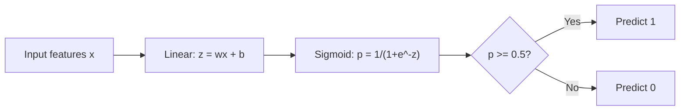
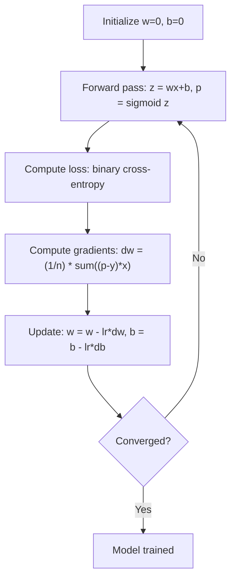

# الانحدار اللوجستي
> ينحني الانحدار اللوجستي خطًا مستقيمًا إلى منحنى S للإجابة على أسئلة نعم أو لا مع الاحتمالات.
**النوع:** بناء
** اللغات: ** بايثون
**المتطلبات الأساسية:** المرحلة الثانية الدرس 1-2 (ما هو ML، الانحدار الخطي)
**الوقت:** ~90 دقيقة
## أهداف التعلم
- تنفيذ الانحدار اللوجستي من الصفر باستخدام الدالة السيني وخسارة الإنتروبيا الثنائية
- حساب وتفسير الدقة والتذكر ودرجة F1 ومصفوفة الارتباك للتصنيف الثنائي
- اشرح سبب فشل MSE في التصنيف ولماذا ينتج الإنتروبيا الثنائية سطح تكلفة محدبًا
- بناء نموذج انحدار softmax لتصنيف متعدد الفئات وتقييم مفاضلات ضبط العتبة
## المشكلة
تريد التنبؤ بما إذا كان الورم خبيثًا أم حميدًا نظرًا لحجمه. حاولت الانحدار الخطي. يقوم بإخراج أرقام مثل 0.3 أو 1.7 أو -0.5. ماذا يعني هؤلاء؟ هل 1.7 "خبيث جدًا"؟ هل -0.5 "حميد جدًا"؟ الانحدار الخطي ينتج أرقاما غير محدودة. يحتاج التصنيف إلى احتمالات محددة بين 0 و1، وقرار واضح: نعم أو لا.
الانحدار اللوجستي يحل هذا. فهو يأخذ نفس التركيبة الخطية (wx + b) ويمررها عبر الدالة السيني، التي تسحق أي رقم في النطاق (0، 1). الناتج هو احتمال. قمت بتعيين حد (عادةً 0.5) وmake قرار.
هذه واحدة من الخوارزميات الأكثر استخدامًا على نطاق واسع في الممارسة العملية. على الرغم من اسمه، فإن الانحدار اللوجستي هو خوارزمية تصنيف، وليس خوارزمية انحدار. يأتي الاسم من الوظيفة اللوجستية (السيني) التي يستخدمها.
##المفهوم
### لماذا يفشل الانحدار الخطي في التصنيف
تخيل توقع النجاح/الرسوب (1/0) بناءً على ساعات الدراسة. الانحدار الخطي يناسب خطًا عبر البيانات:
```
hours:  1   2   3   4   5   6   7   8   9   10
actual: 0   0   0   0   1   1   1   1   1   1
```

قد ينتج عن التوافق الخطي تنبؤات مثل -0.2 في الساعة 1 و1.3 في الساعة 10. هذه القيم ليست احتمالات. فهي تنخفض إلى ما دون 0 وما فوق 1. والأسوأ من ذلك أن شخصًا واحدًا (شخص درس لمدة 50 ساعة) قد يسحب الخط بأكمله، مما يغير التوقعات للجميع.
يحتاج التصنيف إلى وظيفة:
- قيم المخرجات بين 0 و 1 (الاحتمالات)
- يخلق تحولا حادا (حدود القرار)
- لا تشوهها القيم المتطرفة البعيدة عن الحدود
### الدالة السيني
تقوم الدالة السيني بهذا بالضبط:
```
sigmoid(z) = 1 / (1 + e^(-z))
```

الخصائص:
- عندما يكون z كبيرًا وموجبًا، يقترب السيني (z) من 1
- عندما يكون z كبيرًا وسالبًا، يقترب السيني (z) من 0
- عندما يكون ض = 0، السيني (ض) = 0.5
- يكون الناتج دائمًا بين 0 و 1
- الوظيفة سلسة وقابلة للتمييز في كل مكان
المشتق له صيغة ملائمة: sigmoid'(z) = sigmoid(z) * (1 - sigmoid(z)). هذا makes حساب التدرج فعال.
### الانحدار اللوجستي = النموذج الخطي + السيني
يحسب النموذج z = wx + b (مثل الانحدار الخطي)، ثم يطبق الشكل السيني:


يتم تفسير الإخراج p على أنه P(y=1 | x)، وهو احتمال أن ينتمي الإدخال إلى الفئة 1. حدود القرار هي حيث wx + b = 0، وهو makes الناتج السيني 0.5 بالضبط.
### خسارة الانتروبيا الثنائية
لا يمكنك استخدام MSE للانحدار اللوجستي. MSE مع السيني ينشئ سطح تكلفة غير محدب مع العديد من الحدود الدنيا المحلية. بدلاً من ذلك، استخدم الإنتروبيا الثنائية (فقد السجل):
```
Loss = -(1/n) * sum(y * log(p) + (1-y) * log(1-p))
```

لماذا يعمل هذا:
- عندما تكون y=1 وp قريبة من 1: log(1) = 0، وبالتالي تكون الخسارة قريبة من 0 (صحيح، تكلفة منخفضة)
- عندما تكون y=1 وp قريبة من 0: يقترب log(0) من اللانهاية السالبة، وبالتالي تكون الخسارة ضخمة (تكلفة خاطئة وعالية)
- عندما تكون y=0 وp قريبة من 0: log(1) = 0، وبالتالي تكون الخسارة قريبة من 0 (صحيح، بتكلفة منخفضة)
- عندما تكون y=0 وp قريبة من 1: يقترب log(0) من اللانهاية السالبة، وبالتالي تكون الخسارة ضخمة (تكلفة خاطئة وعالية)
دالة الخسارة هذه محدبة للانحدار اللوجستي، مما يضمن حدًا أدنى عالميًا واحدًا.
### الهبوط المتدرج للانحدار اللوجستي
التدرجات للإنتروبيا الثنائية مع السيني لها شكل نظيف:
```
dL/dw = (1/n) * sum((p - y) * x)
dL/db = (1/n) * sum(p - y)
```

تبدو هذه متطابقة مع تدرجات الانحدار الخطي. الفرق هو أن p = السيني (wx + b) بدلاً من p = wx + b. يقدم السيني اللاخطية، لكن قاعدة تحديث التدرج تظل كما هي.


### حدود القرار
بالنسبة للمدخل ثنائي الأبعاد (ميزتان)، فإن حدود القرار هي الخط حيث:
```
w1*x1 + w2*x2 + b = 0
```

يتم تصنيف النقاط على جانب واحد على أنها 1، والنقاط على الجانب الآخر على أنها 0. ينتج الانحدار اللوجستي دائمًا حدود قرار خطية. إذا كنت بحاجة إلى حد منحني، فيمكنك إما إضافة ميزات متعددة الحدود أو استخدام نموذج غير خطي.
### تصنيف متعدد الفئات مع Softmax
يعالج الانحدار اللوجستي الثنائي فئتين. بالنسبة للفئات k، استخدم الدالة softmax:
```
softmax(z_i) = e^(z_i) / sum(e^(z_j) for all j)
```

كل فئة لها ناقل الوزن الخاص بها. يحسب النموذج النتيجة z_i لكل فئة، ثم يقوم softmax بتحويل الدرجات إلى احتمالات مجموعها 1. والفئة المتوقعة هي الفئة ذات الاحتمالية الأعلى.
تصبح دالة الخسارة قاطعة عبر الإنتروبيا:
```
Loss = -(1/n) * sum(sum(y_k * log(p_k)))
```

حيث y_k هو 1 للفئة الحقيقية و0 لجميع الفئات الأخرى (ترميز واحد ساخن).
### مقاييس التقييم
الدقة وحدها ليست كافية. بالنسبة لمجموعة البيانات التي تحتوي على 95% سلبية و5% إيجابية، فإن النموذج الذي يتنبأ دائمًا بالسالبة يحصل على دقة بنسبة 95% ولكنه عديم الفائدة.
**مصفوفة الارتباك**:
| | توقع إيجابي | توقع سلبي |
|---|---|---|
| في الواقع إيجابي | صحيح إيجابي (TP) | سلبي كاذب (FN) |
| في الواقع سلبي | إيجابية كاذبة (FP) | صحيح سلبي (TN) |
**الدقة**: من بين جميع الإيجابيات المتوقعة، ما عدد الإيجابيات الفعلية؟```
Precision = TP / (TP + FP)
```

**التذكر** (الحساسية): من بين جميع الإيجابيات الفعلية، كم عدد الإيجابيات التي حصلنا عليها؟```
Recall = TP / (TP + FN)
```

**F1 النتيجة**: المتوسط ​​التوافقي للدقة والاستذكار. يوازن كلا المقياسين.```
F1 = 2 * (Precision * Recall) / (Precision + Recall)
```

متى يجب تحديد الأولويات:
- **الدقة**: عندما تكون النتائج الإيجابية الخاطئة مكلفة (فلتر البريد العشوائي، لا ترغب في حظر البريد الإلكتروني legitimate)
- **تذكر**: عندما تكون النتائج السلبية الكاذبة مكلفة (فحص السرطان، لا تريد تفويت الورم)
- **F1**: عندما تحتاج إلى مقياس واحد متوازن
## بنائها
### الخطوة 1: وظيفة السيني وتوليد البيانات
```python
import random
import math

def sigmoid(z):
    z = max(-500, min(500, z))
    return 1.0 / (1.0 + math.exp(-z))


random.seed(42)
N = 200
X = []
y = []

for _ in range(N // 2):
    X.append([random.gauss(2, 1), random.gauss(2, 1)])
    y.append(0)

for _ in range(N // 2):
    X.append([random.gauss(5, 1), random.gauss(5, 1)])
    y.append(1)

combined = list(zip(X, y))
random.shuffle(combined)
X, y = zip(*combined)
X = list(X)
y = list(y)

print(f"Generated {N} samples (2 classes, 2 features)")
print(f"Class 0 center: (2, 2), Class 1 center: (5, 5)")
print(f"First 5 samples:")
for i in range(5):
    print(f"  Features: [{X[i][0]:.2f}, {X[i][1]:.2f}], Label: {y[i]}")
```

### الخطوة الثانية: الانحدار اللوجستي من الصفر
```python
class LogisticRegression:
    def __init__(self, n_features, learning_rate=0.01):
        self.weights = [0.0] * n_features
        self.bias = 0.0
        self.lr = learning_rate
        self.loss_history = []

    def predict_proba(self, x):
        z = sum(w * xi for w, xi in zip(self.weights, x)) + self.bias
        return sigmoid(z)

    def predict(self, x, threshold=0.5):
        return 1 if self.predict_proba(x) >= threshold else 0

    def compute_loss(self, X, y):
        n = len(y)
        total = 0.0
        for i in range(n):
            p = self.predict_proba(X[i])
            p = max(1e-15, min(1 - 1e-15, p))
            total += y[i] * math.log(p) + (1 - y[i]) * math.log(1 - p)
        return -total / n

    def fit(self, X, y, epochs=1000, print_every=200):
        n = len(y)
        n_features = len(X[0])
        for epoch in range(epochs):
            dw = [0.0] * n_features
            db = 0.0
            for i in range(n):
                p = self.predict_proba(X[i])
                error = p - y[i]
                for j in range(n_features):
                    dw[j] += error * X[i][j]
                db += error
            for j in range(n_features):
                self.weights[j] -= self.lr * (dw[j] / n)
            self.bias -= self.lr * (db / n)
            loss = self.compute_loss(X, y)
            self.loss_history.append(loss)
            if epoch % print_every == 0:
                print(f"  Epoch {epoch:4d} | Loss: {loss:.4f} | w: [{self.weights[0]:.3f}, {self.weights[1]:.3f}] | b: {self.bias:.3f}")
        return self

    def accuracy(self, X, y):
        correct = sum(1 for i in range(len(y)) if self.predict(X[i]) == y[i])
        return correct / len(y)


split = int(0.8 * N)
X_train, X_test = X[:split], X[split:]
y_train, y_test = y[:split], y[split:]

print("\n=== Training Logistic Regression ===")
model = LogisticRegression(n_features=2, learning_rate=0.1)
model.fit(X_train, y_train, epochs=1000, print_every=200)

print(f"\nTrain accuracy: {model.accuracy(X_train, y_train):.4f}")
print(f"Test accuracy:  {model.accuracy(X_test, y_test):.4f}")
print(f"Weights: [{model.weights[0]:.4f}, {model.weights[1]:.4f}]")
print(f"Bias: {model.bias:.4f}")
```

### الخطوة 3: مصفوفة الارتباك والمقاييس من الصفر
```python
class ClassificationMetrics:
    def __init__(self, y_true, y_pred):
        self.tp = sum(1 for t, p in zip(y_true, y_pred) if t == 1 and p == 1)
        self.tn = sum(1 for t, p in zip(y_true, y_pred) if t == 0 and p == 0)
        self.fp = sum(1 for t, p in zip(y_true, y_pred) if t == 0 and p == 1)
        self.fn = sum(1 for t, p in zip(y_true, y_pred) if t == 1 and p == 0)

    def accuracy(self):
        total = self.tp + self.tn + self.fp + self.fn
        return (self.tp + self.tn) / total if total > 0 else 0

    def precision(self):
        denom = self.tp + self.fp
        return self.tp / denom if denom > 0 else 0

    def recall(self):
        denom = self.tp + self.fn
        return self.tp / denom if denom > 0 else 0

    def f1(self):
        p = self.precision()
        r = self.recall()
        return 2 * p * r / (p + r) if (p + r) > 0 else 0

    def print_confusion_matrix(self):
        print(f"\n  Confusion Matrix:")
        print(f"                  Predicted")
        print(f"                  Pos   Neg")
        print(f"  Actual Pos     {self.tp:4d}  {self.fn:4d}")
        print(f"  Actual Neg     {self.fp:4d}  {self.tn:4d}")

    def print_report(self):
        self.print_confusion_matrix()
        print(f"\n  Accuracy:  {self.accuracy():.4f}")
        print(f"  Precision: {self.precision():.4f}")
        print(f"  Recall:    {self.recall():.4f}")
        print(f"  F1 Score:  {self.f1():.4f}")


y_pred_test = [model.predict(x) for x in X_test]
print("\n=== Classification Report (Test Set) ===")
metrics = ClassificationMetrics(y_test, y_pred_test)
metrics.print_report()
```

### الخطوة 4: تحليل حدود القرار
```python
print("\n=== Decision Boundary ===")
w1, w2 = model.weights
b = model.bias
print(f"Decision boundary: {w1:.4f}*x1 + {w2:.4f}*x2 + {b:.4f} = 0")
if abs(w2) > 1e-10:
    print(f"Solved for x2:     x2 = {-w1/w2:.4f}*x1 + {-b/w2:.4f}")

print("\nSample predictions near the boundary:")
test_points = [
    [3.0, 3.0],
    [3.5, 3.5],
    [4.0, 4.0],
    [2.5, 2.5],
    [5.0, 5.0],
]
for point in test_points:
    prob = model.predict_proba(point)
    pred = model.predict(point)
    print(f"  [{point[0]}, {point[1]}] -> prob={prob:.4f}, class={pred}")
```

### الخطوة 5: متعدد الفئات مع softmax
```python
class SoftmaxRegression:
    def __init__(self, n_features, n_classes, learning_rate=0.01):
        self.n_features = n_features
        self.n_classes = n_classes
        self.lr = learning_rate
        self.weights = [[0.0] * n_features for _ in range(n_classes)]
        self.biases = [0.0] * n_classes

    def softmax(self, scores):
        max_score = max(scores)
        exp_scores = [math.exp(s - max_score) for s in scores]
        total = sum(exp_scores)
        return [e / total for e in exp_scores]

    def predict_proba(self, x):
        scores = [
            sum(self.weights[k][j] * x[j] for j in range(self.n_features)) + self.biases[k]
            for k in range(self.n_classes)
        ]
        return self.softmax(scores)

    def predict(self, x):
        probs = self.predict_proba(x)
        return probs.index(max(probs))

    def fit(self, X, y, epochs=1000, print_every=200):
        n = len(y)
        for epoch in range(epochs):
            grad_w = [[0.0] * self.n_features for _ in range(self.n_classes)]
            grad_b = [0.0] * self.n_classes
            total_loss = 0.0
            for i in range(n):
                probs = self.predict_proba(X[i])
                for k in range(self.n_classes):
                    target = 1.0 if y[i] == k else 0.0
                    error = probs[k] - target
                    for j in range(self.n_features):
                        grad_w[k][j] += error * X[i][j]
                    grad_b[k] += error
                true_prob = max(probs[y[i]], 1e-15)
                total_loss -= math.log(true_prob)
            for k in range(self.n_classes):
                for j in range(self.n_features):
                    self.weights[k][j] -= self.lr * (grad_w[k][j] / n)
                self.biases[k] -= self.lr * (grad_b[k] / n)
            if epoch % print_every == 0:
                print(f"  Epoch {epoch:4d} | Loss: {total_loss / n:.4f}")
        return self

    def accuracy(self, X, y):
        correct = sum(1 for i in range(len(y)) if self.predict(X[i]) == y[i])
        return correct / len(y)


random.seed(42)
X_3class = []
y_3class = []

centers = [(1, 1), (5, 1), (3, 5)]
for label, (cx, cy) in enumerate(centers):
    for _ in range(50):
        X_3class.append([random.gauss(cx, 0.8), random.gauss(cy, 0.8)])
        y_3class.append(label)

combined = list(zip(X_3class, y_3class))
random.shuffle(combined)
X_3class, y_3class = zip(*combined)
X_3class = list(X_3class)
y_3class = list(y_3class)

split_3 = int(0.8 * len(X_3class))
X_train_3 = X_3class[:split_3]
y_train_3 = y_3class[:split_3]
X_test_3 = X_3class[split_3:]
y_test_3 = y_3class[split_3:]

print("\n=== Multi-class Softmax Regression (3 classes) ===")
softmax_model = SoftmaxRegression(n_features=2, n_classes=3, learning_rate=0.1)
softmax_model.fit(X_train_3, y_train_3, epochs=1000, print_every=200)
print(f"\nTrain accuracy: {softmax_model.accuracy(X_train_3, y_train_3):.4f}")
print(f"Test accuracy:  {softmax_model.accuracy(X_test_3, y_test_3):.4f}")

print("\nSample predictions:")
for i in range(5):
    probs = softmax_model.predict_proba(X_test_3[i])
    pred = softmax_model.predict(X_test_3[i])
    print(f"  True: {y_test_3[i]}, Predicted: {pred}, Probs: [{', '.join(f'{p:.3f}' for p in probs)}]")
```

### الخطوة 6: ضبط العتبة
```python
print("\n=== Threshold Tuning ===")
print("Default threshold: 0.5. Adjusting the threshold trades precision for recall.\n")

thresholds = [0.3, 0.4, 0.5, 0.6, 0.7]
print(f"{'Threshold':>10} {'Accuracy':>10} {'Precision':>10} {'Recall':>10} {'F1':>10}")
print("-" * 52)

for t in thresholds:
    y_pred_t = [1 if model.predict_proba(x) >= t else 0 for x in X_test]
    m = ClassificationMetrics(y_test, y_pred_t)
    print(f"{t:>10.1f} {m.accuracy():>10.4f} {m.precision():>10.4f} {m.recall():>10.4f} {m.f1():>10.4f}")
```

## استخدمه
الآن نفس الشيء مع scikit-learn.
```python
from sklearn.linear_model import LogisticRegression as SklearnLR
from sklearn.metrics import accuracy_score, precision_score, recall_score, f1_score
from sklearn.metrics import confusion_matrix, classification_report
from sklearn.model_selection import train_test_split
from sklearn.preprocessing import StandardScaler
import numpy as np

np.random.seed(42)
X_0 = np.random.randn(100, 2) + [2, 2]
X_1 = np.random.randn(100, 2) + [5, 5]
X_sk = np.vstack([X_0, X_1])
y_sk = np.array([0] * 100 + [1] * 100)

X_tr, X_te, y_tr, y_te = train_test_split(X_sk, y_sk, test_size=0.2, random_state=42)

scaler = StandardScaler()
X_tr_sc = scaler.fit_transform(X_tr)
X_te_sc = scaler.transform(X_te)

lr = SklearnLR()
lr.fit(X_tr_sc, y_tr)
y_pred = lr.predict(X_te_sc)

print("=== Scikit-learn Logistic Regression ===")
print(f"Accuracy:  {accuracy_score(y_te, y_pred):.4f}")
print(f"Precision: {precision_score(y_te, y_pred):.4f}")
print(f"Recall:    {recall_score(y_te, y_pred):.4f}")
print(f"F1:        {f1_score(y_te, y_pred):.4f}")
print(f"\nConfusion Matrix:\n{confusion_matrix(y_te, y_pred)}")
print(f"\nClassification Report:\n{classification_report(y_te, y_pred)}")
```

ينتج عن التنفيذ من البداية نفس حدود القرار والمقاييس. يضيف Scikit-learn خيارات الحل (liblinear، lbfgs، saga)، والتنظيم التلقائي، واستراتيجيات متعددة الفئات (واحد مقابل بقية، متعدد الحدود)، وتحسينات الاستقرار العددي.
## اشحنها
ينتج هذا الدرس:
- `code/logistic_regression.py` - الانحدار اللوجستي من الصفر باستخدام المقاييس
## تمارين
1. أنشئ مجموعة بيانات NOT قابلة للفصل خطيًا (على سبيل المثال، دائرتين متحدة المركز). تدريب الانحدار اللوجستي وملاحظة فشله. ثم أضف ميزات متعددة الحدود (x1^2، x2^2، x1*x2) وتدرب مرة أخرى. أظهر أن الدقة تتحسن.
2. تنفيذ مصفوفة ارتباك متعددة الفئات لنموذج softmax ثلاثي الفئات. حساب الدقة والتذكر لكل فئة. ما هي الفئة الأصعب في التصنيف؟
3. أنشئ منحنى ROC من الصفر. بالنسبة لقيم العتبة 100 من 0 إلى 1، قم بحساب المعدل الإيجابي الحقيقي والمعدل الإيجابي الخاطئ. احسب AUC (المساحة أسفل المنحنى) باستخدام قاعدة شبه المنحرف.
## المصطلحات الرئيسية
| مصطلح | ماذا يقول الناس | ماذا يعني في الواقع |
|------|----------------|----------------------|
| الانحدار اللوجستي | "الانحدار للتصنيف" | نموذج خطي متبوعًا بالدالة السينية التي تنتج احتمالات الفئة |
| وظيفة السيني | "منحنى S" | الدالة 1/(1+e^(-z)) التي تعين أي رقم حقيقي للمدى (0, 1) |
| ثنائي عبر الانتروبيا | "فقدان السجل" | دالة الخسارة -[y*log(p) + (1-y)*log(1-p)] التي تعاقب بشدة التنبؤات الخاطئة الواثقة |
| حدود القرار | "الخط الفاصل" | السطح الذي يساوي فيه احتمال مخرجات النموذج 0.5، ويفصل بين الفئات المتوقعة |
| سوفت ماكس | "السيني متعدد الطبقات" | دالة تقوم بتحويل متجه الدرجات إلى احتمالات مجموعها 1 |
| الدقة | "كم عدد المختارين ذوي الصلة" | TP / (TP + FP)، جزء التوقعات الإيجابية الإيجابية بالفعل |
| أذكر | "كم عدد الأشخاص ذوي الصلة الذين تم اختيارهم" | TP / (TP + FN)، جزء الإيجابيات الفعلية التي يحددها النموذج بشكل صحيح |
| F1 النتيجة | "الدقة المتوازنة" | الوسط التوافقي للدقة والاستذكار: 2*P*R / (P+R) |
| مصفوفة الارتباك | "تفصيل الخطأ" | جدول يوضح TP، ​​TN، FP، FN لكل زوج من الفصول |
| العتبة | "الانقطاع" | قيمة الاحتمالية التي يتنبأ النموذج فوقها بالفئة 1 (افتراضي 0.5، قابل للضبط) |
| ترميز واحد ساخن | "الأعمدة الثنائية للفئات" | تمثيل الفئة k كمتجه للأصفار مع 1 في الموضع k |
| الانتروبيا القاطعة | "فقدان سجل متعدد الفئات" | امتداد الإنتروبيا الثنائية إلى فئات k باستخدام تسميات مشفرة واحدة ساخنة |