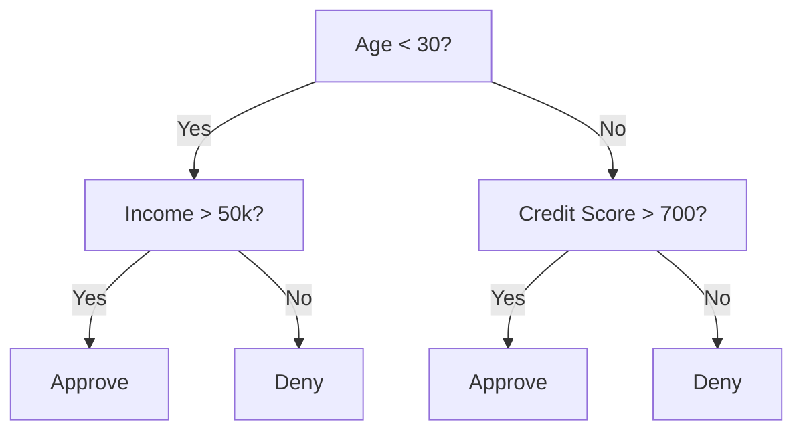
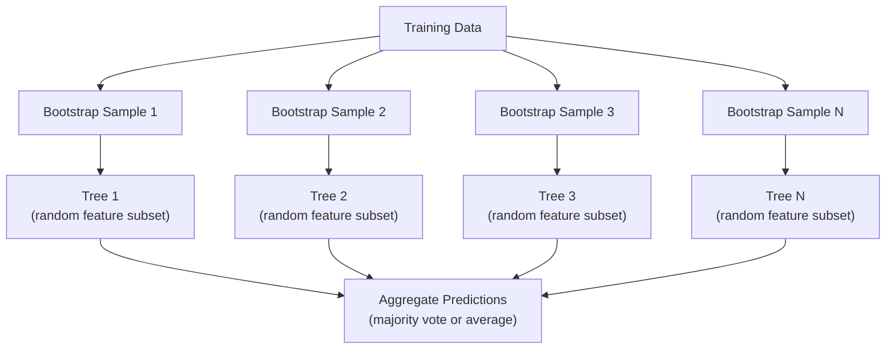

# Decision Trees and Random Forests

> شجرة القرار هي مجرد مخطط انسيابي. لكن غابة منهم تعتبر من أقوى الأدوات في ML.

**النوع:** بناء
** اللغة: ** بايثون
**المتطلبات السابقة:** المرحلة الأولى (الدروس 09 نظرية المعلومات، 06 الاحتمالية)
**الوقت:** ~90 دقيقة

## Learning Objectives

- تنفيذ حسابات جيني للشوائب والإنتروبيا واكتساب المعلومات للعثور على تقسيمات شجرة القرار الأمثل
- بناء مصنف شجرة القرار من الصفر باستخدام عناصر التحكم المسبقة (العمق الأقصى، الحد الأدنى للعينات)
- إنشاء غابة عشوائية باستخدام أخذ عينات التمهيد والتوزيع العشوائي للميزات، وشرح سبب تقليل التباين
- قارن أهمية ميزة MDI مع أهمية التقليب وحدد متى يكون MDI متحيزًا

## The Problem

لديك بيانات جدولية. الصفوف عبارة عن نماذج، والأعمدة عبارة عن ميزات، ويوجد عمود مستهدف تريد التنبؤ به. يمكنك رمي شبكة عصبية عليها. ولكن بالنسبة للبيانات الجدولية، فإن النماذج المستندة إلى الأشجار (أشجار القرار، والغابات العشوائية، والأشجار المعززة التدرجية) تتفوق باستمرار على التعلم العميق. تهيمن XGBoost وLightGBM على مسابقات Kaggle على البيانات المنظمة، وليس المحولات.

لماذا؟ تتعامل الأشجار مع أنواع الميزات المختلطة (الرقمية والفئوية) دون معالجة مسبقة. إنهم يتعاملون مع العلاقات غير الخطية دون هندسة الميزات. إنها قابلة للتفسير: يمكنك أن تنظر إلى الشجرة وترى بالضبط سبب التنبؤ. والغابات العشوائية، التي تحتوي في المتوسط ​​على عدد كبير من الأشجار، شديدة المقاومة للتركيب الزائد في مجموعات البيانات متوسطة الحجم.

يقوم هذا الدرس ببناء أشجار القرار من الصفر باستخدام التقسيم التكراري، ثم إنشاء غابة عشوائية في الأعلى. سوف تقوم بتطبيق الرياضيات وراء معايير الانقسام (شوائب جيني، والإنتروبيا، واكتساب المعلومات) وفهم لماذا تصبح مجموعة من المتعلمين الضعفاء مجموعة قوية.

## The Concept

### What a decision tree does

تقوم شجرة القرار بتقسيم مساحة الميزة إلى مناطق مستطيلة عن طريق طرح سلسلة من الأسئلة بنعم/لا.



كل node داخلي يختبر ميزة ما مقابل حد معين. كل ورقة node makeتنبؤ. لتصنيف نقطة بيانات جديدة، عليك أن تبدأ من الجذر وتتبع الفروع حتى تصل إلى ورقة.

يتم إنشاء الشجرة من أعلى إلى أسفل عن طريق اختيار، عند كل node، الميزة والعتبة التي تفصل البيانات بشكل أفضل. يتم تعريف "الأفضل" بمعيار الانقسام.

### Split criteria: measuring impurity

في كل node، لدينا مجموعة من العينات. نريد تقسيمهم بحيث يكون الطفل الناتج node "نقيًا" قدر الإمكان، مما يعني أن كل طفل يحتوي على فئة واحدة في الغالب.

**شوائب جيني** تقيس احتمالية أن يتم تصنيف العينة المختارة عشوائيًا بشكل خاطئ إذا تم تصنيفها وفقًا للتوزيع الطبقي عند node.

```
Gini(S) = 1 - sum(p_k^2)

where p_k is the proportion of class k in set S.
```

للحصول على node خالص (كل فئة واحدة)، Gini = 0. بالنسبة للتقسيم الثنائي بفئات 50/50، Gini = 0.5. أقل هو أفضل.

```
Example: 6 cats, 4 dogs

Gini = 1 - (0.6^2 + 0.4^2) = 1 - (0.36 + 0.16) = 0.48
```

**الإنتروبيا** يقيس محتوى المعلومات (الاضطراب) في node. تمت تغطيته في المرحلة الأولى الدرس 09.

```
Entropy(S) = -sum(p_k * log2(p_k))
```

للحصول على node نقي، الإنتروبيا = 0. بالنسبة للتقسيم الثنائي 50/50، الإنتروبيا = 1.0. أقل هو أفضل.

```
Example: 6 cats, 4 dogs

Entropy = -(0.6 * log2(0.6) + 0.4 * log2(0.4))
        = -(0.6 * -0.737 + 0.4 * -1.322)
        = 0.442 + 0.529
        = 0.971 bits
```

**اكتساب المعلومات** هو انخفاض الشوائب (الإنتروبيا أو جيني) بعد الانقسام.

```
IG(S, feature, threshold) = Impurity(S) - weighted_avg(Impurity(S_left), Impurity(S_right))

where the weights are the proportions of samples in each child.
```

الخوارزمية الجشعة في كل node: جرب كل ميزة وكل عتبة ممكنة. اختر زوج (الميزة، العتبة) الذي يزيد من اكتساب المعلومات.

### How splitting works

لمجموعة بيانات تحتوي على ميزات n وعينات m في الوقت الحالي node:

1. لكل ميزة j (j = 1 إلى n): - فرز العينات حسب الميزة ي - جرب كل نقطة وسط بين القيم المميزة المتتالية كعتبة - حساب كسب المعلومات لكل عتبة
2. حدد الميزة والعتبة التي تتمتع بأعلى نسبة كسب للمعلومات
3. قم بتقسيم البيانات إلى اليسار (الميزة <= العتبة) واليمين (الميزة > العتبة)
4. العتاب على كل طفل

هذا النهج الجشع لا يضمن الشجرة المثالية عالميًا. العثور على الشجرة المثالية هو NP-صعب. لكن التقسيم الجشع يعمل بشكل جيد في الممارسة العملية.

### Stopping conditions

وبدون شروط التوقف، تنمو الشجرة حتى تصبح كل ورقة نقية (عينة واحدة لكل ورقة). هذا يحفظ بيانات التدريب بشكل مثالي ويعمم بشكل رهيب.

**التقليم المسبق** يوقف الشجرة قبل أن تنمو بشكل كامل:
- الحد الأقصى للعمق: توقف عن الانقسام عندما تصل الشجرة إلى عمق محدد
- الحد الأدنى من العينات لكل ورقة: توقف إذا كان node يحتوي على أقل من k من العينات
- الحد الأدنى لكسب المعلومة: توقف إذا كان القسمة الأفضل يحسن النجاسة بأقل من عتبة
- الحد الأقصى للأوراق nodes: تحديد العدد الإجمالي للأوراق

**بعد التقليم** تنمو الشجرة بالكامل ثم تقوم بقصها مرة أخرى:
- التقليم ذو التكلفة المعقدة (المستخدم بواسطة scikit-learn): يضيف عقوبة تتناسب مع عدد الأوراق. زيادة العقوبة للحصول على أشجار أصغر
- تقليل تقليم الأخطاء: قم بإزالة الشجرة الفرعية إذا لم يزد خطأ التحقق من الصحة

التقليم المسبق أسهل وأسرع. غالبًا ما ينتج بعد التقليم أشجارًا أفضل لأنه لا يوقف الانقسامات قبل الأوان التي قد تؤدي إلى مزيد من الانقسامات المفيدة.

### Decision trees for regression

بالنسبة للانحدار، فإن توقع الورقة هو متوسط ​​القيم المستهدفة في تلك الورقة. يتغير معيار الانقسام أيضًا:

**تقليل التباين** يحل محل اكتساب المعلومات:

```
VR(S, feature, threshold) = Var(S) - weighted_avg(Var(S_left), Var(S_right))
```

اختر التقسيم الذي يقلل التباين أكثر. تقوم الشجرة بتقسيم مساحة الإدخال إلى مناطق، وتتنبأ بثابت (المتوسط) في كل منطقة.

### Random forests: the power of ensembles

تعتبر شجرة القرار الواحدة ذات تباين عالٍ. التغييرات الصغيرة في البيانات يمكن أن تنتج أشجارًا مختلفة تمامًا. تعمل الغابات العشوائية على إصلاح ذلك عن طريق حساب متوسط ​​العديد من الأشجار.



مصدران للعشوائية make الأشجار متنوعة:

**التعبئة (تجميع التمهيد):** يتم تدريب كل شجرة على عينة تمهيد، وهي عينة عشوائية مع استبدال من بيانات التدريب. يظهر حوالي 63% من العينات الأصلية في كل عملية تمهيد (والباقي عبارة عن عينات جاهزة يمكن استخدامها للتحقق من الصحة).

**التوزيع العشوائي للميزات:** عند كل تقسيم، يتم أخذ مجموعة فرعية عشوائية فقط من الميزات في الاعتبار. بالنسبة للتصنيف، الافتراضي هو sqrt(n_features). بالنسبة للانحدار، n_features/3. وهذا يمنع جميع الأشجار من الانقسام على نفس السمة السائدة.

الفكرة الأساسية: إن حساب متوسط ​​العديد من الأشجار غير المترابطة يقلل من التباين دون زيادة التحيز. قد تكون كل شجرة على حدة متواضعة. الفرقة قوية.

### Feature importance

توفر الغابات العشوائية بشكل طبيعي درجات أهمية الميزة. الطريقة الأكثر شيوعًا:

**متوسط ​​انخفاض الشوائب (MDI):** لكل ميزة، اجمع إجمالي الانخفاض في الشوائب عبر جميع الأشجار وجميع node حيث يتم استخدام هذه الميزة. تعد الميزات التي تنتج تخفيضات أكبر في الشوائب عند الانقسامات السابقة أكثر أهمية.

```
importance(feature_j) = sum over all nodes where feature_j is used:
    (n_samples_at_node / n_total_samples) * impurity_decrease
```

يعد هذا سريعًا (يتم حسابه أثناء التدريب) ولكنه متحيز نحو الميزات ذات الأهمية العالية والميزات التي تحتوي على العديد من نقاط الانقسام المحتملة.

**أهمية التقليب** هي البديل: خلط قيم ميزة واحدة وقياس مدى انخفاض دقة النموذج. أكثر موثوقية ولكن أبطأ.

### When trees beat neural networks

تهيمن الأشجار والغابات على الشبكات العصبية في البيانات الجدولية. عدة أسباب:

| عامل | أشجار | الشبكات العصبية |
|--------|------|----------------|
| الأنواع المختلطة (رقمية + فئوية) | الدعم الأصلي | تحتاج إلى ترميز |
| مجموعات بيانات صغيرة (<10 آلاف صف) | اعمل بشكل جيد | الإفراط في التجهيز |
| تفاعلات مميزة | وجدت عن طريق تقسيم | بحاجة إلى تصميم معماري |
| التفسير | الشفافية الكاملة | الصندوق الأسود |
| وقت التدريب | دقائق | ساعات |
| حساسية المعلمة المفرطة | منخفض | عالية |

تفوز الشبكات العصبية عندما تحتوي البيانات على بنية مكانية أو تسلسلية (الصور والنصوص والصوت). بالنسبة للجداول المسطحة للمعالم، تكون الأشجار هي الوضع الافتراضي.

## Build It

### Step 1: Gini impurity and entropy

قم ببناء معياري التقسيم من البداية وتأكد من موافقتهما على التقسيمات الجيدة.

```python
import math

def gini_impurity(labels):
    n = len(labels)
    if n == 0:
        return 0.0
    counts = {}
    for label in labels:
        counts[label] = counts.get(label, 0) + 1
    return 1.0 - sum((c / n) ** 2 for c in counts.values())

def entropy(labels):
    n = len(labels)
    if n == 0:
        return 0.0
    counts = {}
    for label in labels:
        counts[label] = counts.get(label, 0) + 1
    return -sum(
        (c / n) * math.log2(c / n) for c in counts.values() if c > 0
    )
```

### Step 2: Find the best split

جرب كل ميزة وكل عتبة. قم بإرجاع الشخص الذي يتمتع بأعلى كسب للمعلومات.

```python
def information_gain(parent_labels, left_labels, right_labels, criterion="gini"):
    measure = gini_impurity if criterion == "gini" else entropy
    n = len(parent_labels)
    n_left = len(left_labels)
    n_right = len(right_labels)
    if n_left == 0 or n_right == 0:
        return 0.0
    parent_impurity = measure(parent_labels)
    child_impurity = (
        (n_left / n) * measure(left_labels) +
        (n_right / n) * measure(right_labels)
    )
    return parent_impurity - child_impurity
```

### Step 3: Build the DecisionTree class

التقسيم العودي والتنبؤ وتتبع أهمية الميزة.

```python
class DecisionTree:
    def __init__(self, max_depth=None, min_samples_split=2,
                 min_samples_leaf=1, criterion="gini",
                 max_features=None):
        self.max_depth = max_depth
        self.min_samples_split = min_samples_split
        self.min_samples_leaf = min_samples_leaf
        self.criterion = criterion
        self.max_features = max_features
        self.tree = None
        self.feature_importances_ = None

    def fit(self, X, y):
        self.n_features = len(X[0])
        self.feature_importances_ = [0.0] * self.n_features
        self.n_samples = len(X)
        self.tree = self._build(X, y, depth=0)
        total = sum(self.feature_importances_)
        if total > 0:
            self.feature_importances_ = [
                fi / total for fi in self.feature_importances_
            ]

    def predict(self, X):
        return [self._predict_one(x, self.tree) for x in X]
```

### Step 4: Build the RandomForest class

أخذ عينات Bootstrap، والعشوائية للميزات، وتصويت الأغلبية.

```python
class RandomForest:
    def __init__(self, n_trees=100, max_depth=None,
                 min_samples_split=2, max_features="sqrt",
                 criterion="gini"):
        self.n_trees = n_trees
        self.max_depth = max_depth
        self.min_samples_split = min_samples_split
        self.max_features = max_features
        self.criterion = criterion
        self.trees = []

    def fit(self, X, y):
        n = len(X)
        for _ in range(self.n_trees):
            indices = [random.randint(0, n - 1) for _ in range(n)]
            X_boot = [X[i] for i in indices]
            y_boot = [y[i] for i in indices]
            tree = DecisionTree(
                max_depth=self.max_depth,
                min_samples_split=self.min_samples_split,
                max_features=self.max_features,
                criterion=self.criterion,
            )
            tree.fit(X_boot, y_boot)
            self.trees.append(tree)

    def predict(self, X):
        all_preds = [tree.predict(X) for tree in self.trees]
        predictions = []
        for i in range(len(X)):
            votes = {}
            for preds in all_preds:
                v = preds[i]
                votes[v] = votes.get(v, 0) + 1
            predictions.append(max(votes, key=votes.get))
        return predictions
```

راجع `code/trees.py` للاطلاع على التنفيذ الكامل لجميع الطرق المساعدة.

## Use It

مع scikit-learn، يتكون تدريب الغابة العشوائية من ثلاثة أسطر:

```python
from sklearn.ensemble import RandomForestClassifier
from sklearn.datasets import load_iris
from sklearn.model_selection import train_test_split

X, y = load_iris(return_X_y=True)
X_train, X_test, y_train, y_test = train_test_split(X, y, random_state=42)

rf = RandomForestClassifier(n_estimators=100, random_state=42)
rf.fit(X_train, y_train)
print(f"Accuracy: {rf.score(X_test, y_test):.4f}")
print(f"Feature importances: {rf.feature_importances_}")
```

من الناحية العملية، غالبًا ما تكون الأشجار المعززة المتدرجة (XGBoost، LightGBM، CatBoost) أقوى من الغابات العشوائية لأنها تبني الأشجار بشكل تسلسلي، حيث تقوم كل شجرة بتصحيح أخطاء الأشجار السابقة. لكن الغابات العشوائية يصعب تكوينها بشكل خاطئ ولا تتطلب تقريبًا أي ضبط للمعلمات الفائقة.

## Ship It

ينتج عن هذا الدرس `outputs/prompt-tree-interpreter.md` — مطالبة تفسر تقسيمات شجرة القرار لأصحاب المصلحة في الأعمال. قم بإطعامه ببنية شجرة مدربة (العمق، والميزات، والعتبات المقسمة، والدقة) ويترجم النموذج إلى قواعد لغة واضحة، وأهمية ميزات التصنيف، وتجاوز الأعلام أو التسرب، والتوصية بالخطوات التالية. استخدمه في أي وقت تحتاج فيه إلى شرح نموذج قائم على الشجرة لشخص لا يقرأ التعليمات البرمجية.

## Exercises

1. قم بتدريب شجرة قرار واحدة على مجموعة بيانات ثنائية الأبعاد مكونة من 3 فئات. تتبع الانقسامات يدويًا وارسم حدود القرار المستطيلة. قارن الحدود عند max_Deep=2 vs max_Deep=10.

2. تنفيذ تقسيم تقليل التباين لأشجار الانحدار. قم بإنشاء y = sin(x) + الضوضاء لـ 200 نقطة وتناسب شجرة الانحدار الخاصة بك. ارسم تنبؤات الشجرة الثابتة المقطعية مقابل المنحنى الحقيقي.

3. قم ببناء غابة عشوائية تحتوي على 1، 5، 10، 50، و200 شجرة. دقة التدريب على الرسم ودقة الاختبار مقابل عدد الأشجار. لاحظ أن دقة الاختبار ثابتة ولكنها لا تنخفض (الغابات تقاوم التجهيز الزائد).

4. قارن بين شوائب جيني والإنتروبيا كمعايير مقسمة على 5 مجموعات بيانات مختلفة. قياس الدقة وعمق الشجرة. وفي معظم الحالات، فإنها تنتج نتائج متطابقة تقريبًا. اشرح لماذا.

5. أهمية تنفيذ التقليب. قارنها بأهمية MDI في مجموعة بيانات حيث تكون إحدى الميزات عبارة عن ضوضاء عشوائية ولكن لها علاقة أساسية عالية. MDI سوف يصنف ميزة الضوضاء بدرجة عالية. سوف أهمية التقليب لا.

## Key Terms

| مصطلح | ماذا يقول الناس | ماذا يعني في الواقع |
|------|----------------|----------------------|
| شجرة القرار | "مخطط انسيابي للتنبؤات" | نموذج يقوم بتقسيم المساحة إلى مناطق مستطيلة من خلال تعلم تسلسل تقسيمات if/else |
| نجاسة جيني | "ما مدى اختلاط node" | احتمال الخطأ في تصنيف عينة عشوائية عند node. 0 = نقي، 0.5 = الحد الأقصى للشوائب للثنائي |
| الانتروبيا | "الاضطراب في node" | محتوى المعلومات في node. 0 = نقي، 1.0 = أقصى قدر من عدم اليقين للثنائي. من نظرية المعلومات |
| كسب المعلومات | "ما أحسن القسمة" | تخفيض النجاسة بعد الانقسام. المعيار الجشع لاختيار الانقسامات |
| التقليم المسبق | "أوقف الشجرة مبكرًا" | إيقاف نمو الشجرة مبكرًا عن طريق تحديد الحد الأقصى للعمق أو الحد الأدنى للعينات أو الحد الأدنى للكسب |
| ما بعد التقليم | "قُلِّمُوا الشَّجَرَةَ بَعْدَ" | تنمية الشجرة الكاملة، ثم إزالة الأشجار الفرعية التي لا تعمل على تحسين أداء التحقق من الصحة |
| التعبئة | "تدريب على مجموعات فرعية عشوائية" | تجميع التمهيد. تدريب كل نموذج على عينة عشوائية مختلفة مع الاستبدال |
| غابة عشوائية | "حفنة من الأشجار" | مجموعة من أشجار القرار، تم تدريب كل منها على عينة التمهيد مع مجموعات فرعية من الميزات العشوائية في كل قسم |
| أهمية الميزة (MDI) | "ما هي الميزات المهمة" | إجمالي انخفاض الشوائب الذي ساهمت به كل ميزة، تم جمعه عبر جميع الأشجار وnodes |
| أهمية التقليب | "خلط ورق اللعب والتحقق" | تنخفض الدقة عندما يتم تبديل قيم الميزة بشكل عشوائي. أكثر موثوقية من MDI بالنسبة للميزات الصاخبة |
| تخفيض التباين | "نسخة الانحدار من كسب المعلومات" | شجرة الانحدار التناظرية لاكتساب المعلومات. يختار التقسيم الذي يقلل التباين المستهدف إلى أقصى حد |
| عينة بوتستراب | "عينة عشوائية مع التكرارات" | عينة عشوائية مأخوذة مع الاستبدال من مجموعة البيانات الأصلية. نفس الحجم، ولكن مع التكرارات |

## Further Reading

- [Breiman: Random Forests (2001)](https://link.springer.com/article/10.1023/A:1010933404324) - the original random forest paper
- [Grinsztajn et al.: Why do tree-based models still outperform deep learning on tabular data? (2022)](https://arxiv.org/abs/2207.08815) - مقارنة دقيقة بين الأشجار والشبكات العصبية في المهام الجدولية
- [scikit Decision Trees documentation](https://scikit-learn.org/stable/modules/tree.html) - practical guide with visualization tools
- [XGBoost: A Scalable Tree Boosting System (Chen & Guestrin, 2016)](https://arxiv.org/abs/1603.02754) - ورقة تعزيز التدرج التي تهيمن على Kaggle
