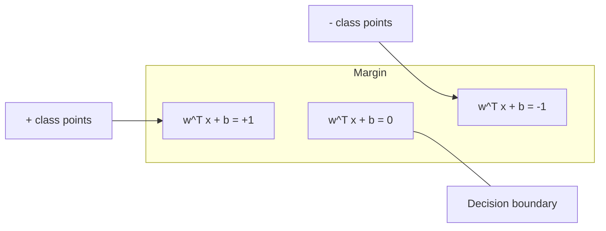
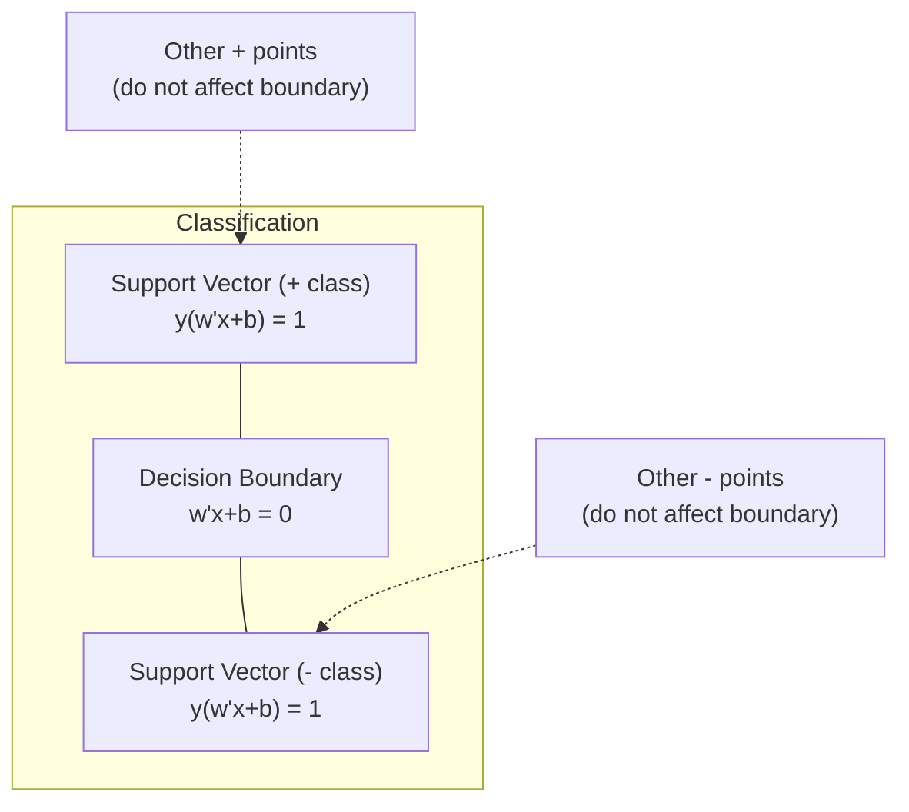
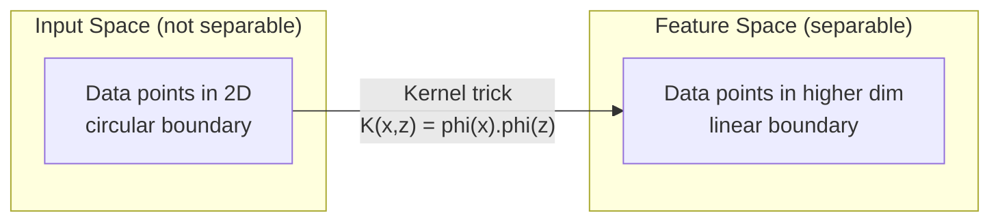

# Support Vector Machines

> ابحث عن أوسع شارع بين فئتين. هذه هي الفكرة بأكملها.

**النوع:** بناء
** اللغة: ** بايثون
**المتطلبات الأساسية:** المرحلة الأولى (الدروس 08 التحسين، 14 المعايير والمسافات، 18 التحسين المحدب)
**الوقت:** ~90 دقيقة

## Learning Objectives

- تنفيذ خطي SVM من الصفر باستخدام فقدان المفصلة ونزول التدرج في الصيغة الأولية
- شرح مبدأ الحد الأقصى للهامش وتحديد متجهات الدعم من نموذج مدرب
- قارن بين النوى الخطية ومتعددة الحدود وRBF واشرح كيف تتجنب خدعة kernel رسم الخرائط الصريحة عالية الأبعاد
- تقييم المفاضلة التي تسيطر عليها المعلمة C بين عرض الهامش وأخطاء التصنيف

## The Problem

لديك فئتان من نقاط البيانات وتحتاج إلى رسم خط (أو مستوى فائق) يفصل بينهما. يمكن أن تعمل العديد من الخطوط بلا حدود. أي واحد يجب أن تختار؟

واحد مع أكبر هامش. الهامش هو المسافة بين حدود القرار وأقرب نقاط البيانات على كل جانب. الهامش الأوسع يعني أن المصنف أكثر ثقة ويعمم بشكل أفضل على البيانات غير المرئية.

يؤدي هذا الحدس إلى دعم آلات المتجهات، وهي إحدى الخوارزميات الأكثر أناقة من الناحية الرياضية في ML. كانت SVMs هي طريقة التصنيف السائدة قبل التعلم العميق وتظل الخيار الأفضل لمجموعات البيانات الصغيرة والبيانات عالية الأبعاد والمشكلات التي تحتاج فيها إلى نموذج مبدئي ومفهوم جيدًا مع ضمانات نظرية.

تتصل أجهزة SVM مباشرة بالمرحلة الأولى: يكون التحسين محدبًا (الدرس 18)، ويتم قياس الهامش بالمعايير (الدرس 14)، وتستغل خدعة النواة المنتجات النقطية للتعامل مع الحدود غير الخطية دون الحاجة إلى الحوسبة في الفضاء عالي الأبعاد.

## The Concept

### The maximum margin classifier

بالنظر إلى البيانات القابلة للفصل خطيًا مع التسميات y_i في {-1, +1} ومتجهات المعالم x_i، نريد مستوى فائقًا w^T x + b = 0 يفصل بين الفئات.

المسافة من النقطة x_i إلى المستوى الزائد هي:

```
distance = |w^T x_i + b| / ||w||
```

للحصول على نقطة مصنفة بشكل صحيح: y_i * (w^T x_i + b) > 0. الهامش هو ضعف المسافة من المستوى الزائد إلى أقرب نقطة على كلا الجانبين.



مشكلة التحسين:

```
maximize    2 / ||w||     (the margin width)
subject to  y_i * (w^T x_i + b) >= 1  for all i
```

بشكل مكافئ (تقليل ||w||^2 أسهل في التحسين):

```
minimize    (1/2) ||w||^2
subject to  y_i * (w^T x_i + b) >= 1  for all i
```

هذا هو برنامج تربيعي محدب. لديها حل عالمي فريد من نوعه. نقاط البيانات الموجودة بالضبط على حدود الهامش (حيث y_i * (w^T x_i + b) = 1) هي متجهات الدعم. إنها النقاط الوحيدة التي تحدد حدود القرار. قم بنقل أو إزالة أي نقطة غير متجهة للدعم، ولا يتغير الحد.

### Support vectors: the critical few



معظم نقاط التدريب ليست ذات صلة. فقط ناقلات الدعم مهمة. هذا هو السبب في أن SVMs تتسم بالكفاءة في الذاكرة في وقت التنبؤ: ما عليك سوى تخزين متجهات الدعم، وليس مجموعة التدريب بأكملها.

كما يعطي عدد متجهات الدعم حدًا لخطأ التعميم. انخفاض ناقلات الدعم بالنسبة لحجم مجموعة البيانات يعني تعميمًا أفضل.

### Soft margin: handling noise with the C parameter

نادراً ما تكون البيانات الحقيقية قابلة للفصل بشكل كامل. قد تكون بعض النقاط على الجانب الخطأ من الحدود، أو داخل الهامش. تسمح صيغة الهامش الناعم بالانتهاكات من خلال إدخال متغيرات بطيئة.

```
minimize    (1/2) ||w||^2 + C * sum(xi_i)
subject to  y_i * (w^T x_i + b) >= 1 - xi_i
            xi_i >= 0  for all i
```

يقيس المتغير البطيء xi_i مقدار النقطة التي تنتهك فيها الهامش. C يتحكم في المقايضة:

| قيمة ج | السلوك |
|---------|---------|
| كبير ج | يعاقب الانتهاكات بشدة. هامش ضيق، وتصنيفات خاطئة أقل. التجاوزات |
| صغير ج | يسمح بمزيد من الانتهاكات. هامش واسع، والمزيد من التصنيفات الخاطئة. لا يناسب |

C هي قوة التنظيم، مقلوبة. كبير C = تنظيم أقل. صغير C = المزيد من التنظيم.

### Hinge loss: the SVM loss function

يمكن إعادة كتابة الهامش الناعم SVM كتحسين غير مقيد:

```
minimize    (1/2) ||w||^2 + C * sum(max(0, 1 - y_i * (w^T x_i + b)))
```

المصطلح max(0, 1 - y_i * f(x_i)) هو خسارة المفصلة. وهي صفر عندما يتم تصنيف النقطة بشكل صحيح وتتجاوز الهامش. ويكون خطيًا عندما تكون النقطة داخل الهامش أو تم تصنيفها بشكل خاطئ.

```
Hinge loss for a single point:

loss
  |
  | \
  |  \
  |   \
  |    \
  |     \_______________
  |
  +-----|-----|-------->  y * f(x)
       0     1

Zero loss when y*f(x) >= 1 (correctly classified, outside margin).
Linear penalty when y*f(x) < 1.
```

قارن مع الخسارة اللوجستية (الانحدار اللوجستي):

```
Hinge:     max(0, 1 - y*f(x))          Hard cutoff at margin
Logistic:  log(1 + exp(-y*f(x)))        Smooth, never exactly zero
```

ينتج عن فقدان المفصلة حلولاً متفرقة (فقط ناقلات الدعم لها مساهمة غير صفرية). تستخدم الخسارة اللوجستية جميع نقاط البيانات. هذا makes SVMs أكثر كفاءة في الذاكرة في وقت التنبؤ.

### Training a linear SVM with gradient descent

يمكنك تدريب خطي SVM باستخدام النسب المتدرج على فقدان المفصلة بالإضافة إلى L2 التنظيم، دون حل المقيد QP:

```
L(w, b) = (lambda/2) * ||w||^2 + (1/n) * sum(max(0, 1 - y_i * (w^T x_i + b)))

Gradient with respect to w:
  If y_i * (w^T x_i + b) >= 1:  dL/dw = lambda * w
  If y_i * (w^T x_i + b) < 1:   dL/dw = lambda * w - y_i * x_i

Gradient with respect to b:
  If y_i * (w^T x_i + b) >= 1:  dL/db = 0
  If y_i * (w^T x_i + b) < 1:   dL/db = -y_i
```

وهذا ما يسمى الصيغة الأولية. يتم تنفيذه وفقًا لـ O(n * d) لكل فترة، حيث n هو عدد العينات وd هو عدد الميزات. بالنسبة للبيانات الكبيرة والمتفرقة وعالية الأبعاد (تصنيف النص)، يكون هذا سريعًا.

### The dual formulation and the kernel trick

ثنائية لاغرانج لمسألة SVM (من المرحلة الأولى الدرس 18، شروط KKT) هي:

```
maximize    sum(alpha_i) - (1/2) * sum_ij(alpha_i * alpha_j * y_i * y_j * (x_i . x_j))
subject to  0 <= alpha_i <= C
            sum(alpha_i * y_i) = 0
```

يتضمن الثنائي فقط المنتجات النقطية x_i. x_j بين نقاط البيانات. هذه هي البصيرة الرئيسية. استبدل كل منتج نقطي بوظيفة kernel K(x_i, x_j) ويمكن لـ SVM تعلم الحدود غير الخطية دون حساب التحويل بشكل صريح.

```
Linear kernel:      K(x, z) = x . z
Polynomial kernel:  K(x, z) = (x . z + c)^d
RBF (Gaussian):     K(x, z) = exp(-gamma * ||x - z||^2)
```

تقوم النواة RBF بتعيين البيانات في مساحة لا نهائية الأبعاد. النقاط القريبة في مساحة الإدخال لها قيمة kernel قريبة من 1. والنقاط المتباعدة لها قيمة kernel قريبة من 0. ويمكنها تعلم أي حدود قرار سلسة.



تحسب خدعة النواة حاصل الضرب النقطي في الفضاء عالي الأبعاد دون الذهاب إلى هناك على الإطلاق. بالنسبة للنواة متعددة الحدود من الدرجة d في أبعاد D، فإن مساحة الميزة الصريحة لها أبعاد O(D^d). لكن يتم حساب K(x, z) في زمن O(D).

### SVM for regression (SVR)

يناسب دعم Vector Regression أنبوبًا بعرض إبسيلون حول البيانات. النقاط الموجودة داخل الأنبوب ليس لها خسارة. تتم معاقبة النقاط خارج الأنبوب خطيًا.

```
minimize    (1/2) ||w||^2 + C * sum(xi_i + xi_i*)
subject to  y_i - (w^T x_i + b) <= epsilon + xi_i
            (w^T x_i + b) - y_i <= epsilon + xi_i*
            xi_i, xi_i* >= 0
```

تتحكم المعلمة epsilon في عرض الأنبوب. أنبوب أوسع = نواقل دعم أقل = ملاءمة أكثر سلاسة. أنبوب أضيق = المزيد من ناقلات الدعم = ملاءمة أكثر إحكامًا.

### Why SVMs lost to deep learning (and when they still win)

سيطرت SVMs على ML من أواخر التسعينيات وحتى أوائل عام 2010. وقد تفوق عليهم التعلم العميق لعدة أسباب:

| عامل | أجهزة SVM | التعلم العميق |
|--------|------|---------------|
| هندسة مميزة | يتطلب ذلك | يتعلم الميزات |
| قابلية التوسع | O(n^2) إلى O(n^3) للنواة | O(n) لكل عصر مع SGD |
| صورة/نص/صوت | يحتاج إلى ميزات مصنوعة يدويًا | يتعلم من البيانات الأولية |
| مجموعات بيانات كبيرة (> 100 ألف) | بطيء | الموازين جيدا |
| GPU التسارع | فائدة محدودة | تسريع هائل |

لا تزال SVMs تفوز في هذه المواقف:
- مجموعات بيانات صغيرة (مئات إلى آلاف قليلة من العينات)
- بيانات متفرقة عالية الأبعاد (نص بميزات TF-IDF)
- عندما تحتاج إلى ضمانات رياضية (حدود الهامش)
- عندما يجب أن يكون وقت التدريب في حده الأدنى (الخطي SVM سريع جدًا)
- تصنيف ثنائي مع هيكل هامش واضح
- كشف الشذوذ (فئة واحدة SVM)

## Build It

### Step 1: Hinge loss and gradient

الأساس. حساب خسارة المفصلة للدفعة وتدرجها.

```python
def hinge_loss(X, y, w, b):
    n = len(X)
    total_loss = 0.0
    for i in range(n):
        margin = y[i] * (dot(w, X[i]) + b)
        total_loss += max(0.0, 1.0 - margin)
    return total_loss / n
```

### Step 2: Linear SVM via gradient descent

تدريب عن طريق تقليل فقدان المفصلة المنتظمة. لا حاجة إلى حلال QP.

```python
class LinearSVM:
    def __init__(self, lr=0.001, lambda_param=0.01, n_epochs=1000):
        self.lr = lr
        self.lambda_param = lambda_param
        self.n_epochs = n_epochs
        self.w = None
        self.b = 0.0

    def fit(self, X, y):
        n_features = len(X[0])
        self.w = [0.0] * n_features
        self.b = 0.0

        for epoch in range(self.n_epochs):
            for i in range(len(X)):
                margin = y[i] * (dot(self.w, X[i]) + self.b)
                if margin >= 1:
                    self.w = [wj - self.lr * self.lambda_param * wj
                              for wj in self.w]
                else:
                    self.w = [wj - self.lr * (self.lambda_param * wj - y[i] * X[i][j])
                              for j, wj in enumerate(self.w)]
                    self.b -= self.lr * (-y[i])

    def predict(self, X):
        return [1 if dot(self.w, x) + self.b >= 0 else -1 for x in X]
```

### Step 3: Kernel functions

تنفيذ النوى الخطية ومتعددة الحدود وRBF.

```python
def linear_kernel(x, z):
    return dot(x, z)

def polynomial_kernel(x, z, degree=3, c=1.0):
    return (dot(x, z) + c) ** degree

def rbf_kernel(x, z, gamma=0.5):
    diff = [xi - zi for xi, zi in zip(x, z)]
    return math.exp(-gamma * dot(diff, diff))
```

### Step 4: Margin and support vector identification

بعد التدريب، حدد النقاط التي تمثل متجهات داعمة واحسب عرض الهامش.

```python
def find_support_vectors(X, y, w, b, tol=1e-3):
    support_vectors = []
    for i in range(len(X)):
        margin = y[i] * (dot(w, X[i]) + b)
        if abs(margin - 1.0) < tol:
            support_vectors.append(i)
    return support_vectors
```

راجع `code/svm.py` للاطلاع على التنفيذ الكامل لجميع العروض التوضيحية.

## Use It

مع scikit-learn:

```python
from sklearn.svm import SVC, LinearSVC, SVR
from sklearn.preprocessing import StandardScaler
from sklearn.pipeline import Pipeline

clf = Pipeline([
    ("scaler", StandardScaler()),
    ("svm", SVC(kernel="rbf", C=1.0, gamma="scale")),
])
clf.fit(X_train, y_train)
print(f"Accuracy: {clf.score(X_test, y_test):.4f}")
print(f"Support vectors: {clf['svm'].n_support_}")
```

هام: قم دائمًا بقياس ميزاتك قبل تدريب SVM. تعتبر SVMs حساسة لأحجام المعالم لأن الهامش يعتمد على ||w||، والميزات غير المقاسة تشوه الشكل الهندسي.

بالنسبة لمجموعات البيانات الكبيرة، استخدم `LinearSVC` (الصيغة الأولية، O(n) لكل عصر) بدلاً من `SVC` (الصيغة المزدوجة، O(n^2) إلى O(n^3)):

```python
from sklearn.svm import LinearSVC

clf = Pipeline([
    ("scaler", StandardScaler()),
    ("svm", LinearSVC(C=1.0, max_iter=10000)),
])
```

## Exercises

1. قم بإنشاء مجموعة بيانات ثنائية الأبعاد قابلة للفصل خطيًا. قم بتدريب LinearSVM الخاص بك وحدد متجهات الدعم. تحقق من أن متجهات الدعم هي النقاط الأقرب إلى حدود القرار.

2. تختلف C من 0.001 إلى 1000 في مجموعة بيانات صاخبة. ارسم حدود القرار لكل قيمة C. لاحظ الانتقال من الهامش الواسع (نقص التجهيز) إلى الهامش الضيق (التجهيز الزائد).

3. قم بإنشاء مجموعة بيانات حيث تكون حدود الفئة دائرية (وليست خطية). أظهر أن الخطي SVM يفشل. قم بحساب مصفوفة kernel RBF وأظهر أن الفئات تصبح قابلة للفصل في مساحة الميزات التي يسببها kernel.

4. قارن خسارة المفصلة بالخسارة اللوجستية في نفس مجموعة البيانات. تدريب الانحدار الخطي SVM واللوجستي. قم بحساب عدد نقاط التدريب التي تساهم في تحديد حدود القرار لكل نموذج (ناقلات الدعم مقابل جميع النقاط).

5. تنفيذ SVR (خسارة إبسيلون غير الحساسة). اجعلها مناسبة لـ y = sin(x) + الضوضاء. ارسم أنبوب إبسيلون حول التنبؤات وقم بتسليط الضوء على ناقلات الدعم (نقاط خارج الأنبوب).

## Key Terms

| مصطلح | ماذا يعني في الواقع |
|------|----------------------|
| ناقلات الدعم | نقاط التدريب الأقرب إلى حدود القرار. النقاط الوحيدة التي تحدد المستوى الزائد |
| الهامش | المسافة بين حدود القرار وأقرب متجهات الدعم. تقوم SVMs بتعظيم هذا |
| فقدان المفصلة | الحد الأقصى (0، 1 - ص*و(خ)). صفر عند تصنيفه بشكل صحيح وخارج الهامش. عقوبة خطية خلاف ذلك |
| المعلمة ج | المفاضلة بين عرض الهامش وأخطاء التصنيف. كبير C = هامش ضيق، صغير C = هامش واسع |
| هامش ناعم | SVM صياغة تسمح بانتهاكات الهامش عبر متغيرات الركود. يعالج البيانات غير القابلة للفصل |
| خدعة النواة | حساب المنتجات النقطية في مساحة ميزات عالية الأبعاد دون تعيين صريح لتلك المساحة |
| النواة الخطية | ك(س، ض) = س. ض. أي ما يعادل منتج النقطة القياسية. للبيانات القابلة للفصل خطيًا |
| RBF النواة | K(x, z) = exp(-gamma * \|\|x-z\|\|^2). خرائط لأبعاد لا حصر لها. يتعلم أي حدود سلسة |
| نواة كثيرة الحدود | ك(س, ض) = (س. ض + ج)^د. خرائط لمساحة مميزة من مجموعات متعددة الحدود |
| صياغة مزدوجة | إعادة صياغة المسألة SVM التي تعتمد فقط على المنتجات النقطية بين نقاط البيانات. تمكين النواة |
| SVR | دعم الانحدار المتجه. يناسب أنبوب إبسيلون حول البيانات. النقاط الموجودة داخل الأنبوب ليس لها خسارة |
| متغيرات الركود | xi_i: يقيس مدى انتهاك النقطة للهامش. صفر للنقاط المصنفة بشكل صحيح خارج الهامش |
| الحد الأقصى للهامش | مبدأ اختيار المستوى الزائد الذي يزيد المسافة إلى أقرب النقاط من كل صنف |

## Further Reading

- [Vapnik: The Nature of Statistical Learning Theory (1995)](https://link.springer.com/book/10.1007/978-1-4757-3264-1) - the foundational text on SVMs and statistical learning
- [Cortes & Vapnik: Support-vector networks (1995)](https://link.springer.com/article/10.1007/BF00994018) - ورق SVM الأصلي
- [بلات: التحسين المتسلسل (1998)](https://www.microsoft.com/en-us/research/publication/sequential-minimal-optimization-a-fast-algorithm-for-training-support-vector-machines/) - خوارزمية SMO التي جعلت تدريب SVM عمليًا
- [scikit-learn SVM التوثيق](https://scikit.org/stable/modules/svm.html) - دليل عملي مع تفاصيل التنفيذ
- [LIBSVM: مكتبة لأجهزة المتجهات الداعمة](https://www.csie.ntu.edu.tw/~cjlin/libsvm/) - مكتبة C++ وراء معظم تطبيقات SVM
