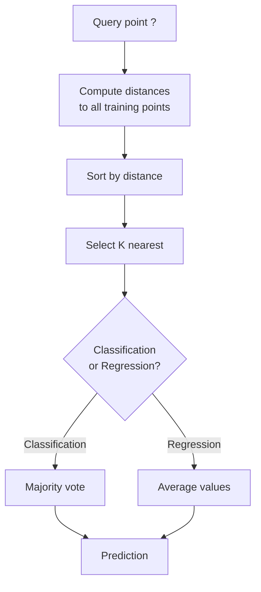
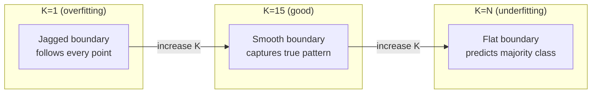
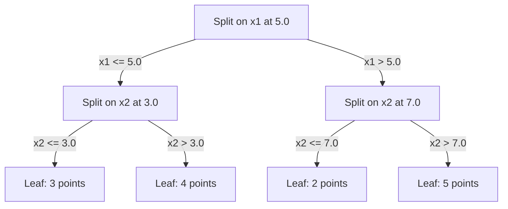

# K-أقرب الجيران والمسافات
> تخزين كل شيء. توقع من خلال النظر إلى جيرانك. أبسط خوارزمية تعمل بالفعل.
**النوع:** بناء
** اللغة: ** بايثون
**المتطلبات الأساسية:** المرحلة الأولى (الدرس 14 القواعد والمسافات)
**الوقت:** ~90 دقيقة
## أهداف التعلم
- تنفيذ تصنيف KNN والانحدار من الصفر باستخدام K القابل للتكوين والتصويت على أساس المسافة
- قارن بين مقاييس المسافة L1 وL2 وجيب التمام ومينكوفسكي وحدد القياس المناسب لنوع بيانات محدد
- اشرح لعنة الأبعاد ووضح سبب تدهور KNN في المساحات عالية الأبعاد
- قم ببناء شجرة KD للبحث الفعال عن الجيران الأقرب وتحليلها عندما تتفوق على القوة الغاشمة
## المشكلة
لديك مجموعة بيانات. وصول نقطة بيانات جديدة. تحتاج إلى تصنيفها أو التنبؤ بقيمتها. بدلاً من تعلم المعلمات من البيانات (مثل الانحدار الخطي أو SVMs)، ما عليك سوى العثور على نقاط تدريب K الأقرب إلى النقطة الجديدة والسماح لهم بالتصويت.
هذا هو أقرب جيران K. لا توجد مرحلة التدريب. لا توجد معلمات للتعلم. لا توجد وظيفة خسارة لتقليلها. يمكنك تخزين مجموعة التدريب بأكملها وحساب المسافات في وقت التنبؤ.
يبدو الأمر بسيطًا جدًا للعمل. لكن KNN تنافسي بشكل مدهش في العديد من المشكلات، خاصة مع مجموعات البيانات الصغيرة والمتوسطة، ويكشف فهمها بعمق عن المفاهيم الأساسية: اختيار مقياس المسافة (الاتصال بالمرحلة 1 الدرس 14)، ولعنة الأبعاد، والفرق بين التعلم البطيء والتعلم المتلهف.
يظهر KNN أيضًا في كل مكان في AI الحديث، تحت أسماء مختلفة مباشرةً. تقوم قواعد بيانات المتجهات بإجراء KNN بحثًا عبر التضمينات. يقوم الجيل المعزز بالاسترجاع (RAG) بالبحث عن أقرب أجزاء المستند إلى K. تعثر أنظمة التوصية على مستخدمين أو عناصر مماثلة. الخوارزمية هي نفسها. المقياس وهياكل البيانات مختلفة.
##المفهوم
### كيفية عمل KNN
بالنظر إلى مجموعة بيانات من النقاط المسماة ونقطة استعلام جديدة:
1. احسب المسافة من الاستعلام إلى كل نقطة في مجموعة البيانات
2. الترتيب حسب المسافة
3. خذ أقرب نقاط K
4. للتصنيف: تصويت الأغلبية بين جيران K
5. بالنسبة للانحدار: المتوسط (أو المتوسط المرجح) لقيم جيران K


هذه هي الخوارزمية بأكملها. لا المناسب. لا يوجد نزول متدرج. لا العصور.
### اختيار ك
K هي المعلمة الفائقة المفردة. إنه يتحكم في مقايضة التباين والتحيز:
| ك | السلوك |
|---|---------|
| ك = 1 | حدود القرار تتبع كل نقطة. صفر خطأ في التدريب. التباين العالي. التجاوزات |
| ك الصغيرة (3-5) | حساسة للبنية المحلية. يمكن التقاط الحدود المعقدة |
| كبير ك | حدود أكثر سلاسة. أكثر مقاومة للضوضاء. قد لا يصلح |
| ك = ن | يتنبأ فئة الأغلبية لكل نقطة. الحد الأقصى للتحيز |
نقطة البداية الشائعة هي K = sqrt(N) لمجموعة بيانات مكونة من N نقطة. استخدم K الغريب للتصنيف الثنائي لتجنب الروابط.


### مقاييس المسافة
تحدد وظيفة المسافة ما تعنيه كلمة "قريب". تنتج المقاييس المختلفة جيرانًا مختلفين وتوقعات مختلفة.
**L2 (الإقليدية)** هو الإعداد الافتراضي. مسافة الخط المستقيم.
```
d(a, b) = sqrt(sum((a_i - b_i)^2))
```

حساسة لحجم الميزة. قم دائمًا بتوحيد الميزات قبل استخدام L2 مع KNN.
**L1 (مانهاتن)** يجمع الفروق المطلقة. أكثر قوة بالنسبة للقيم المتطرفة من L2 لأنها لا تربيع الاختلافات.
```
d(a, b) = sum(|a_i - b_i|)
```

**مسافة جيب التمام** تقيس الزاوية بين المتجهات، مع تجاهل الحجم. ضروري للنص وتضمين البيانات.
```
d(a, b) = 1 - (a . b) / (||a|| * ||b||)
```

** مينكوفسكي ** يعمم L1 و L2 مع المعلمة p.
```
d(a, b) = (sum(|a_i - b_i|^p))^(1/p)

p=1: Manhattan
p=2: Euclidean
p->inf: Chebyshev (max absolute difference)
```

يعتمد المقياس الذي سيتم استخدامه على البيانات:
| نوع البيانات | أفضل مقياس | لماذا |
|-----------|-----------|-----|
| الميزات الرقمية، مقياس مماثل | L2 (الإقليدية) | الافتراضي، يعمل للبيانات المكانية |
| الميزات الرقمية، القيم المتطرفة | L1 (مانهاتن) | قوية، لا تضخيم الخلافات الكبيرة |
| تضمينات النص | جيب التمام | الضجيج هو الضجيج، والاتجاه هو المعنى |
| عالية الأبعاد متناثرة | جيب التمام أو L1 | L2 يعاني من لعنة الأبعاد |
| أنواع مختلطة | المسافة المخصصة | الجمع بين المقاييس لكل نوع الميزة |
### مرجح KNN
المعيار KNN يعطي وزنًا متساويًا لجميع جيران K. لكن الجار على مسافة 0.1 يجب أن يكون أكثر أهمية من الجار على مسافة 5.0.
**وزن المسافة KNN** وزن كل جار بشكل عكسي حسب المسافة:
```
weight_i = 1 / (distance_i + epsilon)

For classification: weighted vote
For regression:     weighted average = sum(w_i * y_i) / sum(w_i)
```

يمنع إبسيلون القسمة على صفر عندما تتطابق نقطة الاستعلام تمامًا مع نقطة التدريب.
يعتبر KNN المرجح أقل حساسية لاختيار K لأن الجيران البعيدين يساهمون بشكل ضئيل للغاية بغض النظر.
### لعنة الأبعاد
KNN يتدهور الأداء في الأبعاد العالية. وهذا ليس مصدر قلق غامض. إنها حقيقة رياضية.
**المشكلة 1: تقارب المسافات.** مع زيادة الأبعاد، تقترب نسبة أقصى مسافة إلى أدنى مسافة من 1. وتصبح جميع النقاط "بعيدة" عن الاستعلام بشكل متساوٍ.
```
In d dimensions, for random uniform points:

d=2:    max_dist / min_dist = varies widely
d=100:  max_dist / min_dist ~ 1.01
d=1000: max_dist / min_dist ~ 1.001

When all distances are nearly equal, "nearest" is meaningless.
```

**المشكلة 2: الحجم الكبير.** لالتقاط K الجيران ضمن جزء ثابت من البيانات، تحتاج إلى توسيع نطاق البحث الخاص بك لتغطية جزء أكبر بكثير من مساحة الميزة. يشمل "الحي" بأبعاد عالية معظم المساحة.
**المشكلة 3: تهيمن الزوايا.** في وحدة المكعب الفائق بأبعاد d، يتركز معظم الحجم بالقرب من الزوايا، وليس المركز. تحتوي الكرة المنقوشة في المكعب على جزء متلاشي من الحجم مع نمو d.
النتيجة العملية: KNN يعمل بشكل جيد حتى حوالي 20-50 ميزة. أبعد من ذلك، تحتاج إلى تقليل الأبعاد (PCA، UMAP، t-SNE) قبل تطبيق KNN، أو تحتاج إلى استخدام هياكل البحث المستندة إلى الشجرة التي تستغل الأبعاد الأدنى الجوهرية للبيانات.
### KD-الأشجار: بحث سريع عن أقرب جار
القوة الغاشمة KNN تحسب المسافة من الاستعلام إلى كل نقطة تدريب. هذا هو O(n * d) لكل استعلام. بالنسبة لمجموعات البيانات الكبيرة، يكون هذا بطيئًا جدًا.
تقوم شجرة KD بتقسيم المساحة بشكل متكرر على طول محاور المعالم. وفي كل مستوى، ينقسم على طول بُعد واحد بقيمة متوسطة.


للعثور على أقرب جار، قم باجتياز الشجرة إلى الورقة التي تحتوي على الاستعلام، ثم قم بالتراجع وتحقق من الأقسام المجاورة فقط إذا كان من الممكن أن تحتوي على نقاط أقرب.
متوسط ​​وقت الاستعلام: O(log n) للأبعاد المنخفضة. لكن KD- تتحلل الأشجار إلى O(n) في الأبعاد العالية (d > 20) لأن التراجع يزيل فروعًا أقل وأقل.
### الأشجار الكروية: أفضل للأبعاد المعتدلة
تقوم الأشجار الكروية بتقسيم البيانات إلى كرات مفرطة متداخلة بدلاً من المربعات المحاذية للمحور. يحدد كل node كرة (المركز + نصف القطر) تحتوي على جميع النقاط في تلك الشجرة الفرعية.
المزايا على KD-الأشجار:
- العمل بشكل أفضل في الأبعاد المعتدلة (حتى ~50)
- التعامل مع هيكل غير محاذاة للمحور
- تعني الأحجام المحيطة الأكثر إحكامًا أنه يتم تقليم المزيد من الفروع أثناء البحث
تعد كل من الأشجار KD والأشجار الكروية خوارزميات دقيقة. بالنسبة للبحث واسع النطاق حقًا (ملايين النقاط، مئات الأبعاد)، يتم استخدام أساليب الجوار التقريبية (HNSW، IVF، تحديد كمية المنتج) بدلاً من ذلك. يتم تناول هذه الأمور في المرحلة الأولى الدرس 14.
### التعلم البطيء مقابل التعلم المتلهف
KNN متعلم كسول: فهو لا يقوم بأي عمل في وقت التدريب وكل شيء يعمل في وقت التنبؤ. معظم الخوارزميات الأخرى (الانحدار الخطي، SVMs، الشبكات العصبية) متعلمون متحمسون: يقومون بعمليات حسابية ثقيلة في وقت التدريب لبناء نموذج مدمج، ثم تكون التنبؤات سريعة.
| الجانب | كسول (KNN) | حريص (SVM، شبكة عصبية) |
|--------|---------------------------|--------|
| وقت التدريب | O(1) فقط قم بتخزين البيانات | يا(ن * العصور) |
| وقت التنبؤ | O(n * d) لكل استعلام | O(d) أو O(المعلمات) |
| الذاكرة عند التنبؤ | قم بتخزين مجموعة التدريب بأكملها | معلمات نموذج المتجر فقط |
| يتكيف مع البيانات الجديدة | أضف النقاط على الفور | إعادة تدريب النموذج |
| حدود القرار | ضمني، محسوب على الطاير | صريح، ثابت بعد التدريب |
يعتبر التعلم البطيء مثاليًا عندما:
- تتغير مجموعة البيانات بشكل متكرر (إضافة / إزالة النقاط دون إعادة التدريب)
- أنت بحاجة إلى تنبؤات لعدد قليل جدًا من الاستفسارات
- أنت تريد صفر وقت التدريب
- مجموعة البيانات صغيرة بما يكفي بحيث يكون البحث بالقوة الغاشمة سريعًا
### KNN للانحدار
بدلاً من تصويت الأغلبية، KNN للانحدار يقوم بمتوسط ​​القيم المستهدفة لجيران K.
```
prediction = (1/K) * sum(y_i for i in K nearest neighbors)

Or with distance weighting:
prediction = sum(w_i * y_i) / sum(w_i)
where w_i = 1 / distance_i
```

KNN يُنتج الانحدار تنبؤات ثابتة القطع (أو سلسة مع الترجيح). لا يمكن استقراء خارج نطاق بيانات التدريب. إذا كانت أهداف التدريب تتراوح بين 0 و100، فلن يتنبأ KNN أبدًا بـ 200.
## بنائها
### الخطوة 1: وظائف المسافة
تنفيذ مسافات L1 وL2 وجيب التمام ومينكوفسكي. ترتبط هذه مباشرة بالمرحلة الأولى الدرس 14.
```python
import math

def l2_distance(a, b):
    return math.sqrt(sum((ai - bi) ** 2 for ai, bi in zip(a, b)))

def l1_distance(a, b):
    return sum(abs(ai - bi) for ai, bi in zip(a, b))

def cosine_distance(a, b):
    dot_val = sum(ai * bi for ai, bi in zip(a, b))
    norm_a = math.sqrt(sum(ai ** 2 for ai in a))
    norm_b = math.sqrt(sum(bi ** 2 for bi in b))
    if norm_a == 0 or norm_b == 0:
        return 1.0
    return 1.0 - dot_val / (norm_a * norm_b)

def minkowski_distance(a, b, p=2):
    if p == float('inf'):
        return max(abs(ai - bi) for ai, bi in zip(a, b))
    return sum(abs(ai - bi) ** p for ai, bi in zip(a, b)) ** (1 / p)
```

### الخطوة 2: KNN المصنف والتراجع
أنشئ KNN بالكامل باستخدام K القابل للتكوين ومقياس المسافة ووزن المسافة الاختياري.
```python
class KNN:
    def __init__(self, k=5, distance_fn=l2_distance, weighted=False,
                 task="classification"):
        self.k = k
        self.distance_fn = distance_fn
        self.weighted = weighted
        self.task = task
        self.X_train = None
        self.y_train = None

    def fit(self, X, y):
        self.X_train = X
        self.y_train = y

    def predict(self, X):
        return [self._predict_one(x) for x in X]
```

### الخطوة 3: KD-شجرة للبحث الفعال
أنشئ شجرة KD من البداية والتي تنقسم بشكل متكرر على متوسط ​​كل بُعد.
```python
class KDTree:
    def __init__(self, X, indices=None, depth=0):
        # Recursively partition the data
        self.axis = depth % len(X[0])
        # Split on median of the current axis
        ...

    def query(self, point, k=1):
        # Traverse to leaf, then backtrack
        ...
```

راجع `code/knn.py` للاطلاع على التنفيذ الكامل لجميع الطرق المساعدة والعروض التوضيحية.
### الخطوة 4: تحجيم الميزات
يتطلب KNN قياس المعالم لأن المسافات حساسة لأحجام المعالم. ستهيمن الميزة التي تتراوح من 0 إلى 1000 على الميزة التي تتراوح من 0 إلى 1.
```python
def standardize(X):
    n = len(X)
    d = len(X[0])
    means = [sum(X[i][j] for i in range(n)) / n for j in range(d)]
    stds = [
        max(1e-10, (sum((X[i][j] - means[j]) ** 2 for i in range(n)) / n) ** 0.5)
        for j in range(d)
    ]
    return [[((X[i][j] - means[j]) / stds[j]) for j in range(d)] for i in range(n)], means, stds
```

## استخدمه
مع scikit-learn:
```python
from sklearn.neighbors import KNeighborsClassifier
from sklearn.preprocessing import StandardScaler
from sklearn.pipeline import Pipeline

clf = Pipeline([
    ("scaler", StandardScaler()),
    ("knn", KNeighborsClassifier(n_neighbors=5, metric="euclidean")),
])
clf.fit(X_train, y_train)
print(f"Accuracy: {clf.score(X_test, y_test):.4f}")
```

يستخدم Scikit-learn تلقائيًا KD-trees أو ball Trees عندما تكون مجموعة البيانات كبيرة بدرجة كافية والأبعاد منخفضة بدرجة كافية. بالنسبة للبيانات عالية الأبعاد، فإنها تعود إلى القوة الغاشمة. يمكنك التحكم في ذلك باستخدام المعلمة `algorithm`.
للبحث عن الجيران الأقرب على نطاق واسع (ملايين المتجهات)، استخدم FAISS، أو إزعاج، أو قاعدة بيانات متجهة:
```python
import faiss

index = faiss.IndexFlatL2(dimension)
index.add(embeddings)
distances, indices = index.search(query_vectors, k=5)
```

## تمارين
1. قم بتنفيذ تصنيف KNN على مجموعة بيانات ثنائية الأبعاد مكونة من 3 فئات. ارسم حدود القرار لـ K=1 وK=5 وK=15 وK=N. مراقبة الانتقال من overfitting إلى underfitting.
2. قم بتوليد 1000 نقطة عشوائية في 2، 5، 10، 50، 100، و500 بعد. بالنسبة لكل بعد، قم بحساب نسبة المسافة الزوجية القصوى إلى الحد الأدنى للمسافة الزوجية. ارسم النسبة مقابل الأبعاد لتصور لعنة الأبعاد.
3. قارن L1 وL2 ومسافة جيب التمام لـ KNN في مشكلة تصنيف النص (استخدم المتجهات TF-IDF). ما المقياس الذي يعطي أفضل دقة؟ لماذا يميل جيب التمام للفوز بالنص؟
4. قم بتنفيذ شجرة KD وقياس وقت الاستعلام مقابل القوة الغاشمة لمجموعات البيانات المكونة من 1k و10k و100k نقطة في 2D و10D و50D. في أي بعد تتوقف شجرة KD عن كونها أسرع من القوة الغاشمة؟
5. أنشئ تراجعًا مرجحًا KNN لـ y = sin(x) + الضوضاء. قارنه مع KNN غير الموزون لـ K=3، 10، 30. أظهر أن الترجيح ينتج تنبؤات أكثر سلاسة، خاصة بالنسبة لـ K الكبيرة.
## المصطلحات الرئيسية
| مصطلح | ماذا يعني في الواقع |
|------|----------------------|
| ك- أقرب الجيران | خوارزمية غير معلمية تتنبأ من خلال العثور على أقرب نقاط التدريب K للاستعلام |
| التعلم الكسلى | لا يوجد حساب في وقت التدريب. كل العمل يحدث في وقت التنبؤ. KNN هو المثال الأساسي |
| التعلم الحريص | حسابات ثقيلة في وقت التدريب لبناء نموذج مدمج. معظم خوارزميات ML حريصة على |
| لعنة الأبعاد | في الأبعاد العالية تتقارب المسافات وتتوسع الأحياء لتغطي معظم المساحة، مما يجعل KNN غير فعال |
| KD- شجرة | شجرة ثنائية تقوم بتقسيم المساحة بشكل متكرر على طول محاور المعالم. استعلامات O(log n) ذات أبعاد منخفضة |
| شجرة الكرة | شجرة من الكرات الفوقية المتداخلة. يعمل بشكل أفضل من KD-الأشجار ذات الأبعاد المتوسطة (حتى ~50) |
| مرجح KNN | الجيران مرجحة عكسيا بالمسافة. الجيران الأقرب لهم تأثير أكبر على التنبؤ |
| تحجيم الميزة | تطبيع الميزات إلى نطاقات قابلة للمقارنة. مطلوب للطرق المعتمدة على المسافة مثل KNN |
| تصويت الأغلبية | التصنيف عن طريق حساب الفئة الأكثر شيوعًا بين جيران K |
| بحث القوة الغاشمة | حساب المسافة إلى كل نقطة التدريب. O(n*d) لكل استعلام. دقيق ولكنه بطيء بالنسبة للحجم الكبير n |
| أقرب جار تقريبي | الخوارزميات (HNSW، ​​LSH، IVF) التي تجد أقرب النقاط تقريبًا بشكل أسرع بكثير من البحث الدقيق |
| مخطط فورونوي | تقسيم المساحة حيث تحتوي كل منطقة على جميع النقاط الأقرب إلى نقطة تدريب واحدة من أي نقطة أخرى. K=1 KNN تنتج حدود فورونوي |
## مزيد من القراءة
- [Cover & Hart: Nearest Neighbor Pattern Classification (1967)](https://ieeexplore.ieee.org/document/1053964) - ورقة KNN التأسيسية التي تثبت أن معدل الخطأ بها يبلغ ضعف معدل بايز الأمثل على الأكثر
- [Friedman, Bentley, Finkel: An Algorithm for Finding Best Matches in Logarithmic Expected Time (1977)](https://dl.acm.org/doi/10.1145/355744.355745) - ورق الشجرة الأصلي KD
- [Beyer et al.: When Is "Nearest Neighbor" Meaningful? (1999)](https://link.springer.com/chapter/10.1007/3-540-49257-7_15) - تحليل رسمي لعنة الأبعاد لأقرب جار
- [scikit-learn Nearest Neighbors documentation](https://scikit-learn.org/stable/modules/neighbors.html) - دليل عملي لاختيار الخوارزمية
- [FAISS: A Library for Efficient Similarity Search](https://github.com/facebookresearch/faiss) - مكتبة Meta للبحث عن أقرب جيران بمليار مقياس