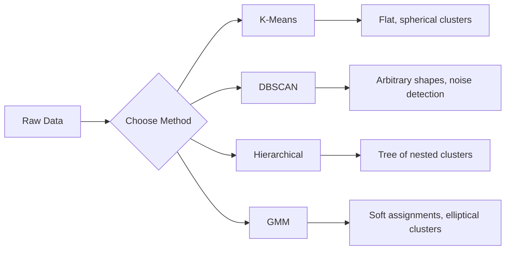

# Unsupervised Learning

> لا تسميات، لا معلم. تجد الخوارزمية البنية من تلقاء نفسها.

**النوع:** بناء
** اللغات: ** بايثون
**المتطلبات الأساسية:** المرحلة الأولى (القواعد والمسافات، والاحتمالات والتوزيعات)، المرحلة الثانية الدروس 1-6
**الوقت:** ~90 دقيقة

## Learning Objectives

- تنفيذ K-Means وDBSCAN وGaussian Mixture Models من البداية ومقارنة سلوكهم التجميعي
- تقييم جودة المجموعة باستخدام درجة الصورة الظلية وطريقة الكوع لتحديد K الأمثل
- اشرح متى يتفوق DBSCAN على K-Means وحدد الخوارزمية التي تتعامل مع المجموعات غير الكروية والقيم المتطرفة
- إنشاء خط كشف الشذوذ pipeline باستخدام طرق التجميع لتحديد النقاط التي تنحرف عن الأنماط العادية

## The Problem

كل درس ML حتى الآن يفترض بيانات مصنفة: "هنا مدخل، وهنا المخرج الصحيح." في العالم الحقيقي، التسميات باهظة الثمن. يحتوي المستشفى على الملايين من سجلات المرضى ولكن لم يقم أحد بوضع علامة يدويًا على كل منهم بفئة المرض. يحتوي موقع التجارة الإلكترونية على ملايين جلسات المستخدمين، ولكن لا يوجد لدى أي منهم شرائح عملاء مصنفة يدويًا. يمتلك فريق الأمان سجلات الشبكة ولكن لم يقم أحد بالإبلاغ عن كل حالة شاذة.

يجد التعلم غير الخاضع للرقابة أنماطًا دون أن يتم إخبارك بما يجب البحث عنه. فهو يجمع نقاط بيانات متشابهة، ويكتشف الهياكل المخفية، ويكشف عن الحالات الشاذة. إذا كان التعلم الخاضع للإشراف هو التعلم من كتاب مدرسي يحتوي على مفتاح إجابة، فإن التعلم غير الخاضع للإشراف يحدق في البيانات الأولية حتى تكشف الأنماط عن نفسها.

المشكلة: بدون تسميات، لا يمكنك قياس "الصواب" أو "الخطأ" بشكل مباشر. أنت بحاجة إلى أدوات مختلفة لتقييم ما إذا كانت البنية التي وجدتها الخوارزمية ذات معنى أم لا.

## The Concept

### Clustering: Grouping Similar Things Together

يقوم التجميع بتعيين كل نقطة بيانات إلى مجموعة (مجموعة) بحيث تكون النقاط الموجودة داخل نفس المجموعة أكثر تشابهًا مع بعضها البعض مقارنة بالنقاط الموجودة في مجموعات أخرى. والسؤال الذي يطرح نفسه دائمًا: ماذا تعني كلمة "مشابه"؟



### K-Means: The Workhorse

K-يعني تقسيم البيانات إلى مجموعات K بالضبط. تحتوي كل مجموعة على مركز مركزي (مركز كتلتها)، وكل نقطة تنتمي إلى أقرب مركز مركزي.

خوارزمية لويد:

1. اختر نقاط عشوائية K كنقط مركزية أولية
2. قم بتعيين كل نقطة بيانات إلى أقرب نقطة مركزية
3. أعد حساب كل نقطة مركزية كوسيلة للنقاط المخصصة لها
4. كرر الخطوات من 2 إلى 3 حتى تتوقف المهام عن التغير

تقيس الوظيفة الموضوعية (القصور الذاتي) إجمالي المسافة المربعة من كل نقطة إلى النقطه الوسطى المخصصة لها. تعمل K-Means على تقليل ذلك، ولكنها تجد فقط الحد الأدنى المحلي. عمليات التهيئة المختلفة يمكن أن تعطي نتائج مختلفة.

### Choosing K

طريقتان قياسيتان:

**طريقة الكوع:** تشغيل K-Means لـ K = 1، 2، 3،...، n. ارسم القصور الذاتي مقابل K. ابحث عن "المرفق" حيث تتوقف إضافة المزيد من المجموعات عن تقليل القصور الذاتي بشكل كبير.

**نتيجة الصورة الظلية:** لكل نقطة، قم بقياس مدى تشابهها مع مجموعتها (أ) مقابل أقرب مجموعة أخرى (ب). معامل الصورة الظلية هو (b - a) / max(a, b)، ويتراوح من -1 (مجموعة خاطئة) إلى +1 (متجمع بشكل جيد). المتوسط ​​في جميع النقاط للحصول على درجة عالمية.

### DBSCAN: Density-Based Clustering

تفترض K-Means أن المجموعات كروية وتتطلب منك اختيار K مقدمًا. DBSCAN make ليس من المفترض. يجد مجموعات كمناطق كثيفة مفصولة بمناطق متناثرة.

معلمتين:
- **eps**: نصف قطر الحي
- **min_samples**: الحد الأدنى لعدد النقاط اللازمة لتشكيل منطقة كثيفة

ثلاثة أنواع من النقاط:
- **النقطة الأساسية**: تحتوي على الأقل على نقاط min_samples ضمن مسافة eps
- **نقطة الحدود**: ضمن eps للنقطة الأساسية ولكنها ليست في حد ذاتها نقطة أساسية
- **نقطة الضوضاء**: لا أساسية ولا حدودية. هذه هي القيم المتطرفة.

DBSCAN يربط النقاط الأساسية التي تقع ضمن eps من بعضها البعض في نفس المجموعة. تنضم النقاط الحدودية إلى مجموعة النقطة الأساسية القريبة. نقاط الضوضاء لا تنتمي إلى أي كتلة.

نقاط القوة: العثور على مجموعات من أي شكل، وتحديد عدد المجموعات تلقائيًا، وتحديد القيم المتطرفة. الضعف: صراع مع مجموعات متفاوتة الكثافة.

### Hierarchical Clustering

يبني شجرة (dendrogram) من العناقيد المتداخلة.

التجميعي (من الأسفل إلى الأعلى):
1. ابدأ بكل نقطة باعتبارها مجموعتها الخاصة
2. دمج المجموعتين الأقرب
3. كرر ذلك حتى تبقى مجموعة واحدة فقط
4. قم بقص مخطط الأشجار بالمستوى المطلوب للحصول على مجموعات K

يمكن قياس "التقارب" بين المجموعات على النحو التالي:
- **الربط الفردي**: الحد الأدنى للمسافة بين أي نقطتين في المجموعتين
- **الربط الكامل**: أقصى مسافة بين أي نقطتين
- **متوسط الارتباط**: متوسط المسافة بين جميع الأزواج
- **طريقة وارد**: الدمج الذي يسبب أقل زيادة في إجمالي التباين داخل المجموعة

### Gaussian Mixture Models (GMM)

تعطي K-Means مهام صعبة: كل نقطة تنتمي إلى مجموعة واحدة بالضبط. GMM يعطي مهام بسيطة: كل نقطة لديها احتمال الانتماء إلى كل مجموعة.

GMM يفترض أن البيانات يتم إنشاؤها من خليط من توزيعات K Gaussian، لكل منها متوسطها الخاص وتباينها. تتناوب خوارزمية تعظيم التوقعات (EM) بين:

- **الخطوة الإلكترونية**: حساب احتمال أن تنتمي كل نقطة إلى كل غاوسي
- **M-step**: قم بتحديث المتوسط والتباين ووزن الخلط لكل Gaussian لزيادة احتمالية البيانات إلى أقصى حد

GMM يمكن أن يصمم مجموعات بيضاوية الشكل (وليس فقط كروية مثل K-Means) ويتعامل بشكل طبيعي مع المجموعات المتداخلة.

### When to Use Which

| الطريقة | الأفضل لـ | تجنب متى |
|--------|----------|------------|
| وسائل K | مجموعات البيانات الكبيرة، والمجموعات الكروية، المعروفة بـ K | أشكال غير منتظمة، وجود قيم متطرفة |
| DBSCAN | غير معروف K، أشكال عشوائية، كشف خارجي | كثافات متفاوتة وأبعاد عالية جداً |
| الهرمي | مجموعات بيانات صغيرة، تحتاج إلى مخطط شجري، غير معروف K | مجموعات بيانات كبيرة (ذاكرة O(n^2)) |
| GMM | مجموعات متداخلة، هناك حاجة إلى مهام بسيطة | مجموعات بيانات كبيرة جدًا، وأبعاد كثيرة جدًا |

### Anomaly Detection with Clustering

يدعم التجميع بشكل طبيعي اكتشاف الحالات الشاذة:
- **K-Means**: النقاط البعيدة عن أي نقطة مركزية هي حالات شاذة
- **DBSCAN**: نقاط الضوضاء هي حالات شاذة بحكم التعريف
- **GMM**: النقاط ذات الاحتمالية المنخفضة تحت جميع الغاوسيين هي حالات شاذة

## Build It

### Step 1: K-Means from scratch

```python
import math
import random


def euclidean_distance(a, b):
    return math.sqrt(sum((ai - bi) ** 2 for ai, bi in zip(a, b)))


def kmeans(data, k, max_iterations=100, seed=42):
    random.seed(seed)
    n_features = len(data[0])

    centroids = random.sample(data, k)

    for iteration in range(max_iterations):
        clusters = [[] for _ in range(k)]
        assignments = []

        for point in data:
            distances = [euclidean_distance(point, c) for c in centroids]
            nearest = distances.index(min(distances))
            clusters[nearest].append(point)
            assignments.append(nearest)

        new_centroids = []
        for cluster in clusters:
            if len(cluster) == 0:
                new_centroids.append(random.choice(data))
                continue
            centroid = [
                sum(point[j] for point in cluster) / len(cluster)
                for j in range(n_features)
            ]
            new_centroids.append(centroid)

        if all(
            euclidean_distance(old, new) < 1e-6
            for old, new in zip(centroids, new_centroids)
        ):
            print(f"  Converged at iteration {iteration + 1}")
            break

        centroids = new_centroids

    return assignments, centroids
```

### Step 2: Elbow method and silhouette score

```python
def compute_inertia(data, assignments, centroids):
    total = 0.0
    for point, cluster_id in zip(data, assignments):
        total += euclidean_distance(point, centroids[cluster_id]) ** 2
    return total


def silhouette_score(data, assignments):
    n = len(data)
    if n < 2:
        return 0.0

    clusters = {}
    for i, c in enumerate(assignments):
        clusters.setdefault(c, []).append(i)

    if len(clusters) < 2:
        return 0.0

    scores = []
    for i in range(n):
        own_cluster = assignments[i]
        own_members = [j for j in clusters[own_cluster] if j != i]

        if len(own_members) == 0:
            scores.append(0.0)
            continue

        a = sum(euclidean_distance(data[i], data[j]) for j in own_members) / len(own_members)

        b = float("inf")
        for cluster_id, members in clusters.items():
            if cluster_id == own_cluster:
                continue
            avg_dist = sum(euclidean_distance(data[i], data[j]) for j in members) / len(members)
            b = min(b, avg_dist)

        if max(a, b) == 0:
            scores.append(0.0)
        else:
            scores.append((b - a) / max(a, b))

    return sum(scores) / len(scores)


def find_best_k(data, max_k=10):
    print("Elbow method:")
    inertias = []
    for k in range(1, max_k + 1):
        assignments, centroids = kmeans(data, k)
        inertia = compute_inertia(data, assignments, centroids)
        inertias.append(inertia)
        print(f"  K={k}: inertia={inertia:.2f}")

    print("\nSilhouette scores:")
    for k in range(2, max_k + 1):
        assignments, centroids = kmeans(data, k)
        score = silhouette_score(data, assignments)
        print(f"  K={k}: silhouette={score:.4f}")

    return inertias
```

### Step 3: DBSCAN from scratch

```python
def dbscan(data, eps, min_samples):
    n = len(data)
    labels = [-1] * n
    cluster_id = 0

    def region_query(point_idx):
        neighbors = []
        for i in range(n):
            if euclidean_distance(data[point_idx], data[i]) <= eps:
                neighbors.append(i)
        return neighbors

    visited = [False] * n

    for i in range(n):
        if visited[i]:
            continue
        visited[i] = True

        neighbors = region_query(i)

        if len(neighbors) < min_samples:
            labels[i] = -1
            continue

        labels[i] = cluster_id
        seed_set = list(neighbors)
        seed_set.remove(i)

        j = 0
        while j < len(seed_set):
            q = seed_set[j]

            if not visited[q]:
                visited[q] = True
                q_neighbors = region_query(q)
                if len(q_neighbors) >= min_samples:
                    for nb in q_neighbors:
                        if nb not in seed_set:
                            seed_set.append(nb)

            if labels[q] == -1:
                labels[q] = cluster_id

            j += 1

        cluster_id += 1

    return labels
```

### Step 4: Gaussian Mixture Model (EM algorithm)

```python
def gmm(data, k, max_iterations=100, seed=42):
    random.seed(seed)
    n = len(data)
    d = len(data[0])

    indices = random.sample(range(n), k)
    means = [list(data[i]) for i in indices]
    variances = [1.0] * k
    weights = [1.0 / k] * k

    def gaussian_pdf(x, mean, variance):
        d = len(x)
        coeff = 1.0 / ((2 * math.pi * variance) ** (d / 2))
        exponent = -sum((xi - mi) ** 2 for xi, mi in zip(x, mean)) / (2 * variance)
        return coeff * math.exp(max(exponent, -500))

    for iteration in range(max_iterations):
        responsibilities = []
        for i in range(n):
            probs = []
            for j in range(k):
                probs.append(weights[j] * gaussian_pdf(data[i], means[j], variances[j]))
            total = sum(probs)
            if total == 0:
                total = 1e-300
            responsibilities.append([p / total for p in probs])

        old_means = [list(m) for m in means]

        for j in range(k):
            r_sum = sum(responsibilities[i][j] for i in range(n))
            if r_sum < 1e-10:
                continue

            weights[j] = r_sum / n

            for dim in range(d):
                means[j][dim] = sum(
                    responsibilities[i][j] * data[i][dim] for i in range(n)
                ) / r_sum

            variances[j] = sum(
                responsibilities[i][j]
                * sum((data[i][dim] - means[j][dim]) ** 2 for dim in range(d))
                for i in range(n)
            ) / (r_sum * d)
            variances[j] = max(variances[j], 1e-6)

        shift = sum(
            euclidean_distance(old_means[j], means[j]) for j in range(k)
        )
        if shift < 1e-6:
            print(f"  GMM converged at iteration {iteration + 1}")
            break

    assignments = []
    for i in range(n):
        assignments.append(responsibilities[i].index(max(responsibilities[i])))

    return assignments, means, weights, responsibilities
```

### Step 5: Generate test data and run everything

```python
def make_blobs(centers, n_per_cluster=50, spread=0.5, seed=42):
    random.seed(seed)
    data = []
    true_labels = []
    for label, (cx, cy) in enumerate(centers):
        for _ in range(n_per_cluster):
            x = cx + random.gauss(0, spread)
            y = cy + random.gauss(0, spread)
            data.append([x, y])
            true_labels.append(label)
    return data, true_labels


def make_moons(n_samples=200, noise=0.1, seed=42):
    random.seed(seed)
    data = []
    labels = []
    n_half = n_samples // 2
    for i in range(n_half):
        angle = math.pi * i / n_half
        x = math.cos(angle) + random.gauss(0, noise)
        y = math.sin(angle) + random.gauss(0, noise)
        data.append([x, y])
        labels.append(0)
    for i in range(n_half):
        angle = math.pi * i / n_half
        x = 1 - math.cos(angle) + random.gauss(0, noise)
        y = 1 - math.sin(angle) - 0.5 + random.gauss(0, noise)
        data.append([x, y])
        labels.append(1)
    return data, labels


if __name__ == "__main__":
    centers = [[2, 2], [8, 3], [5, 8]]
    data, true_labels = make_blobs(centers, n_per_cluster=50, spread=0.8)

    print("=== K-Means on 3 blobs ===")
    assignments, centroids = kmeans(data, k=3)
    print(f"  Centroids: {[[round(c, 2) for c in cent] for cent in centroids]}")
    sil = silhouette_score(data, assignments)
    print(f"  Silhouette score: {sil:.4f}")

    print("\n=== Elbow Method ===")
    find_best_k(data, max_k=6)

    print("\n=== DBSCAN on 3 blobs ===")
    db_labels = dbscan(data, eps=1.5, min_samples=5)
    n_clusters = len(set(db_labels) - {-1})
    n_noise = db_labels.count(-1)
    print(f"  Found {n_clusters} clusters, {n_noise} noise points")

    print("\n=== GMM on 3 blobs ===")
    gmm_assignments, gmm_means, gmm_weights, _ = gmm(data, k=3)
    print(f"  Means: {[[round(m, 2) for m in mean] for mean in gmm_means]}")
    print(f"  Weights: {[round(w, 3) for w in gmm_weights]}")
    gmm_sil = silhouette_score(data, gmm_assignments)
    print(f"  Silhouette score: {gmm_sil:.4f}")

    print("\n=== DBSCAN on moons (non-spherical clusters) ===")
    moon_data, moon_labels = make_moons(n_samples=200, noise=0.1)
    moon_db = dbscan(moon_data, eps=0.3, min_samples=5)
    n_moon_clusters = len(set(moon_db) - {-1})
    n_moon_noise = moon_db.count(-1)
    print(f"  Found {n_moon_clusters} clusters, {n_moon_noise} noise points")

    print("\n=== K-Means on moons (will fail to separate) ===")
    moon_km, moon_centroids = kmeans(moon_data, k=2)
    moon_sil = silhouette_score(moon_data, moon_km)
    print(f"  Silhouette score: {moon_sil:.4f}")
    print("  K-Means splits moons poorly because they are not spherical")

    print("\n=== Anomaly detection with DBSCAN ===")
    anomaly_data = list(data)
    anomaly_data.append([20.0, 20.0])
    anomaly_data.append([-5.0, -5.0])
    anomaly_data.append([15.0, 0.0])
    anomaly_labels = dbscan(anomaly_data, eps=1.5, min_samples=5)
    anomalies = [
        anomaly_data[i]
        for i in range(len(anomaly_labels))
        if anomaly_labels[i] == -1
    ]
    print(f"  Detected {len(anomalies)} anomalies")
    for a in anomalies[-3:]:
        print(f"    Point {[round(v, 2) for v in a]}")
```

## Use It

مع scikit-learn، نفس الخوارزميات هي سطر واحد:

```python
from sklearn.cluster import KMeans, DBSCAN, AgglomerativeClustering
from sklearn.mixture import GaussianMixture
from sklearn.metrics import silhouette_score as sklearn_silhouette

km = KMeans(n_clusters=3, random_state=42).fit(data)
db = DBSCAN(eps=1.5, min_samples=5).fit(data)
agg = AgglomerativeClustering(n_clusters=3).fit(data)
gmm_model = GaussianMixture(n_components=3, random_state=42).fit(data)
```

تُظهر لك الإصدارات من البداية ما تحسبه هذه المكتبات بالضبط. K-يعني التكرار بين التعيين وإعادة الحساب. DBSCAN تنمو عناقيد من البذور الكثيفة. GMM يتناوب بين التوقع والتعظيم. تضيف إصدارات المكتبة استقرارًا رقميًا، وتهيئة أكثر ذكاءً (K-Means++)، وتسريع GPU، لكن المنطق الأساسي هو نفسه.

## Ship It

ينتج هذا الدرس تطبيقات عملية لـ K-Means وDBSCAN وGMM من الصفر. يمكن إعادة استخدام رمز التجميع كأساس لطرق أكثر تقدمًا غير خاضعة للرقابة.

## Exercises

1. قم بتنفيذ تهيئة K-Means++: بدلاً من اختيار النقط الوسطى العشوائية، اختر النقطه الوسطى الأولى بشكل عشوائي وكل النقطه الوسطى اللاحقة مع احتمال يتناسب مع المسافة المربعة من أقرب النقطه الوسطى الموجودة. قارن سرعة التقارب بالتهيئة العشوائية.
2. قم بإضافة مجموعات تكتلية هرمية إلى التعليمات البرمجية. قم بتنفيذ رابط Ward وأنتج مخططًا شجريًا (كقائمة متداخلة من عمليات الدمج). قم بقصها على مستويات مختلفة وقارنها بنتائج K-Means.
3. قم ببناء كشف بسيط عن الشذوذ pipeline: قم بتشغيل DBSCAN وGMM على نفس البيانات، ونقاط العلم التي تتفق عليها كلتا الطريقتين هي قيم متطرفة (الضوضاء في DBSCAN، احتمال منخفض في GMM). قم بقياس التداخل وناقش عندما تختلف الطرق.

## Key Terms

| مصطلح | ماذا يقول الناس | ماذا يعني في الواقع |
|------|----------------|----------------------|
| التجميع | "تجميع الأشياء المتشابهة" | تقسيم البيانات إلى مجموعات فرعية حيث يتجاوز التشابه داخل المجموعة التشابه بين المجموعات، ويتم قياسه بمقياس مسافة محدد |
| النقطه الوسطى | "مركز الكتلة" | متوسط ​​جميع النقاط المخصصة للكتلة؛ يستخدمه K-Means كممثل للمجموعة |
| الجمود | "ما أضيق العناقيد" | مجموع المسافات المربعة من كل نقطة إلى النقطه الوسطى المخصصة لها؛ الدنيا أضيق |
| درجة صورة ظلية | "مدى انفصال العناقيد جيدًا" | لكل نقطة، (b - a) / max(a, b) حيث a يعني المسافة داخل المجموعة وb يعني المسافة الأقرب للمجموعة |
| النقطة الأساسية | "نقطة في منطقة كثيفة" | نقطة بها على الأقل min_samples من الجيران ضمن مسافة eps، في DBSCAN |
| EM خوارزمية | "وسائل K الناعمة" | تعظيم التوقعات: حساب احتمالات العضوية بشكل متكرر (الخطوة الإلكترونية) وتحديث معلمات التوزيع (الخطوة M) |
| ديندروجرام | "شجرة العناقيد" | رسم تخطيطي شجري يوضح الترتيب والمسافة التي تم بها دمج المجموعات في المجموعات الهرمية |
| شذوذ | "الغريبة" | نقطة بيانات لا تتوافق مع النموذج المتوقع، يتم تحديدها على أنها ضوضاء بواسطة DBSCAN أو احتمالية منخفضة بواسطة GMM |

## Further Reading

- [Stanford CS229 - Unsupervised Learning](https://cs229.stanford.edu/notes2022fall/main_notes.pdf) - Andrew Ng's lecture notes on clustering and EM
- [scikit Clustering Guide](https://scikit-learn.org/stable/modules/clustering.html) - practical comparison of all clustering algorithms with visual examples
- [DBSCAN original paper (Ester et al., 1996)](https://www.aaai.org/Papers/KDD/1996/KDD96-037.pdf) - الورقة التي قدمت التجميع على أساس الكثافة
