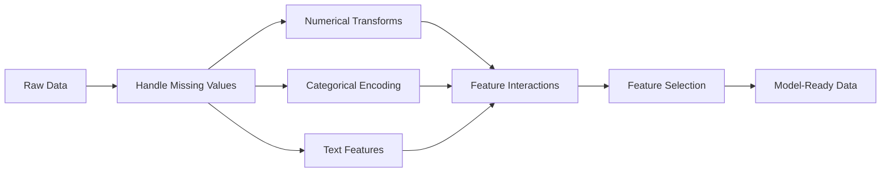

# Feature Engineering & Selection

> الميزة الجيدة تساوي ألف نقطة بيانات.

**النوع:** بناء
** اللغات: ** بايثون
**المتطلبات:** المرحلة الأولى (إحصائيات ML، الجبر الخطي)، المرحلة الثانية الدروس 1-7
**الوقت:** ~90 دقيقة

## Learning Objectives

- تنفيذ التحويلات الرقمية (التوحيد القياسي، والقياس الأدنى والحد الأقصى، وتحويل السجل، والتجميع) وشرح متى يكون كل منها مناسبًا
- إنشاء ترميز واحد ساخن وملصق ومستهدف للميزات الفئوية وتحديد مخاطر تسرب البيانات في الترميز المستهدف
- أنشئ ناقل TF-IDF من الصفر واشرح سبب تفوقه في عدد الكلمات الأولية لتصنيف النص
- تطبيق اختيار الميزة المستندة إلى المرشح (عتبة التباين، الارتباط، المعلومات المتبادلة) لتقليل الأبعاد

## The Problem

لديك مجموعة بيانات. اخترت خوارزمية. أنت تدربه. النتائج متواضعة. يمكنك تجربة خوارزمية أكثر روعة. لا يزال متوسطا. تقضي أسبوعًا في ضبط المعلمات الفائقة. تحسن هامشي.

ثم يقوم شخص ما بتحويل البيانات الأولية إلى ميزات أفضل ويتفوق الانحدار اللوجستي البسيط على مجموعتك المعززة بالتدرج المضبوط.

يحدث هذا باستمرار. في ML الكلاسيكي، يكون تمثيل البيانات أكثر أهمية من اختيار الخوارزمية. نموذج سعر المنزل الذي يحتوي على "اللقطة المربعة" و"عدد غرف النوم" سوف يتفوق على النموذج الذي يحتوي على "العنوان كسلسلة أولية" بغض النظر عن مدى تطور المتعلم. لا يمكن للخوارزمية أن تعمل إلا مع ما تقدمه لها.

هندسة الميزات هي عملية تحويل البيانات الأولية إلى تمثيلات ذات أنماط make يسهل على النماذج العثور عليها. اختيار الميزة هو عملية التخلص من الميزات التي تضيف ضوضاء دون إضافة إشارة. معًا، يشكلان النشاط الأعلى تأثيرًا في ML الكلاسيكية.

## The Concept

### The Feature Pipeline



### Numerical Features

نادراً ما تكون الأرقام الأولية جاهزة للنموذج. التحولات المشتركة:

**قياس:** ضع الميزات في نفس النطاق بحيث تتعامل الخوارزميات المستندة إلى المسافة (K-Means، KNN، SVM) مع جميع الميزات على قدم المساواة. يتم تعيين مقياس الحد الأدنى والحد الأقصى إلى [0، 1]. يتم تعيين التوحيد القياسي (z-score) على أنه يعني = 0، وstd = 1.

**تحويل السجل:** لضغط التوزيعات المنحرفة نحو اليمين (الدخل، السكان، عدد الكلمات). يحول العلاقات المضاعفة إلى علاقات مضافة.

**Binning:** تحويل القيم المستمرة إلى فئات. تكون مفيدة عندما تكون العلاقة بين الميزة والهدف غير خطية ولكنها تدريجية (على سبيل المثال، الفئات العمرية).

**ميزات متعددة الحدود:** إنشاء مصطلحات x^2، x^3، x1*x2. يتيح للنماذج الخطية التقاط العلاقات غير الخطية على حساب المزيد من الميزات.

### Categorical Features

النماذج تحتاج إلى أرقام. الفئات تحتاج إلى ترميز.

**ترميز سريع واحد:** ينشئ عمودًا ثنائيًا لكل فئة. يصبح "اللون = أحمر/أزرق/أخضر" ثلاثة أعمدة: is_red، is_blue، is_green. يعمل بشكل جيد مع الميزات ذات العناصر الأساسية المنخفضة ولكنه ينفجر مع العديد من الفئات.

**تشفير الملصقات:** يربط كل فئة بعدد صحيح: الأحمر=0، الأزرق=1، الأخضر=2. يقدم ترتيبًا خاطئًا (قد يبدو النموذج باللون الأخضر > الأزرق > الأحمر). مناسب فقط للنماذج المستندة إلى الأشجار والتي تنقسم إلى قيم فردية.

**الترميز المستهدف:** يستبدل كل فئة بمتوسط ​​المتغير المستهدف لتلك الفئة. قوية ولكنها خطيرة: ارتفاع خطر تسرب البيانات. يجب أن يتم حسابها فقط على بيانات التدريب وتطبيقها على بيانات الاختبار.

### Text Features

**Count Vectorizer:** يحسب عدد المرات التي تظهر فيها كل كلمة في المستند. "جلست القطة على الحصيرة" تصبح {ال: 2، القطة: 1، سات: 1، على: 1، الحصيرة: 1}.

**TF-IDF:** تردد المصطلح - تردد المستند العكسي. يزن الكلمات حسب مدى تميزها عبر المستندات. الكلمات الشائعة مثل "the" تصبح ذات وزن منخفض. الكلمات النادرة والمميزة لها وزن كبير.

```
TF(word, doc) = count(word in doc) / total words in doc
IDF(word) = log(total docs / docs containing word)
TF-IDF = TF * IDF
```

### Missing Values

البيانات الحقيقية بها ثغرات. الاستراتيجيات:

- **إسقاط الصفوف:** فقط عندما تكون البيانات المفقودة نادرة وعشوائية
- **الحساب المتوسط/الوسيط:** بسيط، ويحافظ على شكل التوزيع (الوسيط أكثر قوة بالنسبة للقيم المتطرفة)
- **إسناد الوضع:** للميزات الفئوية
- **عمود المؤشر:** أضف عمودًا ثنائيًا "was_this_missing" قبل الإسناد. حقيقة أن البيانات مفقودة يمكن أن تكون في حد ذاتها مفيدة
- **تعبئة للأمام/للخلف:** بالنسبة لبيانات السلاسل الزمنية

### Feature Interaction

في بعض الأحيان تكون العلاقة في الجمع. "الطول" و"الوزن" وحدهما أقل تنبؤًا من "BMI = الوزن / الارتفاع ^2". تعمل تفاعلات الميزات على مضاعفة مساحة الميزات، لذا استخدم معرفة المجال لاختيار الميزات المناسبة.

### Feature Selection

المزيد من الميزات ليست دائما أفضل. تضيف الميزات غير ذات الصلة ضوضاء، وتزيد من وقت التدريب، ويمكن أن تسبب فرط التجهيز.

**طرق التصفية (النموذج المسبق):**
- الارتباط: إزالة الميزات المرتبطة بشكل كبير مع بعضها البعض (زائدة عن الحاجة)
- المعلومات المتبادلة: تقيس مدى معرفة الميزة التي تقلل من عدم اليقين بشأن الهدف
- عتبة التباين: إزالة الميزات التي لا تكاد تختلف

**طرق التغليف (المعتمدة على النموذج):**
- L1 التنظيم (Lasso): يدفع أوزان الميزات غير ذات الصلة إلى الصفر بالضبط
- إزالة الميزة العودية: التدريب، وإزالة الميزة الأقل أهمية، والتكرار

**سبب أهمية الاختيار:** عادةً ما يتفوق النموذج الذي يحتوي على 10 ميزات جيدة على النموذج الذي يحتوي على 10 ميزات جيدة و90 ميزة مزعجة. تمنح الميزات المزعجة النموذج فرصًا للتناسب مع أنماط بيانات التدريب التي لا يتم تعميمها.

## Build It

### Step 1: Numerical transforms from scratch

```python
import math


def min_max_scale(values):
    min_val = min(values)
    max_val = max(values)
    if max_val == min_val:
        return [0.0] * len(values)
    return [(v - min_val) / (max_val - min_val) for v in values]


def standardize(values):
    n = len(values)
    mean = sum(values) / n
    variance = sum((v - mean) ** 2 for v in values) / n
    std = math.sqrt(variance) if variance > 0 else 1.0
    return [(v - mean) / std for v in values]


def log_transform(values):
    return [math.log(v + 1) for v in values]


def bin_values(values, n_bins=5):
    min_val = min(values)
    max_val = max(values)
    bin_width = (max_val - min_val) / n_bins
    if bin_width == 0:
        return [0] * len(values)
    result = []
    for v in values:
        bin_idx = int((v - min_val) / bin_width)
        bin_idx = min(bin_idx, n_bins - 1)
        result.append(bin_idx)
    return result


def polynomial_features(row, degree=2):
    n = len(row)
    result = list(row)
    if degree >= 2:
        for i in range(n):
            result.append(row[i] ** 2)
        for i in range(n):
            for j in range(i + 1, n):
                result.append(row[i] * row[j])
    return result
```

### Step 2: Categorical encoding from scratch

```python
def one_hot_encode(values):
    categories = sorted(set(values))
    cat_to_idx = {cat: i for i, cat in enumerate(categories)}
    n_cats = len(categories)

    encoded = []
    for v in values:
        row = [0] * n_cats
        row[cat_to_idx[v]] = 1
        encoded.append(row)

    return encoded, categories


def label_encode(values):
    categories = sorted(set(values))
    cat_to_int = {cat: i for i, cat in enumerate(categories)}
    return [cat_to_int[v] for v in values], cat_to_int


def target_encode(feature_values, target_values, smoothing=10):
    global_mean = sum(target_values) / len(target_values)

    category_stats = {}
    for feat, target in zip(feature_values, target_values):
        if feat not in category_stats:
            category_stats[feat] = {"sum": 0.0, "count": 0}
        category_stats[feat]["sum"] += target
        category_stats[feat]["count"] += 1

    encoding = {}
    for cat, stats in category_stats.items():
        cat_mean = stats["sum"] / stats["count"]
        weight = stats["count"] / (stats["count"] + smoothing)
        encoding[cat] = weight * cat_mean + (1 - weight) * global_mean

    return [encoding[v] for v in feature_values], encoding
```

### Step 3: Text features from scratch

```python
def count_vectorize(documents):
    vocab = {}
    idx = 0
    for doc in documents:
        for word in doc.lower().split():
            if word not in vocab:
                vocab[word] = idx
                idx += 1

    vectors = []
    for doc in documents:
        vec = [0] * len(vocab)
        for word in doc.lower().split():
            vec[vocab[word]] += 1
        vectors.append(vec)

    return vectors, vocab


def tfidf(documents):
    n_docs = len(documents)

    vocab = {}
    idx = 0
    for doc in documents:
        for word in doc.lower().split():
            if word not in vocab:
                vocab[word] = idx
                idx += 1

    doc_freq = {}
    for doc in documents:
        seen = set()
        for word in doc.lower().split():
            if word not in seen:
                doc_freq[word] = doc_freq.get(word, 0) + 1
                seen.add(word)

    vectors = []
    for doc in documents:
        words = doc.lower().split()
        word_count = len(words)
        tf_map = {}
        for word in words:
            tf_map[word] = tf_map.get(word, 0) + 1

        vec = [0.0] * len(vocab)
        for word, count in tf_map.items():
            tf = count / word_count
            idf = math.log(n_docs / doc_freq[word])
            vec[vocab[word]] = tf * idf
        vectors.append(vec)

    return vectors, vocab
```

### Step 4: Missing value imputation from scratch

```python
def impute_mean(values):
    present = [v for v in values if v is not None]
    if not present:
        return [0.0] * len(values), 0.0
    mean = sum(present) / len(present)
    return [v if v is not None else mean for v in values], mean


def impute_median(values):
    present = sorted(v for v in values if v is not None)
    if not present:
        return [0.0] * len(values), 0.0
    n = len(present)
    if n % 2 == 0:
        median = (present[n // 2 - 1] + present[n // 2]) / 2
    else:
        median = present[n // 2]
    return [v if v is not None else median for v in values], median


def impute_mode(values):
    present = [v for v in values if v is not None]
    if not present:
        return values, None
    counts = {}
    for v in present:
        counts[v] = counts.get(v, 0) + 1
    mode = max(counts, key=counts.get)
    return [v if v is not None else mode for v in values], mode


def add_missing_indicator(values):
    return [0 if v is not None else 1 for v in values]
```

### Step 5: Feature selection from scratch

```python
def correlation(x, y):
    n = len(x)
    mean_x = sum(x) / n
    mean_y = sum(y) / n
    cov = sum((xi - mean_x) * (yi - mean_y) for xi, yi in zip(x, y)) / n
    std_x = math.sqrt(sum((xi - mean_x) ** 2 for xi in x) / n)
    std_y = math.sqrt(sum((yi - mean_y) ** 2 for yi in y) / n)
    if std_x == 0 or std_y == 0:
        return 0.0
    return cov / (std_x * std_y)


def mutual_information(feature, target, n_bins=10):
    feat_min = min(feature)
    feat_max = max(feature)
    bin_width = (feat_max - feat_min) / n_bins if feat_max != feat_min else 1.0
    feat_binned = [
        min(int((f - feat_min) / bin_width), n_bins - 1) for f in feature
    ]

    n = len(feature)
    target_classes = sorted(set(target))

    feat_bins = sorted(set(feat_binned))
    p_feat = {}
    for b in feat_bins:
        p_feat[b] = feat_binned.count(b) / n

    p_target = {}
    for t in target_classes:
        p_target[t] = target.count(t) / n

    mi = 0.0
    for b in feat_bins:
        for t in target_classes:
            joint_count = sum(
                1 for fb, tv in zip(feat_binned, target) if fb == b and tv == t
            )
            p_joint = joint_count / n
            if p_joint > 0:
                mi += p_joint * math.log(p_joint / (p_feat[b] * p_target[t]))

    return mi


def variance_threshold(features, threshold=0.01):
    n_features = len(features[0])
    n_samples = len(features)
    selected = []

    for j in range(n_features):
        col = [features[i][j] for i in range(n_samples)]
        mean = sum(col) / n_samples
        var = sum((v - mean) ** 2 for v in col) / n_samples
        if var >= threshold:
            selected.append(j)

    return selected


def remove_correlated(features, threshold=0.9):
    n_features = len(features[0])
    n_samples = len(features)

    to_remove = set()
    for i in range(n_features):
        if i in to_remove:
            continue
        col_i = [features[r][i] for r in range(n_samples)]
        for j in range(i + 1, n_features):
            if j in to_remove:
                continue
            col_j = [features[r][j] for r in range(n_samples)]
            corr = abs(correlation(col_i, col_j))
            if corr >= threshold:
                to_remove.add(j)

    return [i for i in range(n_features) if i not in to_remove]
```

### Step 6: Full pipeline and demo

```python
import random


def make_housing_data(n=200, seed=42):
    random.seed(seed)
    data = []
    for _ in range(n):
        sqft = random.uniform(500, 5000)
        bedrooms = random.choice([1, 2, 3, 4, 5])
        age = random.uniform(0, 50)
        neighborhood = random.choice(["downtown", "suburbs", "rural"])
        has_pool = random.choice([True, False])

        sqft_with_missing = sqft if random.random() > 0.05 else None
        age_with_missing = age if random.random() > 0.08 else None

        price = (
            50 * sqft
            + 20000 * bedrooms
            - 1000 * age
            + (50000 if neighborhood == "downtown" else 10000 if neighborhood == "suburbs" else 0)
            + (15000 if has_pool else 0)
            + random.gauss(0, 20000)
        )

        data.append({
            "sqft": sqft_with_missing,
            "bedrooms": bedrooms,
            "age": age_with_missing,
            "neighborhood": neighborhood,
            "has_pool": has_pool,
            "price": price,
        })
    return data


if __name__ == "__main__":
    data = make_housing_data(200)

    print("=== Raw Data Sample ===")
    for row in data[:3]:
        print(f"  {row}")

    sqft_raw = [d["sqft"] for d in data]
    age_raw = [d["age"] for d in data]
    prices = [d["price"] for d in data]

    print("\n=== Missing Value Handling ===")
    sqft_missing = sum(1 for v in sqft_raw if v is None)
    age_missing = sum(1 for v in age_raw if v is None)
    print(f"  sqft missing: {sqft_missing}/{len(sqft_raw)}")
    print(f"  age missing: {age_missing}/{len(age_raw)}")

    sqft_indicator = add_missing_indicator(sqft_raw)
    age_indicator = add_missing_indicator(age_raw)
    sqft_imputed, sqft_fill = impute_median(sqft_raw)
    age_imputed, age_fill = impute_mean(age_raw)
    print(f"  sqft filled with median: {sqft_fill:.0f}")
    print(f"  age filled with mean: {age_fill:.1f}")

    print("\n=== Numerical Transforms ===")
    sqft_scaled = standardize(sqft_imputed)
    age_scaled = min_max_scale(age_imputed)
    sqft_log = log_transform(sqft_imputed)
    age_binned = bin_values(age_imputed, n_bins=5)
    print(f"  sqft standardized: mean={sum(sqft_scaled)/len(sqft_scaled):.4f}, std={math.sqrt(sum(v**2 for v in sqft_scaled)/len(sqft_scaled)):.4f}")
    print(f"  age min-max: [{min(age_scaled):.2f}, {max(age_scaled):.2f}]")
    print(f"  age bins: {sorted(set(age_binned))}")

    print("\n=== Categorical Encoding ===")
    neighborhoods = [d["neighborhood"] for d in data]

    ohe, ohe_cats = one_hot_encode(neighborhoods)
    print(f"  One-hot categories: {ohe_cats}")
    print(f"  Sample encoding: {neighborhoods[0]} -> {ohe[0]}")

    le, le_map = label_encode(neighborhoods)
    print(f"  Label encoding map: {le_map}")

    te, te_map = target_encode(neighborhoods, prices, smoothing=10)
    print(f"  Target encoding: {({k: round(v) for k, v in te_map.items()})}")

    print("\n=== Text Features ===")
    descriptions = [
        "large modern house with pool",
        "small cozy cottage near downtown",
        "spacious family home with large yard",
        "modern apartment downtown with view",
        "rustic cabin in rural area",
    ]
    cv, cv_vocab = count_vectorize(descriptions)
    print(f"  Vocabulary size: {len(cv_vocab)}")
    print(f"  Doc 0 non-zero features: {sum(1 for v in cv[0] if v > 0)}")

    tf, tf_vocab = tfidf(descriptions)
    print(f"  TF-IDF vocabulary size: {len(tf_vocab)}")
    top_words = sorted(tf_vocab.keys(), key=lambda w: tf[0][tf_vocab[w]], reverse=True)[:3]
    print(f"  Doc 0 top TF-IDF words: {top_words}")

    print("\n=== Polynomial Features ===")
    sample_row = [sqft_scaled[0], age_scaled[0]]
    poly = polynomial_features(sample_row, degree=2)
    print(f"  Input: {[round(v, 4) for v in sample_row]}")
    print(f"  Polynomial: {[round(v, 4) for v in poly]}")
    print(f"  Features: [x1, x2, x1^2, x2^2, x1*x2]")

    print("\n=== Feature Selection ===")
    feature_matrix = [
        [sqft_scaled[i], age_scaled[i], float(sqft_indicator[i]), float(age_indicator[i])]
        + ohe[i]
        for i in range(len(data))
    ]

    print(f"  Total features: {len(feature_matrix[0])}")

    surviving_var = variance_threshold(feature_matrix, threshold=0.01)
    print(f"  After variance threshold (0.01): {len(surviving_var)} features kept")

    surviving_corr = remove_correlated(feature_matrix, threshold=0.9)
    print(f"  After correlation filter (0.9): {len(surviving_corr)} features kept")

    binary_prices = [1 if p > sum(prices) / len(prices) else 0 for p in prices]
    print("\n  Mutual information with target:")
    feature_names = ["sqft", "age", "sqft_missing", "age_missing"] + [f"neigh_{c}" for c in ohe_cats]
    for j in range(len(feature_matrix[0])):
        col = [feature_matrix[i][j] for i in range(len(feature_matrix))]
        mi = mutual_information(col, binary_prices, n_bins=10)
        print(f"    {feature_names[j]}: MI={mi:.4f}")

    print("\n  Correlation with price:")
    for j in range(len(feature_matrix[0])):
        col = [feature_matrix[i][j] for i in range(len(feature_matrix))]
        corr = correlation(col, prices)
        print(f"    {feature_names[j]}: r={corr:.4f}")
```

## Use It

باستخدام scikit-learn، تكون هذه التحويلات قابلة للتركيب pipخطوط:

```python
from sklearn.preprocessing import StandardScaler, OneHotEncoder, PolynomialFeatures
from sklearn.impute import SimpleImputer
from sklearn.feature_extraction.text import TfidfVectorizer
from sklearn.feature_selection import mutual_info_classif, VarianceThreshold
from sklearn.compose import ColumnTransformer
from sklearn.pipeline import Pipeline

numeric_pipe = Pipeline([
    ("imputer", SimpleImputer(strategy="median")),
    ("scaler", StandardScaler()),
])

categorical_pipe = Pipeline([
    ("encoder", OneHotEncoder(sparse_output=False)),
])

preprocessor = ColumnTransformer([
    ("num", numeric_pipe, ["sqft", "age"]),
    ("cat", categorical_pipe, ["neighborhood"]),
])
```

تُظهر الإصدارات الأولية ما يحدث بالضبط داخل كل تحويل. تضيف إصدارات المكتبة معالجة حالة الحافة، ودعم المصفوفة المتفرقة، وتكوين الخط pip، لكن الرياضيات هي نفسها.

## Ship It

ينتج هذا الدرس:
- `outputs/prompt-feature-engineer.md` - مطالبة بهندسة الميزات بشكل منهجي من البيانات الأولية

## Exercises

1. أضف مقياسًا قويًا (باستخدام النطاق المتوسط ​​والربيعي بدلاً من المتوسط ​​والانحراف المعياري) إلى التحويلات الرقمية. قارنه بالقياس القياسي للبيانات ذات القيم المتطرفة.
2. تنفيذ ترميز هدف الإجازة لمرة واحدة: لكل صف، قم بحساب متوسط ​​الهدف باستثناء القيمة المستهدفة لهذا الصف. أظهر كيف يقلل هذا من التجهيز الزائد مقارنة بالتشفير المستهدف البسيط.
3. قم بإنشاء تحديد تلقائي للميزات pipeline يجمع بين عتبة التباين وتصفية الارتباط وتصنيف المعلومات المتبادلة. قم بتطبيقه على مجموعة بيانات الإسكان وقارن أداء النموذج (استخدم الانحدار الخطي البسيط) مع جميع الميزات مقابل الميزات المحددة.

## Key Terms

| مصطلح | ماذا يقول الناس | ماذا يعني في الواقع |
|------|----------------|----------------------|
| هندسة مميزة | "صنع أعمدة جديدة" | تحويل البيانات الأولية إلى تمثيلات تعرض الأنماط للنموذج |
| التقييس | "جعل الأمر طبيعيًا" | طرح المتوسط ​​والقسمة على الانحراف المعياري بحيث يكون للميزة متوسط=0 وstd=1 |
| ترميز واحد ساخن | "عمل متغيرات وهمية" | إنشاء عمود ثنائي واحد لكل فئة، حيث يكون عمود واحد بالضبط هو 1 لكل صف |
| ترميز الهدف | "استخدام الإجابة للتشفير" | استبدال كل فئة بمتوسط ​​القيمة المستهدفة لتلك الفئة، مع التجانس لمنع التجاوز |
| TF-IDF | "عدد الكلمات الفاخرة" | مصطلح التكرار مرات تكرار المستند العكسي: الكلمات مرجحة بمدى تميزها عبر المجموعة |
| الإسناد | "ملء الفراغات" | استبدال القيم المفقودة بالقيم المقدرة (المتوسط ​​أو الوسيط أو الوضع أو النموذج المتوقع) |
| اختيار الميزة | "طرد الأعمدة السيئة" | إزالة الميزات التي تضيف ضوضاء أو تكرارًا، مع الاحتفاظ فقط بالميزات التي تحتوي على إشارة حول الهدف |
| معلومات متبادلة | "كم يخبرك شيء عن شيء آخر" | مقياس لانخفاض عدم اليقين بشأن المتغير Y المكتسب من خلال ملاحظة المتغير X |
| تسرب البيانات | "الغش بالخطأ" | استخدام معلومات أثناء التدريب لا تكون متاحة في وقت التنبؤ، مما يعطي نتائج متفائلة كاذبة |

## Further Reading

- [Feature Engineering and Selection (Max Kuhn & Kjell Johnson)](http://www.feat.engineering/) - free online book covering the full landscape of feature engineering
- [scikit Preprocessing Guide](https://scikit-learn.org/stable/modules/preprocessing.html) - practical reference for all standard transforms
- [Target Encoding Done Right (Micci-Barreca, 2001)](https://dl.acm.org/doi/10.1145/507533.507538) - الورقة الأصلية على ترميز الهدف مع التجانس
