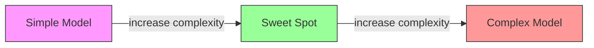
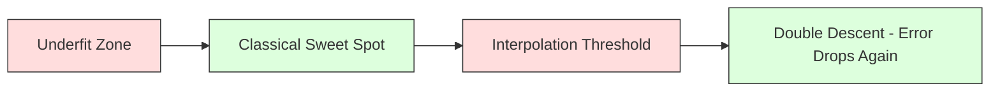
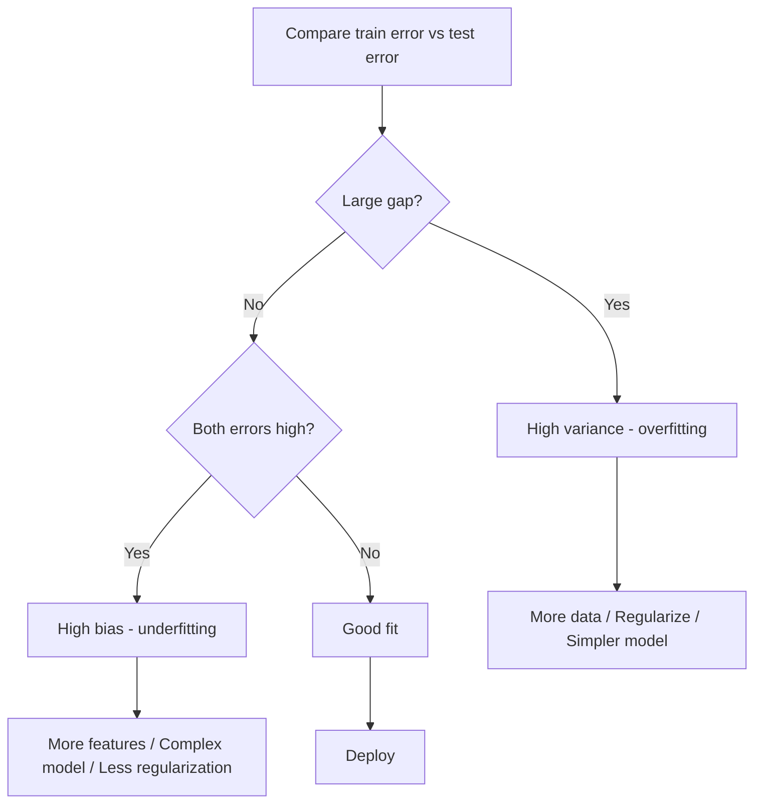
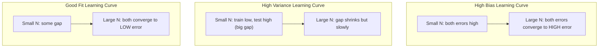
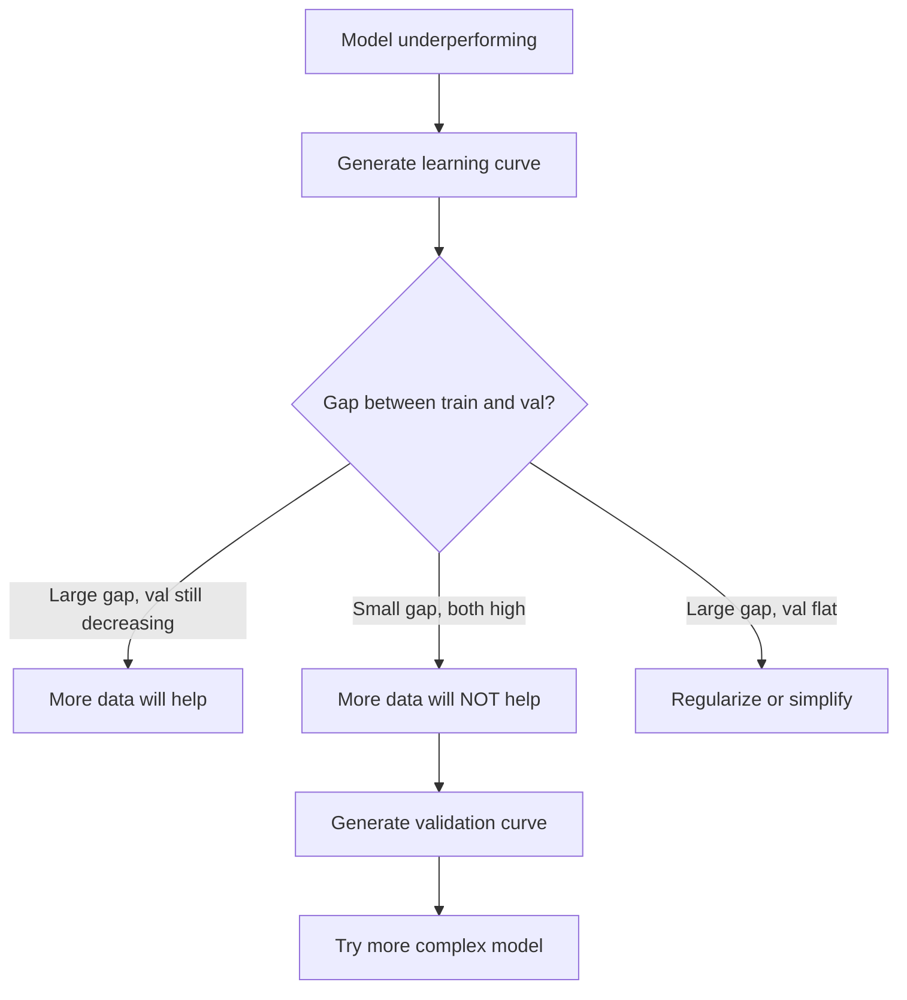

# مقايضة التحيز والتباين
> يأتي كل خطأ في النموذج من أحد المصادر الثلاثة: التحيز، أو التباين، أو الضوضاء. يمكنك التحكم في الأولين فقط.
**النوع:** تعلم
** اللغة: ** بايثون
**المتطلبات الأساسية:** المرحلة الثانية، الدروس 01-09 (ML الأساسيات، والانحدار، والتصنيف، والتقييم)
**الوقت:** ~75 دقيقة
## أهداف التعلم
- اشتقاق تحليل التحيز والتباين لخطأ التنبؤ المتوقع وشرح دور الضوضاء غير القابلة للاختزال
- تشخيص ما إذا كان النموذج يعاني من انحياز عالي أو تباين عالي باستخدام أنماط التدريب وخطأ الاختبار
- شرح كيفية تحيز تقنيات التنظيم (L1، L2، التسرب، الإيقاف المبكر) للتباين
- تنفيذ التجارب التي تصور مقايضة التحيز والتباين عبر النماذج ذات التعقيد المتزايد
## المشكلة
لقد قمت بتدريب نموذج. لديه بعض الخطأ في بيانات الاختبار. ومن أين يأتي ذلك الخطأ؟
إذا كان النموذج الخاص بك بسيطًا جدًا (الانحدار الخطي على مجموعة بيانات منحنية)، فسوف يفتقد النمط الحقيقي باستمرار. هذا هو التحيز. إذا كان النموذج الخاص بك معقدًا جدًا (درجة 20 متعددة الحدود على 15 نقطة بيانات)، فسوف يناسب بيانات التدريب تمامًا ولكنه يعطي تنبؤات مختلفة تمامًا بشأن البيانات الجديدة. هذا هو التباين.
لا يمكنك تصغير كليهما في نفس الوقت لسعة نموذج ثابتة. ادفع الانحياز للأسفل وسيرتفع التباين. دفع التباين إلى الأسفل والتحيز يرتفع. إن فهم هذه المقايضة هو المهارة التشخيصية الأكثر فائدة في التعلم الآلي. إنه يخبرك ما إذا كان يجب make أن يكون نموذجك أكثر تعقيدًا أو أقل تعقيدًا، وما إذا كنت تريد الحصول على المزيد من البيانات أو هندسة ميزات أفضل، وما إذا كنت تريد تنظيمًا أكثر أو أقل.
##المفهوم
### الانحياز: خطأ منهجي
يقيس الانحياز مدى بُعد متوسط ​​تنبؤات النموذج عن القيمة الحقيقية. إذا قمت بتدريب نفس النموذج على العديد من مجموعات التدريب المختلفة المستمدة من نفس التوزيع وقمت بحساب متوسط ​​التوقعات، فإن التحيز هو الفجوة بين هذا المتوسط ​​والحقيقة.
يعني التحيز العالي أن النموذج جامد جدًا بحيث لا يمكنه التقاط النمط الحقيقي. الخط المستقيم المناسب للقطع المكافئ سوف يفتقد المنحنى دائمًا، بغض النظر عن كمية البيانات التي تقدمها له. هذا غير لائق.
```
High bias (underfitting):
  Model always predicts roughly the same wrong thing.
  Training error: HIGH
  Test error: HIGH
  Gap between them: SMALL
```

### التباين: الحساسية لبيانات التدريب
يقيس التباين مدى تغير توقعاتك عند التدريب على مجموعات فرعية مختلفة من البيانات. إذا كانت التغييرات الصغيرة في مجموعة التدريب تؤدي إلى تغييرات كبيرة في النموذج، يكون التباين مرتفعًا.
يعني التباين العالي أن النموذج يلائم الضوضاء في بيانات التدريب، وليس الإشارة الأساسية. سوف يمر متعدد الحدود من الدرجة 20 عبر كل نقطة تدريب ولكنه يتأرجح بشكل كبير بينها. هذا أمر مبالغ فيه.
```
High variance (overfitting):
  Model fits training data perfectly but fails on new data.
  Training error: LOW
  Test error: HIGH
  Gap between them: LARGE
```

### التحلل
بالنسبة لأي نقطة x، فإن خطأ التنبؤ المتوقع تحت الخسارة المربعة يتحلل تمامًا:
```
Expected Error = Bias^2 + Variance + Irreducible Noise

where:
  Bias^2   = (E[f_hat(x)] - f(x))^2
  Variance = E[(f_hat(x) - E[f_hat(x)])^2]
  Noise    = E[(y - f(x))^2]             (sigma^2)
```

- `f(x)` هي الوظيفة الحقيقية
- `f_hat(x)` هو توقع النموذج الخاص بك
- `E[...]` هو التوقع على مجموعات التدريب المختلفة
- `y` هي التسمية المرصودة (الوظيفة الحقيقية بالإضافة إلى الضوضاء)
مصطلح الضوضاء غير قابل للاختزال. لا يوجد نموذج يمكنه القيام بعمل أفضل من sigma^2 في البيانات المزعجة. مهمتك هي إيجاد التوازن الصحيح بين التحيز ^ 2 والتباين.
### تعقيد النموذج مقابل الخطأ


المنحنى الكلاسيكي على شكل حرف U:
| التعقيد | التحيز | التباين | الخطأ الإجمالي |
|-----------|------|--------|-------------|
| منخفض جدًا | HIGH | __المصطلح_1__ | HIGH (نقص التجهيز) |
| مجرد حق | معتدل | معتدل | __المصطلح_3__ |
| عالية جدًا | LOW | __المصطلح_5__ | HIGH (التركيب الزائد) |
### التنظيم كتحكم في التحيز والتباين
يؤدي التنظيم إلى زيادة التحيز بشكل متعمد لتقليل التباين. إنه يقيد النموذج بحيث لا يمكنه مطاردة الضوضاء.
- **L2 (ريدج):** يقلص جميع الأوزان نحو الصفر. يحتفظ بجميع الميزات ولكنه يقلل من تأثيرها.
- **L1 (Lasso):** يدفع بعض الأوزان إلى الصفر تمامًا. ينفذ اختيار الميزة.
- **التسرب:** تعطيل الخلايا العصبية بشكل عشوائي أثناء التدريب. قوات التمثيلات الزائدة عن الحاجة.
- **التوقف المبكر:** يوقف التدريب قبل أن يتناسب النموذج مع بيانات التدريب بشكل كامل.
تتحكم قوة التنظيم (لامدا، معدل التسرب، عدد العصور) بشكل مباشر في مكان تواجدك على منحنى التحيز والتباين. مزيد من التنظيم يعني المزيد من التحيز، وأقل التباين.
### النسب المزدوج: المنظور الحديث
تقول النظرية الكلاسيكية: بعد النقطة الجيدة، دائمًا ما يكون المزيد من التعقيد مؤلمًا. لكن الأبحاث منذ عام 2019 أظهرت شيئًا غير متوقع. إذا واصلت زيادة سعة النموذج إلى ما هو أبعد من عتبة الاستيفاء (حيث يحتوي النموذج على معلمات كافية لتناسب بيانات التدريب بشكل مثالي)، فيمكن أن ينخفض ​​خطأ الاختبار مرة أخرى.


تشرح ظاهرة "النسب المزدوج" هذه سبب استمرار تعميم الشبكات العصبية ذات المعلمات المفرطة بشكل كبير (مع معلمات أكثر بكثير من أمثلة التدريب) بشكل جيد. إن مقايضة التحيز والتباين الكلاسيكية ليست خاطئة، ولكنها غير مكتملة بالنسبة للنظام الحديث.
الملاحظات الرئيسية حول النسب المزدوج:
- يحدث في النماذج الخطية وأشجار القرار والشبكات العصبية
- المزيد من البيانات يمكن أن تؤذي بالفعل في منطقة الاستيفاء (النسب المزدوج الحكيم للعينة)
- المزيد من فترات التدريب يمكن أن تسبب ذلك أيضًا (النسب المزدوج من حيث العصر)
- التنظيم ينعم الذروة لكنه لا يزيلها
لماذا يحدث هذا؟ عند عتبة الاستيفاء، يتمتع النموذج بقدرة كافية لتناسب جميع نقاط التدريب. يتم فرضه على حل محدد للغاية يمر عبر كل نقطة، وتتسبب الاضطرابات الصغيرة في البيانات في حدوث تغييرات كبيرة في الملاءمة. هذا هو المكان الذي يصل فيه التباين إلى ذروته. بعد تجاوز العتبة، يحتوي النموذج على العديد من الحلول الممكنة التي تناسب البيانات تمامًا. تميل خوارزمية التعلم (على سبيل المثال، النسب المتدرج مع التنظيم الضمني) إلى اختيار أبسطها. هذا التحيز الضمني تجاه الحلول البسيطة هو سبب تعميم النماذج ذات المعلمات الزائدة.
| النظام | المعلمات مقابل العينات | السلوك |
|--------|----------------------|---------|
| ذات معلمات ناقصة | ع << ن | تنطبق المقايضة الكلاسيكية |
| عتبة الاستيفاء | ع ~ ن | قمم التباين، وطفرات خطأ الاختبار |
| مبالغة | ع >> ن | يبدأ التنظيم الضمني، وينخفض ​​خطأ الاختبار |
لأغراض عملية: إذا كنت تستخدم شبكات عصبية أو مجموعات أشجار كبيرة، فلا تتوقف عند عتبة الاستيفاء. إما أن تبقى تحته بكثير (مع تنظيم واضح) أو تتجاوزه جيدًا. أسوأ مكان يمكن أن تكون فيه هو عند العتبة.
### تشخيص النموذج الخاص بك


| العَرَض | التشخيص | إصلاح |
|---------|----------|-----|
| خطأ قطار عالي، خطأ اختبار عالي | التحيز | ميزات أكثر، نموذج معقد، تنظيم أقل |
| خطأ قطار منخفض، خطأ اختبار مرتفع | التباين | مزيد من البيانات، التنظيم، نموذج أبسط، التسرب |
| خطأ قطار منخفض، خطأ اختبار منخفض | مناسبا | اشحنها |
| خطأ القطار يتناقص، خطأ الاختبار يتزايد | التجهيز الزائد قيد التقدم | التوقف المبكر |
### الاستراتيجيات العملية
** عندما يكون التحيز هو المشكلة: **
- إضافة ميزات متعددة الحدود أو التفاعل
- استخدم نموذجًا أكثر مرونة (مجموعة شجرية بدلاً من الخطية)
- تقليل قوة التنظيم
- تدريب لفترة أطول (إذا لم تتقارب بعد)
** عندما يكون التباين هو المشكلة: **
- احصل على المزيد من بيانات التدريب
- استخدام التعبئة (الغابات العشوائية)
- زيادة التنظيم (ارتفاع لامدا، المزيد من التسرب)
- اختيار الميزة (إزالة الميزات المزعجة)
- استخدم التحقق المتبادل لاكتشافه مبكرًا
### طرق التجميع وتقليل التباين
تعتبر أساليب المجموعة هي الأداة الأكثر عملية لمحاربة التباين.
يقوم **التعبئة (تجميع Bootstrap)** بتدريب نماذج متعددة على عينات تمهيد مختلفة من بيانات التدريب، ثم يقوم بحساب متوسط ​​توقعاتها. يحتوي كل نموذج فردي على تباين عالٍ، لكن المتوسط ​​​​يحتوي على تباين أقل بكثير. يتم تطبيق التعبئة على الغابات العشوائية على أشجار القرار.
لماذا يعمل رياضيًا: إذا كان لديك متوسط ​​N تنبؤات مستقلة، كل منها مع تباين sigma^2، فإن تباين المتوسط ​​هو sigma^2 / N. النماذج ليست مستقلة حقًا (ترى جميعها بيانات مماثلة)، وبالتالي فإن التخفيض أقل من 1/N، لكنه لا يزال كبيرًا.
**التعزيز** يقلل التحيز من خلال بناء النماذج بشكل تسلسلي، حيث يركز كل نموذج جديد على أخطاء المجموعة حتى الآن. يعد تعزيز التدرج وAdaBoost من الأمثلة الرئيسية. يمكن أن يؤدي التعزيز إلى فرط التناسب إذا قمت بإضافة عدد كبير جدًا من النماذج، لذلك تحتاج إلى التوقف أو التنظيم مبكرًا.
| الطريقة | التأثير الأساسي | تغيير التحيز | تغيير التباين |
|--------|--------------|-------------|-----------------|
| التعبئة | يقلل التباين | لا تغيير | يتناقص |
| التعزيز | يقلل من التحيز | يتناقص | يمكن أن تزيد |
| التراص | يقلل كلا | يعتمد على المتعلم الفوقي | يعتمد على النماذج الأساسية |
| التسرب | التعبئة الضمنية | زيادة طفيفة | يتناقص |
**قاعدة عملية:** إذا كان النموذج الأساسي الخاص بك يحتوي على تباين كبير (أشجار عميقة، ومتعددات حدود عالية الدرجة)، فاستخدم التعبئة. إذا كان النموذج الأساسي الخاص بك يحتوي على انحياز عالي (جذوع ضحلة، نماذج خطية بسيطة)، فاستخدم التعزيز.
### منحنيات التعلم
منحنيات التعلم ترسم التدريب وخطأ التحقق من الصحة كدالة لحجم مجموعة التدريب. إنها أداة التشخيص الأكثر عملية لديك. على عكس المقارنة بين تدريب/اختبار واحد، توضح لك منحنيات التعلم مسار النموذج الخاص بك وتخبرك ما إذا كان المزيد من البيانات سيساعد أم لا.


كيفية قراءتها:
| السيناريو | خطأ في التدريب | خطأ في التحقق | فجوة | ماذا يعني | ماذا تفعل |
|----------|---------------|-----------------|-----|--------------|------------|
| انحياز عالي | عالية | عالية | صغير | لا يمكن للنموذج التقاط النمط | ميزات أكثر، نموذج معقد، تنظيم أقل |
| التباين العالي | منخفض | عالية | كبير | النموذج يحفظ بيانات التدريب | مزيد من البيانات، والتنظيم، ونموذج أبسط |
| مناسبا | معتدل | معتدل | صغير | النموذج يعمم بشكل جيد | اشحنها |
| تباين عالي، تحسين | منخفض | التناقص مع المزيد من البيانات | تقلص | مشكلة التباين التي يمكن للبيانات إصلاحها | جمع المزيد من البيانات |
| انحياز عالي، مسطح | عالية | عالية ومسطحة | صغيرة ومسطحة | مزيد من البيانات سوف يساعد NOT | تغيير بنية النموذج |
الرؤية الحاسمة: إذا استقر كلا المنحنيين وكانت الفجوة صغيرة ولكن كلا الخطأين مرتفعان، فإن المزيد من البيانات يصبح عديم الفائدة. أنت بحاجة إلى نموذج أفضل. وإذا كانت الفجوة كبيرة ولا تزال تتقلص، فإن المزيد من البيانات سيساعد.
### كيفية إنشاء منحنيات التعلم
هناك نهجان:
** المنهج 1: تنويع حجم مجموعة التدريب والنموذج الثابت. ** الحفاظ على ثبات النموذج والمعلمات الفائقة. التدريب على مجموعات فرعية كبيرة بشكل متزايد من بيانات التدريب. قياس خطأ التدريب وخطأ التحقق من الصحة في كل حجم. هذا هو منحنى التعلم القياسي.
** المنهج 2: تنويع تعقيد النموذج، والبيانات الثابتة. ** الحفاظ على ثبات البيانات. مسح معلمة التعقيد (درجة متعددة الحدود، عمق الشجرة، عدد الطبقات). قياس خطأ التدريب وخطأ التحقق من الصحة في كل تعقيد. هذا هو منحنى التحقق من الصحة ويظهر مقايضة التحيز والتباين مباشرة.
كلا النهجين يكمل كل منهما الآخر. يخبرك الأول ما إذا كان المزيد من البيانات سيساعدك. يخبرك الثاني ما إذا كان النموذج المختلف سيساعدك. قم بتشغيل كليهما قبل اتخاذ القرارات بشأن خطوتك التالية.


## بنائها
يقوم الكود الموجود في `code/bias_variance.py` بتشغيل تجربة تحليل التحيز والتباين الكاملة. هنا هو النهج، خطوة بخطوة.
### الخطوة 1: إنشاء بيانات تركيبية من دالة معروفة
نستخدم `f(x) = sin(1.5x) + 0.5x` مع الضوضاء الغوسية. تتيح لنا معرفة الوظيفة الحقيقية حساب التحيز والتباين الدقيق.
```python
def true_function(x):
    return np.sin(1.5 * x) + 0.5 * x

def generate_data(n_samples=30, noise_std=0.5, x_range=(-3, 3), seed=None):
    rng = np.random.RandomState(seed)
    x = rng.uniform(x_range[0], x_range[1], n_samples)
    y = true_function(x) + rng.normal(0, noise_std, n_samples)
    return x, y
```

### الخطوة الثانية: أخذ عينات Bootstrap وتركيب كثيرات الحدود
لكل درجة متعددة الحدود، نرسم العديد من مجموعات التدريب التمهيدية، ونلائم متعددة الحدود، ونسجل التنبؤات على شبكة اختبار ثابتة. وهذا يعطينا توزيعًا للتنبؤات عند كل نقطة اختبار.
```python
def fit_polynomial(x_train, y_train, degree, lam=0.0):
    X = np.column_stack([x_train ** d for d in range(degree + 1)])
    if lam > 0:
        penalty = lam * np.eye(X.shape[1])
        penalty[0, 0] = 0
        w = np.linalg.solve(X.T @ X + penalty, X.T @ y_train)
    else:
        w = np.linalg.lstsq(X, y_train, rcond=None)[0]
    return w
```

نحن نلائم 200 عينة مختلفة من التمهيد. يتم استخلاص كل عينة تمهيد من نفس التوزيع الأساسي ولكنها تحتوي على نقاط مختلفة.
### الخطوة 3: حساب الانحياز^2، تحليل التباين
مع 200 مجموعة من التنبؤات في كل نقطة اختبار، يمكننا حساب التحلل مباشرة من التعريف:
```python
mean_pred = predictions.mean(axis=0)
bias_sq = np.mean((mean_pred - y_true) ** 2)
variance = np.mean(predictions.var(axis=0))
total_error = np.mean(np.mean((predictions - y_true) ** 2, axis=1))
```

- `mean_pred` هو E[f_hat(x)] المقدر من عينات التمهيد
- `bias_sq` هي الفجوة المربعة بين متوسط التنبؤ والحقيقة
- `variance` هو متوسط انتشار التنبؤات عبر عينات التمهيد
- `total_error` يجب أن يساوي تقريبًا التحيز^2 + التباين + الضوضاء
### الخطوة 4: منحنيات التعلم
منحنيات التعلم تكتسح حجم مجموعة التدريب مع الحفاظ على تعقيد النموذج ثابتًا. إنها توضح ما إذا كان النموذج الخاص بك محدود البيانات أو محدود السعة.
```python
def demo_learning_curves():
    sizes = [10, 15, 20, 30, 50, 75, 100, 150, 200, 300]
    degree = 5

    for n in sizes:
        train_errors = []
        test_errors = []
        for seed in range(50):
            x_train, y_train = generate_data(n_samples=n, seed=seed * 100)
            w = fit_polynomial(x_train, y_train, degree)
            train_pred = predict_polynomial(x_train, w)
            train_mse = np.mean((train_pred - y_train) ** 2)
            test_pred = predict_polynomial(x_test, w)
            test_mse = np.mean((test_pred - y_test) ** 2)
            train_errors.append(train_mse)
            test_errors.append(test_mse)
        # Average over runs gives the learning curve point
```

بالنسبة للنموذج عالي التباين (الدرجة 5 مع البيانات الصغيرة)، ترى:
- يبدأ خطأ التدريب منخفضًا ويزداد مع زيادة صعوبة حفظ البيانات
- يبدأ خطأ الاختبار مرتفعًا ويتناقص مع حصول النموذج على إشارة أكبر
- الفجوة تتقلص مع المزيد من البيانات
بالنسبة لنموذج الانحياز العالي (الدرجة 1)، يتقارب كلا الخطأين بسرعة إلى نفس القيمة العالية ولا يساعد المزيد من البيانات.
### الخطوة 5: عملية التنظيم
يشتمل الكود أيضًا على `demo_regularization_sweep()`، الذي يعمل على إصلاح كثير الحدود عالي الدرجة (الدرجة 15) ويكتسح قوة تنظيم Ridge من 0.001 إلى 100. ويوضح هذا مقايضة التحيز والتباين من زاوية مختلفة: بدلاً من تغيير تعقيد النموذج، نقوم بتغيير قوة القيد.
```python
def demo_regularization_sweep():
    alphas = [0.001, 0.005, 0.01, 0.05, 0.1, 0.5, 1.0, 5.0, 10.0, 50.0, 100.0]
    for alpha in alphas:
        results = bias_variance_decomposition([15], lam=alpha)
        r = results[15]
        print(f"alpha={alpha:.3f}  bias={r['bias_sq']:.4f}  var={r['variance']:.4f}")
```

عند مستوى ألفا المنخفض، يكون كثير الحدود من الدرجة 15 غير مقيد تقريبًا. يهيمن التباين لأن النموذج يطارد الضوضاء في كل عينة تمهيدية. عند مستوى ألفا المرتفع، تكون العقوبة قوية جدًا بحيث يصبح النموذج فعليًا دالة شبه ثابتة. التحيز يهيمن. ألفا الأمثل يقع بين هذين النقيضين.
هذا هو نفس منحنى U من درجات متعددة الحدود المتفاوتة، ولكن يتم التحكم فيه بواسطة مقبض مستمر بدلاً من مقبض منفصل. من الناحية العملية، يعد التنظيم هو الطريقة المفضلة للتحكم في المفاضلة لأنه يسمح بالتحكم الدقيق دون تغيير مجموعة الميزات.
## استخدمه
يوفر sklearn `learning_curve` و`validation_curve` لأتمتة هذه التشخيصات دون كتابة حلقات التمهيد.
### منحنى التحقق: تعقيد نموذج الاجتياح
```python
from sklearn.model_selection import validation_curve
from sklearn.pipeline import make_pipeline
from sklearn.preprocessing import PolynomialFeatures
from sklearn.linear_model import Ridge

degrees = list(range(1, 16))
train_scores_all = []
val_scores_all = []

for d in degrees:
    pipe = make_pipeline(PolynomialFeatures(d), Ridge(alpha=0.01))
    train_scores, val_scores = validation_curve(
        pipe, X, y, param_name="polynomialfeatures__degree",
        param_range=[d], cv=5, scoring="neg_mean_squared_error"
    )
    train_scores_all.append(-train_scores.mean())
    val_scores_all.append(-val_scores.mean())
```

يمنحك هذا منحنى مقايضة التحيز والتباين مباشرة. عندما تكون درجة التحقق هي الأسوأ بالنسبة إلى درجة التدريب، فإن التباين هو السائد. وحيثما يكون كلاهما سيئا، فإن التحيز هو السائد.
### منحنى التعلم: حجم مجموعة التدريب الشامل
```python
from sklearn.model_selection import learning_curve

pipe = make_pipeline(PolynomialFeatures(5), Ridge(alpha=0.01))
train_sizes, train_scores, val_scores = learning_curve(
    pipe, X, y, train_sizes=np.linspace(0.1, 1.0, 10),
    cv=5, scoring="neg_mean_squared_error"
)
train_mse = -train_scores.mean(axis=1)
val_mse = -val_scores.mean(axis=1)
```

ارسم `train_mse` و`val_mse` مقابل `train_sizes`. يخبرك الشكل بكل شيء عن النموذج الخاص بك.
### التحقق المتبادل مع عملية المسح للتنظيم
```python
from sklearn.model_selection import cross_val_score

alphas = [0.001, 0.01, 0.1, 1.0, 10.0, 100.0]
for alpha in alphas:
    pipe = make_pipeline(PolynomialFeatures(10), Ridge(alpha=alpha))
    scores = cross_val_score(pipe, X, y, cv=5, scoring="neg_mean_squared_error")
    print(f"alpha={alpha:>7.3f}  MSE={-scores.mean():.4f} +/- {scores.std():.4f}")
```

يؤدي هذا إلى اجتياح قوة التنظيم لتعقيد النموذج الثابت. سترى نفس مقايضة التحيز والتباين: ألفا المنخفض يعني التباين العالي، ألفا المرتفع يعني الانحياز العالي.
### تجميع كل ذلك معًا: سير عمل تشخيصي كامل
من الناحية العملية، يمكنك تشغيل هذه التشخيصات بالتسلسل:
1. تدريب النموذج الخاص بك. حساب القطار وخطأ الاختبار.
2. إذا كان كلاهما مرتفعًا: فأنت تعاني من مشكلة التحيز. انتقل إلى الخطوة 4.
3. إذا كان القطار منخفضًا ولكن الاختبار مرتفع: لديك مشكلة تباين. قم بإنشاء منحنى تعليمي لمعرفة ما إذا كان المزيد من البيانات سيساعد. إذا لم يكن الأمر كذلك، قم بالتسوية.
4. قم بإنشاء منحنى التحقق من الصحة الذي يجتاح معلمة التعقيد الرئيسية الخاصة بك. العثور على المكان الجميل.
5. في المكان المناسب، قم بإنشاء منحنى التعلم. إذا كانت الفجوة لا تزال كبيرة، فأنت بحاجة إلى مزيد من البيانات أو التنظيم.
6. جرب Ridge/Lasso بقيم ألفا مختلفة باستخدام `cross_val_score`. اختر ألفا حيث يكون خطأ التحقق المتبادل في أدنى مستوياته.
يستغرق هذا من 10 إلى 15 دقيقة من الحساب لمعظم مجموعات البيانات الجدولية ويوفر ساعات من التخمين.
## اشحنها
ينتج عن هذا الدرس: `outputs/prompt-model-diagnostics.md`
## تمارين
1. قم بتشغيل التحلل باستخدام `noise_std=0` (بدون ضوضاء). ماذا يحدث لمصطلح الخطأ غير القابل للاختزال؟ هل يتغير التعقيد الأمثل؟
2. زيادة حجم المجموعة التدريبية من 30 إلى 300. كيف يؤثر ذلك على عنصر التباين؟ هل تتغير درجة كثيرات الحدود المثالية؟
3. أضف التنظيم L2 (انحدار ريدج) إلى التجربة. للحصول على كثير حدود ثابت عالي الدرجة (الدرجة 15)، قم بمسح لامدا من 0 إلى 100. ارسم التحيز ^ 2 والتباين كوظائف لامدا.
4. قم بتعديل الدالة الحقيقية من كثيرة الحدود إلى `sin(x)`. كيف يتغير تحليل التحيز والتباين؟ هل لا تزال هناك درجة مثالية واضحة؟
5. تنفيذ غلاف تجميع (تعبئة) بسيط للتمهيد: تدريب 10 نماذج على عينات التمهيد ومتوسط ​​التوقعات. أظهر أن هذا يقلل التباين دون زيادة التحيز كثيرًا.
## المصطلحات الرئيسية
| مصطلح | ماذا يقول الناس | ماذا يعني في الواقع |
|------|----------------|----------------------|
| التحيز | "النموذج بسيط للغاية" | خطأ منهجي من الافتراضات الخاطئة. الفجوة بين متوسط ​​توقعات النموذج والحقيقة. |
| التباين | "النموذج مفرط التجهيز" | خطأ من الحساسية لبيانات التدريب. مدى تغير التوقعات عبر مجموعات التدريب المختلفة. |
| خطأ غير قابل للاختزال | "الضجيج في البيانات" | خطأ من العشوائية في عملية توليد البيانات الحقيقية. ولا يمكن لأي نموذج القضاء عليه. |
| غير مناسب | "لا أتعلم بما فيه الكفاية" | النموذج لديه انحياز عالي. إنه يفتقد النمط الحقيقي حتى في بيانات التدريب. |
| التجهيز الزائد | "حفظ البيانات" | النموذج لديه تباين كبير. يناسب الضوضاء في بيانات التدريب التي لا تعمم. |
| تسوية | "تقييد النموذج" | إضافة عقوبة لتقليل تعقيد النموذج، والتحيز التجاري لتقليل التباين. |
| نزول مزدوج | "المزيد من المعلمات يمكن أن تساعد" | ينخفض ​​خطأ الاختبار مرة أخرى عندما تتجاوز سعة النموذج عتبة الاستيفاء بكثير. |
| تعقيد النموذج | "مدى مرونة النموذج" | قدرة النموذج على ملاءمة الأنماط العشوائية. يتم التحكم فيها عن طريق البنية أو الميزات أو التنظيم. |
## مزيد من القراءة
- [Hastie, Tibshirani, Friedman: Elements of Statistical Learning, Ch. 7](https://hastie.su.domains/ElemStatLearn/) -- العلاج النهائي لتحلل التحيز والتباين
- [Belkin et al., Reconciling modern machine learning practice and the bias-variance trade-off (2019)](https://arxiv.org/abs/1812.11118) -- ورقة النسب المزدوج
- [Nakkiran et al., Deep Double Descent (2019)](https://arxiv.org/abs/1912.02292) -- النسب المزدوج حسب العصر والعينة
- [Scott Fortmann-Roe: Understanding the Bias-Variance Tradeoff](http://scott.fortmann-roe.com/docs/BiasVariance.html) -- شرح مرئي واضح