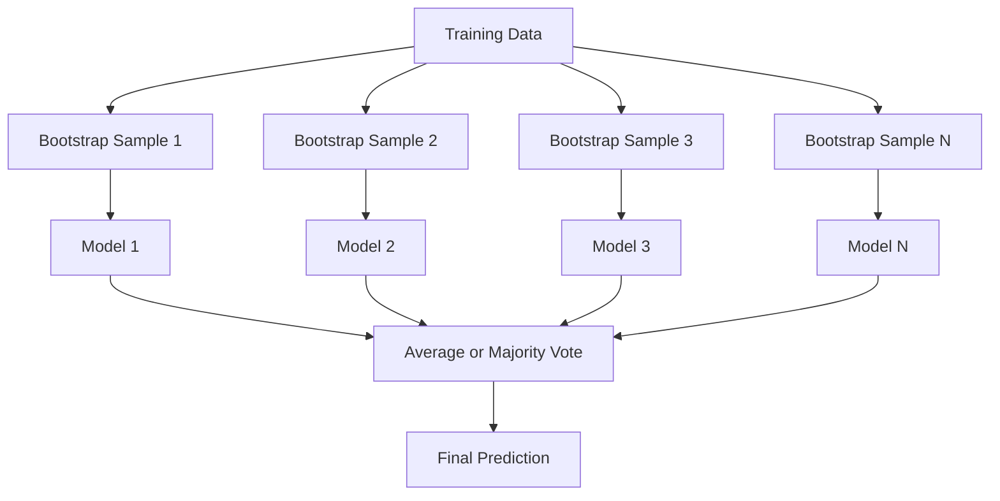
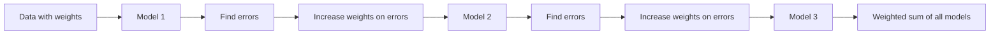
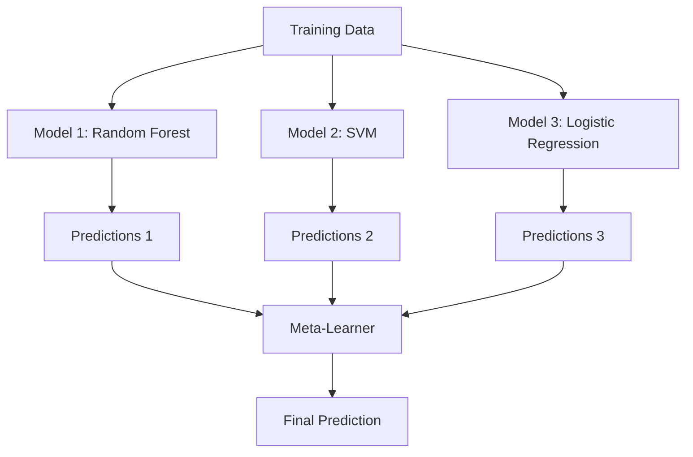

# Ensemble Methods

> مجموعة من المتعلمين الضعفاء، إذا تم دمجهم بشكل صحيح، يصبحون متعلمين أقوياء. هذه ليست استعارة. إنها نظرية.

**النوع:** بناء
** اللغة: ** بايثون
**المتطلبات الأساسية:** المرحلة الثانية، الدرس 10 (مفاضلة التحيز والتباين)
**الوقت:** ~120 دقيقة

## Learning Objectives

- تنفيذ AdaBoost وتعزيز التدرج من الصفر وشرح كيف يؤدي التعزيز بشكل تسلسلي إلى تقليل التحيز
- بناء مجموعة تعبئة وإظهار كيف يؤدي متوسط النماذج غير المترابطة إلى تقليل التباين دون زيادة التحيز
- قارن بين التعبئة والتعزيز والتكديس من حيث مكون الخطأ الذي تستهدفه كل طريقة
- تقييم تنوع المجموعة وشرح سبب تحسن دقة تصويت الأغلبية مع المتعلمين الضعفاء الأكثر استقلالية

## The Problem

شجرة القرار الواحدة سريعة التدريب وسهلة التفسير، ولكنها مفرطة في التخصيص. نموذج خطي واحد لا يتناسب مع الحدود المعقدة. يمكنك قضاء أيام في هندسة النموذج المعماري المثالي. أو يمكنك الجمع بين مجموعة من النماذج غير المثالية والحصول على شيء أفضل من أي منها على حدة.

طرق المجموعة تفعل هذا بالضبط. إنها التقنية الأكثر موثوقية للفوز بمسابقات Kaggle على البيانات الجدولية، فهي تعمل على تشغيل معظم أنظمة الإنتاج ML، وتوضح مقايضة التحيز والتباين أثناء العمل. التعبئة تقلل من التباين. التعزيز يقلل من التحيز. يتعرف التراص على النماذج التي يجب الاعتماد عليها وعلى أي مدخلات.

## The Concept

### Why Ensembles Work

لنفترض أن لديك N مصنفات مستقلة، دقة كل منها p > 0.5. تصويت الأغلبية له دقة:

```
P(majority correct) = sum over k > N/2 of C(N,k) * p^k * (1-p)^(N-k)
```

بالنسبة لـ 21 مصنفًا بدقة 60% لكل منها، تبلغ دقة تصويت الأغلبية حوالي 74%. وبوجود 101 مصنفًا ترتفع النسبة إلى 84%. يتم إلغاء الأخطاء عندما تكون النماذج make أخطاء مختلفة.

الشرط الأساسي هو **التنوع**. إذا كانت جميع النماذج make نفس الأخطاء، فإن الجمع بينها لا يساعد شيئًا. تعمل الفرق لأنها تنتج نماذج متنوعة من خلال:

- مجموعات فرعية مختلفة للتدريب (التعبئة)
- مجموعات فرعية مختلفة (غابات عشوائية)
- تصحيح الخطأ المتسلسل (التعزيز)
- عائلات نموذجية مختلفة (التراص)

### Bagging (Bootstrap Aggregating)

يؤدي التعبئة إلى التنوع من خلال تدريب كل نموذج على عينة تمهيدية مختلفة من بيانات التدريب.



يتم رسم عينة التمهيد مع الاستبدال من البيانات الأصلية بنفس حجم النسخة الأصلية. يظهر حوالي 63.2% من العينات الفريدة في كل تمهيد. توفر نسبة 36.8% المتبقية (العينات خارج الحقيبة) مجموعة تحقق مجانية.

التعبئة تقلل من التباين دون زيادة التحيز كثيرًا. تتراكب كل شجرة على حدة مع عينة التشغيل الخاصة بها، لكن التجهيز الزائد يختلف بالنسبة لكل شجرة، لذا فإن حساب المتوسط ​​يلغي التشويش.

**الغابات العشوائية** تُضاف إليها لمسة إضافية: عند كل تقسيم، يتم أخذ مجموعة فرعية عشوائية فقط من الميزات في الاعتبار. وهذا يفرض المزيد من التنوع بين الأشجار. العدد النموذجي للميزات المرشحة هو `sqrt(n_features)` للتصنيف و `n_features / 3` للانحدار.

### Boosting (Sequential Error Correction)

تعزيز نماذج القطارات بشكل تسلسلي. يركز كل نموذج جديد على الأمثلة التي أخطأت فيها النماذج السابقة.



التعزيز يقلل من التحيز. يقوم كل نموذج جديد بتصحيح الأخطاء المنهجية للمجموعة حتى الآن. التنبؤ النهائي هو مجموع مرجح لجميع النماذج، حيث تحصل النماذج الأفضل على أوزان أعلى.

المقايضة: يمكن أن يكون التعزيز زائدًا عن الحد إذا قمت بتشغيل عدد كبير جدًا من الجولات، لأنه يستمر في ملاءمة الأمثلة الأصعب، والتي قد يكون بعضها ضوضاء.

### AdaBoost

كانت AdaBoost (التعزيز التكيفي) أول خوارزمية تعزيز عملية. إنه يعمل مع أي متعلم أساسي، عادةً ما يكون جذوع القرار (أشجار العمق 1).

الخوارزمية:

```
1. Initialize sample weights: w_i = 1/N for all i

2. For t = 1 to T:
   a. Train weak learner h_t on weighted data
   b. Compute weighted error:
      err_t = sum(w_i * I(h_t(x_i) != y_i)) / sum(w_i)
   c. Compute model weight:
      alpha_t = 0.5 * ln((1 - err_t) / err_t)
   d. Update sample weights:
      w_i = w_i * exp(-alpha_t * y_i * h_t(x_i))
   e. Normalize weights to sum to 1

3. Final prediction: H(x) = sign(sum(alpha_t * h_t(x)))
```

النماذج ذات الخطأ الأقل تحصل على ألفا أعلى. تحصل العينات التي تم تصنيفها بشكل خاطئ على أوزان أعلى، لذا يركز النموذج التالي عليها.

### Gradient Boosting

يعمل تعزيز التدرج على تعميم التعزيز على وظائف الخسارة التعسفية. وبدلاً من إعادة وزن العينات، فإنه يناسب كل نموذج جديد مع المتبقي (التدرج السلبي للخسارة) للمجموعة الحالية.

```
1. Initialize: F_0(x) = argmin_c sum(L(y_i, c))

2. For t = 1 to T:
   a. Compute pseudo-residuals:
      r_i = -dL(y_i, F_{t-1}(x_i)) / dF_{t-1}(x_i)
   b. Fit a tree h_t to the residuals r_i
   c. Find optimal step size:
      gamma_t = argmin_gamma sum(L(y_i, F_{t-1}(x_i) + gamma * h_t(x_i)))
   d. Update:
      F_t(x) = F_{t-1}(x) + learning_rate * gamma_t * h_t(x)

3. Final prediction: F_T(x)
```

بالنسبة لخسارة الخطأ التربيعي، فإن البقايا الزائفة هي فقط البقايا الفعلية: `r_i = y_i - F_{t-1}(x_i)`. كل شجرة تناسب حرفيًا أخطاء المجموعة السابقة.

يتحكم معدل التعلم (الانكماش) ​​في مقدار مساهمة كل شجرة. تتطلب معدلات التعلم الأصغر عددًا أكبر من الأشجار ولكن التعميم أفضل. القيم النموذجية: 0.01 إلى 0.3.

### XGBoost: Why It Dominates Tabular Data

XGBoost (تعزيز التدرج الفائق) عبارة عن تعزيز التدرج من خلال التحسينات الهندسية التي make سريعة ودقيقة ومقاومة للتركيب الزائد:

- **الهدف المنظم:** العقوبات L1 وL2 على أوزان الأوراق تمنع الأشجار الفردية من أن تكون واثقة جدًا
- **التقريب من الدرجة الثانية:** يستخدم المشتقتين الأولى والثانية للخسارة، مما يوفر قرارات مقسمة أفضل
- **التقسيمات التي تراعي التشتت:** تعالج القيم المفقودة بشكل أصلي من خلال معرفة الاتجاه الأفضل للبيانات المفقودة عند كل تقسيم
- **أخذ عينات فرعية من الأعمدة:** مثل الغابات العشوائية، يتم عرض العينات عند كل قسم من أجل التنوع
- **الرسم الكمي الموزون:** يجد بكفاءة نقاط الانقسام للميزات المستمرة في البيانات الموزعة
- ** بنية كتلة مدركة لذاكرة التخزين المؤقت: ** تم تحسين تخطيط الذاكرة لـ CPU خطوط ذاكرة التخزين المؤقت

بالنسبة للبيانات الجدولية، يتفوق XGBoost (والتي تليها LightGBM) باستمرار على الشبكات العصبية. وهذا لن يتغير في أي وقت قريب. إذا كانت بياناتك تناسب جدولًا يحتوي على صفوف وأعمدة، فابدأ بتعزيز التدرج.

### Stacking (Meta-Learning)

يستخدم التكديس تنبؤات النماذج الأساسية المتعددة كميزات للمتعلم التعريفي.



يتعلم المتعلم التلوي النموذج الأساسي الذي يثق به وأي مدخلات. إذا كانت الغابة العشوائية أفضل في مناطق معينة وSVM في مناطق أخرى، فسيتعلم المتعلم التعريفي التوجيه وفقًا لذلك.

لتجنب تسرب البيانات، يجب إنشاء تنبؤات النموذج الأساسي من خلال التحقق المتبادل في مجموعة التدريب. لا يمكنك مطلقًا تدريب النماذج الأساسية وإنشاء ميزات تعريفية على نفس البيانات.

### Voting

أبسط فرقة. مجرد الجمع بين التوقعات مباشرة.

- **التصويت الصعب:** تصويت الأغلبية على تسميات الفصل.
- **التصويت الناعم:** متوسط ​​الاحتمالات المتوقعة، اختر الصف الذي يتمتع بأعلى متوسط ​​احتمالات. عادةً ما يكون أفضل لأنه يستخدم معلومات الثقة.

## Build It

### Step 1: Decision Stump (Base Learner)

الكود الموجود في `code/ensembles.py` ينفذ كل شيء من الصفر. نبدأ بجذع القرار: شجرة ذات شق واحد.

```python
class DecisionStump:
    def __init__(self):
        self.feature_idx = None
        self.threshold = None
        self.polarity = 1
        self.alpha = None

    def fit(self, X, y, weights):
        n_samples, n_features = X.shape
        best_error = float("inf")

        for f in range(n_features):
            thresholds = np.unique(X[:, f])
            for thresh in thresholds:
                for polarity in [1, -1]:
                    pred = np.ones(n_samples)
                    pred[polarity * X[:, f] < polarity * thresh] = -1
                    error = np.sum(weights[pred != y])
                    if error < best_error:
                        best_error = error
                        self.feature_idx = f
                        self.threshold = thresh
                        self.polarity = polarity

    def predict(self, X):
        n = X.shape[0]
        pred = np.ones(n)
        idx = self.polarity * X[:, self.feature_idx] < self.polarity * self.threshold
        pred[idx] = -1
        return pred
```

### Step 2: AdaBoost from Scratch

```python
class AdaBoostScratch:
    def __init__(self, n_estimators=50):
        self.n_estimators = n_estimators
        self.stumps = []
        self.alphas = []

    def fit(self, X, y):
        n = X.shape[0]
        weights = np.full(n, 1 / n)

        for _ in range(self.n_estimators):
            stump = DecisionStump()
            stump.fit(X, y, weights)
            pred = stump.predict(X)

            err = np.sum(weights[pred != y])
            err = np.clip(err, 1e-10, 1 - 1e-10)

            alpha = 0.5 * np.log((1 - err) / err)
            weights *= np.exp(-alpha * y * pred)
            weights /= weights.sum()

            stump.alpha = alpha
            self.stumps.append(stump)
            self.alphas.append(alpha)

    def predict(self, X):
        total = sum(a * s.predict(X) for a, s in zip(self.alphas, self.stumps))
        return np.sign(total)
```

### Step 3: Gradient Boosting from Scratch

```python
class GradientBoostingScratch:
    def __init__(self, n_estimators=100, learning_rate=0.1, max_depth=3):
        self.n_estimators = n_estimators
        self.lr = learning_rate
        self.max_depth = max_depth
        self.trees = []
        self.initial_pred = None

    def fit(self, X, y):
        self.initial_pred = np.mean(y)
        current_pred = np.full(len(y), self.initial_pred)

        for _ in range(self.n_estimators):
            residuals = y - current_pred
            tree = SimpleRegressionTree(max_depth=self.max_depth)
            tree.fit(X, residuals)
            update = tree.predict(X)
            current_pred += self.lr * update
            self.trees.append(tree)

    def predict(self, X):
        pred = np.full(X.shape[0], self.initial_pred)
        for tree in self.trees:
            pred += self.lr * tree.predict(X)
        return pred
```

### Step 4: Compare against sklearn

يتحقق الكود من أن تطبيقاتنا من البداية تنتج دقة مماثلة لـ `AdaBoostClassifier` و `GradientBoostingClassifier` الخاصة بـ sklearn، وتقارن جميع الطرق جنبًا إلى جنب.

## Use It

### When to Use Each Method

| الطريقة | يقلل | الأفضل لـ | احذر |
|--------|---------|--------|---------------|
| التعبئة / الغابة العشوائية | التباين | بيانات صاخبة، والعديد من الميزات | لا يساعد مع التحيز |
| ادا بوست | التحيز | بيانات نظيفة، قاعدة بسيطة للمتعلمين | حساس للقيم المتطرفة والضوضاء |
| تعزيز التدرج | التحيز | بيانات جدولية، مسابقات | بطيء في التدريب، وسهل التجهيز دون ضبط |
| XGBoost / LightGBM | كلاهما | جدول الإنتاج ML | العديد من المعلمات الفائقة |
| التراص | كلاهما | الحصول على دقة 1-2% الأخيرة | معقد، خطر الإفراط في تجهيز المتعلم الفوقي |
| التصويت | التباين | مزيج سريع من الموديلات المتنوعة | يساعد فقط إذا كانت النماذج متنوعة |

### The Production Stack for Tabular Data

بالنسبة لمعظم مشاكل التنبؤ الجدولي، هذا هو الترتيب الذي يجب تجربته:

1. **LightGBM أو XGBoost** مع المعلمات الافتراضية
2. قم بضبط المقدرات، ومعدل التعلم، والحد الأقصى للعمق، والحد الأدنى لوزن الطفل
3. إذا كنت بحاجة إلى 0.5% الأخيرة، قم ببناء مجموعة تكديس مكونة من 3-5 نماذج متنوعة
4. استخدم التحقق المتبادل طوال الوقت

دائمًا ما تكون الشبكات العصبية المستخدمة في البيانات الجدولية أسوأ من تعزيز التدرج، على الرغم من محاولات البحث المستمرة. أحيانًا تتطابق TabNet وNODE والبنى المماثلة مع XGBoost المضبوط جيدًا ولكنها نادرًا ما تتفوق عليه.

## Ship It

ينتج عن هذا الدرس `outputs/prompt-ensemble-selector.md` - مطالبة تساعدك على اختيار طريقة التجميع الصحيحة لمجموعة بيانات معينة. قم بوصف بياناتك (الحجم، وأنواع الميزات، ومستوى الضوضاء، وتوازن الفصل) والمشكلة التي تحلها. يتنقل الموجه عبر قائمة مراجعة القرار، ويوصي بأسلوب ما، ويقترح بدء تشغيل المعلمات الفائقة، ويحذر من الأخطاء الشائعة في هذا الأسلوب. يتم أيضًا إنتاج `outputs/skill-ensemble-builder.md` مع دليل الاختيار الكامل.

## Exercises

1. قم بتعديل تطبيق AdaBoost لتتبع دقة التدريب بعد كل جولة. دقة المؤامرة مقابل عدد المقدرين. متى تتقارب؟

2. قم بتنفيذ مجموعة عشوائية من البداية عن طريق إضافة ميزة فرعية عشوائية إلى شجرة الانحدار. تدريب 100 شجرة باستخدام `max_features=sqrt(n_features)` ومتوسط ​​التوقعات. قارن تقليل التباين بشجرة واحدة.

3. في تنفيذ تعزيز التدرج، أضف التوقف المبكر: تتبع خسارة التحقق من الصحة بعد كل جولة وتوقف عندما لا تتحسن لمدة 10 جولات متتالية. كم عدد الأشجار التي تحتاجها فعلا؟

4. قم ببناء مجموعة تكديس بثلاثة نماذج أساسية (الانحدار اللوجستي، وشجرة القرار، وأقرب الجيران) ومتعلم فوقي للانحدار اللوجستي. استخدم التحقق المتبادل بخمسة أضعاف لإنشاء ميزات التعريف. قارنه بكل نموذج أساسي بمفرده.

5. قم بتشغيل XGBoost على نفس مجموعة البيانات باستخدام المعلمات الافتراضية. قارن دقتها بتعزيز التدرج من الصفر. الوقت على حد سواء. ما هو حجم فرق السرعة؟

## Key Terms

| مصطلح | ماذا يقول الناس | ماذا يعني في الواقع |
|------|----------------|----------------------|
| التعبئة | "تدريب على مجموعات فرعية عشوائية" | تجميع Bootstrap: نماذج التدريب على عينات bootstrap، متوسط ​​التنبؤات لتقليل التباين |
| التعزيز | "التركيز على الأمثلة الصعبة" | تدريب النماذج بشكل تسلسلي، بحيث يقوم كل منها بتصحيح أخطاء المجموعة حتى الآن، لتقليل التحيز |
| ادا بوست | "إعادة وزن البيانات" | التعزيز عبر عينة تحديثات الوزن؛ النقاط المصنفة بشكل خاطئ تحصل على وزن أكبر للمتعلم التالي |
| تعزيز التدرج | "تناسب البقايا" | التعزيز من خلال ملاءمة كل نموذج جديد للتدرج السلبي لوظيفة الخسارة |
| اكس جي بوست | "سلاح كاجل" | تعزيز التدرج من خلال التنظيم والتحسين من الدرجة الثانية وحيل السرعة على مستوى الأنظمة |
| التراص | "نماذج فوق نماذج" | استخدم تنبؤات النماذج الأساسية كميزات إدخال للمتعلم التعريفي |
| غابة عشوائية | "العديد من الأشجار العشوائية" | التعبئة باستخدام أشجار القرار، وإضافة ميزة فرعية عشوائية عند كل قسم من أجل التنوع |
| تنوع الفرقة | "ارتكب أخطاء مختلفة" | يجب أن تكون النماذج غير مترابطة في أخطائها حتى تتحسن المجموعة مقارنة بالأفراد |
| خطأ خارج الحقيبة | "التحقق المجاني" | العينات غير الموجودة في قرعة تمهيدية (~ 36.8%) تعمل كمجموعة تحقق دون الحاجة إلى تعليق |

## Further Reading

- [Schapire & Freund: Boosting: Foundations and Algorithms](https://mitpress.mit.edu/9780262526036/) -- the book by AdaBoost's creators
- [Friedman: Greedy Function Approximation: A Gradient Boosting Machine (2001)](https://statweb.stanford.edu/~jhf/ftp/trebst.pdf) -- ورق تعزيز التدرج الأصلي
- [Chen & Guestrin: XGBoost (2016)](https://arxiv.org/abs/1603.02754) -- the XGBoost paper
- [Wolpert: Stacked Generalization (1992)](https://www.sciencedirect.com/science/article/abs/pii/S0893608005800231) -- ورق التراص الأصلي
- [scikit-learn طرق التجميع](https://scikit.org/stable/modules/ensemble.html) -- مرجع عملي
