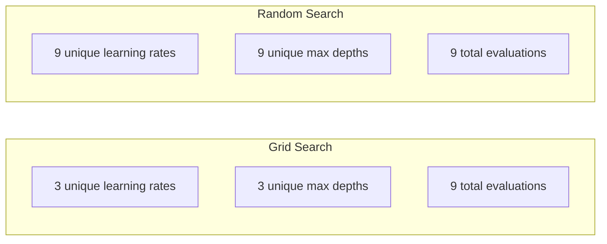
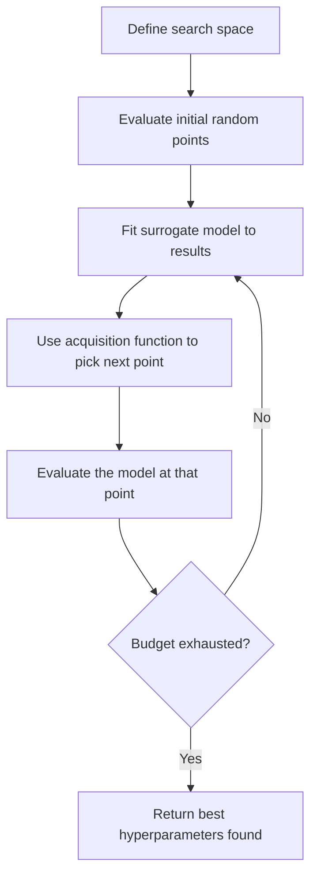
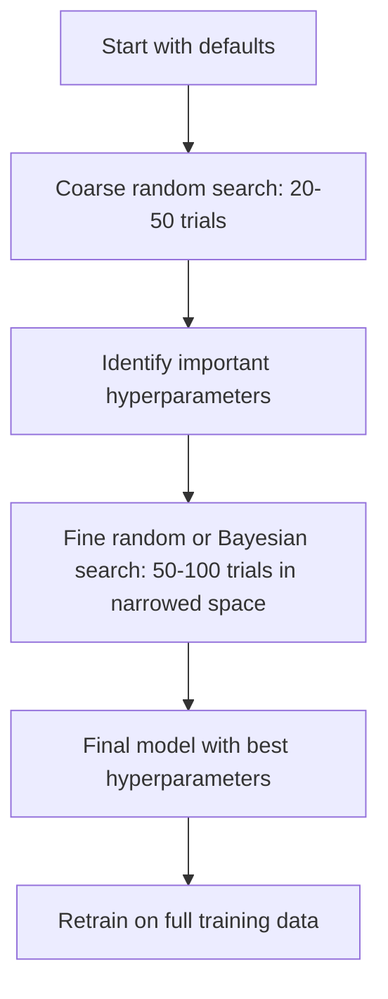
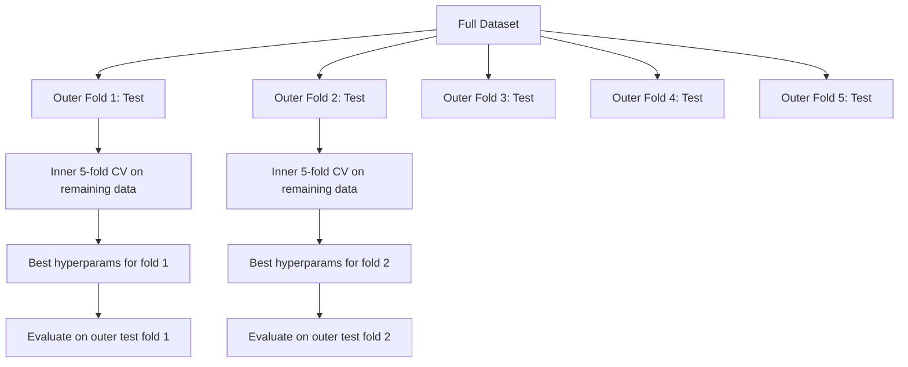

# Hyperparameter Tuning

> المعلمات الفائقة هي المقابض التي تديرها قبل بدء التدريب. إن تحويلها جيدًا هو الفرق بين النموذج المتوسط ​​والنموذج الرائع.

**النوع:** بناء
** اللغة: ** بايثون
**المتطلبات الأساسية:** المرحلة الثانية، الدرس 11 (طرق التجميع)
**الوقت:** ~90 دقيقة

## Learning Objectives

- تنفيذ بحث الشبكة والبحث العشوائي والتحسين الافتراضي من البداية ومقارنة كفاءة العينة
- اشرح لماذا يتفوق البحث العشوائي على بحث الشبكة عندما تكون معظم المعلمات الفائقة ذات أبعاد فعالة منخفضة
- بناء حلقة تحسين بايزي باستخدام نموذج بديل ووظيفة الاستحواذ لتوجيه البحث
- تصميم إستراتيجية ضبط المعلمات الفائقة التي تتجنب الإفراط في ضبط مجموعة التحقق من الصحة من خلال التحقق المتبادل المناسب

## The Problem

يحتوي نموذج تعزيز التدرج الخاص بك على معدل تعلم، وعدد الأشجار، والحد الأقصى للعمق، والحد الأدنى من العينات لكل ورقة، ونسبة العينة الفرعية، ونسبة عينة العمود. هذه ستة معلمات مفرطة. إذا كان لكل منها 5 قيم معقولة، فستحتوي الشبكة على 5^6 = 15,625 مجموعة. يستغرق التدريب 10 ثوانٍ. وهذا يعني 43 ساعة من الحوسبة لتجربتها جميعًا.

البحث على الشبكة هو النهج الواضح والأسوأ على نطاق واسع. البحث العشوائي يعمل بشكل أفضل مع حساب أقل. يعمل تحسين بايزي بشكل أفضل من خلال التعلم من التقييمات السابقة. إن معرفة الإستراتيجية التي يجب استخدامها، والمعلمات الفائقة المهمة بالفعل، يوفر أيامًا من GPU الوقت الضائع.

## The Concept

### Parameters vs Hyperparameters

يتم تعلم المعلمات أثناء التدريب (الأوزان، التحيزات، عتبات الانقسام). يتم تعيين المعلمات الفائقة قبل بدء التدريب والتحكم في كيفية حدوث التعلم.

| المعلمة المفرطة | ما يتحكم فيه | النطاق النموذجي |
|---------------|-----------------|--------------|
| معدل التعلم | حجم الخطوة لكل تحديث | 0.001 إلى 1.0 |
| عدد الأشجار/العصور | كم من الوقت للتدريب | 10 إلى 10,000 |
| أقصى عمق | تعقيد النموذج | من 1 إلى 30 |
| التسوية (لامدا) | منع الإفراط في التجهيز | 0.0001 إلى 100 |
| حجم الدفعة | ضجيج تقدير التدرج | من 16 إلى 512 |
| معدل التسرب | انخفض جزء من الخلايا العصبية | 0.0 إلى 0.5 |

### Grid Search

يقوم بحث الشبكة بتقييم كل مجموعة من القيم المحددة. إنها شاملة وسهلة الفهم، ولكنها تتوسع بشكل كبير مع عدد المعلمات الفائقة.

```
Grid for 2 hyperparameters:

  learning_rate: [0.01, 0.1, 1.0]
  max_depth:     [3, 5, 7]

  Evaluations: 3 x 3 = 9 combinations

  (0.01, 3)  (0.01, 5)  (0.01, 7)
  (0.1,  3)  (0.1,  5)  (0.1,  7)
  (1.0,  3)  (1.0,  5)  (1.0,  7)
```

البحث في الشبكة به عيب أساسي: إذا كان أحد المعلمات الفائقة مهمًا والآخر لا يهم، فإن معظم التقييمات تضيع. تحصل فقط على 3 قيم فريدة للمعلمة المهمة من 9 تقييمات.

### Random Search

عينات بحث عشوائية من المعلمات الفائقة من التوزيعات بدلاً من الشبكة. وبنفس الميزانية المكونة من 9 تقييمات، تحصل على 9 قيم فريدة لكل معلمة تشعبية.



لماذا شبكة النبضات العشوائية (Bergstra & Bengio، 2012):

- معظم المعلمات الفائقة لها أبعاد فعالة منخفضة. عادةً ما يكون 1-2 فقط من أصل 6 معلمات مفرطة مهمًا لمشكلة معينة.
- تقييمات نفايات البحث في الشبكة على أبعاد غير مهمة.
- البحث العشوائي يغطي الأبعاد المهمة بشكل أكثر كثافة لنفس الميزانية.
- في 60 تجربة عشوائية، لديك فرصة 95% للعثور على نقطة ضمن 5% من المستوى الأمثل (إذا كان موجودًا في مساحة البحث).

### Bayesian Optimization

البحث العشوائي يتجاهل النتائج. ولا يتعلم أن معدلات التعلم العالية تسبب الاختلاف أو أن العمق 3 يتفوق باستمرار على العمق 10. يستخدم تحسين بايزي التقييمات السابقة لتحديد مكان البحث التالي.



المكونان الرئيسيان:

**نموذج بديل:** نموذج رخيص التقييم (عادةً عملية غوسية) يقارب الدالة الهدف الباهظة الثمن. فهو يعطي كلا من التنبؤ وتقدير عدم اليقين في أي نقطة في مساحة البحث.

**وظيفة الاكتساب:** تقرر مكان التقييم التالي من خلال الموازنة بين الاستغلال (البحث بالقرب من النقاط الجيدة المعروفة) والاستكشاف (البحث في الأماكن التي ترتفع فيها درجة عدم اليقين). الاختيارات الشائعة:

- **التحسن المتوقع (EI):** ما مقدار التحسن الذي نتوقعه مقارنة بالأفضل الحالي في هذه المرحلة؟
- **حد الثقة العلوي (UCB):** التنبؤ بالإضافة إلى مضاعفات عدم اليقين. الأعلى UCB يعني إما واعد أو غير مستكشف.
- **احتمال التحسين (PI):** ما هو احتمال أن تتفوق هذه النقطة على الأفضل الحالي؟

يجد تحسين بايزي عادةً معلمات تشعبية أفضل من البحث العشوائي مع تقييمات أقل بمقدار 2-5 مرات. إن النفقات العامة لتركيب النموذج البديل لا تذكر مقارنة بتدريب النموذج الفعلي.

### Early Stopping

ليس كل جولة تدريبية تحتاج إلى الانتهاء. إذا كان التكوين سيئًا بشكل واضح بعد 10 فترات، فقم بإيقافه والمضي قدمًا. يعد هذا توقفًا مبكرًا في سياق البحث عن المعلمات الفائقة.

الاستراتيجيات:
- **على أساس الصبر:** توقف إذا لم يتحسن فقدان التحقق من الصحة لمدة N متتالية
- **التقليم المتوسط:** توقف إذا كانت النتيجة المتوسطة للتجربة أسوأ من متوسط التجارب المكتملة في نفس الخطوة
- **النطاق الفائق:** خصص ميزانيات صغيرة للعديد من التهيئات، ثم قم بزيادة الميزانية تدريجيًا لأفضل التهيئات

النطاق الفائق فعال بشكل خاص. يبدأ 81 تكوينًا بفترة واحدة لكل منها، ويحتفظ بالثلث العلوي، ويمنحهم 3 فترات، ويحتفظ بالثلث العلوي، وهكذا. يؤدي هذا إلى العثور على تكوينات جيدة أسرع بمعدل 10 إلى 50 مرة من تقييم جميع التكوينات للميزانية الكاملة.

### Learning Rate Schedulers

يعد معدل التعلم دائمًا هو المعلم الفائق الأكثر أهمية. وبدلاً من إبقائها ثابتة، يقوم المجدولون بتعديلها أثناء التدريب.

| المجدول | صيغة | متى تستخدم |
|-----------|--------|-------------|
| خطوة الاضمحلال | اضرب بـ 0.1 كل N حقبة | تدريب كلاسيكي CNN |
| جيب التمام الصلب | lr * 0.5 * (1 + cos(pi * t / T)) | الافتراضي الحديث |
| الاحماء + الاضمحلال | الزيادة الخطية ثم اضمحلال جيب التمام | المحولات |
| دورة واحدة | تزيد ثم تنقص في دورة واحدة | التقارب السريع |
| تقليل على الهضبة | تقليل حسب العامل عند الأكشاك المترية | الافتراضي الآمن |

### Hyperparameter Importance

ليست كل المعلمات الفائقة ذات أهمية متساوية. تُظهر الأبحاث التي أجريت على الغابات العشوائية (Probst et al., 2019) وتعزيز التدرج أنماطًا متسقة:

**أهمية عالية:**
- معدل التعلم (دائما لحن أولا)
- عدد المقدرات / العصور (استخدم الإيقاف المبكر بدلاً من الضبط)
- قوة التنظيم

**أهمية متوسطة:**
- أقصى عمق / عدد الطبقات
- الحد الأدنى للعينات لكل ورقة / تسوس الوزن
- نسبة العينة الفرعية

**أهمية منخفضة:**
- ميزات ماكس (للغابات العشوائية)
- اختيار وظيفة التنشيط المحددة
- حجم الدفعة (ضمن نطاق معقول)

قم بضبط العناصر المهمة أولاً، واترك الباقي على الإعدادات الافتراضية.

### Practical Strategy



سير العمل الخرساني:

1. **ابدأ بالإعدادات الافتراضية للمكتبة.** يتم اختيارها من قبل ممارسين ذوي خبرة وغالبًا ما يتم قطع 80% من الطريق للوصول إليها.
2. **بحث عشوائي خشن.** نطاقات واسعة، 20-50 تجربة. استخدم التوقف المبكر لقتل الركض السيئ بسرعة.
3. **تحليل النتائج.** ما هي المعلمات الفائقة المرتبطة بالأداء؟ تضييق مساحة البحث.
4. ** بحث جيد. ** تحسين بايزي أو بحث عشوائي مركّز في المساحة الضيقة. 50-100 تجربة.
5. **أعد التدريب على جميع بيانات التدريب** باستخدام أفضل المعلمات الفائقة التي تم العثور عليها.

### Cross-Validation Integration

يعد ضبط المعلمات الفائقة على تقسيم التحقق الفردي أمرًا محفوفًا بالمخاطر. قد تتناسب أفضل المعلمات الفائقة مع طية التحقق المحددة. التحقق المتبادل المتداخل يحل هذه المشكلة باستخدام حلقتين:

- **الحلقة الخارجية** (التقييم): تقسم البيانات إلى قطار+فال واختبار. تقارير الأداء غير متحيز.
- **الحلقة الداخلية** (الضبط): تقسم القطار+فال إلى قطار وفال. يجد أفضل المعلمات الفائقة.



تجد كل طية خارجية أفضل المعلمات الفائقة الخاصة بها بشكل مستقل. الدرجات الخارجية هي تقدير غير متحيز لأداء التعميم.

مع سكليرن:

```python
from sklearn.model_selection import cross_val_score, GridSearchCV
from sklearn.ensemble import GradientBoostingRegressor

inner_cv = GridSearchCV(
    GradientBoostingRegressor(),
    param_grid={
        "learning_rate": [0.01, 0.05, 0.1],
        "max_depth": [2, 3, 5],
        "n_estimators": [50, 100, 200],
    },
    cv=5,
    scoring="neg_mean_squared_error",
)

outer_scores = cross_val_score(
    inner_cv, X, y, cv=5, scoring="neg_mean_squared_error"
)

print(f"Nested CV MSE: {-outer_scores.mean():.4f} +/- {outer_scores.std():.4f}")
```

يعد هذا مكلفًا (5 طيات خارجية × 5 طيات داخلية × 27 نقطة شبكة = 675 نموذجًا مناسبًا)، ولكنه يمنحك تقديرًا موثوقًا للأداء. استخدمه عند الإبلاغ عن النتائج النهائية في الأوراق أو عندما تكون أهمية القرار عالية.

### Practical Tips

**ابدأ بمعدل التعلم.** إنه دائمًا المعلمة الفائقة الأكثر أهمية للطرق القائمة على التدرج. معدل التعلم السيئ make كل شيء آخر غير ذي صلة. قم بإصلاح المعلمات الفائقة الأخرى في الإعدادات الافتراضية واكتسح معدل التعلم أولاً.

** استخدم توزيعات السجل الموحدة لمعدل التعلم والتنظيم. ** الفرق بين 0.001 و 0.01 مهم بقدر الفرق بين 0.1 و 1.0. البحث الخطي يهدر الميزانية على النهاية الكبيرة.

**استخدم الإيقاف المبكر بدلاً من ضبط n_estimators.** لتعزيز الشبكات العصبية، قم بتعيين n_estimators أو epochs على قيمة عالية ودع الإيقاف المبكر يقرر متى يتوقف. يؤدي هذا إلى إزالة معلمة تشعبية واحدة من البحث.

**تخصيص الميزانية.** أنفق 60% من ميزانية الضبط الخاصة بك على أهم معلمتين فائقتين. أنفق الـ 40% المتبقية على كل شيء آخر. يمثل أعلى 2 معظم تباين الأداء.

**المقياس مهم.** لا تبحث مطلقًا عن حجم الدفعة على مقياس سجل (16، 32، 64 جيدة). ابحث دائمًا عن معدل التعلم على مقياس سجل. قم بمطابقة توزيع البحث مع كيفية تأثير المعلمة الفائقة على النموذج.

| نوع الموديل | أعلى المعلمات الفائقة | بحث مقترح | الميزانية |
|-----------|------------------------------------|----|--------|
| غابة عشوائية | n_estimators، max_deepth، min_samples_leaf | بحث عشوائي، 50 تجربة | منخفض (التدريب السريع) |
| تعزيز التدرج | معدل التعلم، n_estimators، max_deep | بايزي، 100 تجربة + التوقف المبكر | متوسطة |
| الشبكة العصبية | معدل التعلم، تسوس_الوزن، حجم_الدفعة | بايزي أو عشوائي، أكثر من 100 تجربة | عالي (التدريب البطيء) |
| SVM | ج، جاما (RBF النواة) | الشبكة على مقياس السجل، 25-50 تجربة | منخفض (2 بارامترات) |
| لاسو/ريدج | ألفا | بحث أحادي الأبعاد على مقياس السجل، 20 تجربة | منخفض جدًا |
| اكس جي بوست | معدل التعلم، الحد الأقصى للعمق، العينة الفرعية، العينة النمطية | بايزي، 100-200 تجربة + التوقف المبكر | متوسطة |

**عند الشك:** بحث عشوائي باستخدام ضعف عدد المعلمات الفائقة كتجارب (على سبيل المثال، 6 معلمات مفرطة = أكثر من 12 تجربة كحد أدنى). سوف تتفاجأ بعدد المرات التي يتفوق فيها البحث العشوائي باستخدام 50 تجربة على البحث الشبكي المصمم بعناية.

## Build It

### Step 1: Grid Search from Scratch

ينفذ الكود الموجود في `code/tuning.py` بحث الشبكة والبحث العشوائي ومُحسِّن Bayesian البسيط من البداية.

```python
def grid_search(model_fn, param_grid, X_train, y_train, X_val, y_val):
    keys = list(param_grid.keys())
    values = list(param_grid.values())
    best_score = -float("inf")
    best_params = None
    n_evals = 0

    for combo in itertools.product(*values):
        params = dict(zip(keys, combo))
        model = model_fn(**params)
        model.fit(X_train, y_train)
        score = evaluate(model, X_val, y_val)
        n_evals += 1

        if score > best_score:
            best_score = score
            best_params = params

    return best_params, best_score, n_evals
```

### Step 2: Random Search from Scratch

```python
def random_search(model_fn, param_distributions, X_train, y_train,
                  X_val, y_val, n_iter=50, seed=42):
    rng = np.random.RandomState(seed)
    best_score = -float("inf")
    best_params = None

    for _ in range(n_iter):
        params = {k: sample(v, rng) for k, v in param_distributions.items()}
        model = model_fn(**params)
        model.fit(X_train, y_train)
        score = evaluate(model, X_val, y_val)

        if score > best_score:
            best_score = score
            best_params = params

    return best_params, best_score, n_iter
```

### Step 3: Bayesian Optimization (Simplified)

الفكرة الأساسية: ملاءمة عملية غاوسية للأزواج المرصودة (المعلمة الفائقة، والنتيجة)، ثم استخدام دالة الاستحواذ لتحديد المكان الذي يجب البحث فيه بعد ذلك.

```python
class SimpleBayesianOptimizer:
    def __init__(self, search_space, n_initial=5):
        self.search_space = search_space
        self.n_initial = n_initial
        self.X_observed = []
        self.y_observed = []

    def _kernel(self, x1, x2, length_scale=1.0):
        dists = np.sum((x1[:, None, :] - x2[None, :, :]) ** 2, axis=2)
        return np.exp(-0.5 * dists / length_scale ** 2)

    def _fit_gp(self, X_new):
        X_obs = np.array(self.X_observed)
        y_obs = np.array(self.y_observed)
        y_mean = y_obs.mean()
        y_centered = y_obs - y_mean

        K = self._kernel(X_obs, X_obs) + 1e-4 * np.eye(len(X_obs))
        K_star = self._kernel(X_new, X_obs)

        L = np.linalg.cholesky(K)
        alpha = np.linalg.solve(L.T, np.linalg.solve(L, y_centered))
        mu = K_star @ alpha + y_mean

        v = np.linalg.solve(L, K_star.T)
        var = 1.0 - np.sum(v ** 2, axis=0)
        var = np.maximum(var, 1e-6)

        return mu, var

    def _expected_improvement(self, mu, var, best_y):
        sigma = np.sqrt(var)
        z = (mu - best_y) / (sigma + 1e-10)
        ei = sigma * (z * norm_cdf(z) + norm_pdf(z))
        return ei

    def suggest(self):
        if len(self.X_observed) < self.n_initial:
            return sample_random(self.search_space)

        candidates = [sample_random(self.search_space) for _ in range(500)]
        X_cand = np.array([to_vector(c) for c in candidates])
        mu, var = self._fit_gp(X_cand)
        ei = self._expected_improvement(mu, var, max(self.y_observed))
        return candidates[np.argmax(ei)]

    def observe(self, params, score):
        self.X_observed.append(to_vector(params))
        self.y_observed.append(score)
```

يعطي البديل GP شيئين عند كل نقطة مرشح: النتيجة المتوقعة (mu) وعدم اليقين (var). يوازن التحسين المتوقع بين هذه العناصر: فهو يفضل النقاط التي يتنبأ فيها النموذج بدرجات عالية OR حيث يكون عدم اليقين مرتفعًا. في وقت مبكر، كانت معظم النقاط بها قدر كبير من عدم اليقين، لذلك قام المحسن بالاستكشاف. وفي وقت لاحق، يتم التركيز على المنطقة الواعدة.

### Step 4: Compare All Methods

قم بتشغيل الطرق الثلاث على نفس الهدف الاصطناعي وقارن بينها. تستخدم هذه المقارنة غلافًا مبسطًا يستدعي كل مُحسِّن بوظيفة موضوعية مباشرة (بدون تدريب على النموذج)، لذا فإن API يختلف عن التطبيقات القائمة على النموذج أعلاه:

```python
def synthetic_objective(params):
    lr = params["learning_rate"]
    depth = params["max_depth"]
    return -(np.log10(lr) + 2) ** 2 - (depth - 4) ** 2 + 10

param_grid = {
    "learning_rate": [0.001, 0.01, 0.1, 1.0],
    "max_depth": [2, 3, 4, 5, 6, 7, 8],
}

grid_best = None
grid_score = -float("inf")
grid_history = []
for combo in itertools.product(*param_grid.values()):
    params = dict(zip(param_grid.keys(), combo))
    score = synthetic_objective(params)
    grid_history.append((params, score))
    if score > grid_score:
        grid_score = score
        grid_best = params

param_dist = {
    "learning_rate": ("log_float", 0.001, 1.0),
    "max_depth": ("int", 2, 8),
}

rand_best = None
rand_score = -float("inf")
rand_history = []
rng = np.random.RandomState(42)
for _ in range(28):
    params = {k: sample(v, rng) for k, v in param_dist.items()}
    score = synthetic_objective(params)
    rand_history.append((params, score))
    if score > rand_score:
        rand_score = score
        rand_best = params

optimizer = SimpleBayesianOptimizer(param_dist, n_initial=5)
bayes_history = []
for _ in range(28):
    params = optimizer.suggest()
    score = synthetic_objective(params)
    optimizer.observe(params, score)
    bayes_history.append((params, score))
bayes_score = max(s for _, s in bayes_history)

print(f"{'Method':<20} {'Best Score':>12} {'Evaluations':>12}")
print("-" * 50)
print(f"{'Grid Search':<20} {grid_score:>12.4f} {len(grid_history):>12}")
print(f"{'Random Search':<20} {rand_score:>12.4f} {len(rand_history):>12}")
print(f"{'Bayesian Opt':<20} {bayes_score:>12.4f} {len(bayes_history):>12}")
```

باستخدام نفس الميزانية، عادةً ما يجد تحسين بايزي أفضل نتيجة بشكل أسرع لأنه لا يضيع التقييمات في المناطق السيئة بشكل واضح. يغطي البحث العشوائي مساحة أكبر من بحث الشبكة. لا يفوز بحث الشبكة إلا عندما يكون لديك عدد قليل جدًا من المعلمات الفائقة ويمكنك أن تكون شاملاً.

## Use It

### Optuna in Practice

Optuna هي المكتبة الموصى بها لضبط المعلمات الفائقة. وهو يدعم التقليم والبحث الموزع والتصور خارج الصندوق.

```python
import optuna

def objective(trial):
    lr = trial.suggest_float("learning_rate", 1e-4, 1e-1, log=True)
    n_est = trial.suggest_int("n_estimators", 50, 500)
    max_depth = trial.suggest_int("max_depth", 2, 10)

    model = GradientBoostingRegressor(
        learning_rate=lr,
        n_estimators=n_est,
        max_depth=max_depth,
    )
    model.fit(X_train, y_train)
    return mean_squared_error(y_val, model.predict(X_val))

study = optuna.create_study(direction="minimize")
study.optimize(objective, n_trials=100)

print(f"Best params: {study.best_params}")
print(f"Best MSE: {study.best_value:.4f}")
```

ميزات أوبتونا الرئيسية:
- `suggest_float(..., log=True)` للمعلمات التي يتم البحث عنها بشكل أفضل على مقياس السجل (معدل التعلم، والتنظيم)
- `suggest_int` للمعلمات الصحيحة
- `suggest_categorical` للاختيارات المنفصلة
- MedianPruner مدمج للإيقاف المبكر للتجارب السيئة
- `study.trials_dataframe()` للتحليل

### Optuna with Pruning

يؤدي التقليم إلى إيقاف التجارب غير الواعدة مبكرًا، مما يوفر عمليات حسابية هائلة. هنا هو النمط:

```python
import optuna
from sklearn.model_selection import cross_val_score

def objective(trial):
    params = {
        "learning_rate": trial.suggest_float("lr", 1e-4, 0.5, log=True),
        "max_depth": trial.suggest_int("max_depth", 2, 10),
        "n_estimators": trial.suggest_int("n_estimators", 50, 500),
        "subsample": trial.suggest_float("subsample", 0.5, 1.0),
    }

    model = GradientBoostingRegressor(**params)
    scores = cross_val_score(model, X_train, y_train, cv=3,
                             scoring="neg_mean_squared_error")
    mean_score = -scores.mean()

    trial.report(mean_score, step=0)
    if trial.should_prune():
        raise optuna.TrialPruned()

    return mean_score

pruner = optuna.pruners.MedianPruner(n_startup_trials=10, n_warmup_steps=5)
study = optuna.create_study(direction="minimize", pruner=pruner)
study.optimize(objective, n_trials=200)
```

يقوم `MedianPruner` بإيقاف التجربة إذا كانت قيمتها المتوسطة أسوأ من متوسط ​​جميع التجارب المكتملة في نفس الخطوة. يتطلب التقليم الاتصال بـ `trial.report()` للإبلاغ عن المقاييس المتوسطة و `trial.should_prune()` للتحقق مما إذا كان يجب إيقاف التجربة أم لا. يضمن `n_startup_trials=10` إكمال 10 تجارب على الأقل بشكل كامل قبل بدء التنقيح. وهذا عادةً ما يوفر 40-60% من إجمالي الحوسبة.

### sklearn's Built-in Tuners

لإجراء تجارب سريعة، يوفر sklearn `GridSearchCV`، `RandomizedSearchCV`، و `HalvingRandomSearchCV`:

```python
from sklearn.model_selection import RandomizedSearchCV
from scipy.stats import loguniform, randint

param_dist = {
    "learning_rate": loguniform(1e-4, 0.5),
    "max_depth": randint(2, 10),
    "n_estimators": randint(50, 500),
}

search = RandomizedSearchCV(
    GradientBoostingRegressor(),
    param_dist,
    n_iter=100,
    cv=5,
    scoring="neg_mean_squared_error",
    random_state=42,
    n_jobs=-1,
)
search.fit(X_train, y_train)
print(f"Best params: {search.best_params_}")
print(f"Best CV MSE: {-search.best_score_:.4f}")
```

استخدم `loguniform` من scipy لمعدل التعلم والتنظيم. استخدم `randint` للمعلمات الفائقة للعدد الصحيح. العلم `n_jobs=-1` يتوازي مع جميع النوى CPU.

### Common Mistakes in Hyperparameter Tuning

**تسرب البيانات من خلال المعالجة المسبقة.** إذا قمت بتركيب مقياس على مجموعة البيانات الكاملة قبل التحقق المتبادل، فإن المعلومات من طبقة التحقق تتسرب إلى التدريب. قم دائمًا بوضع المعالجة المسبقة داخل `Pipeline` بحيث تكون مناسبة فقط في حظيرة التدريب.

** التجاوز في مجموعة التحقق من الصحة. ** يؤدي تشغيل آلاف التجارب إلى التدريب الفعال على مجموعة التحقق من الصحة. استخدم التحقق المتبادل المتداخل لتقديرات الأداء النهائية، أو قم بإجراء مجموعة اختبار منفصلة لا تلمسها أبدًا أثناء الضبط.

**البحث في نطاق ضيق جدًا.** إذا كانت أفضل قيمة لديك تقع على حدود مساحة البحث الخاصة بك، فهذا يعني أنك لم تقم بالبحث على نطاق واسع بما فيه الكفاية. قد تكون القيمة المثالية خارج نطاقك. تحقق دائمًا مما إذا كانت أفضل المعلمات موجودة عند الحواف.

**تجاهل تأثيرات التفاعل.** يتفاعل معدل التعلم وعدد المقدرين بقوة في التعزيز. يحتاج معدل التعلم المنخفض إلى المزيد من المقدرين. ضبطها بشكل مستقل يعطي نتائج أسوأ من ضبطها معًا.

**عدم استخدام الإيقاف المبكر للنماذج التكرارية.** بالنسبة لتعزيز التدرج والشبكات العصبية، قم بتعيين n_estimators أو العصور إلى قيمة عالية واستخدم الإيقاف المبكر. وهذا أفضل تمامًا من ضبط عدد التكرارات كمعلمة تشعبية.

## Exercises

1. قم بإجراء بحث الشبكة والبحث العشوائي بنفس الميزانية الإجمالية (على سبيل المثال، 50 تقييمًا). قارن أفضل الدرجات التي تم العثور عليها. قم بإجراء التجربة 10 مرات ببذور مختلفة. كم مرة يفوز البحث العشوائي؟

2. تنفيذ النطاق الفائق من الصفر. ابدأ بـ 81 تكوينًا، تم تدريب كل منها لعصر واحد. احتفظ بالثلث الأعلى في كل جولة وضاعف ميزانيتهم ​​ثلاث مرات. قارن إجمالي الحوسبة (مجموع كل العصور عبر جميع التكوينات) بتشغيل 81 تكوينًا للميزانية الكاملة.

3. قم بإضافة جدولة معدل التعلم (تصلب جيب التمام) إلى تنفيذ تعزيز التدرج من الدرس 11. هل يساعد ذلك مقارنة بمعدل التعلم الثابت؟

4. استخدم Optuna لضبط RandomForestClassifier على مجموعة بيانات حقيقية (على سبيل المثال، مجموعة بيانات سرطان الثدي الخاصة بـ sklearn). استخدم `optuna.visualization.plot_param_importances(study)` لمعرفة المعلمات الفائقة الأكثر أهمية. هل يتوافق مع تصنيف الأهمية من هذا الدرس؟

5. تنفيذ وظيفة اكتساب بسيطة (التحسين المتوقع) وإظهار الاستكشاف مقابل الاستغلال. ارسم المتوسط ​​وعدم اليقين للنموذج البديل، وأظهر أين يختار EI التقييم التالي.

## Key Terms

| مصطلح | ماذا يقول الناس | ماذا يعني في الواقع |
|------|----------------|----------------------|
| المعلمة المفرطة | "الإعداد الذي تختاره" | قيمة يتم تحديدها قبل التدريب وتتحكم في عملية التعلم، ولا يتم تعلمها من البيانات |
| بحث الشبكة | "جرب كل مجموعة" | بحث شامل عبر شبكة معلمة محددة. التكلفة الأسية. |
| بحث عشوائي | "فقط عينة عشوائية" | عينة من المعلمات الفائقة من التوزيعات. يغطي الأبعاد المهمة بشكل أفضل من البحث على الشبكة. |
| التحسين بايزي | "البحث الذكي" | يستخدم نموذجًا بديلًا للهدف لتحديد مكان التقييم التالي، مع الموازنة بين الاستكشاف والاستغلال |
| نموذج بديل | "تقريب رخيص" | نموذج (عادةً عملية غاوسية) يقارب الدالة الهدف الباهظة الثمن من التقييمات المرصودة |
| وظيفة الاستحواذ | "أين ننظر بعد ذلك" | يسجل نقاط المرشح من خلال موازنة التحسن المتوقع مع عدم اليقين. EI و UCB من الخيارات الشائعة. |
| التوقف المبكر | "توقف عن إضاعة الوقت" | قم بإنهاء التدريب مبكرًا عندما يتوقف أداء التحقق من الصحة عن التحسن |
| النطاق الفائق | "شريحة البطولة للتكوينات" | تخصيص الموارد التكيفي: ابدأ العديد من التكوينات بميزانيات صغيرة، واحتفظ بالأفضل وقم بزيادة ميزانياتها |
| جدولة معدل التعلم | "تغيير lr أثناء التدريب" | وظيفة تعمل على ضبط معدل التعلم على مدار التدريب من أجل تقارب أفضل |

## Further Reading

- [Bergstra & Bengio: Random Search for Hyper-Parameter Optimization (2012)](https://jmlr.org/papers/v13/bergstra12a.html) -- the paper that showed random beats grid
- [Snoek et al., Practical Bayesian Optimization of Machine Learning Algorithms (2012)](https://arxiv.org/abs/1206.2944) -- تحسين بايزي لـ ML
- [Li et al., Hyperband: A Novel Bandit-Based Approach (2018)](https://jmlr.org/papers/v18/16-558.html) -- the Hyperband paper
- [Optuna: A Next-generation Hyperparameter Optimization Framework](https://arxiv.org/abs/1907.10902) -- the Optuna paper
- [Probst et al., Tunability: Importance of Hyperparameters (2019)](https://jmlr.org/papers/v20/18-444.html) -- ما هي المعلمات الفائقة المهمة
