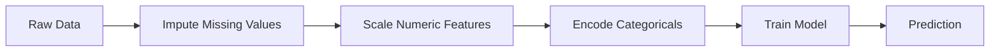
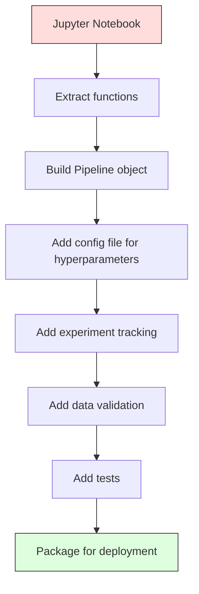

# ML Pipelines

> النموذج ليس منتجًا. pipالخط هو. يمثل الخط pip كل شيء بدءًا من البيانات الأولية وحتى التنبؤ المنشور، ويجب أن تكون كل خطوة قابلة للتكرار.

**النوع:** بناء
** اللغة: ** بايثون
**المتطلبات الأساسية:** المرحلة الثانية، الدرس 12 (ضبط المعلمة الفائقة)
**الوقت:** ~120 دقيقة

## Learning Objectives

- قم ببناء خط ML pipeline من الصفر والذي يربط التضمين والقياس والتشفير والتدريب النموذجي في كائن واحد قابل للتكرار
- تحديد سيناريوهات تسرب البيانات وشرح كيفية منعها pipالخطوط عن طريق تركيب المحولات فقط على بيانات التدريب
- إنشاء محول عمود يطبق معالجة مسبقة مختلفة على الميزات الرقمية والفئوية
- تنفيذ تسلسل pipeline وإثبات أن نفس pipeline المجهز ينتج نتائج متطابقة في التدريب والإنتاج

## The Problem

لديك دفتر ملاحظات يقوم بتحميل البيانات، وملء القيم المفقودة بالوسيط، وقياس الميزات، وتدريب النموذج، وطباعة الدقة. إنها تعمل. أنت تشحنه.

وبعد مرور شهر، يقوم شخص ما بإعادة تدريب النموذج ويحصل على نتائج مختلفة. تم حساب الوسيط على مجموعة البيانات الكاملة بما في ذلك بيانات الاختبار (تسرب البيانات). لم يتم حفظ معلمات القياس، لذا يستخدم الاستدلال إحصائيات مختلفة. تم نسخ رمز هندسة الميزات بين التدريب والتقديم، وتباعدت النسخ. اكتسب العمود القاطع قيمة جديدة في الإنتاج لم يشهدها المشفر من قبل.

هذه ليست افتراضية. وهي الأسباب الأكثر شيوعًا لفشل أنظمة ML في الإنتاج. تحل خطوط الأنابيب كل هذه المشكلات عن طريق تجميع كل خطوة تحويل في كائن واحد مرتب وقابل للتكرار.

## The Concept

### What a Pipeline Is

الخط pipeline هو تسلسل مرتب لتحويلات البيانات متبوعًا بالنموذج. تأخذ كل خطوة مخرجات الخطوة السابقة كمدخل. يتم تركيب الخط pip بأكمله مرة واحدة على بيانات التدريب. في وقت الاستدلال، يقوم نفس الخط pipe المجهز بتحويل البيانات الجديدة وينتج تنبؤات.



يضمن pipeline:
- يتم تركيب التحويلات فقط على بيانات التدريب (بدون تسرب)
- يتم تطبيق نفس التحولات في وقت الاستدلال
- يمكن إجراء تسلسل للكائن بأكمله ونشره كقطعة أثرية واحدة
- يطبق التحقق المتقاطع خط pip لكل طية، مما يمنع التسرب الدقيق

### Data Leakage: The Silent Killer

يحدث تسرب البيانات عندما تلوث المعلومات الواردة من مجموعة الاختبار أو البيانات المستقبلية التدريب. تمنع خطوط الأنابيب الأشكال الأكثر شيوعًا.

**متسرب (خطأ):**
```python
X = df.drop("target", axis=1)
y = df["target"]

scaler = StandardScaler()
X_scaled = scaler.fit_transform(X)

X_train, X_test = X_scaled[:800], X_scaled[800:]
y_train, y_test = y[:800], y[800:]
```

رأى المتسلق بيانات الاختبار. يشمل المتوسط ​​والانحراف المعياري عينات الاختبار. وهذا يؤدي إلى تضخيم تقديرات الدقة.

**Correct:**
```python
X_train, X_test = X[:800], X[800:]

scaler = StandardScaler()
X_train_scaled = scaler.fit_transform(X_train)
X_test_scaled = scaler.transform(X_test)
```

مع pipeline، لا تحتاج إلى التفكير في هذا الأمر. يتعامل الخط pipeline معه تلقائيًا.

### sklearn Pipeline

سلاسل `Pipeline` محولات sklearn ومقدر. يعرض `.fit()`، `.predict()`، و`.score()` التي تطبق جميع الخطوات بالترتيب.

```python
from sklearn.pipeline import Pipeline
from sklearn.preprocessing import StandardScaler
from sklearn.linear_model import LogisticRegression

pipe = Pipeline([
    ("scaler", StandardScaler()),
    ("model", LogisticRegression()),
])

pipe.fit(X_train, y_train)
predictions = pipe.predict(X_test)
```

عندما تتصل بـ `pipee.fit(X_train, y_train)`:
1. يستدعي المتسلق `fit_transform` على X_train
2. يستدعي النموذج `fit` على قطار X_train المقياس

عندما تتصل بـ `pipee.predict(X_test)`:
1. يستدعي المقياس `transform` (غير مناسب_تحويل) على X_test
2. يستدعي النموذج `predict` في اختبار X_test

لا يرى المتسلق أبدًا بيانات الاختبار أثناء التركيب. هذا هو بيت القصيد.

### ColumnTransformer: Different Pipelines for Different Columns

تحتوي مجموعات البيانات الحقيقية على أعمدة رقمية وفئوية تحتاج إلى معالجة مسبقة مختلفة. `ColumnTransformer` يتعامل مع هذا.

```python
from sklearn.compose import ColumnTransformer
from sklearn.preprocessing import StandardScaler, OneHotEncoder
from sklearn.impute import SimpleImputer

numeric_pipe = Pipeline([
    ("impute", SimpleImputer(strategy="median")),
    ("scale", StandardScaler()),
])

categorical_pipe = Pipeline([
    ("impute", SimpleImputer(strategy="most_frequent")),
    ("encode", OneHotEncoder(handle_unknown="ignore")),
])

preprocessor = ColumnTransformer([
    ("num", numeric_pipe, ["age", "income", "score"]),
    ("cat", categorical_pipe, ["city", "gender", "plan"]),
])

full_pipeline = Pipeline([
    ("preprocess", preprocessor),
    ("model", GradientBoostingClassifier()),
])
```

يعد `handle_unknown="ignore"` في OneHotEncoder أمرًا بالغ الأهمية للإنتاج. عندما تظهر فئة جديدة (مدينة لم يشاهدها النموذج من قبل)، فإنها تنتج متجهًا صفريًا بدلاً من التعطل.

### Experiment Tracking

تدريب pipeline make قابل للتكرار، ولكنك تحتاج أيضًا إلى تتبع ما حدث عبر التجارب: ما هي المعلمات الفائقة التي تم استخدامها، وإصدار مجموعة البيانات، وما هي المقاييس، وما هو الكود الذي تم تشغيله.

**MLflow** هو الحل مفتوح المصدر الأكثر شيوعًا:

```python
import mlflow

with mlflow.start_run():
    mlflow.log_param("max_depth", 5)
    mlflow.log_param("n_estimators", 100)
    mlflow.log_param("learning_rate", 0.1)

    pipe.fit(X_train, y_train)
    accuracy = pipe.score(X_test, y_test)

    mlflow.log_metric("accuracy", accuracy)
    mlflow.sklearn.log_model(pipe, "model")
```

يتم تسجيل كل تشغيل باستخدام المعلمات والمقاييس والعناصر والنموذج الكامل. يمكنك مقارنة عمليات التشغيل وإعادة إنتاج أي تجربة ونشر أي إصدار نموذجي.

**الأوزان والتحيزات (wandb)** توفر نفس الوظيفة مع لوحة تحكم مستضافة:

```python
import wandb

wandb.init(project="my-pipeline")
wandb.config.update({"max_depth": 5, "n_estimators": 100})

pipe.fit(X_train, y_train)
accuracy = pipe.score(X_test, y_test)

wandb.log({"accuracy": accuracy})
```

### Model Versioning

بعد تتبع التجربة، تحتاج إلى إدارة إصدارات النموذج. ما هو النموذج في الإنتاج؟ وهو التدريج؟ الذي كان الأسبوع الماضي؟

يوفر سجل نموذج MLflow ما يلي:
- **تتبع الإصدار:** يحصل كل نموذج محفوظ على رقم إصدار
- **انتقالات المرحلة:** "التدريج"، "الإنتاج"، "المؤرشفة"
- **سير عمل الموافقة:** يجب ترقية النماذج بشكل صريح إلى مرحلة الإنتاج
- **التراجع:** العودة إلى الإصدار السابق على الفور

### Data Versioning with DVC

تم إصدار الكود بـ git. يجب أن يتم إصدار البيانات أيضًا، لكن git لا يمكنه التعامل مع الملفات الكبيرة. DVC (التحكم في إصدار البيانات) يحل هذه المشكلة.

```
dvc init
dvc add data/training.csv
git add data/training.csv.dvc data/.gitignore
git commit -m "Track training data"
dvc push
```

DVC يخزن البيانات الفعلية في وحدة التخزين البعيدة (S3، GCS، Azure) ويحتفظ بملف `.dvc` صغير في git يسجل التجزئة. عند الخروج من التزام git، `dvc checkout` يستعيد البيانات الدقيقة التي تم استخدامها.

وهذا يعني أن كل git يلتزم بتثبيت كل من الكود والبيانات. الاستنساخ الكامل.

### Reproducible Experiments

تتطلب التجربة القابلة للتكرار أربعة أشياء:

1. **البذور العشوائية الثابتة:** قم بتعيين البذور لـ numpy والعشوائية والإطار (الشعلة، sklearn)
2. **التبعيات المثبتة:** Requirements.txt أو Poetry.lock مع الإصدارات الدقيقة
3. **بيانات الإصدار:** DVC أو ما شابه
4. **ملفات التكوين:** جميع المعلمات الفائقة في التكوين، وليست مشفرة

```python
import numpy as np
import random

def set_seed(seed=42):
    random.seed(seed)
    np.random.seed(seed)
    try:
        import torch
        torch.manual_seed(seed)
        torch.cuda.manual_seed_all(seed)
        torch.backends.cudnn.deterministic = True
    except ImportError:
        pass
```

### From Notebook to Production Pipeline



التقدم النموذجي:

1. **استكشاف الكمبيوتر المحمول:** تجارب سريعة، وتصورات، وأفكار مميزة
2. **استخراج الوظائف:** نقل المعالجة المسبقة وهندسة الميزات والتقييم إلى وحدات
3. ** بناء خط الأنابيب: ** تحويلات السلسلة إلى خط أنابيب sklearn أو فئة مخصصة
4. **إدارة التكوين:** انقل جميع المعلمات الفائقة إلى التكوين YAML/JSON
5. ** تتبع التجربة: ** أضف تسجيل MLflow أو Wandb
6. **التحقق من صحة البيانات:** تحقق من المخطط والتوزيعات وأنماط القيمة المفقودة قبل التدريب
7. **الاختبارات:** اختبارات الوحدة للمحولات، اختبارات التكامل للخط pipالكامل
8. **النشر:** إجراء تسلسل للخط pip، لفه في API (سريعAPI، قارورة)، وضعه في حاوية

### Common Pipeline Mistakes

| خطأ | لماذا هو سيء | إصلاح |
|---------|------------|-----|
| تركيب البيانات الكاملة قبل التقسيم | تسرب البيانات | استخدم خط الأنابيب مع cross_val_score |
| ميزة الهندسة الخارجية pipeline | تحويلات مختلفة في القطار مقابل الخدمة | ضع كافة التحويلات في خط الأنابيب |
| عدم التعامل مع الفئات غير المعروفة | انهيار الإنتاج على القيم الجديدة | OneHotEncoder(handle_unknown="ignore") |
| أسماء الأعمدة المشفرة | فواصل عندما يتغير المخطط | استخدم قوائم أسماء الأعمدة من التكوين |
| لا يوجد التحقق من صحة البيانات | توقعات خاطئة بصمت بشأن البيانات السيئة | أضف عمليات فحص المخطط قبل التنبؤ |
| التدريب/الخدمة الانحراف | يرى النموذج ميزات مختلفة في المنتج | كائن خط أنابيب واحد لكلا |

## Build It

ينشئ الكود الموجود في `code/pipelineeline.py` خطًا كاملاً ML pipمن الصفر:

### Step 1: Custom Transformer

```python
class CustomTransformer:
    def __init__(self):
        self.means = None
        self.stds = None

    def fit(self, X):
        self.means = np.mean(X, axis=0)
        self.stds = np.std(X, axis=0)
        self.stds[self.stds == 0] = 1.0
        return self

    def transform(self, X):
        return (X - self.means) / self.stds

    def fit_transform(self, X):
        return self.fit(X).transform(X)
```

### Step 2: Pipeline from Scratch

```python
class PipelineFromScratch:
    def __init__(self, steps):
        self.steps = steps

    def fit(self, X, y=None):
        X_current = X.copy()
        for name, step in self.steps[:-1]:
            X_current = step.fit_transform(X_current)
        name, model = self.steps[-1]
        model.fit(X_current, y)
        return self

    def predict(self, X):
        X_current = X.copy()
        for name, step in self.steps[:-1]:
            X_current = step.transform(X_current)
        name, model = self.steps[-1]
        return model.predict(X_current)
```

### Step 3: Cross-Validation with Pipeline

يوضح الكود كيف أن التحقق المتبادل باستخدام خط pip يمنع تسرب البيانات: يتم تركيب المقياس بشكل منفصل على بيانات التدريب الخاصة بكل طية.

### Step 4: Full Production Pipeline with sklearn

خط pip كامل مع `ColumnTransformer`، ومسارات معالجة مسبقة متعددة، ونموذج، تم تدريبه من خلال التحقق المتقاطع المناسب وتسجيل التجربة.

## Ship It

ينتج هذا الدرس:
- `outputs/prompt-ml-pipelineeline.md` -- مهارة بناء وتصحيح الأخطاء ML pipelines
- `code/pipelineeline.py` -- خط pip كامل من الصفر حتى sklearn

## Exercises

1. أنشئ خطًا pip يتعامل مع مجموعة بيانات تحتوي على 3 أعمدة رقمية وعمودين فئويين. استخدم `ColumnTransformer` لتطبيق التضمين المتوسط ​​+ القياس على الأرقام والتضمين الأكثر تكرارًا + الترميز السريع الواحد على الفئات. تدريب مع التحقق من الصحة عبر 5 أضعاف.

2. تعمد إدخال تسرب البيانات: قم بتركيب المقياس على مجموعة البيانات الكاملة قبل التقسيم. قارن درجة التحقق المتبادل (المتسرب) بدرجة التحقق المتبادل pipeline (النظيفة). ما هو حجم الفرق؟

3. قم بإجراء تسلسل لخطك pipe باستخدام `joblib.dump`. قم بتحميله في برنامج نصي منفصل وقم بتشغيل التنبؤات. التحقق من تطابق التوقعات.

4. أضف محولًا مخصصًا إلى الخط pip الذي ينشئ ميزات متعددة الحدود (الدرجة 2) لأهم عمودين رقميين. أين يجب أن تذهب في pipeline؟

5. قم بإعداد تتبع MLflow للخط pipe. قم بإجراء 5 تجارب بمعلمات تشعبية مختلفة. استخدم MLflow UI (`mlflow ui`) لمقارنة عمليات التشغيل واختيار النموذج الأفضل.

## Key Terms

| مصطلح | ماذا يقول الناس | ماذا يعني في الواقع |
|------|----------------|----------------------|
| خط أنابيب | "سلسلة التحولات + النموذج" | تسلسل منظم للمحولات المجهزة ونموذج مطبق كوحدة واحدة لمنع التسرب |
| تسرب البيانات | "تسرب معلومات الاختبار إلى التدريب" | استخدام المعلومات من خارج مجموعة التدريب لبناء النموذج وتضخيم تقديرات الأداء |
| محول العمود | "معالجة مسبقة مختلفة لكل عمود" | يطبق خطوط pip مختلفة على مجموعات فرعية مختلفة من الأعمدة، ويجمع النتائج |
| تتبع التجربة | "تسجيل عمليات التشغيل الخاصة بك" | تسجيل المعلمات والمقاييس والنتائج وإصدارات التعليمات البرمجية لكل عملية تدريب |
| مل فلو | "تتبع النماذج ونشرها" | منصة مفتوحة المصدر لتتبع التجارب وتسجيل النماذج والنشر |
| DVC | "بوابة للبيانات" | نظام التحكم في الإصدار لملفات البيانات الكبيرة وتخزين التجزئة في git والبيانات في التخزين البعيد |
| التسجيل النموذجي | "كتالوج الإصدار النموذجي" | نظام يتتبع الإصدارات النموذجية بمسميات المرحلة (التدريج، الإنتاج، الأرشيف) |
| التدريب/الخدمة الانحراف | "نجحت في الدفتر" | الاختلافات بين كيفية معالجة البيانات أثناء التدريب مقابل الاستدلال، مما يسبب أخطاء صامتة |
| الاستنساخ | "نفس الكود، نفس النتيجة" | إمكانية الحصول على نتائج متطابقة من نفس الكود والبيانات والتكوين |

## Further Reading

- [scikit Pipeline docs](https://scikit-learn.org/stable/modules/compose.html) -- the official pipelineeline reference
- [MLflow documentation](https://mlflow.org/docs/latest/index.html) -- experiment tracking and model registry
- [DVC documentation](https://dvc.org/doc) -- data versioning
- [Sculley et al., Hidden Technical Debt in Machine Learning Systems (2015)](https://papers.nips.cc/paper/2015/hash/86df7dcfd896fcaf2674f757a2463eba-Abstract.html) -- الورقة البحثية حول تعقيد الأنظمة ML
- [جوجل ML أفضل الممارسات: قواعد ML](https://developers.google.com/machine-learning/guides/rules-of-ml) -- الإنتاج العملي ML نصيحة
