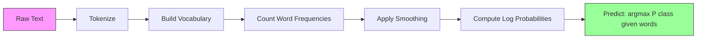

# Naive Bayes

> إن الافتراض "الساذج" خاطئ، وهو يعمل على أية حال. هذا هو جمال ذلك.

**النوع:** بناء
** اللغة: ** بايثون
**المتطلبات:** المرحلة الثانية، الدروس 01-07 (التصنيف، نظرية بايز)
**الوقت:** ~75 دقيقة

## Learning Objectives

- تنفيذ Multinomial Naive Bayes من البداية باستخدام تجانس لابلاس لتصنيف النص
- اشرح لماذا يعتبر افتراض الاستقلال الساذج خاطئًا من الناحية الرياضية ولكنه ينتج تصنيفًا صحيحًا للفصل في الممارسة العملية
- قارن بين متغيرات Multinomial وBernoulli وGaussian Naive Bayes وحدد الخيار المناسب لنوع ميزة معين
- تقييم Naive Bayes ضد الانحدار اللوجستي على البيانات المتفرقة عالية الأبعاد وشرح مقايضة التحيز والتباين في العمل

## The Problem

تحتاج إلى تصنيف النص. رسائل البريد الإلكتروني في البريد العشوائي أو غير البريد العشوائي. مراجعات العملاء إيجابية أو سلبية. تذاكر الدعم إلى فئات. لديك آلاف الميزات (واحدة لكل كلمة) وبيانات تدريب محدودة.

معظم المصنفات تختنق هنا. يحتاج الانحدار اللوجستي إلى عينات كافية لتقدير آلاف الأوزان بشكل موثوق. تنقسم أشجار القرار على كلمة واحدة في كل مرة وتتداخل بشكل كبير. KNN في 10000 بعد لا معنى له لأن كل نقطة بعيدة بنفس القدر عن كل نقطة أخرى.

يتعامل Naive Bayes مع هذا. إنه make افتراض خاطئ رياضيًا (أن كل ميزة مستقلة عن كل ميزة أخرى معطاة للفئة)، ولا تزال تتفوق على النماذج "الأكثر ذكاءً" في تصنيف النص، خاصة مع مجموعات التدريب الصغيرة. يتدرب في تمريرة واحدة من خلال البيانات. إنه يتسع لملايين الميزات. وتنتج تقديرات الاحتمالات (على الرغم من سوء معايرتها في كثير من الأحيان بسبب افتراض الاستقلال).

إن فهم لماذا يؤدي الافتراض الخاطئ إلى تنبؤات جيدة يعلمك شيئًا أساسيًا حول التعلم الآلي: أفضل نموذج ليس هو النموذج الأكثر صحة، بل هو النموذج الذي يحتوي على أفضل مقايضة تحيز وتباين لبياناتك.

## The Concept

### Bayes' Theorem (Quick Review)

تقلب نظرية بايز الاحتمالات الشرطية:

```
P(class | features) = P(features | class) * P(class) / P(features)
```

نريد `P(class | features)` - احتمال أن ينتمي المستند إلى فئة معينة بالنظر إلى الكلمات الموجودة فيه. يمكننا حساب ذلك من:
- `P(features | class)`-- احتمالية رؤية هذه الكلمات في وثائق هذا الفصل
- `P(class)` -- الاحتمالية السابقة للفئة (ما مدى شيوع البريد العشوائي بشكل عام؟)
- `P(features)` -- الأدلة واحدة عند جميع الفئات حتى نتجاهلها عند المقارنة

الفئة التي حصلت على أعلى `P(class | features)` من الانتصارات.

### The Naive Independence Assumption

تتطلب الحوسبة `P(features | class)` بالضبط تقدير الاحتمالية المشتركة لجميع الميزات معًا. مع مفردات مكونة من 10000 كلمة، ستحتاج إلى تقدير التوزيع لأكثر من 2^10000 مجموعة محتملة. مستحيل.

الافتراض الساذج: كل ميزة مستقلة بشكل مشروط بالنظر إلى الفئة.

```
P(w1, w2, ..., wn | class) = P(w1 | class) * P(w2 | class) * ... * P(wn | class)
```

بدلاً من التوزيع المشترك المستحيل، يمكنك تقدير عدد n من التوزيعات البسيطة لكل ميزة. كل واحد يحتاج فقط العد.

ومن الواضح أن هذا الافتراض خاطئ. الكلمتان "آلة" و"تعلم" ليستا مستقلتين في أي وثيقة. لكن المصنف لا يحتاج إلى تقديرات احتمالية صحيحة. إنها تحتاج إلى تصنيفات صحيحة - أي فئة لديها أعلى احتمالية. يقدم افتراض الاستقلال أخطاء منهجية، ولكن هذه الأخطاء تؤثر على جميع الفئات بشكل مماثل، لذلك يظل الترتيب صحيحًا.

### Why It Still Works

ثلاثة أسباب:

1. **الترتيب على المعايرة.** يحتاج التصنيف فقط إلى أن تكون الفئة ذات التصنيف الأعلى صحيحة. حتى لو كان P(spam) = 0.99999 عندما يكون الاحتمال الحقيقي 0.7، فسيظل المُصنف يختار البريد العشوائي بشكل صحيح. نحن لا نحتاج إلى الاحتمالات الصحيحة. نحن بحاجة إلى الفائز الصحيح.

2. **انحياز عالٍ، وتباين منخفض.** يعتبر افتراض الاستقلال بمثابة افتراض مسبق قوي. إنه يقيد النموذج بشكل كبير، مما يمنع التجهيز الزائد. مع بيانات التدريب المحدودة، فإن النموذج الذي يكون خاطئًا بعض الشيء ولكنه مستقر يتفوق على النموذج الصحيح من الناحية النظرية ولكنه غير مستقر إلى حد كبير. هذه هي مقايضة التحيز والتباين في العمل.

3. **يلغي تكرار الميزة. ** توفر الميزات المرتبطة أدلة متكررة. يحسب المصنف هذا الدليل مرتين، لكنه يحصيه مرتين للفئة الصحيحة أيضًا. إذا كانت "الآلة" و"التعلم" تظهران معًا دائمًا، فإن كلاهما يقدم دليلاً على فئة "التكنولوجيا". NB يحسبهم مرتين لكنه يحسبهم مرتين للصف المناسب.

السبب الرابع العملي: Naive Bayes سريع للغاية. التدريب عبارة عن تمريرة واحدة عبر ترددات عد البيانات. التنبؤ هو ضرب المصفوفة. يمكنك التدرب على مليون مستند في ثوانٍ. وتعني هذه السرعة أنه يمكنك التكرار بشكل أسرع، وتجربة المزيد من مجموعات الميزات، وإجراء المزيد من التجارب مقارنةً بالنماذج الأبطأ.

### The Math Step by Step

دعونا نتتبع من خلال مثال ملموس. لنفترض أن لدينا فئتين: البريد العشوائي وغير البريد العشوائي. تتكون مفرداتنا من ثلاث كلمات: "مجاني"، "مال"، "اجتماع".

بيانات التدريب:
- تشير رسائل البريد الإلكتروني العشوائية إلى "مجاني" 80 مرة، و"المال" 60 مرة، و"اجتماع" 10 مرات (إجمالي 150 كلمة)
- رسائل البريد الإلكتروني غير العشوائية تذكر كلمة "مجاني" 5 مرات، و"المال" 10 مرات، و"اجتماع" 100 مرة (إجمالي 115 كلمة)
- 40% من رسائل البريد الإلكتروني هي رسائل غير مرغوب فيها، و60% منها ليست رسائل غير مرغوب فيها

مع تجانس لابلاس (ألفا = 1):

```
P(free | spam)    = (80 + 1) / (150 + 3) = 81/153 = 0.529
P(money | spam)   = (60 + 1) / (150 + 3) = 61/153 = 0.399
P(meeting | spam) = (10 + 1) / (150 + 3) = 11/153 = 0.072

P(free | not-spam)    = (5 + 1) / (115 + 3) = 6/118 = 0.051
P(money | not-spam)   = (10 + 1) / (115 + 3) = 11/118 = 0.093
P(meeting | not-spam) = (100 + 1) / (115 + 3) = 101/118 = 0.856
```

البريد الإلكتروني الجديد يحتوي على: "مجاني" (مرتين)، "مالاً" (مرة واحدة)، "اجتماع" (0 مرات).

```
log P(spam | email) = log(0.4) + 2*log(0.529) + 1*log(0.399) + 0*log(0.072)
                    = -0.916 + 2*(-0.637) + (-0.919) + 0
                    = -3.109

log P(not-spam | email) = log(0.6) + 2*log(0.051) + 1*log(0.093) + 0*log(0.856)
                        = -0.511 + 2*(-2.976) + (-2.375) + 0
                        = -8.838
```

البريد العشوائي يفوز بهامش كبير. إن ظهور كلمة "مجاني" مرتين هو دليل قوي على وجود البريد العشوائي. لاحظ أن عدم ظهور "الاجتماع" يساهم بصفر في مجموعتي السجل (0 * سجل (P)) - في متعدد الحدود NB، الكلمات الغائبة ليس لها أي تأثير. إن برنولي NB هو الذي يجسد بوضوح غياب الكلمات.

### Three Variants

يأتي Naive Bayes بثلاث نكهات. كل نماذج `P(feature | class)` بشكل مختلف.

#### Multinomial Naive Bayes

نماذج كل ميزة كعدد. الأفضل للبيانات النصية حيث تكون الميزات هي ترددات الكلمات أو قيم TF-IDF.

```
P(word_i | class) = (count of word_i in class + alpha) / (total words in class + alpha * vocab_size)
```

`alpha` هو تجانس لابلاس (موضح أدناه). هذا المتغير هو العمود الفقري لتصنيف النص.

#### Gaussian Naive Bayes

نماذج كل ميزة كتوزيع طبيعي. الأفضل للميزات المستمرة.

```
P(x_i | class) = (1 / sqrt(2 * pi * var)) * exp(-(x_i - mean)^2 / (2 * var))
```

يحصل كل فئة على متوسطه الخاص وتباينه لكل ميزة. يعمل هذا بشكل جيد عندما تتبع الميزات حقًا منحنى الجرس داخل كل فئة.

#### Bernoulli Naive Bayes

نمذجة كل ميزة على أنها ثنائية (حاضرة أو غائبة). الأفضل للنص القصير أو نواقل الميزات الثنائية.

```
P(word_i | class) = (docs in class containing word_i + alpha) / (total docs in class + 2 * alpha)
```

على عكس متعدد الحدود، يعاقب برنولي صراحة غياب الكلمة. إذا ظهرت كلمة "مجاني" عادةً في البريد العشوائي ولكنها غير موجودة في هذا البريد الإلكتروني، فإن برنولي يعتبر ذلك دليلاً ضد البريد العشوائي.

### When to Use Each Variant

| البديل | نوع الميزة | الأفضل لـ | مثال |
|---------|-------------|----------|---------|
| متعدد الحدود | الأعداد أو الترددات | تصنيف النص، حقيبة الكلمات | البريد الإلكتروني العشوائي، تصنيف الموضوع |
| غاوسي | القيم المستمرة | بيانات جدولية ذات ميزات عادية | تصنيف القزحية، بيانات الاستشعار |
| برنولي | ثنائي (0/1) | نص قصير، ناقلات الميزة الثنائية | SMS البريد العشوائي، مميزات الحضور/الغياب |

### Laplace Smoothing

ماذا يحدث عندما تظهر كلمة في بيانات الاختبار ولكنها لم تظهر مطلقًا في بيانات التدريب الخاصة بفصل معين؟

بدون تجانس: `P(word | class) = 0/N = 0`. صفر مضروبًا في المنتج بأكمله makes `P(class | features) = 0`، بغض النظر عن جميع الأدلة الأخرى. إن كلمة واحدة غير مرئية تدمر التنبؤ بأكمله، بغض النظر عن عدد الأدلة الأخرى التي تدعمه.

يضيف تجانس لابلاس عددًا صغيرًا `alpha` (عادةً 1) لكل عدد من الميزات:

```
P(word_i | class) = (count(word_i, class) + alpha) / (total_words_in_class + alpha * vocab_size)
```

مع ألفا = 1، كل كلمة تحصل على احتمال صغير على الأقل. لم تعد كلمة "discombobulate" التي تظهر في رسالة البريد الإلكتروني التجريبية تقضي على احتمالية البريد العشوائي. يحتوي التجانس على تفسير بايزي: فهو يعادل وضع Dirichlet موحدًا قبل توزيعات الكلمات.

ألفا الأعلى يعني تجانس أقوى (توزيعات أكثر اتساقا). تعني ألفا المنخفضة أن النموذج يثق في البيانات بشكل أكبر. Alpha عبارة عن معلمة تشعبية يمكنك ضبطها.

تأثير ألفا:

| ألفا | تأثير | متى تستخدم |
|-------|--------|-------------|
| 0.001 | لا يوجد تجانس تقريبًا، ثق في البيانات | مجموعة تدريب كبيرة جدًا، لا توجد ميزات غير مرئية متوقعة |
| 0.1 | تنعيم خفيف | مجموعة تدريب كبيرة |
| 1.0 | تجانس لابلاس القياسي | نقطة البداية الافتراضية |
| 10.0 | تنعيم كثيف، وتسطح التوزيعات | مجموعة تدريب صغيرة جدًا، ومن المتوقع وجود العديد من الميزات غير المرئية |

### Log-Space Computation

يؤدي ضرب مئات الاحتمالات (كل منها أقل من 1) إلى حدوث التدفق السفلي للفاصلة العائمة. يصبح المنتج صفرًا بالفاصلة العائمة على الرغم من أن القيمة الحقيقية هي رقم موجب صغير جدًا.

الحل: العمل في مساحة السجل. بدلًا من ضرب الاحتمالات، أضف اللوغاريتمات الخاصة بها:

```
log P(class | x1, x2, ..., xn) = log P(class) + sum_i log P(xi | class)
```

يؤدي هذا إلى تحويل التنبؤ إلى منتج نقطي:

```
log_scores = X @ log_feature_probs.T + log_class_priors
prediction = argmax(log_scores)
```

ضرب المصفوفة. وهذا هو السبب وراء سرعة تنبؤات Naive Bayes - فهي نفس عملية النموذج الخطي أحادي الطبقة.

### Naive Bayes vs Logistic Regression

كلاهما مصنفات خطية للنص. الفرق هو في ما نموذجه.

| الجانب | ساذج بايز | الانحدار اللوجستي |
|--------|---------------------------|---|
| اكتب | توليدي (نماذج P(X\|Y)) | التمييزية (نماذج P(Y\|X)) |
| التدريب | عد الترددات | تحسين وظيفة الخسارة |
| بيانات صغيرة | أفضل (مساعدات سابقة قوية) | والأسوأ (لا يكفي لتقدير الأوزان) |
| بيانات كبيرة | والأسوأ من ذلك (الظن الخاطئ يؤذي) | أفضل (الحدود المرنة) |
| المميزات | يفترض الاستقلال | يعالج الارتباطات |
| السرعة | تمريرة واحدة، سريعة جدًا | التحسين التكراري |
| المعايرة | احتمالات ضعيفة | احتمالات أفضل |

القاعدة الأساسية: ابدأ بـ Naive Bayes. إذا كان لديك بيانات كافية وثبات NB، قم بالتبديل إلى الانحدار اللوجستي.

### Classification Pipeline



من الناحية العملية، نحن نعمل في مساحة السجل لتجنب التدفق السفلي للفاصلة العائمة. بدلًا من ضرب العديد من الاحتمالات الصغيرة، نضيف اللوغاريتمات الخاصة بها:

```
log P(class | features) = log P(class) + sum_i log P(feature_i | class)
```

## Build It

يقوم الكود الموجود في `code/naive_bayes.py` بتنفيذ كل من MultinomialNB وGaussianNB من البداية.

### MultinomialNB

التنفيذ من الصفر:

1. **fit(X, y)**: لكل فئة، احسب تكرار كل ميزة. إضافة تجانس لابلاس. حساب احتمالات السجل. تخزين الأسبقية في الفصل (سجل ترددات الفصل).

2. **predict_log_proba(X)**: لكل عينة، قم بحساب السجل P(class) + مجموع السجل P(feature_i | class) لجميع الفئات. هذا ضرب المصفوفة: X @ log_probs.T + log_priors.

3. ** توقع (X) **: قم بإرجاع الفئة ذات احتمالية السجل الأعلى.

```python
class MultinomialNB:
    def __init__(self, alpha=1.0):
        self.alpha = alpha

    def fit(self, X, y):
        classes = np.unique(y)
        n_classes = len(classes)
        n_features = X.shape[1]

        self.classes_ = classes
        self.class_log_prior_ = np.zeros(n_classes)
        self.feature_log_prob_ = np.zeros((n_classes, n_features))

        for i, c in enumerate(classes):
            X_c = X[y == c]
            self.class_log_prior_[i] = np.log(X_c.shape[0] / X.shape[0])
            counts = X_c.sum(axis=0) + self.alpha
            self.feature_log_prob_[i] = np.log(counts / counts.sum())

        return self
```

الفكرة الأساسية: بعد الملاءمة، يكون التنبؤ مجرد ضرب المصفوفة بالإضافة إلى التحيز. هذا هو السبب وراء سرعة Naive Bayes السريعة.

### GaussianNB

بالنسبة للميزات المستمرة، نقوم بتقدير المتوسط ​​والتباين لكل فئة لكل ميزة:

```python
class GaussianNB:
    def __init__(self):
        pass

    def fit(self, X, y):
        classes = np.unique(y)
        self.classes_ = classes
        self.means_ = np.zeros((len(classes), X.shape[1]))
        self.vars_ = np.zeros((len(classes), X.shape[1]))
        self.priors_ = np.zeros(len(classes))

        for i, c in enumerate(classes):
            X_c = X[y == c]
            self.means_[i] = X_c.mean(axis=0)
            self.vars_[i] = X_c.var(axis=0) + 1e-9
            self.priors_[i] = X_c.shape[0] / X.shape[0]

        return self
```

يستخدم التنبؤ Gaussian PDF لكل ميزة، مضروبًا في الميزات (تمت إضافته في مساحة السجل).

### Demo: Text Classification

يقوم الكود بإنشاء بيانات اصطناعية من الكلمات تحاكي فئتين (مقالات تقنية مقابل مقالات رياضية). كل فئة لديها توزيع مختلف لتكرار الكلمات. يقوم MultinomialNB بتصنيفها باستخدام عدد الكلمات.

تعمل البيانات التركيبية على النحو التالي: نقوم بإنشاء 200 "كلمة" (أعمدة مميزة). الكلمات من 0 إلى 39 لها تكرار كبير في المقالات التقنية ومنخفضة في الرياضة. الكلمات 80-119 لها تكرار كبير في الرياضة ومنخفضة في التكنولوجيا. الكلمات 40-79 متوسطة التردد في كليهما. يؤدي هذا إلى إنشاء سيناريو واقعي حيث تكون بعض الكلمات مؤشرات صفية قوية والبعض الآخر عبارة عن ضوضاء.

### Demo: Continuous Features

يقوم الكود بإنشاء بيانات تشبه القزحية (3 فئات، 4 ميزات، مجموعات غوسية). يصنف GaussianNB باستخدام المتوسط ​​والتباين لكل فئة. تحتوي كل فئة على مركز مختلف (متوسط ​​المتجه) وانتشار مختلف (التباين)، مما يحاكي بيانات العالم الحقيقي حيث تختلف القياسات بشكل منهجي بين الفئات.

يوضح الكود أيضًا:
- **مقارنة التجانس:** تدريب MultinomialNB بقيم ألفا مختلفة لإظهار تأثير قوة التجانس على الدقة.
- **تجربة حجم التدريب:** كيف تتحسن دقة NB مع نمو بيانات التدريب من 20 إلى 1600 عينة. NB يصل إلى دقة جيدة حتى مع وجود عدد قليل جدًا من العينات - وهذه هي ميزته الرئيسية.
- **مصفوفة الارتباك:** الدقة والتذكر والنتيجة F1 لإظهار أماكن أخطاء NB make.

### Prediction Speed

توقع Naive Bayes هو ضرب المصفوفة. بالنسبة للعينات n التي تحتوي على ميزات d وفئات k:
- متعدد الحدود: مصفوفة واحدة تضرب (n x d) @ (d x k) = O(n * d * k)
- GaussianNB: n * k تقييمات Gaussian PDF، كل منها أكثر من ميزات d = O(n * d * k)

وكلاهما خطي في كل البعد. قارن هذا بـ KNN (الذي يتطلب حساب المسافة لجميع نقاط التدريب) أو SVM مع RBF kernel (الذي يتطلب تقييم kernel مقابل جميع متجهات الدعم). NB أسرع بأوامر من حيث الحجم في وقت التنبؤ.

## Use It

مع sklearn، كلا الخيارين عبارة عن سطر واحد:

```python
from sklearn.naive_bayes import GaussianNB, MultinomialNB

gnb = GaussianNB()
gnb.fit(X_train, y_train)
print(f"GaussianNB accuracy: {gnb.score(X_test, y_test):.3f}")

mnb = MultinomialNB(alpha=1.0)
mnb.fit(X_train_counts, y_train)
print(f"MultinomialNB accuracy: {mnb.score(X_test_counts, y_test):.3f}")
```

لتصنيف النص باستخدام sklearn:

```python
from sklearn.feature_extraction.text import CountVectorizer
from sklearn.naive_bayes import MultinomialNB
from sklearn.pipeline import Pipeline

text_clf = Pipeline([
    ("vectorizer", CountVectorizer()),
    ("classifier", MultinomialNB(alpha=1.0)),
])

text_clf.fit(train_texts, train_labels)
accuracy = text_clf.score(test_texts, test_labels)
```

يقارن الكود الموجود في `naive_bayes.py` عمليات التنفيذ من البداية مع sklearn على نفس البيانات للتحقق من صحتها.

### TF-IDF with Naive Bayes

يعطي عدد الكلمات الأولية لكل كلمة وزنًا متساويًا لكل حدث. لكن الكلمات الشائعة مثل "the" و"is" تظهر بشكل متكرر في كل فصل، فهي لا تحمل أي معلومات. TF-IDF (تكرار المصطلح - تكرار المستند العكسي) يقلل من أهمية الكلمات الشائعة ويزيد من أهمية الكلمات النادرة والتمييزية.

```python
from sklearn.feature_extraction.text import TfidfVectorizer
from sklearn.naive_bayes import MultinomialNB
from sklearn.pipeline import Pipeline

text_clf = Pipeline([
    ("tfidf", TfidfVectorizer()),
    ("classifier", MultinomialNB(alpha=0.1)),
])
```

قيم TF-IDF غير سالبة، لذا فهي تعمل مع MultinomialNB. يعد الجمع بين TF-IDF + MultinomialNB أحد أقوى خطوط الأساس لتصنيف النص. وكثيرًا ما يتفوق على النماذج الأكثر تعقيدًا في مجموعات البيانات التي تحتوي على أقل من 10000 عينة تدريبية.

### BernoulliNB for Short Text

بالنسبة للنصوص القصيرة (التغريدات، SMS، رسائل الدردشة)، يمكن أن يتفوق BernoulliNB على MultinomialNB. تحتوي النصوص القصيرة على عدد كلمات منخفض، لذا فإن معلومات التردد التي يعتمد عليها MultinomialNB تكون مزعجة. يهتم BernoulliNB فقط بالحضور أو الغياب، وهو أمر أكثر موثوقية مع النص القصير.

```python
from sklearn.naive_bayes import BernoulliNB
from sklearn.feature_extraction.text import CountVectorizer

text_clf = Pipeline([
    ("vectorizer", CountVectorizer(binary=True)),
    ("classifier", BernoulliNB(alpha=1.0)),
])
```

تقوم العلامة `binary=True` في CountVectorizer بتحويل جميع الأعداد إلى 0/1. وبدون ذلك، لا يزال BernoulliNB يعمل ولكنه يرى أشياء لم يتم تصميمه من أجلها.

### Calibrating NB Probabilities

NB الاحتمالات سيئة المعايرة. عندما يقول NB P(البريد العشوائي) = 0.95، قد يكون الاحتمال الحقيقي 0.7. إذا كنت بحاجة إلى تقديرات احتمالية موثوقة (على سبيل المثال، لتعيين حد أو للدمج مع نماذج أخرى)، فاستخدم CalibratedClassifierCV الخاص بـ sklearn:

```python
from sklearn.calibration import CalibratedClassifierCV

calibrated_nb = CalibratedClassifierCV(MultinomialNB(), cv=5, method="sigmoid")
calibrated_nb.fit(X_train, y_train)
proba = calibrated_nb.predict_proba(X_test)
```

يناسب هذا الانحدار اللوجستي أعلى الدرجات الأولية لـ NB باستخدام التحقق المتبادل. الاحتمالات الناتجة أقرب بكثير إلى ترددات الطبقة الحقيقية.

### Common Gotchas

1. **قيم الميزات السلبية.** يتطلب MultinomialNB ميزات غير سلبية. إذا كانت لديك قيم سلبية (مثل TF-IDF مع إعدادات معينة أو ميزات موحدة)، فاستخدم GaussianNB بدلاً من ذلك، أو قم بتحويل الميزات إلى إيجابية.

2. ** ميزات التباين الصفري. ** يقسم GaussianNB على التباين. إذا كانت الميزة تحتوي على تباين صفري لفئة ما (جميع القيم متطابقة)، فسينكسر حساب الاحتمال. يضيف الكود مصطلح تجانس صغير (1e-9) إلى كافة الفروق لمنع ذلك.

3. **اختلال التوازن في الفئة.** إذا كانت 99% من رسائل البريد الإلكتروني ليست بريدًا عشوائيًا، فإن P(ليست بريدًا عشوائيًا) السابقة = 0.99 قوية جدًا لدرجة أنها تطغى على الأدلة الاحتمالية. يمكنك تعيين الأسبقية للفئة يدويًا أو استخدام معلمة class_prior في sklearn.

4. ** تحجيم الميزات. ** لا يحتاج MultinomialNB إلى القياس (يعمل على الأعداد). لا يحتاج GaussianNB إلى القياس أيضًا (فإنه يقوم بتقدير إحصائيات كل ميزة). هذه ميزة على الانحدار اللوجستي و SVM، والتي تعتبر حساسة لمقاييس الميزات.

## Ship It

ينتج هذا الدرس:
- `outputs/skill-naive-bayes-chooser.md` -- مهارة اتخاذ القرار لاختيار البديل NB الصحيح
- `code/naive_bayes.py` -- MultinomialNB وGaussianNB من الصفر، مع مقارنة sklearn

### When Naive Bayes Fails

يفشل NB عندما يتسبب افتراض الاستقلال في تصنيفات غير صحيحة (وليس فقط احتمالات غير صحيحة). يحدث هذا عندما:

1. **تفاعلات الميزات القوية.** إذا كان الفصل يعتمد على مزيج من ميزتين ولكن ليس بمفردهما (أنماط تشبه XOR)، فسوف يفتقده NB تمامًا. لا تقدم كل ميزة بمفردها أي دليل، ولا يمكن لـ NB دمجها بشكل غير خطي.

2. **الميزات المرتبطة بشكل كبير بالأدلة المتعارضة.** إذا كانت الميزة أ تقول "بريد عشوائي" والميزة ب تقول "ليس بريدًا عشوائيًا"، ولكن A وB مرتبطان تمامًا (هما يتفقان دائمًا في الواقع)، NB سيرى أدلة متضاربة حيث لا يوجد شيء.

3. **مجموعات تدريب كبيرة جدًا.** مع وجود بيانات كافية، تتعلم النماذج التمييزية مثل الانحدار اللوجستي حدود القرار الحقيقية وتتفوق في الأداء على NB. إن افتراض الاستقلال الذي ساعد في البيانات الصغيرة يعيق النموذج الآن.

ومن الناحية العملية، تعتبر أوضاع الفشل هذه نادرة بالنسبة لتصنيف النص. ميزات النص عديدة، وضعيفة بشكل فردي، وتميل أخطاء افتراض الاستقلال إلى الإلغاء. بالنسبة للبيانات الجدولية التي تحتوي على عدد قليل من الميزات المرتبطة بقوة، فكر في الانحدار اللوجستي أو النماذج المستندة إلى الشجرة أولاً.

## Exercises

1. **تجربة التجانس.** تدريب MultinomialNB على البيانات النصية بقيم ألفا 0.01، 0.1، 1.0، 10.0، و100.0. دقة المؤامرة مقابل ألفا. أين يصل الأداء إلى ذروته؟ لماذا تؤذي ألفا عالية جدا؟

2. **اختبار استقلالية الميزة.** خذ مجموعة بيانات نصية حقيقية. اختر كلمتين مرتبطتين بشكل واضح ("الآلة" و"التعلم"). احسب P(word1 | class) * P(word2 | class) وقارنها بـ P(word1 AND word2 | class). ما مدى خطأ افتراض الاستقلال؟ هل يؤثر ذلك على دقة التصنيف؟

3. **تنفيذ برنولي.** قم بتوسيع الكود باستخدام فئة BernoulliNB. قم بتحويل حقيبة الكلمات إلى ثنائية (حاضر/غائب) وقارن الدقة مع MultinomialNB في البيانات النصية. متى يفوز برنولي؟

4. **NB مقابل الانحدار اللوجستي.** تدريب كلاهما على البيانات النصية. ابدأ بـ 100 عينة تدريبية وقم بزيادة العدد إلى 10000. دقة المؤامرة مقابل حجم مجموعة التدريب لكليهما. في أي نقطة يتفوق الانحدار اللوجستي على Naive Bayes؟

5. **فلتر البريد العشوائي.** أنشئ مصنفًا كاملاً للرسائل غير المرغوب فيها: قم بترميز نص البريد الإلكتروني الأولي، وبناء المفردات، وإنشاء ميزات حقيبة الكلمات، وتدريب MultinomialNB، والتقييم بدقة واستدعاء (وليس الدقة فقط - لماذا؟).

## Key Terms

| مصطلح | ماذا يقول الناس | ماذا يعني في الواقع |
|------|----------------|----------------------|
| ساذج بايز | "المصنف الاحتمالي البسيط" | مصنف يطبق نظرية بايز مع افتراض أن الميزات مستقلة مشروطًا بالنظر إلى الفئة |
| الاستقلال المشروط | "الملامح لا تؤثر على بعضها" | P(A, B \| C) = P(A \| C) * P(B \| C) - معرفة B لا تخبرك بشيء جديد عن A بمجرد أن تعرف C |
| تجانس لابلاس | "التجانس الإضافي" | إضافة عدد صغير إلى كل ميزة لمنع الاحتمالات الصفرية من السيطرة على التنبؤ |
| قبل | "ما كنت تصدقه قبل رؤية البيانات" | P(class) - احتمالية كل فئة قبل ملاحظة أي ميزات |
| احتمال | "مدى ملاءمة البيانات" | P(features \| class) - احتمال ملاحظة هذه الميزات إذا كان الفصل معروفًا |
| خلفي | "ما تصدقه بعد رؤية البيانات" | P(class \| Features) - الاحتمال المحدث للفئة بعد ملاحظة الميزات |
| النموذج التوليدي | "نماذج لكيفية إنشاء البيانات" | نموذج يتعلم P(X \| Y) وP(Y)، ثم يستخدم نظرية بايز للحصول على P(Y \| X) |
| النموذج التمييزي | "نماذج حدود القرار" | نموذج يتعلم مباشرة P(Y \| X) دون نمذجة كيفية إنشاء X |
| احتمالية السجل | "تجنب التدفق السفلي" | العمل مع السجل P بدلاً من P لمنع منتج العديد من الأرقام الصغيرة من أن يصبح صفراً في الفاصلة العائمة |

## Further Reading

- [scikit Naive Bayes docs](https://scikit-learn.org/stable/modules/naive_bayes.html) -- all three variants with mathematical details
- [McCallum and Nigam, A Comparison of Event Models for Naive Bayes Text Classification (1998)](https://www.cs.cmu.edu/~knigam/papers/multinomial-aaaiws98.pdf) -- المقارنة الكلاسيكية بين الحدود المتعددة وبرنولي للنص
- [Rennie et al., Tackling the Poor Assumptions of Naive Bayes Text Classifiers (2003)](https://people.csail.mit.edu/jrennie/papers/icml03-nb.pdf) -- improvements to NB for text
- [Ng and Jordan, On Discriminative vs. Generative Classifiers (2001)](https://ai.stanford.edu/~ang/papers/nips01-discriminativegenerative.pdf) -- يثبت NB يتقارب بشكل أسرع من LR ببيانات أقل
