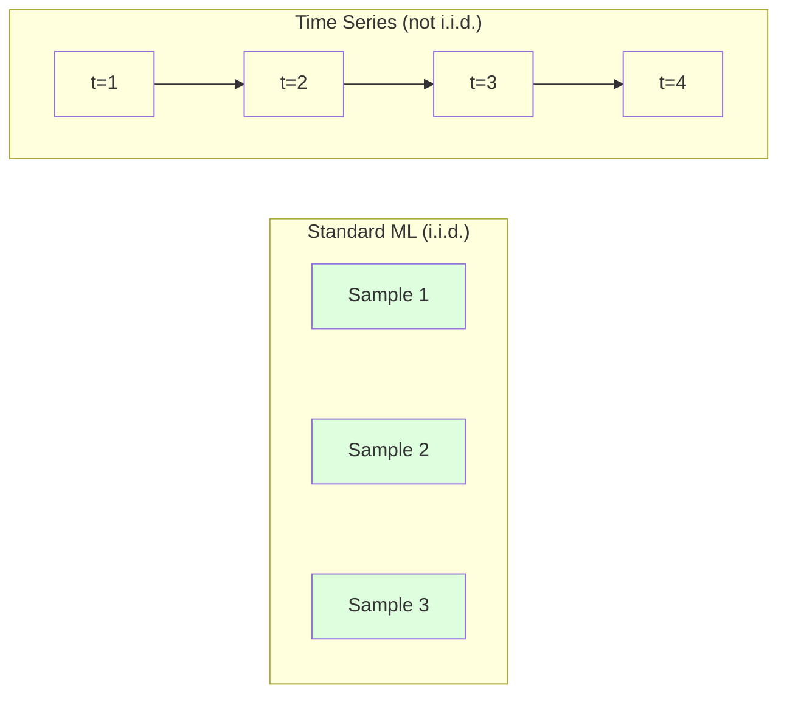
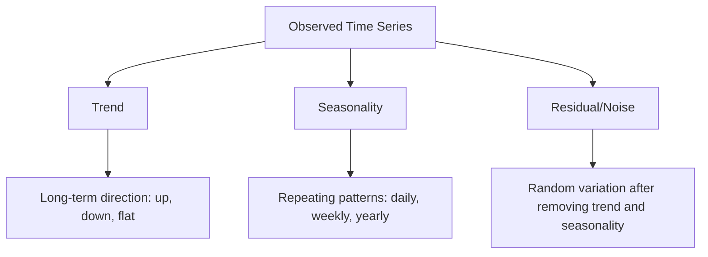
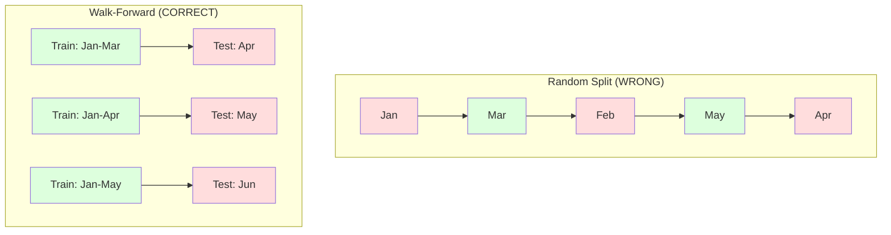

# Time Series Fundamentals

> يتنبأ الأداء السابق بالنتائج المستقبلية - إذا قمت بالتحقق من الثبات أولاً.

**النوع:** بناء
** اللغة: ** بايثون
**المتطلبات الأساسية:** المرحلة الثانية، الدروس 01-09
**الوقت:** ~90 دقيقة

## Learning Objectives

- تحليل السلاسل الزمنية إلى الاتجاه والموسمية والمكونات المتبقية واختبار الثبات
- تنفيذ ميزات التأخر والإحصائيات المتجددة لتحويل سلسلة زمنية إلى مشكلة تعليمية خاضعة للإشراف
- قم ببناء إطار عمل للتحقق من الصحة يمنع تسرب البيانات المستقبلية إلى التدريب
- اشرح سبب عدم صلاحية تقسيمات التدريب/الاختبار العشوائية للسلاسل الزمنية وإظهار فجوة الأداء مقابل الانقسامات الزمنية المناسبة

## The Problem

لديك بيانات مرتبة حسب الوقت. المبيعات اليومية، درجة الحرارة بالساعة، في الدقيقة CPU الاستخدام، أسعار الأسهم الأسبوعية. تريد التنبؤ بالقيمة التالية، الأسبوع المقبل، الربع القادم.

يمكنك الوصول إلى مجموعة أدوات ML القياسية الخاصة بك: تقسيم التدريب/الاختبار العشوائي، والتحقق المتبادل، ومصفوفة الميزات الواردة، والتنبؤ بالخروج. كل خطوة خاطئة.

السلاسل الزمنية تكسر الافتراضات التي يعتمد عليها المعيار ML. العينات ليست مستقلة - درجة الحرارة اليوم تعتمد على درجة حرارة الأمس. تؤدي الانقسامات العشوائية إلى تسرب المعلومات المستقبلية إلى الماضي. الميزات التي تبدو رائعة في الاختبار الخلفي تفشل في الإنتاج لأنها تعتمد على الأنماط التي تتغير بمرور الوقت.

النموذج الذي يحصل على دقة بنسبة 95% مع التحقق العشوائي العشوائي قد يحصل على 55% مع التقييم المناسب المستند إلى الوقت. الفرق ليس تقنيا. إنه الفرق بين النموذج الذي يعمل على الورق والذي يعمل في الإنتاج.

يغطي هذا الدرس الأساسيات: ما هي البيانات الزمنية make المختلفة، وكيفية تقييم النماذج بأمانة، وكيفية تحويل السلسلة الزمنية إلى ميزات يمكن أن تستهلكها النماذج ML القياسية.

## The Concept

### What Makes Time Series Different

المعيار ML يفترض i.i.d. - مستقلة وموزعة بشكل متماثل. يتم سحب كل عينة من نفس التوزيع بشكل مستقل عن العينات الأخرى. السلاسل الزمنية تنتهك كلا من:

- **ليست مستقلة.** يعتمد سعر السهم اليوم على سعر الأمس. مبيعات هذا الأسبوع تتوافق مع مبيعات الأسبوع الماضي.
- **غير موزعة بشكل متماثل.** يتغير التوزيع بمرور الوقت. تبدو المبيعات في شهر ديسمبر مختلفة عن مبيعات شهر مارس.

هذه الانتهاكات ليست بسيطة. إنها تغير كيفية إنشاء الميزات، وكيفية تقييم النماذج، والخوارزميات التي تعمل.



في المعيار ML، العينات قابلة للتبديل. خلطهم لا يغير شيئا. في السلاسل الزمنية، النظام هو كل شيء. الخلط يدمر الإشارة.

### Components of a Time Series

كل سلسلة زمنية عبارة عن مزيج من:



- **الاتجاه**: الاتجاه طويل المدى. الإيرادات تنمو 10 ٪ سنويا. ارتفاع درجة الحرارة العالمية.
- **الموسمية**: أنماط متكررة على فترات زمنية محددة. ارتفاع مبيعات التجزئة في ديسمبر. يصل استخدام مكيفات الهواء إلى ذروته في شهر يوليو.
- **المتبقي**: كل ما تبقى بعد إزالة الاتجاه والموسمية. إذا كان الجزء المتبقي يشبه الضوضاء البيضاء، فإن التحلل يلتقط الإشارة.

### Stationarity

تعتبر السلسلة الزمنية ثابتة إذا لم تتغير خصائصها الإحصائية (المتوسط، التباين، الارتباط الذاتي) بمرور الوقت. تفترض معظم طرق التنبؤ الثبات.

**سبب أهميته:** المتسلسلة غير الثابتة لها وسط ينجرف. لقد تعلم النموذج الذي تم تدريبه على بيانات شهر يناير متوسطًا مختلفًا عما سيظهره شهر فبراير. سيكون خطأ منهجي.

**كيفية التحقق:** حساب متوسط ​​التدحرج والانحراف المعياري على النوافذ. إذا انحرفت، فإن السلسلة غير ثابتة.

**كيفية الإصلاح:** الاختلاف. بدلاً من نمذجة القيم الأولية، قم بنمذجة التغيير بين القيم المتتالية:

```
diff[t] = value[t] - value[t-1]
```

إذا لم تؤدي جولة واحدة من التفاضل إلى make السلسلة الثابتة، فقم بتطبيقها مرة أخرى (التفاضل من الدرجة الثانية). تحتاج معظم سلاسل العالم الحقيقي إلى جولتين على الأكثر.

**Example:**

السلسلة الأصلية: [100، 102، 106، 112، 120]
الفارق الأول: [2، 4، 6، 8] (لا يزال يتجه نحو الأعلى)
الفرق الثاني: [2، 2، 2] (ثابت - ثابت)

السلسلة الأصلية كان لها اتجاه تربيعي. الاختلاف الأول حوله إلى اتجاه خطي. الفرق الثاني جعلها مسطحة. من الناحية العملية، نادرًا ما تحتاج إلى أكثر من جولتين.

**الاختبار الرسمي:** اختبار ديكي فولر المعزز (ADF) هو الاختبار الإحصائي القياسي للثبات. الفرضية الصفرية هي أن "السلسلة غير ثابتة." القيمة p أقل من 0.05 تعني أنه يمكنك رفض القيمة الفارغة وإنهاء الثبات. نحن لا ننفذ ADF من الصفر (يتطلب جداول توزيع مقاربة)، ولكن نهج الإحصائيات المتداول في الكود الخاص بنا يوفر فحصًا مرئيًا عمليًا.

### Autocorrelation

يقيس الارتباط التلقائي مدى ارتباط القيمة في الوقت t بالقيمة في الوقت t-k (خطوات k في الماضي). تقوم وظيفة الارتباط الذاتي (ACF) برسم هذا الارتباط لكل تأخر k.

**ACF يقول لك:**
- إلى أي مدى يعود المسلسل إلى الذاكرة. إذا انخفض ACF إلى الصفر بعد التأخر 5، فإن القيم التي مضت أكثر من 5 خطوات ليست ذات صلة.
- ما إذا كانت الموسمية موجودة. إذا ارتفعت ACF عند التأخر 12 (بيانات شهرية)، فهناك موسمية سنوية.
- كم عدد الميزات المتأخرة التي سيتم إنشاؤها. استخدم الفترات الزمنية حتى حيث يصبح ACF مهملاً.

**PACF (وظيفة الارتباط الذاتي الجزئي)** تزيل الارتباطات غير المباشرة. إذا كان اليوم يرتبط بـ 3 أيام مضت فقط لأن كلاهما يرتبط بالأمس، فإن PACF في التأخر 3 سيكون صفرًا بينما ACF في التأخر 3 لن يكون كذلك.

### Lag Features: Turning Time Series into Supervised Learning

تحتاج النماذج ML القياسية إلى مصفوفة ميزات X وهدف y. تمنحك السلسلة الزمنية عمودًا واحدًا من القيم. الجسر متخلف الميزات.

خذ السلسلة [10، 12، 14، 13، 15] وقم بإنشاء ميزات lag-1 و lag-2:

| تأخر_2 | تأخر_1 | الهدف |
|-------|-------|--------|
| 10 | 12 | 14 |
| 12 | 14 | 13 |
| 14 | 13 | 15 |

الآن لديك مشكلة الانحدار القياسي. يمكن لأي نموذج ML (الانحدار الخطي، الغابة العشوائية، تعزيز التدرج) التنبؤ بالهدف من التأخرات.

ميزات إضافية يمكنك هندستها:
- **الإحصائيات المتداولة:** المتوسط، القياسي، الأدنى، الأقصى خلال قيم k الأخيرة
- **ميزات التقويم:** يوم الأسبوع، الشهر، هو_عطلة، هو_عطلة_الأسبوع
- **القيم المختلفة:** تتغير عن الخطوة السابقة
- **توسيع الإحصائيات:** المتوسط التراكمي، المجموع التراكمي
- **ميزات النسبة:** القيمة الحالية / المتوسط ​​المتداول (مدى المسافة بين المتوسط الأخير)
- **ميزات التفاعل:** lag_1 * day_of_week (تأثيرات أيام الأسبوع على الزخم)

** كم عدد التأخرات؟ ** استخدم وظيفة الارتباط التلقائي. إذا كانت ACF مهمة حتى 10، فاستخدم 10 تأخرات على الأقل. إذا كانت هناك موسمية أسبوعية، فقم بتضمين التأخر 7 (وربما 14). المزيد من التأخير يمنح النموذج مزيدًا من التاريخ ولكن أيضًا المزيد من الميزات التي تناسبه، مما يزيد من خطر التجهيز الزائد.

**ملاءمة محاذاة الهدف.** عند إنشاء معالم متأخرة، يجب أن يكون الهدف هو القيمة في الوقت t، ويجب أن تستخدم جميع المعالم القيم في الوقت t-1 أو ما قبله. إذا قمت عن طريق الخطأ بتضمين القيمة في الوقت t كميزة، فلديك متنبئ مثالي - ونموذج عديم الفائدة تمامًا. هذا هو الخطأ الأكثر شيوعًا في هندسة ميزات السلاسل الزمنية.

### Walk-Forward Validation

وهذا هو المفهوم الأكثر أهمية في هذا الدرس. يقوم التحقق المتبادل القياسي k-fold بتعيين العينات بشكل عشوائي للتدريب والاختبار. بالنسبة للسلاسل الزمنية، يؤدي هذا إلى تسريب المعلومات المستقبلية.



التحقق من صحة المشي إلى الأمام:
1. التدريب على البيانات حتى الوقت ر
2. توقع في الوقت t+1 (أو t+1 إلى t+k للخطوات المتعددة)
3. قم بتحريك النافذة للأمام
4. كرر

تحتوي كل طية اختبار فقط على البيانات التي تأتي بعد جميع بيانات التدريب. لا يوجد تسرب في المستقبل. يمنحك هذا تقديرًا صادقًا لكيفية أداء النموذج عند نشره.

**توسيع النافذة** يستخدم كافة البيانات التاريخية للتدريب (النافذة تكبر). **النافذة المنزلقة** تستخدم نافذة تدريب ذات حجم ثابت (شرائح النافذة). استخدم التوسيع عندما تعتقد أن البيانات القديمة لا تزال ذات صلة. استخدم الانزلاق عندما يتغير العالم وتكون البيانات القديمة مؤلمة.

### ARIMA Intuition

ARIMA هو نموذج السلسلة الزمنية الكلاسيكية. لديها ثلاثة مكونات:

- **AR (الانحدار الذاتي):** التنبؤ من القيم الماضية. AR(p) يستخدم قيم p الأخيرة.
- **أنا (المتكامل):** التفاضل لتحقيق الثبات. I(d) يطبق جولات d من التفاضل.
- **MA (المتوسط ​​المتحرك):** توقع من أخطاء التوقعات السابقة. MA(q) يستخدم أخطاء q الأخيرة.

ARIMA(p,d,q) يجمع بين الثلاثة. اخترت p، d، q بناءً على تحليل ACF/PACF أو البحث الآلي (تلقائي-ARIMA).

لن نقوم بتنفيذ ARIMA من الصفر، فهو يتطلب تحسينًا رقميًا يتجاوز نطاق هذا الدرس. الفكرة الأساسية هي فهم ما يفعله كل مكون حتى تتمكن من تفسير ARIMA النتائج ومعرفة متى تستخدمه.

### When to Use What

| النهج | الأفضل لـ | يعالج الموسمية | يعالج الميزات الخارجية |
|----------|--------|-------------------|--------|
| مميزات التأخر + ML | جدولي مع العديد من الميزات الخارجية | مع ميزات التقويم | نعم |
| ARIMA | سلسلة وحيدة المتغير، قصيرة المدى | SARIMA البديل | لا (ARIMAX للمحدودية) |
| التجانس الأسي | اتجاه بسيط + موسمية | نعم (هولت وينترز) | لا |
| النبي | توقعات الأعمال والعطلات | نعم (مصطلحات فورييه) | محدودة |
| الشبكات العصبية (LSTM، محول) | مسلسلات طويلة، مسلسلات كثيرة | تعلمت | نعم |

بالنسبة لمعظم المشكلات العملية، تعد ميزات التأخر + تعزيز التدرج أقوى نقطة بداية. فهو يتعامل مع الميزات الخارجية بشكل طبيعي، ولا يتطلب الثبات، ويسهل تصحيحه.

### Forecasting Horizons and Strategies

التنبؤ بخطوة واحدة يتنبأ بخطوة واحدة إلى الأمام. التنبؤ متعدد الخطوات يتنبأ بخطوات متعددة. هناك ثلاث استراتيجيات:

**العودي (المتكرر):** توقع خطوة واحدة إلى الأمام، واستخدم التنبؤ كمدخل للخطوة التالية. بسيطة ولكن الأخطاء تتراكم - كل توقع يستخدم التنبؤ السابق، وبالتالي تتضاعف الأخطاء.

**مباشر:** تدريب نموذج منفصل لكل أفق. النموذج 1 يتنبأ بـ t+1، والنموذج 5 يتنبأ بـ t+5. لا يوجد تراكم للأخطاء، ولكن كل نموذج يحتوي على عدد أقل من عينات التدريب ولا يشاركون المعلومات.

**مخرجات متعددة:** قم بتدريب نموذج واحد يقوم بإخراج جميع الآفاق في وقت واحد. يشارك المعلومات عبر الآفاق ولكنه يتطلب نموذجًا يدعم مخرجات متعددة (أو وظيفة خسارة مخصصة).

بالنسبة لمعظم المشكلات العملية، ابدأ بالتكرار للآفاق القصيرة (1-5 خطوات) ثم المباشر للآفاق الأطول.

### Common Mistakes in Time Series

| خطأ | لماذا يحدث | كيفية الإصلاح |
|---------|--------------|-----------|
| قطار عشوائي / تقسيم الاختبار | العادة من المعيار ML | استخدم المشي للأمام أو التقسيم الزمني |
| استخدام الميزات المستقبلية | ميزة في الوقت ر أدرجت عن طريق الخطأ | قم بمراجعة كل ميزة للمحاذاة الزمنية |
| الإفراط في الموسمية | نموذج يحفظ أنماط التقويم | عقد دورة موسمية كاملة في مجموعة الاختبار |
| تجاهل تغييرات المقياس | تتضاعف الإيرادات لكن الأنماط تبقى | تغير النسبة المئوية للنموذج بدلاً من المطلق |
| الكثير من ميزات التأخر | "المزيد من التاريخ أفضل" | استخدم ACF لتحديد الفترات الزمنية ذات الصلة |
| لا يختلف | "النموذج سوف يكتشف ذلك" | تتعامل النماذج الشجرية مع الاتجاهات؛ النماذج الخطية تحتاج إلى الثبات |

## Build It

يقوم الكود الموجود في `code/time_series.py` بتنفيذ العناصر الأساسية من البداية.

### Lag Feature Creator

```python
def make_lag_features(series, n_lags):
    n = len(series)
    X = np.full((n, n_lags), np.nan)
    for lag in range(1, n_lags + 1):
        X[lag:, lag - 1] = series[:-lag]
    valid = ~np.isnan(X).any(axis=1)
    return X[valid], series[valid]
```

يؤدي هذا إلى تحويل سلسلة أحادية الأبعاد إلى مصفوفة ميزات حيث يحتوي كل صف على آخر قيم `n_lags` كميزات، والقيمة الحالية كهدف.

### Walk-Forward Cross-Validation

```python
def walk_forward_split(n_samples, n_splits=5, min_train=50):
    assert min_train < n_samples, "min_train must be less than n_samples"
    step = max(1, (n_samples - min_train) // n_splits)
    for i in range(n_splits):
        train_end = min_train + i * step
        test_end = min(train_end + step, n_samples)
        if train_end >= n_samples:
            break
        yield slice(0, train_end), slice(train_end, test_end)
```

يضمن كل قسم أن بيانات التدريب تأتي بدقة قبل بيانات الاختبار. تتسع نافذة التدريب مع كل طية.

### Simple Autoregressive Model

نموذج AR النقي هو مجرد انحدار خطي على ميزات التأخر:

```python
class SimpleAR:
    def __init__(self, n_lags=5):
        self.n_lags = n_lags
        self.weights = None
        self.bias = None

    def fit(self, series):
        X, y = make_lag_features(series, self.n_lags)
        # Solve via normal equations
        X_b = np.column_stack([np.ones(len(X)), X])
        theta = np.linalg.lstsq(X_b, y, rcond=None)[0]
        self.bias = theta[0]
        self.weights = theta[1:]
        return self
```

وهذا مطابق من الناحية المفاهيمية للانحدار الخطي من الدرس 02، ولكنه ينطبق على الإصدارات المتأخرة زمنيًا لنفس المتغير.

### Stationarity Check

يحسب الكود الإحصائيات المتداولة لتقييم الاستقرار بصريًا وعدديًا:

```python
def check_stationarity(series, window=50):
    rolling_mean = np.array([
        series[max(0, i - window):i].mean()
        for i in range(1, len(series) + 1)
    ])
    rolling_std = np.array([
        series[max(0, i - window):i].std()
        for i in range(1, len(series) + 1)
    ])
    return rolling_mean, rolling_std
```

إذا انحرف متوسط ​​التدحرج أو تغير المعيار المتداول، فإن السلسلة تكون غير ثابتة. تطبيق التفاضل والتحقق مرة أخرى.

يتحقق الكود أيضًا من الثبات من خلال مقارنة النصف الأول والنصف الثاني من السلسلة. إذا اختلفت الوسائل بأكثر من نصف الانحراف المعياري أو تجاوزت نسبة التباين 2x، يتم وضع علامة على السلسلة على أنها غير ثابتة.

### Autocorrelation

```python
def autocorrelation(series, max_lag=20):
    n = len(series)
    mean = series.mean()
    var = series.var()
    acf = np.zeros(max_lag + 1)
    for k in range(max_lag + 1):
        cov = np.mean((series[:n-k] - mean) * (series[k:] - mean))
        acf[k] = cov / var if var > 0 else 0
    return acf
```

## Use It

مع sklearn، يمكنك استخدام ميزات التأخر مباشرة مع أي تراجع:

```python
from sklearn.linear_model import Ridge
from sklearn.ensemble import GradientBoostingRegressor

X, y = make_lag_features(series, n_lags=10)

for train_idx, test_idx in walk_forward_split(len(X)):
    model = Ridge(alpha=1.0)
    model.fit(X[train_idx], y[train_idx])
    predictions = model.predict(X[test_idx])
```

بالنسبة إلى ARIMA، استخدم statsmodels:

```python
from statsmodels.tsa.arima.model import ARIMA

model = ARIMA(train_series, order=(5, 1, 2))
fitted = model.fit()
forecast = fitted.forecast(steps=30)
```

يوضح الكود الموجود في `time_series.py` كلا الطريقتين ويقارنهما باستخدام التحقق من الصحة.

### sklearn TimeSeriesSplit

يوفر sklearn `TimeSeriesSplit` الذي ينفذ التحقق من الصحة:

```python
from sklearn.model_selection import TimeSeriesSplit

tscv = TimeSeriesSplit(n_splits=5)
for train_index, test_index in tscv.split(X):
    X_train, X_test = X[train_index], X[test_index]
    y_train, y_test = y[train_index], y[test_index]
    model.fit(X_train, y_train)
    score = model.score(X_test, y_test)
```

وهذا يعادل ما لدينا من الصفر `walk_forward_split` ولكنه مدمج في إطار عمل التحقق من الصحة لـ sklearn. يمكنك استخدامه مع `cross_val_score`:

```python
from sklearn.model_selection import cross_val_score

scores = cross_val_score(model, X, y, cv=TimeSeriesSplit(n_splits=5))
print(f"Mean score: {scores.mean():.4f} +/- {scores.std():.4f}")
```

### Evaluation Metrics

يستخدم التنبؤ بالسلاسل الزمنية مقاييس الانحدار، ولكن مع سياق مدرك للوقت:

- **MAE (متوسط ​​الخطأ المطلق):** متوسط ​​|y_true - y_pred|. من السهل تفسيرها في الوحدات الأصلية. "في المتوسط، تختلف التوقعات بمقدار 3.2 درجة."
- **RMSE (جذر متوسط ​​الخطأ التربيعي):** الجذر التربيعي لمتوسط ​​الخطأ التربيعي. يعاقب الأخطاء الكبيرة أكثر من MAE. يُستخدم عندما تكون الأخطاء الكبيرة أسوأ من العديد من الأخطاء الصغيرة.
- **MAPE (متوسط ​​النسبة المئوية للخطأ المطلق):** متوسط ​​|الخطأ / القيمة_الحقيقية| * 100. مستقل عن المقياس، ومفيد للمقارنة عبر سلاسل مختلفة. ولكن غير محدد عندما تكون القيم الحقيقية صفر.
- **مقارنة أساسية ساذجة:** قارن دائمًا مع خطوط الأساس البسيطة. يتنبأ خط الأساس الموسمي الساذج بالقيمة من فترة واحدة مضت (أمس، الأسبوع الماضي). إذا كان نموذجك لا يستطيع التغلب على السذاجة، فهذا يعني أن هناك خطأ ما.

### Rolling Features

يوضح الكود إضافة إحصائيات متجددة (المتوسط، والقياسي، والحد الأدنى، والحد الأقصى خلال نوافذ 7 و14 يومًا) إلى الميزات المتأخرة. وهي تعطي النموذج معلومات حول الاتجاهات الحديثة والتقلبات التي لا تستطيع ميزات التأخر وحدها التقاطها.

على سبيل المثال، إذا كان المتوسط ​​المتداول آخذ في الارتفاع، فإنه يشير إلى اتجاه تصاعدي. إذا كان المعيار المتداول يتزايد، فإنه يشير إلى تزايد التقلبات. هذه هي أنواع الأنماط التي يمكن للنماذج المبنية على الأشجار أن تتعلم منها ولكن النماذج الخطية لا يمكنها التعلم منها.

## Ship It

ينتج هذا الدرس:
- `outputs/prompt-time-series-advisor.md` -- مطالبة بتأطير مشاكل السلاسل الزمنية
- `code/time_series.py` -- ميزات التأخر، والتحقق من صحة التقدم، ونموذج AR، والتحقق من الاستقرارية

### Baselines You Must Beat

قبل بناء أي نموذج، حدد الخطوط الأساسية:

1. **القيمة الأخيرة (الثبات).** توقع أن الغد سيكون هو نفسه اليوم. بالنسبة للعديد من المسلسلات، من الصعب التغلب على هذا بشكل مدهش.
2. **السذاجة الموسمية.** توقع أن اليوم سيكون هو نفس اليوم في الأسبوع الماضي (أو العام الماضي). إذا لم يتمكن نموذجك من التغلب على هذا، فهو لم يتعلم أي نمط مفيد يتجاوز الموسمية.
3. **المتوسط ​​المتحرك.** توقع متوسط ​​قيم k الأخيرة. يخفف الضوضاء ولكن لا يمكنه التقاط التغييرات المفاجئة.

إذا خسر نموذجك الفاخر ML خط الأساس الموسمي الساذج، فلديك خطأ. الأكثر شيوعًا: التسرب المستقبلي للميزات، أو طريقة التقييم الخاطئة، أو أن تكون السلسلة عشوائية حقًا ولا يمكن التنبؤ بها.

### Practical Tips

1. **ابدأ بالتخطيط.** قبل أي تصميم، ارسم السلسلة الأولية. ابحث عن الاتجاهات، والموسمية، والقيم المتطرفة، والفواصل الهيكلية (التغيرات المفاجئة في السلوك). غالبًا ما يخبرك الفحص البصري لمدة 30 ثانية بأكثر من ساعة من التحليل الآلي.

2. **الفرق أولاً، النموذج ثانيًا.** إذا كانت السلسلة ذات اتجاه واضح، فافرقها قبل إنشاء ميزات التأخر. يمكن للنماذج المبنية على الشجرة التعامل مع الاتجاهات، لكن النماذج الخطية لا تستطيع ذلك، والاختلاف لا يضر أبدًا.

3. **قم بإجراء دورة موسمية كاملة واحدة على الأقل.** إذا كانت لديك موسمية أسبوعية، فإن مجموعة الاختبار الخاصة بك تحتاج إلى أسبوع كامل على الأقل. إذا كانت شهرية، على الأقل شهر كامل. وإلا فلن تتمكن من تقييم ما إذا كان النموذج قد التقط النمط الموسمي.

4. **مراقبة الإنتاج.** تتدهور نماذج السلاسل الزمنية بمرور الوقت مع تغير العالم. تتبع أخطاء التنبؤ على أساس متجدد. عندما تبدأ الأخطاء في التزايد، أعد تدريب النموذج على البيانات الحديثة.

5. **احذر من تغييرات النظام.** لن يتنبأ النموذج الذي تم تدريبه على بيانات ما قبل الوباء بسلوك ما بعد الوباء. قم بتضمين مؤشرات تغييرات النظام المعروفة كميزات، أو استخدم نافذة منزلقة تنسى البيانات القديمة.

6. **سلسلة منحرفة لتحويل السجل.** غالبًا ما تكون الإيرادات والأسعار والأعداد منحرفة نحو اليمين. يؤدي أخذ السجل إلى تثبيت التباين وإضافة الأنماط المضاعفة make، والتي يمكن للنماذج الخطية التعامل معها. التنبؤ في مساحة السجل، ثم الأس للعودة إلى الوحدات الأصلية.

## Exercises

1. **تجربة الثبات.** أنشئ سلسلة ذات اتجاه خطي. التحقق من الثبات مع الإحصائيات المتداولة. تطبيق الفرق الأول. تحقق مرة أخرى. كم عدد جولات التفاضل التي يستغرقها الاتجاه التربيعي؟

2. **اختيار التأخر.** حساب ACF على سلسلة موسمية (الفترة=7). ما هي التأخرات التي لديها أعلى ارتباط ذاتي؟ قم بإنشاء ميزات التأخر باستخدام تلك التأخرات فقط (وليس التأخرات المتتالية). هل تتحسن الدقة مقارنة باستخدام الفترات الزمنية من 1 إلى 7؟

3. **التقدم للأمام مقابل التقسيم العشوائي.** تدريب انحدار ريدج على ميزات التأخر. قم بالتقييم بتقسيم عشوائي بنسبة 80/20 ومع التحقق من صحة المضي قدمًا. إلى أي مدى يبالغ الانقسام العشوائي في تقدير الأداء؟

4. **هندسة الميزات.** أضف متوسط ​​التدوير (النافذة = 7)، والقياسي المتدرج (النافذة = 7)، وميزات يوم من الأسبوع إلى ميزات التأخر. قارن الدقة مع هذه الإضافات وبدونها باستخدام التحقق من الصحة.

5. **التنبؤ متعدد الخطوات.** قم بتعديل نموذج AR للتنبؤ بخمس خطوات للأمام بدلاً من 1. قارن بين استراتيجيتين: (أ) التنبؤ بخطوة واحدة، استخدم التنبؤ كمدخل للخطوة التالية (العودية)، و (ب) تدريب نماذج منفصلة لكل أفق (مباشر). أيهما أكثر دقة؟

## Key Terms

| مصطلح | ماذا يقول الناس | ماذا يعني في الواقع |
|------|----------------|----------------------|
| قرطاسية | "الإحصائيات لا تتغير بمرور الوقت" | متسلسلة يكون متوسطها وتباينها وبنية الارتباط الذاتي ثابتة بمرور الوقت |
| التفاضل | "طرح قيم متتالية" | حساب y[t] - y[t-1] لإزالة الاتجاهات وتحقيق الثبات |
| الارتباط التلقائي (ACF) | "كيف ترتبط السلسلة بنفسها" | العلاقة بين السلسلة الزمنية والنسخة المتأخرة من نفسها، كدالة للتأخر |
| الارتباط الذاتي الجزئي (PACF) | "الارتباط المباشر فقط" | الارتباط التلقائي عند التأخر k بعد إزالة تأثير جميع فترات التأخر الأقصر |
| مميزات التأخر | "القيم السابقة كمدخلات" | استخدام y[t-1]، y[t-2]،...، y[t-k] كميزات للتنبؤ بـ y[t] |
| التحقق من صحة المشي إلى الأمام | "التحقق المتبادل الذي يحترم الوقت" | التقييم حيث تسبق بيانات التدريب دائمًا بيانات الاختبار بترتيب زمني |
| ARIMA | "نموذج السلاسل الزمنية الكلاسيكية" | المتوسط ​​المتحرك المتكامل التلقائي: يجمع بين القيم السابقة (AR)، والاختلاف (I)، والأخطاء السابقة (MA) |
| الموسمية | "أنماط التقويم المتكررة" | دورات منتظمة يمكن التنبؤ بها في سلسلة زمنية مرتبطة بفترات تقويمية (يومية، أسبوعية، سنوية) |
| الاتجاه | "الاتجاه طويل المدى" | زيادة أو نقصان مستمر في مستوى السلسلة مع مرور الوقت |
| توسيع النافذة | "استخدام كل التاريخ" | التحقق من صحة المضي قدمًا حيث تنمو مجموعة التدريب مع كل طية |
| نافذة منزلقة | "تاريخ الحجم الثابت" | التحقق من صحة المضي قدمًا حيث تكون مجموعة التدريب عبارة عن نافذة ذات طول ثابت تنزلق للأمام |

## Further Reading

- [Hyndman and Athanasopoulos, Forecasting: Principles and Practice (3rd ed.)](https://otexts.com/fpp3/) -- the best free textbook on time series forecasting
- [scikit Time Series Split](https://scikit-learn.org/stable/modules/generated/sklearn.model_selection.TimeSeriesSplit.html) -- sklearn's walk-forward splitter
- [statsmodels ARIMA docs](https://www.statsmodels.org/stable/generated/statsmodels.tsa.arima.model.ARIMA.html) -- ARIMA implementation with diagnostics
- [Makridakis et al., The M5 Competition (2022)](https://www.sciencedirect.com/science/article/pii/S0169207021001874) -- مسابقة تنبؤية واسعة النطاق تظهر ML الطرق مقابل الطرق الإحصائية
