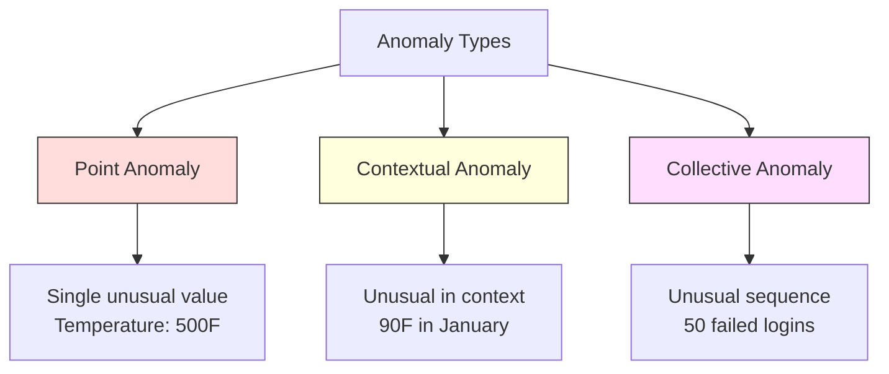
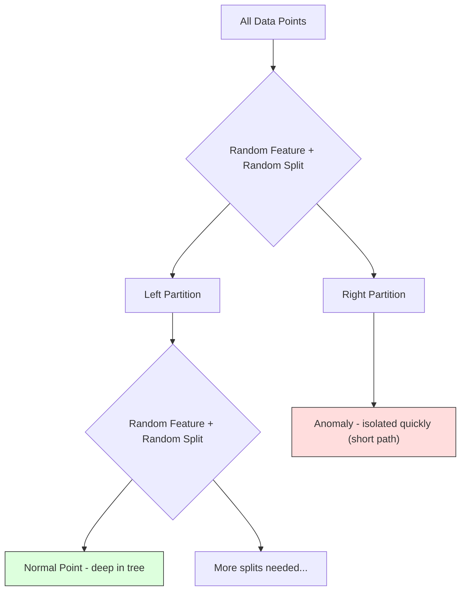
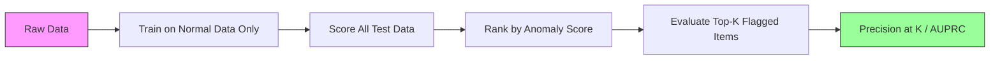

# Anomaly Detection

> من السهل تحديد العادي. غير الطبيعي هو كل ما لا يصلح.

**النوع:** بناء
** اللغة: ** بايثون
**المتطلبات الأساسية:** المرحلة الثانية، الدروس 01-09
**الوقت:** ~75 دقيقة

## Learning Objectives

- تنفيذ طرق الكشف عن شذوذ الغابة Z-score وIQR وIsolation Forest من البداية
- التمييز بين الشذوذات النقطية والسياقية والجماعية واختيار طريقة الكشف المناسبة لكل منها
- اشرح سبب تصنيف اكتشاف الحالات الشاذة على أنه نمذجة البيانات العادية بدلاً من تصنيف الحالات الشاذة
- مقارنة الكشف عن الشذوذ غير الخاضع للرقابة مع التصنيف الخاضع للإشراف وتقييم المفاضلة بين تغطية الشذوذ الجديدة والدقة

## The Problem

يتم استخدام بطاقة الائتمان في نيويورك الساعة 2 ظهرًا، ثم في طوكيو الساعة 2:05 ظهرًا. يقرأ مستشعر المصنع 150 درجة عندما يكون النطاق الطبيعي 80-120. يرسل الخادم 50000 طلب في الثانية عندما يكون المتوسط ​​اليومي 200.

هذه حالات شاذة. العثور عليهم مهم. الاحتيال يكلف المليارات فشل المعدات يكلف التوقف. بيانات تكلفة اختراق الشبكة.

التحدي: نادرًا ما قمت بتسمية أمثلة على الحالات الشاذة. الاحتيال makes يصل إلى 0.1% من المعاملات. تحدث أعطال المعدات عدة مرات في السنة. لا يمكنك تدريب مصنف قياسي لأنه لا يوجد شيء تقريبًا في فئة "الشذوذ" للتعلم منه. حتى لو كان لديك بعض التسميات، فإن الحالات الشاذة التي رأيتها ليست هي الأنواع الوحيدة التي ستواجهها. يبدو مخطط الاحتيال غدًا مختلفًا عن اليوم.

كشف الشذوذ يقلب المشكلة. بدلًا من معرفة ما هو غير طبيعي، تعلم ما هو طبيعي. أي شيء ينحرف عن الطبيعي فهو مشكوك فيه. يعمل هذا بدون تسميات، ويتكيف مع أنواع جديدة من الحالات الشاذة، ويتناسب مع مجموعات البيانات الضخمة.

## The Concept

### Types of Anomalies

ليست كل الحالات الشاذة متشابهة:

- **نقطة شاذة.** نقطة بيانات واحدة غير عادية بغض النظر عن السياق. قراءة درجة الحرارة 500 درجة. معاملة بقيمة 50000 دولار من حساب ينفق عادةً 50 دولارًا.
- **الحالات الشاذة السياقية.** نقطة بيانات غير معتادة نظرًا لسياقها. درجة الحرارة 90 درجة تعتبر طبيعية في الصيف، وشاذة في الشتاء. نفس القيمة، سياق مختلف.
- **الحالات الشاذة الجماعية.** سلسلة من نقاط البيانات غير المعتادة كمجموعة، على الرغم من أن كل نقطة على حدة قد تكون طبيعية. خمسة حالات فشل في تسجيل الدخول أمر طبيعي. خمسون على التوالي هو هجوم القوة الغاشمة.

تكتشف معظم الطرق حالات الشذوذ في النقاط. تحتاج الحالات الشاذة السياقية إلى ميزات الوقت أو الموقع. تحتاج الحالات الشاذة الجماعية إلى أساليب مدركة للتسلسل.



### The Unsupervised Framing

في التصنيف القياسي، لديك تسميات لكلا الفئتين. عند اكتشاف الحالات الشاذة، عادةً ما يكون لديك إحدى الحالات الثلاث:

1. **غير خاضع للرقابة تمامًا.** لا توجد ملصقات على الإطلاق. تقوم بتركيب الكاشف على جميع البيانات وتأمل أن تكون الحالات الشاذة نادرة بما يكفي حتى لا تفسد النموذج "العادي".
2. ** شبه خاضع للإشراف. ** لديك مجموعة بيانات نظيفة من البيانات العادية فقط. أنت تتناسب مع هذه المجموعة النظيفة وتسجل كل شيء آخر. هذا هو أقوى إعداد عندما يكون ذلك ممكنًا.
3. **الإشراف ضعيف.** لديك بعض الحالات الشاذة المصنفة. استخدمها للتقييم وليس للتدريب. تدريب دون إشراف، ثم قياس الدقة/الاستدعاء على المجموعة الفرعية المسماة.

الفكرة الرئيسية: اكتشاف الشذوذ يختلف اختلافًا جوهريًا عن التصنيف. أنت تقوم بنمذجة توزيع البيانات العادية، وليس حدود القرار بين فئتين.

### Supervised vs Unsupervised: The Tradeoff

إذا كانت لديك حالات شاذة مصنفة، فهل يجب عليك استخدامها للتدريب (التصنيف الخاضع للإشراف) أم للتقييم فقط (الاكتشاف غير الخاضع للرقابة)؟

**الإشراف (يعامل كتصنيف):**
- يلتقط الأنواع الدقيقة من الحالات الشاذة التي رأيتها من قبل
- دقة أعلى في أنواع الشذوذ المعروفة
- يفتقد أنواع الشذوذ الجديدة تمامًا
- يتطلب إعادة التدريب عند ظهور أنواع جديدة من الشذوذ
- يحتاج إلى ما يكفي من الأمثلة الشاذة (غالبًا ما تكون قليلة جدًا)

**غير خاضع للرقابة (النموذج العادي، انحرافات العلم):**
- يرصد أي انحراف عن الوضع الطبيعي، بما في ذلك الأنواع الجديدة
- لا يتطلب الشذوذ المسمى
- ارتفاع معدل النتائج الإيجابية الكاذبة (ليس كل ما هو غير عادي سيئًا)
- أكثر قوة لتحول التوزيع

ومن الناحية العملية، تجمع أفضل الأنظمة بين الاثنين: الكشف غير الخاضع للرقابة لتغطية واسعة النطاق، والنماذج الخاضعة للإشراف لأنواع الشذوذ المعروفة ذات الأولوية العالية، والمراجعة البشرية للحالات الغامضة.

### Z-Score Method

أبسط نهج. حساب المتوسط ​​والانحراف المعياري لكل ميزة. ضع علامة على أي نقطة تزيد عن الانحرافات المعيارية عن الوسط.

```text
z_score = (x - mean) / std
anomaly if |z_score| > threshold
```

العتبة الافتراضية هي 3.0 (99.7% من البيانات العادية تقع ضمن 3 انحرافات معيارية للتوزيع الغوسي).

** نقاط القوة: ** بسيطة. سريع. قابلة للتفسير ("هذه القيمة هي 4.5 انحرافات معيارية عن وضعها الطبيعي").

**نقاط الضعف:** تفترض أن البيانات يتم توزيعها بشكل طبيعي. حساس للقيم المتطرفة في بيانات التدريب (القيم المتطرفة تحول المتوسط ​​وتضخم الأمراض المنقولة جنسيا، مما يجعل اكتشافها أكثر صعوبة). فشل في التوزيعات متعددة الوسائط.

**عندما تعمل بشكل جيد:** مراقبة الميزة الواحدة حيث تكون البيانات على شكل جرس تقريبًا. أوقات استجابة الخادم، وتفاوتات التصنيع، وقراءات أجهزة الاستشعار مع خطوط أساس مستقرة.

**عند الفشل:** بيانات متعددة المجموعات (موقعان للمكاتب بدرجات حرارة أساسية مختلفة)، وبيانات منحرفة (مبالغ المعاملات حيث تكون 1000 دولار نادرة ولكنها ليست شاذة)، وبيانات ذات قيم متطرفة في مجموعة التدريب.

### IQR Method

أكثر قوة من Z-score. يستخدم النطاق الربيعي بدلاً من المتوسط ​​والانحراف المعياري.

```
Q1 = 25th percentile
Q3 = 75th percentile
IQR = Q3 - Q1
lower_bound = Q1 - factor * IQR
upper_bound = Q3 + factor * IQR
anomaly if x < lower_bound or x > upper_bound
```

العامل الافتراضي هو 1.5.

**نقاط القوة:** قوية بالنسبة للقيم المتطرفة (لا تتأثر النسب المئوية بالقيم المتطرفة). يعمل على توزيعات منحرفة. لا يوجد افتراض طبيعي.

**نقاط الضعف:** أحادي المتغير فقط (ينطبق على كل ميزة بشكل مستقل). لا يمكن اكتشاف الحالات الشاذة غير المعتادة فقط عند النظر إلى الميزات معًا (قد تكون نقطة طبيعية في كل ميزة على حدة ولكنها شاذة في المساحة المشتركة).

**ملاحظة عملية:** العامل 1.5 في IQR يتوافق مع الشعيرات الموجودة في مخطط الصندوق. النقاط الموجودة خارج الشعيرات هي قيم متطرفة محتملة. باستخدام 3.0 بدلاً من 1.5 make يكون الكاشف أكثر تحفظًا (أعلام أقل، عدد أقل من النتائج الإيجابية الكاذبة). يعتمد العامل الصحيح على قدرتك على تحمل الإنذارات الكاذبة.

### Isolation Forest

الفكرة الرئيسية: الشذوذات قليلة ومختلفة. في التقسيم العشوائي للبيانات، يكون من الأسهل عزل الحالات الشاذة - فهي تحتاج إلى عدد أقل من الانقسامات العشوائية لفصلها عن الباقي.



**كيفية العمل:**
1. بناء العديد من الأشجار العشوائية (غابة منعزلة)
2. عند كل node، اختر ميزة عشوائية وقيمة مقسمة عشوائيًا بين الحد الأدنى والحد الأقصى للميزة
3. استمر في التقسيم حتى يتم عزل كل نقطة (في ورقتها الخاصة)
4. الشذوذات لها متوسط أطوال مسارات أقصر عبر جميع الأشجار

**لماذا يعمل:** تعيش النقاط العادية في مناطق كثيفة. هناك حاجة إلى العديد من الانقسامات العشوائية لعزل أحد الكائنات عن جيرانه. تعيش الشذوذات في مناطق متفرقة. واحد أو اثنين من الانقسامات العشوائية كافية لعزلهم.

تعتمد درجة الشذوذ على متوسط ​​طول المسار عبر جميع الأشجار، والذي تم تطبيعه بواسطة طول المسار المتوقع لشجرة بحث ثنائية عشوائية:

```
score(x) = 2^(-average_path_length(x) / c(n))
```

حيث `c(n)` هو طول المسار المتوقع لعينات n. النتيجة القريبة من 1 تعني حالة شاذة. النتيجة بالقرب من 0.5 يعني طبيعي. النتيجة القريبة من 0 تعني طبيعية جدًا (عميقة في التجمعات الكثيفة).

** نقاط القوة: ** لا توجد افتراضات التوزيع. يعمل بأبعاد عالية. يتم قياسه بشكل جيد (خط فرعي في حجم العينة لأن كل شجرة تستخدم عينة فرعية). يتعامل مع أنواع الميزات المختلطة.

**نقاط الضعف:** يكافح مع الحالات الشاذة في المناطق الكثيفة (تأثير الإخفاء). يكون التقسيم العشوائي أقل فعالية عندما تكون العديد من الميزات غير ذات صلة.

** المعلمات الفائقة الرئيسية: **
- `n_estimators`: عدد الأشجار. 100 عادة ما يكون كافيا. المزيد من الأشجار تعطي نتائج أكثر استقرارًا ولكن حسابًا أبطأ.
- `max_samples`: عدد العينات لكل شجرة. 256 هو الافتراضي في الورقة الأصلية. القيم الأصغر make الأشجار الفردية أقل دقة ولكنها تزيد من التنوع. المعاينة الفرعية هي ما makes Isolation Forest بسرعة - ترى كل شجرة جزءًا صغيرًا من البيانات.
- `contamination`: جزء الشذوذ المتوقع. تستخدم فقط لتحديد العتبة. لا يؤثر على الدرجات نفسها.

### Local Outlier Factor (LOF)

LOF يقارن الكثافة المحلية حول نقطة ما بالكثافة المحيطة بجيرانها. نقطة في منطقة متفرقة محاطة بمناطق كثيفة تعتبر شاذة.

**كيفية العمل:**
1. لكل نقطة، ابحث عن أقرب جيرانها k
2. حساب كثافة إمكانية الوصول المحلية (مدى كثافة الحي)
3. قارن كثافة كل نقطة بكثافة جيرانها
4. إذا كانت كثافة نقطة ما أقل بكثير من جيرانها، فهي نقطة متطرفة

**LOF النتيجة:**
- LOF قريب من 1.0 يعني كثافة مماثلة للجيران (عادي)
- LOF أكبر من 1.0 يعني كثافة أقل من الجيران (يحتمل أن تكون شاذة)
- LOF أكبر بكثير من 1.0 (على سبيل المثال، 2.0+) يعني كثافة أقل بكثير (شذوذ محتمل)

الجزء "المحلي" أمر بالغ الأهمية. خذ بعين الاعتبار مجموعة بيانات تحتوي على مجموعتين: مجموعة كثيفة مكونة من 1000 نقطة ومجموعة متفرقة مكونة من 50 نقطة. إن النقطة الموجودة على حافة المجموعة المتناثرة ليست غير عادية على مستوى العالم - فهي تحتوي على 50 جارًا. ولكن من غير المعتاد محليًا أن تكون جيرانها المباشرون أكثر كثافة مما هي عليه الآن. LOF يجسد هذا الفارق الدقيق الذي تفتقده الأساليب العالمية.

**نقاط القوة:** يكتشف الحالات الشاذة المحلية (النقاط غير المعتادة في المنطقة المجاورة لها، حتى لو لم تكن غير عادية عالميًا). يعمل على مجموعات ذات كثافات مختلفة.

** نقاط الضعف: ** بطيء في مجموعات البيانات الكبيرة (O(n^2) للتنفيذ الساذج). حساسة لاختيار ك. لا يعمل بشكل جيد في الأبعاد العالية جدًا (لعنة الأبعاد تؤثر على حسابات المسافة).

### Comparison

| الطريقة | افتراضات | السرعة | مقابض ذات خافتات عالية | يكتشف الشذوذات المحلية |
|--------|-----------|------|-------------------|--------|----------------|
| النتيجة Z | التوزيع الطبيعي | سريع جدًا | نعم (لكل ميزة) | لا |
| IQR | لا شيء (لكل ميزة) | سريع جدًا | نعم (لكل ميزة) | لا |
| غابة العزلة | لا شيء | سريع | نعم | جزئيا |
| LOF | المسافة ذات معنى | بطيء | سيئة | نعم |

### Evaluation Challenges

تقييم أجهزة الكشف عن الشذوذ أصعب من تقييم المصنفات:

- **اختلال التوازن الطبقي الشديد.** مع وجود حالات شاذة بنسبة 0.1%، فإن التنبؤ بالحالة "العادية" لكل شيء يعطي دقة بنسبة 99.9%. الدقة لا طائل منه.
- **AUROC مضلل.** مع عدم التوازن الشديد، يمكن أن يبدو AUROC جيدًا حتى عندما يتجاهل النموذج معظم الحالات الشاذة عند العتبات العملية.
- **مقاييس أفضل:** Precision@k (من بين العناصر التي تم وضع علامة عليها، كم عدد الحالات الشاذة الحقيقية)، AUPRC (المساحة الواقعة تحت منحنى الاسترجاع الدقيق)، والتذكير بمعدل إيجابي كاذب ثابت.



### Anomaly Detection Pipeline

من الناحية العملية، يتبع اكتشاف الحالات الشاذة سير العمل التالي:

1. **اجمع البيانات الأساسية.** من الناحية المثالية، الفترة التي تعلم فيها أنه لا يوجد (أو عدد قليل جدًا) من الحالات الشاذة.
2. **هندسة الميزات.** الميزات الأولية بالإضافة إلى الميزات المشتقة (الإحصائيات المتداولة، وميزات الوقت، والنسب).
3. **تدريب الكاشف.** الملاءمة مع البيانات الأساسية. يتعلم النموذج كيف يبدو "طبيعيًا".
4. **تسجيل بيانات جديدة.** تحصل كل ملاحظة جديدة على درجة شذوذ.
5. **اختيار العتبة.** اختر قطع النتيجة. وهذا قرار تجاري: الحد الأعلى يعني عددًا أقل من الإنذارات الكاذبة ولكن المزيد من الحالات الشاذة المفقودة.
6. **التنبيه والتحقيق.** تنتقل النقاط التي تم الإبلاغ عنها إلى المراجعة البشرية أو الاستجابة الآلية.
7. **جمع التعليقات.** سجل ما إذا كانت العناصر التي تم وضع علامة عليها هي حالات شاذة حقيقية أو إنذارات كاذبة. استخدم هذه البيانات لتقييم الكاشف وضبط العتبة مع مرور الوقت.

الخط pipe لا يتم "إتمامه" أبدًا. وتتحول توزيعات البيانات، وتظهر أنواع جديدة من الشذوذ، وتحتاج العتبات إلى التعديل. تعامل مع اكتشاف الحالات الشاذة كنظام حي، وليس كنموذج لمرة واحدة.

## Build It

يقوم الكود الموجود في `code/anomaly_detection.py` بتنفيذ Z-score وIQR وIsolation Forest من البداية.

### Z-Score Detector

```python
def zscore_detect(X, threshold=3.0):
    mean = X.mean(axis=0)
    std = X.std(axis=0)
    std[std == 0] = 1.0
    z = np.abs((X - mean) / std)
    return z.max(axis=1) > threshold
```

بسيطة ومتجهة. يضع علامة على نقطة إذا تجاوزت أي ميزة الحد الأدنى.

### IQR Detector

```python
def iqr_detect(X, factor=1.5):
    q1 = np.percentile(X, 25, axis=0)
    q3 = np.percentile(X, 75, axis=0)
    iqr = q3 - q1
    iqr[iqr == 0] = 1.0
    lower = q1 - factor * iqr
    upper = q3 + factor * iqr
    outside = (X < lower) | (X > upper)
    return outside.any(axis=1)
```

### Isolation Forest from Scratch

ينشئ التنفيذ من البداية أشجار عزل تقسم مساحة الميزة بشكل عشوائي:

```python
class IsolationTree:
    def __init__(self, max_depth):
        self.max_depth = max_depth

    def fit(self, X, depth=0):
        n, p = X.shape
        if depth >= self.max_depth or n <= 1:
            self.is_leaf = True
            self.size = n
            return self
        self.is_leaf = False
        self.feature = np.random.randint(p)
        x_min = X[:, self.feature].min()
        x_max = X[:, self.feature].max()
        if x_min == x_max:
            self.is_leaf = True
            self.size = n
            return self
        self.threshold = np.random.uniform(x_min, x_max)
        left_mask = X[:, self.feature] < self.threshold
        self.left = IsolationTree(self.max_depth).fit(X[left_mask], depth + 1)
        self.right = IsolationTree(self.max_depth).fit(X[~left_mask], depth + 1)
        return self
```

يحدد طول المسار لعزل نقطة ما درجة شذوذها. المسارات الأقصر تعني المزيد من الشذوذ.

يحتوي الفصل `IsolationForest` على عدة أشجار:

```python
class IsolationForest:
    def __init__(self, n_estimators=100, max_samples=256, seed=42):
        self.n_estimators = n_estimators
        self.max_samples = max_samples

    def fit(self, X):
        sample_size = min(self.max_samples, X.shape[0])
        max_depth = int(np.ceil(np.log2(sample_size)))
        for _ in range(self.n_estimators):
            idx = rng.choice(X.shape[0], size=sample_size, replace=False)
            tree = IsolationTree(max_depth=max_depth)
            tree.fit(X[idx])
            self.trees.append(tree)

    def anomaly_score(self, X):
        avg_path = average path length across all trees
        scores = 2.0 ** (-avg_path / c(max_samples))
        return scores
```

عامل التسوية `c(n)` هو طول المسار المتوقع للبحث غير الناجح في شجرة بحث ثنائية تحتوي على عناصر n. وهو يساوي `2 * H(n-1) - 2*(n-1)/n` حيث `H` هو الرقم التوافقي. يضمن هذا التطبيع أن تكون النتائج قابلة للمقارنة عبر مجموعات البيانات ذات الأحجام المختلفة.

### Demo Scenarios

ينشئ الكود سيناريوهات اختبار متعددة:

1. **مجموعة واحدة ذات قيم متطرفة.** مجموعة غوسية ثنائية الأبعاد مع حالات شاذة تم حقنها بعيدًا عن المركز. يجب أن تعمل جميع الأساليب هنا.
2. **بيانات متعددة الوسائط.** ثلاث مجموعات ذات أحجام وكثافات مختلفة. النقاط بين المجموعات شاذة. تكافح درجة Z لأن النطاقات لكل ميزة واسعة.
3. **بيانات عالية الأبعاد.** 50 ميزة، لكن الاختلافات تختلف في 5 منها فقط. يختبر ما إذا كانت الطرق يمكنها العثور على الحالات الشاذة في مجموعة فرعية من الميزات.

يقارن كل عرض توضيحي جميع الطرق باستخدام الدقة والاستدعاء وF1 وPrecision@k.

## Use It

باستخدام sklearn (باستخدام تطبيقات المكتبة، وليس من الصفر):

```python
from sklearn.ensemble import IsolationForest
from sklearn.neighbors import LocalOutlierFactor

iso = IsolationForest(n_estimators=100, contamination=0.05, random_state=42)
iso.fit(X_train)
predictions = iso.predict(X_test)

lof = LocalOutlierFactor(n_neighbors=20, contamination=0.05, novelty=True)
lof.fit(X_train)
predictions = lof.predict(X_test)
```

ملاحظة `contamination` تحدد الجزء المتوقع من الحالات الشاذة. إن ضبطه بشكل صحيح أمر مهم - فالمستوى المنخفض جدًا يخطئ في حدوث حالات شاذة، أما المستوى المرتفع جدًا فيؤدي إلى إنشاء إنذارات كاذبة.

يقوم الكود الموجود في `anomaly_detection.py` بمقارنة التطبيقات من البداية مع sklearn على نفس البيانات.

### sklearn Contamination Parameter

تحدد المعلمة `contamination` في sklearn عتبة تحويل درجات الشذوذ المستمرة إلى تنبؤات ثنائية. لا يغير الدرجات الأساسية.

```python
iso_5 = IsolationForest(contamination=0.05)
iso_10 = IsolationForest(contamination=0.10)
```

كلاهما ينتج نفس درجات الشذوذ. لكن `iso_5` تشير إلى أعلى 5% بينما `iso_10` تشير إلى أعلى 10%. إذا كنت لا تعرف معدل الشذوذ الحقيقي (عادةً لا تعرفه)، فاضبط التلوث على "تلقائي" واعمل مع النتائج الأولية مباشرةً. قم بتعيين الحد الخاص بك بناءً على مقايضة التكلفة بين الإيجابيات الكاذبة والسلبيات الكاذبة.

### One-Class SVM

كاشف شذوذ آخر غير خاضع للرقابة يستحق المعرفة. فئة واحدة SVM تناسب الحدود حول البيانات العادية في مساحة ميزات عالية الأبعاد (باستخدام خدعة kernel).

```python
from sklearn.svm import OneClassSVM

oc_svm = OneClassSVM(kernel="rbf", gamma="auto", nu=0.05)
oc_svm.fit(X_train)
predictions = oc_svm.predict(X_test)
```

تقريب المعلمة `nu` نسبة الحالات الشاذة. تعمل الفئة الواحدة SVM بشكل جيد على مجموعات البيانات الصغيرة والمتوسطة ولكنها لا تتوسع إلى بيانات كبيرة جدًا (تنمو مصفوفة النواة بشكل تربيعي).

### Autoencoder Approach (Preview)

أجهزة التشفير التلقائي هي شبكات عصبية تتعلم كيفية ضغط البيانات وإعادة بنائها. تدريب على البيانات العادية. في وقت الاختبار، يكون للحالات الشاذة خطأ كبير في إعادة البناء لأن الشبكة تعلمت إعادة بناء الأنماط العادية فقط.

تمت تغطية هذا في المرحلة 3 (التعلم العميق)، ولكن المبدأ هو نفسه: نموذج ما هو طبيعي، ووضع علامة على ما ينحرف.

### Ensemble Anomaly Detection

مثلما تعمل طرق التجميع على تحسين التصنيف (الدرس 11)، فإن الجمع بين أجهزة الكشف عن الشذوذات المتعددة يعمل على تحسين عملية الكشف. أبسط نهج:

1. تشغيل كاشفات متعددة (درجة Z، IQR، غابة العزلة، LOF)
2. قم بتطبيع درجات كل كاشف إلى [0، 1]
3. متوسط الدرجات الطبيعية
4. ضع علامة على النقاط أعلى من العتبة في متوسط النتيجة

وهذا يقلل من الإيجابيات الكاذبة لأن الطرق المختلفة لها أوضاع فشل مختلفة. من المؤكد تقريبًا أن النقطة التي تم تحديدها بواسطة الطرق الأربع جميعها هي نقطة شاذة. قد تكون النقطة التي تم وضع علامة عليها من قبل شخص واحد فقط بمثابة غرابة في هذه الطريقة.

تقوم المجموعات الأكثر تطورًا بوزن كل كاشف من خلال موثوقيته المقدرة (يتم قياسها على مجموعة التحقق من الصحة مع الحالات الشاذة المعروفة، إذا كانت متوفرة).

### Production Considerations

1. **انحراف الحد الأدنى.** مع تغير توزيع البيانات، يصبح الحد الثابت قديمًا. مراقبة توزيع درجات الشذوذ وضبطها بشكل دوري.
2. **إرهاق التنبيه.** هناك عدد كبير جدًا من الإنذارات الكاذبة ويتوقف المشغلون عن الانتباه. ابدأ بحد مرتفع (تنبيهات أقل وأكثر موثوقية) وقم بخفضه مع بناء الثقة.
3. **النهج الجماعي.** في الإنتاج، اجمع بين أدوات الكشف المتعددة. قم بوضع علامة على نقطة فقط إذا اتفقت طرق متعددة على أنها غير طبيعية. وهذا يقلل من الإيجابيات الكاذبة بشكل كبير.
4. **هندسة الميزات.** نادرًا ما تكون الميزات الأولية كافية. قم بإضافة الإحصائيات المتداولة والنسب والوقت منذ آخر حدث والميزات الخاصة بالمجال. مجموعة الميزات الجيدة مهمة أكثر من اختيار الكاشف.
5. **حلقة الملاحظات.** عندما يتحقق المشغلون من العناصر التي تم وضع علامة عليها ويؤكدونها أو يرفضونها، قم بإدخالها مرة أخرى في النظام. قم بتجميع البيانات المصنفة بمرور الوقت لتقييم الكاشف وتحسينه.

## Ship It

ينتج هذا الدرس:
- `outputs/skill-anomaly-detector.md` -- مهارة اتخاذ القرار لاختيار الكاشف المناسب
- `code/anomaly_detection.py` -- درجة Z، IQR، وIsolation Forest من الصفر، مع مقارنة sklearn

### Choosing a Threshold

درجة الشذوذ مستمرة. أنت بحاجة إلى عتبة make للقرارات الثنائية. وهذا قرار تجاري وليس قرارًا تقنيًا.

خذ بعين الاعتبار سيناريوهين:
- **كشف الاحتيال.** يعد فقدان عمليات الاحتيال أمرًا مكلفًا (رد المبالغ المدفوعة، وثقة العملاء). الإنذارات الكاذبة تكلف المحلل البشري 5 دقائق للتحقيق. قم بتعيين الحد الأدنى للقبض على المزيد من الاحتيال، وقبول المزيد من الإنذارات الكاذبة.
- **صيانة المعدات.** الإنذار الكاذب يعني إيقاف التشغيل غير الضروري بتكلفة 50000 دولار. الفشل الضائع يعني إصلاحًا بقيمة 500000 دولار. قم بتعيين الحد الأدنى لموازنة هذه التكاليف.

وفي كلتا الحالتين، تعتمد العتبة المثالية على نسبة التكلفة بين الإيجابيات الكاذبة والسلبيات الكاذبة. دقة الرسم والاستدعاء عند عتبات مختلفة، وتراكب دالة التكلفة، واختيار نقطة الحد الأدنى للتكلفة.

### Scaling to Production

للكشف عن الحالات الشاذة في الإنتاج في الوقت الفعلي:

1. **تدريب الدفعات، التسجيل عبر الإنترنت.** تدريب النموذج بشكل دوري (يوميًا، أسبوعيًا) على البيانات العادية الحديثة. سجل كل ملاحظة جديدة عند وصولها.
2. **يجب أن يتطابق حساب الميزات.** إذا تدربت باستخدام الإحصائيات المتجددة على مدار 30 يومًا، فستحتاج إلى 30 يومًا من السجل لحساب الميزات لملاحظة جديدة. المخزن المؤقت للتاريخ المطلوب.
3. **مراقبة توزيع الدرجات.** تتبع توزيع الدرجات الشاذة مع مرور الوقت. إذا انجرفت النتيجة المتوسطة إلى أعلى، فإما أن البيانات تتغير أو أن النموذج قديم.
4. **قابلية التفسير.** عند الإبلاغ عن حالة شاذة، اذكر السبب. Z-score: "الميزة X هي 4.2 انحرافات معيارية أعلى من المعدل الطبيعي." غابة العزلة: "تم عزل هذه النقطة بمعدل 3.1 انقسامات في المتوسط ​​(تستغرق النقاط العادية 8.5)."

## Exercises

1. **ضبط العتبة.** قم بتشغيل كاشف النتيجة Z بحدود من 1.0 إلى 5.0 في خطوات من 0.5. دقة الرسم والتذكير عند كل عتبة. أين هو المكان المناسب لبياناتك؟

2. **الحالات الشاذة متعددة المتغيرات.** أنشئ بيانات ثنائية الأبعاد حيث تبدو كل ميزة على حدة طبيعية، ولكن المجموعة غير طبيعية (على سبيل المثال، نقاط بعيدة عن المجموعة القطرية الرئيسية). أظهر أن نقاط Z لكل ميزة تفتقدها ولكن Isolation Forest تلتقطها.

3. **LOF من الصفر.** تنفيذ العامل الخارجي المحلي باستخدام أقرب الجيران. قارن مع LocalOutlierFactor الخاص بـ sklearn على نفس البيانات. استخدم k=10 وk=50 - كيف يؤثر اختيار k على النتائج؟

4. ** اكتشاف شذوذ البث. ** قم بتعديل كاشف Z-score للعمل في إعداد البث: قم بتحديث متوسط ​​التشغيل والتباين مع وصول نقاط جديدة (خوارزمية Welford عبر الإنترنت). قارن بمجموعة Z-score على نفس البيانات.

5. **التقييم الواقعي.** خذ مجموعة بيانات تحتوي على حالات شاذة معروفة (عملية احتيال على بطاقة الائتمان من Kaggle، على سبيل المثال). قم بتقييم الطرق الأربع باستخدام الدقة@100 والدقة@500 وAUPRC. ما هي الطريقة الأفضل؟ لماذا؟

## Key Terms

| مصطلح | ماذا يقول الناس | ماذا يعني في الواقع |
|------|----------------|----------------------|
| شذوذ | "نقطة شاذة وغير عادية" | نقطة بيانات تنحرف بشكل كبير عن النمط المتوقع للبيانات العادية |
| نقطة الشذوذ | "قيمة واحدة غريبة" | ملاحظة فردية غير عادية بغض النظر عن السياق |
| الشذوذ السياقي | "قيمة عادية، سياق خاطئ" | ملاحظة غير عادية بالنظر إلى سياقها (الزمان والمكان وما إلى ذلك) ولكنها قد تكون عادية في سياق آخر |
| غابة العزلة | "تقسيمات عشوائية للعثور على القيم المتطرفة" | مجموعة من الأشجار العشوائية التي تعزل الشذوذات بعدد انقسامات أقل من النقاط العادية |
| العامل الخارجي المحلي | "مقارنة الكثافة بالجيران" | طريقة تحدد النقاط التي تكون كثافتها المحلية أقل بكثير من كثافة جيرانها |
| النتيجة Z | "الانحرافات المعيارية عن المتوسط" | (x - mein) / std، قياس مدى بعد النقطة عن المركز بوحدات الانحراف المعياري |
| IQR | "المدى الربيعي" | Q3 - Q1، قياس انتشار الـ 50% الوسطى من البيانات، يُستخدم للكشف القوي عن القيم الخارجية |
| التلوث | "الجزء المتوقع من الحالات الشاذة" | معلمة تشعبية تخبر الكاشف عن نسبة البيانات التي يجب وضع علامة عليها باعتبارها شاذة |
| الدقة @ ك | "من بين أهم الأعلام، كم عدد الأعلام الحقيقية" | الدقة المحسوبة فقط على النقاط الأكثر إثارة للريبة، مفيدة للكشف عن الحالات الشاذة غير المتوازنة |
| AUPRC | "المنطقة تحت منحنى الاسترجاع الدقيق" | مقياس يلخص أداء الاسترجاع الدقيق عبر جميع العتبات، وهو أفضل من AUROC للبيانات غير المتوازنة |

## Further Reading

- [Liu et al., Isolation Forest (2008)](https://cs.nju.edu.cn/zhouzh/zhouzh.files/publication/icdm08b.pdf) -- the original Isolation Forest paper
- [Breunig et al., LOF: Identifying Density-Based Local Outliers (2000)](https://dl.acm.org/doi/10.1145/342009.335388) -- ورق LOF الأصلي
- [scikit Outlier Detection docs](https://scikit-learn.org/stable/modules/outlier_detection.html) -- overview of all sklearn anomaly detectors
- [Chandola et al., Anomaly Detection: A Survey (2009)](https://dl.acm.org/doi/10.1145/1541880.1541882) -- مسح شامل لطرق كشف الشذوذ
- [جولدشتاين وأوتشيدا، تقييم مقارن لخوارزميات الكشف عن الشذوذات غير الخاضعة للرقابة (2016)](https://journals.plos.org/plosone/article?id=10.1371/journal.pone.0152173) -- مقارنة تجريبية لـ 10 طرق في مجموعات البيانات الحقيقية
