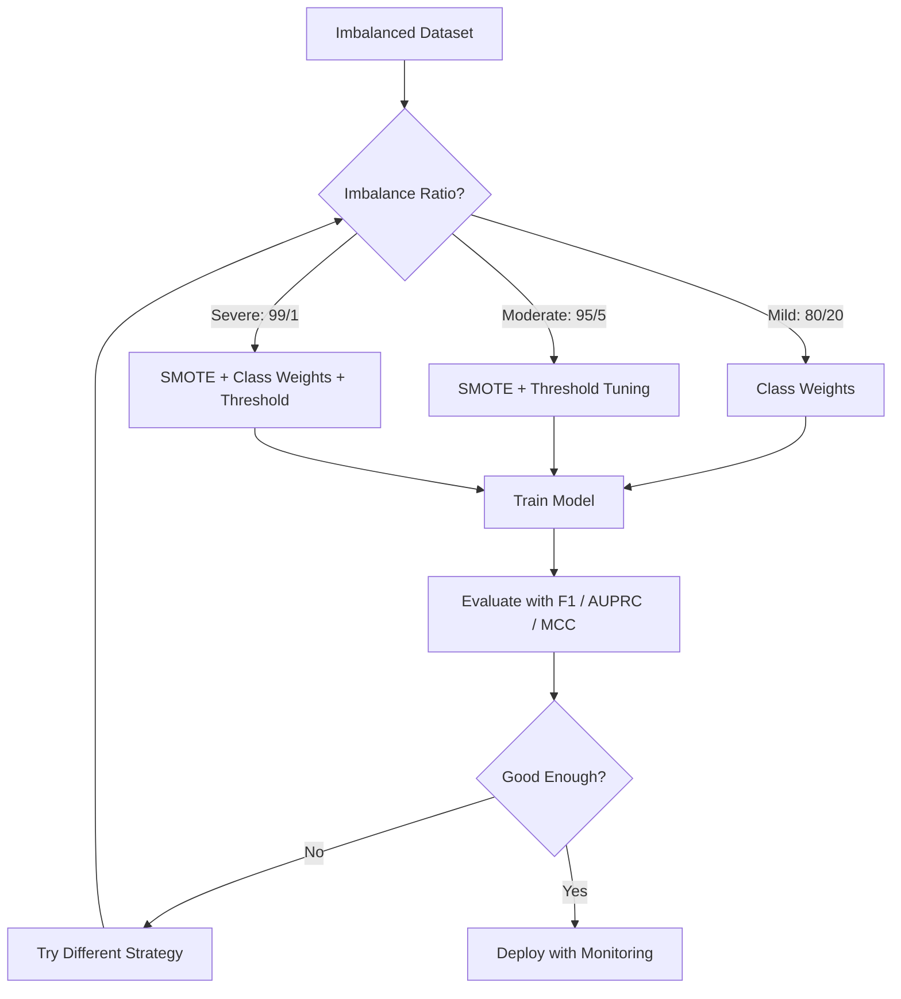
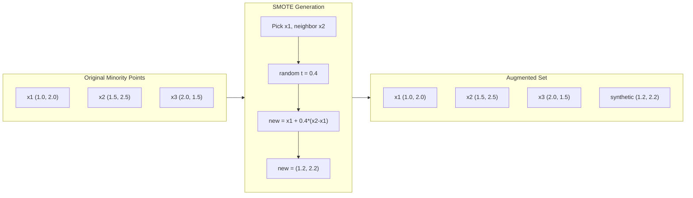
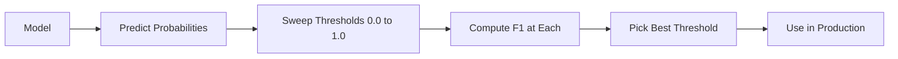
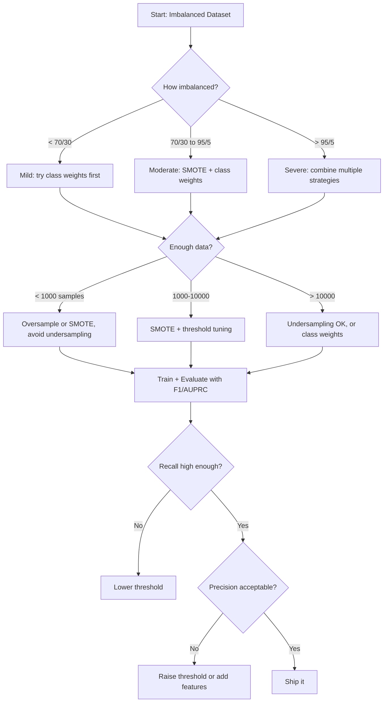

# التعامل مع البيانات غير المتوازنة
> عندما تكون 99% من بياناتك "طبيعية"، فإن الدقة كذبة.
**النوع:** بناء
** اللغة: ** بايثون
**المتطلبات الأساسية:** المرحلة الثانية، الدروس 01-09 (خاصة مقاييس التقييم)
**الوقت:** ~90 دقيقة
## أهداف التعلم
- تنفيذ SMOTE من الصفر وشرح كيفية اختلاف المعاينة التركيبية عن التكرار العشوائي
- تقييم المصنفات غير المتوازنة باستخدام F1، AUPRC، ومعامل ارتباط ماثيوز بدلاً من الدقة
- قارن بين ترجيح الفئة وضبط العتبة واستراتيجيات إعادة التشكيل واختيار النهج الصحيح لنسبة عدم التوازن المحددة
- إنشاء خط بيانات غير متوازن كامل pipeline يجمع بين SMOTE وأوزان الفئات وتحسين العتبة
## المشكلة
يمكنك إنشاء نموذج للكشف عن الاحتيال. تحصل على دقة 99.9%. أنت تحتفل. ثم تدرك أنه يتوقع "عدم الاحتيال" لكل معاملة على حدة.
هذه ليست علة. وهذا هو التصرف العقلاني عندما تكون 0.1% فقط من المعاملات احتيالية. يتعلم النموذج أن التخمين الدائم لفئة الأغلبية يقلل من الخطأ الإجمالي. إنه صحيح من الناحية الفنية وغير مجدي تمامًا.
يحدث هذا في كل مكان يهم فيه التصنيف الحقيقي. تشخيص المرض: نسبة إيجابية 1%. اختراق الشبكة: هجمات 0.01%. عيوب التصنيع: عيب بنسبة 0.5%. تصفية البريد العشوائي: 20% بريد عشوائي. توقع المخضض: 5% مخضض. كلما كانت طبقة الأقلية أكثر أهمية، كلما كانت أكثر ندرة.
تفشل الدقة لأنها تعامل جميع التنبؤات الصحيحة بالتساوي. يُعد تصنيف معاملة legitimate بشكل صحيح والكشف عن عمليات الاحتيال بشكل صحيح بمثابة نقطة دقة واحدة. لكن اكتشاف الاحتيال هو السبب الكامل لوجود النموذج. نحن بحاجة إلى مقاييس وتقنيات واستراتيجيات تدريب تجبر النموذج على الاهتمام بالفئة النادرة ولكنها مهمة.
##المفهوم
### لماذا تفشل الدقة
خذ بعين الاعتبار مجموعة بيانات تحتوي على 1000 عينة: 990 عينة سلبية و10 إيجابية. النموذج الذي يتنبأ دائمًا بالسلبية:
|  | توقع إيجابي | توقع سلبي |
|--|---|---|
| في الواقع إيجابي | 0 (TP) | 10 (__ مصطلح_1__) |
| في الواقع سلبي | 0 (FP) | 990 (TN) |
الدقة = (0 + 990) / 1000 = 99.0%
لا يلتقط النموذج أي احتيال. مرض صفر. صفر عيوب. لكن الدقة تقول 99%. وهذا هو السبب في أن الدقة تشكل خطورة بالنسبة للمشاكل غير المتوازنة.
### مقاييس أفضل
**الدقة** = TP / (TP + FP). من بين كل الأشياء التي تم تصنيفها على أنها إيجابية، كم عددها بالفعل؟ الدقة العالية تعني القليل من الإنذارات الكاذبة.
**استدعاء** = TP / (TP + FN). من بين كل شيء إيجابي في الواقع، كم عدد الذين عثرنا عليهم؟ الاستدعاء العالي يعني القليل من الإيجابيات المفقودة.
**F1 النتيجة** = 2 * الدقة * الاستدعاء / (الدقة + الاستدعاء). الوسط التوافقي. يعاقب الاختلال الشديد بين الدقة والتذكر أكثر من المتوسط ​​الحسابي.
**نقاط F-beta** = (1 + بيتا^2) * الدقة * الاستدعاء / (بيتا^2 * الدقة + الاستدعاء). عندما يكون بيتا > 1، يكون التذكر أكثر أهمية. عندما تكون قيمة بيتا <1، تكون الدقة أكثر أهمية. F2 أمر شائع في اكتشاف الاحتيال (فقدان الاحتيال أسوأ من الإنذار الكاذب).
**AUPRC** (المنطقة تحت منحنى الاستدعاء الدقيق). مثل AUC-ROC ولكنه أكثر إفادة للبيانات غير المتوازنة. يحتوي المصنف العشوائي على AUPRC يساوي معدل الفصل الإيجابي (وليس 0.5 مثل ROC). من الأسهل رؤية تحسينات make هذه.
** معامل ارتباط ماثيوز ** = (TP * TN - FP * FN) / sqrt((TP+FP)(TP+FN)(TN+FP)(TN+FN)). يتراوح من -1 إلى +1. يعطي درجة عالية فقط عندما يكون أداء النموذج جيدًا في كلا الفئتين. متوازن حتى عندما تكون الفصول ذات أحجام مختلفة جدًا.
بالنسبة لنموذج "التنبؤ السلبي دائمًا" أعلاه: الدقة = 0/0 (غير محددة، غالبًا ما يتم ضبطها على 0)، تذكر = 0/10 = 0، F1 = 0، MCC = 0. تحدد هذه المقاييس النموذج بشكل صحيح على أنه لا قيمة له.
### خط البيانات غير المتوازن


### SMOTE: تقنية الإفراط في أخذ عينات الأقليات الاصطناعية
إن الإفراط في أخذ العينات العشوائية يكرر عينات الأقليات الموجودة. يعمل هذا ولكنه يخاطر بالتركيب الزائد لأن النموذج يرى نقاطًا متطابقة بشكل متكرر.
SMOTE ينشئ عينات أقلية اصطناعية جديدة تكون معقولة ولكنها ليست نسخًا. الخوارزمية:
1. لكل عينة أقلية x، ابحث عن أقرب جيرانها k من بين عينات الأقليات الأخرى
2. اختر جارًا واحدًا عشوائيًا
3. قم بإنشاء عينة جديدة على مقطع الخط بين x وذلك الجار
الصيغة: `new_sample = x + random(0, 1) * (neighbor - x)`
وهذا يقحم بين نقاط الأقلية الحقيقية، مما يؤدي إلى إنشاء عينات في نفس المنطقة من مساحة الميزة دون مجرد نسخ البيانات الموجودة.


### مقارنة استراتيجيات أخذ العينات
**الإفراط العشوائي في أخذ العينات**: تكرار عينات الأقلية لتتناسب مع عدد الأغلبية.
- الإيجابيات: بسيط، لا فقدان للمعلومات
- السلبيات: التكرارات الدقيقة تسبب فرط التجهيز، وتزيد من وقت التدريب
**الاختزال العشوائي**: قم بإزالة عينات الأغلبية لمطابقة عدد الأقليات.
- الإيجابيات: تدريب سريع، بسيط
- السلبيات: يؤدي إلى استبعاد بيانات الأغلبية التي قد تكون مفيدة، وزيادة التباين
**SMOTE**: إنشاء عينات أقلية تركيبية عبر الاستيفاء.
- الإيجابيات: يولد نقاط بيانات جديدة، ويقلل من الإفراط في التجهيز مقارنة بالإفراط العشوائي في أخذ العينات
- السلبيات: يمكن إنشاء عينات صاخبة بالقرب من حدود القرار، ولا تأخذ في الاعتبار التوزيع الطبقي للأغلبية
| استراتيجية | تم تغيير البيانات | خطر | متى تستخدم |
|----------|------------|-----|-------------|
| عينة زائدة | الأقليات مكررة | التجهيز الزائد | مجموعات بيانات صغيرة، اختلال معتدل |
| نموذج سفلي | تمت إزالة الأغلبية | فقدان المعلومات | مجموعات بيانات كبيرة، تحتاج إلى تدريب سريع |
| SMOTE | تمت إضافة الأقلية الاصطناعية | ضجيج الحدود | خلل معتدل، عينات أقلية كافية لـ k-NN |
###أوزان الفئة
بدلاً من تغيير البيانات، قم بتغيير كيفية تعامل النموذج مع الأخطاء. إعطاء أهمية أكبر للتصنيف الخاطئ لطبقة الأقلية.
بالنسبة لمشكلة ثنائية تحتوي على 950 عينة سلبية و50 عينة إيجابية:
- الوزن للفئة السالبة = n_samples / (2 * n_negative) = 1000 / (2 * 950) = 0.526
- الوزن للفئة الموجبة = n_samples / (2 * n_positive) = 1000 / (2 * 50) = 10.0
الفئة الإيجابية تحصل على 19x الوزن. إن الخطأ في تصنيف عينة إيجابية واحدة يكلف بقدر الخطأ في تصنيف 19 عينة سلبية. يضطر النموذج إلى الاهتمام بفئة الأقلية.
في الانحدار اللوجستي، يؤدي هذا إلى تعديل وظيفة الخسارة:
```
weighted_loss = -sum(w_i * [y_i * log(p_i) + (1-y_i) * log(1-p_i)])
```

حيث w_i يعتمد على فئة العينة i.
أوزان الفئة تعادل رياضيًا الإفراط في التوقع، ولكن دون إنشاء نقاط بيانات جديدة. وهذا make يجعلها أسرع ويتجنب خطر الإفراط في التجهيز للعينات المكررة.
### ضبط العتبة
تنتج معظم المصنفات احتمالًا. العتبة الافتراضية هي 0.5: إذا كانت P(موجبة) >= 0.5، فتوقع إيجابية. لكن 0.5 تعسفي. عندما تكون الطبقات غير متوازنة، عادة ما تكون العتبة المثالية أقل بكثير.
العملية:
1. تدريب نموذج
2. احصل على الاحتمالات المتوقعة في مجموعة التحقق من الصحة
3. اكتساح العتبات من 0.0 إلى 1.0
4. قم بحساب F1 (أو المقياس الذي اخترته) عند كل عتبة
5. اختر الحد الأقصى الذي يزيد مقياسك إلى الحد الأقصى


قد ينتج النموذج P(fraud) = 0.15 لمعاملة احتيالية. عند عتبة 0.5، يتم تصنيف هذا على أنه ليس احتيالًا. عند عتبة 0.10، تم اكتشافه بشكل صحيح. إن معايرة الاحتمالات أقل أهمية من التصنيف - فطالما أن الاحتيال يحصل على احتمالات أعلى من احتمالات عدم الاحتيال، فهناك عتبة تفصل بينهما.
### التعلم الحساس للتكلفة
تعميم الأوزان الطبقية. بدلاً من التكاليف الموحدة، قم بتعيين تكاليف تصنيف خاطئ محددة:
| | توقع إيجابي | توقع سلبي |
|--|---|---|
| في الواقع إيجابي | 0 (صحيح) | C_FN = 100 |
| في الواقع سلبي | C_FP = 1 | 0 (صحيح) |
إن فقدان معاملة احتيالية (FN) يكلف 100 مرة أكثر من الإنذار الكاذب (FP). يقوم النموذج بتحسين التكلفة الإجمالية، وليس إجمالي عدد الأخطاء.
هذا هو النهج الأكثر مبادئًا عندما يمكنك تقدير تكاليف العالم الحقيقي. تكلفة تشخيص السرطان المفقود تختلف تمامًا عن تكلفة الإنذار الكاذب الذي يؤدي إلى إجراء خزعة إضافية. إن توضيح هذه التكاليف يفرض المقايضات الصحيحة.
### مخطط انسيابي للقرار


## بنائها
### الخطوة 1: إنشاء مجموعة بيانات غير متوازنة
```python
import numpy as np


def make_imbalanced_data(n_majority=950, n_minority=50, seed=42):
    rng = np.random.RandomState(seed)

    X_maj = rng.randn(n_majority, 2) * 1.0 + np.array([0.0, 0.0])
    X_min = rng.randn(n_minority, 2) * 0.8 + np.array([2.5, 2.5])

    X = np.vstack([X_maj, X_min])
    y = np.concatenate([np.zeros(n_majority), np.ones(n_minority)])

    shuffle_idx = rng.permutation(len(y))
    return X[shuffle_idx], y[shuffle_idx]
```

### الخطوة الثانية: SMOTE من الصفر
```python
def euclidean_distance(a, b):
    return np.sqrt(np.sum((a - b) ** 2))


def find_k_neighbors(X, idx, k):
    distances = []
    for i in range(len(X)):
        if i == idx:
            continue
        d = euclidean_distance(X[idx], X[i])
        distances.append((i, d))
    distances.sort(key=lambda x: x[1])
    return [d[0] for d in distances[:k]]


def smote(X_minority, k=5, n_synthetic=100, seed=42):
    rng = np.random.RandomState(seed)
    n_samples = len(X_minority)
    k = min(k, n_samples - 1)
    synthetic = []

    for _ in range(n_synthetic):
        idx = rng.randint(0, n_samples)
        neighbors = find_k_neighbors(X_minority, idx, k)
        neighbor_idx = neighbors[rng.randint(0, len(neighbors))]
        t = rng.random()
        new_point = X_minority[idx] + t * (X_minority[neighbor_idx] - X_minority[idx])
        synthetic.append(new_point)

    return np.array(synthetic)
```

### الخطوة 3: المعاينة العشوائية والناقصة
```python
def random_oversample(X, y, seed=42):
    rng = np.random.RandomState(seed)
    classes, counts = np.unique(y, return_counts=True)
    max_count = counts.max()

    X_resampled = list(X)
    y_resampled = list(y)

    for cls, count in zip(classes, counts):
        if count < max_count:
            cls_indices = np.where(y == cls)[0]
            n_needed = max_count - count
            chosen = rng.choice(cls_indices, size=n_needed, replace=True)
            X_resampled.extend(X[chosen])
            y_resampled.extend(y[chosen])

    X_out = np.array(X_resampled)
    y_out = np.array(y_resampled)
    shuffle = rng.permutation(len(y_out))
    return X_out[shuffle], y_out[shuffle]


def random_undersample(X, y, seed=42):
    rng = np.random.RandomState(seed)
    classes, counts = np.unique(y, return_counts=True)
    min_count = counts.min()

    X_resampled = []
    y_resampled = []

    for cls in classes:
        cls_indices = np.where(y == cls)[0]
        chosen = rng.choice(cls_indices, size=min_count, replace=False)
        X_resampled.extend(X[chosen])
        y_resampled.extend(y[chosen])

    X_out = np.array(X_resampled)
    y_out = np.array(y_resampled)
    shuffle = rng.permutation(len(y_out))
    return X_out[shuffle], y_out[shuffle]
```

### الخطوة 4: الانحدار اللوجستي مع أوزان الفئة
```python
def sigmoid(z):
    return 1.0 / (1.0 + np.exp(-np.clip(z, -500, 500)))


def logistic_regression_weighted(X, y, weights, lr=0.01, epochs=200):
    n_samples, n_features = X.shape
    w = np.zeros(n_features)
    b = 0.0

    for _ in range(epochs):
        z = X @ w + b
        pred = sigmoid(z)
        error = pred - y
        weighted_error = error * weights

        gradient_w = (X.T @ weighted_error) / n_samples
        gradient_b = np.mean(weighted_error)

        w -= lr * gradient_w
        b -= lr * gradient_b

    return w, b


def compute_class_weights(y):
    classes, counts = np.unique(y, return_counts=True)
    n_samples = len(y)
    n_classes = len(classes)
    weight_map = {}
    for cls, count in zip(classes, counts):
        weight_map[cls] = n_samples / (n_classes * count)
    return np.array([weight_map[yi] for yi in y])
```

### الخطوة 5: ضبط العتبة
```python
def find_optimal_threshold(y_true, y_probs, metric="f1"):
    best_threshold = 0.5
    best_score = -1.0

    for threshold in np.arange(0.05, 0.96, 0.01):
        y_pred = (y_probs >= threshold).astype(int)
        tp = np.sum((y_pred == 1) & (y_true == 1))
        fp = np.sum((y_pred == 1) & (y_true == 0))
        fn = np.sum((y_pred == 0) & (y_true == 1))

        if metric == "f1":
            precision = tp / (tp + fp) if (tp + fp) > 0 else 0.0
            recall = tp / (tp + fn) if (tp + fn) > 0 else 0.0
            score = 2 * precision * recall / (precision + recall) if (precision + recall) > 0 else 0.0
        elif metric == "recall":
            score = tp / (tp + fn) if (tp + fn) > 0 else 0.0
        elif metric == "precision":
            score = tp / (tp + fp) if (tp + fp) > 0 else 0.0

        if score > best_score:
            best_score = score
            best_threshold = threshold

    return best_threshold, best_score
```

### الخطوة 6: وظائف التقييم
```python
def confusion_matrix_values(y_true, y_pred):
    tp = np.sum((y_pred == 1) & (y_true == 1))
    tn = np.sum((y_pred == 0) & (y_true == 0))
    fp = np.sum((y_pred == 1) & (y_true == 0))
    fn = np.sum((y_pred == 0) & (y_true == 1))
    return tp, tn, fp, fn


def compute_metrics(y_true, y_pred):
    tp, tn, fp, fn = confusion_matrix_values(y_true, y_pred)
    accuracy = (tp + tn) / (tp + tn + fp + fn)
    precision = tp / (tp + fp) if (tp + fp) > 0 else 0.0
    recall = tp / (tp + fn) if (tp + fn) > 0 else 0.0
    f1 = 2 * precision * recall / (precision + recall) if (precision + recall) > 0 else 0.0

    denom = np.sqrt(float((tp + fp) * (tp + fn) * (tn + fp) * (tn + fn)))
    mcc = (tp * tn - fp * fn) / denom if denom > 0 else 0.0

    return {
        "accuracy": accuracy,
        "precision": precision,
        "recall": recall,
        "f1": f1,
        "mcc": mcc,
    }
```

### الخطوة 7: قارن بين جميع الأساليب
```python
X, y = make_imbalanced_data(950, 50, seed=42)
split = int(0.8 * len(y))
X_train, X_test = X[:split], X[split:]
y_train, y_test = y[:split], y[split:]

# Baseline: no treatment
w_base, b_base = logistic_regression_weighted(
    X_train, y_train, np.ones(len(y_train)), lr=0.1, epochs=300
)
probs_base = sigmoid(X_test @ w_base + b_base)
preds_base = (probs_base >= 0.5).astype(int)

# Oversampled
X_over, y_over = random_oversample(X_train, y_train)
w_over, b_over = logistic_regression_weighted(
    X_over, y_over, np.ones(len(y_over)), lr=0.1, epochs=300
)
preds_over = (sigmoid(X_test @ w_over + b_over) >= 0.5).astype(int)

# SMOTE
minority_mask = y_train == 1
X_minority = X_train[minority_mask]
synthetic = smote(X_minority, k=5, n_synthetic=len(y_train) - 2 * int(minority_mask.sum()))
X_smote = np.vstack([X_train, synthetic])
y_smote = np.concatenate([y_train, np.ones(len(synthetic))])
w_sm, b_sm = logistic_regression_weighted(
    X_smote, y_smote, np.ones(len(y_smote)), lr=0.1, epochs=300
)
preds_smote = (sigmoid(X_test @ w_sm + b_sm) >= 0.5).astype(int)

# Class weights
sample_weights = compute_class_weights(y_train)
w_cw, b_cw = logistic_regression_weighted(
    X_train, y_train, sample_weights, lr=0.1, epochs=300
)
probs_cw = sigmoid(X_test @ w_cw + b_cw)
preds_cw = (probs_cw >= 0.5).astype(int)

# Threshold tuning (tune on held-out validation set, not test set)
probs_val = sigmoid(X_val @ w_cw + b_cw)
best_thresh, best_f1 = find_optimal_threshold(y_val, probs_val, metric="f1")
preds_thresh = (probs_cw >= best_thresh).astype(int)
```

يقوم ملف التعليمات البرمجية بتشغيل كل هذا في برنامج نصي واحد وطباعة النتائج.
## استخدمه
مع scikit-learn والتعلم غير المتوازن، تكون هذه التقنيات عبارة عن سطر واحد:
```python
from sklearn.linear_model import LogisticRegression
from sklearn.metrics import classification_report, f1_score
from sklearn.model_selection import train_test_split
from imblearn.over_sampling import SMOTE
from imblearn.under_sampling import RandomUnderSampler
from imblearn.pipeline import Pipeline

X_train, X_test, y_train, y_test = train_test_split(X, y, stratify=y)

model_weighted = LogisticRegression(class_weight="balanced")
model_weighted.fit(X_train, y_train)
print(classification_report(y_test, model_weighted.predict(X_test)))

smote = SMOTE(random_state=42)
X_resampled, y_resampled = smote.fit_resample(X_train, y_train)
model_smote = LogisticRegression()
model_smote.fit(X_resampled, y_resampled)
print(classification_report(y_test, model_smote.predict(X_test)))

pipeline = Pipeline([
    ("smote", SMOTE()),
    ("model", LogisticRegression(class_weight="balanced")),
])
pipeline.fit(X_train, y_train)
print(classification_report(y_test, pipeline.predict(X_test)))
```

تُظهر التطبيقات من البداية بالضبط ما تفعله كل تقنية. SMOTE هو مجرد k-NN استيفاء على فئة الأقلية. أوزان الفئة تضاعف الخسارة. ضبط العتبة عبارة عن حلقة فوق القطع. لا سحر.
## اشحنها
ينتج هذا الدرس:
- `outputs/skill-imbalanced-data.md` -- قائمة مرجعية للتعامل مع مشكلات التصنيف غير المتوازنة
## تمارين
1. **Borderline-SMOTE**: قم بتعديل تطبيق SMOTE لإنشاء عينات تركيبية فقط لنقاط الأقلية القريبة من حدود القرار (أولئك الذين يشتمل جيرانهم الأقرب إلى عينات فئة الأغلبية). قارن النتائج بالمعيار SMOTE في مجموعة بيانات تتداخل فيها الفئات.
2. **تحسين مصفوفة التكلفة**: تنفيذ التعلم الحساس للتكلفة حيث تكون مصفوفة التكلفة معلمة. قم بإنشاء دالة تأخذ مصفوفة التكلفة وتقوم بإرجاع التنبؤات المثالية التي تقلل التكلفة المتوقعة. اختبر باستخدام نسب تكلفة مختلفة (1:10، 1:100، 1:1000) ورسم كيفية تغير مقايضة الاستدعاء الدقيق.
3. **معايرة العتبة**: تنفيذ مقياس بلات (تناسب الانحدار اللوجستي على المخرجات الأولية للنموذج لإنتاج احتمالات تمت معايرتها). قارن منحنى استدعاء الدقة قبل المعايرة وبعدها. أظهر أن المعايرة لا تغير الترتيب (AUC يظل كما هو) ولكن make تجعل الاحتمالات أكثر أهمية.
4. **مجموعة ذات تعبئة متوازنة**: قم بتدريب نماذج متعددة، كل منها على عينة تمهيدية متوازنة (جميع الأقليات + مجموعة فرعية عشوائية من الأغلبية). متوسط ​​توقعاتهم. قارن هذا الأسلوب بنموذج واحد باستخدام SMOTE. قياس كل من الأداء والتباين عبر عمليات التشغيل.
5. **تجربة نسبة عدم التوازن**: خذ مجموعة بيانات متوازنة وقم بزيادة نسبة عدم التوازن تدريجيًا (50/50، 70/30، 90/10، 95/5، 99/1). لكل نسبة، تدرب باستخدام SMOTE وبدونه. ارسم F1 مقابل نسبة عدم التوازن لكلا النهجين. بأي نسبة يبدأ SMOTE في إحداث فرق ذي معنى؟
## المصطلحات الرئيسية
| مصطلح | ماذا يقول الناس | ماذا يعني في الواقع |
|------|----------------|----------------------|
| عدم التوازن الطبقي | "يحتوي الفصل الواحد على المزيد من العينات" | إن توزيع الفئات في مجموعة البيانات منحرف بشكل كبير، مما يجعل النماذج تفضل فئة الأغلبية |
| SMOTE | "الإفراط في العينات الاصطناعية" | ينشئ عينات أقلية جديدة عن طريق الاستيفاء بين عينات الأقليات الموجودة وأقرب جيرانها من الأقليات |
| أوزان الطبقة | "جعل الأخطاء في الفئات النادرة أكثر تكلفة" | ضرب دالة الخسارة بالأوزان الخاصة بالفئة بحيث يعاقب النموذج سوء تصنيف الأقليات بشكل أكبر |
| ضبط العتبة | "تحريك حدود القرار" | تغيير حد الاحتمال للتصنيف من القيمة الافتراضية 0.5 إلى قيمة تعمل على تحسين المقياس المطلوب |
| مقايضة الاستدعاء الدقيق | "لا يمكنك الحصول على كليهما" | يؤدي خفض الحد إلى التقاط المزيد من الإيجابيات (استدعاء أعلى)، ولكنه يشير أيضًا إلى المزيد من الإيجابيات الخاطئة (دقة أقل)، والعكس صحيح |
| __المصطلح_1__ | "المساحة الواقعة أسفل منحنى PR" | يلخص منحنى الاسترجاع الدقيق في رقم واحد؛ أكثر إفادة من AUC-ROC عندما تكون الفصول الدراسية غير متوازنة بشكل كبير |
| معامل ارتباط ماثيوز | "المقياس المتوازن" | ارتباط بين التسميات المتوقعة والفعلية ينتج عنه درجة عالية فقط عندما يكون أداء النموذج جيدًا في كلا الفئتين |
| التعلم الحساس للتكلفة | "الأخطاء المختلفة تكلف مبالغ مختلفة" | دمج تكاليف التصنيف الخاطئ في العالم الحقيقي في هدف التدريب بحيث يعمل النموذج على تحسين التكلفة الإجمالية، وليس عدد الأخطاء |
| الإفراط العشوائي | "تكرار الأقلية" | تكرار عينات فئة الأقلية لتحقيق التوازن في أعداد الطبقات؛ بسيطة ولكنها تخاطر بالتركيب الزائد على النقاط المكررة |
## مزيد من القراءة
- [SMOTE: Synthetic Minority Over-sampling Technique (Chawla et al., 2002)](https://arxiv.org/abs/1106.1813) -- ورقة SMOTE الأصلية، لا تزال أكثر الأعمال التي تم الاستشهاد بها حول التعلم غير المتوازن
- [Learning from Imbalanced Data (He & Garcia, 2009)](https://ieeexplore.ieee.org/document/5128907) -- استطلاع شامل يغطي أساليب أخذ العينات والتكلفة الحساسة والخوارزميات
- [imbalanced-learn documentation](https://imbalanced-learn.org/stable/) -- مكتبة Python بمتغيرات SMOTE وإستراتيجيات الاختزال وتكامل pipeline
- [The Precision-Recall Plot Is More Informative than the ROC Plot (Saito & Rehmsmeier, 2015)](https://journals.plos.org/plosone/article?id=10.1371/journal.pone.0118432) -- متى ولماذا نفضل منحنيات PR على منحنيات ROC للمشاكل غير المتوازنة