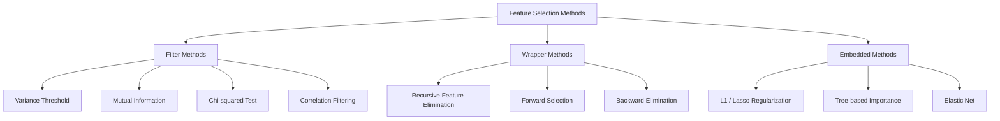
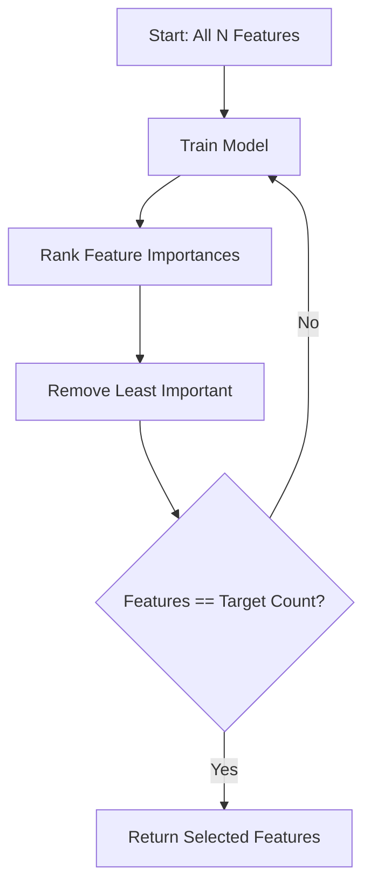
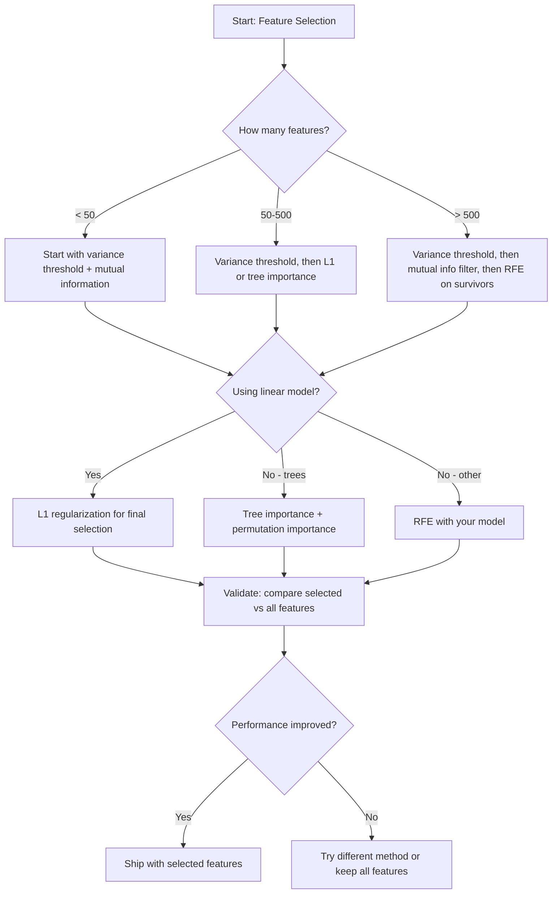

# Feature Selection

> المزيد من الميزات ليست أفضل. الميزات الصحيحة أفضل.

**النوع:** بناء
** اللغة: ** بايثون
**المتطلبات الأساسية:** المرحلة الثانية، الدروس 01-09، 08 (الهندسة المميزة)
**الوقت:** ~75 دقيقة

## Learning Objectives

- تنفيذ طرق التصفية (عتبة التباين، المعلومات المتبادلة، مربع كاي) وطرق التغليف (RFE، التحديد الأمامي) من البداية
- اشرح لماذا تلتقط المعلومات المتبادلة العلاقات غير الخطية بين المعالم والأهداف والتي يفتقدها الارتباط
- قارن التسوية L1 (الاختيار المضمن) مع RFE (اختيار الغلاف) وتقييم المفاضلات الحسابية الخاصة بها
- إنشاء مجموعة مختارة من الميزات pipeline التي تجمع بين طرق متعددة وإظهار التعميم المحسن على البيانات المعلقة

## The Problem

لديك 500 ميزة. يتدرب نموذجك ببطء، ويتناسب باستمرار، ولا يستطيع أحد أن يشرح ما تعلمه. يمكنك إضافة المزيد من الميزات على أمل تحسين الأداء. الأمر يزداد سوءا.

هذه هي لعنة الأبعاد في العمل. مع زيادة عدد الميزات، ينفجر حجم مساحة الميزة. تصبح نقاط البيانات متفرقة. المسافات بين النقاط تتلاقى. يحتاج النموذج إلى المزيد من البيانات بشكل كبير للعثور على أنماط حقيقية. ميزات الضوضاء تطغى على ميزات الإشارة. يصبح التجهيز الزائد هو الوضع الافتراضي.

اختيار الميزة هو الترياق. تخلص من الضوضاء. إزالة التكرار. احتفظ بالميزات التي تحمل معلومات فعلية عن الهدف. النتيجة: تدريب أسرع، وتعميم أفضل، ونماذج يمكنك شرحها بالفعل.

الهدف ليس استخدام جميع المعلومات المتاحة. هو استخدام المعلومات الصحيحة.

## The Concept

### Three Categories of Feature Selection

تنقسم كل طريقة لاختيار الميزة إلى واحدة من ثلاث فئات:



**طرق التصفية** تسجل كل ميزة بشكل مستقل باستخدام مقياس إحصائي. إنهم لا يستخدمون النموذج. سريع، لكنهم يفتقدون التفاعلات المميزة.

**طرق التغليف** تدرب النموذج على تقييم مجموعات فرعية من الميزات. يستخدمون أداء النموذج كنتيجة. نتائج أفضل، ولكنها مكلفة لأنهم يعيدون تدريب النموذج عدة مرات.

**الطرق المضمنة** حدد الميزات كجزء من التدريب النموذجي. L1 التسوية تدفع الأوزان إلى الصفر. تنقسم أشجار القرار إلى الميزات الأكثر فائدة. يتم الاختيار أثناء التركيب، وليس كخطوة منفصلة.

### Variance Threshold

أبسط مرشح. إذا كانت الميزة بالكاد تختلف عبر العينات، فإنها لا تحمل أي معلومات تقريبًا.

خذ بعين الاعتبار الميزة التي تبلغ 0.0 لـ 999 من أصل 1000 عينة. تباينه قريب من الصفر. لا يمكن لأي نموذج استخدامه للتمييز بين الفئات. إزالته.

```
variance(x) = mean((x - mean(x))^2)
```

تعيين عتبة (على سبيل المثال، 0.01). قم بإسقاط كل ميزة مع التباين الموجود أسفلها. يؤدي هذا إلى إزالة الميزات الثابتة أو شبه الثابتة دون النظر إلى المتغير المستهدف على الإطلاق.

متى يتم استخدامه: كخطوة معالجة قبل الطرق الأخرى. من الواضح أنه يلتقط ميزات عديمة الفائدة بتكلفة تقترب من الصفر.

القيد: يمكن أن تحتوي الميزة على تباين عالٍ وتظل ضوضاء خالصة. عتبة التباين ضرورية ولكنها ليست كافية.

### Mutual Information

تقيس المعلومات المتبادلة مدى معرفة قيمة الميزة X مما يقلل من عدم اليقين بشأن الهدف Y.

```
I(X; Y) = sum_x sum_y p(x, y) * log(p(x, y) / (p(x) * p(y)))
```

إذا كان X وY مستقلين، p(x, y) = p(x) * p(y)، لذا فإن حد السجل هو صفر وI(X; Y) = 0. كلما أخبرتك X عن Y، زادت المعلومات المتبادلة.

الميزة الرئيسية على الارتباط: المعلومات المتبادلة تلتقط العلاقات غير الخطية. قد يكون للميزة ارتباط صفري بالهدف ولكن معلومات متبادلة عالية لأن العلاقة تربيعية أو دورية.

بالنسبة للميزات المستمرة، قم بتقسيمها إلى صناديق أولاً (تقدير يعتمد على الرسم البياني). يؤثر عدد الصناديق على التقدير - عدد قليل جدًا من الصناديق يفقد المعلومات، وعدد كبير جدًا من الصناديق يضيف ضوضاء. خيار شائع: صناديق sqrt(n) أو قاعدة Sturges (1 + log2(n)).


### Recursive Feature Elimination (RFE)

RFE هي طريقة تغليف. يستخدم أهمية الميزة الخاصة بالنموذج للتقليم بشكل متكرر:

1. تدريب النموذج بجميع الميزات
2. ترتيب المعالم حسب الأهمية (معاملات النماذج الخطية، تقليل الشوائب للأشجار)
3. قم بإزالة الميزة (الميزات) الأقل أهمية
4. كرر ذلك حتى يبقى العدد المطلوب من الميزات



RFE يأخذ في الاعتبار تفاعلات الميزات لأن النموذج يرى جميع الميزات المتبقية معًا. تؤدي إزالة ميزة واحدة إلى تغيير أهمية الميزات الأخرى. وهذا make أكثر شمولاً من طرق التصفية.

التكلفة: تقوم بتدريب النموذج N - الأوقات المستهدفة. مع 500 ميزة وهدف 10، أي 490 دورة تدريبية. بالنسبة للنماذج باهظة الثمن، هذا بطيء. يمكنك تسريعها عن طريق إزالة ميزات متعددة في كل خطوة (على سبيل المثال، إزالة الـ 10% السفلية في كل جولة).

### L1 (Lasso) Regularization

L1 يضيف التنظيم القيمة المطلقة للأوزان إلى دالة الخسارة:

```
loss = prediction_error + alpha * sum(|w_i|)
```

تتحكم معلمة ألفا في مدى قوة تشذيب الميزات. ألفا الأعلى يعني أن المزيد من الأوزان تصل إلى الصفر بالضبط.

لماذا بالضبط صفر؟ عقوبة L1 تخلق منطقة تقييد على شكل معين في مساحة الوزن. الحل الأمثل يميل إلى الهبوط في زاوية هذه الماسة، حيث يكون وزن واحد أو أكثر صفرًا. L2 التسوية (الريدج) تخلق قيدًا دائريًا حيث تتقلص الأوزان ولكنها نادرًا ما تصل إلى الصفر.

هذا هو اختيار الميزات المضمن: يتعلم النموذج أثناء التدريب الميزات التي يجب تجاهلها. تتم إزالة الميزات ذات الوزن الصفري بشكل فعال.

المزايا: تشغيل تدريبي واحد، ومعالجة الميزات المترابطة (يختار واحدًا ويصفّر الباقي)، وهو مدمج في معظم تطبيقات النماذج الخطية.

القيد: يعمل فقط مع النماذج الخطية. لا يمكن التقاط أهمية الميزة غير الخطية.

### Tree-Based Feature Importance

تقوم أشجار القرار ومجموعاتها (الغابات العشوائية وتعزيز التدرج) بترتيب الميزات بشكل طبيعي. كل انقسام يقلل من الشوائب (جيني أو الإنتروبيا للتصنيف، التباين للانحدار). تعتبر الميزات التي تنتج تخفيضات أكبر في الشوائب أكثر أهمية.

بالنسبة إلى غابة عشوائية بها أشجار T:

```
importance(feature_j) = (1/T) * sum over all trees of
    sum over all nodes splitting on feature_j of
        (n_samples * impurity_decrease)
```

وهذا يعطي درجة أهمية طبيعية لكل ميزة. يتعامل مع العلاقات غير الخطية وتفاعلات الميزات تلقائيًا.

تنبيه: تنحاز الأهمية المستندة إلى الشجرة نحو الميزات ذات القيم الفريدة العديدة (القيمة الأساسية العالية). سيظهر العمود ID العشوائي مهمًا لأنه يقسم كل عينة بشكل مثالي. استخدم أهمية التقليب كفحص للعقلانية.

### Permutation Importance

الطريقة اللانموذجية:

1. تدريب النموذج وتسجيل الأداء الأساسي على بيانات التحقق من الصحة
2. بالنسبة لكل ميزة: قم بخلط قيمها بشكل عشوائي، وقياس الانخفاض في الأداء
3. كلما كان الانخفاض أكبر، زادت أهمية الميزة

إذا كان التبديل العشوائي لميزة ما لا يضر بالأداء، فإن النموذج لا يعتمد عليه. إذا انهار الأداء، فهذه الميزة بالغة الأهمية.

تتجنب أهمية التقليب التحيز الأساسي للأهمية القائمة على الشجرة. ولكنه بطيء: تقييم كامل واحد لكل ميزة، يتكرر عدة مرات لتحقيق الاستقرار.

### Comparison Table

| الطريقة | اكتب | السرعة | غير خطية | تفاعلات مميزة |
|--------|------|-------|-----------|---------------------|
| عتبة التباين | تصفية | سريع جدًا | لا | لا |
| معلومات متبادلة | تصفية | سريع | نعم | لا |
| مرشح الارتباط | تصفية | سريع | لا | لا |
| RFE | المجمع | بطيء | يعتمد على الموديل | نعم |
| L1 / لاسو | مضمن | سريع | لا (خطي) | لا |
| أهمية الشجرة | مضمن | متوسطة | نعم | نعم |
| أهمية التقليب | نموذج ملحد | بطيء | نعم | نعم |

### Decision Flowchart



## Build It

### Step 1: Generate synthetic data with known feature structure

```python
import numpy as np


def make_feature_selection_data(n_samples=500, seed=42):
    rng = np.random.RandomState(seed)

    x1 = rng.randn(n_samples)
    x2 = rng.randn(n_samples)
    x3 = rng.randn(n_samples)
    x4 = x1 + 0.1 * rng.randn(n_samples)
    x5 = x2 + 0.1 * rng.randn(n_samples)

    informative = np.column_stack([x1, x2, x3, x4, x5])

    correlated = np.column_stack([
        x1 * 0.9 + 0.1 * rng.randn(n_samples),
        x2 * 0.8 + 0.2 * rng.randn(n_samples),
        x3 * 0.7 + 0.3 * rng.randn(n_samples),
        x1 * 0.5 + x2 * 0.5 + 0.1 * rng.randn(n_samples),
        x2 * 0.6 + x3 * 0.4 + 0.1 * rng.randn(n_samples),
    ])

    noise = rng.randn(n_samples, 10) * 0.5

    X = np.hstack([informative, correlated, noise])
    y = (2 * x1 - 1.5 * x2 + x3 + 0.5 * rng.randn(n_samples) > 0).astype(int)

    feature_names = (
        [f"info_{i}" for i in range(5)]
        + [f"corr_{i}" for i in range(5)]
        + [f"noise_{i}" for i in range(10)]
    )

    return X, y, feature_names
```

نحن نعرف الحقيقة الأساسية: الميزات من 0 إلى 4 مفيدة (بالإضافة إلى 3 و4 عبارة عن نسخ مترابطة من 0 و1)، والميزات من 5 إلى 9 مرتبطة بالميزات الإعلامية، والميزات من 10 إلى 19 عبارة عن ضوضاء خالصة. يجب أن تحتل طريقة الاختيار الجيدة المرتبة 0-4 الأعلى ومن 10-19 الأدنى.

### Step 2: Variance threshold

```python
def variance_threshold(X, threshold=0.01):
    variances = np.var(X, axis=0)
    mask = variances > threshold
    return mask, variances
```

### Step 3: Mutual information (discrete)

```python
def discretize(x, n_bins=10):
    min_val, max_val = x.min(), x.max()
    if max_val == min_val:
        return np.zeros_like(x, dtype=int)
    bin_edges = np.linspace(min_val, max_val, n_bins + 1)
    binned = np.digitize(x, bin_edges[1:-1])
    return binned


def mutual_information(X, y, n_bins=10):
    n_samples, n_features = X.shape
    mi_scores = np.zeros(n_features)

    y_vals, y_counts = np.unique(y, return_counts=True)
    p_y = y_counts / n_samples

    for f in range(n_features):
        x_binned = discretize(X[:, f], n_bins)
        x_vals, x_counts = np.unique(x_binned, return_counts=True)
        p_x = dict(zip(x_vals, x_counts / n_samples))

        mi = 0.0
        for xv in x_vals:
            for yi, yv in enumerate(y_vals):
                joint_mask = (x_binned == xv) & (y == yv)
                p_xy = np.sum(joint_mask) / n_samples
                if p_xy > 0:
                    mi += p_xy * np.log(p_xy / (p_x[xv] * p_y[yi]))
        mi_scores[f] = mi

    return mi_scores
```

### Step 4: Recursive Feature Elimination

```python
def simple_logistic_importance(X, y, lr=0.1, epochs=100):
    n_samples, n_features = X.shape
    w = np.zeros(n_features)
    b = 0.0

    for _ in range(epochs):
        z = X @ w + b
        pred = 1.0 / (1.0 + np.exp(-np.clip(z, -500, 500)))
        error = pred - y
        w -= lr * (X.T @ error) / n_samples
        b -= lr * np.mean(error)

    return w, b


def rfe(X, y, n_features_to_select=5, lr=0.1, epochs=100):
    n_total = X.shape[1]
    remaining = list(range(n_total))
    rankings = np.ones(n_total, dtype=int)
    rank = n_total

    while len(remaining) > n_features_to_select:
        X_subset = X[:, remaining]
        w, _ = simple_logistic_importance(X_subset, y, lr, epochs)
        importances = np.abs(w)

        least_idx = np.argmin(importances)
        original_idx = remaining[least_idx]
        rankings[original_idx] = rank
        rank -= 1
        remaining.pop(least_idx)

    for idx in remaining:
        rankings[idx] = 1

    selected_mask = rankings == 1
    return selected_mask, rankings
```

### Step 5: L1 feature selection

```python
def soft_threshold(w, alpha):
    return np.sign(w) * np.maximum(np.abs(w) - alpha, 0)


def l1_feature_selection(X, y, alpha=0.1, lr=0.01, epochs=500):
    n_samples, n_features = X.shape
    w = np.zeros(n_features)
    b = 0.0

    for _ in range(epochs):
        z = X @ w + b
        pred = 1.0 / (1.0 + np.exp(-np.clip(z, -500, 500)))
        error = pred - y

        gradient_w = (X.T @ error) / n_samples
        gradient_b = np.mean(error)

        w -= lr * gradient_w
        w = soft_threshold(w, lr * alpha)
        b -= lr * gradient_b

    selected_mask = np.abs(w) > 1e-6
    return selected_mask, w
```

### Step 6: Tree-based importance (simple decision tree)

```python
def gini_impurity(y):
    if len(y) == 0:
        return 0.0
    classes, counts = np.unique(y, return_counts=True)
    probs = counts / len(y)
    return 1.0 - np.sum(probs ** 2)


def best_split(X, y, feature_idx):
    values = np.unique(X[:, feature_idx])
    if len(values) <= 1:
        return None, -1.0

    best_threshold = None
    best_gain = -1.0
    parent_gini = gini_impurity(y)
    n = len(y)

    for i in range(len(values) - 1):
        threshold = (values[i] + values[i + 1]) / 2.0
        left_mask = X[:, feature_idx] <= threshold
        right_mask = ~left_mask

        n_left = np.sum(left_mask)
        n_right = np.sum(right_mask)

        if n_left == 0 or n_right == 0:
            continue

        gain = parent_gini - (n_left / n) * gini_impurity(y[left_mask]) - (n_right / n) * gini_impurity(y[right_mask])

        if gain > best_gain:
            best_gain = gain
            best_threshold = threshold

    return best_threshold, best_gain


def tree_importance(X, y, n_trees=50, max_depth=5, seed=42):
    rng = np.random.RandomState(seed)
    n_samples, n_features = X.shape
    importances = np.zeros(n_features)

    for _ in range(n_trees):
        sample_idx = rng.choice(n_samples, size=n_samples, replace=True)
        feature_subset = rng.choice(n_features, size=max(1, int(np.sqrt(n_features))), replace=False)

        X_boot = X[sample_idx]
        y_boot = y[sample_idx]

        tree_imp = _build_tree_importance(X_boot, y_boot, feature_subset, max_depth)
        importances += tree_imp

    total = importances.sum()
    if total > 0:
        importances /= total

    return importances


def _build_tree_importance(X, y, feature_subset, max_depth, depth=0):
    n_features = X.shape[1]
    importances = np.zeros(n_features)

    if depth >= max_depth or len(np.unique(y)) <= 1 or len(y) < 4:
        return importances

    best_feature = None
    best_threshold = None
    best_gain = -1.0

    for f in feature_subset:
        threshold, gain = best_split(X, y, f)
        if gain > best_gain:
            best_gain = gain
            best_feature = f
            best_threshold = threshold

    if best_feature is None or best_gain <= 0:
        return importances

    importances[best_feature] += best_gain * len(y)

    left_mask = X[:, best_feature] <= best_threshold
    right_mask = ~left_mask

    importances += _build_tree_importance(X[left_mask], y[left_mask], feature_subset, max_depth, depth + 1)
    importances += _build_tree_importance(X[right_mask], y[right_mask], feature_subset, max_depth, depth + 1)

    return importances
```

### Step 7: Run all methods and compare

يقوم ملف التعليمات البرمجية بتشغيل جميع الطرق الخمس على نفس مجموعة البيانات الاصطناعية ويطبع جدول مقارنة يوضح الميزات التي تختارها كل طريقة.

## Use It

مع scikit-learn، تم تضمين اختيار الميزة في pipeline:

```python
from sklearn.feature_selection import (
    VarianceThreshold,
    mutual_info_classif,
    RFE,
    SelectFromModel,
)
from sklearn.linear_model import Lasso, LogisticRegression
from sklearn.ensemble import RandomForestClassifier

vt = VarianceThreshold(threshold=0.01)
X_filtered = vt.fit_transform(X)

mi_scores = mutual_info_classif(X, y)
top_k = np.argsort(mi_scores)[-10:]

rfe_selector = RFE(LogisticRegression(), n_features_to_select=10)
rfe_selector.fit(X, y)
X_rfe = rfe_selector.transform(X)

lasso_selector = SelectFromModel(Lasso(alpha=0.01))
lasso_selector.fit(X, y)
X_lasso = lasso_selector.transform(X)

rf = RandomForestClassifier(n_estimators=100)
rf.fit(X, y)
importances = rf.feature_importances_
```

تُظهر التطبيقات من البداية بالضبط ما يحدث داخل كل طريقة. عتبة التباين هي مجرد حساب `var(X, axis=0)` وتطبيق قناع. المعلومات المتبادلة هي حساب الترددات المشتركة والهامشية في جدول الطوارئ. RFE عبارة عن حلقة تدرب وترتب وتقلم. L1 هو نزول متدرج بخطوة عتبة ناعمة. أهمية الشجرة تتراكم تخفيضات الشوائب عبر الانقسامات. لا يوجد سحر - فقط إحصائيات وحلقات.

تضيف إصدارات sklearn المتانة (على سبيل المثال، Mutual_info_classif يستخدم تقدير الكثافة k-NN بدلاً من binning)، والسرعة (تطبيقات C)، وتكامل pipeline.

## Ship It

ينتج هذا الدرس:
- `outputs/skill-feature-selector.md` -- شجرة قرارات مرجعية سريعة لاختيار الطريقة الصحيحة لاختيار الميزة

## Exercises

1. **الاختيار للأمام**: قم بتنفيذ عكس RFE. ابدأ بميزات صفرية. في كل خطوة، قم بإضافة الميزة التي تعمل على تحسين أداء النموذج إلى أقصى حد. توقف عندما لا تساعد إضافة الميزات. قارن الميزات المحددة مع نتائج RFE. أيهما أسرع؟ أيهما يعطي نتائج أفضل؟

2. **اختيار الاستقرار**: قم بتشغيل L1 اختيار الميزة 50 مرة، في كل مرة على عينة فرعية عشوائية بنسبة 80% من البيانات، مع قيم ألفا مختلفة قليلاً. حساب عدد المرات التي يتم فيها تحديد كل ميزة. الميزات المحددة في أكثر من 80% من عمليات التشغيل تكون "مستقرة". قارن الميزات المستقرة مع التحديد L1 الذي يتم تشغيله مرة واحدة. وهو أكثر موثوقية؟

3. **كشف الخطية المتعددة**: حساب مصفوفة الارتباط لجميع الميزات. قم بتنفيذ دالة، بالنظر إلى عتبة الارتباط (على سبيل المثال، 0.9)، تزيل ميزة واحدة من كل زوج شديد الارتباط (مع الاحتفاظ بالزوج الذي يحتوي على معلومات متبادلة أعلى مع الهدف). اختبر مجموعة البيانات الاصطناعية وتأكد من أنها تزيل الميزات المرتبطة الزائدة عن الحاجة.

4. **اختيار الميزة pipeline**: عتبة تباين السلسلة، ومرشح المعلومات المتبادلة، وRFE في خط pip واحد. قم أولاً بإزالة ميزات التباين القريبة من الصفر، ثم احتفظ بأعلى 50% من خلال المعلومات المتبادلة، ثم قم بتشغيل RFE على الناجين. قارن هذا pipeline مقابل تشغيل RFE بمفرده على جميع الميزات. هل pipeline أسرع؟ هل هي دقيقة بنفس القدر؟

5. ** أهمية التقليب من الصفر **: تنفيذ أهمية التقليب. لكل ميزة، قم بتبديل قيمها 10 مرات، وقم بقياس متوسط ​​الانخفاض في النتيجة F1. قارن الترتيب بالأهمية القائمة على الشجرة. ابحث عن الحالات التي يختلفون فيها واشرح السبب (تلميح: الميزات المرتبطة).

## Key Terms

| مصطلح | ماذا يقول الناس | ماذا يعني في الواقع |
|------|----------------|----------------------|
| طريقة التصفية | "تسجيل الميزات بشكل مستقل" | أسلوب اختيار الميزات الذي يصنف الميزات باستخدام مقياس إحصائي دون تدريب نموذج، وتقييم كل ميزة على حدة |
| طريقة التغليف | "استخدم النموذج لاختيار الميزات" | أسلوب اختيار الميزة الذي يقيم مجموعات فرعية من الميزات عن طريق تدريب النموذج واستخدام أدائه كمعيار الاختيار |
| الطريقة المضمنة | "النموذج يختار الميزات أثناء التدريب" | اختيار الميزات الذي يحدث كجزء من ملاءمة النموذج، مثل L1 التنظيم الذي يقود الأوزان إلى الصفر |
| معلومات متبادلة | "كم يخبرك متغير واحد عن آخر" | مقياس لتقليل عدم اليقين بشأن Y بالنظر إلى المعرفة بـ X، مع التقاط التبعيات الخطية وغير الخطية |
| إزالة الميزة العودية | "تدريب، رتبة، تقليم، كرر" | طريقة تضمين متكررة تقوم بتدريب النموذج، وإزالة الميزة (الميزات) الأقل أهمية، والتكرار حتى يتم الوصول إلى العدد المستهدف |
| L1 / تسوية اللاسو | "الجزاء الذي يقتل الملامح" | إضافة مجموع قيم الوزن المطلق إلى دالة الخسارة، مما يؤدي إلى دفع أوزان الميزات غير المهمة إلى الصفر بالضبط |
| عتبة التباين | "إزالة الميزات الثابتة" | إسقاط الميزات التي يقع تباينها عبر العينات تحت عتبة محددة، وتصفية الميزات التي لا تحمل أي معلومات |
| أهمية الميزة | "ما هي الميزات الأكثر أهمية" | درجة تشير إلى مدى مساهمة كل ميزة في تنبؤات النموذج، محسوبة من المكاسب المنقسمة (الأشجار) أو أحجام المعامل (الخطية) |
| أهمية التقليب | "خلط ورق اللعب وقياس الضرر" | تقييم أهمية الميزة عن طريق خلط قيم كل ميزة بشكل عشوائي وقياس الانخفاض الناتج في أداء النموذج |
| لعنة الأبعاد | "ميزات كثيرة جدًا، بيانات غير كافية" | الظاهرة التي تؤدي فيها إضافة الميزات إلى زيادة حجم مساحة الميزة بشكل كبير، مما يجعل البيانات متفرقة والمسافات بلا معنى |

## Further Reading

- [An Introduction to Variable and Feature Selection (Guyon & Elisseeff, 2003)](https://jmlr.org/papers/v3/guyon03a.html) -- the foundational survey on feature selection methods, still widely referenced
- [scikit Feature Selection Guide](https://scikit-learn.org/stable/modules/feature_selection.html) -- practical reference for filter, wrapper, and embedded methods with code examples
- [Stability Selection (Meinshausen & Buhlmann, 2010)](https://arxiv.org/abs/0809.2932) -- يجمع بين المعاينة الفرعية واختيار الميزات للحصول على نتائج قوية وقابلة للتكرار
- [احذر الأهمية الافتراضية للغابات العشوائية (Strobl et al., 2007)](https://bmcbioinformatics.biomedcentral.com/articles/10.1186/1471-2105-8-25) - يوضح التحيز الأساسي في الأهمية القائمة على الأشجار ويقترح أهمية مشروطة كبديل
