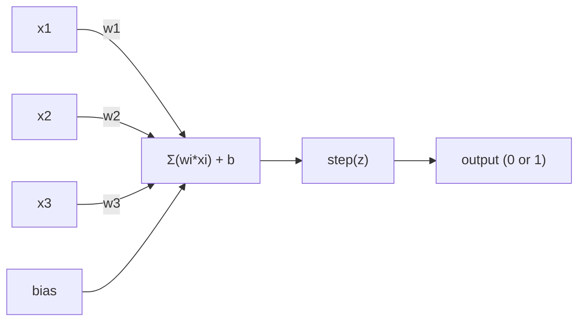
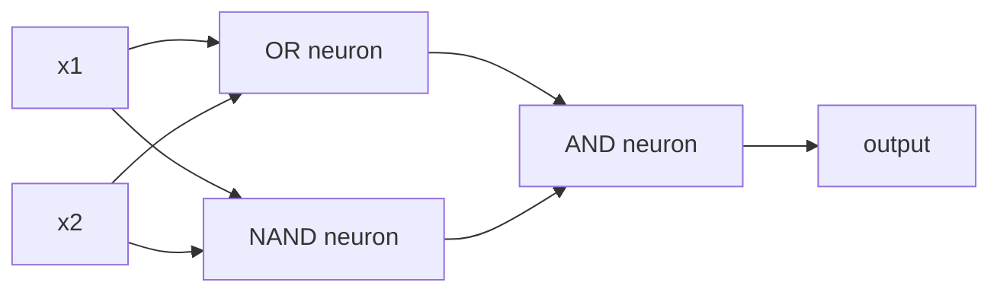

# البيرسبترون
> الإدراك الحسي هو ذرة الشبكات العصبية. قم بتقسيمها وستجد الأوزان والتحيز والقرار.
**النوع:** بناء
** اللغات: ** بايثون
**المتطلبات الأساسية:** المرحلة الأولى (حدس الجبر الخطي)
**الوقت:** ~60 دقيقة
## أهداف التعلم
- تنفيذ الإدراك الحسي من الصفر في لغة بايثون، بما في ذلك قاعدة تحديث الوزن ووظيفة تنشيط الخطوة
- اشرح لماذا لا يستطيع الإدراك الحسي الواحد سوى حل المشكلات القابلة للفصل خطيًا وإظهار حالة فشل XOR
- أنشئ إدراكًا متعدد الطبقات من خلال إنشاء بوابات OR وNAND وAND لحل XOR
- تدريب شبكة مكونة من طبقتين مع التنشيط السيني والانتشار العكسي لتعلم XOR تلقائيًا
## المشكلة
أنت تعرف المتجهات والمنتجات النقطية. أنت تعلم أن المصفوفة تحول المدخلات إلى مخرجات. ولكن كيف يمكن للآلة أن تتعلم أي تحويل يجب استخدامه؟
يجيب الإدراك الحسي على هذا. إنها أبسط آلة تعلم ممكنة: خذ بعض المدخلات، واضربها بالأوزان، وأضف التحيز، ثم make قرار ثنائي. ثم اضبط. هذا كل شيء. كل شبكة عصبية تم بناؤها على الإطلاق هي عبارة عن طبقات من هذه الفكرة مكدسة معًا.
إن فهم الإدراك الحسي يعني فهم ما يعنيه "التعلم" فعليًا في الكود: تعديل الأرقام حتى يتطابق الناتج مع الواقع.
##المفهوم
### خلية عصبية واحدة، قرار واحد
يأخذ الإدراك الحسي عدد n من المدخلات، ويضرب كل منها بالوزن، ويجمعها، ويضيف تحيزًا، ويمرر النتيجة من خلال وظيفة التنشيط.


دالة الخطوة وحشية: إذا كان المجموع المرجح بالإضافة إلى الانحياز >= 0، يكون الإخراج 1. وبخلاف ذلك، يكون الإخراج 0.
```
step(z) = 1  if z >= 0
           0  if z < 0
```

هذا هو المصنف الخطي. تحدد الأوزان والتحيز خطًا (أو مستوى مفرطًا في الأبعاد الأعلى) يقسم مساحة الإدخال إلى منطقتين.
### حدود القرار
بالنسبة لمدخلين، يرسم الإدراك الحسي خطًا عبر مساحة ثنائية الأبعاد:
```
  x2
  ┤
  │  Class 1        /
  │    (0)          /
  │                /
  │               / w1·x1 + w2·x2 + b = 0
  │              /
  │             /     Class 2
  │            /        (1)
  ┼───────────/──────────── x1
```

كل شيء على جانب واحد من الخط يخرج 0. كل شيء على الجانب الآخر يخرج 1. يحرك التدريب هذا الخط حتى يفصل بين الفصول بشكل صحيح.
### قاعدة التعلم
قاعدة التعلم الإدراكي بسيطة:
```
For each training example (x, y_true):
    y_pred = predict(x)
    error = y_true - y_pred

    For each weight:
        w_i = w_i + learning_rate * error * x_i
    bias = bias + learning_rate * error
```

إذا كان التوقع صحيحا، الخطأ = 0، لا شيء يتغير. إذا توقع 0 ولكن يجب أن يكون 1، تزيد الأوزان. إذا توقع 1 ولكن يجب أن يكون 0، تنخفض الأوزان. يتحكم معدل التعلم في حجم كل تعديل.
### مشكلة XOR
وهنا حيث ينكسر. انظر إلى هذه البوابات المنطقية:
```
AND gate:           OR gate:            XOR gate:
x1  x2  out         x1  x2  out         x1  x2  out
0   0   0           0   0   0           0   0   0
0   1   0           0   1   1           0   1   1
1   0   0           1   0   1           1   0   1
1   1   1           1   1   1           1   1   0
```

AND وOR قابلان للفصل خطيًا: يمكنك رسم خط واحد لفصل الأصفار عن الآحاد. XOR ليس كذلك. لا يمكن لأي سطر واحد أن يفصل [0,1] و [1,0] عن [0,0] و [1,1].
```
AND (separable):        XOR (not separable):

  x2                      x2
  1 ┤  0     1            1 ┤  1     0
    │     /                 │
  0 ┤  0 / 0              0 ┤  0     1
    ┼──/──────── x1         ┼──────────── x1
       line works!          no single line works!
```

وهذا هو الحد الأساسي. يمكن للإدراك الحسي الواحد أن يحل فقط المسائل القابلة للفصل خطيًا. أثبت مينسكي وبابيرت ذلك في عام 1969، وكاد أن يقضي على أبحاث الشبكات العصبية لمدة عقد من الزمن.
الحل: تكديس الإدراك الحسي في طبقات. يمكن للإدراك الحسي متعدد الطبقات حل XOR من خلال الجمع بين قرارين خطيين في قرار غير خطي.
## بنائها
### الخطوة 1: فئة بيرسبترون
```python
class Perceptron:
    def __init__(self, n_inputs, learning_rate=0.1):
        self.weights = [0.0] * n_inputs
        self.bias = 0.0
        self.lr = learning_rate

    def predict(self, inputs):
        total = sum(w * x for w, x in zip(self.weights, inputs))
        total += self.bias
        return 1 if total >= 0 else 0

    def train(self, training_data, epochs=100):
        for epoch in range(epochs):
            errors = 0
            for inputs, target in training_data:
                prediction = self.predict(inputs)
                error = target - prediction
                if error != 0:
                    errors += 1
                    for i in range(len(self.weights)):
                        self.weights[i] += self.lr * error * inputs[i]
                    self.bias += self.lr * error
            if errors == 0:
                print(f"Converged at epoch {epoch + 1}")
                return
        print(f"Did not converge after {epochs} epochs")
```

### الخطوة الثانية: التدريب على البوابات المنطقية
```python
and_data = [
    ([0, 0], 0),
    ([0, 1], 0),
    ([1, 0], 0),
    ([1, 1], 1),
]

or_data = [
    ([0, 0], 0),
    ([0, 1], 1),
    ([1, 0], 1),
    ([1, 1], 1),
]

not_data = [
    ([0], 1),
    ([1], 0),
]

print("=== AND Gate ===")
p_and = Perceptron(2)
p_and.train(and_data)
for inputs, _ in and_data:
    print(f"  {inputs} -> {p_and.predict(inputs)}")

print("\n=== OR Gate ===")
p_or = Perceptron(2)
p_or.train(or_data)
for inputs, _ in or_data:
    print(f"  {inputs} -> {p_or.predict(inputs)}")

print("\n=== NOT Gate ===")
p_not = Perceptron(1)
p_not.train(not_data)
for inputs, _ in not_data:
    print(f"  {inputs} -> {p_not.predict(inputs)}")
```

### الخطوة 3: شاهد فشل XOR
```python
xor_data = [
    ([0, 0], 0),
    ([0, 1], 1),
    ([1, 0], 1),
    ([1, 1], 0),
]

print("\n=== XOR Gate (single perceptron) ===")
p_xor = Perceptron(2)
p_xor.train(xor_data, epochs=1000)
for inputs, expected in xor_data:
    result = p_xor.predict(inputs)
    status = "OK" if result == expected else "WRONG"
    print(f"  {inputs} -> {result} (expected {expected}) {status}")
```

لن تتقارب أبدا. وهذا هو الدليل القاطع على أن الإدراك الحسي الواحد لا يمكنه تعلم XOR.
### الخطوة 4: حل XOR بطبقتين
الخدعة: XOR = (x1 OR x2) AND NOT (x1 AND x2). الجمع بين ثلاثة إدراكات:


```python
def xor_network(x1, x2):
    or_neuron = Perceptron(2)
    or_neuron.weights = [1.0, 1.0]
    or_neuron.bias = -0.5

    nand_neuron = Perceptron(2)
    nand_neuron.weights = [-1.0, -1.0]
    nand_neuron.bias = 1.5

    and_neuron = Perceptron(2)
    and_neuron.weights = [1.0, 1.0]
    and_neuron.bias = -1.5

    hidden1 = or_neuron.predict([x1, x2])
    hidden2 = nand_neuron.predict([x1, x2])
    output = and_neuron.predict([hidden1, hidden2])
    return output


print("\n=== XOR Gate (multi-layer network) ===")
for inputs, expected in xor_data:
    result = xor_network(inputs[0], inputs[1])
    print(f"  {inputs} -> {result} (expected {expected})")
```

جميع الحالات الأربع صحيحة. إن تكديس الإدراك الحسي في طبقات يخلق حدودًا للقرار لا يمكن لأي إدراك إدراكي واحد إنتاجها.
### الخطوة 5: تدريب شبكة ذات طبقتين
الخطوة 4: قم بتوصيل الأوزان يدويًا. يعمل هذا مع XOR، ولكن ليس للمشاكل الحقيقية التي لا تعرف فيها الأوزان الصحيحة مسبقًا. الإصلاح: استبدل وظيفة الخطوة بالسيني وتعرف على الأوزان تلقائيًا من خلال الانتشار العكسي.
```python
class TwoLayerNetwork:
    def __init__(self, learning_rate=0.5):
        import random
        random.seed(0)
        self.w_hidden = [[random.uniform(-1, 1), random.uniform(-1, 1)] for _ in range(2)]
        self.b_hidden = [random.uniform(-1, 1), random.uniform(-1, 1)]
        self.w_output = [random.uniform(-1, 1), random.uniform(-1, 1)]
        self.b_output = random.uniform(-1, 1)
        self.lr = learning_rate

    def sigmoid(self, x):
        import math
        x = max(-500, min(500, x))
        return 1.0 / (1.0 + math.exp(-x))

    def forward(self, inputs):
        self.inputs = inputs
        self.hidden_outputs = []
        for i in range(2):
            z = sum(w * x for w, x in zip(self.w_hidden[i], inputs)) + self.b_hidden[i]
            self.hidden_outputs.append(self.sigmoid(z))
        z_out = sum(w * h for w, h in zip(self.w_output, self.hidden_outputs)) + self.b_output
        self.output = self.sigmoid(z_out)
        return self.output

    def train(self, training_data, epochs=10000):
        for epoch in range(epochs):
            total_error = 0
            for inputs, target in training_data:
                output = self.forward(inputs)
                error = target - output
                total_error += error ** 2

                d_output = error * output * (1 - output)

                saved_w_output = self.w_output[:]
                hidden_deltas = []
                for i in range(2):
                    h = self.hidden_outputs[i]
                    hd = d_output * saved_w_output[i] * h * (1 - h)
                    hidden_deltas.append(hd)

                for i in range(2):
                    self.w_output[i] += self.lr * d_output * self.hidden_outputs[i]
                self.b_output += self.lr * d_output

                for i in range(2):
                    for j in range(len(inputs)):
                        self.w_hidden[i][j] += self.lr * hidden_deltas[i] * inputs[j]
                    self.b_hidden[i] += self.lr * hidden_deltas[i]
```

```python
net = TwoLayerNetwork(learning_rate=2.0)
net.train(xor_data, epochs=10000)
for inputs, expected in xor_data:
    result = net.forward(inputs)
    predicted = 1 if result >= 0.5 else 0
    print(f"  {inputs} -> {result:.4f} (rounded: {predicted}, expected {expected})")
```

هناك اختلافان رئيسيان عن الخطوة 4. أولاً، يستبدل السيني وظيفة الخطوة - فهي سلسة، لذا توجد تدرجات. ثانيًا، تقوم طريقة `train` بنشر الخطأ للخلف من المخرجات إلى الطبقة المخفية، مع ضبط كل وزن بشكل متناسب مع مساهمته في الخطأ. هذا هو الانتشار العكسي في 20 سطرًا.
هذا هو الجسر المؤدي إلى الدرس 03. الرياضيات وراء `d_output` و`hidden_deltas` هي قاعدة السلسلة المطبقة على الرسم البياني للشبكة. سنقوم باستخلاصها بشكل صحيح هناك.
## استخدمه
كل ما أنشأته للتو من الصفر موجود في عملية استيراد واحدة:
```python
from sklearn.linear_model import Perceptron as SkPerceptron
import numpy as np

X = np.array([[0,0],[0,1],[1,0],[1,1]])
y = np.array([0, 0, 0, 1])

clf = SkPerceptron(max_iter=100, tol=1e-3)
clf.fit(X, y)
print([clf.predict([x])[0] for x in X])
```

خمسة أسطر. صفك `Perceptron` المكون من 30 سطرًا يفعل نفس الشيء. يضيف إصدار sklearn عمليات فحص التقارب، ووظائف الخسارة المتعددة، ودعم الإدخال المتناثر - ولكن الحلقة الأساسية متطابقة: المجموع المرجح، ووظيفة الخطوة، وتحديث الوزن عند الخطأ.
وتظهر الفجوة الحقيقية على نطاق واسع. ما التغييرات في شبكات الإنتاج:
- تصبح وظيفة الخطوة هي sigmoid أو ReLU أو أي عمليات تنشيط سلسة أخرى
- يتم تعلم الأوزان تلقائيا عن طريق الانتشار العكسي (الدرس 03)
- تصبح الطبقات أعمق: 3، 10، أكثر من 100 طبقة
- ينطبق نفس المبدأ: تقوم كل طبقة بإنشاء ميزات جديدة من مخرجات الطبقة السابقة
يمكن للإدراك الحسي الواحد أن يرسم خطوطًا مستقيمة فقط. كومة لهم، ويمكنك رسم أي شكل.
## اشحنها
ينتج هذا الدرس:
- `outputs/skill-perceptron.md` - تغطية المهارات عند الحاجة إلى بنية أحادية الطبقة مقابل بنية متعددة الطبقات
## تمارين
1. قم بتدريب الإدراك الحسي على بوابة NAND (البوابة العالمية - يمكن بناء أي دائرة منطقية من NAND). التحقق من أن أوزانها وتحيزها تشكل حدود قرار صالحة.
2. قم بتعديل فئة Perceptron لتتبع حدود القرار (w1*x1 + w2*x2 + b = 0) في كل عصر. اطبع كيفية تحول الخط أثناء التدريب على البوابة AND.
3. قم ببناء إدراك ثلاثي المدخلات يُخرج 1 فقط عندما يكون 2 من المدخلات الثلاثة على الأقل 1 (وظيفة تصويت الأغلبية). هل هذا قابل للفصل خطيا؟ لماذا؟
## المصطلحات الرئيسية
| مصطلح | ماذا يقول الناس | ماذا يعني في الواقع |
|------|----------------|----------------------|
| بيرسبترون | "خلية عصبية مزيفة" | المصنف الخطي: المنتج النقطي للمدخلات والأوزان، بالإضافة إلى التحيز، من خلال دالة الخطوة |
| الوزن | "ما مدى أهمية الإدخال" | مضاعف يقيس مساهمة كل مدخل في القرار |
| التحيز | "العتبة" | ثابت يغير حدود القرار، مما يسمح للإدراك الحسي بإطلاق النار حتى مع عدم وجود مدخلات |
| وظيفة التنشيط | "الشيء الذي يسحق القيم" | دالة مطبقة بعد دالة مجموع الخطوات المرجحة للإدراك الحسي، السيني/ReLU للشبكات الحديثة |
| قابلة للفصل خطيًا | "يمكنك رسم خط بينهما" | مجموعة بيانات حيث يمكن لطائرة مفرطة واحدة أن تفصل الفئات بشكل مثالي |
| XOR مشكلة | "الشيء الذي لا يستطيع الإدراك الحسي فعله" | إثبات أن الشبكات أحادية الطبقة لا يمكنها تعلم الوظائف غير القابلة للفصل خطيًا |
| حدود القرار | "حيث يتم تبديل المصنف" | المستوى الزائد w*x + b = 0 الذي يقسم مساحة الإدخال إلى فئتين |
| متعدد الطبقات الإدراك الحسي | "شبكة عصبية حقيقية" | يتم تكديس الإدراك الحسي في طبقات، حيث يغذي مخرجات كل طبقة مدخلات الطبقة التالية |
## مزيد من القراءة
- فرانك روزنبلات، "البيرسبترون: نموذج احتمالي لتخزين المعلومات وتنظيمها في الدماغ" (1958) - الورقة الأصلية التي بدأت كل شيء
- مينسكي وبابيرت، "Perceptrons" (1969) - الكتاب الذي أثبت أن XOR غير قابل للحل من خلال شبكات الطبقة الواحدة وقتل أبحاث الإدراك الحسي لمدة عقد من الزمن
- مايكل نيلسن، "الشبكات العصبية والتعلم العميق"، الفصل الأول (http://neuralnetworksanddeeplearning.com/) - أفضل شرح مرئي مجاني عبر الإنترنت لكيفية تكوين الإدراك الحسي في الشبكات