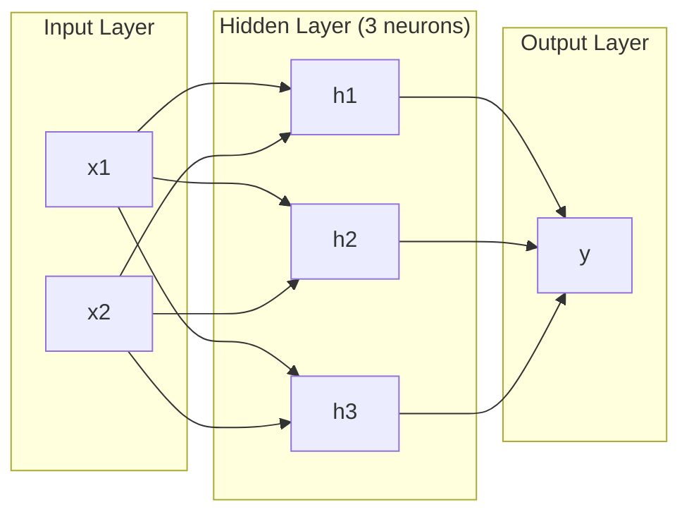
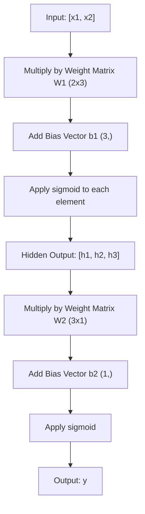
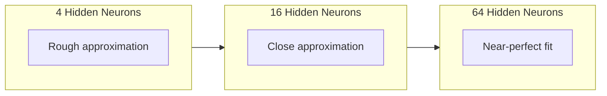

# Multi-Layer Networks and Forward Pass

> إحدى الخلايا العصبية ترسم خطًا. كومة لهم، ويمكنك رسم أي شيء.

**النوع:** بناء
** اللغات: ** بايثون
**المتطلبات الأساسية:** المرحلة 01 (أساسيات الرياضيات)، الدرس 03.01 (البيرسبترون)
**الوقت:** ~90 دقيقة

## Learning Objectives

- أنشئ شبكة متعددة الطبقات من البداية باستخدام فئات الطبقة والشبكة التي تؤدي تمريرة أمامية كاملة
- تتبع أبعاد المصفوفة من خلال كل طبقة من طبقات الشبكة وتحديد عدم تطابق الأشكال
- اشرح كيف أن تكديس التنشيطات غير الخطية يمكّن الشبكة من تعلم حدود القرار المنحنية
- حل مسألة XOR باستخدام بنية 2-2-1 مع الأوزان السينية المضبوطة يدويًا

## The Problem

خلية عصبية واحدة هي درج الخط. هذا كل شيء. خط مستقيم واحد من خلال البيانات الخاصة بك. كل مشكلة حقيقية في AI - التعرف على الصور، فهم اللغة، لعب Go - تتطلب منحنيات. تكديس الخلايا العصبية في طبقات هو الطريقة التي تحصل بها على المنحنيات.

في عام 1969، أثبت مينسكي وبابيرت أن هذا القيد كان قاتلًا: لا يمكن لشبكة أحادية الطبقة أن تتعلم XOR. ليس "يكافح من أجل التعلم" - لا يمكن ذلك رياضيًا. يضع جدول الحقيقة XOR [0,1] و[1,0] على جانب واحد، و[0,0] و[1,1] على الجانب الآخر. ولا يفصل بينهما خط واحد.

أدى هذا إلى مقتل تمويل الشبكات العصبية لأكثر من عقد من الزمان. كان الإصلاح واضحًا بعد فوات الأوان: توقف عن استخدام طبقة واحدة. كومة الخلايا العصبية في طبقات. اسمح للطبقة الأولى بنحت مساحة الإدخال إلى ميزات جديدة، ودع الطبقة الثانية تجمع تلك الميزات في قرارات لا يمكن لأي سطر واحد أن make.

هذا المكدس هو شبكة متعددة الطبقات. إنه أساس كل نموذج للتعلم العميق في الإنتاج اليوم. إن التمرير الأمامي - تدفق البيانات من الإدخال عبر الطبقات المخفية إلى الإخراج - هو أول شيء تحتاج إلى إنشائه قبل أن ينجح أي شيء آخر.

## The Concept

### Layers: Input, Hidden, Output

تحتوي الشبكة متعددة الطبقات على ثلاثة أنواع من الطبقات:

**طبقة الإدخال** - ليست طبقة حقًا. أنه يحمل البيانات الأولية الخاصة بك. ميزتان تعني مدخلين nodes. لا يحدث أي حساب هنا.

**الطبقات المخفية** -- حيث يتم العمل. تأخذ كل خلية عصبية كل مخرجات الطبقة السابقة، وتطبق الأوزان والتحيز، ثم تمرر النتيجة من خلال وظيفة التنشيط. "مخفي" لأنك لا ترى هذه القيم مباشرة في بيانات التدريب.

**طبقة الإخراج**--الإجابة النهائية. للتصنيف الثنائي، خلية عصبية واحدة ذات شكل سيني. بالنسبة للفئات المتعددة، خلية عصبية واحدة لكل فئة.



هذه شبكة 2-3-1. مدخلان، ثلاث خلايا عصبية مخفية، مخرج واحد. كل اتصال يحمل وزنا. كل خلية عصبية (باستثناء المدخلات) تحمل انحيازًا.

تنتج كل طبقة متجهًا من الأرقام يسمى الحالة المخفية. بالنسبة للنص، تعمل الحالات المخفية على زيادة الأبعاد - حيث تقوم بترميز الكلمة كـ 768 رقمًا لالتقاط المعنى الدلالي. بالنسبة للصور، فإنها تقلل الأبعاد - حيث يتم ضغط ملايين البكسل إلى تمثيل يمكن التحكم فيه. الحالة المخفية هي المكان الذي يعيش فيه التعلم.

### Neurons and Activations

تقوم كل خلية عصبية بثلاثة أشياء:

1. اضرب كل المدخلات في وزنها المقابل
2. جمع كل المنتجات وإضافة التحيز
3. قم بتمرير المبلغ من خلال وظيفة التنشيط

في الوقت الحالي، التنشيط هو السيني:

```
sigmoid(z) = 1 / (1 + e^(-z))
```

يسحق السيني أي رقم في النطاق (0، 1). تدفع المدخلات الإيجابية الكبيرة نحو 1. تدفع المدخلات السلبية الكبيرة نحو 0. خرائط الصفر إلى 0.5. هذا المنحنى السلس هو ما يمكن تعلمه - على عكس الخطوة الصعبة للإدراك الحسي، فإن السيني له تدرج في كل مكان.

### Forward Pass: How Data Flows

يقوم التمرير الأمامي بدفع البيانات المدخلة عبر الشبكة، طبقة بعد طبقة، حتى تصل إلى الإخراج. لا يحدث أي تعلم أثناء التمريرة الأمامية. إنها عملية حسابية خالصة: الضرب، الإضافة، التنشيط، التكرار.



في كل طبقة، تتم ثلاث عمليات بالتسلسل:

```
z = W * input + b       (linear transformation)
a = sigmoid(z)           (activation)
```

يصبح إخراج طبقة واحدة مدخلاً للطبقة التالية. هذا هو التمريرة الأمامية بأكملها.

### Matrix Dimensions

تعد أبعاد التتبع من أهم مهارة تصحيح الأخطاء في التعلم العميق. هذه هي الشبكة 2-3-1:

| خطوة | عملية | الأبعاد | شكل النتيجة |
|------|-----------|-----------|-------------|
| الإدخال | س | -- | (٢،) |
| خطي مخفي | W1*x+b1 | W1: (٣، ٢)، ب١: (٣،) | (3،) |
| تفعيل مخفي | السيني (z1) | -- | (3،) |
| الإخراج الخطي | W2 *ح+ب2 | W2: (١، ٣)، ب٢: (١،) | (١،) |
| تفعيل الإخراج | السيني (z2) | -- | (١،) |

القاعدة: مصفوفة الوزن W عند الطبقة k لها شكل (neurons_in_layer_k، neurons_in_layer_k_minus_1). تتطابق الصفوف مع الطبقة الحالية. تتطابق الأعمدة مع الطبقة السابقة. إذا كانت الأشكال لا تصطف، لديك خطأ.

### Universal Approximation Theorem

في عام 1989، أثبت جورج سايبنكو شيئًا رائعًا: يمكن لشبكة عصبية ذات طبقة مخفية واحدة وعدد كافٍ من الخلايا العصبية تقريب أي وظيفة مستمرة إلى أي دقة مطلوبة.

هذا لا يعني أن طبقة مخفية واحدة هي الأفضل دائمًا. وهذا يعني أن الهندسة المعمارية قادرة من الناحية النظرية. ومن الناحية العملية، تتعلم الشبكات الأعمق (طبقات أكثر، وعدد أقل من الخلايا العصبية لكل طبقة) نفس الوظائف مع معلمات إجمالية أقل بكثير من الشبكات الضحلة. ولهذا السبب يعمل التعلم العميق.

الحدس: كل خلية عصبية في الطبقة المخفية تتعلم "نتوء" أو ميزة واحدة. يمكن وضع ما يكفي من المطبات في المواقع الصحيحة لتقريب أي منحنى سلس. المزيد من الخلايا العصبية، والمزيد من المطبات، وتقريب أفضل.



### Composability

الشبكات العصبية قابلة للتركيب. يمكنك تكديسها وربطها وتشغيلها بالتوازي. يستخدم نموذج Whisper شبكة تشفير لمعالجة الصوت وشبكة فك ترميز منفصلة لإنشاء النص. LLMs الحديثة مخصصة لوحدة فك التشفير فقط. BERT هو برنامج تشفير فقط. T5 هو جهاز فك التشفير. يحدد اختيار البنية ما يمكن أن يفعله النموذج.

## Build It

بيثون النقي. لا نومي. كل عملية مصفوفة مكتوبة من الصفر.

### Step 1: Sigmoid Activation

```python
import math

def sigmoid(x):
    x = max(-500.0, min(500.0, x))
    return 1.0 / (1.0 + math.exp(-x))
```

يمنع المشبك إلى [-500، 500] التدفق الزائد. `math.exp(500)` كبيرة ولكنها محدودة. `math.exp(1000)` هي اللانهاية.

### Step 2: Layer Class

العملية الأكثر أهمية في التعلم العميق هي عملية ضرب المصفوفات. كل طبقة، كل رأس انتباه، كل تمريرة للأمام - إنها ماتمول على طول الطريق. تأخذ الطبقة الخطية متجه الإدخال، وتضربه بمصفوفة الوزن، وتضيف متجه التحيز: y = Wx + b. تمثل هذه المعادلة الواحدة 90% من الحوسبة في الشبكة العصبية.

تحتوي الطبقة على مصفوفة وزن ومتجه متحيز. تأخذ الطريقة الأمامية متجه الإدخال وتعيد الإخراج المنشط.

```python
class Layer:
    def __init__(self, n_inputs, n_neurons, weights=None, biases=None):
        if weights is not None:
            self.weights = weights
        else:
            import random
            self.weights = [
                [random.uniform(-1, 1) for _ in range(n_inputs)]
                for _ in range(n_neurons)
            ]
        if biases is not None:
            self.biases = biases
        else:
            self.biases = [0.0] * n_neurons

    def forward(self, inputs):
        self.last_input = inputs
        self.last_output = []
        for neuron_idx in range(len(self.weights)):
            z = sum(
                w * x for w, x in zip(self.weights[neuron_idx], inputs)
            )
            z += self.biases[neuron_idx]
            self.last_output.append(sigmoid(z))
        return self.last_output
```

مصفوفة الوزن لها شكل (n_neurons، n_inputs). كل صف هو وزن خلية عصبية واحدة عبر جميع المدخلات. تدور الطريقة الأمامية عبر الخلايا العصبية، وتحسب المجموع المرجح بالإضافة إلى التحيز، وتطبق الشكل السيني، وتجمع النتائج.

### Step 3: Network Class

الشبكة عبارة عن قائمة من الطبقات. يقوم التمرير الأمامي بربطها: يتم تغذية إخراج الطبقة k إلى الطبقة k+1.

```python
class Network:
    def __init__(self, layers):
        self.layers = layers

    def forward(self, inputs):
        current = inputs
        for layer in self.layers:
            current = layer.forward(current)
        return current
```

هذا هو التمريرة الأمامية بأكملها. أربعة أسطر من المنطق. تدخل البيانات، وتتدفق عبر كل طبقة، وتخرج من الجانب الآخر.

### Step 4: XOR with Hand-Tuned Weights

في الدرس 01، قمنا بحل XOR من خلال الجمع بين OR وNAND وAND الإدراك الحسي. الآن افعل نفس الشيء مع فصولنا الخاصة بالطبقة والشبكة. بنية 2-2-1: مدخلان، وخليتان عصبيتان مخفيتان، ومخرج واحد.

```python
hidden = Layer(
    n_inputs=2,
    n_neurons=2,
    weights=[[20.0, 20.0], [-20.0, -20.0]],
    biases=[-10.0, 30.0],
)

output = Layer(
    n_inputs=2,
    n_neurons=1,
    weights=[[20.0, 20.0]],
    biases=[-30.0],
)

xor_net = Network([hidden, output])

xor_data = [
    ([0, 0], 0),
    ([0, 1], 1),
    ([1, 0], 1),
    ([1, 1], 0),
]

for inputs, expected in xor_data:
    result = xor_net.forward(inputs)
    predicted = 1 if result[0] >= 0.5 else 0
    print(f"  {inputs} -> {result[0]:.6f} (rounded: {predicted}, expected: {expected})")
```

الأوزان الكبيرة (20، -20) make السيني تعمل كوظيفة الخطوة. أول خلية عصبية مخفية تقارب OR. والثاني يقارب NAND. تجمعهم الخلايا العصبية الناتجة في AND، وهو XOR.

### Step 5: Circle Classification

مشكلة أصعب: قم بتصنيف النقاط ثنائية الأبعاد على أنها داخل أو خارج دائرة نصف قطرها 0.5 ومركزها نقطة الأصل. وهذا يتطلب حدود قرار منحنية - وهو أمر مستحيل بالنسبة لإدراك إدراكي واحد.

```python
import random
import math

random.seed(42)

data = []
for _ in range(200):
    x = random.uniform(-1, 1)
    y = random.uniform(-1, 1)
    label = 1 if (x * x + y * y) < 0.25 else 0
    data.append(([x, y], label))

circle_net = Network([
    Layer(n_inputs=2, n_neurons=8),
    Layer(n_inputs=8, n_neurons=1),
])
```

مع الأوزان العشوائية، لن يتم تصنيف الشبكة بشكل جيد. لكن التمريرة الأمامية ما زالت مستمرة. هذه هي النقطة - التمريرة الأمامية هي مجرد عملية حسابية. تعلم الأوزان الصحيحة هو الانتشار العكسي، سيأتي في الدرس 03.

```python
correct = 0
for inputs, expected in data:
    result = circle_net.forward(inputs)
    predicted = 1 if result[0] >= 0.5 else 0
    if predicted == expected:
        correct += 1

print(f"Accuracy with random weights: {correct}/{len(data)} ({100*correct/len(data):.1f}%)")
```

تعطي الأوزان العشوائية دقة ضعيفة - وغالبًا ما تكون أسوأ من تخمين فئة الأغلبية. بعد التدريب (الدرس 03)، نفس البنية التي تحتوي على 8 خلايا عصبية مخفية سترسم حدودًا منحنية تفصل الداخل عن الخارج.

## Use It

PyTorch يفعل كل ما سبق في أربعة أسطر:

```python
import torch
import torch.nn as nn

model = nn.Sequential(
    nn.Linear(2, 8),
    nn.Sigmoid(),
    nn.Linear(8, 1),
    nn.Sigmoid(),
)

x = torch.tensor([[0.0, 0.0], [0.0, 1.0], [1.0, 0.0], [1.0, 1.0]])
output = model(x)
print(output)
```

`nn.Linear(2, 8)` هي فئة الطبقة الخاصة بك: مصفوفة وزن الشكل (8، 2)، متجه انحياز الشكل (8،). `nn.Sigmoid()` هي الدالة السيني الخاصة بك المطبقة على العناصر. `nn.Sequential` هي فئة الشبكة الخاصة بك: طبقات متسلسلة بالترتيب.

الفرق هو السرعة والحجم. يعمل PyTorch على GPUs، ويتعامل مع دفعات من ملايين العينات، ويحسب التدرجات تلقائيًا للانتشار العكسي. لكن منطق التمرير الأمامي مطابق لما قمت بإنشائه للتو من الصفر.

## Ship It

يُنتج هذا الدرس مطالبة قابلة لإعادة الاستخدام لتصميم بنيات الشبكة:

- `outputs/prompt-network-architect.md`

استخدمه عندما تحتاج إلى تحديد عدد الطبقات، وعدد الخلايا العصبية لكل طبقة، ووظائف التنشيط التي يجب استخدامها لحل مشكلة معينة.

## Exercises

1. قم ببناء شبكة 2-4-2-1 (طبقتين مخفيتين) وقم بتشغيل التمرير الأمامي على بيانات XOR بأوزان عشوائية. اطبع مخرجات الطبقة المخفية المتوسطة لترى كيف يتحول التمثيل في كل طبقة.

2. قم بتغيير حجم الطبقة المخفية في مصنف الدائرة من 8 إلى 2، ثم إلى 32. قم بتشغيل التمريرة الأمامية بأوزان عشوائية في كل مرة. هل يغير عدد الخلايا العصبية المخفية نطاق الإخراج أو التوزيع؟ لماذا؟

3. قم بتنفيذ طريقة `count_parameters` على فئة الشبكة التي تُرجع إجمالي عدد الأوزان والتحيزات القابلة للتدريب. اختبره على شبكة 784-256-128-10 (الهندسة المعمارية الكلاسيكية MNIST). كم عدد المعلمات لديها؟

4. قم ببناء تمريرة أمامية لشبكة 3-4-4-2. قم بتغذيته بقيم ألوان RGB (تم تسويتها إلى 0-1) ولاحظ المخرجين. هذه هي البنية المعمارية لمصنف ألوان بسيط يتكون من فئتين.

5. استبدل السيني بوظيفة "الخطوة المتسربة": قم بإرجاع 0.01 * z إذا كانت z <0، وإلا 1.0. قم بتشغيل التمريرة الأمامية على XOR بنفس الأوزان المضبوطة يدويًا من الخطوة 4. هل ما زالت تعمل؟ لماذا يُفضل الشكل السيني الأملس على القطع الصلب؟

## Key Terms

| مصطلح | ماذا يقول الناس | ماذا يعني في الواقع |
|------|----------------|----------------------|
| تمريرة للأمام | "تشغيل النموذج" | دفع المدخلات عبر كل طبقة - الضرب بالأوزان، وإضافة التحيز، والتنشيط - لإنتاج مخرجات |
| الطبقة المخفية | "الجزء الأوسط" | أي طبقة بين المدخلات والمخرجات التي لا يتم ملاحظة قيمها مباشرة في البيانات |
| شبكة متعددة الطبقات | "شبكة عصبية عميقة" | طبقات من الخلايا العصبية مكدسة بشكل تسلسلي، حيث يغذي مخرجات كل طبقة مدخلات الطبقة التالية |
| وظيفة التنشيط | "اللاخطية" | دالة يتم تطبيقها بعد التحويل الخطي الذي يُدخل منحنيات في حدود القرار |
| السيني | "منحنى S" | sigma(z) = 1/(1+e^(-z)))، يسحق أي رقم حقيقي إلى (0,1)، سلس وقابل للتمييز في كل مكان |
| مصفوفة الوزن | "المعلمات" | مصفوفة ذات شكل W (الخلايا العصبية_الطبقة_الحالية، الخلايا_العصبية_الطبقة_السابقة) تحتوي على نقاط قوة اتصال قابلة للتعلم |
| ناقل التحيز | "الإزاحة" | متجه يضاف بعد مضاعفة المصفوفة مما يسمح للخلايا العصبية بالتنشيط حتى عندما تكون جميع المدخلات صفر |
| التقريب العالمي | "الشبكات العصبية يمكنها تعلم أي شيء" | يمكن لطبقة مخفية واحدة تحتوي على ما يكفي من الخلايا العصبية أن تقارب أي وظيفة مستمرة - ولكن كلمة "كافية" يمكن أن تعني المليارات |
| التحويل الخطي | "خطوة ضرب المصفوفة" | z = W * x + b، الحساب قبل التنشيط، والذي يعين المدخلات إلى مساحة جديدة |
| حدود القرار | "حيث يتم تبديل المصنف" | السطح في مساحة الإدخال حيث يتجاوز مخرج الشبكة عتبة التصنيف |

## Further Reading

- مايكل نيلسن، "الشبكات العصبية والتعلم العميق"، الفصل 1-2 (http://neuralnetworksanddeeplearning.com/) - أوضح شرح مجاني للتمريرات الأمامية وبنية الشبكة، مع تصورات تفاعلية
- Cybenko، "التقريب عن طريق تراكبات الدالة السيني" (1989) - الورقة الأصلية لنظرية التقريب العالمي، سهلة القراءة بشكل مدهش
- 3Blue1Brown، "ولكن ما هي الشبكة العصبية؟" (https://www.youtube.com/watch?v=aircAraircAruvnKknKk) -- عرض مرئي مدته 20 دقيقة للطبقات والأوزان والتمريرات الأمامية التي تبني النموذج العقلي الصحيح
- Goodfellow، Bengio، Courville، "التعلم العميق"، الفصل السادس (https://www.deeplearningbook.org/) - المرجع القياسي للشبكات متعددة الطبقات، مجانًا عبر الإنترنت
