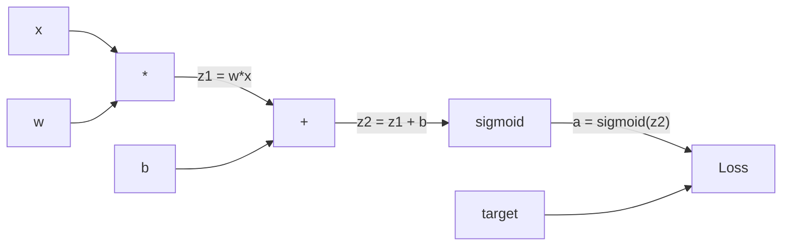
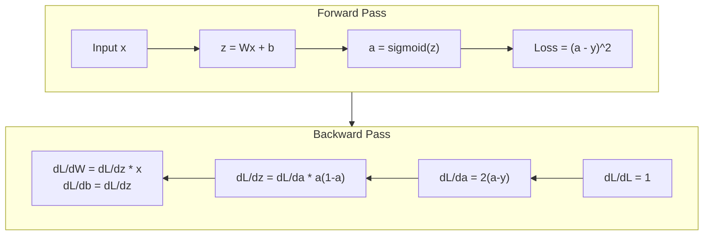
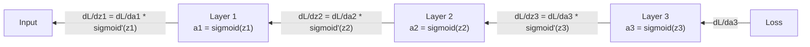

# Backpropagation from Scratch

> الانتشار العكسي هو الخوارزمية التي تجعل التعلم ممكنًا. وبدونها، تصبح الشبكات العصبية مجرد مولدات أرقام عشوائية باهظة الثمن.

**النوع:** بناء
** اللغات: ** بايثون
**المتطلبات السابقة:** الدرس 03.02 (الشبكات متعددة الطبقات)
**الوقت:** ~120 دقيقة

## Learning Objectives

- تنفيذ محرك autograd القائم على القيمة والذي يبني رسمًا بيانيًا حسابيًا ويحسب التدرجات عبر الفرز الطوبولوجي
- اشتقاق التمرير الخلفي لعمليات الجمع والضرب والسيني باستخدام قاعدة السلسلة
- تدريب شبكة متعددة الطبقات على XOR وتصنيف الدوائر باستخدام محرك الانتشار العكسي من الصفر فقط
- التعرف على مشكلة التدرج المتلاشي في الشبكات السيني العميقة وشرح سبب تقلص التدرجات بشكل كبير

## The Problem

تحتوي شبكتك على طبقة مخفية واحدة تحتوي على 768 مدخلاً و3072 مخرجًا. هذا هو 2359296 الأوزان. لقد قام بتنبؤ خاطئ. ما هي الأوزان التي تسببت في الخطأ؟ اختبار كل وزن على حدة يعني 2.3 مليون تمريرة أمامية. يحسب Backpropagation جميع التدرجات البالغ عددها 2.3 مليونًا في تمريرة واحدة للخلف. هذا ليس الأمثل. هذا هو الفرق بين القابل للتدريب والمستحيل.

النهج الساذج: خذ وزنًا واحدًا، وادفعه بمقدار ضئيل، وقم بتشغيل التمريرة الأمامية مرة أخرى، وقياس ما إذا كانت الخسارة قد ارتفعت أم انخفضت. وهذا يمنحك التدرج لهذا الوزن. الآن افعل ذلك لكل وزن في الشبكة. اضرب بآلاف خطوات التدريب وملايين نقاط البيانات. ستحتاج إلى وقت جيولوجي لتدريب أي شيء مفيد.

الانتشار العكسي يحل هذا. تمريرة أمامية واحدة، وتمريرة واحدة للخلف، وتم حساب جميع التدرجات. الحيلة هي قاعدة السلسلة من حساب التفاضل والتكامل، والتي يتم تطبيقها بشكل منهجي على الرسم البياني الحسابي. هذه هي الخوارزمية التي جعلت التعلم العميق عمليًا. بدونها، سنظل عالقين في مشاكل الألعاب.

## The Concept

### The Chain Rule, Applied to Networks

لقد رأيت قاعدة السلسلة في المرحلة 01، الدرس 05. خلاصة سريعة: إذا كانت y = f(g(x)))، ثم dy/dx = f'(g(x)) * g'(x). يمكنك مضاعفة المشتقات على طول السلسلة.

في الشبكة العصبية، "السلسلة" هي تسلسل العمليات من الإدخال إلى الخسارة. تطبق كل طبقة أوزانًا وتضيف تحيزات وتمر عبر عملية التنشيط. تقوم دالة الخسارة بمقارنة الناتج النهائي بالهدف. يتتبع الانتشار العكسي هذه السلسلة إلى الخلف، ويحسب كيفية مساهمة كل عملية في حدوث الخطأ.

### Computational Graphs

كل تمريرة للأمام تبني رسمًا بيانيًا. كل node عبارة عن عملية (ضرب، إضافة، سيني). تحمل كل حافة قيمة للأمام وتدرجًا للخلف.



التمرير إلى الأمام: تتدفق القيم من اليسار إلى اليمين. x وw ينتجان z1 = w*x. أضف b لتحصل على z2. Sigmoid يعطي التنشيط أ. قارن a بالهدف y باستخدام دالة الخسارة.

التمريرة الخلفية: تتدفق التدرجات من اليمين إلى اليسار. ابدأ بـ dL/da (كيف تتغير الخسارة مع التنشيط). اضرب بـ da/dz2 (مشتق سيني). وهذا يعطي dL/dz2. انقسم إلى dL/db (والذي يساوي dL/dz2، حيث أن z2 = z1 + b) وdL/dz1. ثم dL/dw = dL/dz1 * x و dL/dx = dL/dz1 * w.

كل node في الرسم البياني له وظيفة واحدة أثناء التمرير للخلف: خذ التدرج القادم من الأعلى، واضربه في مشتقه المحلي، ثم مرره لأسفل.

### Forward vs Backward



يخزن التمرير الأمامي كل قيمة وسيطة: z، a، المدخلات لكل طبقة. يحتاج التمرير للخلف إلى هذه القيم المخزنة لحساب التدرجات. هذه هي مقايضة حساب الذاكرة في قلب الدعامة الخلفية. يمكنك استبدال الذاكرة (تخزين عمليات التنشيط) بالسرعة (تمريرة واحدة بدلاً من الملايين).

### Gradient Flow Through a Network

بالنسبة لشبكة مكونة من ثلاث طبقات، تتسلسل التدرجات عبر كل طبقة:



في كل طبقة، يتم ضرب التدرج بالمشتق السيني. المشتق السيني هو * (1 - a)، والذي يصل إلى الحد الأقصى عند 0.25 (عندما يكون a = 0.5). في ثلاث طبقات عميقة، تم ضرب التدرج على الأكثر بـ 0.25^3 = 0.0156. عمق عشر طبقات: 0.25^10 = 0.000001.

### Vanishing Gradients

هذه هي مشكلة التدرج التلاشي. يسحق السيني ناتجه بين 0 و 1. ويكون مشتقه دائمًا أقل من 0.25. قم بتكديس ما يكفي من الطبقات السينية والتدرجات التي تتقلص إلى لا شيء. بالكاد تتعلم الطبقات المبكرة لأنها تتلقى تدرجات قريبة من الصفر.

```
sigmoid(z):     Output range [0, 1]
sigmoid'(z):    Max value 0.25 (at z = 0)

After 5 layers:   gradient * 0.25^5 = 0.001x original
After 10 layers:  gradient * 0.25^10 = 0.000001x original
```

ولهذا السبب يكاد يكون من المستحيل تدريب الشبكات السينية العميقة. الإصلاح - ReLU ومتغيراته - هو موضوع الدرس 04. في الوقت الحالي، افهم أن الدعامة الخلفية تعمل بشكل مثالي. المشكلة هي ما تعمل من خلاله.

### Deriving Gradients for a 2-Layer Network

الرياضيات الملموسة لشبكة ذات مدخل x، وطبقة مخفية مع سيني، وطبقة إخراج مع سيني، وخسارة MSE.

تمريرة للأمام:
```
z1 = W1 * x + b1
a1 = sigmoid(z1)
z2 = W2 * a1 + b2
a2 = sigmoid(z2)
L = (a2 - y)^2
```

التمريرة الخلفية (تطبيق قاعدة السلسلة خطوة بخطوة):
```
dL/da2 = 2(a2 - y)
da2/dz2 = a2 * (1 - a2)
dL/dz2 = dL/da2 * da2/dz2 = 2(a2 - y) * a2 * (1 - a2)

dL/dW2 = dL/dz2 * a1
dL/db2 = dL/dz2

dL/da1 = dL/dz2 * W2
da1/dz1 = a1 * (1 - a1)
dL/dz1 = dL/da1 * da1/dz1

dL/dW1 = dL/dz1 * x
dL/db1 = dL/dz1
```

كل تدرج هو نتاج مشتقات محلية ترجع إلى الخسارة. هذا هو كل ما هو الانتشار العكسي.

## Build It

### Step 1: The Value Node

كل رقم في حساباتنا يصبح قيمة. يقوم بتخزين بياناته وتدرجه وكيفية إنشائه (حتى يعرف كيفية حساب التدرجات بشكل عكسي).

```python
class Value:
    def __init__(self, data, children=(), op=''):
        self.data = data
        self.grad = 0.0
        self._backward = lambda: None
        self._children = set(children)
        self._op = op

    def __repr__(self):
        return f"Value(data={self.data:.4f}, grad={self.grad:.4f})"
```

لا يوجد تدرج بعد (0.0). لا توجد وظيفة خلفية حتى الآن (no-op). المسار `_children` الذي أنتجته القيم، حتى نتمكن من فرز الرسم البياني طوبولوجيًا لاحقًا.

### Step 2: Operations with Backward Functions

تقوم كل عملية بإنشاء قيمة جديدة وتحدد كيفية تدفق التدرجات للخلف من خلالها.

```python
def __add__(self, other):
    other = other if isinstance(other, Value) else Value(other)
    out = Value(self.data + other.data, (self, other), '+')

    def _backward():
        self.grad += out.grad
        other.grad += out.grad

    out._backward = _backward
    return out

def __mul__(self, other):
    other = other if isinstance(other, Value) else Value(other)
    out = Value(self.data * other.data, (self, other), '*')

    def _backward():
        self.grad += other.data * out.grad
        other.grad += self.data * out.grad

    out._backward = _backward
    return out
```

للجمع: d(a+b)/da = 1, d(a+b)/db = 1. لذلك يحصل كلا المدخلين على تدرج الإخراج مباشرة.

للضرب: d(a*b)/da = b، d(a*b)/db = a. يحصل كل إدخال على قيمة الآخر مضروبة في تدرج الإخراج.

`+=` أمر بالغ الأهمية. يمكن استخدام القيمة في عمليات متعددة. تدرجه هو مجموع التدرجات من كافة المسارات.

### Step 3: Sigmoid and Loss

```python
import math

def sigmoid(self):
    x = self.data
    x = max(-500, min(500, x))
    s = 1.0 / (1.0 + math.exp(-x))
    out = Value(s, (self,), 'sigmoid')

    def _backward():
        self.grad += (s * (1 - s)) * out.grad

    out._backward = _backward
    return out
```

المشتق السيني: السيني (x) * (1 - السيني (x)). قمنا بحساب sigmoid(x) = s أثناء التمريرة الأمامية. أعد استخدامه. لا يوجد عمل إضافي.

```python
def mse_loss(predicted, target):
    diff = predicted + Value(-target)
    return diff * diff
```

MSE لمخرج واحد: (المتوقع - الهدف)^2. نعبر عن الطرح كإضافة بقيمة منفية.

### Step 4: Backward Pass

يضمن الفرز الطوبولوجي معالجة nodes بالترتيب الصحيح - يتم تجميع تدرج node بالكامل قبل الانتشار من خلاله.

```python
def backward(self):
    topo = []
    visited = set()

    def build_topo(v):
        if v not in visited:
            visited.add(v)
            for child in v._children:
                build_topo(child)
            topo.append(v)

    build_topo(self)
    self.grad = 1.0
    for v in reversed(topo):
        v._backward()
```

ابدأ بالخسارة (التدرج = 1.0، حيث أن dL/dL = 1). المشي إلى الوراء من خلال الرسم البياني الذي تم فرزه. كل node `_backward` يدفع التدرجات إلى أطفاله.

### Step 5: Layer and Network

```python
import random

class Neuron:
    def __init__(self, n_inputs):
        scale = (2.0 / n_inputs) ** 0.5
        self.weights = [Value(random.uniform(-scale, scale)) for _ in range(n_inputs)]
        self.bias = Value(0.0)

    def __call__(self, x):
        act = sum((wi * xi for wi, xi in zip(self.weights, x)), self.bias)
        return act.sigmoid()

    def parameters(self):
        return self.weights + [self.bias]


class Layer:
    def __init__(self, n_inputs, n_outputs):
        self.neurons = [Neuron(n_inputs) for _ in range(n_outputs)]

    def __call__(self, x):
        out = [n(x) for n in self.neurons]
        return out[0] if len(out) == 1 else out

    def parameters(self):
        params = []
        for n in self.neurons:
            params.extend(n.parameters())
        return params


class Network:
    def __init__(self, sizes):
        self.layers = []
        for i in range(len(sizes) - 1):
            self.layers.append(Layer(sizes[i], sizes[i + 1]))

    def __call__(self, x):
        for layer in self.layers:
            x = layer(x)
            if not isinstance(x, list):
                x = [x]
        return x[0] if len(x) == 1 else x

    def parameters(self):
        params = []
        for layer in self.layers:
            params.extend(layer.parameters())
        return params

    def zero_grad(self):
        for p in self.parameters():
            p.grad = 0.0
```

يأخذ العصبون المدخلات، ويحسب المجموع المرجح + التحيز، ويطبق الشكل السيني. يتم قياس تهيئة الوزن بواسطة sqrt(2/n_inputs) لمنع التشبع السيني في الشبكات الأعمق. الطبقة عبارة عن قائمة من الخلايا العصبية. الشبكة عبارة عن قائمة من الطبقات. تجمع الطريقة `parameters()` كل القيم القابلة للتعلم حتى نتمكن من تحديثها.

### Step 6: Train on XOR

```python
random.seed(42)
net = Network([2, 4, 1])

xor_data = [
    ([0.0, 0.0], 0.0),
    ([0.0, 1.0], 1.0),
    ([1.0, 0.0], 1.0),
    ([1.0, 1.0], 0.0),
]

learning_rate = 1.0

for epoch in range(1000):
    total_loss = Value(0.0)
    for inputs, target in xor_data:
        x = [Value(i) for i in inputs]
        pred = net(x)
        loss = mse_loss(pred, target)
        total_loss = total_loss + loss

    net.zero_grad()
    total_loss.backward()

    for p in net.parameters():
        p.data -= learning_rate * p.grad

    if epoch % 100 == 0:
        print(f"Epoch {epoch:4d} | Loss: {total_loss.data:.6f}")

print("\nXOR Results:")
for inputs, target in xor_data:
    x = [Value(i) for i in inputs]
    pred = net(x)
    print(f"  {inputs} -> {pred.data:.4f} (expected {target})")
```

شاهد انخفاض الخسارة. من التنبؤات العشوائية إلى المخرجات الصحيحة XOR، مدفوعة بالكامل بتدرجات حوسبة الانتشار العكسي ودفع الأوزان في الاتجاه الصحيح.

### Step 7: Circle Classification

في الدرس 02، قمت بضبط الأوزان يدويًا لتصنيف الدوائر. الآن دع الشبكة تتعلمهم.

```python
random.seed(7)

def generate_circle_data(n=100):
    data = []
    for _ in range(n):
        x1 = random.uniform(-1.5, 1.5)
        x2 = random.uniform(-1.5, 1.5)
        label = 1.0 if x1 * x1 + x2 * x2 < 1.0 else 0.0
        data.append(([x1, x2], label))
    return data

circle_data = generate_circle_data(80)

circle_net = Network([2, 8, 1])
learning_rate = 0.5

for epoch in range(2000):
    random.shuffle(circle_data)
    total_loss_val = 0.0
    for inputs, target in circle_data:
        x = [Value(i) for i in inputs]
        pred = circle_net(x)
        loss = mse_loss(pred, target)
        circle_net.zero_grad()
        loss.backward()
        for p in circle_net.parameters():
            p.data -= learning_rate * p.grad
        total_loss_val += loss.data

    if epoch % 200 == 0:
        correct = 0
        for inputs, target in circle_data:
            x = [Value(i) for i in inputs]
            pred = circle_net(x)
            predicted_class = 1.0 if pred.data > 0.5 else 0.0
            if predicted_class == target:
                correct += 1
        accuracy = correct / len(circle_data) * 100
        print(f"Epoch {epoch:4d} | Loss: {total_loss_val:.4f} | Accuracy: {accuracy:.1f}%")
```

نستخدم هنا SGD عبر الإنترنت - تحديث الأوزان بعد كل عينة بدلاً من تجميع الدفعة الكاملة. يؤدي هذا إلى كسر التماثل بشكل أسرع وتجنب التشبع السيني في مشهد الخسارة الكامل. يؤدي خلط البيانات في كل فترة إلى منع الشبكة من حفظ الترتيب.

لا ضبط اليد. تكتشف الشبكة حدود القرار الدائري من تلقاء نفسها. هذه هي قوة الانتشار العكسي: أنت تحدد البنية ووظيفة الخسارة والبيانات. الخوارزمية تحدد الأوزان.

## Use It

PyTorch يفعل كل شيء أعلاه في بضعة أسطر. الفكرة الأساسية متطابقة - يقوم Autograd ببناء رسم بياني حسابي أثناء التمريرة الأمامية ويتتبعه للخلف لحساب التدرجات.

```python
import torch
import torch.nn as nn

model = nn.Sequential(
    nn.Linear(2, 4),
    nn.Sigmoid(),
    nn.Linear(4, 1),
    nn.Sigmoid(),
)
optimizer = torch.optim.SGD(model.parameters(), lr=1.0)
criterion = nn.MSELoss()

X = torch.tensor([[0,0],[0,1],[1,0],[1,1]], dtype=torch.float32)
y = torch.tensor([[0],[1],[1],[0]], dtype=torch.float32)

for epoch in range(1000):
    pred = model(X)
    loss = criterion(pred, y)
    optimizer.zero_grad()
    loss.backward()
    optimizer.step()

print("PyTorch XOR Results:")
with torch.no_grad():
    for i in range(4):
        pred = model(X[i])
        print(f"  {X[i].tolist()} -> {pred.item():.4f} (expected {y[i].item()})")
```

`loss.backward()` هو `total_loss.backward()` الخاص بك. `optimizer.step()` هو دليلك `p.data -= lr * p.grad`. `optimizer.zero_grad()` هو `net.zero_grad()` الخاص بك. نفس الخوارزمية، وتنفيذ القوة الصناعية. PyTorch يتعامل مع التسارع GPU والدقة المختلطة وفحص التدرج ومئات أنواع الطبقات. لكن التمريرة الخلفية هي نفس قاعدة السلسلة المطبقة على نفس الرسم البياني الحسابي.

يقوم التدريب بتشغيل التمريرة الأمامية ثم التمريرة الخلفية ثم تحديث الأوزان. يعمل الاستدلال فقط على التمريرة الأمامية. لا التدرجات، لا التحديثات. وهذا التمييز مهم لأن الاستدلال هو ما يحدث في الإنتاج. عندما تتصل بـ API مثل Claude أو GPT، فإنك تقوم بتشغيل الاستدلال - تتدفق المطالبة الخاصة بك للأمام عبر الشبكة، وتخرج الرموز المميزة من الطرف الآخر. لا تتغير الأوزان. إن فهم الدعامة الخلفية مهم لأنه يشكل كل وزن في تلك الشبكة.

## Ship It

ينتج هذا الدرس:
- `outputs/prompt-gradient-debugger.md` -- مطالبة قابلة لإعادة الاستخدام لتشخيص مشاكل التدرج (الاختفاء، الانفجار، NaN) في أي شبكة عصبية

## Exercises

1. أضف طريقة `__sub__` إلى فئة القيمة (a - b = a + (-1 * b)). ثم قم بتنفيذ طريقة `__neg__`. تحقق من صحة التدرجات عن طريق المقارنة مع الحساب اليدوي لتعبير بسيط مثل (a - b)^2.

2. أضف طريقة `relu` إلى القيمة (الإخراج الأقصى (0، x)، المشتق هو 1 إذا كان x > 0، وإلا 0). استبدل السيني بـ relu في الطبقات المخفية وتدرب على XOR مرة أخرى. قارن سرعة التقارب. من المفترض أن تشاهد تدريبًا أسرع - يؤدي هذا إلى معاينة الدرس 04.

3. قم بتنفيذ طريقة `__pow__` على القيمة لقوى الأعداد الصحيحة. استخدمها لاستبدال `mse_loss` بتعبير `(predicted - target) ** 2` مناسب. تحقق من تطابق التدرجات مع التنفيذ الأصلي.

4. أضف قطع التدرج إلى حلقة التدريب: بعد استدعاء `backward()`، قم بقص كل التدرجات إلى [-1، 1]. قم بتدريب شبكة أعمق (أكثر من 4 طبقات مع السيني) وقارن منحنيات الخسارة مع القص وبدونه. هذا هو دفاعك الأول ضد التدرجات المتفجرة.

5. إنشاء تصور: بعد التدريب على XOR، قم بطباعة التدرج اللوني لكل معلمة في الشبكة. حدد الطبقة التي تحتوي على أصغر التدرجات. يوضح هذا مشكلة التدرج المتلاشي التي قرأت عنها في قسم المفهوم.

## Key Terms

| مصطلح | ماذا يقول الناس | ماذا يعني في الواقع |
|------|----------------|----------------------|
| الانتشار العكسي | "الشبكة تتعلم" | خوارزمية تحسب dL/dw لكل وزن من خلال تطبيق قاعدة السلسلة بشكل عكسي من خلال الرسم البياني الحسابي |
| الرسم البياني الحسابي | "بنية الشبكة" | رسم بياني حلقي موجه حيث nodes عبارة عن عمليات وتحمل الحواف قيمًا (للأمام) وتدرجات (للخلف) |
| قاعدة السلسلة | "ضرب المشتقات" | إذا كانت y = f(g(x)))، إذن dy/dx = f'(g(x)) * g'(x) - الأساس الرياضي للانتشار العكسي |
| التدرج | "اتجاه الصعود الأكثر حدة" | يخبرك المشتق الجزئي للخسارة فيما يتعلق بمعلمة ما - بكيفية تغيير تلك المعلمة لتقليل الخسارة |
| التلاشي التدرج | "الشبكات العميقة لا تتعلم" | تتقلص التدرجات بشكل كبير أثناء انتشارها عبر الطبقات ذات عمليات التنشيط المشبعة مثل السيني |
| تمريرة للأمام | "تشغيل الشبكة" | حساب المخرجات من المدخلات عن طريق تطبيق عمليات كل طبقة بشكل تسلسلي وتخزين القيم المتوسطة |
| تمريرة للخلف | "حساب التدرجات" | اجتياز الرسم البياني الحسابي في الاتجاه المعاكس، وتراكم التدرجات عند كل node باستخدام قاعدة السلسلة |
| معدل التعلم | "ما مدى سرعة التعلم" | مقياس يتحكم في حجم الخطوة عند تحديث الأوزان: w_new = w_old - lr * gradient |
| الفرز الطوبولوجي | "الأمر الصحيح" | ترتيب الرسم البياني node حيث يظهر كل node بعد كل node التي يعتمد عليها - يضمن تراكم التدرجات بالكامل قبل الانتشار |
| أوتوغراد | "التمايز التلقائي" | نظام يقوم بإنشاء رسوم بيانية حسابية أثناء الحساب الأمامي ويحسب التدرجات تلقائيًا - ما الذي يفعله محرك PyTorch |

## Further Reading

- روملهارت وهينتون وويليامز، "تمثيلات التعلم عن طريق أخطاء الانتشار العكسي" (1986) - الورقة التي جعلت الانتشار العكسي سائدًا وفتحت تدريبًا على الشبكات متعددة الطبقات
- 3Blue1Brown، سلسلة "الشبكات العصبية" (https://www.youtube.com/playlist?list=PLZHQObOWTQDNU6R1_67000Dx_ZCJB-3pi) - أفضل شرح مرئي للانتشار العكسي والتدفق المتدرج عبر الشبكات
