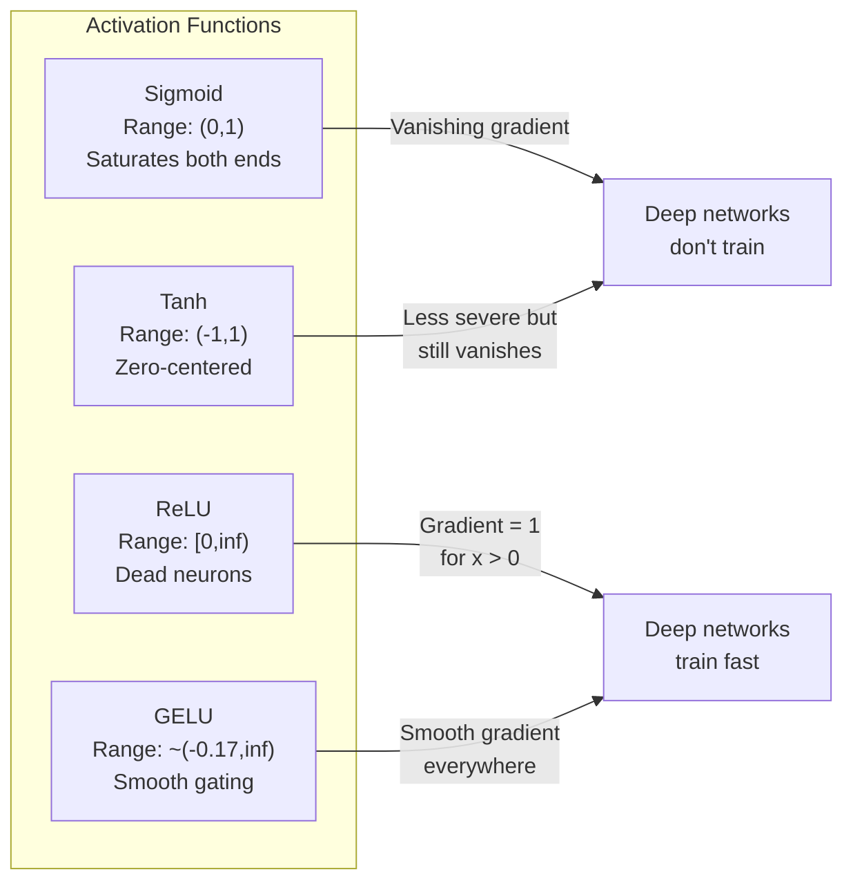
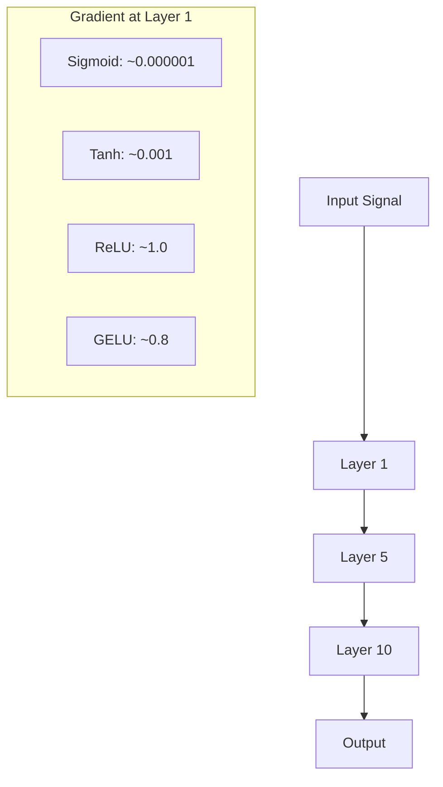
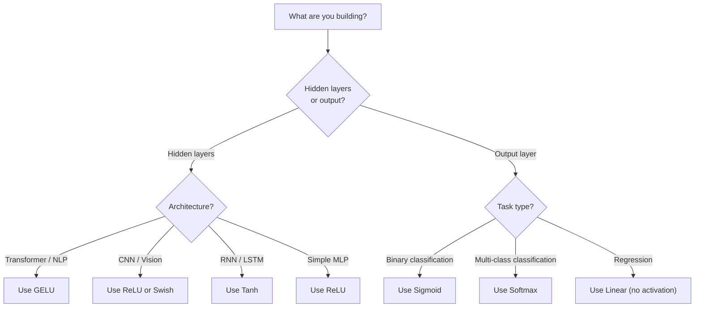

# Activation Functions

> بدون اللاخطية، ستكون شبكتك المكونة من 100 طبقة عبارة عن مصفوفة مضاعفة رائعة. التنشيطات هي البوابات التي تسمح للشبكات العصبية بالتفكير في المنحنيات.

**النوع:** بناء
** اللغات: ** بايثون
**المتطلبات:** الدرس 03.03 (الانتشار العكسي)
**الوقت:** ~75 دقيقة

## Learning Objectives

- تنفيذ sigmoid وtanh وReLU وLeaky ReLU وGELU وSwish وsoftmax مع مشتقاتها من الصفر
- تشخيص مشكلة التدرج المتلاشي عن طريق قياس مقادير التنشيط من خلال أكثر من 10 طبقات بتنشيطات مختلفة
- اكتشف الخلايا العصبية الميتة في شبكة ReLU واشرح سبب تجنب GELU وضع الفشل هذا
- حدد وظيفة التنشيط الصحيحة لبنية معينة (المحول، CNN، RNN، طبقة الإخراج)

## The Problem

قم بتكديس تحويلين خطيين: y = W2(W1x + b1) + b2. قم بتوسيعه: y = W2W1x + W2b1 + b2. هذا فقط y = Ax + c -- تحويل خطي واحد. بغض النظر عن عدد الطبقات الخطية التي تقوم بتكديسها، فإن النتيجة تنهار إلى مصفوفة واحدة مضاعفة. تتمتع شبكتك المكونة من 100 طبقة بنفس القوة التمثيلية التي تتمتع بها الطبقة الواحدة.

هذا ليس فضولًا نظريًا. وهذا يعني أن الشبكة الخطية العميقة لا يمكنها حرفيًا تعلم XOR، ولا يمكنها تصنيف مجموعة بيانات حلزونية، ولا يمكنها التعرف على الوجه. وبدون وظائف التنشيط، يصبح العمق مجرد وهم.

وظائف التنشيط تكسر الخطية. فهي تشوه مخرجات كل طبقة من خلال وظيفة غير خطية، مما يمنح الشبكة القدرة على ثني حدود القرار، وتقريب الوظائف التعسفية، والتعلم الفعلي. لكن اختر التنشيط الخاطئ وستختفي تدرجاتك إلى الصفر (السيني في الشبكات العميقة)، أو تنفجر إلى ما لا نهاية (عمليات التنشيط غير المحدودة دون تهيئة دقيقة)، أو تموت الخلايا العصبية لديك بشكل دائم (ReLU مع تحيزات سلبية كبيرة). يحدد اختيار وظيفة التنشيط بشكل مباشر ما إذا كانت شبكتك تتعلم على الإطلاق.

## The Concept

### Why Nonlinearity Is Necessary

ضرب المصفوفة قابل للتركيب. ضرب المتجه في المصفوفة A ثم المصفوفة B يطابق الضرب في AB. وهذا يعني أن تكديس عشر طبقات خطية يعادل رياضيًا طبقة خطية واحدة بمصفوفة واحدة كبيرة. كل تلك المعلمات، كل هذا العمق -- ضاعت. أنت بحاجة إلى شيء لكسر السلسلة. هذا ما تفعله وظائف التنشيط.

هنا هو الدليل. طبقة خطية تحسب f(x) = Wx + b. المكدس الثاني:

```
Layer 1: h = W1 * x + b1
Layer 2: y = W2 * h + b2
```

Substitute:

```
y = W2 * (W1 * x + b1) + b2
y = (W2 * W1) * x + (W2 * b1 + b2)
y = A * x + c
```

طبقة واحدة. أدخل تنشيطًا غير خطي g() بين الطبقات:

```
h = g(W1 * x + b1)
y = W2 * h + b2
```

الآن فواصل الاستبدال. لا يمكن اختزال W2 * g(W1 * x + b1) + b2 إلى تحويل خطي واحد. يمكن أن تمثل الشبكة وظائف غير خطية. تضيف كل طبقة إضافية يتم تفعيلها قدرة تمثيلية.

### Sigmoid

وظيفة التنشيط الأصلية للشبكات العصبية.

```
sigmoid(x) = 1 / (1 + e^(-x))
```

نطاق الإخراج: (0، 1). سلس وقابل للتمييز، ويعين أي رقم حقيقي إلى قيمة تشبه الاحتمالية.

المشتق:

```
sigmoid'(x) = sigmoid(x) * (1 - sigmoid(x))
```

القيمة القصوى لهذا المشتق هي 0.25، وتحدث عند x = 0. في الانتشار العكسي، تتضاعف التدرجات عبر الطبقات. عشر طبقات من السيني تعني أن التدرج يتضاعف بمقدار 0.25 على الأكثر عشر مرات:

```
0.25^10 = 0.000000953674
```

أقل من مليون من الإشارة الأصلية. هذه هي مشكلة التدرج التلاشي. تصبح التدرجات في الطبقات المبكرة صغيرة جدًا بحيث لا يتم تحديث الأوزان إلا بالكاد. يبدو أن الشبكة تتعلم، حيث تقل الخسارة في الطبقات اللاحقة، لكن الطبقات الأولى تتجمد. الشبكات السينيه العميقة ببساطة لا تتدرب.

مشكلة إضافية: تكون المخرجات السينية دائمًا موجبة (0 إلى 1)، مما يعني أن التدرجات في الأوزان تكون دائمًا نفس الإشارة. يؤدي هذا إلى التعرج أثناء نزول التدرج.

### Tanh

النسخة المركزية من السيني.

```
tanh(x) = (e^x - e^(-x)) / (e^x + e^(-x))
```

نطاق الإخراج: (-1، 1). مركزية الصفر، مما يقضي على مشكلة التعرج.

المشتق:

```
tanh'(x) = 1 - tanh(x)^2
```

الحد الأقصى للمشتق هو 1.0 عند x = 0 - أربع مرات أفضل من السيني. لكن مشكلة التدرج المتلاشي لا تزال موجودة. بالنسبة للمدخلات الإيجابية أو السلبية الكبيرة، يقترب المشتق من الصفر. لا تزال عشر طبقات تسحق التدرج، ولكن بقوة أقل.

### ReLU: The Breakthrough

الوحدة الخطية المصححة. وقد اشتهرت هذه الوظيفة للتعلم العميق من قبل ناير وهينتون في عام 2010 (الوظيفة نفسها تعود إلى عمل فوكوشيما في عام 1969)، وقد غيرت كل شيء.

```
relu(x) = max(0, x)
```

نطاق الإخراج: [0، ما لا نهاية). المشتق بسيط للغاية:

```
relu'(x) = 1  if x > 0
            0  if x <= 0
```

لا يوجد تدرج متلاشي للمدخلات الإيجابية. التدرج هو بالضبط 1، ويمر مباشرة من خلال. ولهذا السبب أصبحت الشبكات العميقة قابلة للتدريب، إذ تحافظ ReLU على حجم التدرج عبر الطبقات.

ولكن هناك وضع الفشل: مشكلة الخلايا العصبية الميتة. إذا كانت المدخلات المرجحة للخلية العصبية سلبية دائمًا (بسبب انحياز سلبي كبير أو تهيئة الوزن المؤسفة)، فإن مخرجاتها تكون دائمًا صفرًا، ويكون تدرجها دائمًا صفرًا، ولا يتم تحديثها أبدًا. إنه ميت إلى الأبد. من الناحية العملية، يمكن أن يموت ما بين 10% إلى 40% من الخلايا العصبية في شبكة ReLU أثناء التدريب.

### Leaky ReLU

أبسط حل للخلايا العصبية الميتة.

```
leaky_relu(x) = x        if x > 0
                alpha * x if x <= 0
```

حيث ألفا هو ثابت صغير، عادة 0.01. الجانب السلبي لديه ميل صغير بدلاً من الصفر، لذلك لا تزال الخلايا العصبية الميتة تحصل على إشارة التدرج ويمكنها التعافي.

### GELU: The Modern Default

وحدة الخطأ الخطي الغوسي. تم تقديمه بواسطة Hendrycks وGimpel في عام 2016. التنشيط الافتراضي في BERT، GPT، ومعظم المحولات الحديثة.

```
gelu(x) = x * Phi(x)
```

حيث Phi(x) هي دالة التوزيع التراكمي للتوزيع الطبيعي القياسي. التقريب المستخدم عملياً:

```
gelu(x) ~= 0.5 * x * (1 + tanh(sqrt(2/pi) * (x + 0.044715 * x^3)))
```

GELU سلس في كل مكان، ويسمح بقيم سلبية صغيرة (على عكس ReLU الذي يصل إلى الصفر)، وله تفسير احتمالي: فهو يزن كل مدخل من خلال مدى احتمالية أن يكون موجبًا في ظل توزيع غاوسي. يتفوق هذا البوابات السلسة على ReLU في بنيات المحولات لأنه يوفر تدفقًا متدرجًا أفضل ويتجنب مشكلة الخلايا العصبية الميتة تمامًا.

### Swish / SiLU

التنشيط الذاتي الذي اكتشفه راماشاندران وآخرون. في عام 2017 من خلال البحث الآلي.

```
swish(x) = x * sigmoid(x)
```

حفيف هو رسميا x * السيني (x). اكتشفت جوجل ذلك من خلال البحث الآلي في مساحة وظيفة التنشيط - وهي شبكة عصبية تصمم أجزاء من الشبكات العصبية.

مثل GELU، فهو سلس وغير رتيب ويسمح بقيم سلبية صغيرة. الفرق دقيق: يستخدم Swish السيني للبوابة بينما يستخدم GELU الغاوسي CDF. ومن الناحية العملية، الأداء متطابق تقريبًا. يتم استخدام Swish في EfficientNet وبعض نماذج الرؤية. GELU يهيمن في النماذج اللغوية.

### Softmax: The Output Activation

لا يستخدم في الطبقات المخفية. تقوم Softmax بتحويل متجه الدرجات الأولية (logits) إلى توزيع احتمالي.

```
softmax(x_i) = e^(x_i) / sum(e^(x_j) for all j)
```

يتراوح كل مخرج بين 0 و1. مجموع جميع المخرجات هو 1. وهذا make هو التنشيط النهائي القياسي للتصنيف متعدد الفئات. أكبر logit يحصل على أعلى احتمال، ولكن على عكس argmax، softmax قابل للتمييز ويحافظ على المعلومات حول الثقة النسبية.

### Comparison of Shapes



### Gradient Flow Comparison



### Which Activation When



## Build It

### Step 1: Implement All Activation Functions with Derivatives

تأخذ كل دالة تعويمًا واحدًا وترجع تعويمًا. تأخذ كل دالة مشتقة نفس المدخلات وترجع التدرج.

```python
import math

def sigmoid(x):
    x = max(-500, min(500, x))
    return 1.0 / (1.0 + math.exp(-x))

def sigmoid_derivative(x):
    s = sigmoid(x)
    return s * (1 - s)

def tanh_act(x):
    return math.tanh(x)

def tanh_derivative(x):
    t = math.tanh(x)
    return 1 - t * t

def relu(x):
    return max(0.0, x)

def relu_derivative(x):
    return 1.0 if x > 0 else 0.0

def leaky_relu(x, alpha=0.01):
    return x if x > 0 else alpha * x

def leaky_relu_derivative(x, alpha=0.01):
    return 1.0 if x > 0 else alpha

def gelu(x):
    return 0.5 * x * (1 + math.tanh(math.sqrt(2 / math.pi) * (x + 0.044715 * x ** 3)))

def gelu_derivative(x):
    phi = 0.5 * (1 + math.erf(x / math.sqrt(2)))
    pdf = math.exp(-0.5 * x * x) / math.sqrt(2 * math.pi)
    return phi + x * pdf

def swish(x):
    return x * sigmoid(x)

def swish_derivative(x):
    s = sigmoid(x)
    return s + x * s * (1 - s)

def softmax(xs):
    max_x = max(xs)
    exps = [math.exp(x - max_x) for x in xs]
    total = sum(exps)
    return [e / total for e in exps]
```

### Step 2: Visualize Where Gradients Die

احسب التدرج عند 100 نقطة متباعدة بشكل متساوٍ من -5 إلى 5. اطبع رسمًا بيانيًا نصيًا يوضح المكان الذي يكون فيه تدرج كل تنشيط قريبًا من الصفر.

```python
def gradient_scan(name, derivative_fn, start=-5, end=5, n=100):
    step = (end - start) / n
    near_zero = 0
    healthy = 0
    for i in range(n):
        x = start + i * step
        g = derivative_fn(x)
        if abs(g) < 0.01:
            near_zero += 1
        else:
            healthy += 1
    pct_dead = near_zero / n * 100
    print(f"{name:15s}: {healthy:3d} healthy, {near_zero:3d} near-zero ({pct_dead:.0f}% dead zone)")

gradient_scan("Sigmoid", sigmoid_derivative)
gradient_scan("Tanh", tanh_derivative)
gradient_scan("ReLU", relu_derivative)
gradient_scan("Leaky ReLU", leaky_relu_derivative)
gradient_scan("GELU", gelu_derivative)
gradient_scan("Swish", swish_derivative)
```

### Step 3: Vanishing Gradient Experiment

قم بتمرير الإشارة إلى الأمام عبر طبقات N باستخدام السيني مقابل ReLU. قياس كيفية تغير حجم التنشيط.

```python
import random

def vanishing_gradient_experiment(activation_fn, name, n_layers=10, n_inputs=5):
    random.seed(42)
    values = [random.gauss(0, 1) for _ in range(n_inputs)]

    print(f"\n{name} through {n_layers} layers:")
    for layer in range(n_layers):
        weights = [random.gauss(0, 1) for _ in range(n_inputs)]
        z = sum(w * v for w, v in zip(weights, values))
        activated = activation_fn(z)
        magnitude = abs(activated)
        bar = "#" * int(magnitude * 20)
        print(f"  Layer {layer+1:2d}: magnitude = {magnitude:.6f} {bar}")
        values = [activated] * n_inputs

vanishing_gradient_experiment(sigmoid, "Sigmoid")
vanishing_gradient_experiment(relu, "ReLU")
vanishing_gradient_experiment(gelu, "GELU")
```

### Step 4: Dead Neuron Detector

قم بإنشاء شبكة ReLU، وقم بتمرير مدخلات عشوائية من خلالها، وقم بإحصاء عدد الخلايا العصبية التي لا تنشط أبدًا.

```python
def dead_neuron_detector(n_inputs=5, hidden_size=20, n_samples=1000):
    random.seed(0)
    weights = [[random.gauss(0, 1) for _ in range(n_inputs)] for _ in range(hidden_size)]
    biases = [random.gauss(0, 1) for _ in range(hidden_size)]

    fire_counts = [0] * hidden_size

    for _ in range(n_samples):
        inputs = [random.gauss(0, 1) for _ in range(n_inputs)]
        for neuron_idx in range(hidden_size):
            z = sum(w * x for w, x in zip(weights[neuron_idx], inputs)) + biases[neuron_idx]
            if relu(z) > 0:
                fire_counts[neuron_idx] += 1

    dead = sum(1 for c in fire_counts if c == 0)
    rarely_fire = sum(1 for c in fire_counts if 0 < c < n_samples * 0.05)
    healthy = hidden_size - dead - rarely_fire

    print(f"\nDead Neuron Report ({hidden_size} neurons, {n_samples} samples):")
    print(f"  Dead (never fired):     {dead}")
    print(f"  Barely alive (<5%):     {rarely_fire}")
    print(f"  Healthy:                {healthy}")
    print(f"  Dead neuron rate:       {dead/hidden_size*100:.1f}%")

    for i, c in enumerate(fire_counts):
        status = "DEAD" if c == 0 else "WEAK" if c < n_samples * 0.05 else "OK"
        bar = "#" * (c * 40 // n_samples)
        print(f"  Neuron {i:2d}: {c:4d}/{n_samples} fires [{status:4s}] {bar}")

dead_neuron_detector()
```

### Step 5: Training Comparison -- Sigmoid vs ReLU vs GELU

قم بتدريب نفس الشبكة المكونة من طبقتين على مجموعة بيانات الدائرة (النقاط داخل الدائرة = الفئة 1، والخارج = الفئة 0) بثلاث عمليات تنشيط مختلفة. قارن سرعة التقارب.

```python
def make_circle_data(n=200, seed=42):
    random.seed(seed)
    data = []
    for _ in range(n):
        x = random.uniform(-2, 2)
        y = random.uniform(-2, 2)
        label = 1.0 if x * x + y * y < 1.5 else 0.0
        data.append(([x, y], label))
    return data


class ActivationNetwork:
    def __init__(self, activation_fn, activation_deriv, hidden_size=8, lr=0.1):
        random.seed(0)
        self.act = activation_fn
        self.act_d = activation_deriv
        self.lr = lr
        self.hidden_size = hidden_size

        self.w1 = [[random.gauss(0, 0.5) for _ in range(2)] for _ in range(hidden_size)]
        self.b1 = [0.0] * hidden_size
        self.w2 = [random.gauss(0, 0.5) for _ in range(hidden_size)]
        self.b2 = 0.0

    def forward(self, x):
        self.x = x
        self.z1 = []
        self.h = []
        for i in range(self.hidden_size):
            z = self.w1[i][0] * x[0] + self.w1[i][1] * x[1] + self.b1[i]
            self.z1.append(z)
            self.h.append(self.act(z))

        self.z2 = sum(self.w2[i] * self.h[i] for i in range(self.hidden_size)) + self.b2
        self.out = sigmoid(self.z2)
        return self.out

    def backward(self, target):
        error = self.out - target
        d_out = error * self.out * (1 - self.out)

        for i in range(self.hidden_size):
            d_h = d_out * self.w2[i] * self.act_d(self.z1[i])
            self.w2[i] -= self.lr * d_out * self.h[i]
            for j in range(2):
                self.w1[i][j] -= self.lr * d_h * self.x[j]
            self.b1[i] -= self.lr * d_h
        self.b2 -= self.lr * d_out

    def train(self, data, epochs=200):
        losses = []
        for epoch in range(epochs):
            total_loss = 0
            correct = 0
            for x, y in data:
                pred = self.forward(x)
                self.backward(y)
                total_loss += (pred - y) ** 2
                if (pred >= 0.5) == (y >= 0.5):
                    correct += 1
            avg_loss = total_loss / len(data)
            accuracy = correct / len(data) * 100
            losses.append(avg_loss)
            if epoch % 50 == 0 or epoch == epochs - 1:
                print(f"    Epoch {epoch:3d}: loss={avg_loss:.4f}, accuracy={accuracy:.1f}%")
        return losses


data = make_circle_data()

configs = [
    ("Sigmoid", sigmoid, sigmoid_derivative),
    ("ReLU", relu, relu_derivative),
    ("GELU", gelu, gelu_derivative),
]

results = {}
for name, act_fn, act_d_fn in configs:
    print(f"\n=== Training with {name} ===")
    net = ActivationNetwork(act_fn, act_d_fn, hidden_size=8, lr=0.1)
    losses = net.train(data, epochs=200)
    results[name] = losses

print("\n=== Final Loss Comparison ===")
for name, losses in results.items():
    print(f"  {name:10s}: start={losses[0]:.4f} -> end={losses[-1]:.4f} (improvement: {(1 - losses[-1]/losses[0])*100:.1f}%)")
```

## Use It

PyTorch يوفر كل هذه الأشكال الوظيفية والنموذجية:

```python
import torch
import torch.nn as nn
import torch.nn.functional as F

x = torch.randn(4, 10)

relu_out = F.relu(x)
gelu_out = F.gelu(x)
sigmoid_out = torch.sigmoid(x)
swish_out = F.silu(x)

logits = torch.randn(4, 5)
probs = F.softmax(logits, dim=1)

model = nn.Sequential(
    nn.Linear(10, 64),
    nn.GELU(),
    nn.Linear(64, 32),
    nn.GELU(),
    nn.Linear(32, 5),
)
```

الطبقات المخفية في المحول: GELU. الطبقات المخفية في CNN: ReLU. طبقة الإخراج للتصنيف: softmax. طبقة الإخراج للانحدار: لا شيء (خطي). طبقة الإخراج للاحتمالات: السيني. هذا كل شيء. ابدأ بهذه الإعدادات الافتراضية. قم بتغييرها فقط عندما يكون لديك دليل.

تستخدم RNNs وLSTMs tanh للحالة المخفية والسيني للبوابات، ولكن إذا كنت تقوم بالبناء من الصفر اليوم، فمن المحتمل أنك لا تستخدم RNNs. إذا كانت الخلايا العصبية تموت في شبكة ReLU الخاصة بك، فانتقل إلى GELU. لا تصل إلى Leaky ReLU إلا إذا كان لديك سبب محدد -- GELU يحل مشكلة الخلايا العصبية الميتة ويعطي تدفقًا متدرجًا أفضل.

## Ship It

ينتج هذا الدرس:
- `outputs/prompt-activation-selector.md` -- مطالبة قابلة لإعادة الاستخدام تساعدك على اختيار وظيفة التنشيط المناسبة لأي بنية

## Exercises

1. قم بتنفيذ Parametric ReLU (PReLU) حيث يكون المنحدر السلبي ألفا معلمة قابلة للتعلم. قم بتدريبها على مجموعة بيانات الدائرة ومقارنتها بـ Leaky ReLU الثابتة.

2. قم بإجراء تجربة التدرج المتلاشي باستخدام 50 طبقة بدلاً من 10. ارسم الحجم في كل طبقة لـ sigmoid وtanh وReLU وGELU. في أي طبقة تصل إشارة التنشيط إلى الصفر بشكل فعال؟

3. قم بتنفيذ ELU (الوحدة الخطية الأسية): elu(x) = x if x > 0, alpha * (e^x - 1) if x <= 0. قارن معدل الخلايا العصبية الميتة مع ReLU على نفس الشبكة.

4. أنشئ "جهاز مراقبة صحة التدرج" الذي يتم تشغيله أثناء التدريب: في كل فترة، قم بحساب متوسط ​​حجم التدرج في كل طبقة. اطبع تحذيرًا عندما ينخفض ​​تدرج أي طبقة إلى أقل من 0.001 أو يتجاوز 100.

5. قم بتعديل مقارنة التدريب لاستخدام مجموعة البيانات XOR من الدرس 01 بدلاً من الدوائر. أي التنشيط يتقارب بشكل أسرع على XOR؟ لماذا يختلف هذا عن نتائج الدائرة؟

## Key Terms

| مصطلح | ماذا يقول الناس | ماذا يعني في الواقع |
|------|----------------|----------------------|
| وظيفة التنشيط | "الجزء غير الخطي" | وظيفة يتم تطبيقها على مخرجات كل خلية عصبية والتي تكسر الخطية، مما يتيح للشبكة تعلم التعيينات غير الخطية |
| التلاشي التدرج | "تختفي التدرجات في الشبكات العميقة" | تتقلص التدرجات بشكل كبير عبر الطبقات عندما يكون مشتق التنشيط أقل من 1، مما يجعل الطبقات المبكرة غير قابلة للتدريب |
| انفجار التدرج | "التدرجات تنفجر" | تنمو التدرجات بشكل كبير عبر الطبقات عندما يتجاوز المضاعف الفعال 1، مما يتسبب في تدريب غير مستقر |
| الخلايا العصبية الميتة | "الخلية العصبية التي توقفت عن التعلم" | خلية عصبية ReLU تكون مدخلاتها سلبية بشكل دائم، وتنتج صفرًا من المخرجات وتدرجًا صفريًا |
| السيني | "يسحق القيم إلى 0-1" | الوظيفة اللوجستية 1/(1+e^-x)، ذات أهمية تاريخية ولكنها تتسبب في تلاشي التدرجات في الشبكات العميقة |
| ريلو | "مقاطع السلبيات إلى الصفر" | max(0, x) - التنشيط الذي جعل التعلم العميق عمليًا من خلال الحفاظ على حجم التدرج |
| GELU | "تفعيل المحولات" | وحدة الخطأ الخطي Gaussian Error Linear Unit، وهي عبارة عن تنشيط سلس يقوم بوزن المدخلات حسب احتمالية أن تكون موجبة |
| حفيف/سيلو | "ReLU ذاتي البوابات" | x * sigmoid(x)، تم اكتشافه من خلال البحث الآلي، المستخدم في EfficientNet |
| سوفت ماكس | "يحول النتائج إلى احتمالات" | تطبيع متجه logits إلى توزيع احتمالي حيث تكون جميع القيم في (0,1) ومجموعها 1 |
| متسرب ReLU | "ReLU الذي لا يموت" | max(alpha*x, x) حيث تكون ألفا صغيرة (0.01)، مما يمنع الخلايا العصبية الميتة عن طريق السماح بتدرجات سلبية صغيرة |
| التشبع | "الجزء المسطح من السيني" | المناطق التي يقترب فيها مشتق التنشيط من الصفر، مما يمنع تدفق التدرج |
| لوgit | "النتيجة الأولية قبل softmax" | الإخراج غير الطبيعي للطبقة النهائية قبل تطبيق softmax أو sigmoid |

## Further Reading

- ناير وهينتون، "الوحدات الخطية المصححة تعمل على تحسين آلات بولتزمان المقيدة" (2010) - الورقة التي قدمت ReLU ومكنت من تدريب الشبكات العميقة
- Hendrycks & Gimpel، "وحدات الخطأ الخطي الغوسية (GELUs)" (2016) - قدمت وظيفة التنشيط التي أصبحت الوظيفة الافتراضية للمحولات
- راماشاندران وآخرون، "البحث عن وظائف التنشيط" (2017) - استخدم البحث الآلي لاكتشاف Swish، مما يوضح أن تصميم التنشيط يمكن أن يكون آليًا
- Glorot & Bengio، "فهم صعوبة تدريب الشبكات العصبية العميقة المغذية" (2010) - الورقة التي شخصت التدرجات التلاشي/الانفجار واقترحت تهيئة Xavier
- Goodfellow، Bengio، Courville، "التعلم العميق" الفصل 6.3 (https://www.deeplearningbook.org/) -- معالجة صارمة للوحدات المخفية ووظائف التنشيط
