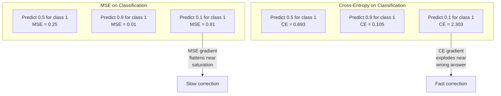
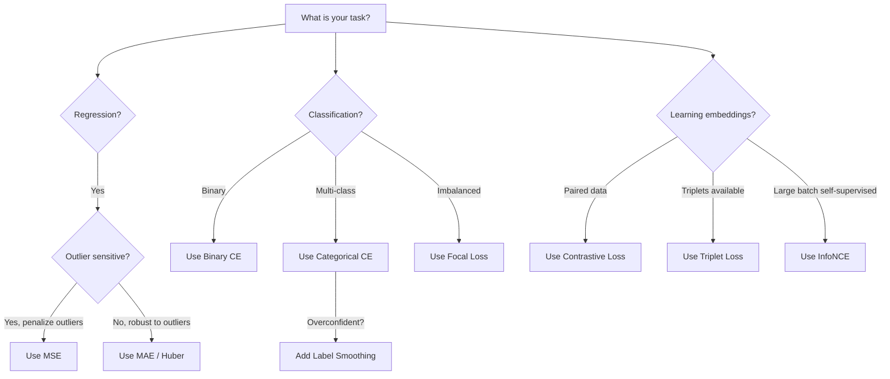
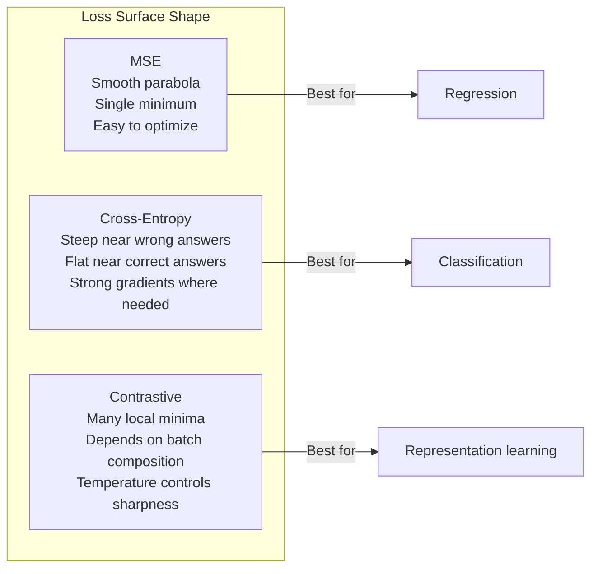

# Loss Functions

> شبكتك make هي التنبؤ. والحقيقة الأرضية تقول خلاف ذلك. ما مدى الخطأ؟ هذا الرقم هو الخسارة. اختر دالة الخسارة الخاطئة وسيقوم النموذج الخاص بك بتحسين الشيء الخطأ تمامًا.

**النوع:** بناء
** اللغات: ** بايثون
**المتطلبات السابقة:** الدرس 03.04 (وظائف التنشيط)
**الوقت:** ~75 دقيقة

## Learning Objectives

- تنفيذ MSE، والإنتروبيا الثنائية المتقاطعة، والإنتروبيا المتقاطعة القاطعة، والخسارة التباينية (InfoNCE) من الصفر مع تدرجاتها
- اشرح سبب فشل MSE في التصنيف من خلال إظهار وضع الفشل "توقع 0.5 لكل شيء"
- قم بتطبيق تجانس الملصقات على الإنتروبيا المتقاطعة ووصف كيف يمنع التنبؤات المفرطة في الثقة
- اختر دالة الخسارة الصحيحة للانحدار والتصنيف الثنائي والتصنيف متعدد الفئات وتضمين مهام التعلم

## The Problem

النموذج الذي يقلل من MSE في مشكلة التصنيف سوف يتنبأ بثقة بـ 0.5 لكل شيء. إنه يقلل من الخسارة. كما أنها عديمة الفائدة.

وظيفة الخسارة هي الشيء الوحيد الذي يقوم نموذجك بتحسينه فعليًا. ليست دقة. ليس F1 النتيجة. ليس أي مقياس تقوم بإبلاغ مديرك به. يأخذ المحسن تدرج دالة الخسارة ويضبط الأوزان إلى make هذا الرقم أصغر. إذا لم تلتقط دالة الخسارة ما يهمك، فسيجد النموذج أرخص طريقة رياضيًا لإرضائه، وهذه الطريقة لن تكون أبدًا ما أردته.

هنا مثال ملموس. لديك مهمة تصنيف ثنائية. فئتين، 50/50 مقسمة. أنت تستخدم MSE كخسارتك. يتنبأ النموذج بـ 0.5 لكل مدخل. المتوسط ​​MSE هو 0.25، وهو الحد الأدنى الممكن دون تعلم أي شيء فعليًا. يتمتع النموذج بقدرة تمييزية صفرية ولكنه يقلل من الناحية الفنية من وظيفة الخسارة. قم بالتبديل إلى الإنتروبيا المتقاطعة وسيضطر النموذج نفسه إلى دفع التوقعات نحو 0 أو 1، لأن -log(0.5) = 0.693 يمثل خسارة فادحة، بينما -log(0.99) = 0.01 يكافئ التنبؤات الصحيحة الواثقة. إن اختيار دالة الخسارة هو الفرق بين النموذج الذي يتعلم والنموذج الذي يتلاعب بالمقياس.

الأمر يزداد سوءا. في التعلم الخاضع للإشراف الذاتي، ليس لديك حتى تسميات. تحدد الخسارة التباينية إشارة التعلم بالكامل: ما الذي يعتبر متشابهًا، وما الذي يعتبر مختلفًا، ومدى صعوبة النموذج في الفصل بينهما. احصل على خسارة تباينية خاطئة وستنهار عمليات التضمين الخاصة بك إلى نقطة واحدة - يتم تعيين كل إدخال إلى نفس المتجه. خسارة صفر من الناحية الفنية. لا قيمة لها على الإطلاق.

## The Concept

### Mean Squared Error (MSE)

الافتراضي للانحدار. حساب الفرق التربيعي بين التنبؤ والهدف، المتوسط ​​على جميع العينات.

```
MSE = (1/n) * sum((y_pred - y_true)^2)
```

لماذا يهم التربيع: فهو يعاقب الأخطاء الكبيرة بشكل تربيعي. خطأ 2 يكلف 4x بقدر خطأ 1. خطأ 10 يكلف 100x. هذا makes MSE حساس للقيم المتطرفة - توقع واحد خاطئ إلى حد كبير يهيمن على الخسارة.

أرقام حقيقية: إذا كان النموذج الخاص بك يتنبأ بأسعار المساكن وكان أقل بمقدار 10000 دولار أمريكي في معظم المنازل ولكنه انخفض بمقدار 200000 دولار أمريكي في قصر واحد، فسوف يحاول MSE بقوة إصلاح هذا القصر الواحد، مما قد يؤدي إلى الإضرار بالأداء في 99 منزلًا آخر.

التدرج MSE فيما يتعلق بالتنبؤ هو:

```
dMSE/dy_pred = (2/n) * (y_pred - y_true)
```

الخطية في الخطأ. الأخطاء الأكبر تؤدي إلى تدرجات أكبر. هذه ميزة للانحدار (الأخطاء الكبيرة تحتاج إلى تصحيحات كبيرة) وخطأ للتصنيف (تريد معاقبة الإجابات الخاطئة الواثقة بشكل كبير، وليس خطيًا).

### Cross-Entropy Loss

وظيفة الخسارة للتصنيف. متجذرة في نظرية المعلومات - فهي تقيس الاختلاف بين التوزيع الاحتمالي المتوقع والتوزيع الحقيقي.

**الإنتروبيا الثنائية (BCE):**

```
BCE = -(y * log(p) + (1 - y) * log(1 - p))
```

حيث y هي التسمية الحقيقية (0 أو 1) وp هي الاحتمال المتوقع.

لماذا يعمل -log(p): عندما تكون التسمية الحقيقية هي 1 وتتوقع p = 0.99، تكون الخسارة -log(0.99) = 0.01. عندما تتنبأ بـ p = 0.01، تكون الخسارة -log(0.01) = 4.6. هذا الاختلاف البالغ 460x هو سبب نجاح الإنتروبيا المتقاطعة. إنه يعاقب بوحشية التنبؤات الخاطئة الواثقة بينما بالكاد يعاقب التنبؤات الصحيحة الواثقة.

التدرج يحكي نفس القصة:

```
dBCE/dp = -(y/p) + (1-y)/(1-p)
```

عندما تكون y = 1 وp قريبة من الصفر، يكون التدرج -1/p والذي يقترب من اللانهاية السالبة. يتلقى النموذج إشارة هائلة لإصلاح خطأه. عندما تكون p قريبة من 1، يكون التدرج صغيرًا. صحيح بالفعل، لا شيء لإصلاحه.

** الانتروبيا القاطعة: **

لتصنيف متعدد الفئات مع أهداف مشفرة واحدة ساخنة.

```
CCE = -sum(y_i * log(p_i))
```

تساهم الفئة الحقيقية فقط في الخسارة (لأن جميع y_i الأخرى تساوي صفرًا). إذا كان هناك 10 فئات وحصلت الفئة الصحيحة على احتمال 0.1 (تخمين عشوائي)، فستكون الخسارة -log(0.1) = 2.3. إذا حصلت الفئة الصحيحة على احتمال 0.9، فإن الخسارة هي -log(0.9) = 0.105. يتعلم النموذج تركيز الكتلة الاحتمالية على الإجابة الصحيحة.

### Why MSE Fails for Classification



MSE تتسطح التدرجات عندما تكون التنبؤات قريبة من 0 أو 1 (بسبب التشبع السيني). تعوض التدرجات المتقاطعة للإنتروبيا عن ذلك - يلغي السجل - المناطق المسطحة في السيني، مما يعطي تدرجات قوية بالضبط في المكان الذي تكون هناك حاجة إليها بشدة.

### Label Smoothing

تقول التصنيفات القياسية "One-Hot" "هذا هو 100% فئة 3 و0% كل شيء آخر." هذا ادعاء قوي. تجانس الملصق يخففه:

```
smooth_label = (1 - alpha) * one_hot + alpha / num_classes
```

مع alpha = 0.1 و10 فئات: بدلاً من [0, 0, 1, 0,...]، يصبح الهدف [0.01، 0.01، 0.91، 0.01،...]. يستهدف النموذج 0.91 بدلاً من 1.0.

لماذا يعمل هذا: النموذج الذي يحاول إخراج 1.0 بالضبط من خلال softmax يحتاج إلى دفع logits إلى ما لا نهاية. يؤدي هذا إلى الإفراط في الثقة، ويضر بالتعميم، ويجعل النموذج هشًا أمام تحول التوزيع. يؤدي تجانس الملصقات إلى تحديد الهدف عند 0.9 (مع alpha=0.1)، مع الحفاظ على logits في نطاق معقول. GPTوأغلب الموديلات الحديثة تستخدم تجانس الملصقات أو ما يعادلها.

### Contrastive Loss

لا تسميات. لا توجد فصول دراسية. مجرد أزواج من المدخلات والسؤال: هل هذه متشابهة أم مختلفة؟

** فقدان التباين على نمط SimCLR (NT-Xent / InfoNCE):**

التقط صورة واحدة. قم بإنشاء عرضين معززين له (الاقتصاص، التدوير، اهتزاز اللون). هذان هما "الزوج الإيجابي" - ويجب أن يكون لهما تضمينات مماثلة. تشكل كل صورة أخرى في المجموعة "زوجًا سلبيًا" - يجب أن يكون لهما تضمينات مختلفة.

```
L = -log(exp(sim(z_i, z_j) / tau) / sum(exp(sim(z_i, z_k) / tau)))
```

حيث sim() يمثل تشابه جيب التمام، وz_i وz_j هما الزوج الموجب، ويكون المجموع على جميع السلبيات، ويتحكم tau (درجة الحرارة) في مدى حدة التوزيع. درجة حرارة منخفضة = سلبيات أصعب = فصل أكثر عدوانية.

الأرقام الحقيقية: حجم الدفعة 256 يعني 255 سالبًا لكل زوج موجب. درجة الحرارة تاو = 0.07 (SimCLR الافتراضي). تبدو الخسارة وكأنها softmax على أوجه التشابه - فهي تريد أن يكون تشابه الزوج الإيجابي هو الأعلى بين جميع الخيارات الـ 256.

**خسارة ثلاثية:**

يأخذ ثلاثة مدخلات: مرساة، إيجابية (نفس الفئة)، سلبية (فئة مختلفة).

```
L = max(0, d(anchor, positive) - d(anchor, negative) + margin)
```

يفرض الهامش (عادةً 0.2-1.0) فجوة دنيا بين المسافات الموجبة والسالبة. إذا كانت النتيجة السلبية بعيدة بما فيه الكفاية بالفعل، فستكون الخسارة صفرًا - لا يوجد تدرج ولا تحديث. هذا التدريب make فعال ولكنه يتطلب تعدينًا ثلاثيًا دقيقًا (اختيار السلبيات الصعبة القريبة من المرساة).

### Focal Loss

لمجموعات البيانات غير المتوازنة. يعالج الإنتروبيا القياسية جميع الأمثلة المصنفة بشكل صحيح بالتساوي. أمثلة سهلة لتخفيض الأوزان البؤرية:

```
FL = -alpha * (1 - p_t)^gamma * log(p_t)
```

حيث p_t هو الاحتمال المتوقع للفئة الحقيقية وتتحكم جاما في التركيز. مع جاما = 0، هذا هو الانتروبيا القياسية. مع جاما = 2 (الافتراضي):

- مثال سهل (p_t = 0.9): الوزن = (0.1)^2 = 0.01. تم تجاهلها بشكل فعال.
- مثال صعب (p_t = 0.1): الوزن = (0.9)^2 = 0.81. إشارة التدرج الكامل.

تم تقديم الخسارة البؤرية بواسطة Lin et al. للكشف عن الكائنات، حيث تكون 99% من المناطق المرشحة خلفية (سلبيات سهلة). بدون فقدان التركيز، يغرق النموذج في أمثلة الخلفية السهلة ولا يتعلم أبدًا اكتشاف الأشياء. ومن خلاله، يركز النموذج قدرته على الحالات الصعبة والغامضة ذات الأهمية.

### Loss Function Decision Tree



### Loss Landscape



## Build It

### Step 1: MSE and Its Gradient

```python
def mse(predictions, targets):
    n = len(predictions)
    total = 0.0
    for p, t in zip(predictions, targets):
        total += (p - t) ** 2
    return total / n

def mse_gradient(predictions, targets):
    n = len(predictions)
    grads = []
    for p, t in zip(predictions, targets):
        grads.append(2.0 * (p - t) / n)
    return grads
```

### Step 2: Binary Cross-Entropy

مشكلة السجل (0) حقيقية. إذا كان النموذج يتوقع 0 بالضبط لمثال إيجابي، سجل (0) = اللانهاية السلبية. القطع يمنع هذا

```python
import math

def binary_cross_entropy(predictions, targets, eps=1e-15):
    n = len(predictions)
    total = 0.0
    for p, t in zip(predictions, targets):
        p_clipped = max(eps, min(1 - eps, p))
        total += -(t * math.log(p_clipped) + (1 - t) * math.log(1 - p_clipped))
    return total / n

def bce_gradient(predictions, targets, eps=1e-15):
    grads = []
    for p, t in zip(predictions, targets):
        p_clipped = max(eps, min(1 - eps, p))
        grads.append(-(t / p_clipped) + (1 - t) / (1 - p_clipped))
    return grads
```

### Step 3: Categorical Cross-Entropy with Softmax

يقوم Softmax بتحويل logits الخام إلى احتمالات. ثم نقوم بحساب الإنتروبيا المتقاطعة ضد الأهداف الساخنة.

```python
def softmax(logits):
    max_val = max(logits)
    exps = [math.exp(x - max_val) for x in logits]
    total = sum(exps)
    return [e / total for e in exps]

def categorical_cross_entropy(logits, target_index, eps=1e-15):
    probs = softmax(logits)
    p = max(eps, probs[target_index])
    return -math.log(p)

def cce_gradient(logits, target_index):
    probs = softmax(logits)
    grads = list(probs)
    grads[target_index] -= 1.0
    return grads
```

يتم تبسيط تدرج softmax + cross-interpy بشكل جميل: إنه فقط (الاحتمال المتوقع - 1) للفئة الحقيقية، و(الاحتمال المتوقع) لجميع الفئات الأخرى. هذا التبسيط الأنيق ليس محض صدفة، بل هو السبب وراء اقتران softmax والإنتروبيا المتقاطعة.

### Step 4: Label Smoothing

```python
def label_smoothed_cce(logits, target_index, num_classes, alpha=0.1, eps=1e-15):
    probs = softmax(logits)
    loss = 0.0
    for i in range(num_classes):
        if i == target_index:
            smooth_target = 1.0 - alpha + alpha / num_classes
        else:
            smooth_target = alpha / num_classes
        p = max(eps, probs[i])
        loss += -smooth_target * math.log(p)
    return loss
```

### Step 5: Contrastive Loss (Simplified InfoNCE)

```python
def cosine_similarity(a, b):
    dot = sum(x * y for x, y in zip(a, b))
    norm_a = math.sqrt(sum(x * x for x in a))
    norm_b = math.sqrt(sum(x * x for x in b))
    if norm_a < 1e-10 or norm_b < 1e-10:
        return 0.0
    return dot / (norm_a * norm_b)

def contrastive_loss(anchor, positive, negatives, temperature=0.07):
    sim_pos = cosine_similarity(anchor, positive) / temperature
    sim_negs = [cosine_similarity(anchor, neg) / temperature for neg in negatives]

    max_sim = max(sim_pos, max(sim_negs)) if sim_negs else sim_pos
    exp_pos = math.exp(sim_pos - max_sim)
    exp_negs = [math.exp(s - max_sim) for s in sim_negs]
    total_exp = exp_pos + sum(exp_negs)

    return -math.log(max(1e-15, exp_pos / total_exp))
```

### Step 6: MSE vs Cross-Entropy on Classification

قم بتدريب نفس الشبكة من الدرس 04 (مجموعة بيانات الدائرة) مع وظيفتي الخسارة. شاهد الإنتروبيا المتقاطعة تتقارب بشكل أسرع.

```python
import random

def sigmoid(x):
    x = max(-500, min(500, x))
    return 1.0 / (1.0 + math.exp(-x))

def make_circle_data(n=200, seed=42):
    random.seed(seed)
    data = []
    for _ in range(n):
        x = random.uniform(-2, 2)
        y = random.uniform(-2, 2)
        label = 1.0 if x * x + y * y < 1.5 else 0.0
        data.append(([x, y], label))
    return data


class LossComparisonNetwork:
    def __init__(self, loss_type="bce", hidden_size=8, lr=0.1):
        random.seed(0)
        self.loss_type = loss_type
        self.lr = lr
        self.hidden_size = hidden_size

        self.w1 = [[random.gauss(0, 0.5) for _ in range(2)] for _ in range(hidden_size)]
        self.b1 = [0.0] * hidden_size
        self.w2 = [random.gauss(0, 0.5) for _ in range(hidden_size)]
        self.b2 = 0.0

    def forward(self, x):
        self.x = x
        self.z1 = []
        self.h = []
        for i in range(self.hidden_size):
            z = self.w1[i][0] * x[0] + self.w1[i][1] * x[1] + self.b1[i]
            self.z1.append(z)
            self.h.append(max(0.0, z))

        self.z2 = sum(self.w2[i] * self.h[i] for i in range(self.hidden_size)) + self.b2
        self.out = sigmoid(self.z2)
        return self.out

    def backward(self, target):
        if self.loss_type == "mse":
            d_loss = 2.0 * (self.out - target)
        else:
            eps = 1e-15
            p = max(eps, min(1 - eps, self.out))
            d_loss = -(target / p) + (1 - target) / (1 - p)

        d_sigmoid = self.out * (1 - self.out)
        d_out = d_loss * d_sigmoid

        for i in range(self.hidden_size):
            d_relu = 1.0 if self.z1[i] > 0 else 0.0
            d_h = d_out * self.w2[i] * d_relu
            self.w2[i] -= self.lr * d_out * self.h[i]
            for j in range(2):
                self.w1[i][j] -= self.lr * d_h * self.x[j]
            self.b1[i] -= self.lr * d_h
        self.b2 -= self.lr * d_out

    def compute_loss(self, pred, target):
        if self.loss_type == "mse":
            return (pred - target) ** 2
        else:
            eps = 1e-15
            p = max(eps, min(1 - eps, pred))
            return -(target * math.log(p) + (1 - target) * math.log(1 - p))

    def train(self, data, epochs=200):
        losses = []
        for epoch in range(epochs):
            total_loss = 0.0
            correct = 0
            for x, y in data:
                pred = self.forward(x)
                self.backward(y)
                total_loss += self.compute_loss(pred, y)
                if (pred >= 0.5) == (y >= 0.5):
                    correct += 1
            avg_loss = total_loss / len(data)
            accuracy = correct / len(data) * 100
            losses.append((avg_loss, accuracy))
            if epoch % 50 == 0 or epoch == epochs - 1:
                print(f"    Epoch {epoch:3d}: loss={avg_loss:.4f}, accuracy={accuracy:.1f}%")
        return losses
```

## Use It

PyTorch يوفر جميع وظائف الخسارة القياسية مع الاستقرار الرقمي المدمج في:

```python
import torch
import torch.nn as nn
import torch.nn.functional as F

predictions = torch.tensor([0.9, 0.1, 0.7], requires_grad=True)
targets = torch.tensor([1.0, 0.0, 1.0])

mse_loss = F.mse_loss(predictions, targets)
bce_loss = F.binary_cross_entropy(predictions, targets)

logits = torch.randn(4, 10)
labels = torch.tensor([3, 7, 1, 9])
ce_loss = F.cross_entropy(logits, labels)
ce_smooth = F.cross_entropy(logits, labels, label_smoothing=0.1)
```

استخدم `F.cross_entropy` (وليس `F.nll_loss` بالإضافة إلى softmax اليدوي). فهو يجمع بين log-softmax واحتمالية السجل السالبة في عملية واحدة مستقرة عدديًا. يعد تطبيق softmax بشكل منفصل ثم أخذ السجل أقل استقرارًا - فأنت تفقد الدقة في طرح القيم الأسية الكبيرة.

بالنسبة للتعلم المتباين، تستخدم معظم الفرق تطبيقات أو مكتبات مخصصة مثل `lightly` أو `pytorch-metric-learning`. الحلقة الأساسية هي نفسها دائمًا: حساب أوجه التشابه الزوجية، وإنشاء softmax على الإيجابيات والسلبيات، والانتشار العكسي.

## Ship It

ينتج هذا الدرس:
- `outputs/prompt-loss-function-selector.md` - مطالبة قابلة لإعادة الاستخدام لاختيار وظيفة الخسارة الصحيحة
- `outputs/prompt-loss-debugger.md` -- مطالبة تشخيصية عندما يبدو منحنى الخسارة لديك خاطئًا

## Exercises

1. تنفيذ خسارة Huber (خسارة L1 سلسة)، وهي MSE للأخطاء الصغيرة و MAE للأخطاء الكبيرة. قم بتدريب شبكة انحدار تتنبأ بـ y = sin(x) باستخدام MSE vs Huber عندما تتم إضافة ضوضاء عشوائية (قيم متطرفة) إلى 5% من أهداف التدريب. قارن خطأ الاختبار النهائي.

2. أضف الخسارة البؤرية إلى حلقة التدريب على التصنيف الثنائي. قم بإنشاء مجموعة بيانات غير متوازنة (90% فئة 0، 10% فئة 1). قارن المعيار BCE بالخسارة البؤرية (جاما = 2) في استدعاء فئة الأقلية بعد 200 حقبة.

3. تنفيذ الخسارة الثلاثية بالتعدين السلبي شبه الصلب. إنشاء بيانات التضمين ثنائية الأبعاد لخمسة فصول. بالنسبة لكل مرساة، ابحث عن أصعب نقطة سلبية لا تزال أبعد من الإيجابية (شبه الصلبة). قارن التقارب بالاختيار الثلاثي العشوائي.

4. قم بإجراء مقارنة MSE مقابل الإنتروبيا المتقاطعة ولكن تتبع أحجام التدرج في كل طبقة أثناء التدريب. رسم متوسط ​​قاعدة التدرج في كل عصر. تحقق من أن الإنتروبيا المتقاطعة تنتج تدرجات أكبر في العصور المبكرة عندما يكون النموذج غير مؤكد.

5. نفذ KL خسارة التباعد وتحقق من أن تقليل KL(صحيح || متوقع) يعطي نفس التدرجات مثل الإنتروبيا المتقاطعة عندما يكون التوزيع الحقيقي ساخنًا واحدًا. ثم جرب الأهداف السهلة (مثل تقطير المعرفة) حيث يأتي التوزيع "الحقيقي" من مخرجات softmax لنموذج المعلم.

## Key Terms

| مصطلح | ماذا يقول الناس | ماذا يعني في الواقع |
|------|----------------|----------------------|
| دالة الخسارة | "ما مدى خطأ النموذج" | دالة قابلة للتمييز تقوم بتعيين التنبؤات والأهداف إلى مقياس يقوم المحسن بتصغيره |
| MSE | "متوسط ​​الخطأ التربيعي" | متوسط ​​الفروق التربيعية بين التوقعات والأهداف؛ يعاقب الأخطاء الكبيرة بشكل تربيعي |
| عبر الانتروبيا | "خسارة التصنيف" | يقيس التباعد بين التوزيع الاحتمالي المتوقع والتوزيع الحقيقي باستخدام -log(p) |
| ثنائي عبر الانتروبيا | "BCE" | إنتروبيا متقاطعة لفئتين: -(y*log(p) + (1-y)*log(1-p)) |
| تجانس التسمية | "تليين الأهداف" | استبدال الأهداف الصعبة 0/1 بقيم ناعمة (على سبيل المثال، 0.1/0.9) لمنع الثقة المفرطة وتحسين التعميم |
| خسارة متناقضة | "اجتمعوا معًا وافترقوا" | الخسارة التي تتعلم التمثيلات عن طريق جعل أزواج متشابهة قريبة وأزواج غير متشابهة متباعدة في مساحة التضمين |
| إنفونسي | "خسارة CLIP/SimCLR" | الانتروبيا المقيسة بدرجة الحرارة على درجات التشابه ؛ يعامل التعلم التقابلي كتصنيف |
| خسارة بؤرية | "إصلاح البيانات غير المتوازنة" | الإنتروبيا المتقاطعة الموزونة بـ (1-p_t)^غاما لتخفيض الوزن إلى أمثلة سهلة والتركيز على الأمثلة الصعبة |
| خسارة ثلاثية | "مرساة إيجابية سلبية" | يدفع المرساة إلى مكان أقرب إلى الموجب من السالب بهامش على الأقل في مساحة التضمين |
| درجة الحرارة | "مقبض الحدة" | مقسوم عددي على logits/similarities يتحكم في مدى ذروة التوزيع الناتج؛ أقل = أكثر وضوحا |

## Further Reading

- لين وآخرون، "الخسارة البؤرية لاكتشاف الأجسام الكثيفة" (2017) - قدم فقدان البؤرة لمعالجة عدم التوازن الشديد في الفئة في اكتشاف الكائنات (RetinaNet)
- تشين وآخرون، "إطار بسيط للتعلم المتباين للتمثيلات المرئية" (SimCLR، 2020) - حدد التعلم المتباين الحديث pipeline مع خسارة NT-Xent
- قدم Szegedy et al.، "Rethinking the Inception Architecture" (2016) - تجانس الملصقات كأسلوب تنظيم، وهو الآن قياسي في معظم النماذج الكبيرة
- هينتون وآخرون، "تقطير المعرفة في الشبكة العصبية" (2015) - تقطير المعرفة باستخدام الأهداف السهلة والتباعد KL، الأساس لضغط النماذج
