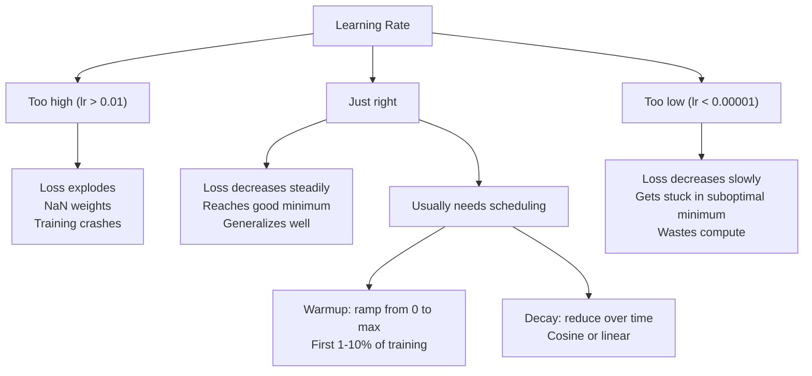
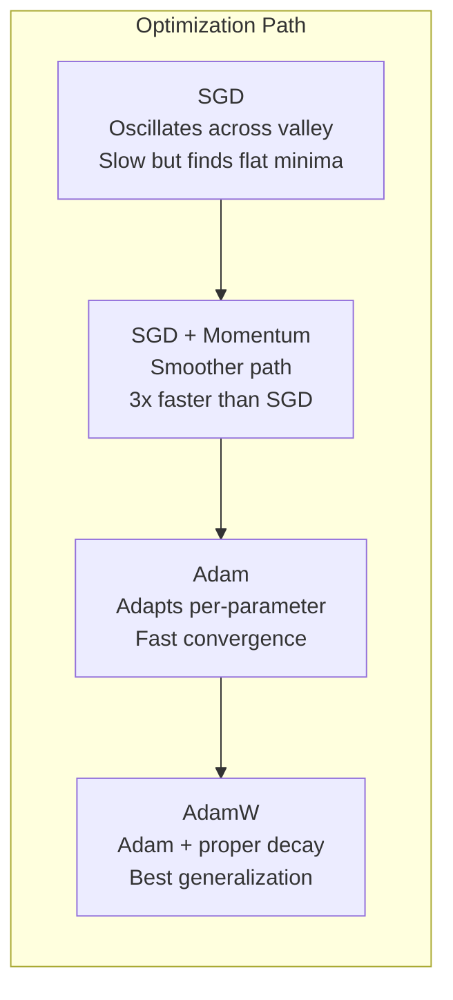
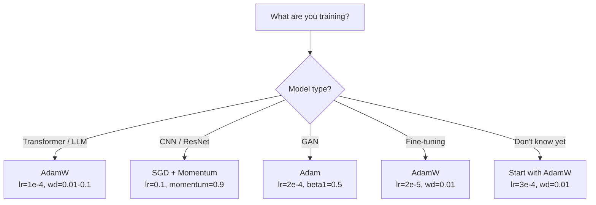

# محسنات
> يخبرك النسب المتدرج بالاتجاه الذي يجب التحرك فيه. لا يقول شيئًا عن مدى المسافة أو السرعة. SGD بوصلة. آدم هو GPS مع بيانات حركة المرور.
**النوع:** بناء
** اللغات: ** بايثون
**المتطلبات السابقة:** الدرس 03.05 (دوال الخسارة)
**الوقت:** ~75 دقيقة
## أهداف التعلم
- تنفيذ SGD، SGD باستخدام أدوات تحسين الزخم وAdam وAdamW من الصفر في Python
- اشرح كيف يعوض تصحيح انحياز آدم تقديرات اللحظة الصفرية في خطوات التدريب المبكرة
- اشرح لماذا ينتج AdamW تعميمًا أفضل من Adam من خلال التنظيم L2 على نفس المهمة
- حدد المُحسِّن المناسب والمعلمات الفائقة الافتراضية للمحولات وشبكات CNN وشبكات GAN والضبط الدقيق
## المشكلة
قمت بحساب التدرجات. أنت تعلم أن الوزن رقم 4,721 يجب أن ينخفض ​​بمقدار 0.003 لتقليل الخسارة. لكن 0.003 في أي وحدات؟ متدرج بماذا؟ وهل يجب عليك نقل نفس المبلغ في الخطوة 1 كما في الخطوة 1000؟
يطبق النسب المتدرج للفانيليا نفس معدل التعلم على كل معلمة في كل خطوة: w = w - lr * gradient. يؤدي هذا إلى خلق ثلاث مشكلات make مؤلمة لتدريب الشبكات العصبية في الممارسة العملية.
أولا، التذبذب. نادرًا ما يتشكل منظر الخسارة على شكل وعاء أملس. إنه أشبه بوادي طويل وضيق. نقاط الانحدار عبر الوادي (اتجاه شديد الانحدار)، وليس على طوله (اتجاه ضحل). يرتد الهبوط المتدرج ذهابًا وإيابًا عبر البعد الضيق بينما يحرز تقدمًا بسيطًا على طول البعد المفيد. لقد رأيت هذا: تنخفض الخسارة بسرعة ثم تصل إلى الاستقرار، ليس بسبب تقارب النموذج ولكن لأنه يتأرجح.
ثانيًا، معدل التعلم الواحد لجميع المعلمات خاطئ. تحتاج بعض الأوزان إلى تحديثات كبيرة (فهي في مرحلة مبكرة وغير ملائمة). ويحتاج البعض الآخر إلى تحديثات صغيرة (وهي قريبة من قيمتها المثالية). معدل التعلم الذي يعمل لصالح الأول يدمر الثاني، والعكس صحيح.
ثالثا، نقاط السرج. في الأبعاد العالية، يشتمل مشهد الخسارة على مناطق مسطحة واسعة حيث يكون التدرج قريبًا من الصفر. تزحف الفانيليا SGD خلال هذه السرعة بسرعة التدرج، وهي صفر فعليًا. يبدو النموذج عالقا. إنها ليست عالقة، إنها في منطقة مسطحة ذات نزول مفيد على الجانب الآخر. لكن SGD ليس لديه آلية للمضي قدمًا.
آدم يحل الثلاثة. ويحافظ على متوسطين تشغيليين لكل معلمة - متوسط ​​التدرج (الزخم، ويعالج التذبذب) ومتوسط ​​التدرج التربيعي (معدل التكيف، ويتعامل مع مقاييس مختلفة). بالإضافة إلى تصحيح الانحياز في الخطوات القليلة الأولى، فإنه يوفر لك مُحسِّنًا واحدًا يعمل على حل 80% من مشكلات المعلمات الفائقة الافتراضية. يبنيه هذا الدرس من الصفر حتى تفهم بالضبط متى ولماذا يفشل في الـ 20٪ الأخرى.
##المفهوم
### الهبوط التدرج العشوائي (SGD)
أبسط محسن. حساب التدرج على دفعة صغيرة وخطوة في الاتجاه المعاكس.
```
w = w - lr * gradient
```

يعني "العشوائي" أنك تستخدم مجموعة فرعية عشوائية (دفعة صغيرة) من البيانات لتقدير التدرج، بدلاً من مجموعة البيانات الكاملة. هذا الضجيج مفيد بالفعل، فهو يساعد على الهروب من الحدود الدنيا المحلية الحادة. لكن الضجيج يسبب التذبذب أيضًا.
معدل التعلم هو المقبض الوحيد. عالية جدًا: الخسارة متباينة. منخفض جدًا: التدريب يستغرق وقتًا طويلاً. تعتمد القيمة المثلى على البنية والبيانات وحجم الدفعة والمرحلة الحالية من التدريب. بالنسبة لـ Vanilla SGD على الشبكات الحديثة، تتراوح القيم النموذجية من 0.01 إلى 0.1. ولكن حتى خلال جولة تدريب واحدة، يتغير معدل التعلم المثالي.
### دَفعَة
إن تشبيه دحرجة الكرة على المنحدرات مبالغ فيه ولكنه دقيق. بدلاً من المرور عبر التدرج وحده، يمكنك الحفاظ على السرعة التي تتراكم التدرجات السابقة.
```
m_t = beta * m_{t-1} + gradient
w = w - lr * m_t
```

يتحكم الإصدار التجريبي (عادةً 0.9) في مقدار السجل الذي يجب الاحتفاظ به. مع بيتا = 0.9، يكون الزخم تقريبًا متوسط ​​التدرجات العشرة الأخيرة (1 / (1 - 0.9) = 10).
لماذا يعمل هذا على إصلاح التذبذب: تتراكم التدرجات التي تشير إلى نفس الاتجاه. التدرجات التي تقلب الاتجاه تلغي. في هذا الوادي الضيق، يشير تقلب المكون "العرضي" إلى كل خطوة ويتبلل. يظل المكون "على طول" ثابتًا ويتم تضخيمه. والنتيجة هي تسارع سلس في الاتجاه المفيد.
الأرقام الحقيقية: SGD وحدها في مشهد خسارة مشروط بشكل سيئ قد تستغرق 10000 خطوة. SGD مع الزخم (بيتا = 0.9) يستغرق عادةً ما بين 3000 إلى 5000 خطوة لحل نفس المشكلة. والتسارع ليس هامشيا.
### RMSProp
أول طريقة لمعدل التعلم التكيفي لكل معلمة والتي نجحت بالفعل. مقترح من هينتون في محاضرة على كورسيرا (لم يتم نشره رسميًا أبدًا).
```
s_t = beta * s_{t-1} + (1 - beta) * gradient^2
w = w - lr * gradient / (sqrt(s_t) + epsilon)
```

يتتبع s_t متوسط ​​تشغيل التدرجات المربعة. يتم تقسيم المعلمات ذات التدرجات الكبيرة باستمرار على عدد كبير (معدل التعلم الفعال الأصغر). يتم تقسيم المعلمات ذات التدرجات الصغيرة على عدد صغير (معدل التعلم الفعال الأكبر).
يؤدي هذا إلى حل مشكلة "معدل التعلم الواحد لجميع المعلمات". من المحتمل أن يكون الوزن الذي حصل بالفعل على تحديثات كبيرة قريبًا من هدفه - مما يؤدي إلى إبطائه. قد يكون الوزن الذي يتلقى تحديثات صغيرة غير كافٍ - قم بتسريعه.
يمنع Epsilon (عادةً 1e-8) القسمة على صفر عندما لا يتم تحديث المعلمة.
### آدم: مومنتوم + RMSProp
يجمع آدم بين الفكرتين. يحافظ على متوسطين متحركين أسيين لكل معلمة:
```
m_t = beta1 * m_{t-1} + (1 - beta1) * gradient        (first moment: mean)
v_t = beta2 * v_{t-1} + (1 - beta2) * gradient^2       (second moment: variance)
```

**تصحيح الانحياز** هو التفاصيل الأساسية التي تتخطاها معظم التفسيرات. في الخطوة 1، m_1 = (1 - beta1) * التدرج. مع beta1 = 0.9، يكون هذا 0.1 * تدرج - وهو أصغر بعشر مرات. المتوسط ​​المتحرك لم يسخن بعد. تصحيح التحيز يعوض:
```
m_hat = m_t / (1 - beta1^t)
v_hat = v_t / (1 - beta2^t)
```

في الخطوة 1 مع beta1 = 0.9: m_hat = m_1 / (1 - 0.9) = m_1 / 0.1 = التدرج الفعلي. في الخطوة 100: (1 - 0.9^100) يساوي 1.0 تقريبًا، لذا يختفي التصحيح. تصحيح التحيز مهم للخطوات العشر الأولى تقريبًا ولا يكون له أي صلة بعد ~50.
التحديث:
```
w = w - lr * m_hat / (sqrt(v_hat) + epsilon)
```

إعدادات آدم الافتراضية: lr = 0.001، beta1 = 0.9، beta2 = 0.999، epsilon = 1e-8. تعمل هذه الإعدادات الافتراضية على حل 80% من المشكلات. عندما لا يفعلون ذلك، قم بتغيير lr أولاً. ثم بيتا 2 لا تقم أبدًا بتغيير beta1 أو epsilon.
### AdamW: فقدان الوزن تم بشكل صحيح
يضيف التنظيم L2 lambda * w^2 إلى الخسارة. في الفانيليا SGD، هذا يعادل تسوس الوزن (طرح lambda * w من الوزن في كل خطوة). وفي آدم ينقطع هذا التكافؤ.
رؤية Loshchilov & Hutter: عندما تضيف L2 إلى الخسارة ثم يقوم Adam بمعالجة التدرج، فإن معدل التعلم التكيفي يقيس مصطلح التنظيم أيضًا. تحصل المعلمات ذات التباين الكبير في التدرج على تنظيم أقل. المعلمات ذات التباين الصغير تحصل على المزيد. هذا ليس ما تريده - أنت تريد تنظيمًا موحدًا بغض النظر عن إحصائيات التدرج.
يقوم AdamW بإصلاح هذه المشكلة عن طريق تطبيق تسوس الوزن مباشرة على الأوزان، بعد تحديث Adam:
```
w = w - lr * m_hat / (sqrt(v_hat) + epsilon) - lr * lambda * w
```

لا يتم قياس مصطلح تسوس الوزن (lr * lambda * w) بواسطة عامل آدم التكيفي. تحصل كل معلمة على نفس الانكماش النسبي.
هذا يبدو وكأنه تفاصيل بسيطة. ليست كذلك. يتقارب AdamW مع حلول أفضل من التنظيم Adam + L2 في كل مهمة تقريبًا. إنه المُحسِّن الافتراضي في PyTorch لتدريب المحولات ونماذج الانتشار ومعظم البنى الحديثة. BERT، GPT، LLaMA، الانتشار المستقر -- جميعهم تم تدريبهم مع AdamW.
### معدل التعلم: المعلمة الفائقة الأكثر أهمية


إذا قمت بضبط معلمة تشعبية واحدة، فقم بضبط معدل التعلم. يعد التغيير بمقدار 10 أضعاف في معدل التعلم أكثر أهمية من أي قرار معماري ستتخذه make. الإعدادات الافتراضية الشائعة:
- SGD: لير = 0.01 إلى 0.1
- آدم/آدمW: lr = 1e-4 إلى 3e-4
- ضبط النماذج المُدربة مسبقًا: lr = 1e-5 إلى 5e-5
- إحماء معدل التعلم: منحدر خطي خلال أول 1-10% من الخطوات
### مقارنة المحسن


### عندما يفوز كل محسن


## بنائها
### الخطوة 1: الفانيليا SGD
```python
class SGD:
    def __init__(self, lr=0.01):
        self.lr = lr

    def step(self, params, grads):
        for i in range(len(params)):
            params[i] -= self.lr * grads[i]
```

### الخطوة الثانية: SGD مع الزخم
```python
class SGDMomentum:
    def __init__(self, lr=0.01, beta=0.9):
        self.lr = lr
        self.beta = beta
        self.velocities = None

    def step(self, params, grads):
        if self.velocities is None:
            self.velocities = [0.0] * len(params)
        for i in range(len(params)):
            self.velocities[i] = self.beta * self.velocities[i] + grads[i]
            params[i] -= self.lr * self.velocities[i]
```

### الخطوة 3: آدم
```python
import math

class Adam:
    def __init__(self, lr=0.001, beta1=0.9, beta2=0.999, epsilon=1e-8):
        self.lr = lr
        self.beta1 = beta1
        self.beta2 = beta2
        self.epsilon = epsilon
        self.m = None
        self.v = None
        self.t = 0

    def step(self, params, grads):
        if self.m is None:
            self.m = [0.0] * len(params)
            self.v = [0.0] * len(params)

        self.t += 1

        for i in range(len(params)):
            self.m[i] = self.beta1 * self.m[i] + (1 - self.beta1) * grads[i]
            self.v[i] = self.beta2 * self.v[i] + (1 - self.beta2) * grads[i] ** 2

            m_hat = self.m[i] / (1 - self.beta1 ** self.t)
            v_hat = self.v[i] / (1 - self.beta2 ** self.t)

            params[i] -= self.lr * m_hat / (math.sqrt(v_hat) + self.epsilon)
```

### الخطوة 4: آدم دبليو
```python
class AdamW:
    def __init__(self, lr=0.001, beta1=0.9, beta2=0.999, epsilon=1e-8, weight_decay=0.01):
        self.lr = lr
        self.beta1 = beta1
        self.beta2 = beta2
        self.epsilon = epsilon
        self.weight_decay = weight_decay
        self.m = None
        self.v = None
        self.t = 0

    def step(self, params, grads):
        if self.m is None:
            self.m = [0.0] * len(params)
            self.v = [0.0] * len(params)

        self.t += 1

        for i in range(len(params)):
            self.m[i] = self.beta1 * self.m[i] + (1 - self.beta1) * grads[i]
            self.v[i] = self.beta2 * self.v[i] + (1 - self.beta2) * grads[i] ** 2

            m_hat = self.m[i] / (1 - self.beta1 ** self.t)
            v_hat = self.v[i] / (1 - self.beta2 ** self.t)

            params[i] -= self.lr * m_hat / (math.sqrt(v_hat) + self.epsilon)
            params[i] -= self.lr * self.weight_decay * params[i]
```

### الخطوة 5: مقارنة التدريب
قم بتدريب نفس الشبكة ذات الطبقتين على مجموعة بيانات الدائرة من الدرس 05 مع جميع أدوات التحسين الأربعة. قارن التقارب.
```python
import random

def sigmoid(x):
    x = max(-500, min(500, x))
    return 1.0 / (1.0 + math.exp(-x))

def make_circle_data(n=200, seed=42):
    random.seed(seed)
    data = []
    for _ in range(n):
        x = random.uniform(-2, 2)
        y = random.uniform(-2, 2)
        label = 1.0 if x * x + y * y < 1.5 else 0.0
        data.append(([x, y], label))
    return data


class OptimizerTestNetwork:
    def __init__(self, optimizer, hidden_size=8):
        random.seed(0)
        self.hidden_size = hidden_size
        self.optimizer = optimizer

        self.w1 = [[random.gauss(0, 0.5) for _ in range(2)] for _ in range(hidden_size)]
        self.b1 = [0.0] * hidden_size
        self.w2 = [random.gauss(0, 0.5) for _ in range(hidden_size)]
        self.b2 = 0.0

    def get_params(self):
        params = []
        for row in self.w1:
            params.extend(row)
        params.extend(self.b1)
        params.extend(self.w2)
        params.append(self.b2)
        return params

    def set_params(self, params):
        idx = 0
        for i in range(self.hidden_size):
            for j in range(2):
                self.w1[i][j] = params[idx]
                idx += 1
        for i in range(self.hidden_size):
            self.b1[i] = params[idx]
            idx += 1
        for i in range(self.hidden_size):
            self.w2[i] = params[idx]
            idx += 1
        self.b2 = params[idx]

    def forward(self, x):
        self.x = x
        self.z1 = []
        self.h = []
        for i in range(self.hidden_size):
            z = self.w1[i][0] * x[0] + self.w1[i][1] * x[1] + self.b1[i]
            self.z1.append(z)
            self.h.append(max(0.0, z))

        self.z2 = sum(self.w2[i] * self.h[i] for i in range(self.hidden_size)) + self.b2
        self.out = sigmoid(self.z2)
        return self.out

    def compute_grads(self, target):
        eps = 1e-15
        p = max(eps, min(1 - eps, self.out))
        d_loss = -(target / p) + (1 - target) / (1 - p)
        d_sigmoid = self.out * (1 - self.out)
        d_out = d_loss * d_sigmoid

        grads = [0.0] * (self.hidden_size * 2 + self.hidden_size + self.hidden_size + 1)
        idx = 0
        for i in range(self.hidden_size):
            d_relu = 1.0 if self.z1[i] > 0 else 0.0
            d_h = d_out * self.w2[i] * d_relu
            grads[idx] = d_h * self.x[0]
            grads[idx + 1] = d_h * self.x[1]
            idx += 2

        for i in range(self.hidden_size):
            d_relu = 1.0 if self.z1[i] > 0 else 0.0
            grads[idx] = d_out * self.w2[i] * d_relu
            idx += 1

        for i in range(self.hidden_size):
            grads[idx] = d_out * self.h[i]
            idx += 1

        grads[idx] = d_out
        return grads

    def train(self, data, epochs=300):
        losses = []
        for epoch in range(epochs):
            total_loss = 0.0
            correct = 0
            for x, y in data:
                pred = self.forward(x)
                grads = self.compute_grads(y)
                params = self.get_params()
                self.optimizer.step(params, grads)
                self.set_params(params)

                eps = 1e-15
                p = max(eps, min(1 - eps, pred))
                total_loss += -(y * math.log(p) + (1 - y) * math.log(1 - p))
                if (pred >= 0.5) == (y >= 0.5):
                    correct += 1
            avg_loss = total_loss / len(data)
            accuracy = correct / len(data) * 100
            losses.append((avg_loss, accuracy))
            if epoch % 75 == 0 or epoch == epochs - 1:
                print(f"    Epoch {epoch:3d}: loss={avg_loss:.4f}, accuracy={accuracy:.1f}%")
        return losses
```

## استخدمه
PyTorch يتعامل المحسنون مع مجموعات المعلمات، وقص التدرج، وجدولة معدل التعلم:
```python
import torch
import torch.optim as optim

model = torch.nn.Sequential(
    torch.nn.Linear(784, 256),
    torch.nn.ReLU(),
    torch.nn.Linear(256, 10),
)

optimizer = optim.AdamW(model.parameters(), lr=3e-4, weight_decay=0.01)

scheduler = optim.lr_scheduler.CosineAnnealingLR(optimizer, T_max=100)

for epoch in range(100):
    optimizer.zero_grad()
    output = model(torch.randn(32, 784))
    loss = torch.nn.functional.cross_entropy(output, torch.randint(0, 10, (32,)))
    loss.backward()
    torch.nn.utils.clip_grad_norm_(model.parameters(), max_norm=1.0)
    optimizer.step()
    scheduler.step()
```

النمط دائمًا هو: صفر_درجة، للأمام، الخسارة، للخلف، (مقطع)، خطوة، (جدول). احفظ هذا الترتيب. يعد الخطأ في الأمر (على سبيل المثال، استدعاء Scholar.step() قبل optimer.step()) مصدرًا شائعًا للأخطاء الدقيقة.
بالنسبة لشبكات CNN، لا يزال العديد من الممارسين يفضلون SGD + الزخم (lr=0.1، الزخم=0.9،weight_decay=1e-4) مع جدول خطوة أو جيب التمام. يجد SGD حدودًا دنيا مسطحة، والتي غالبًا ما يتم تعميمها بشكل أفضل. بالنسبة للمحولات وLLMs، فإن AdamW مع Warmup + Cosine Decay هو الإعداد الافتراضي العالمي. لا تحارب الإجماع دون سبب مدروس.
## اشحنها
ينتج هذا الدرس:
- `outputs/prompt-optimizer-selector.md` -- قرار موجه لاختيار المحسن المناسب ومعدل التعلم لأي بنية
## تمارين
1. قم بتطبيق زخم نيستيروف، حيث تقوم بحساب التدرج في موضع "Lookahead" (w - lr * beta * v) بدلاً من الموضع الحالي. قارن التقارب بالزخم القياسي في مجموعة بيانات الدائرة.
2. قم بتنفيذ جدول إحماء لمعدل التعلم: منحدر خطي من 0 إلى max_lr خلال أول 10% من خطوات التدريب، ثم اضمحلال جيب التمام إلى 0. تدرب مع آدم + إحماء مقابل آدم بدون إحماء. قم بقياس عدد العصور اللازمة للوصول إلى دقة 90% في مجموعة بيانات الدائرة.
3. تتبع معدل التعلم الفعال لكل معلمة أثناء تدريب آدم. المعدل الفعال هو lr * m_hat / (sqrt(v_hat) + eps). رسم توزيع المعدلات الفعالة بعد 10 و50 و200 خطوة. هل يتم تحديث جميع المعلمات بنفس السرعة؟
4. تنفيذ القطع المتدرج (مقطع حسب القاعدة العالمية). اضبط الحد الأقصى للتدرج على 1.0. التدريب بالقص وبدونه باستخدام معدل تعلم مرتفع (lr=0.01 لآدم). قم بإحصاء عدد عمليات التشغيل المتباعدة (تذهب الخسارة إلى NaN) مع أو بدون قص أكثر من 10 بذور عشوائية.
5. قارن بين Adam و AdamW على شبكة ذات أوزان كبيرة. قم بتهيئة جميع الأوزان إلى قيم عشوائية في [-5، 5] (أكبر بكثير من المعتاد). تدرب لمدة 200 عصر بوزن_اضمحلال=0.1. ارسم معيار L2 للأوزان على التدريب لكلا المحسنين. يجب أن يظهر AdamW انكماشًا أسرع في الوزن.
## المصطلحات الرئيسية
| مصطلح | ماذا يقول الناس | ماذا يعني في الواقع |
|------|----------------|----------------------|
| معدل التعلم | "حجم الخطوة" | المضاعف العددي في تحديث التدرج؛ المعلمة الفائقة الأكثر تأثيرًا في التدريب |
| SGD | "نسب التدرج الأساسي" | نزول التدرج العشوائي: تحديث الأوزان عن طريق طرح التدرج lr *، المحسوب على دفعة صغيرة |
| الزخم | "تشبيه الكرة المتدحرجة" | المتوسط ​​المتحرك الأسي للتدرجات السابقة؛ يخفف التذبذب ويسرع الاتجاهات المتسقة |
| آر إم إس بروب | "معدل التعلم التكيفي" | يقسم تدرج كل معلمة على تشغيل RMS لتدرجاتها الأخيرة؛ يعادل معدلات التعلم |
| آدم | "المحسن الافتراضي" | يجمع بين الزخم (اللحظة الأولى) وRMSProp (اللحظة الثانية) مع تصحيح التحيز للخطوات الأولية |
| آدمو | "" لقد صدق آدم"" | آدم يعاني من تسوس الوزن المنفصل؛ يطبق التنظيم مباشرة على الأوزان وليس من خلال التدرج |
| تصحيح التحيز | "الإحماء لمتوسطات الجري" | القسمة على (1 - بيتا^t) للتعويض عن التهيئة الصفرية لتقديرات عزم آدم |
| تسوس الوزن | "تقليص الأثقال" | طرح جزء من قيمة الوزن في كل خطوة؛ منظم يعاقب الأوزان الكبيرة |
| جدول معدل التعلم | "تغيير lr بمرور الوقت" | وظيفة تضبط معدل التعلم أثناء التدريب؛ الإحماء + تسوس جيب التمام هو الوضع الافتراضي الحديث |
| قطع التدرج | "تغطية قاعدة التدرج" | تقليص متجه التدرج عندما يتجاوز معياره العتبة؛ يمنع انفجار التحديثات المتدرجة |
## مزيد من القراءة
- كينغما وبا، "آدم: طريقة للتحسين العشوائي" (2014) - ورقة آدم الأصلية مع تحليل التقارب واشتقاق تصحيح التحيز
- لوشيلوف وهوتر، "تنظيم تسوس الوزن المنفصل" (2017) - أثبت أن تنظيم L2 وتسوس الوزن ليسا متكافئين في آدم، واقترح آدمو
- سميث، "معدلات التعلم الدورية لتدريب الشبكات العصبية" (2017) - قدم اختبار النطاق LR والجداول الدورية التي تلغي الحاجة إلى ضبط معدل تعلم ثابت
- رودر، "نظرة عامة على خوارزميات تحسين نزول التدرج" (2016) - أفضل دراسة منفردة لجميع متغيرات المحسن، مع مقارنات وبديهيات واضحة