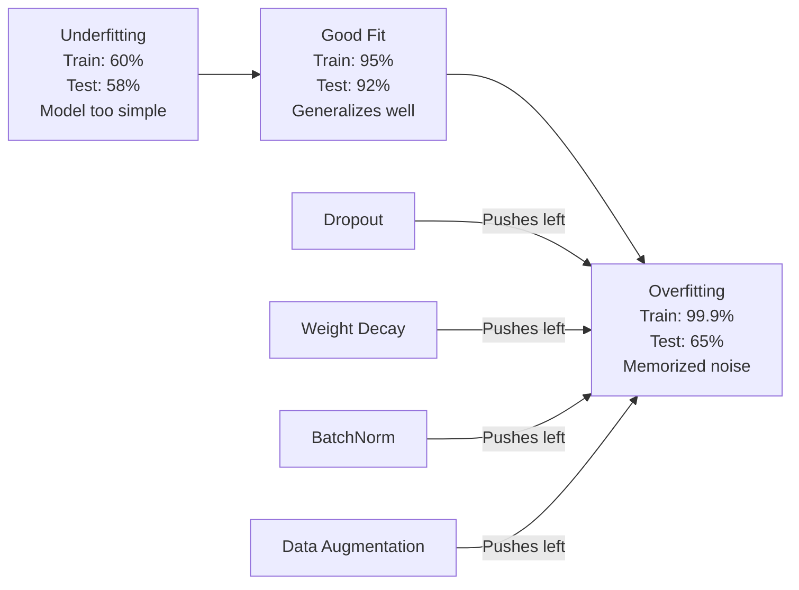
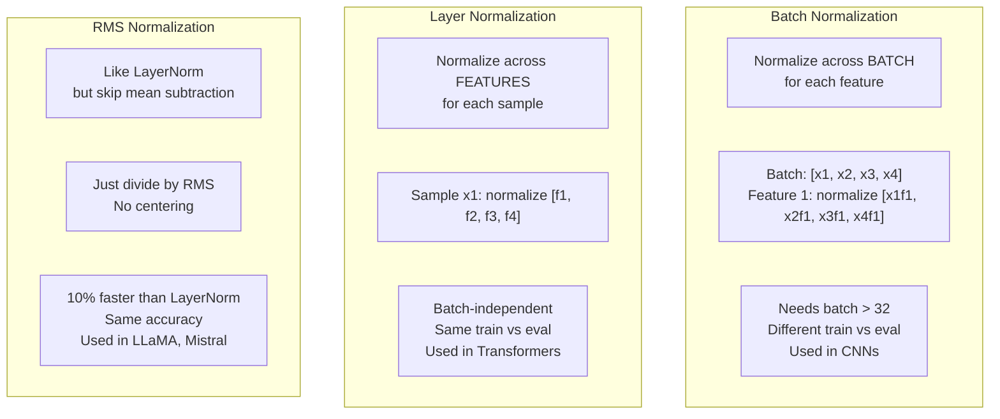
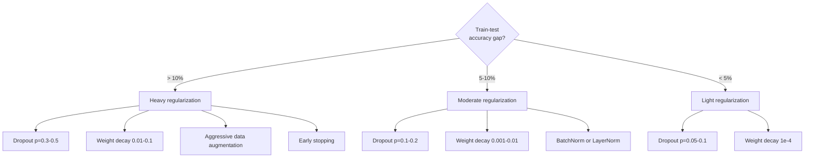

#التسوية
> يحصل نموذجك على 99% من بيانات التدريب و60% من بيانات الاختبار. لقد حفظت بدلا من التعلم. التنظيم هو الضريبة التي تفرضها على التعقيد لفرض التعميم.
**النوع:** بناء
** اللغات: ** بايثون
**المتطلبات الأساسية:** الدرس 03.06 (المحسنون)
**الوقت:** ~75 دقيقة
## أهداف التعلم
- تنفيذ التسرب باستخدام القياس المقلوب، وL2 تسوس الوزن، وتطبيع الدُفعات، وتطبيع الطبقة، وRMSNorm من البداية
- قياس الفجوة في دقة اختبار التدريب وتشخيص التجاوز باستخدام تجارب التنظيم
- اشرح لماذا تستخدم المحولات LayerNorm بدلاً من BatchNorm ولماذا تفضل LLMs الحديثة RMSNorm
- تطبيق المجموعة الصحيحة من تقنيات التنظيم بناءً على خطورة التجهيز الزائد
## المشكلة
يمكن للشبكة العصبية ذات المعلمات الكافية حفظ أي مجموعة بيانات. هذه ليست افتراضية - تشانغ وآخرون. (2017) أثبت ذلك من خلال تدريب الشبكات القياسية على ImageNet باستخدام تسميات عشوائية. وصلت الشبكات إلى خسارة تدريب قريبة من الصفر في مهام تسمية عشوائية تمامًا. لقد حفظوا مليون زوج عشوائي من المدخلات والمخرجات دون أي نمط للتعلم. كانت خسارة التدريب مثالية. وكانت دقة الاختبار صفر.
هذه هي مشكلة التجهيز الزائد، وتزداد سوءًا مع زيادة حجم النماذج. GPT-3 يحتوي على 175 مليار معلمة. تحتوي مجموعة التدريب على حوالي 500 مليار رمز. مع هذه المعلمات العديدة، يتمتع النموذج بقدرة كافية لحفظ أجزاء كبيرة من بيانات التدريب حرفيًا. بدون التنظيم، سيتم تكرارgitate أمثلة التدريب بدلاً من تعلم أنماط قابلة للتعميم.
الفجوة بين أداء التدريب وأداء الاختبار هي فجوة التجهيز. كل أسلوب في هذا الدرس يهاجم تلك الفجوة من زاوية مختلفة. يجبر التسرب الشبكة على عدم الاعتماد على أي خلية عصبية واحدة. إن تسوس الوزن يمنع أي وزن من النمو بشكل كبير جدًا. تعمل تسوية الدُفعات على تسهيل مشهد الخسارة بحيث يجد المُحسِّن حدًا أدنى أكثر اتساعًا وقابلية للتعميم. تقوم تسوية الطبقة بنفس الشيء ولكنها تعمل عندما تفشل تسوية الدُفعات (دفعات صغيرة، تسلسلات متغيرة الطول). يقوم RMSNorm بذلك بشكل أسرع بنسبة 10% عن طريق إسقاط الحساب المتوسط. كل تقنية بسيطة. معًا، يشكلون الفرق بين النموذج الذي يحفظ والنموذج الذي يعمم.
##المفهوم
### الطيف الزائد
يقع كل نموذج في مكان ما على نطاق واسع بدءًا من التجهيز غير المناسب (وهو بسيط للغاية بحيث لا يمكن التقاط النمط) إلى التجهيز الزائد (معقد للغاية لدرجة أنه يلتقط الضوضاء). النقطة المثالية تقع في المنتصف، ويدفع التنظيم النماذج نحوها من جانب التناسب الزائد.


### أوقع
أبسط تقنية تنظيم مع التفسير الأكثر أناقة. أثناء التدريب، قم بتعيين مخرجات كل خلية عصبية بشكل عشوائي إلى الصفر مع احتمال p.
```
output = activation(z) * mask    where mask[i] ~ Bernoulli(1 - p)
```

مع p = 0.5، يتم صفر نصف الخلايا العصبية في كل تمريرة للأمام. يجب أن تتعلم الشبكة التمثيلات الزائدة عن الحاجة لأنها لا تستطيع التنبؤ بالخلايا العصبية التي ستكون متاحة. وهذا يمنع التكيف المشترك - حيث تتعلم الخلايا العصبية الاعتماد على وجود خلايا عصبية أخرى محددة.
تفسير المجموعة: شبكة تحتوي على N من الخلايا العصبية والتسرب تخلق 2 ^ N من الشبكات الفرعية المحتملة (كل مجموعة منها تعمل أو متوقفة عن العمل). يؤدي التدريب مع التسرب إلى تدريب جميع الشبكات الفرعية 2^N تقريبًا في وقت واحد، كل منها على دفعات صغيرة مختلفة. في وقت الاختبار، يمكنك استخدام جميع الخلايا العصبية (بدون تسرب) وقياس المخرجات بمقدار (1 - p) لتتناسب مع القيمة المتوقعة أثناء التدريب. وهذا يعادل حساب متوسط ​​تنبؤات الشبكات الفرعية 2^N - وهي مجموعة ضخمة من نموذج واحد.
من الناحية العملية، يتم تطبيق القياس أثناء التدريب بدلاً من الاختبار (التسرب المقلوب):
```
During training:  output = activation(z) * mask / (1 - p)
During testing:   output = activation(z)   (no change needed)
```

يعد هذا أكثر نظافة لأن رمز الاختبار لا يحتاج إلى معرفة التسرب على الإطلاق.
المعدلات الافتراضية: p = 0.1 للمحولات، p = 0.5 لـ MLPs، p = 0.2-0.3 لـ CNNs. ارتفاع معدل التسرب = تنظيم أقوى = المزيد من المخاطر غير المناسبة.
### تناقص الوزن (L2 التسوية)
أضف الحجم التربيعي لجميع الأوزان إلى الخسارة:
```
total_loss = task_loss + (lambda / 2) * sum(w_i^2)
```

التدرج في مصطلح التنظيم هو لامدا * ث. وهذا يعني أنه في كل خطوة، يتم تقليص كل وزن نحو الصفر بجزء يتناسب مع حجمه. يتم معاقبة الأوزان الكبيرة بشكل أكبر. يتم دفع النموذج نحو الحلول التي لا يهيمن عليها أي وزن.
لماذا يساعد هذا في التعميم: تميل نماذج التناسب الزائد إلى الحصول على أوزان كبيرة تعمل على تضخيم الضوضاء في بيانات التدريب. يؤدي تناقص الوزن إلى إبقاء الأوزان صغيرة، مما يحد من القدرة الفعالة للنموذج ويجبره على الاعتماد على ميزات قوية وقابلة للتعميم بدلاً من المراوغات المحفوظة.
تتحكم معلمة لامدا الفائقة في القوة. القيم النموذجية:
- 0.01 لـ AdamW على المحولات
- 1e-4 لـ SGD على شبكات CNN
- 0.1 للنماذج شديدة الاحتواء
كما تمت مناقشته في الدرس 06: تناقص الوزن وانتظام L2 متكافئان في SGD لكن ليس في آدم. استخدم دائمًا AdamW (تسوس الوزن المنفصل) عند التدريب مع آدم.
### تطبيع الدفعة
قم بتطبيع إخراج كل طبقة عبر الدفعة الصغيرة قبل تمريرها إلى الطبقة التالية.
للحصول على مجموعة صغيرة من عمليات التنشيط في طبقة ما:
```
mu = (1/B) * sum(x_i)           (batch mean)
sigma^2 = (1/B) * sum((x_i - mu)^2)   (batch variance)
x_hat = (x_i - mu) / sqrt(sigma^2 + eps)   (normalize)
y = gamma * x_hat + beta        (scale and shift)
```

تعد جاما وبيتا معلمات قابلة للتعلم تتيح للشبكة التراجع عن عملية التطبيع إذا كان ذلك هو الأمثل. بدونها، ستجبر مخرجات كل طبقة على أن يكون تباين الوحدات متوسطًا صفرًا، وهو ما قد لا يكون ما تريده الشبكة.
**التدريب مقابل تقسيم الاستدلال:** أثناء التدريب، يأتي mu وsigma من الدفعة الصغيرة الحالية. أثناء الاستدلال، يمكنك استخدام المتوسطات الجارية المتراكمة أثناء التدريب (المتوسط ​​المتحرك الأسي مع الزخم = 0.1، أي 90٪ قديم + 10٪ جديد).
لماذا لا يزال عمل BatchNorm موضع نقاش. زعمت الورقة الأصلية أنها تقلل من "التحول المتغير الداخلي" (يتغير توزيع مدخلات الطبقة مع تحديث الطبقات السابقة). سانتوركار وآخرون. (2018) بين أن هذا التفسير خاطئ. السبب الفعلي: BatchNorm make هو مشهد الخسارة الأكثر سلاسة. التدرجات أكثر تنبؤية، وثوابت ليبشيتز أصغر، ويمكن للمحسن اتخاذ خطوات أكبر بأمان. ولهذا السبب يتيح لك BatchNorm استخدام معدلات تعلم أعلى والتقارب بشكل أسرع.
لدى BatchNorm قيود أساسية: فهي تعتمد على إحصائيات الدُفعات. مع حجم الدفعة 1، المتوسط ​​والتباين لا معنى لهما. مع الدفعات الصغيرة (<32)، تكون الإحصائيات مزعجة وتضر بالأداء. وهذا مهم بالنسبة لمهام مثل الكشف عن الكائنات (حيث تحدد الذاكرة حجم الدفعة) ونمذجة اللغة (حيث تختلف أطوال التسلسل).
### تطبيع الطبقة
التطبيع عبر الميزات بدلاً من الدفعة. لعينة واحدة:
```
mu = (1/D) * sum(x_j)           (feature mean)
sigma^2 = (1/D) * sum((x_j - mu)^2)   (feature variance)
x_hat = (x_j - mu) / sqrt(sigma^2 + eps)
y = gamma * x_hat + beta
```

D هو البعد الميزة. يتم تطبيع كل عينة بشكل مستقل - لا يعتمد على حجم الدفعة. ولهذا السبب تستخدم المحولات LayerNorm بدلاً من BatchNorm. التسلسلات لها أطوال متغيرة، وأحجام الدفعات غالبا ما تكون صغيرة (أو 1 أثناء الإنشاء)، والحساب متطابق بين التدريب والاستدلال.
يتم تطبيق LayerNorm في المحولات بعد كل كتلة اهتمام ذاتي وكل كتلة تغذية للأمام (Post-LN)، أو قبلها (Pre-LN، وهو أكثر استقرارًا للتدريب).
### آر إم إس نورم
LayerNorm بدون الطرح المتوسط. مقترح من Zhang & Sennrich (2019).
```
rms = sqrt((1/D) * sum(x_j^2))
y = gamma * x / rms
```

هذا كل شيء. لا يوجد حساب متوسط، ولا توجد معلمة بيتا. الملاحظة: إعادة التوسيط (متوسط ​​الطرح) في LayerNorm تساهم بشكل ضئيل جدًا في أداء النموذج، ولكنها تكلف الحساب. تؤدي إزالته إلى الحصول على نفس الدقة مع تقليل الحمل بنسبة 10% تقريبًا.
LLaMA، وLLaMA 2، وLLaMA 3، وMistral، ومعظم برامج LLM الحديثة تستخدم RMSNorm بدلاً من LayerNorm. على نطاق مليارات المعلمات وتريليونات الرموز، يعد توفير 10٪ أمرًا كبيرًا.
### مقارنة التطبيع


### زيادة البيانات كتنظيم
ليس تعديل النموذج ولكن تعديل البيانات. تحويل مدخلات التدريب مع الحفاظ على التسميات:
- الصور: اقتصاص عشوائي، قلب، دوران، اهتزاز اللون، انقطاع
- النص: استبدال المرادفات، الترجمة الخلفية، الحذف العشوائي
- الصوت: تمديد الوقت، تغيير درجة الصوت، إضافة الضوضاء
التأثير مطابق للتنظيم: فهو يزيد من الحجم الفعال لمجموعة التدريب، مما يجعل من الصعب على النموذج حفظ أمثلة محددة. النموذج الذي يرى كل صورة في شكلها الأصلي مرة واحدة فقط يمكنه حفظها. النموذج الذي يرى 50 نسخة معززة من كل صورة يضطر إلى تعلم البنية الثابتة.
### التوقف المبكر
أبسط منظم: توقف عن التدريب عندما يبدأ فقدان التحقق من الصحة في الزيادة. لم يتم تجاوز النموذج بعد في تلك المرحلة. من الناحية العملية، يمكنك تتبع فقدان التحقق من الصحة في كل فترة، وحفظ أفضل نموذج، ومواصلة التدريب على نافذة "الصبر" (عادةً من 5 إلى 20 فترة). إذا لم يتحسن فقدان التحقق من الصحة خلال فترة الانتظار، فعليك التوقف وتحميل أفضل نموذج محفوظ.
### متى يتم تطبيق ماذا؟


## بنائها
### الخطوة 1: التسرب (وضع التدريب والتقييم)
```python
import random
import math


class Dropout:
    def __init__(self, p=0.5):
        self.p = p
        self.training = True
        self.mask = None

    def forward(self, x):
        if not self.training:
            return list(x)
        self.mask = []
        output = []
        for val in x:
            if random.random() < self.p:
                self.mask.append(0)
                output.append(0.0)
            else:
                self.mask.append(1)
                output.append(val / (1 - self.p))
        return output

    def backward(self, grad_output):
        grads = []
        for g, m in zip(grad_output, self.mask):
            if m == 0:
                grads.append(0.0)
            else:
                grads.append(g / (1 - self.p))
        return grads
```

### الخطوة 2: L2 تناقص الوزن
```python
def l2_regularization(weights, lambda_reg):
    penalty = 0.0
    for w in weights:
        penalty += w * w
    return lambda_reg * 0.5 * penalty

def l2_gradient(weights, lambda_reg):
    return [lambda_reg * w for w in weights]
```

### الخطوة 3: تسوية الدفعة
```python
class BatchNorm:
    def __init__(self, num_features, momentum=0.1, eps=1e-5):
        self.gamma = [1.0] * num_features
        self.beta = [0.0] * num_features
        self.eps = eps
        self.momentum = momentum
        self.running_mean = [0.0] * num_features
        self.running_var = [1.0] * num_features
        self.training = True
        self.num_features = num_features

    def forward(self, batch):
        batch_size = len(batch)
        if self.training:
            mean = [0.0] * self.num_features
            for sample in batch:
                for j in range(self.num_features):
                    mean[j] += sample[j]
            mean = [m / batch_size for m in mean]

            var = [0.0] * self.num_features
            for sample in batch:
                for j in range(self.num_features):
                    var[j] += (sample[j] - mean[j]) ** 2
            var = [v / batch_size for v in var]

            for j in range(self.num_features):
                self.running_mean[j] = (1 - self.momentum) * self.running_mean[j] + self.momentum * mean[j]
                self.running_var[j] = (1 - self.momentum) * self.running_var[j] + self.momentum * var[j]
        else:
            mean = list(self.running_mean)
            var = list(self.running_var)

        self.x_hat = []
        output = []
        for sample in batch:
            normalized = []
            out_sample = []
            for j in range(self.num_features):
                x_h = (sample[j] - mean[j]) / math.sqrt(var[j] + self.eps)
                normalized.append(x_h)
                out_sample.append(self.gamma[j] * x_h + self.beta[j])
            self.x_hat.append(normalized)
            output.append(out_sample)
        return output
```

### الخطوة 4: تسوية الطبقة
```python
class LayerNorm:
    def __init__(self, num_features, eps=1e-5):
        self.gamma = [1.0] * num_features
        self.beta = [0.0] * num_features
        self.eps = eps
        self.num_features = num_features

    def forward(self, x):
        mean = sum(x) / len(x)
        var = sum((xi - mean) ** 2 for xi in x) / len(x)

        self.x_hat = []
        output = []
        for j in range(self.num_features):
            x_h = (x[j] - mean) / math.sqrt(var + self.eps)
            self.x_hat.append(x_h)
            output.append(self.gamma[j] * x_h + self.beta[j])
        return output
```

### الخطوة 5: RMSNorm
```python
class RMSNorm:
    def __init__(self, num_features, eps=1e-6):
        self.gamma = [1.0] * num_features
        self.eps = eps
        self.num_features = num_features

    def forward(self, x):
        rms = math.sqrt(sum(xi * xi for xi in x) / len(x) + self.eps)
        output = []
        for j in range(self.num_features):
            output.append(self.gamma[j] * x[j] / rms)
        return output
```

### الخطوة 6: التدريب مع وبدون تنظيم
```python
def sigmoid(x):
    x = max(-500, min(500, x))
    return 1.0 / (1.0 + math.exp(-x))


def make_circle_data(n=200, seed=42):
    random.seed(seed)
    data = []
    for _ in range(n):
        x = random.uniform(-2, 2)
        y = random.uniform(-2, 2)
        label = 1.0 if x * x + y * y < 1.5 else 0.0
        data.append(([x, y], label))
    return data


class RegularizedNetwork:
    def __init__(self, hidden_size=16, lr=0.05, dropout_p=0.0, weight_decay=0.0):
        random.seed(0)
        self.hidden_size = hidden_size
        self.lr = lr
        self.dropout_p = dropout_p
        self.weight_decay = weight_decay
        self.dropout = Dropout(p=dropout_p) if dropout_p > 0 else None

        self.w1 = [[random.gauss(0, 0.5) for _ in range(2)] for _ in range(hidden_size)]
        self.b1 = [0.0] * hidden_size
        self.w2 = [random.gauss(0, 0.5) for _ in range(hidden_size)]
        self.b2 = 0.0

    def forward(self, x, training=True):
        self.x = x
        self.z1 = []
        self.h = []
        for i in range(self.hidden_size):
            z = self.w1[i][0] * x[0] + self.w1[i][1] * x[1] + self.b1[i]
            self.z1.append(z)
            self.h.append(max(0.0, z))

        if self.dropout and training:
            self.dropout.training = True
            self.h = self.dropout.forward(self.h)
        elif self.dropout:
            self.dropout.training = False
            self.h = self.dropout.forward(self.h)

        self.z2 = sum(self.w2[i] * self.h[i] for i in range(self.hidden_size)) + self.b2
        self.out = sigmoid(self.z2)
        return self.out

    def backward(self, target):
        eps = 1e-15
        p = max(eps, min(1 - eps, self.out))
        d_loss = -(target / p) + (1 - target) / (1 - p)
        d_sigmoid = self.out * (1 - self.out)
        d_out = d_loss * d_sigmoid

        for i in range(self.hidden_size):
            d_relu = 1.0 if self.z1[i] > 0 else 0.0
            d_h = d_out * self.w2[i] * d_relu
            self.w2[i] -= self.lr * (d_out * self.h[i] + self.weight_decay * self.w2[i])
            for j in range(2):
                self.w1[i][j] -= self.lr * (d_h * self.x[j] + self.weight_decay * self.w1[i][j])
            self.b1[i] -= self.lr * d_h
        self.b2 -= self.lr * d_out

    def evaluate(self, data):
        correct = 0
        total_loss = 0.0
        for x, y in data:
            pred = self.forward(x, training=False)
            eps = 1e-15
            p = max(eps, min(1 - eps, pred))
            total_loss += -(y * math.log(p) + (1 - y) * math.log(1 - p))
            if (pred >= 0.5) == (y >= 0.5):
                correct += 1
        return total_loss / len(data), correct / len(data) * 100

    def train_model(self, train_data, test_data, epochs=300):
        history = []
        for epoch in range(epochs):
            total_loss = 0.0
            correct = 0
            for x, y in train_data:
                pred = self.forward(x, training=True)
                self.backward(y)
                eps = 1e-15
                p = max(eps, min(1 - eps, pred))
                total_loss += -(y * math.log(p) + (1 - y) * math.log(1 - p))
                if (pred >= 0.5) == (y >= 0.5):
                    correct += 1
            train_loss = total_loss / len(train_data)
            train_acc = correct / len(train_data) * 100
            test_loss, test_acc = self.evaluate(test_data)
            history.append((train_loss, train_acc, test_loss, test_acc))
            if epoch % 75 == 0 or epoch == epochs - 1:
                gap = train_acc - test_acc
                print(f"    Epoch {epoch:3d}: train_acc={train_acc:.1f}%, test_acc={test_acc:.1f}%, gap={gap:.1f}%")
        return history
```

## استخدمه
يوفر PyTorch جميع عمليات التسوية والتنظيم كوحدات:
```python
import torch
import torch.nn as nn

model = nn.Sequential(
    nn.Linear(784, 256),
    nn.BatchNorm1d(256),
    nn.ReLU(),
    nn.Dropout(0.3),
    nn.Linear(256, 128),
    nn.BatchNorm1d(128),
    nn.ReLU(),
    nn.Dropout(0.3),
    nn.Linear(128, 10),
)

model.train()
out_train = model(torch.randn(32, 784))

model.eval()
out_test = model(torch.randn(1, 784))
```

يعد التبديل `model.train()` / `model.eval()` أمرًا بالغ الأهمية. يقوم بتشغيل/إيقاف التسرب ويطلب من BatchNorm استخدام إحصائيات الدُفعات مقابل إحصائيات التشغيل. يعد نسيان `model.eval()` قبل الاستدلال أحد الأخطاء الأكثر شيوعًا في التعلم العميق. سوف تتقلب دقة الاختبار بشكل عشوائي لأن التسرب لا يزال نشطًا ويستخدم BatchNorm إحصائيات الدُفعات الصغيرة.
بالنسبة للمحولات، النمط مختلف:
```python
class TransformerBlock(nn.Module):
    def __init__(self, d_model=512, nhead=8, dropout=0.1):
        super().__init__()
        self.attention = nn.MultiheadAttention(d_model, nhead, dropout=dropout)
        self.norm1 = nn.LayerNorm(d_model)
        self.ff = nn.Sequential(
            nn.Linear(d_model, d_model * 4),
            nn.GELU(),
            nn.Linear(d_model * 4, d_model),
            nn.Dropout(dropout),
        )
        self.norm2 = nn.LayerNorm(d_model)
        self.dropout = nn.Dropout(dropout)

    def forward(self, x):
        attended, _ = self.attention(x, x, x)
        x = self.norm1(x + self.dropout(attended))
        x = self.norm2(x + self.ff(x))
        return x
```

LayerNorm، وليس BatchNorm. التسرب ع = 0.1، وليس ع = 0.5. هذه هي الإعدادات الافتراضية للمحولات.
## اشحنها
ينتج هذا الدرس:
- `outputs/prompt-regularization-advisor.md` -- موجه لتشخيص التجاوز والتوصية بإستراتيجية التنظيم الصحيحة
## تمارين
1. تنفيذ التسرب المكاني للبيانات ثنائية الأبعاد: بدلاً من إسقاط الخلايا العصبية الفردية، قم بإسقاط قنوات الميزات بأكملها. قم بمحاكاة ذلك من خلال التعامل مع مجموعات المعالم المتتالية كقنوات وإسقاط المجموعات الكاملة. قارن فجوة اختبار القطار بالتسرب القياسي في مجموعة بيانات الدائرة باستخدام Hidden_size=32.
2. قم بتنفيذ تجانس الملصقات من الدرس 05 مع التسرب من هذا الدرس. تدريب مع أربعة تكوينات: لا، التسرب فقط، تجانس التسمية فقط، كليهما. قياس الفجوة النهائية في دقة اختبار القطار لكل منها. أي مجموعة تعطي أصغر فجوة؟
3. أضف طبقة BatchNorm بين الطبقة المخفية والتنشيط في شبكة مجموعة بيانات الدائرة الخاصة بك. تدرب باستخدام BatchNorm وبدونه بمعدلات التعلم 0.01 و0.05 و0.1. يجب أن يسمح BatchNorm بالتدريب المستقر بمعدلات تعلم أعلى حيث تتباعد شبكة الفانيليا.
4. تنفيذ التوقف المبكر: تتبع خسارة الاختبار في كل فترة، وحفظ أفضل الأوزان، والتوقف إذا لم تتحسن خسارة الاختبار لمدة 20 فترة. قم بتشغيل الشبكة المنتظمة لمدة 1000 عصر. قم بالإبلاغ عن العصر الذي حقق أفضل دقة في الاختبار وعدد فترات الحساب التي قمت بحفظها.
5. قارن بين LayerNorm وRMSNorm على شبكة مكونة من 4 طبقات (وليس 2 فقط). قم بتهيئة كلاهما بنفس الأوزان. تدرب لمدة 200 عصر وقارن بين الدقة النهائية وسرعة التدريب (الوقت لكل عصر) وأحجام التدرج في الطبقة الأولى. تأكد من أن RMSNorm أسرع بنفس الدقة.
## المصطلحات الرئيسية
| مصطلح | ماذا يقول الناس | ماذا يعني في الواقع |
|------|----------------|----------------------|
| التجهيز الزائد | "النموذج يحفظ البيانات" | عندما يتجاوز أداء تدريب النموذج أداء الاختبار بشكل ملحوظ، فهذا يشير إلى أنه تعلم الضوضاء بدلاً من الإشارة |
| تسوية | "منع التجهيز الزائد" | أي تقنية تقيد تعقيد النموذج لتحسين التعميم: التسرب، تسوس الوزن، التطبيع، الزيادة |
| التسرب | "حذف الخلايا العصبية العشوائية" | صفر الخلايا العصبية العشوائية أثناء التدريب مع الاحتمالية p، مما يفرض تمثيلات زائدة عن الحاجة؛ يعادل تدريب فرقة |
| تسوس الوزن | "L2 عقوبة" | تقليص جميع الأوزان نحو الصفر عن طريق طرح lambda * w في كل خطوة؛ يعاقب التعقيد من خلال حجم الوزن |
| تطبيع الدفعة | "تطبيع لكل دفعة" | تطبيع مخرجات الطبقة عبر بُعد الدُفعة باستخدام إحصائيات الدُفعة أثناء التدريب وتشغيل المتوسطات أثناء الاستدلال |
| تطبيع الطبقة | "تطبيع لكل عينة" | التطبيع عبر الميزات داخل كل عينة؛ مستقلة عن الدفعة، وتستخدم في المحولات حيث يختلف حجم الدفعة |
| آر إم إس نورم | "LayerNorm بدون الوسط" | جذر متوسط ​​التطبيع المربع؛ يسقط متوسط ​​الطرح من LayerNorm لتسريع 10% بدقة متساوية |
| التوقف المبكر | "توقف قبل التجاوز" | إيقاف التدريب عندما يتوقف فقدان التحقق من التحسن؛ أبسط منظم، وغالبًا ما يستخدم جنبًا إلى جنب مع الآخرين |
| زيادة البيانات | "المزيد من البيانات من أقل" | تحويل مدخلات التدريب (الوجه، والاقتصاص، والضوضاء) لزيادة حجم مجموعة البيانات الفعالة وإجبار التعلم الثابت |
| فجوة التعميم | "تقسيم اختبار القطار" | الفرق بين التدريب والأداء في الاختبار؛ ويهدف التنظيم إلى تقليص هذه الفجوة |
## مزيد من القراءة
- سريفاستافا وآخرون، "التسرب: طريقة بسيطة لمنع الشبكات العصبية من الإفراط في التجهيز" (2014) - ورقة التسرب الأصلية مع تفسير المجموعة والتجارب المكثفة
- Ioffe & Szegedy، "تسوية الدُفعات: تسريع التدريب على الشبكة العميقة عن طريق تقليل التحول المتغير الداخلي" (2015) - قدم BatchNorm وإجراءاته التدريبية، وهي واحدة من أكثر أوراق التعلم العميق التي تم الاستشهاد بها
- Zhang & Sennrich، "تسوية الطبقة المربعة لمتوسط الجذر" (2019) - أظهر أن RMSNorm يطابق دقة LayerNorm مع انخفاض الحساب؛ التي اعتمدتها LLaMA وميسترال
- تشانغ وآخرون، "فهم التعلم العميق يتطلب إعادة التفكير في التعميم" (2017) - الورقة البحثية المميزة التي توضح أن الشبكات العصبية يمكنها حفظ التسميات العشوائية، مما يتحدى وجهات النظر التقليدية للتعميم