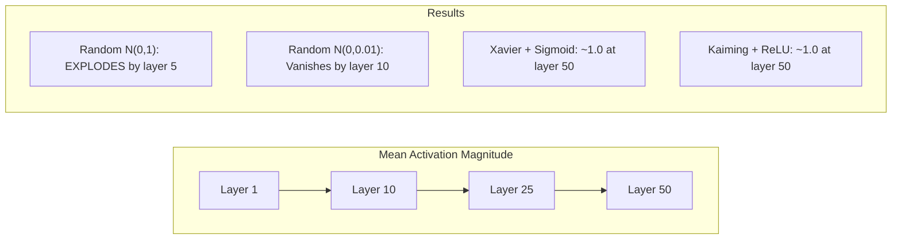
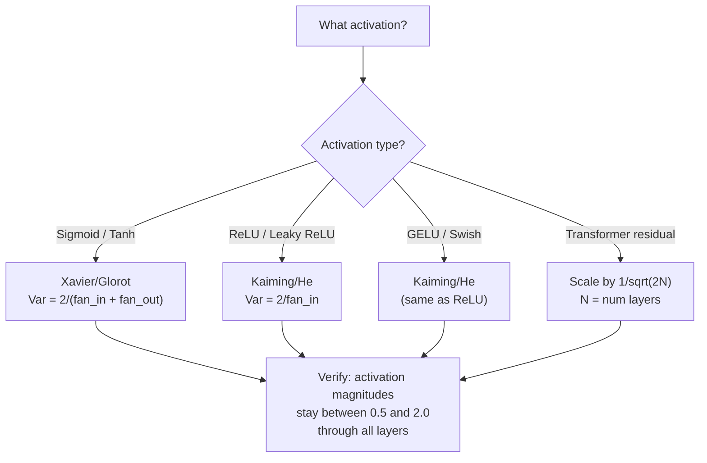

# Weight Initialization and Training Stability

> التهيئة الخاطئة والتدريب لا يبدأ أبدًا. قم بالتهيئة بشكل صحيح وسيتم تدريب 50 طبقة بسلاسة مثل 3.

**النوع:** بناء
** اللغات: ** بايثون
**المتطلبات:** الدرس 03.04 (وظائف التنشيط)، الدرس 03.07 (الانتظام)
**الوقت:** ~90 دقيقة

## Learning Objectives

- تنفيذ استراتيجيات التهيئة صفر وعشوائية وXavier/Glorot وKaiming/He وقياس تأثيرها على مقادير التنشيط من خلال 50 طبقة
- استنتج لماذا يستخدم Xavier init Var(w) = 2/(fan_in + fan_out) ويستخدم Kaiming Var(w) = 2/fan_in
- توضيح مشكلة التماثل مع التهيئة الصفرية وشرح سبب عدم كفاية المقياس العشوائي وحده
- قم بمطابقة استراتيجية التهيئة الصحيحة مع وظيفة التنشيط: Xavier لـ sigmoid/tanh، Kaiming لـ ReLU/GELU

## The Problem

تهيئة كافة الأوزان إلى الصفر. لا شيء يتعلم. تحسب كل خلية عصبية نفس الوظيفة، وتستقبل نفس التدرج، ويتم تحديثها بشكل مماثل. بعد مرور 10000 فترة، تظل الطبقة المخفية المكونة من 512 خلية عصبية عبارة عن 512 نسخة من نفس الخلية العصبية. لقد دفعت مقابل 512 معلمة وحصلت على 1.

تهيئة لهم كبيرة جدا. تنفجر عمليات التنشيط عبر الشبكة. بواسطة الطبقة 10، تصل القيم إلى 1e15. بواسطة الطبقة 20، يفيضون إلى ما لا نهاية. تتبع التدرجات نفس المسار في الاتجاه المعاكس.

قم بتهيئتها بشكل عشوائي من التوزيع الطبيعي القياسي. يعمل لمدة 3 طبقات. عند 50 طبقة، تنهار الإشارة إلى الصفر أو تنفجر إلى ما لا نهاية اعتمادًا على ما إذا كان المقياس العشوائي صغيرًا جدًا أو كبيرًا قليلاً جدًا. إن الحدود بين "الأعمال" و"المكسورة" ضئيلة للغاية.

إن تهيئة الوزن هو القرار الأكثر استخفافًا في التعلم العميق. العمارة تحصل على الأوراق. يحصل المحسنون على منشورات المدونة. التهيئة تحصل على حاشية سفلية. ولكن إذا أخطأت في الأمر، فلا شيء آخر يهم - فشبكتك ميتة قبل بدء التدريب.

## The Concept

### The Symmetry Problem

كل خلية عصبية في الطبقة لها نفس البنية: مضاعفة المدخلات بالأوزان، وإضافة التحيز، وتطبيق التنشيط. إذا بدأت جميع الأوزان بنفس القيمة (الصفر هو الحالة القصوى)، فإن كل خلية عصبية تحسب نفس الناتج. أثناء الانتشار العكسي، تتلقى كل خلية عصبية نفس التدرج. أثناء خطوة التحديث، تتغير كل خلية عصبية بنفس المقدار.

أنت عالق. تحتوي الشبكة على مئات المعلمات، لكنها جميعها تتحرك بشكل متزامن. وهذا ما يسمى التناظر، والتهيئة العشوائية هي طريقة القوة الغاشمة لكسر هذا التناظر. تبدأ كل خلية عصبية عند نقطة مختلفة في مساحة الوزن، لذلك يتعلم كل منها ميزة مختلفة.

لكن "عشوائي" ليس كافيا. يحدد *مقياس* العشوائية ما إذا كانت الشبكة تتدرب أم لا.

### Variance Propagation Through Layers

خذ بعين الاعتبار طبقة واحدة تحتوي على مدخلات fan_in:

```
z = w1*x1 + w2*x2 + ... + w_n*x_n
```

إذا تم سحب كل وزن من توزيع ذو تباين Var(w) وكان لكل مدخل xi تباين Var(x)، فإن تباين الإخراج هو:

```
Var(z) = fan_in * Var(w) * Var(x)
```

إذا كان Var(w) = 1 وfan_in = 512، يكون تباين الإخراج 512x تباين الإدخال. بعد 10 طبقات: 512^10 = 1.2e27. لقد انفجرت الإشارة الخاصة بك.

إذا كان Var(w) = 0.001، فإن تباين الإخراج يتقلص بمقدار 0.001 * 512 = 0.512 لكل طبقة. بعد 10 طبقات: 0.512^10 = 0.00013. لقد اختفت إشارتك.

الهدف: اختر Var(w) بحيث يكون Var(z) = Var(x). يظل حجم الإشارة ثابتًا عبر الطبقات.

### Xavier/Glorot Initialization

استنتج Glorot وBengio (2010) الحل لتنشيط السيني والتانه. للحفاظ على التباين ثابتًا في كل من التمريرة الأمامية والخلفية:

```
Var(w) = 2 / (fan_in + fan_out)
```

ومن الناحية العملية، يتم سحب الأوزان من:

```
w ~ Uniform(-limit, limit)  where limit = sqrt(6 / (fan_in + fan_out))
```

or:

```
w ~ Normal(0, sqrt(2 / (fan_in + fan_out)))
```

يعمل هذا لأن السيني والتانه خطيان تقريبًا بالقرب من الصفر، حيث تعيش عمليات التنشيط التي تمت تهيئتها بشكل صحيح. يبقى التباين ثابتًا خلال عشرات الطبقات.

### Kaiming/He Initialization

يقتل ReLU نصف المخرجات (كل شيء سلبي يصبح صفراً). يتم تقليل قيمة fan_in الفعالة إلى النصف لأنه في المتوسط ​​يتم صفر نصف المدخلات. Xavier init لا يأخذ في الاعتبار هذا - فهو يقلل من تقدير التباين المطلوب.

هو وآخرون. (2015) تعديل الصيغة:

```
Var(w) = 2 / fan_in
```

يتم سحب الأوزان من:

```
w ~ Normal(0, sqrt(2 / fan_in))
```

يعوض العامل 2 عن تصفير ReLU لنصف عمليات التنشيط. وبدون ذلك، تتقلص الإشارة بمعدل 0.5x تقريبًا لكل طبقة. مع 50 طبقة: 0.5^50 = 8.8e-16. Kaiming init يمنع هذا.

### Transformer Initialization

GPT-2 قدم نمطًا مختلفًا. تضيف الاتصالات المتبقية مخرجات كل طبقة فرعية إلى مدخلاتها:

```
x = x + sublayer(x)
```

كل إضافة تزيد من التباين. مع N الطبقات المتبقية، ينمو التباين بشكل متناسب مع N. GPT-2 يقيس أوزان الطبقات المتبقية بمقدار 1/sqrt(2N)، حيث N هو عدد الطبقات. وهذا يحافظ على استقرار حجم الإشارة المتراكمة.

يستخدم Llama 3 (معلمات 405B، 126 طبقة) مخططًا مشابهًا. وبدون هذا القياس، فإن التدفق المتبقي سوف ينمو بلا حدود من خلال 126 طبقة من الاهتمام وكتل التغذية.

```mermaid
flowchart TD
    subgraph "Zero Init"
        Z1["Layer 1<br/>All weights = 0"] --> Z2["Layer 2<br/>All neurons identical"]
        Z2 --> Z3["Layer 3<br/>Still identical"]
        Z3 --> ZR["Result: 1 effective neuron<br/>regardless of width"]
    end

    subgraph "Xavier Init"
        X1["Layer 1<br/>Var = 2/(fan_in+fan_out)"] --> X2["Layer 2<br/>Signal stable"]
        X2 --> X3["Layer 50<br/>Signal stable"]
        X3 --> XR["Result: Trains with<br/>sigmoid/tanh"]
    end

    subgraph "Kaiming Init"
        K1["Layer 1<br/>Var = 2/fan_in"] --> K2["Layer 2<br/>Signal stable"]
        K2 --> K3["Layer 50<br/>Signal stable"]
        K3 --> KR["Result: Trains with<br/>ReLU/GELU"]
    end
```



### Activation Magnitude Through 50 Layers



### Choosing the Right Init



## Build It

### Step 1: Initialization Strategies

أربع طرق لتهيئة مصفوفة الوزن. يُرجع كل منها قائمة من القوائم (مصفوفة ثنائية الأبعاد) مع أعمدة fan_in وصفوف fan_out.

```python
import math
import random


def zero_init(fan_in, fan_out):
    return [[0.0 for _ in range(fan_in)] for _ in range(fan_out)]


def random_init(fan_in, fan_out, scale=1.0):
    return [[random.gauss(0, scale) for _ in range(fan_in)] for _ in range(fan_out)]


def xavier_init(fan_in, fan_out):
    std = math.sqrt(2.0 / (fan_in + fan_out))
    return [[random.gauss(0, std) for _ in range(fan_in)] for _ in range(fan_out)]


def kaiming_init(fan_in, fan_out):
    std = math.sqrt(2.0 / fan_in)
    return [[random.gauss(0, std) for _ in range(fan_in)] for _ in range(fan_out)]
```

### Step 2: Activation Functions

نحتاج إلى sigmoid وtanh وReLU لاختبار كل استراتيجية init مع التنشيط المقصود.

```python
def sigmoid(x):
    x = max(-500, min(500, x))
    return 1.0 / (1.0 + math.exp(-x))


def tanh_act(x):
    return math.tanh(x)


def relu(x):
    return max(0.0, x)
```

### Step 3: Forward Pass Through 50 Layers

قم بتمرير بيانات عشوائية عبر شبكة عميقة وقياس متوسط ​​حجم التنشيط في كل طبقة.

```python
def forward_deep(init_fn, activation_fn, n_layers=50, width=64, n_samples=100):
    random.seed(42)
    layer_magnitudes = []

    inputs = [[random.gauss(0, 1) for _ in range(width)] for _ in range(n_samples)]

    for layer_idx in range(n_layers):
        weights = init_fn(width, width)
        biases = [0.0] * width

        new_inputs = []
        for sample in inputs:
            output = []
            for neuron_idx in range(width):
                z = sum(weights[neuron_idx][j] * sample[j] for j in range(width)) + biases[neuron_idx]
                output.append(activation_fn(z))
            new_inputs.append(output)
        inputs = new_inputs

        magnitudes = []
        for sample in inputs:
            magnitudes.append(sum(abs(v) for v in sample) / width)
        mean_mag = sum(magnitudes) / len(magnitudes)
        layer_magnitudes.append(mean_mag)

    return layer_magnitudes
```

### Step 4: The Experiment

قم بتشغيل جميع المجموعات: صفر init، عشوائي N(0,1)، عشوائي N(0,0.01)، Xavier مع السيني، Xavier مع tanh، Kaiming مع ReLU. اطبع الحجم في الطبقات الرئيسية.

```python
def run_experiment():
    configs = [
        ("Zero init + Sigmoid", lambda fi, fo: zero_init(fi, fo), sigmoid),
        ("Random N(0,1) + ReLU", lambda fi, fo: random_init(fi, fo, 1.0), relu),
        ("Random N(0,0.01) + ReLU", lambda fi, fo: random_init(fi, fo, 0.01), relu),
        ("Xavier + Sigmoid", xavier_init, sigmoid),
        ("Xavier + Tanh", xavier_init, tanh_act),
        ("Kaiming + ReLU", kaiming_init, relu),
    ]

    print(f"{'Strategy':<30} {'L1':>10} {'L5':>10} {'L10':>10} {'L25':>10} {'L50':>10}")
    print("-" * 80)

    for name, init_fn, act_fn in configs:
        mags = forward_deep(init_fn, act_fn)
        row = f"{name:<30}"
        for idx in [0, 4, 9, 24, 49]:
            val = mags[idx]
            if val > 1e6:
                row += f" {'EXPLODED':>10}"
            elif val < 1e-6:
                row += f" {'VANISHED':>10}"
            else:
                row += f" {val:>10.4f}"
        print(row)
```

### Step 5: Symmetry Demonstration

أظهر أن الصفر init ينتج خلايا عصبية متطابقة.

```python
def symmetry_demo():
    random.seed(42)
    weights = zero_init(2, 4)
    biases = [0.0] * 4

    inputs = [0.5, -0.3]
    outputs = []
    for neuron_idx in range(4):
        z = sum(weights[neuron_idx][j] * inputs[j] for j in range(2)) + biases[neuron_idx]
        outputs.append(sigmoid(z))

    print("\nSymmetry Demo (4 neurons, zero init):")
    for i, out in enumerate(outputs):
        print(f"  Neuron {i}: output = {out:.6f}")
    all_same = all(abs(outputs[i] - outputs[0]) < 1e-10 for i in range(len(outputs)))
    print(f"  All identical: {all_same}")
    print(f"  Effective parameters: 1 (not {len(weights) * len(weights[0])})")
```

### Step 6: Layer-by-Layer Magnitude Report

اطبع مخططًا شريطيًا مرئيًا لأحجام التنشيط من خلال 50 طبقة.

```python
def magnitude_report(name, magnitudes):
    print(f"\n{name}:")
    for i, mag in enumerate(magnitudes):
        if i % 5 == 0 or i == len(magnitudes) - 1:
            if mag > 1e6:
                bar = "X" * 50 + " EXPLODED"
            elif mag < 1e-6:
                bar = "." + " VANISHED"
            else:
                bar_len = min(50, max(1, int(mag * 10)))
                bar = "#" * bar_len
            print(f"  Layer {i+1:3d}: {bar} ({mag:.6f})")
```

## Use It

PyTorch يوفر هذه الوظائف المضمنة:

```python
import torch
import torch.nn as nn

layer = nn.Linear(512, 256)

nn.init.xavier_uniform_(layer.weight)
nn.init.xavier_normal_(layer.weight)

nn.init.kaiming_uniform_(layer.weight, nonlinearity='relu')
nn.init.kaiming_normal_(layer.weight, nonlinearity='relu')

nn.init.zeros_(layer.bias)
```

عند الاتصال بـ `nn.Linear(512, 256)`، يكون PyTorch افتراضيًا لتهيئة Kaiming الموحدة. لهذا السبب فإن معظم الشبكات البسيطة "تعمل فقط" -- PyTorch اتخذت بالفعل الاختيار الصحيح. ولكن عندما تقوم بإنشاء بنيات مخصصة أو تتعمق أكثر من 20 طبقة، فإنك تحتاج إلى فهم ما يحدث وربما تجاوز الإعداد الافتراضي.

بالنسبة للمحولات، تتعامل نماذج HuggingFace عادةً مع التهيئة بالطريقة `_init_weights` الخاصة بها. يقوم تنفيذ GPT-2 بقياس التوقعات المتبقية بمقدار 1/sqrt(N). إذا كنت تقوم ببناء محول من الصفر، فستحتاج إلى إضافة هذا بنفسك.

## Ship It

ينتج هذا الدرس:
- `outputs/prompt-init-strategy.md` -- رسالة موجهة لتشخيص مشكلات تهيئة الوزن والتوصية بالاستراتيجية الصحيحة

## Exercises

1. أضف تهيئة LeCun (Var = 1/fan_in، المصمم لتنشيط SELU). قم بإجراء تجربة مكونة من 50 طبقة باستخدام LeCun init + tanh وقارنها بـ Xavier + tanh.

2. قم بتنفيذ القياس المتبقي GPT-2: اضرب ناتج كل طبقة بـ 1/sqrt(2*N) قبل إضافته إلى التدفق المتبقي. قم بتشغيل 50 طبقة مع وبدون تغيير الحجم، وقم بقياس مدى سرعة نمو الحجم المتبقي.

3. قم بإنشاء وظيفة "init health check" التي تأخذ أبعاد طبقة الشبكة ونوع التنشيط، ثم توصي بالتهيئة الصحيحة وتحذر إذا كان الحرف init الحالي سيسبب مشاكل.

4. قم بإجراء التجربة باستخدام fan_in = 16 vs fan_in = 1024. يتكيف Xavier وKaiming مع fan_in، لكن init العشوائي لا يفعل ذلك. أظهر كيف تتسع الفجوة بين "الأعمال" و"الفواصل" مع الطبقات الأكبر.

5. تنفيذ التهيئة المتعامدة (إنشاء مصفوفة عشوائية، حساب SVD، استخدام المصفوفة المتعامدة U). قارنه بـ Kaiming لشبكات ReLU ذات 50 طبقة.

## Key Terms

| مصطلح | ماذا يقول الناس | ماذا يعني في الواقع |
|------|----------------|----------------------|
| تهيئة الوزن | "ضبط أوزان البداية بشكل عشوائي" | استراتيجية اختيار قيم الوزن الأولية التي تحدد ما إذا كان بإمكان الشبكة التدريب على الإطلاق |
| كسر التماثل | "اجعل الخلايا العصبية مختلفة" | استخدام التهيئة العشوائية للتأكد من أن الخلايا العصبية تتعلم ميزات مميزة بدلاً من حساب وظائف متطابقة |
| مروحة | "عدد المدخلات إلى الخلية العصبية" | عدد الاتصالات الواردة، الذي يحدد كيفية تراكم تباين الإدخال في المجموع المرجح |
| مروحة خارج | "عدد النواتج من الخلية العصبية" | عدد الاتصالات الصادرة ذات الصلة بالحفاظ على تباين التدرج أثناء الانتشار الخلفي |
| كزافييه/جلوروت الحرف الأول | "التهيئة السيني" | Var(w) = 2/(fan_in + fan_out)، مصمم للحفاظ على التباين من خلال التنشيط السيني والتانه |
| كايمينغ / هو بادئ | "تهيئة ReLU" | Var(w) = 2/fan_in، يمثل ReLU نصف عمليات التنشيط |
| انتشار التباين | "كيف تنمو الإشارات أو تتقلص عبر الطبقات" | التحليل الرياضي لكيفية تغير تباين التنشيط طبقة بعد طبقة بناءً على مقياس الوزن |
| التحجيم المتبقي | "خدعة init لـ GPT-2" | تحجيم أوزان التوصيل المتبقية بمقدار 1/sqrt(2N) لمنع نمو التباين من خلال طبقات المحولات N |
| شبكة ميتة | "لا شيء قطارات" | شبكة حيث تؤدي التهيئة الضعيفة إلى جعل جميع التدرجات صفرًا أو تشبع جميع عمليات التنشيط |
| انفجار التنشيط | "القيم تذهب إلى اللانهاية" | عندما يكون تباين الوزن مرتفعًا جدًا، مما يتسبب في زيادة مقادير التنشيط بشكل كبير عبر الطبقات |

## Further Reading

- Glorot & Bengio، "فهم صعوبة تدريب الشبكات العصبية المغذية العميقة" (2010) - ورقة التهيئة الأصلية لـ Xavier مع تحليل التباين
- هو وآخرون، "التعمق في المقومات" (2015) - قدموا تهيئة Kaiming لشبكات ReLU
- رادفورد وآخرون، "نماذج اللغة هي متعلمون متعددو المهام غير خاضعين للرقابة" (2019) -- GPT-2 ورقة مع تهيئة القياس المتبقي
- ميشكين وماتاس، "كل ما تحتاجه هو بداية جيدة" (2016) - تهيئة تباين الوحدة المتسلسلة للطبقة، وهو بديل تجريبي للصيغ التحليلية
